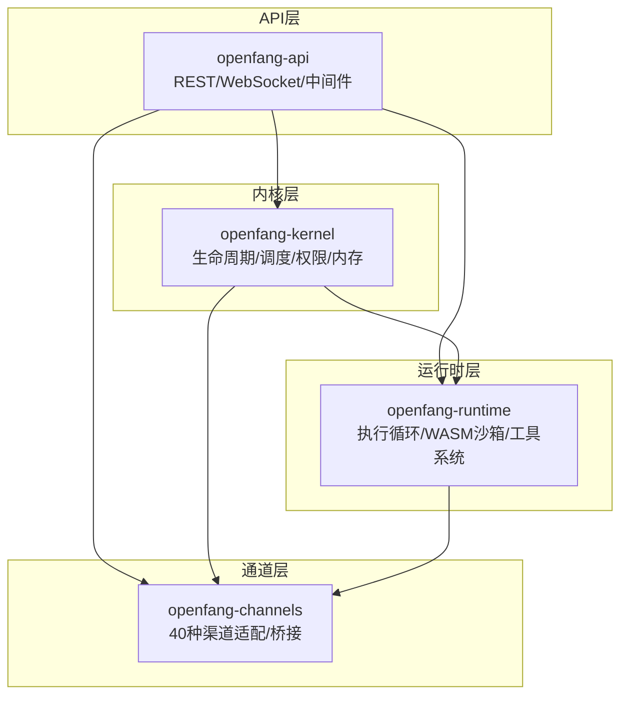
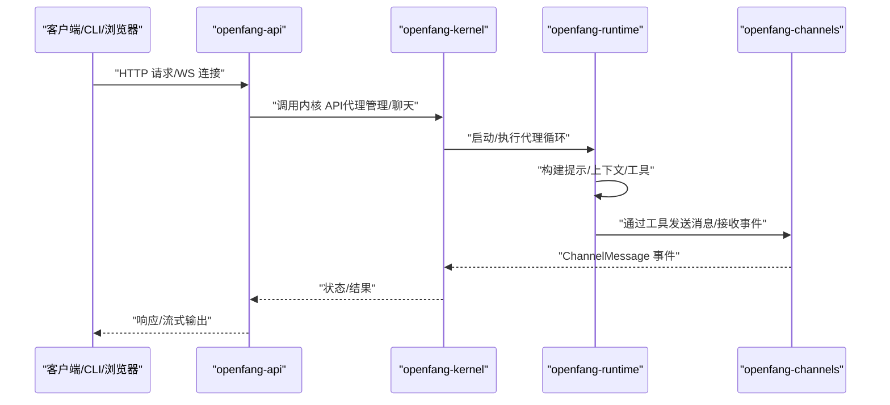
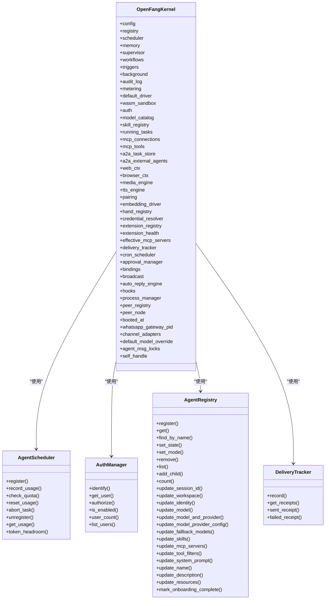
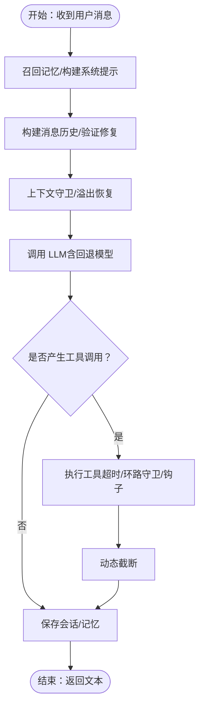
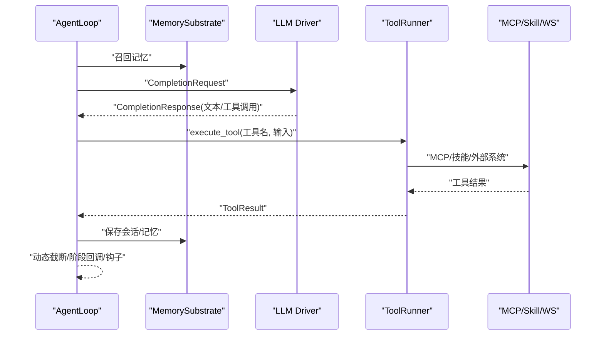
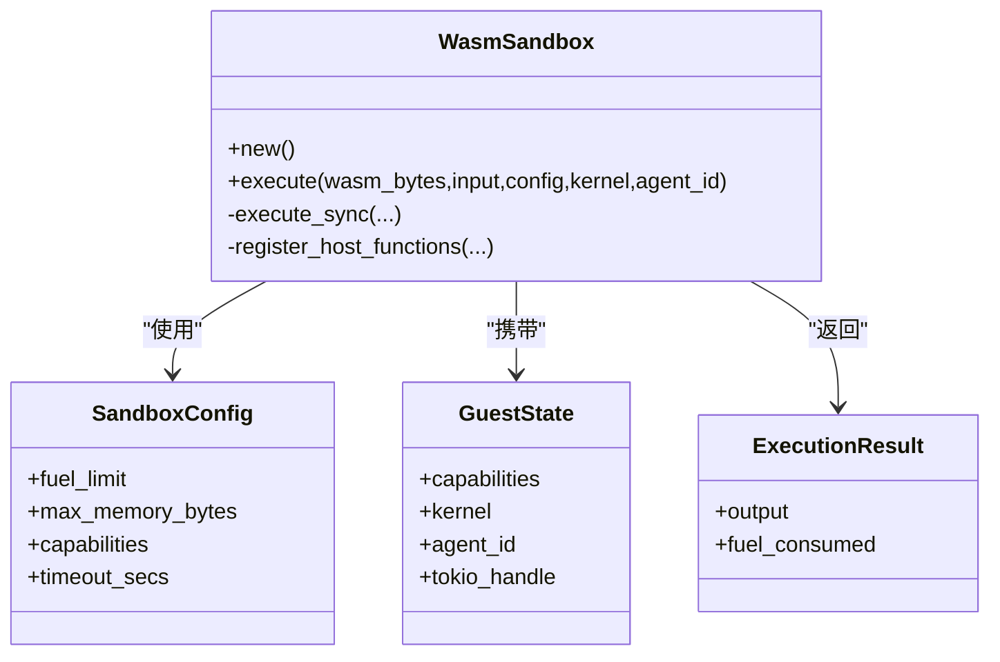
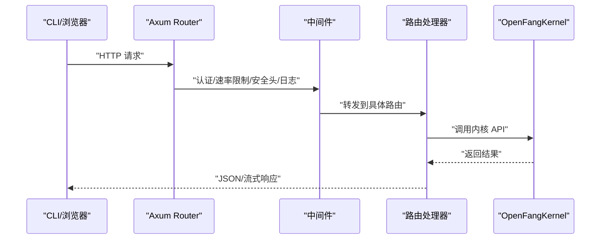
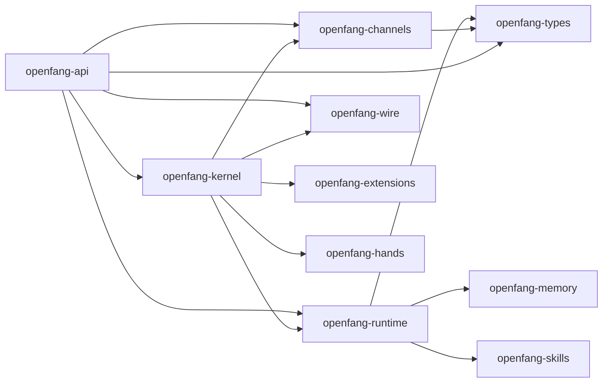

# 核心模块详解

<cite>
**本文档引用的文件**
- [openfang-kernel/Cargo.toml](file://crates/openfang-kernel/Cargo.toml)
- [openfang-runtime/Cargo.toml](file://crates/openfang-runtime/Cargo.toml)
- [openfang-api/Cargo.toml](file://crates/openfang-api/Cargo.toml)
- [openfang-channels/Cargo.toml](file://crates/openfang-channels/Cargo.toml)
- [openfang-kernel/src/lib.rs](file://crates/openfang-kernel/src/lib.rs)
- [openfang-runtime/src/lib.rs](file://crates/openfang-runtime/src/lib.rs)
- [openfang-api/src/lib.rs](file://crates/openfang-api/src/lib.rs)
- [openfang-channels/src/lib.rs](file://crates/openfang-channels/src/lib.rs)
- [openfang-kernel/src/kernel.rs](file://crates/openfang-kernel/src/kernel.rs)
- [openfang-kernel/src/scheduler.rs](file://crates/openfang-kernel/src/scheduler.rs)
- [openfang-kernel/src/auth.rs](file://crates/openfang-kernel/src/auth.rs)
- [openfang-kernel/src/registry.rs](file://crates/openfang-kernel/src/registry.rs)
- [openfang-runtime/src/agent_loop.rs](file://crates/openfang-runtime/src/agent_loop.rs)
- [openfang-runtime/src/sandbox.rs](file://crates/openfang-runtime/src/sandbox.rs)
- [openfang-runtime/src/tool_runner.rs](file://crates/openfang-runtime/src/tool_runner.rs)
- [openfang-api/src/server.rs](file://crates/openfang-api/src/server.rs)
</cite>

## 目录
1. [简介](#简介)
2. [项目结构](#项目结构)
3. [核心组件](#核心组件)
4. [架构总览](#架构总览)
5. [详细组件分析](#详细组件分析)
6. [依赖分析](#依赖分析)
7. [性能考虑](#性能考虑)
8. [故障排除指南](#故障排除指南)
9. [结论](#结论)
10. [附录](#附录)

## 简介
本文件面向 OpenFang 核心模块的使用者与贡献者，系统性梳理 openfang-kernel（内核）、openfang-runtime（运行时）、openfang-api（HTTP/WebSocket API）、openfang-channels（40种渠道桥接）四大核心 crate 的实现细节、调用关系、接口设计与使用模式。文档以“从代码到实践”的方式，结合真实源码路径与图示，帮助初学者快速上手，同时为有经验的开发者提供足够的技术深度。

## 项目结构
四个核心 crate 的组织遵循“按领域分层”的原则：内核负责生命周期、调度与权限；运行时负责执行循环、WASM 沙箱与工具系统；API 层提供 REST 与 WebSocket；通道层提供 40 种消息平台适配。

图表来源
- [openfang-kernel/src/lib.rs:1-30](file://crates/openfang-kernel/src/lib.rs#L1-L30)
- [openfang-runtime/src/lib.rs:1-59](file://crates/openfang-runtime/src/lib.rs#L1-L59)
- [openfang-api/src/lib.rs:1-18](file://crates/openfang-api/src/lib.rs#L1-L18)
- [openfang-channels/src/lib.rs:1-55](file://crates/openfang-channels/src/lib.rs#L1-L55)

章节来源
- [openfang-kernel/Cargo.toml:1-45](file://crates/openfang-kernel/Cargo.toml#L1-L45)
- [openfang-runtime/Cargo.toml:1-39](file://crates/openfang-runtime/Cargo.toml#L1-L39)
- [openfang-api/Cargo.toml:1-46](file://crates/openfang-api/Cargo.toml#L1-L46)
- [openfang-channels/Cargo.toml:1-43](file://crates/openfang-channels/Cargo.toml#L1-L43)

## 核心组件
- openfang-kernel：统一装配所有子系统，提供主 API，管理代理生命周期、调度、权限、内存、工作流、触发器、后台执行、审计与计量等。
- openfang-runtime：提供代理执行循环、LLM 驱动抽象、工具执行、WASM 沙箱、浏览器自动化、媒体理解、TTS 等能力。
- openfang-api：基于 Axum 构建的 HTTP/WebSocket 服务，暴露代理管理、聊天、状态查询、频道配置、技能市场、审计日志等端点。
- openfang-channels：提供 40 种消息平台适配（Discord、Slack、Telegram、WhatsApp、Teams 等），统一转换为内核事件。

章节来源
- [openfang-kernel/src/lib.rs:1-30](file://crates/openfang-kernel/src/lib.rs#L1-L30)
- [openfang-runtime/src/lib.rs:1-59](file://crates/openfang-runtime/src/lib.rs#L1-L59)
- [openfang-api/src/lib.rs:1-18](file://crates/openfang-api/src/lib.rs#L1-L18)
- [openfang-channels/src/lib.rs:1-55](file://crates/openfang-channels/src/lib.rs#L1-L55)

## 架构总览
下图展示内核、运行时、API 与通道之间的交互关系与数据流向。

图表来源
- [openfang-api/src/server.rs:37-722](file://crates/openfang-api/src/server.rs#L37-L722)
- [openfang-kernel/src/kernel.rs:505-800](file://crates/openfang-kernel/src/kernel.rs#L505-L800)
- [openfang-runtime/src/agent_loop.rs:145-605](file://crates/openfang-runtime/src/agent_loop.rs#L145-L605)
- [openfang-channels/src/lib.rs:1-55](file://crates/openfang-channels/src/lib.rs#L1-L55)

## 详细组件分析

### openfang-kernel：内核与生命周期管理
- 主要职责
  - 统一装配：内存子系统、调度器、工作流引擎、触发器、后台执行器、审计与计量、WASM 沙箱、认证与权限、扩展与集成注册表等。
  - 生命周期：代理注册、状态与模式管理、会话切换、资源配额与用量统计、取消任务支持。
  - 权限控制：RBAC 用户身份解析、动作授权、用户绑定索引。
  - 交付跟踪：按代理维护最近的投递收据，带全局与单代理上限。
- 关键结构
  - OpenFangKernel：包含配置、注册表、调度器、内存、监督器、工作流、触发器、后台执行器、审计日志、计量引擎、默认 LLM 驱动、WASM 沙箱、认证管理、模型目录、技能与手部注册表、MCP 工具缓存、浏览器与媒体引擎、TTS 引擎、配对管理、嵌入驱动、进程管理、设备对等节点与注册表、启动时间、WhatsApp 网关 PID、通道适配器集合、默认模型覆盖、代理消息锁、自引用弱句柄等。
  - AgentScheduler：按小时滚动窗口追踪令牌与工具调用次数，支持配额检查与重置。
  - AuthManager：用户角色与动作授权，支持从通道标识解析用户身份。
  - AgentRegistry：代理条目、名称与标签索引、状态/模式更新、资源配额更新、会话与工作区更新、身份信息更新等。
  - DeliveryTracker：限制总量与每代理数量，维护最近收据并进行清理。
- 典型流程
  - 内核引导：加载配置、初始化内存、凭证解析、驱动链（主驱动+回退）、模型目录检测与 URL 覆盖、技能与手部注册表、扩展注册表、WASM 沙箱、认证管理、扩展健康监控、A2A 任务存储与外部代理卡片、Web 工具上下文、浏览器管理器、媒体引擎、TTS 引擎、配对管理、嵌入驱动、进程管理、对等网络节点与注册表、启动时间、WhatsApp 网关 PID、通道适配器集合、默认模型覆盖、代理消息锁、自引用设置。
  - 代理注册与状态变更：注册新代理、按名称查找、设置状态/模式、移除代理、列表、添加子代理、更新会话 ID/工作区/身份/模型/技能/MCP 服务器/工具过滤/系统提示/名称/描述/资源配额/上线完成标记等。
  - 调度与配额：注册配额、记录用量、检查配额、重置用量、中止任务、注销、获取用量、剩余令牌头寸。
  - 认证与授权：识别用户、获取用户信息、授权动作、启用判断、用户数量、列出用户。
  - 交付跟踪：记录收据、获取收据、成功/失败收据生成、收据清理。

图表来源
- [openfang-kernel/src/kernel.rs:60-164](file://crates/openfang-kernel/src/kernel.rs#L60-L164)
- [openfang-kernel/src/scheduler.rs:44-145](file://crates/openfang-kernel/src/scheduler.rs#L44-L145)
- [openfang-kernel/src/auth.rs:98-189](file://crates/openfang-kernel/src/auth.rs#L98-L189)
- [openfang-kernel/src/registry.rs:8-151](file://crates/openfang-kernel/src/registry.rs#L8-L151)
- [openfang-kernel/src/kernel.rs:166-270](file://crates/openfang-kernel/src/kernel.rs#L166-L270)

章节来源
- [openfang-kernel/src/kernel.rs:505-800](file://crates/openfang-kernel/src/kernel.rs#L505-L800)
- [openfang-kernel/src/scheduler.rs:53-145](file://crates/openfang-kernel/src/scheduler.rs#L53-L145)
- [openfang-kernel/src/auth.rs:105-189](file://crates/openfang-kernel/src/auth.rs#L105-L189)
- [openfang-kernel/src/registry.rs:17-345](file://crates/openfang-kernel/src/registry.rs#L17-L345)
- [openfang-kernel/src/kernel.rs:166-270](file://crates/openfang-kernel/src/kernel.rs#L166-L270)

### openfang-runtime：执行循环、WASM 沙箱与工具系统
- 执行循环
  - 接收用户消息、召回记忆、构建系统提示与消息历史、上下文预算与溢出恢复、调用 LLM、解析工具调用、执行工具、动态截断、保存会话与记忆、钩子与阶段回调、空响应保护、幻觉动作检测、回复指令解析、NO_REPLY/silent 处理、成本统计占位。
- WASM 沙箱
  - 基于 Wasmtime，启用燃料计量与按 epoch 中断，导出内存、分配与执行函数，提供 host_call/host_log，能力检查，超时与燃料耗尽错误处理。
- 工具系统
  - 内置工具定义与执行：文件系统、Web 抓取/搜索、Shell 执行（策略与污点检查）、跨代理通信、共享内存、协作与调度、知识图谱、图像分析、媒体理解、TTS/STT、Docker 执行、位置、系统时间、Cron、频道发送、持久化进程、手部能力包、A2A、浏览器自动化、Canvas/A2UI 等。
  - 安全与策略：能力白名单、审批门禁、执行策略（允许/禁止/全放行）、污点注入检测（Shell/网络）、MCP 工具分发、技能注册表工具分发。
- 关键流程
  - 代理循环：记忆召回→构建提示→消息验证修复→上下文守卫→LLM 调用（含回退模型）→文本工具调用恢复→阶段回调→工具执行（带超时/环路守卫/钩子）→动态截断→保存会话与记忆→钩子→返回结果。
  - WASM 执行：编译模块→实例化→导入 host 函数→写入输入→调用 execute→读取输出→计算燃料消耗→错误分类（燃料耗尽/超时/ABI 错误）。
  - 工具执行：规范化工具名→能力检查→审批门禁→根据类型分派（内置/技能/MCP）→安全策略与污点检查→超时包装→钩子→动态截断→返回结果。

图表来源
- [openfang-runtime/src/agent_loop.rs:145-605](file://crates/openfang-runtime/src/agent_loop.rs#L145-L605)

图表来源
- [openfang-runtime/src/agent_loop.rs:145-605](file://crates/openfang-runtime/src/agent_loop.rs#L145-L605)
- [openfang-runtime/src/tool_runner.rs:99-526](file://crates/openfang-runtime/src/tool_runner.rs#L99-L526)

图表来源
- [openfang-runtime/src/sandbox.rs:94-275](file://crates/openfang-runtime/src/sandbox.rs#L94-L275)

章节来源
- [openfang-runtime/src/agent_loop.rs:145-605](file://crates/openfang-runtime/src/agent_loop.rs#L145-L605)
- [openfang-runtime/src/sandbox.rs:94-275](file://crates/openfang-runtime/src/sandbox.rs#L94-L275)
- [openfang-runtime/src/tool_runner.rs:99-526](file://crates/openfang-runtime/src/tool_runner.rs#L99-L526)

### openfang-api：REST 与 WebSocket
- 路由与中间件
  - 路由覆盖：代理管理、聊天、会话、模板、内存、触发器、计划任务、工作流、技能、手部、MCP、审计、日志、网络/对等、通信、工具、配置、审批、用量、会话、安全、模型目录、Copilot OAuth、迁移、Cron、Webhook、A2A、集成、配对、MCP HTTP、OpenAI 兼容端点等。
  - 中间件：认证（API Key 或会话）、速率限制（GCRA）、安全头、请求日志、压缩、追踪、CORS（根据认证状态调整）。
- 启动流程
  - 构建路由与共享状态（内核、启动时间、对等注册表、桥接管理器、通道配置、关闭通知、缓存、探针缓存）。
  - 启动通道桥接（Telegram、Discord、Slack 等）。
  - 写入守护进程信息文件（PID、监听地址、启动时间、版本、平台），并进行冲突检测。
  - 启动热重载配置文件（30 秒轮询）。
- WebSocket
  - 提供代理专用 WS 端点，用于实时聊天与事件推送。

图表来源
- [openfang-api/src/server.rs:37-722](file://crates/openfang-api/src/server.rs#L37-L722)

章节来源
- [openfang-api/src/server.rs:37-722](file://crates/openfang-api/src/server.rs#L37-L722)

### openfang-channels：40 种渠道集成与桥接
- 渠道覆盖
  - 基础：Discord、Slack、Telegram、WhatsApp、Teams、Google Chat、Matrix、Mattermost、Rocket.Chat、IRC、Zulip、XMPP 等。
  - 高价值：Bluesky、飞书、Line、Mastodon、Messenger、Reddit、Revolt、Viber 等。
  - 企业与社区：Flock、Guilded、Keybase、Nextcloud、Nostr、Pumble、Threema、Twist、Webex 等。
  - 小众：钉钉/Stream、Discourse、Gitter、Gotify、LinkedIn、Mumble、ntfy、Webhook、企业微信等。
- 桥接机制
  - 统一类型与事件：ChannelMessage、DeliveryReceipt、格式化器、路由器。
  - 适配器：每个平台独立模块，负责连接、认证、消息收发与事件转换。
  - 内核集成：通过工具系统或事件总线向内核注入消息，内核再驱动代理执行循环。

章节来源
- [openfang-channels/src/lib.rs:1-55](file://crates/openfang-channels/src/lib.rs#L1-L55)

## 依赖分析
- 依赖关系概览
  - openfang-kernel 依赖 openfang-types、openfang-memory、openfang-runtime、openfang-skills、openfang-hands、openfang-extensions、openfang-wire、openfang-channels。
  - openfang-runtime 依赖 openfang-types、openfang-memory、openfang-skills、wasmtime 等。
  - openfang-api 依赖 openfang-types、openfang-kernel、openfang-runtime、openfang-memory、openfang-channels、openfang-wire 等。
  - openfang-channels 依赖 openfang-types、reqwest、tokio、tokio-stream、axum、邮件/IMAP/TLS 等。
- 耦合与内聚
  - 内核作为中枢协调各子系统，耦合度高但职责清晰；运行时与通道层通过工具与事件解耦；API 层通过状态对象与中间件隔离业务逻辑。
- 外部依赖
  - LLM 驱动链（fallback 链）、WASM 时钟中断与燃料计量、Axum 生态（CORS、压缩、追踪）、Tokio 并发模型、DashMap 并发容器、Tracing 日志。

图表来源
- [openfang-kernel/Cargo.toml:8-38](file://crates/openfang-kernel/Cargo.toml#L8-L38)
- [openfang-runtime/Cargo.toml:8-31](file://crates/openfang-runtime/Cargo.toml#L8-L31)
- [openfang-api/Cargo.toml:8-18](file://crates/openfang-api/Cargo.toml#L8-L18)
- [openfang-channels/Cargo.toml:8-34](file://crates/openfang-channels/Cargo.toml#L8-L34)

章节来源
- [openfang-kernel/Cargo.toml:8-38](file://crates/openfang-kernel/Cargo.toml#L8-L38)
- [openfang-runtime/Cargo.toml:8-31](file://crates/openfang-runtime/Cargo.toml#L8-L31)
- [openfang-api/Cargo.toml:8-18](file://crates/openfang-api/Cargo.toml#L8-L18)
- [openfang-channels/Cargo.toml:8-34](file://crates/openfang-channels/Cargo.toml#L8-L34)

## 性能考虑
- 上下文预算与溢出恢复：在循环中对消息历史与工具结果进行动态截断，避免上下文溢出导致的性能与稳定性问题。
- 令牌配额与头寸：按小时滚动窗口统计令牌与工具调用，防止过载。
- 超时与环路守卫：工具执行超时、LLM 回退、环路守卫与电路断路器，避免无限循环与资源耗尽。
- WASM 燃料与时间片：启用燃料计量与 epoch 中断，确保 CPU 与时间片受控。
- 并发与锁：代理消息锁序列化同一代理的消息处理，避免会话损坏；DashMap 提供高并发读写。
- 缓存与预热：模型目录、探针缓存、桥接管理器、MCP 工具缓存减少重复初始化与查询开销。

## 故障排除指南
- LLM 驱动未配置或不可用
  - 现象：代理返回“缺少 API Key”或“无可用驱动”错误。
  - 处理：设置环境变量或配置文件中的 API Key；确认驱动链初始化顺序与回退模型配置；检查 URL 覆盖与认证状态。
  - 参考路径：[openfang-kernel/src/kernel.rs:591-717](file://crates/openfang-kernel/src/kernel.rs#L591-L717)
- 工具执行失败或被拒绝
  - 现象：工具返回错误或被审批系统拒绝。
  - 处理：检查工具能力白名单、执行策略、污点检查（Shell/网络）、审批门禁；查看钩子拦截原因。
  - 参考路径：[openfang-runtime/src/tool_runner.rs:136-171](file://crates/openfang-runtime/src/tool_runner.rs#L136-L171)
- WASM 执行异常
  - 现象：燃料耗尽、超时、ABI 错误。
  - 处理：调整燃料限制与超时；检查导出函数与内存边界；确认能力授予。
  - 参考路径：[openfang-runtime/src/sandbox.rs:177-275](file://crates/openfang-runtime/src/sandbox.rs#L177-L275)
- 通道发送失败
  - 现象：投递失败收据记录。
  - 处理：检查通道配置、凭据、网络连通性；查看 DeliveryTracker 收据清理策略。
  - 参考路径：[openfang-kernel/src/kernel.rs:189-270](file://crates/openfang-kernel/src/kernel.rs#L189-L270)
- API 认证与速率限制
  - 现象：401/403 或 429。
  - 处理：确认 API Key 或会话认证；调整 GCRA 速率限制；检查 CORS 配置。
  - 参考路径：[openfang-api/src/server.rs:106-120](file://crates/openfang-api/src/server.rs#L106-L120)

章节来源
- [openfang-kernel/src/kernel.rs:591-717](file://crates/openfang-kernel/src/kernel.rs#L591-L717)
- [openfang-runtime/src/tool_runner.rs:136-171](file://crates/openfang-runtime/src/tool_runner.rs#L136-L171)
- [openfang-runtime/src/sandbox.rs:177-275](file://crates/openfang-runtime/src/sandbox.rs#L177-L275)
- [openfang-kernel/src/kernel.rs:189-270](file://crates/openfang-kernel/src/kernel.rs#L189-L270)
- [openfang-api/src/server.rs:106-120](file://crates/openfang-api/src/server.rs#L106-L120)

## 结论
OpenFang 的核心模块围绕“内核—运行时—API—通道”四层架构展开，通过严格的生命周期管理、调度与权限控制、WASM 沙箱与工具系统、以及 40 种渠道适配，实现了可扩展、可观测、可审计的智能体操作系统。内核作为中枢协调各子系统，运行时提供强大的执行与安全能力，API 层提供完备的管理与聊天接口，通道层打通多平台消息生态。建议在生产环境中结合配额、审批、速率限制与安全策略，确保稳定与合规。

## 附录
- 使用模式与最佳实践
  - 代理生命周期：通过内核注册与状态管理，配合调度器的配额与用量统计，实现资源可控。
  - 权限控制：启用 RBAC 并为代理授予最小必要能力，结合审批门禁与执行策略。
  - 工具安全：优先使用内置工具与能力白名单，谨慎启用全放行模式；对 Shell 与网络操作进行污点检查。
  - WASM 安全：严格限制能力与超时，启用燃料计量；对外部系统调用进行能力检查。
  - 渠道集成：统一使用通道适配器与事件格式，确保消息一致性与可追溯性。
- 常见配置项参考
  - 内核配置：监听地址、API Key、模式（稳定/开发/默认）、数据目录、内存数据库路径、供应商 URL 覆盖、备用供应商、默认模型与 API Key 环境变量、广播配置等。
  - 运行时配置：用户代理、上下文窗口、工具超时、最大迭代次数、最大连续 MaxTokens、回退模型链、Docker 沙箱配置、执行策略等。
  - API 配置：CORS 允许来源、认证开关、会话密钥、速率限制策略、压缩与追踪等。
  - 通道配置：各平台的凭据、测试连接、重载与配对流程等。