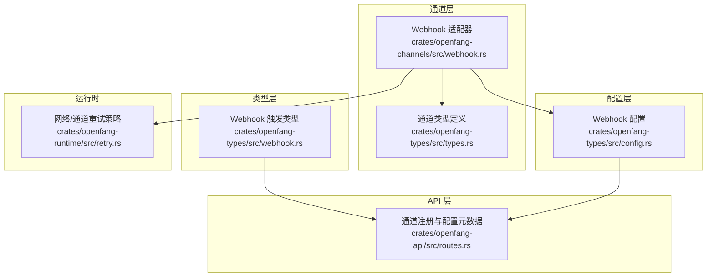
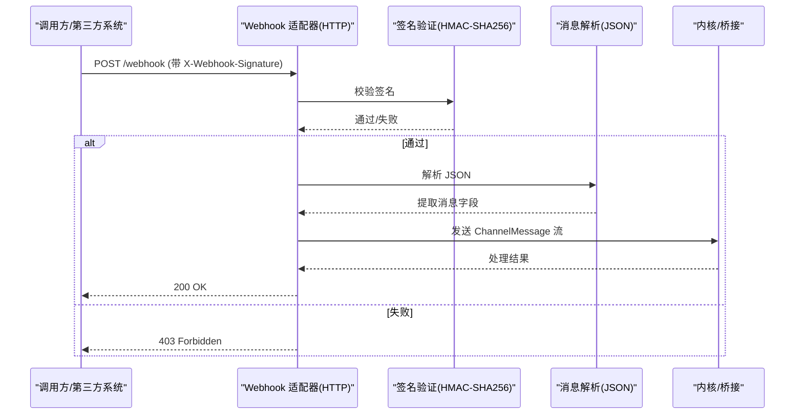
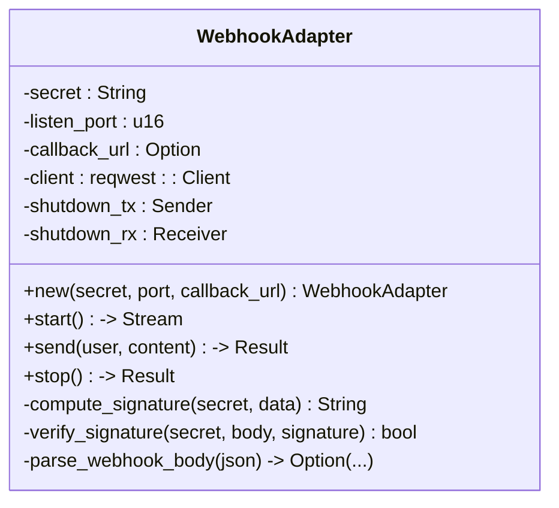
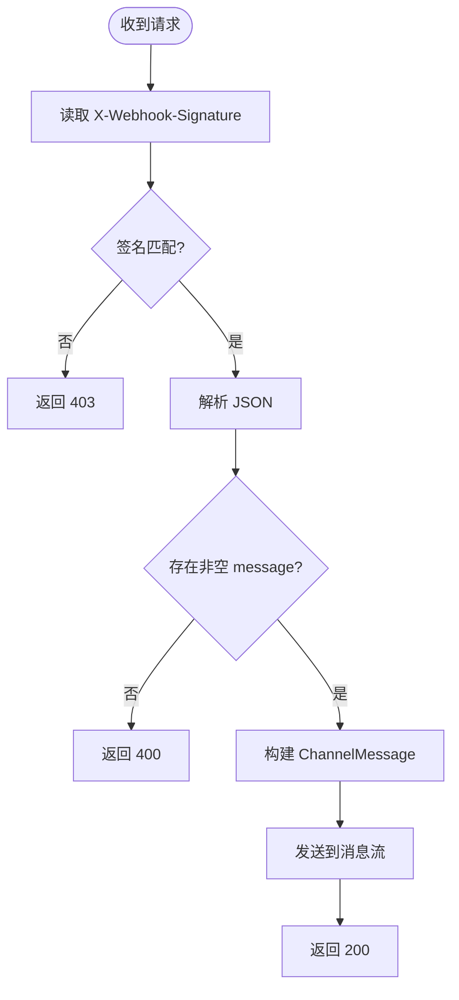
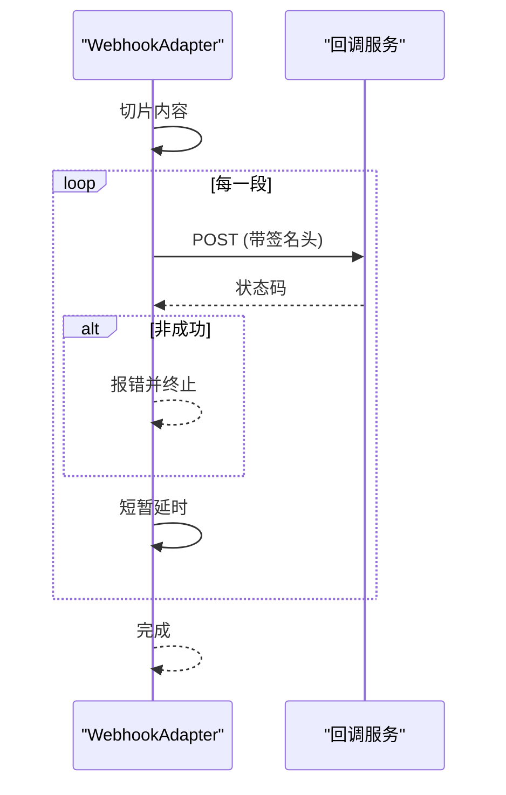
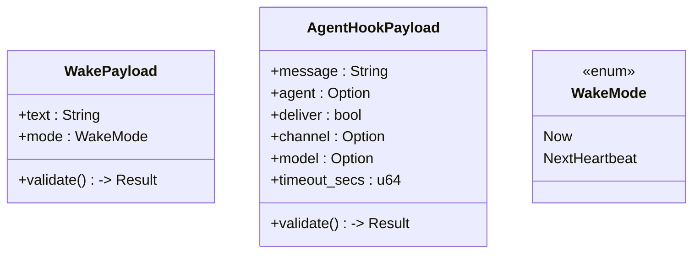
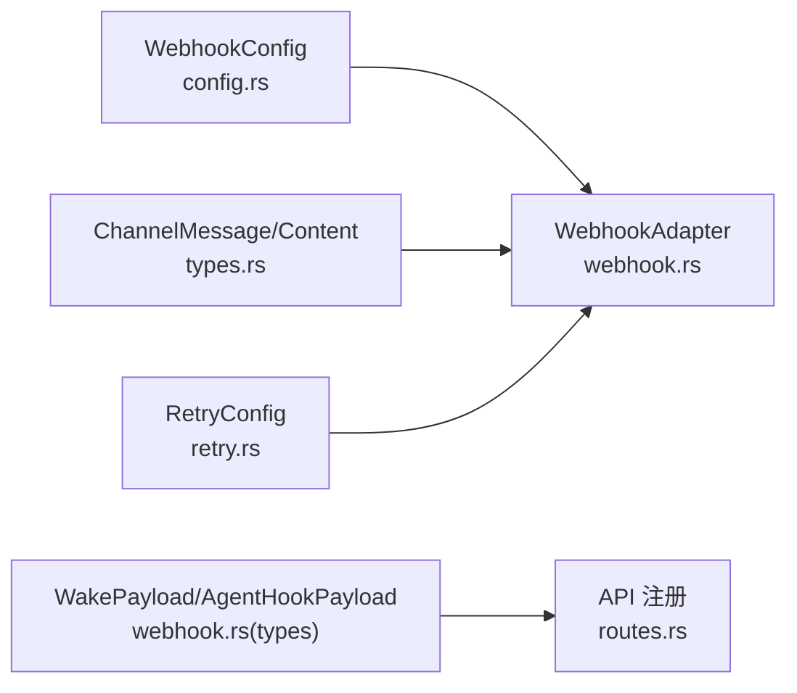

# Webhook 集成

<cite>
**本文引用的文件**
- [crates/openfang-channels/src/webhook.rs](file://crates/openfang-channels/src/webhook.rs)
- [crates/openfang-types/src/webhook.rs](file://crates/openfang-types/src/webhook.rs)
- [crates/openfang-types/src/config.rs](file://crates/openfang-types/src/config.rs)
- [crates/openfang-types/src/types.rs](file://crates/openfang-types/src/types.rs)
- [crates/openfang-api/src/routes.rs](file://crates/openfang-api/src/routes.rs)
- [crates/openfang-runtime/src/retry.rs](file://crates/openfang-runtime/src/retry.rs)
- [crates/openfang-channels/src/lib.rs](file://crates/openfang-channels/src/lib.rs)
- [openfang.toml.example](file://openfang.toml.example)
</cite>

## 目录
1. [简介](#简介)
2. [项目结构](#项目结构)
3. [核心组件](#核心组件)
4. [架构总览](#架构总览)
5. [详细组件分析](#详细组件分析)
6. [依赖关系分析](#依赖关系分析)
7. [性能与可靠性](#性能与可靠性)
8. [安全与合规](#安全与合规)
9. [配置与部署](#配置与部署)
10. [使用场景与示例](#使用场景与示例)
11. [监控与日志](#监控与日志)
12. [故障排除](#故障排除)
13. [结论](#结论)

## 简介
本文件面向 OpenFang 的 Webhook 集成适配器，系统性阐述其设计与实现：HTTP 接收、请求验证（HMAC-SHA256）、消息解析、响应处理；配置方法、签名验证、重试与超时策略；以及事件驱动集成、第三方服务对接、自定义消息格式等实践。同时覆盖安全考虑（认证、防重放、数据保护）、监控与日志、故障排除指南。

## 项目结构
Webhook 适配器位于通道层（channels），统一通过桥接（bridge）进入内核（kernel）。Webhook 类型定义与触发钩子在类型层（types），配置项在配置层（config），API 层（api）提供可视化配置入口。

**图表来源**
- [crates/openfang-channels/src/webhook.rs:1-479](file://crates/openfang-channels/src/webhook.rs#L1-L479)
- [crates/openfang-types/src/types.rs:1-200](file://crates/openfang-types/src/types.rs#L1-L200)
- [crates/openfang-types/src/webhook.rs:1-429](file://crates/openfang-types/src/webhook.rs#L1-L429)
- [crates/openfang-types/src/config.rs:2961-2988](file://crates/openfang-types/src/config.rs#L2961-L2988)
- [crates/openfang-api/src/routes.rs:2154-2155](file://crates/openfang-api/src/routes.rs#L2154-L2155)
- [crates/openfang-runtime/src/retry.rs:220-242](file://crates/openfang-runtime/src/retry.rs#L220-L242)

**章节来源**
- [crates/openfang-channels/src/lib.rs:53-53](file://crates/openfang-channels/src/lib.rs#L53-L53)
- [crates/openfang-types/src/config.rs:2961-2988](file://crates/openfang-types/src/config.rs#L2961-L2988)
- [crates/openfang-api/src/routes.rs:2154-2155](file://crates/openfang-api/src/routes.rs#L2154-L2155)

## 核心组件
- WebhookAdapter：通用 HTTP Webhook 适配器，支持入站（接收）与出站（发送）双向通信，基于 HMAC-SHA256 签名验证。
- WebhookConfig：Webhook 通道的配置模型，包含签名密钥环境变量、监听端口、回调地址、默认代理与行为覆盖。
- WakePayload/AgentHookPayload：系统事件注入与隔离代理回合的钩子载荷，用于非通道场景的事件驱动集成。
- ChannelMessage/ChannelContent：统一的消息与内容抽象，贯穿桥接与内核。

**章节来源**
- [crates/openfang-channels/src/webhook.rs:52-165](file://crates/openfang-channels/src/webhook.rs#L52-L165)
- [crates/openfang-types/src/config.rs:2961-2988](file://crates/openfang-types/src/config.rs#L2961-L2988)
- [crates/openfang-types/src/webhook.rs:16-46](file://crates/openfang-types/src/webhook.rs#L16-L46)
- [crates/openfang-types/src/types.rs:12-96](file://crates/openfang-types/src/types.rs#L12-L96)

## 架构总览
Webhook 适配器以 Axum 路由提供 HTTP 入站接口，接收并验证签名后解析 JSON，转换为统一消息流；出站通过可选回调 URL 发送，同样携带签名。配置层提供环境变量与参数化设置，API 层提供可视化配置入口。

**图表来源**
- [crates/openfang-channels/src/webhook.rs:192-272](file://crates/openfang-channels/src/webhook.rs#L192-L272)
- [crates/openfang-channels/src/webhook.rs:100-112](file://crates/openfang-channels/src/webhook.rs#L100-L112)
- [crates/openfang-channels/src/webhook.rs:114-159](file://crates/openfang-channels/src/webhook.rs#L114-L159)

## 详细组件分析

### WebhookAdapter 实现要点
- 启动 HTTP 服务器：绑定端口，注册 /webhook 路由，接收 POST 请求。
- 签名验证：从请求头提取签名，常量时间比较，防止时序攻击。
- 消息解析：从 JSON 中提取必要字段，支持命令式消息（以 / 开头自动识别为命令）。
- 出站发送：按最大长度切片，逐段发送至回调 URL，并附带相同签名。
- 停止机制：通过 watch 通道优雅关闭。

**图表来源**
- [crates/openfang-channels/src/webhook.rs:52-165](file://crates/openfang-channels/src/webhook.rs#L52-L165)

**章节来源**
- [crates/openfang-channels/src/webhook.rs:66-83](file://crates/openfang-channels/src/webhook.rs#L66-L83)
- [crates/openfang-channels/src/webhook.rs:177-302](file://crates/openfang-channels/src/webhook.rs#L177-L302)
- [crates/openfang-channels/src/webhook.rs:304-367](file://crates/openfang-channels/src/webhook.rs#L304-L367)

### 签名验证与消息解析流程
- 签名计算与验证：使用 HMAC-SHA256，返回 sha256= 前缀的十六进制字符串，采用常量时间比较。
- JSON 解析：要求存在非空 message 字段，其余字段具备默认值或可选。
- 命令识别：若 message 以 / 开头，则解析为命令内容，否则为文本内容。

**图表来源**
- [crates/openfang-channels/src/webhook.rs:201-269](file://crates/openfang-channels/src/webhook.rs#L201-L269)
- [crates/openfang-channels/src/webhook.rs:114-159](file://crates/openfang-channels/src/webhook.rs#L114-L159)

**章节来源**
- [crates/openfang-channels/src/webhook.rs:100-112](file://crates/openfang-channels/src/webhook.rs#L100-L112)
- [crates/openfang-channels/src/webhook.rs:222-266](file://crates/openfang-channels/src/webhook.rs#L222-L266)

### 出站发送与分片策略
- 内容切片：按最大长度阈值切分为多段，逐段发送。
- 签名附加：每段均计算并附加签名头。
- 延迟控制：多段发送之间插入短延迟，避免下游限流或拥塞。
- 错误处理：非成功状态码即报错并返回。

**图表来源**
- [crates/openfang-channels/src/webhook.rs:319-354](file://crates/openfang-channels/src/webhook.rs#L319-L354)

**章节来源**
- [crates/openfang-channels/src/webhook.rs:304-367](file://crates/openfang-channels/src/webhook.rs#L304-L367)

### Webhook 触发钩子（非通道事件）
- WakePayload：向系统注入事件，支持立即处理或下个心跳周期处理。
- AgentHookPayload：触发一次隔离代理回合，可指定代理、交付目标、模型与超时。

**图表来源**
- [crates/openfang-types/src/webhook.rs:5-14](file://crates/openfang-types/src/webhook.rs#L5-L14)
- [crates/openfang-types/src/webhook.rs:16-46](file://crates/openfang-types/src/webhook.rs#L16-L46)

**章节来源**
- [crates/openfang-types/src/webhook.rs:68-94](file://crates/openfang-types/src/webhook.rs#L68-L94)
- [crates/openfang-types/src/webhook.rs:96-131](file://crates/openfang-types/src/webhook.rs#L96-L131)

## 依赖关系分析
- 适配器依赖类型层的统一消息模型，确保跨通道一致性。
- 配置层提供 WebhookConfig，结合环境变量与默认值，决定运行参数。
- API 层注册 Webhook 通道元数据，便于前端配置与状态展示。
- 运行时提供网络与通道重试策略，提升稳定性。

**图表来源**
- [crates/openfang-types/src/config.rs:2961-2988](file://crates/openfang-types/src/config.rs#L2961-L2988)
- [crates/openfang-channels/src/webhook.rs:52-165](file://crates/openfang-channels/src/webhook.rs#L52-L165)
- [crates/openfang-types/src/webhook.rs:16-46](file://crates/openfang-types/src/webhook.rs#L16-L46)
- [crates/openfang-api/src/routes.rs:2154-2155](file://crates/openfang-api/src/routes.rs#L2154-L2155)
- [crates/openfang-runtime/src/retry.rs:220-242](file://crates/openfang-runtime/src/retry.rs#L220-L242)

**章节来源**
- [crates/openfang-api/src/routes.rs:2491-2521](file://crates/openfang-api/src/routes.rs#L2491-L2521)

## 性能与可靠性
- 并发与背压：入站使用有界 mpsc 通道，避免内存膨胀；出站逐段发送并延时，降低下游压力。
- 重试策略：网络与通道分别提供指数退避与抖动的重试配置，增强弱网与瞬时错误下的成功率。
- 超时控制：出站发送使用 HTTP 客户端默认超时，建议在上游调用处结合业务超时策略。

**章节来源**
- [crates/openfang-channels/src/webhook.rs:181-182](file://crates/openfang-channels/src/webhook.rs#L181-L182)
- [crates/openfang-channels/src/webhook.rs:319-354](file://crates/openfang-channels/src/webhook.rs#L319-L354)
- [crates/openfang-runtime/src/retry.rs:220-242](file://crates/openfang-runtime/src/retry.rs#L220-L242)

## 安全与合规
- 签名验证：入站请求必须携带 X-Webhook-Signature，服务端以常量时间比较，防止时序攻击。
- 密钥管理：通过环境变量注入密钥，适配器内部使用零化存储，生命周期结束后清理。
- 数据最小化：入站 JSON 支持可选字段，未提供时采用安全默认值；出站仅发送必要字段。
- 认证与授权：Webhook 本身不内置身份认证，需配合外部网关或反向代理进行访问控制。

**章节来源**
- [crates/openfang-channels/src/webhook.rs:100-112](file://crates/openfang-channels/src/webhook.rs#L100-L112)
- [crates/openfang-types/src/config.rs:2964-2966](file://crates/openfang-types/src/config.rs#L2964-L2966)

## 配置与部署
- 配置项
  - secret_env：密钥环境变量名，默认 WEBHOOK_SECRET。
  - listen_port：监听端口，默认 8460。
  - callback_url：可选，出站回调地址。
  - default_agent：默认路由代理名称。
  - overrides：通道行为覆盖。
- 示例配置文件位置：openfang.toml.example（通道配置位于示例文件中对应段落）。
- API 注册：Webhook 在 API 层注册为通道类型，前端可显示配置表单与状态。

**章节来源**
- [crates/openfang-types/src/config.rs:2961-2988](file://crates/openfang-types/src/config.rs#L2961-L2988)
- [openfang.toml.example:31-49](file://openfang.toml.example#L31-L49)
- [crates/openfang-api/src/routes.rs:2154-2155](file://crates/openfang-api/src/routes.rs#L2154-L2155)

## 使用场景与示例
- 事件驱动集成
  - 使用 WakePayload 将外部事件注入系统，支持立即处理或延迟到下一个心跳周期。
  - 使用 AgentHookPayload 触发一次代理回合，可指定代理、交付渠道与模型。
- 第三方服务对接
  - 入站：在第三方系统中配置回调 URL 指向 Webhook 适配器，携带签名头，即可将外部消息接入 OpenFang。
  - 出站：配置 callback_url，将回复消息回推给第三方系统，保持一致的签名方案。
- 自定义消息格式
  - 入站 JSON 支持扩展字段（metadata），适配器会原样透传；命令消息以 / 开头自动识别。

**章节来源**
- [crates/openfang-types/src/webhook.rs:16-46](file://crates/openfang-types/src/webhook.rs#L16-L46)
- [crates/openfang-channels/src/webhook.rs:114-159](file://crates/openfang-channels/src/webhook.rs#L114-L159)

## 监控与日志
- 日志级别
  - 启动与停止：info 级别记录服务器启动/停止。
  - 异常路径：无效签名、绑定失败、服务器错误等记录 warn 级别。
- 建议指标
  - 入站请求数、成功/失败统计、平均处理时延。
  - 出站发送次数、状态码分布、重试次数。
  - 消息流吞吐与背压情况。

**章节来源**
- [crates/openfang-channels/src/webhook.rs:186-187](file://crates/openfang-channels/src/webhook.rs#L186-L187)
- [crates/openfang-channels/src/webhook.rs:208-209](file://crates/openfang-channels/src/webhook.rs#L208-L209)
- [crates/openfang-channels/src/webhook.rs:277-299](file://crates/openfang-channels/src/webhook.rs#L277-L299)

## 故障排除
- 常见问题
  - 403 Forbidden：检查 X-Webhook-Signature 是否正确生成与传递。
  - 400 Bad Request：确认请求体为合法 JSON 且包含非空 message。
  - 绑定失败：确认 listen_port 未被占用且具有权限。
  - 回调失败：检查 callback_url 可达性与签名一致性。
- 诊断步骤
  - 查看服务日志定位错误码与堆栈。
  - 使用 curl 或自动化脚本模拟请求，验证签名与 JSON 结构。
  - 在 API 层查看通道状态与配置是否生效。

**章节来源**
- [crates/openfang-channels/src/webhook.rs:208-213](file://crates/openfang-channels/src/webhook.rs#L208-L213)
- [crates/openfang-channels/src/webhook.rs:215-220](file://crates/openfang-channels/src/webhook.rs#L215-L220)
- [crates/openfang-channels/src/webhook.rs:277-283](file://crates/openfang-channels/src/webhook.rs#L277-L283)

## 结论
OpenFang 的 Webhook 集成适配器提供了简洁而健壮的双向 HTTP 通道能力：严格的 HMAC 签名验证、灵活的消息解析与命令识别、可控的出站分片与延时策略，以及完善的配置与 API 注册。通过合理的安全与监控实践，可满足事件驱动集成、第三方服务对接与自定义消息格式等多种场景需求。