# 专业化与小众平台

<cite>
**本文引用的文件**
- [dingtalk.rs](file://crates/openfang-channels/src/dingtalk.rs)
- [dingtalk_stream.rs](file://crates/openfang-channels/src/dingtalk_stream.rs)
- [discourse.rs](file://crates/openfang-channels/src/discourse.rs)
- [gitter.rs](file://crates/openfang-channels/src/gitter.rs)
- [gotify.rs](file://crates/openfang-channels/src/gotify.rs)
- [mumble.rs](file://crates/openfang-channels/src/mumble.rs)
- [ntfy.rs](file://crates/openfang-channels/src/ntfy.rs)
- [wecom.rs](file://crates/openfang-channels/src/wecom.rs)
- [whatsapp.rs](file://crates/openfang-channels/src/whatsapp.rs)
- [xmpp.rs](file://crates/openfang-channels/src/xmpp.rs)
- [zulip.rs](file://crates/openfang-channels/src/zulip.rs)
- [types.rs](file://crates/openfang-channels/src/types.rs)
</cite>

## 目录
1. [简介](#简介)
2. [项目结构](#项目结构)
3. [核心组件](#核心组件)
4. [架构总览](#架构总览)
5. [详细组件分析](#详细组件分析)
6. [依赖关系分析](#依赖关系分析)
7. [性能考量](#性能考量)
8. [故障排查指南](#故障排查指南)
9. [结论](#结论)
10. [附录](#附录)

## 简介
本技术文档聚焦于 OpenFang 的“专业化与小众平台”适配器集合，系统性梳理钉钉（含机器人与流式）、Discourse、Gitter、Gotify、Mumble、Ntfy、企业微信、WhatsApp、XMPP、Zulip 等平台的集成方案。内容覆盖各平台的专业特性、典型使用场景与目标用户群体；深入解析其协议实现要点、消息流式处理与即时通讯能力；并提供配置指南、API 使用限制、性能优化建议以及生态集成与自定义扩展方法。

## 项目结构
- 适配器统一通过通道类型抽象与统一的消息模型对接内核，所有适配器均实现统一的通道适配器 trait，并在启动时返回一个异步消息流。
- 每个平台适配器独立模块，负责：
  - 认证与鉴权（如签名验证、Bearer Token、OAuth、令牌缓存等）
  - 入站消息接收（轮询、长连接、WebSocket、回调 Webhook 等）
  - 出站消息发送（按平台 API 规范构造请求，必要时分片）
  - 可选功能：打字指示、生命周期反应、线程回复、健康状态上报

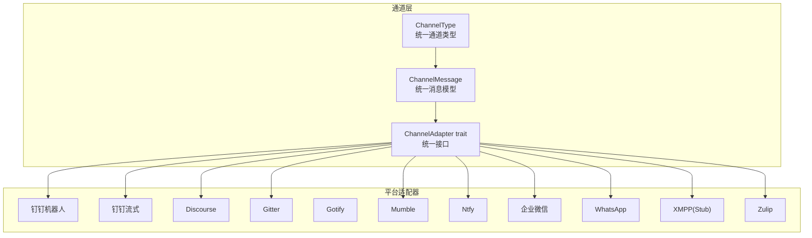

图示来源
- [types.rs:12-96](file://crates/openfang-channels/src/types.rs#L12-L96)
- [dingtalk.rs:24-40](file://crates/openfang-channels/src/dingtalk.rs#L24-L40)
- [dingtalk_stream.rs:33-41](file://crates/openfang-channels/src/dingtalk_stream.rs#L33-L41)
- [discourse.rs:24-44](file://crates/openfang-channels/src/discourse.rs#L24-L44)
- [gitter.rs:25-39](file://crates/openfang-channels/src/gitter.rs#L25-L39)
- [gotify.rs:23-40](file://crates/openfang-channels/src/gotify.rs#L23-L40)
- [mumble.rs:32-53](file://crates/openfang-channels/src/mumble.rs#L32-L53)
- [ntfy.rs:24-40](file://crates/openfang-channels/src/ntfy.rs#L24-L40)
- [wecom.rs:188-209](file://crates/openfang-channels/src/wecom.rs#L188-L209)
- [whatsapp.rs:25-43](file://crates/openfang-channels/src/whatsapp.rs#L25-L43)
- [xmpp.rs:21-41](file://crates/openfang-channels/src/xmpp.rs#L21-L41)
- [zulip.rs:24-41](file://crates/openfang-channels/src/zulip.rs#L24-L41)

章节来源
- [types.rs:12-280](file://crates/openfang-channels/src/types.rs#L12-L280)

## 核心组件
- 统一通道类型与消息模型
  - ChannelType：内置常见平台枚举，其余平台使用自定义字符串标识
  - ChannelMessage：统一承载平台消息、发送者、时间戳、是否群聊、线程 ID、元数据等
  - ChannelAdapter：统一接口，包括 start（返回消息流）、send、send_in_thread、send_typing、stop、status 等
- 分片策略
  - split_message：按最大长度切分文本，优先换行处切分，避免破坏 UTF-8

章节来源
- [types.rs:12-280](file://crates/openfang-channels/src/types.rs#L12-L280)

## 架构总览
下图展示 OpenFang 内核与各平台适配器的交互关系，以及典型入站/出站路径：

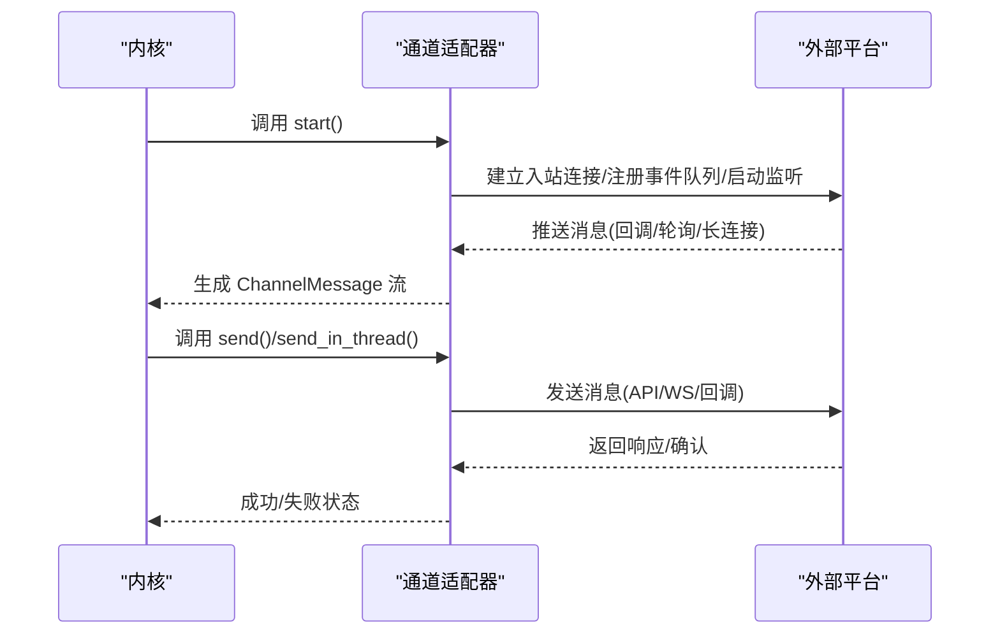

图示来源
- [types.rs:215-280](file://crates/openfang-channels/src/types.rs#L215-L280)
- [dingtalk.rs:127-328](file://crates/openfang-channels/src/dingtalk.rs#L127-L328)
- [dingtalk_stream.rs:153-283](file://crates/openfang-channels/src/dingtalk_stream.rs#L153-L283)
- [discourse.rs:166-399](file://crates/openfang-channels/src/discourse.rs#L166-L399)
- [gitter.rs:149-351](file://crates/openfang-channels/src/gitter.rs#L149-L351)
- [gotify.rs:145-329](file://crates/openfang-channels/src/gotify.rs#L145-L329)
- [mumble.rs:273-513](file://crates/openfang-channels/src/mumble.rs#L273-L513)
- [ntfy.rs:140-344](file://crates/openfang-channels/src/ntfy.rs#L140-L344)
- [wecom.rs:338-585](file://crates/openfang-channels/src/wecom.rs#L338-L585)
- [whatsapp.rs:177-337](file://crates/openfang-channels/src/whatsapp.rs#L177-L337)
- [xmpp.rs:90-135](file://crates/openfang-channels/src/xmpp.rs#L90-L135)
- [zulip.rs:180-473](file://crates/openfang-channels/src/zulip.rs#L180-L473)

## 详细组件分析

### 钉钉（DingTalk）机器人
- 专业特性与场景
  - 企业内部工作沟通，适合与 OA/审批/公告系统联动
  - 支持机器人回调与命令解析（以“/”开头的指令）
- 协议与实现要点
  - 入站：HTTP 回调服务器，校验时间戳与签名，解析文本消息
  - 出站：带 access_token、timestamp、签名的发送接口，按最大长度分片
  - 安全：HMAC-SHA256 签名常量时间比较，凭据零化
- 配置要点
  - access_token、secret、webhook 监听端口
- 性能与限制
  - 多段消息发送时有短延迟，避免触发限流
- 生态与扩展
  - 可结合企业内部会话与群组 ID 映射，实现更细粒度路由

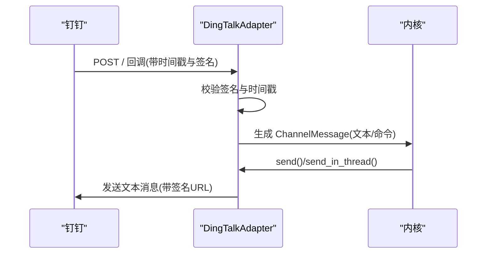

图示来源
- [dingtalk.rs:127-328](file://crates/openfang-channels/src/dingtalk.rs#L127-L328)

章节来源
- [dingtalk.rs:24-328](file://crates/openfang-channels/src/dingtalk.rs#L24-L328)

### 钉钉（DingTalk）流式接口
- 专业特性与场景
  - 企业级 IM 场景，需要低延迟与事件驱动
- 协议与实现要点
  - 获取访问令牌、申请 WebSocket 连接、建立长连接
  - 心跳与事件处理，ACK 应答，消息分片发送
  - 断线重连与指数退避
- 配置要点
  - app_key、app_secret、robot_code
- 性能与限制
  - 连接复用与心跳维持，避免频繁断开
- 生态与扩展
  - 可扩展订阅更多事件类型，接入更多业务消息

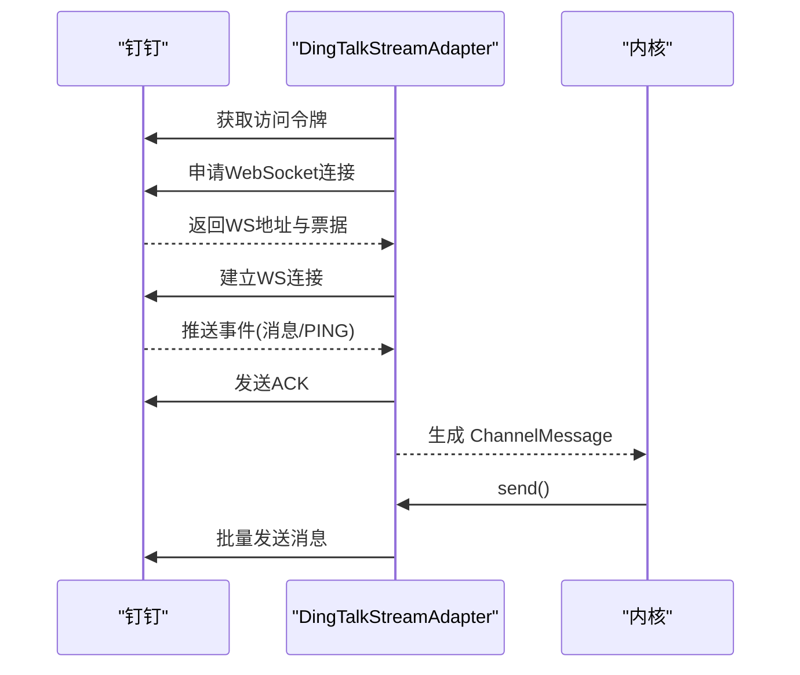

图示来源
- [dingtalk_stream.rs:153-283](file://crates/openfang-channels/src/dingtalk_stream.rs#L153-L283)

章节来源
- [dingtalk_stream.rs:33-283](file://crates/openfang-channels/src/dingtalk_stream.rs#L33-L283)

### Discourse
- 专业特性与场景
  - 开源社区论坛、知识库问答、技术讨论区
- 协议与实现要点
  - 通过 /posts.json 轮询新帖子，过滤分类
  - 通过 /posts.json 发布回复，支持多段分片
- 配置要点
  - 基础 URL、API Key、用户名、可选分类过滤
- 性能与限制
  - 轮询间隔与回退策略，避免频繁请求
- 生态与扩展
  - 结合话题 ID 与主题映射，实现线程化回复

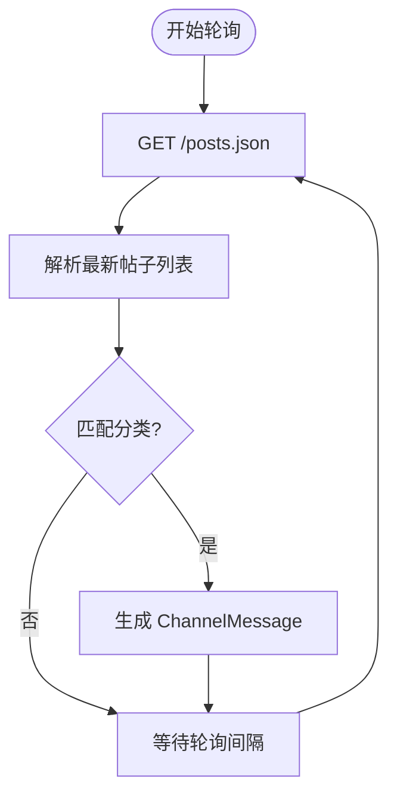

图示来源
- [discourse.rs:176-345](file://crates/openfang-channels/src/discourse.rs#L176-L345)

章节来源
- [discourse.rs:24-399](file://crates/openfang-channels/src/discourse.rs#L24-L399)

### Gitter
- 专业特性与场景
  - 开源项目聊天、轻量协作
- 协议与实现要点
  - 使用 SSE/NDJSON 流式读取消息，解析每行 JSON
  - 通过 REST API 发送聊天消息
- 配置要点
  - Bearer Token、房间 ID
- 性能与限制
  - 连接断开后指数退避重连
- 生态与扩展
  - 可扩展支持图片/文件等富媒体（当前以文本为主）

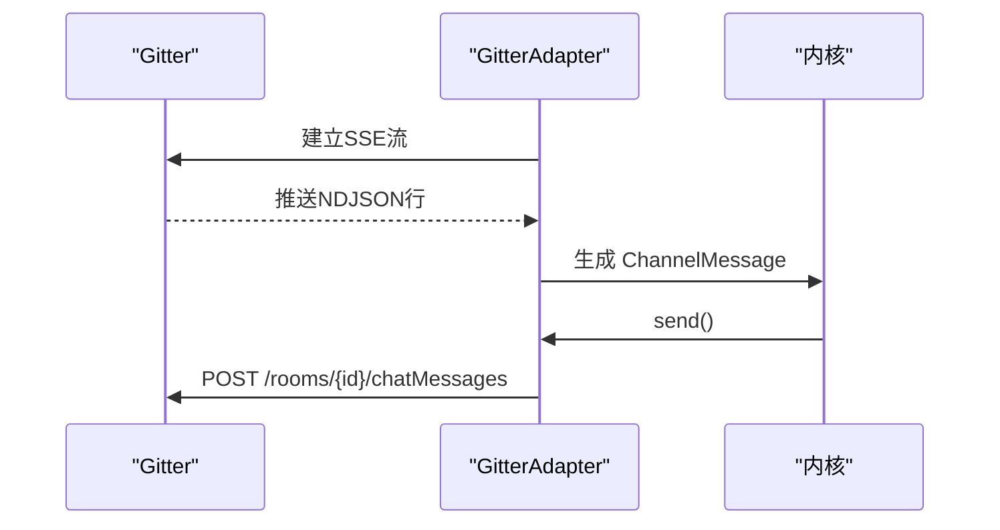

图示来源
- [gitter.rs:149-351](file://crates/openfang-channels/src/gitter.rs#L149-L351)

章节来源
- [gitter.rs:25-351](file://crates/openfang-channels/src/gitter.rs#L25-L351)

### Gotify
- 专业特性与场景
  - 移动推送、家庭自动化、系统告警
- 协议与实现要点
  - 通过 WebSocket 接收推送，使用客户端令牌
  - 通过 REST API 发送推送，支持标题与优先级
- 配置要点
  - 服务端 URL、应用令牌、客户端令牌
- 性能与限制
  - 大消息自动分片，注意优先级设置
- 生态与扩展
  - 与各类推送客户端联动，构建统一通知中枢

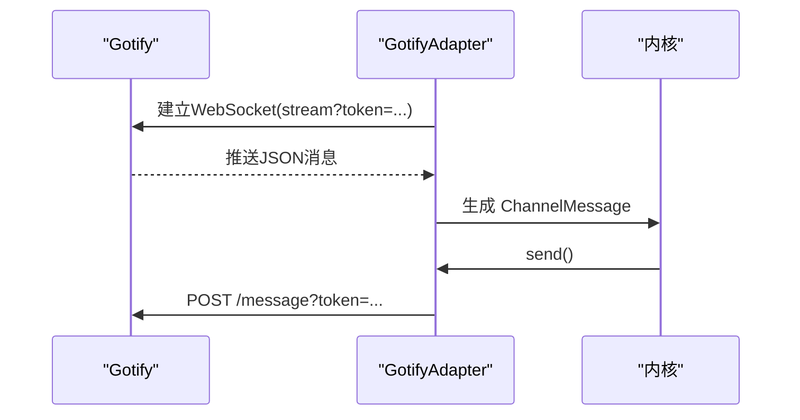

图示来源
- [gotify.rs:145-329](file://crates/openfang-channels/src/gotify.rs#L145-L329)

章节来源
- [gotify.rs:23-329](file://crates/openfang-channels/src/gotify.rs#L23-L329)

### Mumble
- 专业特性与场景
  - 游戏语音/远程会议中的文本聊天桥接
- 协议与实现要点
  - 直连 TCP，基于 Mumble 协议的简化实现
  - 文本消息帧解析与编码，打字指示与保活
- 配置要点
  - 主机、端口、密码、用户名、频道名称
- 性能与限制
  - 严格包头与变长整型编码，超大包拒绝
- 生态与扩展
  - 可扩展加入语音通道、录制、转写等能力

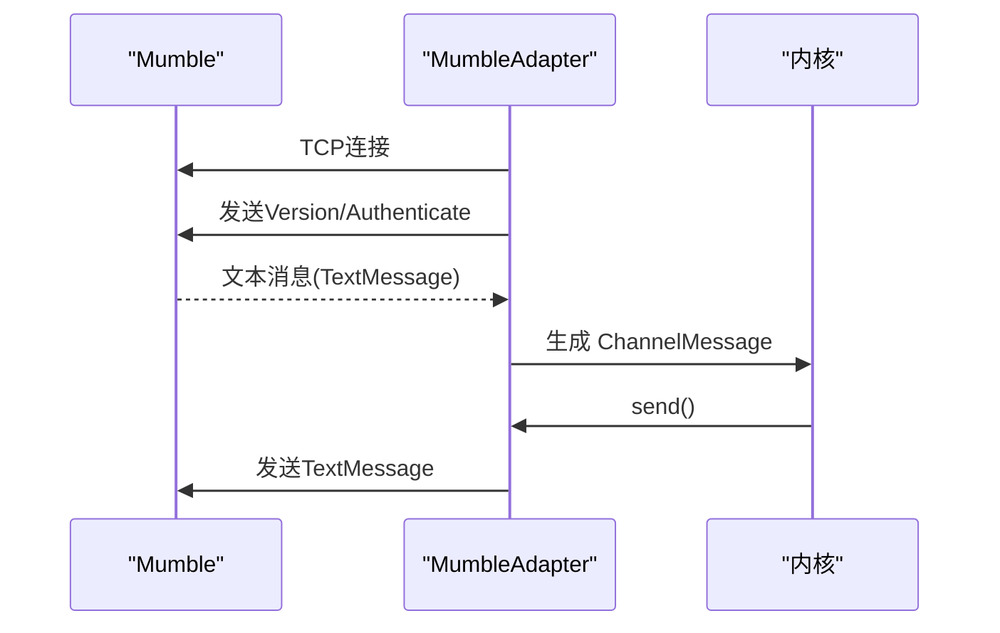

图示来源
- [mumble.rs:273-513](file://crates/openfang-channels/src/mumble.rs#L273-L513)

章节来源
- [mumble.rs:32-513](file://crates/openfang-channels/src/mumble.rs#L32-L513)

### Ntfy
- 专业特性与场景
  - 轻量推送、私有部署、跨平台
- 协议与实现要点
  - 通过 SSE 订阅主题，支持认证
  - 通过 POST 发布纯文本消息，支持标题
- 配置要点
  - 服务端 URL、主题、Bearer Token
- 性能与限制
  - 大消息自动分片，保持 UTF-8
- 生态与扩展
  - 与各类推送客户端/网关联动

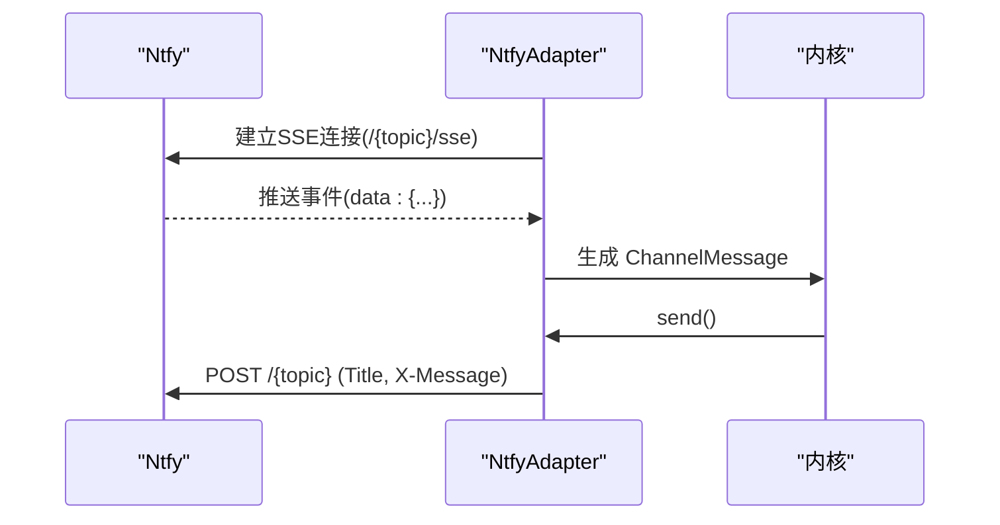

图示来源
- [ntfy.rs:140-344](file://crates/openfang-channels/src/ntfy.rs#L140-L344)

章节来源
- [ntfy.rs:24-344](file://crates/openfang-channels/src/ntfy.rs#L24-L344)

### 企业微信（WeCom）
- 专业特性与场景
  - 企业内部沟通与工作流集成
- 协议与实现要点
  - 令牌缓存与刷新、回调 Webhook 解密与签名校验
  - 文本消息发送，支持分片
- 配置要点
  - CorpId、AgentId、Secret、Webhook 端口、可选回调 token/AES Key
- 性能与限制
  - 令牌提前刷新缓冲，避免过期
- 生态与扩展
  - 与企业组织架构、审批流程、工单系统联动

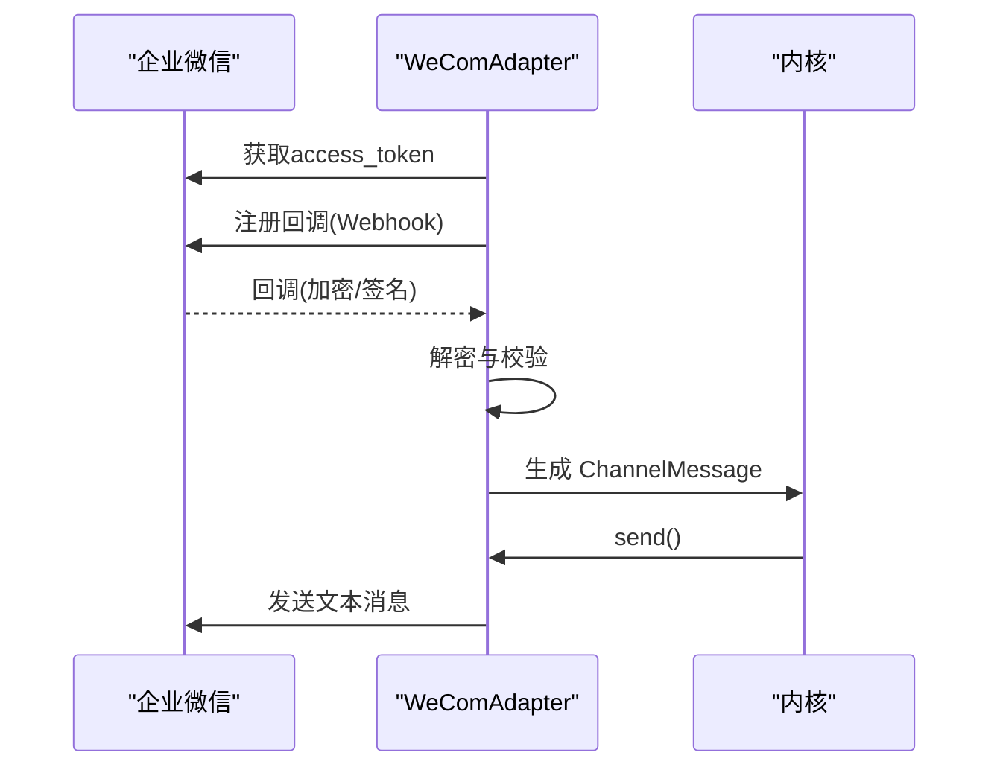

图示来源
- [wecom.rs:338-585](file://crates/openfang-channels/src/wecom.rs#L338-L585)

章节来源
- [wecom.rs:188-585](file://crates/openfang-channels/src/wecom.rs#L188-L585)

### WhatsApp
- 专业特性与场景
  - 个人与企业客户服务、营销自动化
- 协议与实现要点
  - Cloud API：官方 Business API，支持文本/图片/文件/位置
  - Web/QR 模式：通过本地网关（Baileys）转发，便于离线或无 Meta 账户场景
- 配置要点
  - Phone Number ID、Access Token、Verify Token、Webhook 端口、可选网关 URL
- 性能与限制
  - 大消息分片，部分媒体类型在 Web 模式受限
- 生态与扩展
  - 与 CRM/工单系统联动，实现自动应答与路由

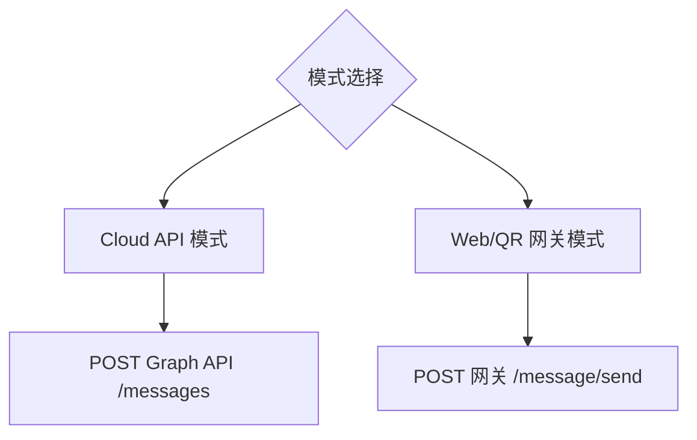

图示来源
- [whatsapp.rs:177-337](file://crates/openfang-channels/src/whatsapp.rs#L177-L337)

章节来源
- [whatsapp.rs:17-337](file://crates/openfang-channels/src/whatsapp.rs#L17-L337)

### XMPP
- 专业特性与场景
  - 去中心化即时通讯、隐私保护、MUC 聊天室
- 协议与实现要点
  - 当前为 Stub 实现：保留配置项，但未引入 tokio-xmpp 依赖，start() 将报错提示
- 配置要点
  - JID、密码、服务器、端口、MUC 房间
- 生态与扩展
  - 引入 tokio-xmpp 后可实现 SASL/TLS/XML 流处理与 MUC 支持

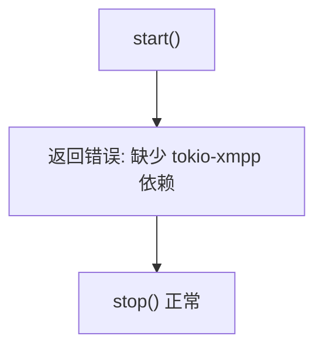

图示来源
- [xmpp.rs:90-135](file://crates/openfang-channels/src/xmpp.rs#L90-L135)

章节来源
- [xmpp.rs:21-135](file://crates/openfang-channels/src/xmpp.rs#L21-L135)

### Zulip
- 专业特性与场景
  - 团队协作、话题化讨论、开源项目管理
- 协议与实现要点
  - 事件队列注册与长轮询，按消息类型过滤
  - 支持流式与私信两种消息类型，线程即主题
- 配置要点
  - 服务器 URL、Bot 邮箱、API Key、可选订阅流
- 性能与限制
  - 队列过期自动重注册，指数退避
- 生态与扩展
  - 与 CI/发布/监控系统联动，按流/主题分发

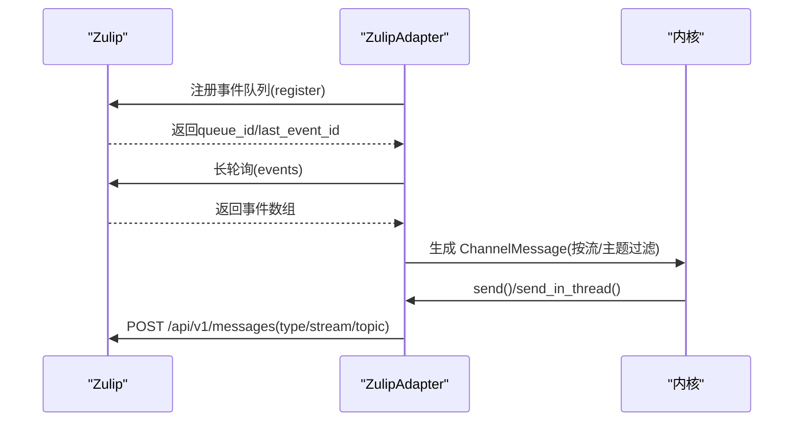

图示来源
- [zulip.rs:180-473](file://crates/openfang-channels/src/zulip.rs#L180-L473)

章节来源
- [zulip.rs:24-473](file://crates/openfang-channels/src/zulip.rs#L24-L473)

## 依赖关系分析
- 组件耦合
  - 所有适配器均依赖统一的 ChannelAdapter trait 与 ChannelMessage 类型
  - 外部依赖：HTTP 客户端、WebSocket 客户端、TCP 套接字、JSON 解析、加密库
- 关键依赖链
  - 请求/响应：reqwest -> 平台 API
  - 流式/长连接：tokio-tungstenite、futures::Stream
  - 加解密：hmac、sha2、base64、cbc/aes、sha1
- 循环依赖
  - 适配器之间无直接循环依赖，通过内核统一调度

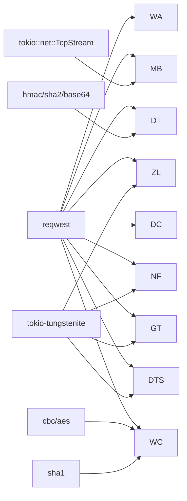

图示来源
- [dingtalk.rs:64-104](file://crates/openfang-channels/src/dingtalk.rs#L64-L104)
- [dingtalk_stream.rs:24-26](file://crates/openfang-channels/src/dingtalk_stream.rs#L24-L26)
- [gotify.rs:176-187](file://crates/openfang-channels/src/gotify.rs#L176-L187)
- [mumble.rs:28-31](file://crates/openfang-channels/src/mumble.rs#L28-L31)
- [wecom.rs:36-86](file://crates/openfang-channels/src/wecom.rs#L36-L86)
- [zulip.rs:71-112](file://crates/openfang-channels/src/zulip.rs#L71-L112)

章节来源
- [dingtalk.rs:64-104](file://crates/openfang-channels/src/dingtalk.rs#L64-L104)
- [dingtalk_stream.rs:24-26](file://crates/openfang-channels/src/dingtalk_stream.rs#L24-L26)
- [gotify.rs:176-187](file://crates/openfang-channels/src/gotify.rs#L176-L187)
- [mumble.rs:28-31](file://crates/openfang-channels/src/mumble.rs#L28-L31)
- [wecom.rs:36-86](file://crates/openfang-channels/src/wecom.rs#L36-L86)
- [zulip.rs:71-112](file://crates/openfang-channels/src/zulip.rs#L71-L112)

## 性能考量
- 连接与会话
  - WebSocket/长连接需保活与心跳，断线重连采用指数退避
  - 令牌缓存与预刷新，减少鉴权开销
- 流控与限速
  - 多段消息发送时增加短延迟，避免触发平台限流
  - 轮询间隔与回退策略，降低无效请求
- 数据处理
  - split_message 优先换行切分，保证 UTF-8 安全
  - 大消息自动分片，注意平台对分片数量与大小的限制
- 资源管理
  - 凭据零化，避免内存泄露
  - 通道关闭与优雅停机，确保资源回收

## 故障排查指南
- 认证失败
  - 检查令牌/密钥/签名参数是否正确，确认时间戳新鲜度
- 连接异常
  - 查看网络连通性、代理与防火墙；关注指数退避日志
- 消息未送达
  - 核对平台消息长度限制与分片策略；检查平台返回码与错误体
- 回调/Webhook
  - 确认回调 URL、签名验证逻辑、AES 解密参数
- 日志与可观测性
  - 关注适配器日志中的错误码与状态码，定位问题根因

章节来源
- [dingtalk.rs:172-185](file://crates/openfang-channels/src/dingtalk.rs#L172-L185)
- [dingtalk_stream.rs:252-257](file://crates/openfang-channels/src/dingtalk_stream.rs#L252-L257)
- [gotify.rs:181-187](file://crates/openfang-channels/src/gotify.rs#L181-L187)
- [wecom.rs:446-462](file://crates/openfang-channels/src/wecom.rs#L446-L462)

## 结论
上述适配器覆盖了从企业级 IM 到开源社区、从推送通知到语音聊天的多样化场景。通过统一的通道抽象与一致的消息模型，OpenFang 能够以最小侵入方式集成专业与小众平台，满足复杂业务需求。建议在生产环境中结合平台 API 限额与自身 SLA，合理配置连接数、分片策略与重试机制，并持续完善可观测性与安全策略。

## 附录
- 配置清单模板（示例字段）
  - 钉钉机器人：access_token、secret、webhook_port
  - 钉钉流式：app_key、app_secret、robot_code
  - Discourse：base_url、api_key、api_username、categories
  - Gitter：token、room_id
  - Gotify：server_url、app_token、client_token
  - Mumble：host、port、password、username、channel_name
  - Ntfy：server_url、topic、token
  - 企业微信：corp_id、agent_id、secret、webhook_port、callback token/AES Key
  - WhatsApp：phone_number_id、access_token、verify_token、webhook_port、gateway_url
  - XMPP：jid、password、server、port、rooms
  - Zulip：server_url、bot_email、api_key、streams
- 自定义扩展建议
  - 新增平台适配器：实现 ChannelAdapter trait，遵循统一消息模型
  - 增强协议支持：引入对应依赖（如 XMPP），完善鉴权与流处理
  - 生态集成：与企业系统（OA/工单/监控）打通，实现自动化路由与回执追踪