# 主流消息平台

<cite>
**本文档引用的文件**
- [crates/openfang-channels/src/lib.rs](file://crates/openfang-channels/src/lib.rs)
- [crates/openfang-channels/src/types.rs](file://crates/openfang-channels/src/types.rs)
- [crates/openfang-channels/src/router.rs](file://crates/openfang-channels/src/router.rs)
- [crates/openfang-channels/src/webhook.rs](file://crates/openfang-channels/src/webhook.rs)
- [crates/openfang-channels/src/slack.rs](file://crates/openfang-channels/src/slack.rs)
- [crates/openfang-channels/src/telegram.rs](file://crates/openfang-channels/src/telegram.rs)
- [crates/openfang-channels/src/discord.rs](file://crates/openfang-channels/src/discord.rs)
- [crates/openfang-channels/src/teams.rs](file://crates/openfang-channels/src/teams.rs)
- [crates/openfang-channels/src/matrix.rs](file://crates/openfang-channels/src/matrix.rs)
- [crates/openfang-channels/src/rocketchat.rs](file://crates/openfang-channels/src/rocketchat.rs)
- [crates/openfang-channels/src/mattermost.rs](file://crates/openfang-channels/src/mattermost.rs)
- [crates/openfang-channels/src/google_chat.rs](file://crates/openfang-channels/src/google_chat.rs)
- [crates/openfang-channels/src/email.rs](file://crates/openfang-channels/src/email.rs)
</cite>

## 目录
1. [简介](#简介)
2. [项目结构](#项目结构)
3. [核心组件](#核心组件)
4. [架构总览](#架构总览)
5. [详细组件分析](#详细组件分析)
6. [依赖关系分析](#依赖关系分析)
7. [性能考虑](#性能考虑)
8. [故障排除指南](#故障排除指南)
9. [结论](#结论)
10. [附录](#附录)

## 简介
本文件为 OpenFang 主流消息平台适配器的技术文档，覆盖 Slack、Telegram、Discord、Microsoft Teams、Matrix、Rocket.Chat、Mattermost、Google Chat、Email 等 9 个主流平台的集成实现。内容包括：
- 认证机制与令牌管理（OAuth2/JWT、Bot Token、Personal Access Token、服务账号）
- Webhook 配置与安全签名验证
- 实时消息处理（WebSocket/长轮询）
- 消息格式转换与统一 ChannelMessage 结构
- 平台特殊配置项、API 限制与速率限制策略
- 完整的适配器开发示例、错误处理模式与性能优化建议
- 各平台独特功能与限制说明

## 项目结构
OpenFang 的通道适配层位于 crates/openfang-channels，采用模块化设计，每个平台一个适配器模块，共享统一的类型系统与路由机制。

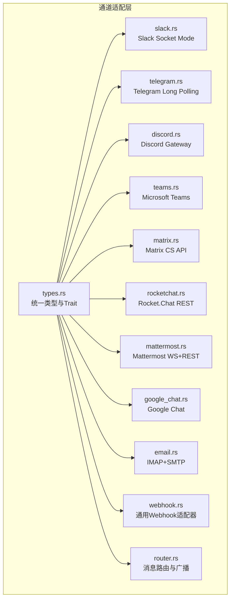

图表来源
- [crates/openfang-channels/src/lib.rs:1-55](file://crates/openfang-channels/src/lib.rs#L1-L55)
- [crates/openfang-channels/src/types.rs:1-478](file://crates/openfang-channels/src/types.rs#L1-L478)
- [crates/openfang-channels/src/router.rs:1-645](file://crates/openfang-channels/src/router.rs#L1-L645)
- [crates/openfang-channels/src/webhook.rs:1-479](file://crates/openfang-channels/src/webhook.rs#L1-L479)

章节来源
- [crates/openfang-channels/src/lib.rs:1-55](file://crates/openfang-channels/src/lib.rs#L1-L55)

## 核心组件
- 统一类型系统：定义 ChannelType、ChannelUser、ChannelContent、ChannelMessage、生命周期反应与投递状态等，确保所有平台输出一致的消息结构。
- 通道适配器 Trait：ChannelAdapter 规范了 start/send/send_typing/send_reaction/send_in_thread/status/stop 等接口，便于扩展新平台。
- 路由器：AgentRouter 提供基于匹配规则的路由优先级（绑定 > 直达路由 > 用户默认 > 频道默认 > 系统默认），支持广播策略与运行时动态更新。
- 通用 Webhook：WebhookAdapter 支持双向 HTTP 通信，具备 HMAC-SHA256 签名验证与回调发送能力。

章节来源
- [crates/openfang-channels/src/types.rs:1-478](file://crates/openfang-channels/src/types.rs#L1-L478)
- [crates/openfang-channels/src/router.rs:1-645](file://crates/openfang-channels/src/router.rs#L1-L645)
- [crates/openfang-channels/src/webhook.rs:1-479](file://crates/openfang-channels/src/webhook.rs#L1-L479)

## 架构总览
下图展示 OpenFang 通道桥接的整体架构：各平台适配器通过统一的 ChannelAdapter 接口接入，经由 AgentRouter 进行消息分发，最终进入内核处理。

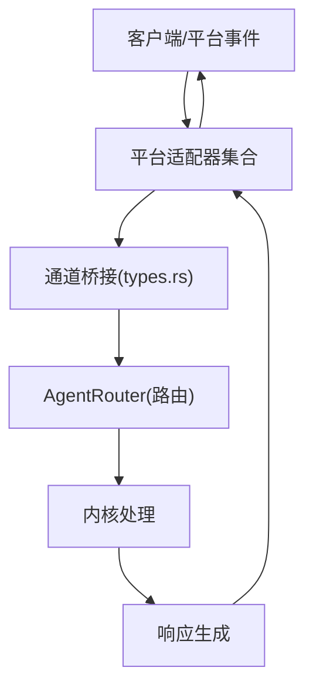

图表来源
- [crates/openfang-channels/src/types.rs:215-280](file://crates/openfang-channels/src/types.rs#L215-L280)
- [crates/openfang-channels/src/router.rs:25-341](file://crates/openfang-channels/src/router.rs#L25-L341)

## 详细组件分析

### Slack 适配器
- 认证：使用 Bot Token 调用 auth.test 校验；Socket Mode 使用 App Token 获取连接 URL。
- 实时：通过 apps.connections.open 获取 WebSocket URL，接收 events_api 事件并进行 ack 处理。
- 发送：使用 chat.postMessage，支持按 thread_ts 回复；可配置 unfurl_links。
- 特性：支持 @提及检测、线程跟踪与自动回复；指数退避重连；消息长度限制 3000 字符。
- 配置：允许频道列表、自动线程回复、线程 TTL、是否展开链接。

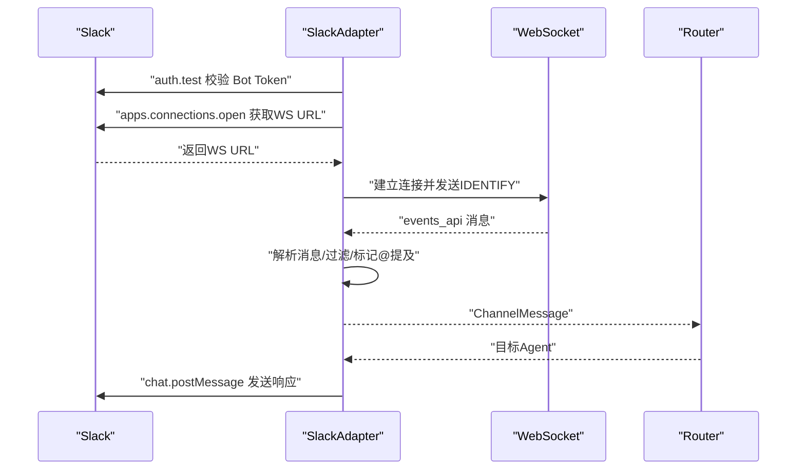

图表来源
- [crates/openfang-channels/src/slack.rs:71-134](file://crates/openfang-channels/src/slack.rs#L71-L134)
- [crates/openfang-channels/src/slack.rs:195-338](file://crates/openfang-channels/src/slack.rs#L195-L338)

章节来源
- [crates/openfang-channels/src/slack.rs:1-746](file://crates/openfang-channels/src/slack.rs#L1-L746)

### Telegram 适配器
- 认证：调用 getMe 校验 Bot Token；支持代理/镜像 API 基础地址。
- 实时：getUpdates 长轮询，支持 allowed_users 白名单；处理 message/edited_message。
- 发送：支持 sendMessage、sendPhoto、sendDocument、sendVoice、sendLocation；HTML 解析模式；4096 字符限制。
- 特性：@机器人用户名检测；forum 主题消息通过 message_thread_id；typing 指示；reaction 设置；429 限流重试。
- 配置：轮询间隔、API 基础地址、允许用户列表。

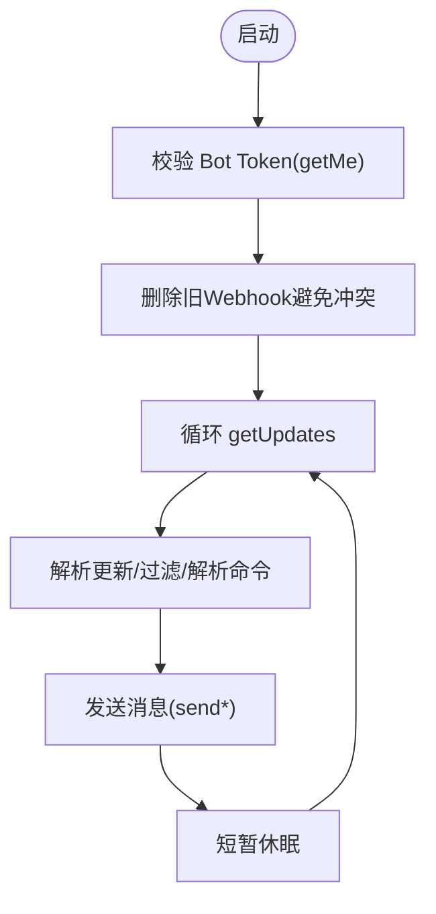

图表来源
- [crates/openfang-channels/src/telegram.rs:75-97](file://crates/openfang-channels/src/telegram.rs#L75-L97)
- [crates/openfang-channels/src/telegram.rs:408-596](file://crates/openfang-channels/src/telegram.rs#L408-L596)

章节来源
- [crates/openfang-channels/src/telegram.rs:1-800](file://crates/openfang-channels/src/telegram.rs#L1-L800)

### Discord 适配器
- 认证：通过 Bot 框架获取 Gateway URL；支持 RESUME 恢复会话。
- 实时：Gateway v10，处理 READY/MESSAGE_CREATE/MESSAGE_UPDATE/RESUMED/RECONNECT/INVALID_SESSION 等事件。
- 发送：REST API POST /channels/{channel_id}/messages；typing 指示。
- 特性：忽略机器人消息开关；按服务器/用户白名单过滤；@提及检测；消息长度限制 2000。
- 配置：服务器/用户白名单、忽略机器人、意图位。

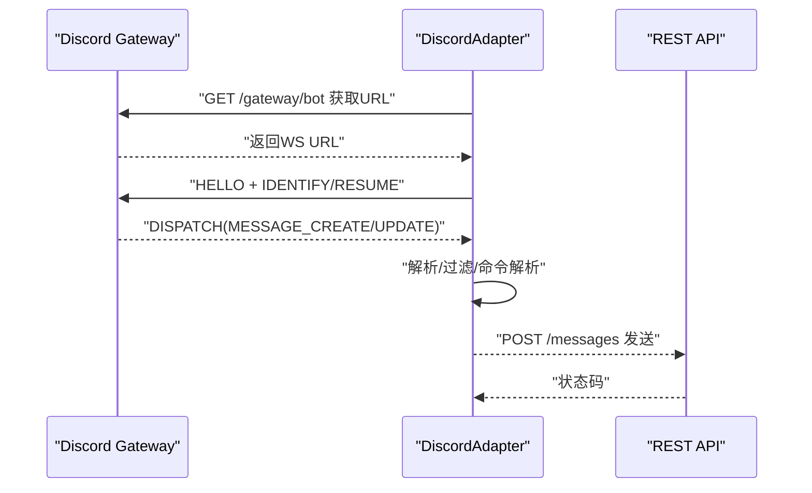

图表来源
- [crates/openfang-channels/src/discord.rs:79-96](file://crates/openfang-channels/src/discord.rs#L79-L96)
- [crates/openfang-channels/src/discord.rs:148-407](file://crates/openfang-channels/src/discord.rs#L148-L407)

章节来源
- [crates/openfang-channels/src/discord.rs:1-905](file://crates/openfang-channels/src/discord.rs#L1-L905)

### Microsoft Teams 适配器
- 认证：Bot Framework v3 REST；OAuth2 客户端凭据流获取访问令牌；令牌缓存与刷新。
- 实时：本地 HTTP Webhook 监听 /api/messages；tenant 白名单过滤。
- 发送：POST /v3/conversations/{id}/activities；typing 指示。
- 特性：支持群组/私聊；服务 URL 元数据传递；消息长度限制 4096。
- 配置：App ID/密码、Webhook 端口、允许租户列表。

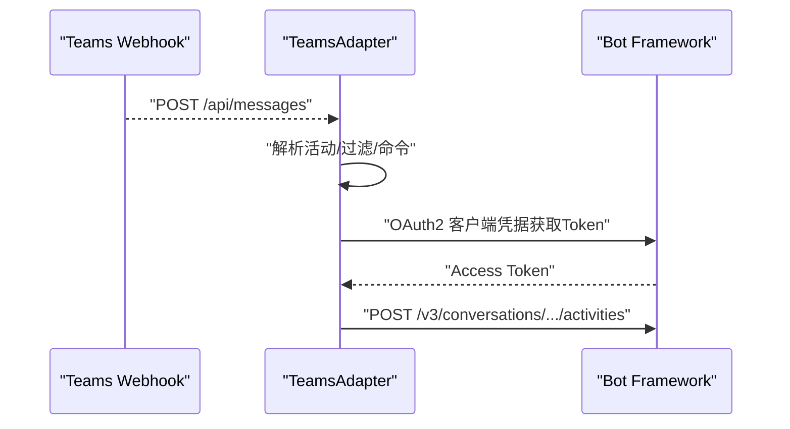

图表来源
- [crates/openfang-channels/src/teams.rs:80-126](file://crates/openfang-channels/src/teams.rs#L80-L126)
- [crates/openfang-channels/src/teams.rs:282-348](file://crates/openfang-channels/src/teams.rs#L282-L348)

章节来源
- [crates/openfang-channels/src/teams.rs:1-591](file://crates/openfang-channels/src/teams.rs#L1-L591)

### Matrix 适配器
- 认证：/account/whoami 校验；Bearer Token。
- 实时：/sync 长轮询；初始同步 skip 旧消息；自动接受邀请；房间成员数判断 DM/群组；@提及检测。
- 发送：PUT /rooms/{room}/send/m.room.message/{txn}；typing 指示。
- 特性：消息长度限制 4096；支持 DM 与群组；自动接受邀请。
- 配置：homeserver、用户ID、访问令牌、允许房间、自动接受邀请。

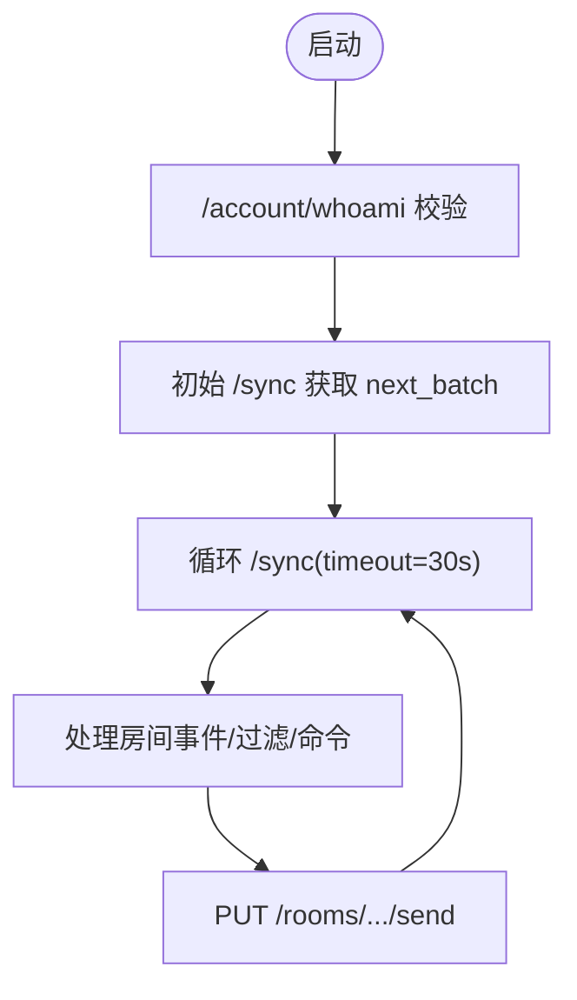

图表来源
- [crates/openfang-channels/src/matrix.rs:102-121](file://crates/openfang-channels/src/matrix.rs#L102-L121)
- [crates/openfang-channels/src/matrix.rs:211-407](file://crates/openfang-channels/src/matrix.rs#L211-L407)

章节来源
- [crates/openfang-channels/src/matrix.rs:1-492](file://crates/openfang-channels/src/matrix.rs#L1-L492)

### Rocket.Chat 适配器
- 认证：X-Auth-Token + X-User-Id；/api/v1/me 校验。
- 实时：channels.history 分页增量拉取；按时间戳推进；支持 thread_id。
- 发送：/api/v1/chat.sendMessage；消息长度限制 4096。
- 特性：支持多房间；自动发现已加入房间；跳过自身消息。
- 配置：服务器 URL、个人访问令牌、用户ID、允许房间列表。

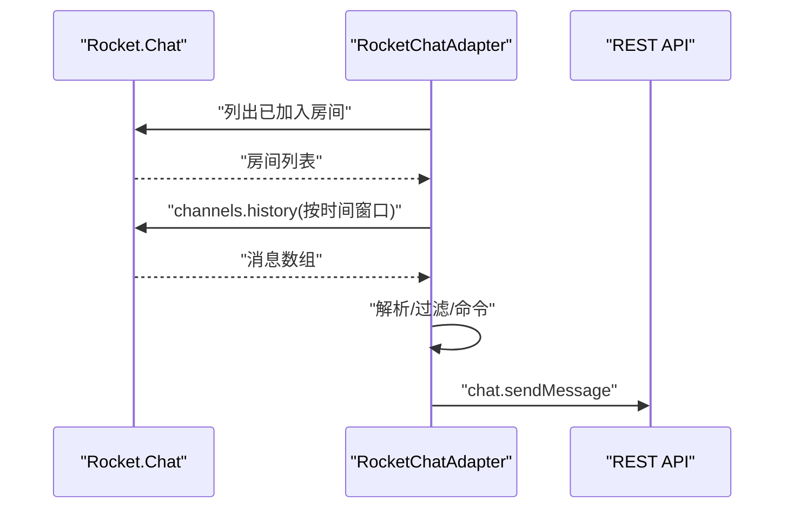

图表来源
- [crates/openfang-channels/src/rocketchat.rs:142-350](file://crates/openfang-channels/src/rocketchat.rs#L142-L350)

章节来源
- [crates/openfang-channels/src/rocketchat.rs:1-451](file://crates/openfang-channels/src/rocketchat.rs#L1-L451)

### Mattermost 适配器
- 认证：/api/v4/users/me 校验；WebSocket v4 使用 token 认证。
- 实时：WebSocket posted 事件；支持 RESUME；过滤自身消息与频道白名单；DM/群组识别；thread_id。
- 发送：REST POST /api/v4/posts；支持 send_in_thread。
- 特性：消息长度限制 16383；typing 指示 via /users/me/typing。
- 配置：服务器 URL、令牌、允许频道列表。

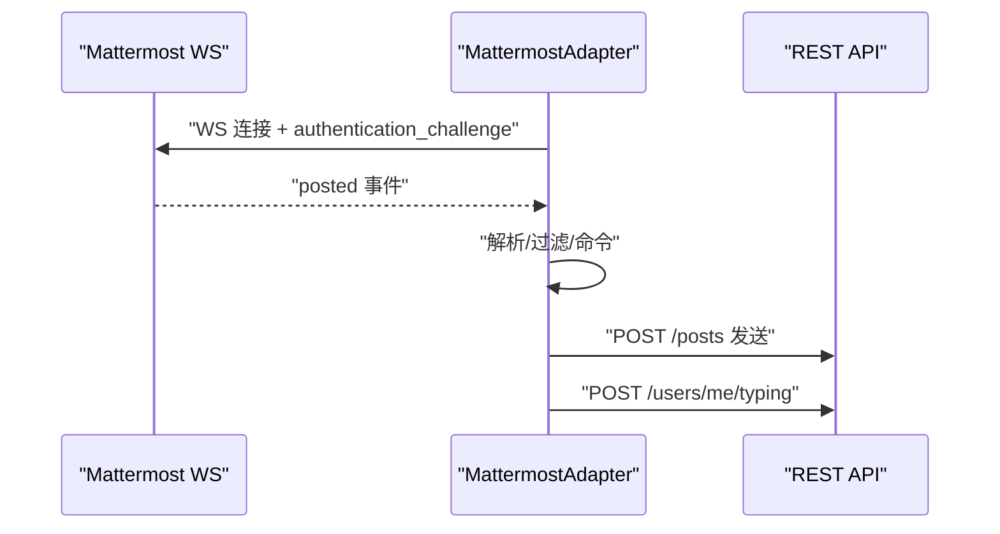

图表来源
- [crates/openfang-channels/src/mattermost.rs:239-386](file://crates/openfang-channels/src/mattermost.rs#L239-L386)

章节来源
- [crates/openfang-channels/src/mattermost.rs:1-730](file://crates/openfang-channels/src/mattermost.rs#L1-L730)

### Google Chat 适配器
- 认证：服务账号 JWT（当前从服务账号密钥 JSON 中提取 access_token，完整 JWT 流程待实现）。
- 实时：本地 TCP/HTTP 监听端口接收 Google Chat Webhook；按 space 白名单过滤。
- 发送：/v1/{space}/messages；消息长度限制 4096。
- 特性：支持 ROOM/DM；thread 名称；命令解析。
- 配置：服务账号密钥、space 列表、Webhook 端口。

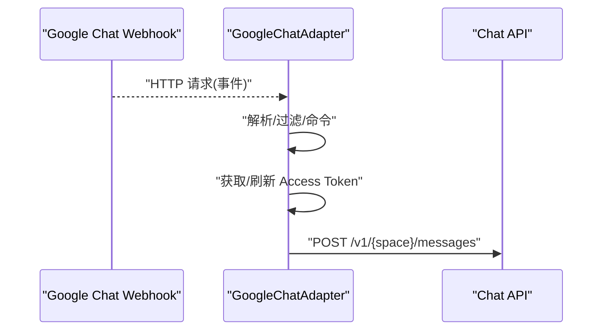

图表来源
- [crates/openfang-channels/src/google_chat.rs:151-332](file://crates/openfang-channels/src/google_chat.rs#L151-L332)

章节来源
- [crates/openfang-channels/src/google_chat.rs:1-413](file://crates/openfang-channels/src/google_chat.rs#L1-L413)

### Email 适配器（IMAP + SMTP）
- 认证：IMAP 支持 LOGIN 与 SASL PLAIN；SMTP 支持 STARTTLS/SSL。
- 实时：定时轮询 IMAP（默认 INBOX），解析邮件主题/正文/Message-ID，构建 ChannelMessage。
- 发送：SMTP 发送，自动提取收件人邮箱，支持 In-Reply-To 与主题延续。
- 特性：支持按发件人白名单过滤；按主题中的 [agent] 标签提取目标 Agent；邮件正文预置“Subject: ...”约定。
- 配置：IMAP/SMTP 主机与端口、用户名/密码、轮询间隔、监控文件夹、允许发件人列表。

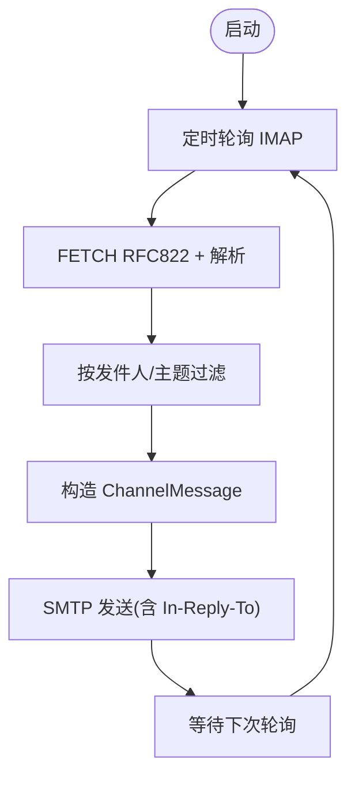

图表来源
- [crates/openfang-channels/src/email.rs:317-427](file://crates/openfang-channels/src/email.rs#L317-L427)

章节来源
- [crates/openfang-channels/src/email.rs:1-628](file://crates/openfang-channels/src/email.rs#L1-L628)

## 依赖关系分析
- 类型与路由：所有适配器依赖 types.rs 的统一消息模型与 ChannelAdapter Trait；路由器负责绑定匹配与广播。
- 第三方库：
  - reqwest：HTTP 客户端（Slack/Discord/Teams/Matrix/Rocket.Chat/Mattermost/Google Chat/Email SMTP）。
  - tokio-tungstenite：WebSocket（Slack/Discord/Mattermost）。
  - lettre：SMTP（Email）。
  - axum：Webhook HTTP 服务（Webhook/Teams/Google Chat）。
  - tokio/tokio-stream：异步流与任务调度。
  - dashmap：并发映射（Email 路由上下文）。
  - tracing/zeroize：日志与内存安全。

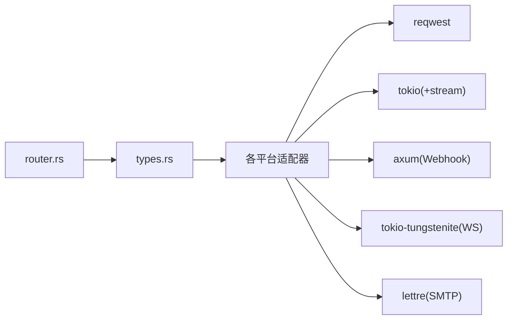

图表来源
- [crates/openfang-channels/src/types.rs:1-478](file://crates/openfang-channels/src/types.rs#L1-L478)
- [crates/openfang-channels/src/router.rs:1-645](file://crates/openfang-channels/src/router.rs#L1-L645)
- [crates/openfang-channels/src/webhook.rs:1-479](file://crates/openfang-channels/src/webhook.rs#L1-L479)

章节来源
- [crates/openfang-channels/src/types.rs:1-478](file://crates/openfang-channels/src/types.rs#L1-L478)
- [crates/openfang-channels/src/router.rs:1-645](file://crates/openfang-channels/src/router.rs#L1-L645)
- [crates/openfang-channels/src/webhook.rs:1-479](file://crates/openfang-channels/src/webhook.rs#L1-L479)

## 性能考虑
- 消息拆分：统一的 split_message 工具按字符与换行边界拆分，避免平台长度限制（如 Slack 3000、Discord 2000、Telegram/Matrix/Google Chat 4096、Mattermost 16383）。
- 异步与背压：使用 mpsc::channel 缓冲消息流，避免阻塞网络 I/O；根据平台特性设置合理的轮询间隔或心跳。
- 重连与退避：Slack/Discord/Mattermost/Webhook 等均实现指数退避重连，降低瞬时故障影响。
- 令牌缓存：Teams/Google Chat/Slack（部分）使用令牌缓存与刷新，减少鉴权开销。
- 并发控制：Email 使用 spawn_blocking 执行阻塞式 IMAP 操作，避免阻塞事件循环。
- 速率限制：Telegram 明确处理 429 与 409 冲突；Discord/Slack/Mattermost/Google Chat/Teams 在发送失败时记录并重试。

## 故障排除指南
- 认证失败
  - Slack：确认 Bot Token 可通过 auth.test；检查 App Token 与 Socket Mode 权限。
  - Telegram：getMe 返回 unauthorized/not found 时检查 Bot Token 格式。
  - Discord：确认 Bot 权限与意图位；检查 READY/RESUME 行为。
  - Teams：OAuth2 客户端凭据失败或令牌为空；检查 App ID/密码与作用域。
  - Matrix/Rocket.Chat/Mattermost/Google Chat：Bearer Token 或 X-Auth-Token/X-User-Id 无效。
  - Email：IMAP 登录失败（LOGIN vs PLAIN），检查服务器支持与凭据。
- 连接问题
  - Slack/Discord/Mattermost：WebSocket 连接失败或断开，查看 HELLO/RESUME/RECONNECT/INVALID_SESSION 日志。
  - Webhook：端口占用或签名不匹配导致拒绝；检查 X-Webhook-Signature。
- 速率限制
  - Telegram：429 返回时按 retry_after 重试；409 冲突时指数退避。
  - 各平台发送：记录非成功状态码与响应体，必要时降速或分片发送。
- 消息未到达
  - 检查路由器绑定规则与用户默认路由；确认 allowed_* 白名单过滤。
  - Teams/Google Chat：确保 serviceUrl 与 space/tenant 正确。
  - Mattermost：确认频道白名单与 channel_type 判断（DM/Group）。

章节来源
- [crates/openfang-channels/src/telegram.rs:499-524](file://crates/openfang-channels/src/telegram.rs#L499-L524)
- [crates/openfang-channels/src/discord.rs:365-380](file://crates/openfang-channels/src/discord.rs#L365-L380)
- [crates/openfang-channels/src/mattermost.rs:264-275](file://crates/openfang-channels/src/mattermost.rs#L264-L275)
- [crates/openfang-channels/src/webhook.rs:100-112](file://crates/openfang-channels/src/webhook.rs#L100-L112)
- [crates/openfang-channels/src/teams.rs:107-111](file://crates/openfang-channels/src/teams.rs#L107-L111)

## 结论
OpenFang 的通道适配层通过统一类型与适配器接口，实现了对主流消息平台的一致接入与扩展。各平台在认证、实时与发送路径上各有差异，但都遵循统一的消息模型与路由机制。通过合理的配置、限流与错误处理策略，可在生产环境中稳定运行。

## 附录
- 开发适配器最佳实践
  - 实现 ChannelAdapter 接口的所有方法；在 start 中返回稳定的 Stream；在 stop 中清理资源。
  - 使用统一的 split_message 控制消息长度；在发送失败时记录错误但不中断主流程。
  - 对于 WebSocket，实现握手、心跳、重连与会话恢复逻辑。
  - 对于 Webhook，实现签名验证与幂等处理。
  - 对于长轮询，设置合理的超时与轮询间隔，并处理 429/409 等错误码。
  - 使用零化内存存储敏感令牌；避免在日志中泄露凭证。
- 平台 API 限制与建议
  - Slack：3000 字符；启用 Socket Mode；合理设置线程 TTL。
  - Telegram：4096 字符；HTML 解析模式；处理 429 与 409；建议禁用无意义的 webhook。
  - Discord：2000 字符；注意意图位；使用 RESUME。
  - Teams：4096 字符；OAuth2 客户端凭据；缓存令牌。
  - Matrix：4096 字符；/sync timeout=30s；自动接受邀请。
  - Rocket.Chat：4096 字符；channels.history 分页；支持 thread_id。
  - Mattermost：16383 字符；WS + REST；DM/Group 区分。
  - Google Chat：4096 字符；服务账号令牌；Webhook 端口。
  - Email：IMAP/SMTP；按发件人白名单；主题标签路由。