# 企业与社区平台

<cite>
**本文档引用的文件**
- [lib.rs](file://crates/openfang-channels/src/lib.rs)
- [router.rs](file://crates/openfang-channels/src/router.rs)
- [types.rs](file://crates/openfang-channels/src/types.rs)
- [bridge.rs](file://crates/openfang-channels/src/bridge.rs)
- [formatter.rs](file://crates/openfang-channels/src/formatter.rs)
- [Cargo.toml](file://crates/openfang-channels/Cargo.toml)
- [flock.rs](file://crates/openfang-channels/src/flock.rs)
- [guilded.rs](file://crates/openfang-channels/src/guilded.rs)
- [keybase.rs](file://crates/openfang-channels/src/keybase.rs)
- [nextcloud.rs](file://crates/openfang-channels/src/nextcloud.rs)
- [pumble.rs](file://crates/openfang-channels/src/pumble.rs)
- [threema.rs](file://crates/openfang-channels/src/threema.rs)
- [twist.rs](file://crates/openfang-channels/src/twist.rs)
- [webex.rs](file://crates/openfang-channels/src/webex.rs)
- [comms.rs](file://crates/openfang-types/src/comms.rs)
</cite>

## 目录
1. [简介](#简介)
2. [项目结构](#项目结构)
3. [核心组件](#核心组件)
4. [架构总览](#架构总览)
5. [详细组件分析](#详细组件分析)
6. [依赖关系分析](#依赖关系分析)
7. [性能考量](#性能考量)
8. [故障排查指南](#故障排查指南)
9. [结论](#结论)
10. [附录](#附录)

## 简介
本文件面向 OpenFang 企业与社区平台适配器的技术文档，聚焦于 Flock、Guilded、Keybase、Nextcloud、Pumble、Threema、Twist、Cisco Webex 等专业平台的集成实现。文档从系统架构、组件关系、数据流、处理逻辑、权限与安全、合规与审计、API 限制与批处理等方面进行深入解析，并提供企业级部署与自动化脚本的实践建议。

## 项目结构
OpenFang 的通道适配层位于 crates/openfang-channels，采用“插件化”设计，统一抽象为 ChannelAdapter trait，将不同平台的消息事件转换为统一的 ChannelMessage，并通过 BridgeManager 将消息路由到具体 Agent 执行。核心模块包括：
- 适配器集合：lib.rs 汇总导出所有通道（含企业与社区平台）
- 类型与协议：types.rs 定义 ChannelType、ChannelMessage、ChannelAdapter 等核心类型
- 路由与广播：router.rs 提供基于规则的路由与广播策略
- 桥接与分发：bridge.rs 实现消息分发、格式化、生命周期反应、速率限制等
- 平台适配器：各平台独立文件实现各自的认证、收发与事件处理

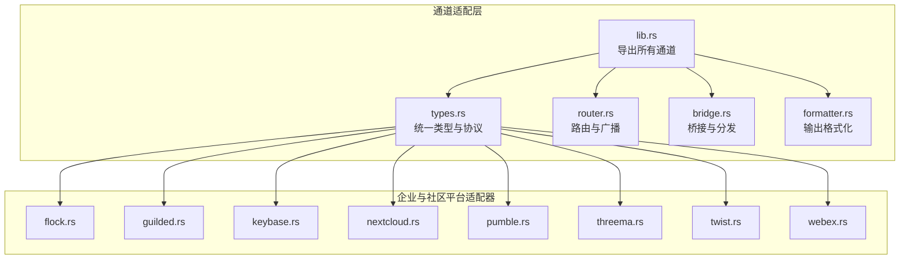

**图表来源**
- [lib.rs:1-55](file://crates/openfang-channels/src/lib.rs#L1-L55)
- [types.rs:1-478](file://crates/openfang-channels/src/types.rs#L1-L478)
- [router.rs:1-645](file://crates/openfang-channels/src/router.rs#L1-L645)
- [bridge.rs:1-800](file://crates/openfang-channels/src/bridge.rs#L1-L800)
- [formatter.rs:1-676](file://crates/openfang-channels/src/formatter.rs#L1-L676)
- [flock.rs:1-466](file://crates/openfang-channels/src/flock.rs#L1-L466)
- [guilded.rs:1-391](file://crates/openfang-channels/src/guilded.rs#L1-L391)
- [keybase.rs:1-512](file://crates/openfang-channels/src/keybase.rs#L1-L512)
- [nextcloud.rs:1-510](file://crates/openfang-channels/src/nextcloud.rs#L1-L510)
- [pumble.rs:1-487](file://crates/openfang-channels/src/pumble.rs#L1-L487)
- [threema.rs:1-431](file://crates/openfang-channels/src/threema.rs#L1-L431)
- [twist.rs:1-604](file://crates/openfang-channels/src/twist.rs#L1-L604)
- [webex.rs:1-523](file://crates/openfang-channels/src/webex.rs#L1-L523)

**章节来源**
- [lib.rs:1-55](file://crates/openfang-channels/src/lib.rs#L1-L55)
- [Cargo.toml:1-43](file://crates/openfang-channels/Cargo.toml#L1-L43)

## 核心组件
- 统一类型与协议
  - ChannelType：抽象平台类型，支持自定义通道键
  - ChannelMessage：统一入站消息结构，包含发送者、内容、时间戳、是否群组、线程 ID、元数据等
  - ChannelAdapter：适配器接口，定义 start、send、send_in_thread、status 等能力
- 路由与广播
  - AgentRouter：按绑定规则、直连路由、用户默认、频道默认、系统默认的优先级解析目标 Agent；支持广播策略与并发目标解析
- 桥接与分发
  - BridgeManager：启动适配器流、并发分发消息、应用输出格式、生命周期反应、速率限制、广播路由
  - 输出格式化：针对 Telegram HTML、Slack Mrkdwn、纯文本等进行格式转换
- 平台适配器
  - 各平台分别实现认证、事件接收（轮询或 WebSocket/Webhook）、消息发送、命令解析、线程回复等

**章节来源**
- [types.rs:12-478](file://crates/openfang-channels/src/types.rs#L12-L478)
- [router.rs:25-341](file://crates/openfang-channels/src/router.rs#L25-L341)
- [bridge.rs:27-382](file://crates/openfang-channels/src/bridge.rs#L27-L382)
- [formatter.rs:10-27](file://crates/openfang-channels/src/formatter.rs#L10-L27)

## 架构总览
下图展示从平台事件到 Agent 执行的整体流程，以及企业与社区平台适配器在其中的位置。

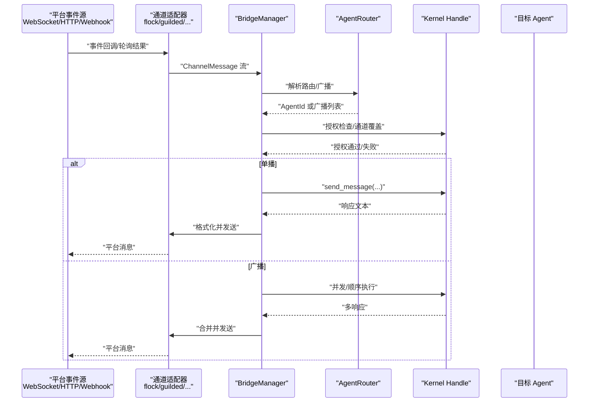

**图表来源**
- [bridge.rs:526-800](file://crates/openfang-channels/src/bridge.rs#L526-L800)
- [router.rs:138-254](file://crates/openfang-channels/src/router.rs#L138-L254)
- [types.rs:74-96](file://crates/openfang-channels/src/types.rs#L74-L96)

## 详细组件分析

### Flock 适配器
- 认证与健康：使用 Bot Token 调用用户信息接口验证身份
- 入站事件：本地 HTTP Webhook 接收 chat.receiveMessage 事件，过滤自身消息与空文本
- 出站消息：调用 chat.sendMessage，按最大长度切片发送
- 命令解析：以 “/” 开头的文本解析为命令
- 群组识别：以 “g:” 前缀区分群组与私聊

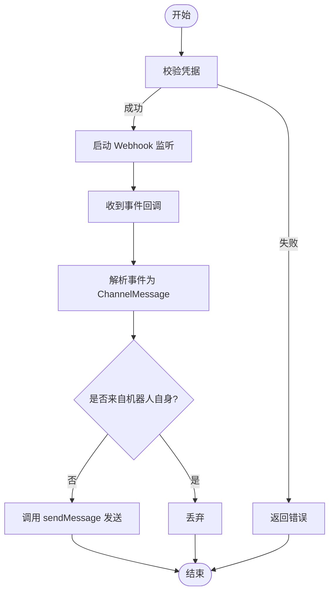

**图表来源**
- [flock.rs:61-152](file://crates/openfang-channels/src/flock.rs#L61-L152)
- [flock.rs:154-231](file://crates/openfang-channels/src/flock.rs#L154-L231)

**章节来源**
- [flock.rs:1-466](file://crates/openfang-channels/src/flock.rs#L1-L466)

### Guilded 适配器
- 认证与健康：Bearer Token 获取用户信息
- 入站事件：WebSocket 连接 Mercury，过滤欢迎事件与非 ChatMessageCreated 事件，按服务器白名单过滤
- 出站消息：REST API 发送消息，按最大长度切片
- 命令解析：以 “/” 开头的文本解析为命令
- 群组识别：固定为群组消息

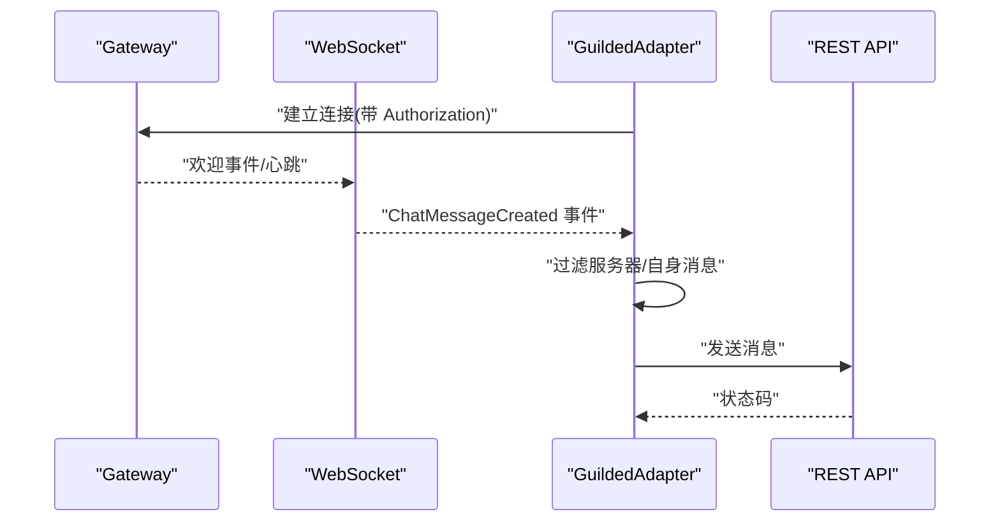

**图表来源**
- [guilded.rs:132-320](file://crates/openfang-channels/src/guilded.rs#L132-L320)
- [guilded.rs:83-120](file://crates/openfang-channels/src/guilded.rs#L83-L120)

**章节来源**
- [guilded.rs:1-391](file://crates/openfang-channels/src/guilded.rs#L1-L391)

### Keybase 适配器
- 认证与健康：通过本地 Keybase API 使用用户名与 paperkey
- 入站事件：轮询 list/read 接口，增量拉取，按 conversation 分类，过滤自身消息与非文本
- 出站消息：调用 send 接口，按最大长度切片
- 团队过滤：支持按团队名白名单过滤
- 命令解析：以 “/” 开头的文本解析为命令

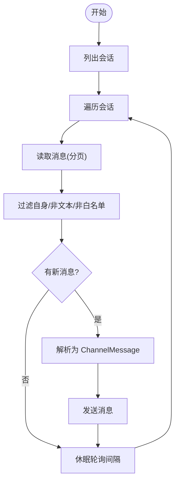

**图表来源**
- [keybase.rs:204-414](file://crates/openfang-channels/src/keybase.rs#L204-L414)
- [keybase.rs:149-192](file://crates/openfang-channels/src/keybase.rs#L149-L192)

**章节来源**
- [keybase.rs:1-512](file://crates/openfang-channels/src/keybase.rs#L1-L512)

### Nextcloud 适配器
- 认证与健康：Bearer Token + OCS 头部获取用户信息
- 入站事件：轮询 chat 接口，使用 lookIntoFuture 与 lastKnownMessageId 实现增量拉取
- 出站消息：调用 chat 接口发送，按最大长度切片
- 房间过滤：支持房间令牌白名单或自动发现已加入房间
- 命令解析：以 “/” 开头的文本解析为命令

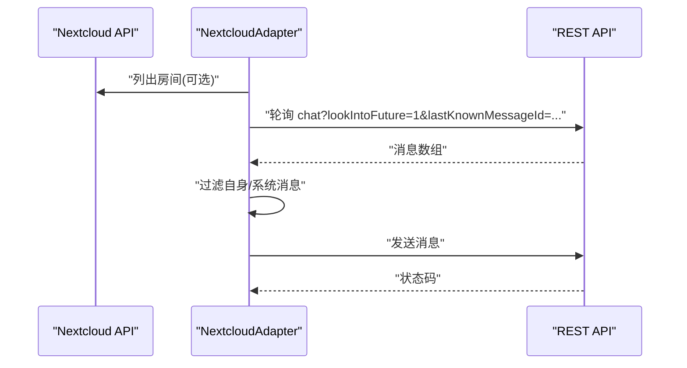

**图表来源**
- [nextcloud.rs:171-406](file://crates/openfang-channels/src/nextcloud.rs#L171-L406)
- [nextcloud.rs:121-159](file://crates/openfang-channels/src/nextcloud.rs#L121-L159)

**章节来源**
- [nextcloud.rs:1-510](file://crates/openfang-channels/src/nextcloud.rs#L1-L510)

### Pumble 适配器
- 认证与健康：Bearer Token 调用 auth.test 获取 bot 用户 ID
- 入站事件：本地 HTTP Webhook 接收 message/new 事件，处理 URL 验证挑战
- 出站消息：REST API 发送消息，按最大长度切片
- 线程回复：支持 send_in_thread，携带 thread_ts
- 命令解析：以 “/” 开头的文本解析为命令

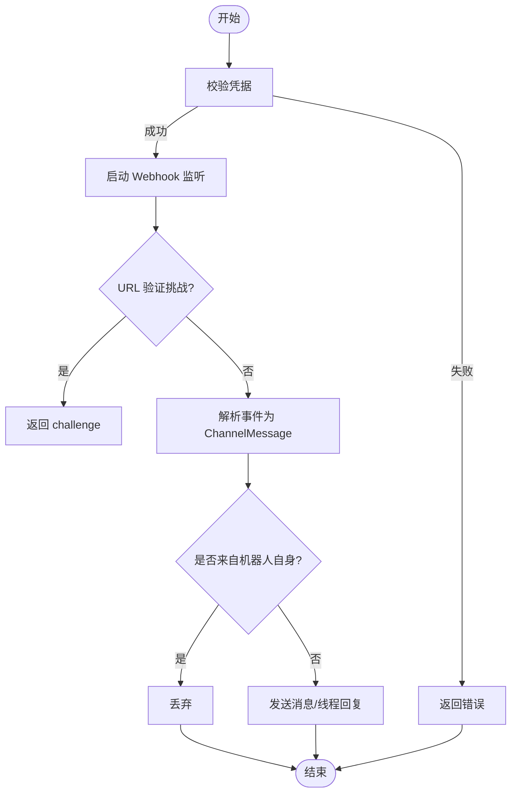

**图表来源**
- [pumble.rs:219-295](file://crates/openfang-channels/src/pumble.rs#L219-L295)
- [pumble.rs:118-207](file://crates/openfang-channels/src/pumble.rs#L118-L207)

**章节来源**
- [pumble.rs:1-487](file://crates/openfang-channels/src/pumble.rs#L1-L487)

### Threema 适配器
- 认证与健康：API Secret 查询余额作为凭据校验
- 入站事件：本地 TCP Socket 接收 Webhook，解析表单或 JSON 负载
- 出站消息：send_simple 接口发送，按最大长度切片
- 命令解析：以 “/” 开头的文本解析为命令
- 私聊模式：Simple Mode 为一对一消息

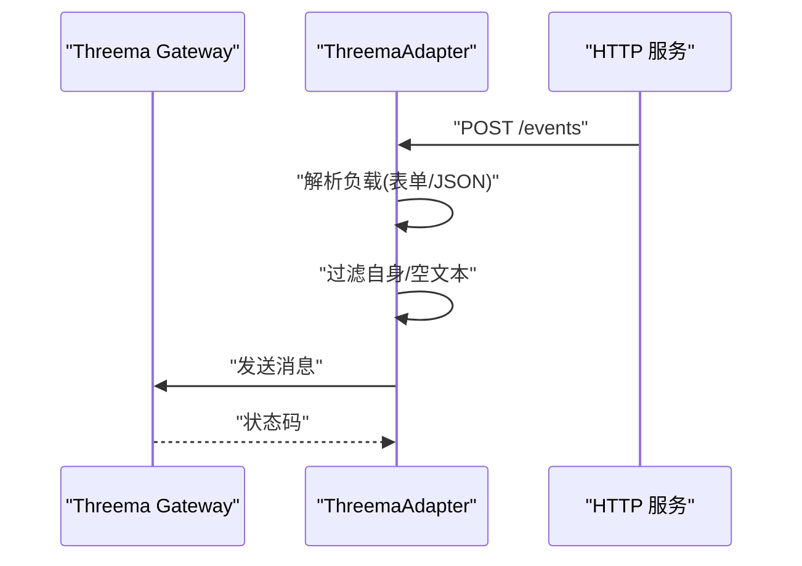

**图表来源**
- [threema.rs:177-340](file://crates/openfang-channels/src/threema.rs#L177-L340)
- [threema.rs:112-175](file://crates/openfang-channels/src/threema.rs#L112-L175)

**章节来源**
- [threema.rs:1-431](file://crates/openfang-channels/src/threema.rs#L1-L431)

### Twist 适配器
- 认证与健康：Bearer Token 获取会话用户
- 入站事件：轮询 channels/threads/comments，增量拉取，过滤自身消息
- 出站消息：comments/add 接口发送评论，按最大长度切片
- 线程回复：支持 send_in_thread
- 命令解析：以 “/” 开头的文本解析为命令

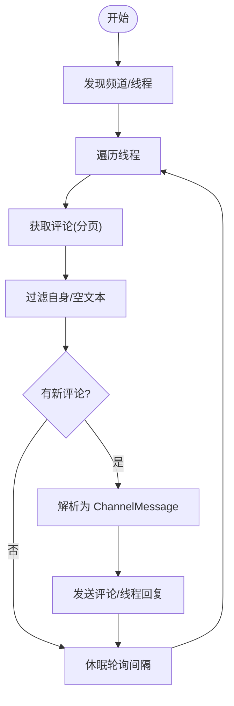

**图表来源**
- [twist.rs:267-502](file://crates/openfang-channels/src/twist.rs#L267-L502)
- [twist.rs:179-255](file://crates/openfang-channels/src/twist.rs#L179-L255)

**章节来源**
- [twist.rs:1-604](file://crates/openfang-channels/src/twist.rs#L1-L604)

### Cisco Webex 适配器
- 认证与健康：Bearer Token 获取用户信息
- 入站事件：WebSocket Mercury 连接，解析 activity，按房间白名单过滤，再调用 REST 获取完整消息
- 出站消息：messages 接口发送，按最大长度切片
- 命令解析：以 “/” 开头的文本解析为命令
- 房间类型：根据 roomType 判断群组/私聊

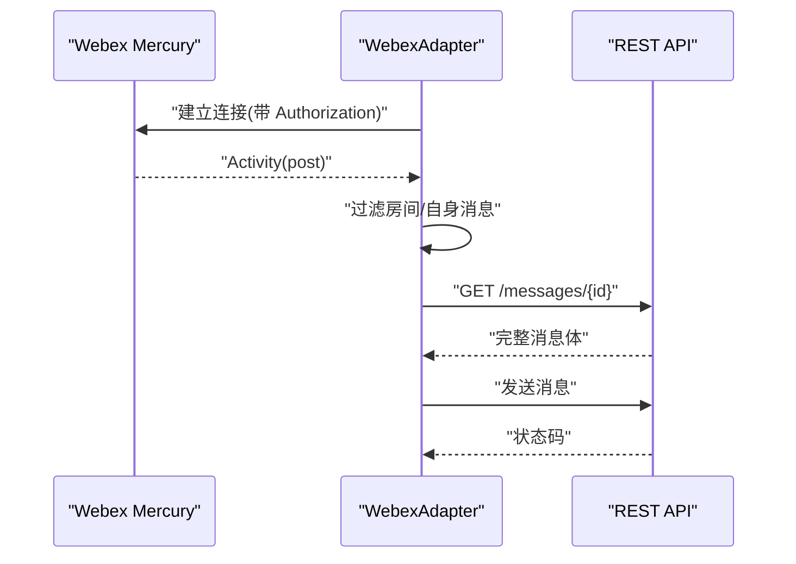

**图表来源**
- [webex.rs:241-448](file://crates/openfang-channels/src/webex.rs#L241-L448)
- [webex.rs:94-159](file://crates/openfang-channels/src/webex.rs#L94-L159)

**章节来源**
- [webex.rs:1-523](file://crates/openfang-channels/src/webex.rs#L1-L523)

### 通用桥接与路由
- 路由优先级：绑定规则 > 直连路由 > 用户默认 > 频道默认 > 系统默认
- 广播策略：支持并行/顺序两种广播方式，结合 Agent 名称缓存解析
- 输出格式：按通道默认格式（如 Telegram HTML、Slack Mrkdwn、纯文本）进行格式化
- 生命周期反应：对思考、工具执行、流式输出、完成、错误等阶段发送表情反应
- 速率限制：按用户维度的每分钟计数限流
- 命令处理：内置命令（如 agents、models、workflows 等）优先处理

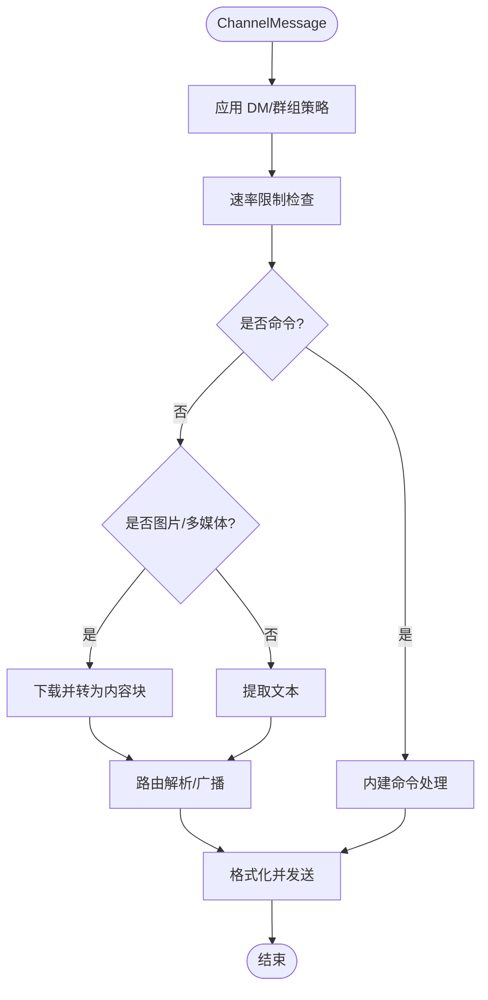

**图表来源**
- [bridge.rs:526-800](file://crates/openfang-channels/src/bridge.rs#L526-L800)
- [router.rs:138-254](file://crates/openfang-channels/src/router.rs#L138-L254)
- [formatter.rs:10-27](file://crates/openfang-channels/src/formatter.rs#L10-L27)

**章节来源**
- [router.rs:1-645](file://crates/openfang-channels/src/router.rs#L1-L645)
- [bridge.rs:1-800](file://crates/openfang-channels/src/bridge.rs#L1-L800)
- [formatter.rs:1-676](file://crates/openfang-channels/src/formatter.rs#L1-L676)

## 依赖关系分析
- 内部依赖
  - openfang-channels 依赖 openfang-types 提供统一类型与配置
  - 各适配器依赖 tokio、futures、reqwest、tokio-tungstenite、axum 等异步运行时与网络栈
- 外部依赖
  - 各平台 SDK/HTTP API：Flock、Guilded、Keybase、Nextcloud、Pumble、Threema、Twist、Webex
  - 加解密与安全：hmac、sha2、sha1、aes、cbc、base64、hex 等
  - 邮件相关：lettre、imap、native-tls、mailparse（用于邮件通道）

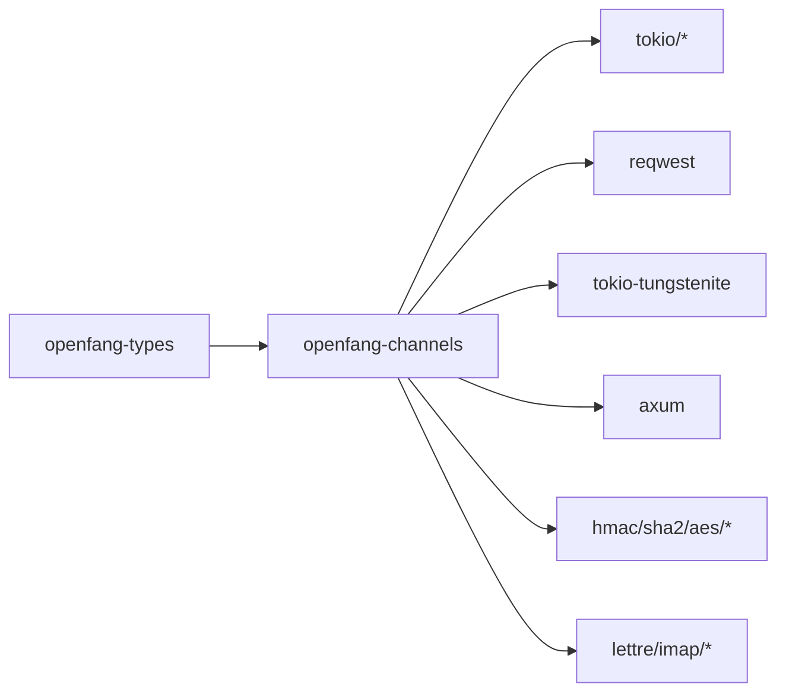

**图表来源**
- [Cargo.toml:8-40](file://crates/openfang-channels/Cargo.toml#L8-L40)

**章节来源**
- [Cargo.toml:1-43](file://crates/openfang-channels/Cargo.toml#L1-L43)

## 性能考量
- 并发分发：BridgeManager 对每个入站消息启动独立任务，避免慢 LLM 阻塞后续消息
- 速率限制：按用户维度的每分钟计数，防止突发流量导致平台限流
- 输出格式化：针对不同平台的格式转换开销较小，但需注意超长文本切片
- 轮询与 WebSocket：轮询类适配器（Keybase、Nextcloud、Twist）采用指数退避与分页，减少 API 压力
- 广播策略：并行广播可提升响应速度，但需关注下游平台的速率限制与幂等性

[本节为通用指导，无需特定文件引用]

## 故障排查指南
- 认证失败
  - 检查 Token/Bearer/Secret 是否正确，平台接口返回状态码与错误信息
  - 参考各适配器的 validate 方法与错误路径
- 事件未到达
  - 确认 Webhook 端口可用、URL 验证挑战已处理（Pumble）
  - 确认 WebSocket 连接参数与重连逻辑（Guilded、Webex）
  - 检查轮询间隔与 lastKnownMessageId（Keybase、Nextcloud、Twist）
- 消息未发送
  - 检查输出格式化与最大长度限制（各适配器常量）
  - 确认平台对 typing/reaction 的支持情况
- 权限与广播
  - 检查 AgentRouter 的绑定规则与广播配置
  - 确认 Kernel 的 authorize_channel_user 返回值
- 日志与可观测性
  - 使用 tracing 日志级别定位问题
  - 结合 ChannelStatus 与 DeliveryReceipt 进行追踪

**章节来源**
- [flock.rs:61-120](file://crates/openfang-channels/src/flock.rs#L61-L120)
- [guilded.rs:64-120](file://crates/openfang-channels/src/guilded.rs#L64-L120)
- [keybase.rs:72-192](file://crates/openfang-channels/src/keybase.rs#L72-L192)
- [nextcloud.rs:78-159](file://crates/openfang-channels/src/nextcloud.rs#L78-L159)
- [pumble.rs:61-116](file://crates/openfang-channels/src/pumble.rs#L61-L116)
- [threema.rs:64-110](file://crates/openfang-channels/src/threema.rs#L64-L110)
- [twist.rs:71-186](file://crates/openfang-channels/src/twist.rs#L71-L186)
- [webex.rs:68-182](file://crates/openfang-channels/src/webex.rs#L68-L182)
- [bridge.rs:229-269](file://crates/openfang-channels/src/bridge.rs#L229-L269)

## 结论
OpenFang 的通道适配层通过统一的 ChannelAdapter 抽象，将企业与社区平台的消息事件标准化为 ChannelMessage，并借助 AgentRouter 与 BridgeManager 实现灵活的路由、广播、格式化与并发分发。各平台适配器遵循一致的安全与认证模式，结合速率限制与输出格式化，满足企业级部署对合规、性能与可观测性的要求。通过内建命令与广播策略，平台适配器为自动化脚本与工作流提供了坚实基础。

[本节为总结，无需特定文件引用]

## 附录

### 企业级平台认证与权限管理
- 认证机制
  - Bot Token/Bearer Token：Flock、Guilded、Pumble、Webex
  - API Secret：Threema
  - App Password/OAuth2：Nextcloud、Twist
  - 用户名/Paperkey：Keybase
- 权限与访问控制
  - Kernel 的 authorize_channel_user 可扩展实现 RBAC
  - 平台侧权限（如房间/频道白名单）在适配器中实现
- 数据安全
  - 凭据使用 zeroize 在内存中清理
  - 输出格式化避免泄露 Markdown 语法（尤其企业场景）

**章节来源**
- [flock.rs:33-59](file://crates/openfang-channels/src/flock.rs#L33-L59)
- [guilded.rs:35-62](file://crates/openfang-channels/src/guilded.rs#L35-L62)
- [keybase.rs:35-70](file://crates/openfang-channels/src/keybase.rs#L35-L70)
- [nextcloud.rs:33-68](file://crates/openfang-channels/src/nextcloud.rs#L33-L68)
- [pumble.rs:32-59](file://crates/openfang-channels/src/pumble.rs#L32-L59)
- [threema.rs:31-62](file://crates/openfang-channels/src/threema.rs#L31-L62)
- [twist.rs:35-69](file://crates/openfang-channels/src/twist.rs#L35-L69)
- [webex.rs:36-66](file://crates/openfang-channels/src/webex.rs#L36-L66)

### 社区平台用户管理与内容治理
- 用户管理
  - 通过 ChannelUser 映射平台用户 ID 与显示名称
  - 支持 openfang_user 关联内部身份
- 群组权限
  - DM/群组策略：Ignore、AllowedOnly、Respond、CommandsOnly、MentionOnly
  - 线程上下文：thread_id 保留论坛主题等上下文
- 内容治理
  - 命令优先处理，支持内建命令与外部 Agent
  - 生命周期反应与打字指示增强用户体验
  - 输出格式化与纯文本策略降低敏感信息泄露风险

**章节来源**
- [types.rs:29-96](file://crates/openfang-channels/src/types.rs#L29-L96)
- [bridge.rs:557-622](file://crates/openfang-channels/src/bridge.rs#L557-L622)
- [formatter.rs:20-27](file://crates/openfang-channels/src/formatter.rs#L20-L27)

### 企业部署指南与合规配置
- 端口与网络
  - Webhook 适配器需开放本地端口（Flock、Pumble、Threema）
  - WebSocket 适配器需允许出站 wss 连接（Guilded、Webex）
- 速率限制与批处理
  - 合理设置 per-user 速率限制，避免平台限流
  - 广播策略选择并行/顺序，平衡延迟与吞吐
- 审计与日志
  - 记录 DeliveryReceipt 与 ChannelStatus，便于审计
  - 使用 tracing 输出详细日志，配合集中式日志系统
- 自动化脚本
  - 通过内建命令（agents、workflows、schedules 等）与 Kernel API 编排自动化
  - 使用 BridgeManager 的并发分发能力提升脚本执行效率

**章节来源**
- [bridge.rs:229-269](file://crates/openfang-channels/src/bridge.rs#L229-L269)
- [bridge.rs:402-454](file://crates/openfang-channels/src/bridge.rs#L402-L454)
- [comms.rs:89-104](file://crates/openfang-types/src/comms.rs#L89-L104)