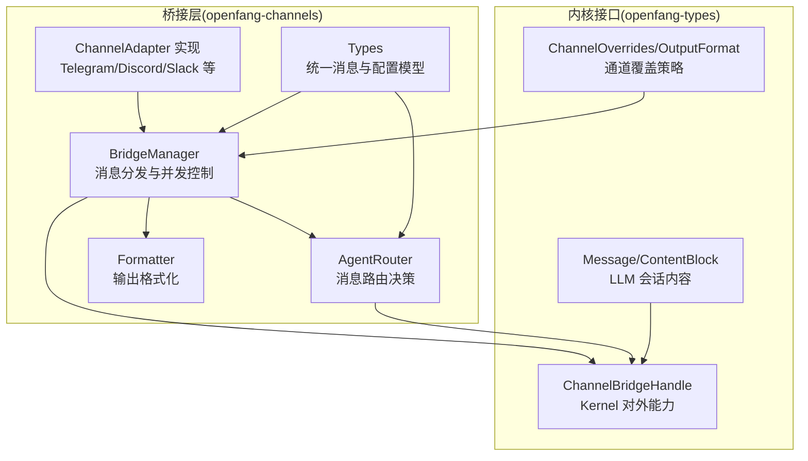
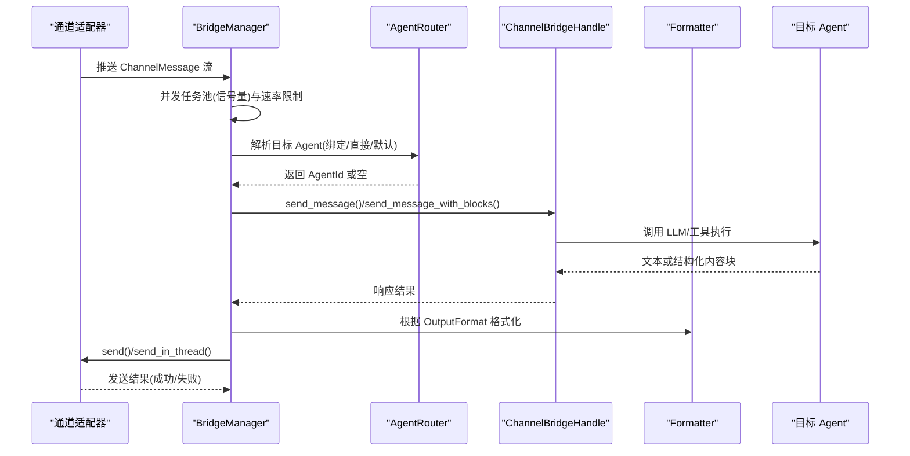
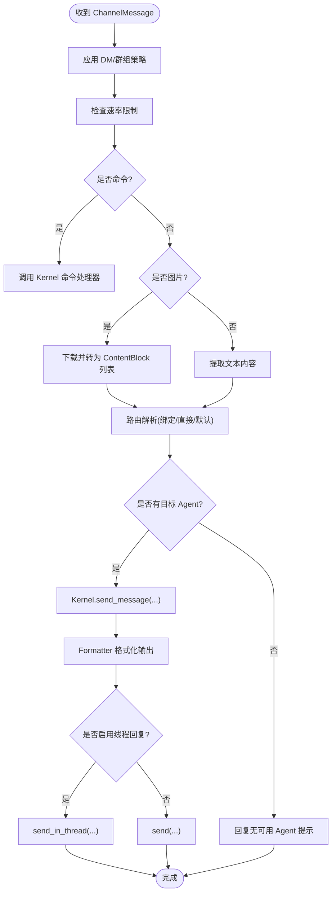
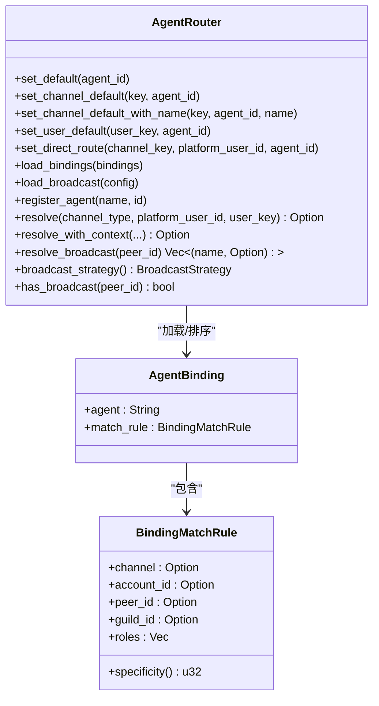
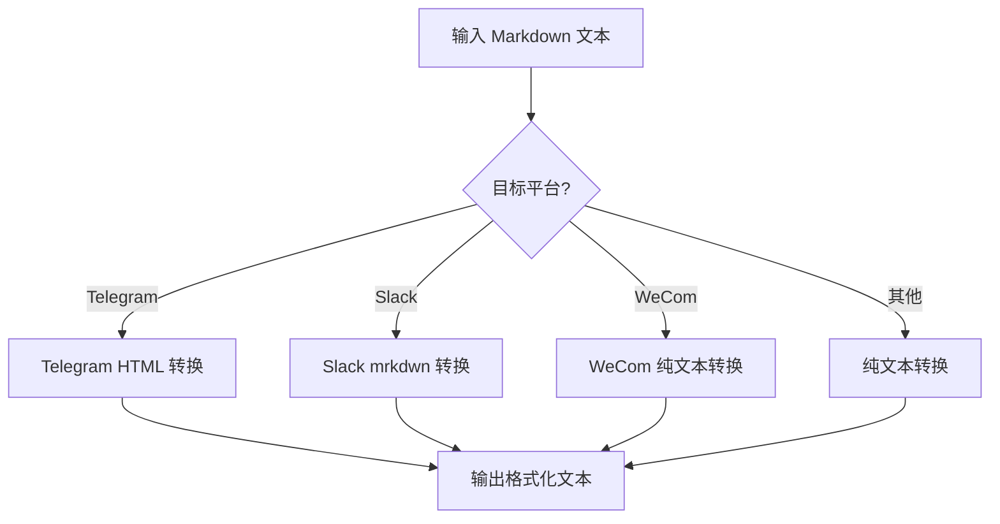
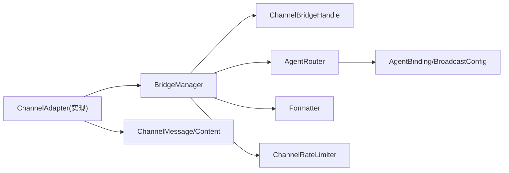
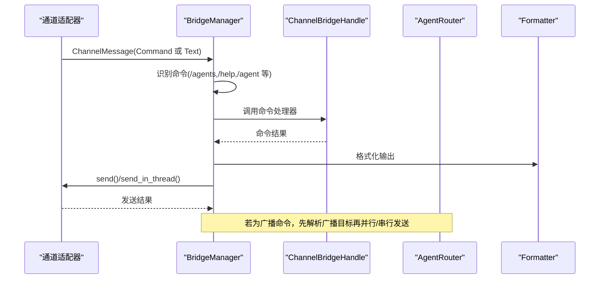

# 桥接核心组件

<cite>
**本文引用的文件**
- [crates/openfang-channels/src/lib.rs](file://crates/openfang-channels/src/lib.rs)
- [crates/openfang-channels/src/bridge.rs](file://crates/openfang-channels/src/bridge.rs)
- [crates/openfang-channels/src/router.rs](file://crates/openfang-channels/src/router.rs)
- [crates/openfang-channels/src/types.rs](file://crates/openfang-channels/src/types.rs)
- [crates/openfang-channels/src/formatter.rs](file://crates/openfang-channels/src/formatter.rs)
- [crates/openfang-channels/src/discord.rs](file://crates/openfang-channels/src/discord.rs)
- [crates/openfang-channels/src/telegram.rs](file://crates/openfang-channels/src/telegram.rs)
- [crates/openfang-channels/src/slack.rs](file://crates/openfang-channels/src/slack.rs)
- [crates/openfang-types/src/config.rs](file://crates/openfang-types/src/config.rs)
- [crates/openfang-types/src/message.rs](file://crates/openfang-types/src/message.rs)
- [crates/openfang-channels/tests/bridge_integration_test.rs](file://crates/openfang-channels/tests/bridge_integration_test.rs)
- [openfang.toml.example](file://openfang.toml.example)
</cite>

## 目录
1. [简介](#简介)
2. [项目结构](#项目结构)
3. [核心组件](#核心组件)
4. [架构总览](#架构总览)
5. [详细组件分析](#详细组件分析)
6. [依赖关系分析](#依赖关系分析)
7. [性能考量](#性能考量)
8. [故障排查指南](#故障排查指南)
9. [结论](#结论)
10. [附录](#附录)

## 简介
本文件面向 OpenFang 消息桥接核心组件，系统性阐述 Bridge 模块的消息桥接机制（消息转换、协议适配、错误处理）、Router 的消息路由策略（路由规则、负载均衡、故障转移）、Types 模块的核心数据结构（ChannelMessage、MessagePayload、ChannelConfig 等），以及 Formatter 的消息格式化规则（Markdown 处理、HTML 转换、媒体内容格式化）。同时提供配置示例、性能优化建议与调试方法，帮助开发者在不同渠道间实现稳定、可扩展、可观测的消息桥接。

## 项目结构
OpenFang 的桥接层位于 crates/openfang-channels，采用“通道适配器 + 桥接管理器 + 路由器 + 格式化器”的分层设计，统一将多平台消息抽象为 ChannelMessage，并通过 Kernel 提供的 ChannelBridgeHandle 将消息投递到目标 Agent，再按平台要求进行格式化与发送。



图示来源
- [crates/openfang-channels/src/lib.rs:1-55](file://crates/openfang-channels/src/lib.rs#L1-L55)
- [crates/openfang-channels/src/bridge.rs:271-382](file://crates/openfang-channels/src/bridge.rs#L271-L382)
- [crates/openfang-channels/src/router.rs:25-45](file://crates/openfang-channels/src/router.rs#L25-L45)
- [crates/openfang-channels/src/formatter.rs:10-27](file://crates/openfang-channels/src/formatter.rs#L10-L27)
- [crates/openfang-types/src/config.rs:70-113](file://crates/openfang-types/src/config.rs#L70-L113)
- [crates/openfang-types/src/message.rs:26-96](file://crates/openfang-types/src/message.rs#L26-L96)

章节来源
- [crates/openfang-channels/src/lib.rs:1-55](file://crates/openfang-channels/src/lib.rs#L1-L55)

## 核心组件
- Bridge 模块：负责启动各通道适配器、接收消息流、并发调度、策略执行（DM/群组策略、速率限制、线程回复、生命周期反应）、命令处理与广播路由。
- Router 模块：基于绑定规则、直接路由、用户默认、通道默认与系统默认的优先级解析目标 Agent；支持广播策略（并行/串行）。
- Types 模块：定义 ChannelType、ChannelUser、ChannelContent、ChannelMessage、AgentPhase、LifecycleReaction、DeliveryStatus、ChannelAdapter trait、消息拆分工具等。
- Formatter 模块：将标准 Markdown 转换为 Telegram HTML、Slack mrkdwn 或纯文本，针对企业微信提供更强的纯文本转换。
- 通道适配器：以 Discord、Telegram、Slack 为例，展示如何接入 WebSocket/长轮询、REST API 发送消息、线程回复、打字指示与生命周期反应。

章节来源
- [crates/openfang-channels/src/bridge.rs:271-382](file://crates/openfang-channels/src/bridge.rs#L271-L382)
- [crates/openfang-channels/src/router.rs:25-45](file://crates/openfang-channels/src/router.rs#L25-L45)
- [crates/openfang-channels/src/types.rs:12-96](file://crates/openfang-channels/src/types.rs#L12-L96)
- [crates/openfang-channels/src/formatter.rs:10-27](file://crates/openfang-channels/src/formatter.rs#L10-L27)

## 架构总览
下图展示了从通道适配器到 Kernel 的完整调用链路，以及桥接管理器如何协调并发、策略与格式化：



图示来源
- [crates/openfang-channels/src/bridge.rs:309-382](file://crates/openfang-channels/src/bridge.rs#L309-L382)
- [crates/openfang-channels/src/router.rs:141-187](file://crates/openfang-channels/src/router.rs#L141-L187)
- [crates/openfang-channels/src/formatter.rs:10-18](file://crates/openfang-channels/src/formatter.rs#L10-L18)

## 详细组件分析

### Bridge 模块：消息桥接与调度
- 并发与背压
  - 使用 tokio 信号量限制并发分发任务数量，避免突发流量导致内存膨胀。
  - 通道适配器的事件流被 pin 并循环消费，每个消息派生一个独立任务，确保慢响应不会阻塞后续消息。
- 策略执行
  - DM/群组策略：支持忽略、仅命令、仅提及、全部；对群组消息进行前置过滤。
  - 速率限制：按用户维度（channel_type + platform_id）统计最近 60 秒内的消息数，超过阈值则直接返回限流提示。
  - 输出格式：根据通道覆盖策略选择 Telegram HTML、Slack mrkdwn、纯文本或 Markdown。
  - 线程回复：当启用线程且消息带 thread_id 时，使用 send_in_thread 回复。
  - 生命周期反应：在支持的通道上发送阶段表情（⏳🤔⚙✍️✅❌），提升 UX。
- 命令处理
  - 识别 ChannelContent::Command 与文本中的斜杠命令，优先交由 Kernel 处理（如 /agents、/help、/agent 等）。
- 广播路由
  - 支持并行/串行两种广播策略，将同一消息分发给多个目标 Agent，并汇总结果后统一回复。
- 错误处理
  - 发送失败记录日志；对“Agent not found”场景尝试按通道默认名称重新解析；对部分通道抑制错误回显以避免公开渠道泄露敏感信息。



图示来源
- [crates/openfang-channels/src/bridge.rs:526-800](file://crates/openfang-channels/src/bridge.rs#L526-L800)
- [crates/openfang-channels/src/bridge.rs:402-426](file://crates/openfang-channels/src/bridge.rs#L402-L426)
- [crates/openfang-channels/src/bridge.rs:437-454](file://crates/openfang-channels/src/bridge.rs#L437-L454)

章节来源
- [crates/openfang-channels/src/bridge.rs:271-382](file://crates/openfang-channels/src/bridge.rs#L271-L382)
- [crates/openfang-channels/src/bridge.rs:526-800](file://crates/openfang-channels/src/bridge.rs#L526-L800)

### Router 模块：消息路由策略
- 路由优先级
  - 绑定规则（最具体）→ 直接路由 → 用户默认 → 通道默认 → 系统默认。
  - 绑定规则按字段完备度评分排序，确保更具体的规则优先匹配。
- 绑定匹配
  - 支持 channel、account_id、peer_id、guild_id、roles 等字段组合匹配；用户必须至少拥有 roles 中的一个。
- 广播路由
  - 配置 peer_id → agent 名称列表，支持并行/串行两种策略；运行时可热更新。
- 运行时缓存
  - agent 名称 → AgentId 缓存，避免每次解析开销；支持通道默认名称回退（UUID 变化后重解析）。



图示来源
- [crates/openfang-channels/src/router.rs:25-341](file://crates/openfang-channels/src/router.rs#L25-L341)
- [crates/openfang-types/src/config.rs:667-735](file://crates/openfang-types/src/config.rs#L667-L735)

章节来源
- [crates/openfang-channels/src/router.rs:141-254](file://crates/openfang-channels/src/router.rs#L141-L254)
- [crates/openfang-types/src/config.rs:667-735](file://crates/openfang-types/src/config.rs#L667-L735)

### Types 模块：核心数据结构
- ChannelType：统一表示通道类型（Telegram、Discord、Slack、WhatsApp、Signal、Matrix、Email、Teams、Mattermost、WebChat、CLI、Custom）。
- ChannelUser：平台用户标识、显示名、可选的 OpenFang 用户映射。
- ChannelContent：消息内容变体（文本、图片、文件、本地文件数据、语音、位置、命令）。
- ChannelMessage：统一消息载体（含通道、消息 ID、发送者、内容、目标 Agent、时间戳、是否群聊、线程 ID、元数据）。
- AgentPhase/LifecycleReaction：Agent 生命周期阶段与对应反应表情，支持移除前一阶段反应。
- ChannelAdapter trait：通道适配器需实现的接口（start、send、send_typing、send_reaction、send_in_thread、status、suppress_error_responses 等）。
- split_message：按换行安全切分长文本，用于适配各平台长度限制。

```mermaid
classDiagram
class ChannelType {
<<enum>>
+Telegram
+Discord
+Slack
+WhatsApp
+...
+Custom(String)
}
class ChannelUser {
+platform_id : String
+display_name : String
+openfang_user : Option<String>
}
class ChannelContent {
<<enum>>
+Text(String)
+Image{url,caption}
+File{url,filename}
+FileData{data,filename,mime_type}
+Voice{url,duration_seconds}
+Location{lat,lon}
+Command{name,args}
}
class ChannelMessage {
+channel : ChannelType
+platform_message_id : String
+sender : ChannelUser
+content : ChannelContent
+target_agent : Option<AgentId>
+timestamp : DateTime
+is_group : bool
+thread_id : Option<String>
+metadata : HashMap
}
class ChannelAdapter {
<<trait>>
+name() &str
+channel_type() ChannelType
+start() -> Stream<ChannelMessage>
+send(user, content)
+send_typing(user)
+send_reaction(user, message_id, reaction)
+send_in_thread(user, content, thread_id)
+status() ChannelStatus
+suppress_error_responses() bool
}
ChannelMessage --> ChannelType
ChannelMessage --> ChannelUser
ChannelMessage --> ChannelContent
ChannelAdapter --> ChannelMessage
```

图示来源
- [crates/openfang-channels/src/types.rs:12-280](file://crates/openfang-channels/src/types.rs#L12-L280)

章节来源
- [crates/openfang-channels/src/types.rs:12-280](file://crates/openfang-channels/src/types.rs#L12-L280)

### Formatter 模块：消息格式化规则
- 格式化策略
  - Markdown：原样输出（便于跨平台一致性）。
  - Telegram HTML：支持粗体、斜体、代码、预格式块、链接、引用块、有序/无序列表等。
  - Slack mrkdwn：支持粗体与链接转换为 mrkdwn 风格。
  - 纯文本：剥离所有格式，保留可读文本与链接可读形式。
  - 企业微信：使用更强的纯文本转换，避免 Markdown 语法泄漏。
- 内联渲染与转义
  - Telegram HTML：对尖括号进行 HTML 转义，逐个处理链接、粗体、行内代码与斜体。
  - Slack mrkdwn：将链接转换为 <url|text> 形式，将 **text** 转为 *text*。
  - WeCom/纯文本：移除标题、引用块、任务列表、表格分隔线等，保留正文与链接可读形式。



图示来源
- [crates/openfang-channels/src/formatter.rs:10-27](file://crates/openfang-channels/src/formatter.rs#L10-L27)
- [crates/openfang-channels/src/formatter.rs:29-237](file://crates/openfang-channels/src/formatter.rs#L29-L237)
- [crates/openfang-channels/src/formatter.rs:288-327](file://crates/openfang-channels/src/formatter.rs#L288-L327)
- [crates/openfang-channels/src/formatter.rs:460-513](file://crates/openfang-channels/src/formatter.rs#L460-L513)
- [crates/openfang-channels/src/formatter.rs:515-564](file://crates/openfang-channels/src/formatter.rs#L515-L564)

章节来源
- [crates/openfang-channels/src/formatter.rs:10-27](file://crates/openfang-channels/src/formatter.rs#L10-L27)
- [crates/openfang-channels/src/formatter.rs:29-237](file://crates/openfang-channels/src/formatter.rs#L29-L237)

### 通道适配器示例：Discord、Telegram、Slack
- Discord
  - 使用 Gateway WebSocket(v10) 接收事件，REST API 发送消息；支持意图、白名单服务器/用户、断线重连与指数退避。
  - 分片消息按 2000 字符限制切分发送。
- Telegram
  - 使用 getUpdates 长轮询，支持代理/镜像 API 地址；消息按 4096 字符限制切分；HTML 渲染前进行严格标签白名单转义。
  - 支持 @ 机器人提及检测（结合 bot 用户名）。
- Slack
  - 使用 Socket Mode WebSocket(app token) 接收事件，Web API(chat.postMessage) 发送消息；支持线程回复、链接展开、活动线程维护与清理。

章节来源
- [crates/openfang-channels/src/discord.rs:19-136](file://crates/openfang-channels/src/discord.rs#L19-L136)
- [crates/openfang-channels/src/telegram.rs:20-140](file://crates/openfang-channels/src/telegram.rs#L20-L140)
- [crates/openfang-channels/src/slack.rs:20-134](file://crates/openfang-channels/src/slack.rs#L20-L134)

## 依赖关系分析
- 组件耦合
  - BridgeManager 依赖 ChannelBridgeHandle（Kernel 能力）、AgentRouter（路由决策）、Formatter（输出格式化）、ChannelRateLimiter（速率控制）。
  - Router 依赖 openfang-types 的 AgentBinding/BroadcastConfig/OutputFormat 等配置模型。
  - 通道适配器实现 ChannelAdapter trait，向 BridgeManager 提供统一的 ChannelMessage 流。
- 外部依赖
  - reqwest/tokio-tungstenite 用于 HTTP/WebSocket 通信。
  - dashmap 用于并发哈希表（速率桶、线程活跃期、状态缓存）。
  - tracing 用于日志与可观测性。



图示来源
- [crates/openfang-channels/src/bridge.rs:271-382](file://crates/openfang-channels/src/bridge.rs#L271-L382)
- [crates/openfang-channels/src/router.rs:25-45](file://crates/openfang-channels/src/router.rs#L25-L45)
- [crates/openfang-channels/src/types.rs:215-280](file://crates/openfang-channels/src/types.rs#L215-L280)

章节来源
- [crates/openfang-channels/src/bridge.rs:271-382](file://crates/openfang-channels/src/bridge.rs#L271-L382)
- [crates/openfang-channels/src/router.rs:25-45](file://crates/openfang-channels/src/router.rs#L25-L45)

## 性能考量
- 并发与背压
  - 使用信号量限制并发分发任务上限（默认 32），避免突发流量导致内存与 CPU 抖动。
  - 通道事件流采用 pin + select! 循环，保证高吞吐下的稳定性。
- 速率限制
  - 按用户维度维护最近 60 秒消息时间戳，O(1) 判断是否超限，避免对上游平台施加压力。
- 文本切分
  - split_message 按换行安全切分，减少跨字符边界错误与重复分配。
- 平台限制适配
  - Telegram/Slack/Discord 各自的消息长度限制已内置切分逻辑，避免 400/413 等错误。
- 广播策略
  - 并行广播可显著降低端到端延迟，但会增加下游负载；串行广播更保守，适合资源受限环境。

## 故障排查指南
- 常见问题定位
  - “Agent not found”：检查通道默认名称是否正确，确认 Kernel 是否存在该 Agent；Bridge 会尝试按名称重解析并更新缓存。
  - 发送失败：查看通道适配器日志（如 Telegram/Discord/Slack 的 API 返回），关注 4xx/5xx 错误码与错误描述。
  - 速率限制：若出现“请等待”类提示，检查 ChannelOverrides 中 rate_limit_per_user 设置，或临时提高阈值。
  - 群组消息未响应：检查 group_policy 与 mention_only/commands_only 条件，确认是否被前置策略过滤。
  - 线程回复无效：确认启用 threading 且消息携带 thread_id；部分平台需要额外参数（如 Telegram 的 message_thread_id）。
- 调试方法
  - 启用更详细的日志级别（trace/debug），观察 BridgeManager 的 dispatch 流程与 Router 的解析路径。
  - 使用集成测试模式（MockAdapter/MockHandle）验证端到端流程，快速定位问题点。
  - 通过 Kernel 提供的命令（/status、/agents、/help 等）检查系统状态与可用 Agent 列表。

章节来源
- [crates/openfang-channels/src/bridge.rs:487-524](file://crates/openfang-channels/src/bridge.rs#L487-L524)
- [crates/openfang-channels/tests/bridge_integration_test.rs:200-546](file://crates/openfang-channels/tests/bridge_integration_test.rs#L200-L546)

## 结论
OpenFang 的桥接核心组件通过“统一消息模型 + 可插拔适配器 + 强策略控制 + 可观测格式化”的设计，在多平台消息桥接中实现了高可靠性、高扩展性与良好的用户体验。借助 Router 的灵活绑定与广播策略、Bridge 的并发与限流、Formatter 的平台适配，系统能够在复杂生产环境中稳定运行并持续演进。

## 附录

### 配置示例
- 全局默认模型与网络监听
  - 示例参考：[openfang.toml.example:8-26](file://openfang.toml.example#L8-L26)
- 通道适配器配置
  - Telegram：令牌环境变量、允许用户列表
    - 示例参考：[openfang.toml.example:32-34](file://openfang.toml.example#L32-L34)
  - Discord：令牌环境变量、服务器白名单
    - 示例参考：[openfang.toml.example:36-38](file://openfang.toml.example#L36-L38)
  - Slack：bot/app 令牌环境变量
    - 示例参考：[openfang.toml.example:40-42](file://openfang.toml.example#L40-L42)
- 通道覆盖策略（DM/群组策略、速率限制、线程、输出格式）
  - 类型定义参考：[crates/openfang-types/src/config.rs:70-113](file://crates/openfang-types/src/config.rs#L70-L113)
- 广播配置
  - 类型定义参考：[crates/openfang-types/src/config.rs:716-735](file://crates/openfang-types/src/config.rs#L716-L735)

### 关键流程图：命令处理与广播


图示来源
- [crates/openfang-channels/src/bridge.rs:616-800](file://crates/openfang-channels/src/bridge.rs#L616-L800)
- [crates/openfang-channels/src/router.rs:223-254](file://crates/openfang-channels/src/router.rs#L223-L254)