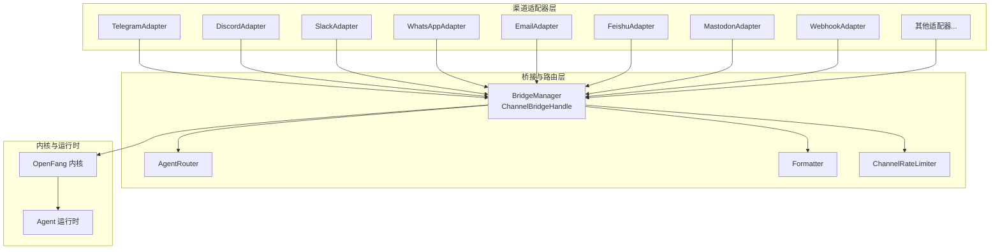
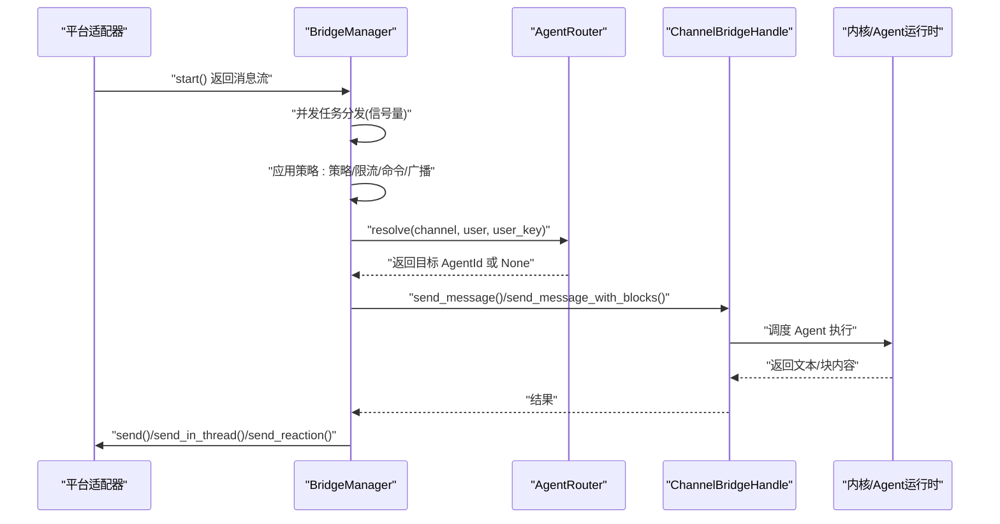
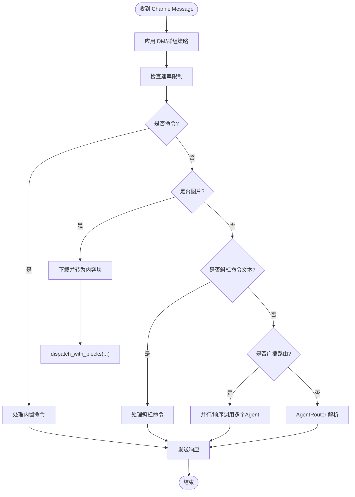
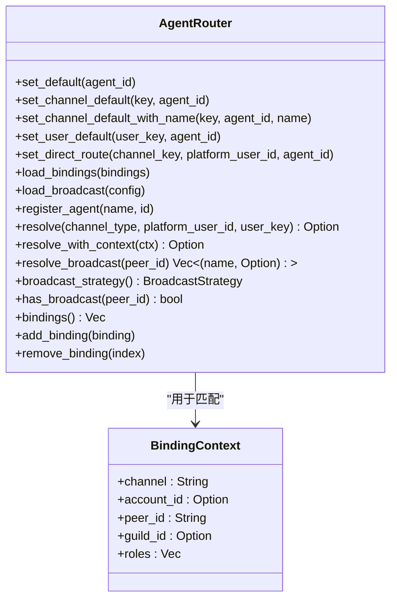
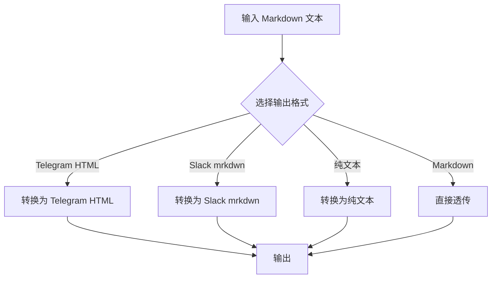
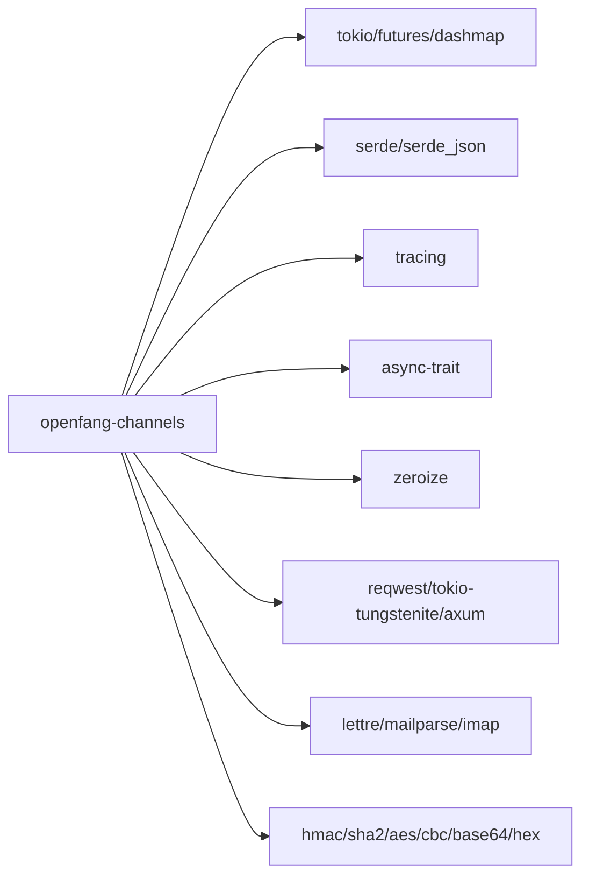

# 消息渠道适配器 (openfang-channels)

<cite>
**本文档引用的文件**
- [lib.rs](file://crates/openfang-channels/src/lib.rs)
- [bridge.rs](file://crates/openfang-channels/src/bridge.rs)
- [router.rs](file://crates/openfang-channels/src/router.rs)
- [formatter.rs](file://crates/openfang-channels/src/formatter.rs)
- [types.rs](file://crates/openfang-channels/src/types.rs)
- [telegram.rs](file://crates/openfang-channels/src/telegram.rs)
- [discord.rs](file://crates/openfang-channels/src/discord.rs)
- [slack.rs](file://crates/openfang-channels/src/slack.rs)
- [whatsapp.rs](file://crates/openfang-channels/src/whatsapp.rs)
- [email.rs](file://crates/openfang-channels/src/email.rs)
- [feishu.rs](file://crates/openfang-channels/src/feishu.rs)
- [mastodon.rs](file://crates/openfang-channels/src/mastodon.rs)
- [webhook.rs](file://crates/openfang-channels/src/webhook.rs)
- [Cargo.toml](file://crates/openfang-channels/Cargo.toml)
</cite>

## 目录
1. [简介](#简介)
2. [项目结构](#项目结构)
3. [核心组件](#核心组件)
4. [架构总览](#架构总览)
5. [详细组件分析](#详细组件分析)
6. [依赖关系分析](#依赖关系分析)
7. [性能考量](#性能考量)
8. [故障排查指南](#故障排查指南)
9. [结论](#结论)
10. [附录](#附录)

## 简介
本文件为 OpenFang 消息渠道适配器（openfang-channels）的系统性技术文档，覆盖以下目标：
- 解释 40 种消息平台的集成方案与适配器模式
- 深入说明 Bridge 的消息桥接机制、Router 的消息路由策略
- 详解 ChannelAdapter 的实现模式、Formatter 的消息格式化规则、Rate Limiter 的流量控制机制
- 提供适配器开发示例、消息格式转换、错误处理策略
- 解释与内核和运行时的交互关系，给出新渠道接入指南与性能优化建议
- 记录各渠道的特殊配置与限制条件

## 项目结构
openfang-channels 作为“渠道桥接层”，提供统一的 ChannelMessage 抽象与适配器接口，屏蔽不同平台的消息差异，并通过 Bridge 将消息投递到内核，再由 Router 将消息路由到具体 Agent。

图表来源
- [lib.rs:1-55](file://crates/openfang-channels/src/lib.rs#L1-L55)
- [bridge.rs:272-382](file://crates/openfang-channels/src/bridge.rs#L272-L382)
- [router.rs:28-45](file://crates/openfang-channels/src/router.rs#L28-L45)
- [formatter.rs:10-18](file://crates/openfang-channels/src/formatter.rs#L10-L18)
- [types.rs:215-280](file://crates/openfang-channels/src/types.rs#L215-L280)

章节来源
- [lib.rs:1-55](file://crates/openfang-channels/src/lib.rs#L1-L55)

## 核心组件
- ChannelAdapter 接口：定义每个渠道适配器必须实现的生命周期与消息收发能力，包括 start、send、send_typing、send_reaction、send_in_thread、status、stop 等。
- ChannelBridgeHandle：由内核实现的桥接句柄，提供发送消息、查找/启动 Agent、会话管理、权限校验、广播工作流等能力。
- BridgeManager：持有所有已启动的适配器，订阅其消息流，进行并发分发、速率控制、命令处理、线程回复、生命周期反应等。
- AgentRouter：基于绑定规则、直连路由、用户默认、频道默认与系统默认的多级路由策略，支持广播路由与动态绑定更新。
- Formatter：将标准 Markdown 转换为各平台特定的标记格式（如 Telegram HTML、Slack mrkdwn、纯文本），并提供 WeCom 强制纯文本转换。
- ChannelRateLimiter：按用户粒度的每分钟消息计数限流，支持配置上限为 0 表示不限速。

章节来源
- [types.rs:215-280](file://crates/openfang-channels/src/types.rs#L215-L280)
- [bridge.rs:27-227](file://crates/openfang-channels/src/bridge.rs#L27-L227)
- [bridge.rs:272-382](file://crates/openfang-channels/src/bridge.rs#L272-L382)
- [router.rs:28-341](file://crates/openfang-channels/src/router.rs#L28-L341)
- [formatter.rs:10-27](file://crates/openfang-channels/src/formatter.rs#L10-L27)
- [bridge.rs:229-269](file://crates/openfang-channels/src/bridge.rs#L229-L269)

## 架构总览
下图展示从渠道适配器到内核的端到端流程，包括消息接收、策略决策、并发分发与响应发送。

图表来源
- [bridge.rs:309-382](file://crates/openfang-channels/src/bridge.rs#L309-L382)
- [bridge.rs:529-800](file://crates/openfang-channels/src/bridge.rs#L529-L800)
- [router.rs:141-187](file://crates/openfang-channels/src/router.rs#L141-L187)
- [types.rs:215-280](file://crates/openfang-channels/src/types.rs#L215-L280)

## 详细组件分析

### Bridge 与 ChannelBridgeHandle
- ChannelBridgeHandle 定义了桥接所需的最小内核能力集合，包括消息发送、Agent 查找/启动、会话管理、模型设置、触发器/工作流/日程/审批等管理接口，默认实现提供占位行为或返回未实现。
- BridgeManager 负责：
  - 启动适配器并订阅其消息流
  - 并发分发：使用信号量限制最大并发任务，避免突发流量导致内存膨胀
  - 应用策略：根据 per-channel overrides（输出格式、线程、生命周期反应、DM/群组策略、速率限制）执行
  - 命令处理：优先识别并处理内置命令
  - 广播路由：对命中广播规则的用户并行/顺序调用多个 Agent
  - 生命周期反应与打字指示：按平台能力发送反应与打字状态
  - 错误恢复：当 Agent 不存在时尝试按名称重新解析默认 Agent

图表来源
- [bridge.rs:529-800](file://crates/openfang-channels/src/bridge.rs#L529-L800)
- [bridge.rs:402-426](file://crates/openfang-channels/src/bridge.rs#L402-L426)
- [bridge.rs:456-472](file://crates/openfang-channels/src/bridge.rs#L456-L472)

章节来源
- [bridge.rs:27-227](file://crates/openfang-channels/src/bridge.rs#L27-L227)
- [bridge.rs:272-382](file://crates/openfang-channels/src/bridge.rs#L272-L382)
- [bridge.rs:529-800](file://crates/openfang-channels/src/bridge.rs#L529-L800)

### AgentRouter 路由策略
- 多级优先级：绑定规则（最具体）> 直连路由 > 用户默认 > 频道默认 > 系统默认
- 绑定规则支持字段匹配：频道、账号、用户、服务器/群组、角色；按“特定性分数”排序，分数越高越先匹配
- 广播路由：可配置广播策略（并行/顺序），并支持按用户名称解析为 AgentId
- 运行时更新：支持动态添加/删除绑定、更新广播配置、缓存 Agent 名称到 ID 的映射

图表来源
- [router.rs:28-341](file://crates/openfang-channels/src/router.rs#L28-L341)
- [router.rs:141-340](file://crates/openfang-channels/src/router.rs#L141-L340)

章节来源
- [router.rs:28-341](file://crates/openfang-channels/src/router.rs#L28-L341)

### Formatter 消息格式化
- 支持的输出格式：Markdown、Telegram HTML、Slack mrkdwn、纯文本
- WeCom 使用强制纯文本转换，避免泄露 Markdown 语法
- 典型转换规则：
  - Telegram HTML：支持粗体、斜体、代码、预格式、链接、区块引用、有序/无序列表
  - Slack mrkdwn：支持粗体、链接（<url|text>）
  - 纯文本：剥离格式，保留链接文本与 URL

图表来源
- [formatter.rs:10-27](file://crates/openfang-channels/src/formatter.rs#L10-L27)
- [formatter.rs:29-159](file://crates/openfang-channels/src/formatter.rs#L29-L159)
- [formatter.rs:288-327](file://crates/openfang-channels/src/formatter.rs#L288-L327)
- [formatter.rs:515-564](file://crates/openfang-channels/src/formatter.rs#L515-L564)

章节来源
- [formatter.rs:10-676](file://crates/openfang-channels/src/formatter.rs#L10-L676)

### ChannelAdapter 实现模式
- 公共接口：start 返回消息流；send/send_in_thread 发送响应；send_typing/send_reaction 可选；status/stop 可选
- 典型实现要点：
  - Telegram：长轮询 getUpdates，带指数退避；HTML 标签白名单；4096 字符限制拆分
  - Discord：WebSocket 网关 + REST API；支持识别/重连；2000 字符限制拆分
  - Slack：Socket Mode + Web API；支持线程、链接展开；3000 字符限制拆分
  - WhatsApp：Cloud API 或本地网关模式；4096 字符限制拆分
  - Email：IMAP 轮询 + SMTP；主题中提取 Agent 标签；邮件线程保持
  - Feishu/Lark：区域切换、事件去重、加密解密、租户令牌缓存刷新
  - Mastodon：SSE 流式通知 + REST 发布；500 字符限制拆分
  - Webhook：双向 HTTP Webhook，HMAC-SHA256 签名验证

章节来源
- [types.rs:215-280](file://crates/openfang-channels/src/types.rs#L215-L280)
- [telegram.rs:31-140](file://crates/openfang-channels/src/telegram.rs#L31-L140)
- [discord.rs:37-136](file://crates/openfang-channels/src/discord.rs#L37-L136)
- [slack.rs:26-134](file://crates/openfang-channels/src/slack.rs#L26-L134)
- [whatsapp.rs:18-175](file://crates/openfang-channels/src/whatsapp.rs#L18-L175)
- [email.rs:46-160](file://crates/openfang-channels/src/email.rs#L46-L160)
- [feishu.rs:118-200](file://crates/openfang-channels/src/feishu.rs#L118-L200)
- [mastodon.rs:32-139](file://crates/openfang-channels/src/mastodon.rs#L32-L139)
- [webhook.rs:24-165](file://crates/openfang-channels/src/webhook.rs#L24-L165)

### Rate Limiter 流量控制
- 按 “{渠道类型}:{平台用户ID}” 维度统计最近 60 秒内的消息时间戳
- 当前窗口内数量达到 max_per_minute 则拒绝，否则允许并加入时间戳
- max_per_minute 为 0 表示不限速

章节来源
- [bridge.rs:229-269](file://crates/openfang-channels/src/bridge.rs#L229-L269)

## 依赖关系分析
- 适配器层依赖：
  - reqwest/tokio-tungstenite/axum 等 HTTP/WebSocket 客户端
  - lettre/mailparse/imap 等邮件相关库
  - hmac/sha2/aes/cbc/base64/hex 等安全与编码工具
- 与内核交互：
  - 通过 ChannelBridgeHandle 与内核通信，不直接依赖内核实现，避免循环依赖
- 关键外部依赖
  - tokio、futures、dashmap、async-trait、serde、tracing、zeroize 等

图表来源
- [Cargo.toml:8-40](file://crates/openfang-channels/Cargo.toml#L8-L40)

章节来源
- [Cargo.toml:1-43](file://crates/openfang-channels/Cargo.toml#L1-L43)

## 性能考量
- 并发分发：BridgeManager 使用信号量限制并发任务数量，避免突发流量导致内存暴涨
- 速率限制：按用户维度的滑动窗口限流，防止平台封禁
- 消息拆分：针对各平台字符限制进行自动拆分，保证消息完整送达
- 打字指示：定时刷新以维持长耗时 LLM 调用期间的用户体验
- 去重与缓存：部分平台（如 Feishu/Lark）采用环形缓存去重，降低重复处理开销
- I/O 优化：HTTP/WS 连接复用、指数退避重连、超时与错误日志

## 故障排查指南
- 渠道认证失败
  - Telegram：getMe 校验失败，检查 bot token 格式与权限
  - Discord：WebSocket 连接失败或 INVALID_SESSION，检查 bot token 与 intents
  - Slack：auth.test 失败，检查 app token/bot token
  - WhatsApp：Cloud API 返回错误，检查 access_token/phone_number_id
  - Mastodon：verify_credentials 失败，检查 access_token 权限
- 消息未送达
  - 检查平台字符限制与拆分逻辑
  - 核对线程 ID 与平台支持情况（Telegram forum topic、Slack thread_ts、Mastodon in_reply_to_id）
- 广播未生效
  - 确认广播配置与策略（并行/顺序）
  - 检查 Agent 名称是否在缓存中解析成功
- 速率限制
  - 调整 per-user 限额或等待 1 分钟窗口
- 命令未识别
  - 确认斜杠命令格式与内置命令集合
- Webhook 安全
  - 确保 X-Webhook-Signature 正确计算与常量时间比较

章节来源
- [telegram.rs:76-97](file://crates/openfang-channels/src/telegram.rs#L76-L97)
- [discord.rs:79-96](file://crates/openfang-channels/src/discord.rs#L79-L96)
- [slack.rs:71-92](file://crates/openfang-channels/src/slack.rs#L71-L92)
- [whatsapp.rs:77-115](file://crates/openfang-channels/src/whatsapp.rs#L77-L115)
- [mastodon.rs:69-94](file://crates/openfang-channels/src/mastodon.rs#L69-L94)
- [webhook.rs:85-112](file://crates/openfang-channels/src/webhook.rs#L85-L112)
- [bridge.rs:604-614](file://crates/openfang-channels/src/bridge.rs#L604-L614)

## 结论
openfang-channels 通过统一的 ChannelAdapter 接口与 Bridge/Router/Formatter/Rate Limiter 组件，实现了对 40+ 消息平台的一致接入与高效路由。其设计强调：
- 解耦：适配器与内核通过 ChannelBridgeHandle 解耦
- 可扩展：新增渠道只需实现 ChannelAdapter 接口
- 可运维：完善的策略、限流、广播、去重与错误处理
- 可观测：生命周期反应、打字指示、健康状态与错误日志

## 附录

### 新渠道接入指南
- 实现步骤
  - 实现 ChannelAdapter trait：start 返回消息流；send/send_in_thread；可选 send_typing/send_reaction/status/stop
  - 在 lib.rs 中导出模块并在桥接层注册
  - 在 openfang-api 中实现 ChannelBridgeHandle 对应方法（如需要）
  - 配置 per-channel overrides（输出格式、线程、生命周期反应、DM/群组策略、速率限制）
  - 编写测试：模拟消息流、命令处理、限流与错误场景
- 最佳实践
  - 明确平台字符限制并实现自动拆分
  - 使用 HMAC/签名或平台原生鉴权，确保安全
  - 实现指数退避与断线重连
  - 提供 status 与错误日志，便于运维

章节来源
- [types.rs:215-280](file://crates/openfang-channels/src/types.rs#L215-L280)
- [lib.rs:1-55](file://crates/openfang-channels/src/lib.rs#L1-L55)

### 各渠道特殊配置与限制
- Telegram
  - API 基础 URL 可替换（支持代理/镜像）
  - HTML 标签白名单，仅允许 b/i/u/s/tg-spoiler/a/code/pre/blockquote
  - 4096 字符限制拆分
- Discord
  - WebSocket 网关 + REST API
  - 2000 字符限制拆分
- Slack
  - Socket Mode + Web API
  - 3000 字符限制拆分；支持 unfurl_links/unfurl_media
- WhatsApp
  - Cloud API 或本地网关模式
  - 4096 字符限制拆分
- Email
  - IMAP 轮询；SMTP 发送
  - 主题中提取 Agent 标签；支持邮件线程
- Feishu/Lark
  - 区域切换（CN/Intl）
  - 事件/消息去重缓存
  - 租户令牌缓存与自动刷新
- Mastodon
  - SSE 通知 + REST 发布
  - 500 字符限制拆分
- Webhook
  - HMAC-SHA256 签名验证
  - 回调 URL 可选

章节来源
- [telegram.rs:27-140](file://crates/openfang-channels/src/telegram.rs#L27-L140)
- [discord.rs:19-136](file://crates/openfang-channels/src/discord.rs#L19-L136)
- [slack.rs:20-134](file://crates/openfang-channels/src/slack.rs#L20-L134)
- [whatsapp.rs:15-175](file://crates/openfang-channels/src/whatsapp.rs#L15-L175)
- [email.rs:46-160](file://crates/openfang-channels/src/email.rs#L46-L160)
- [feishu.rs:29-200](file://crates/openfang-channels/src/feishu.rs#L29-L200)
- [mastodon.rs:22-139](file://crates/openfang-channels/src/mastodon.rs#L22-L139)
- [webhook.rs:24-165](file://crates/openfang-channels/src/webhook.rs#L24-L165)