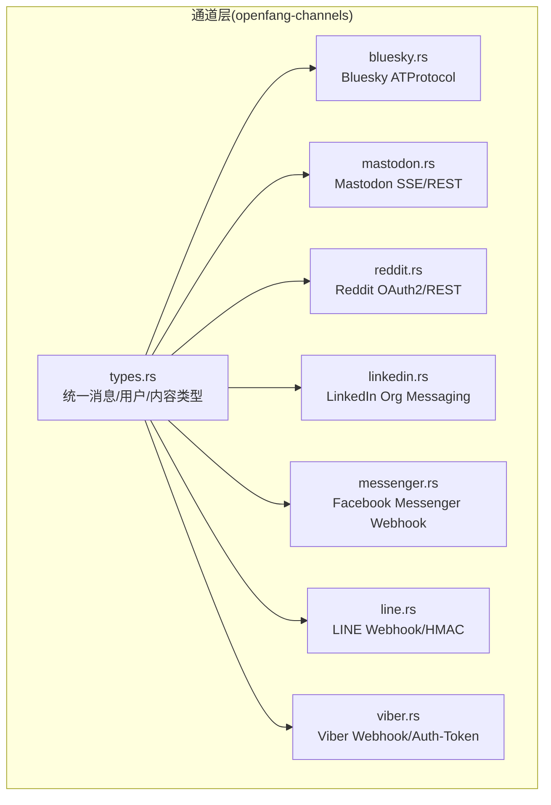
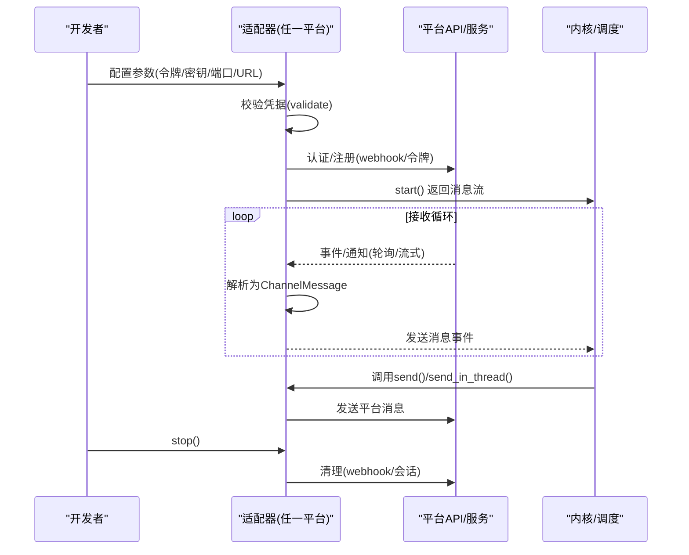
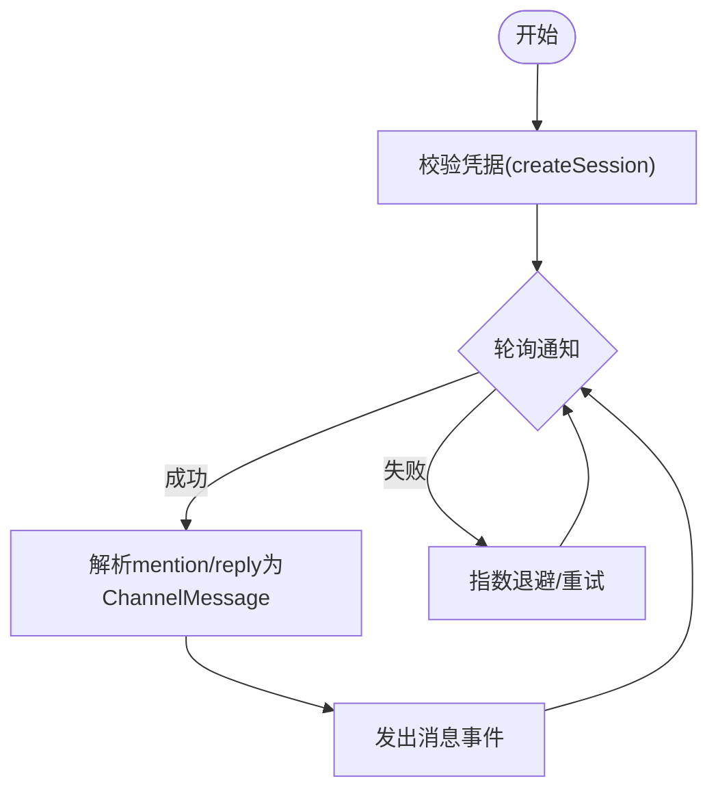
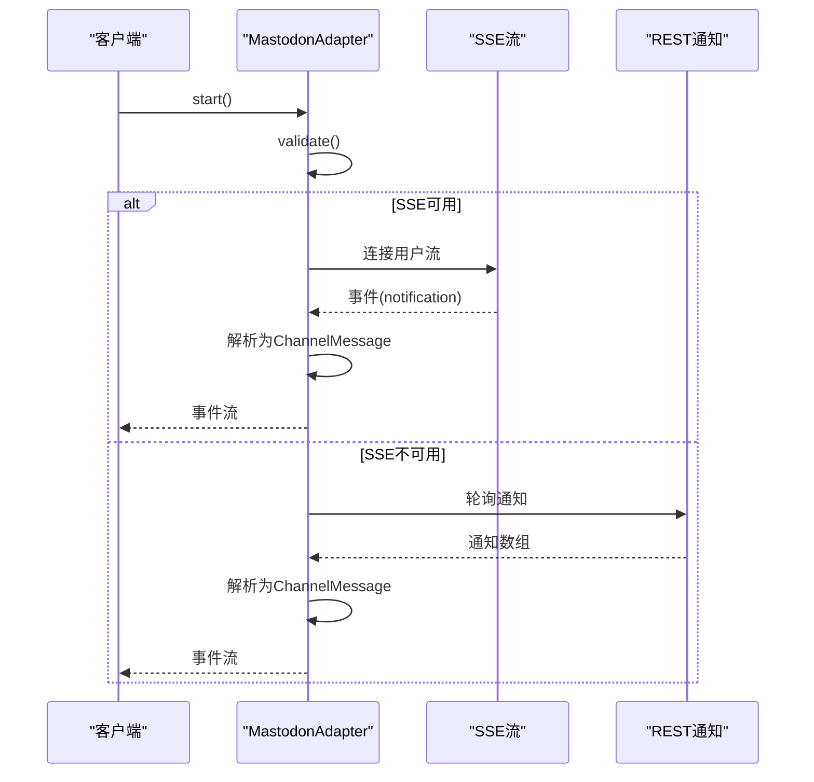
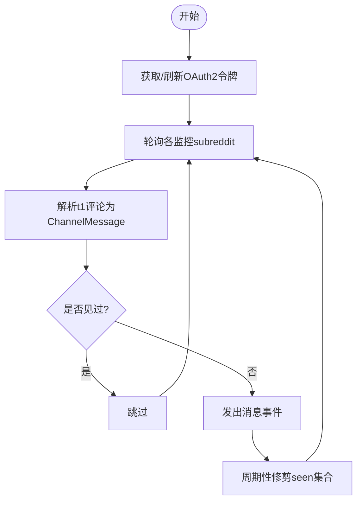
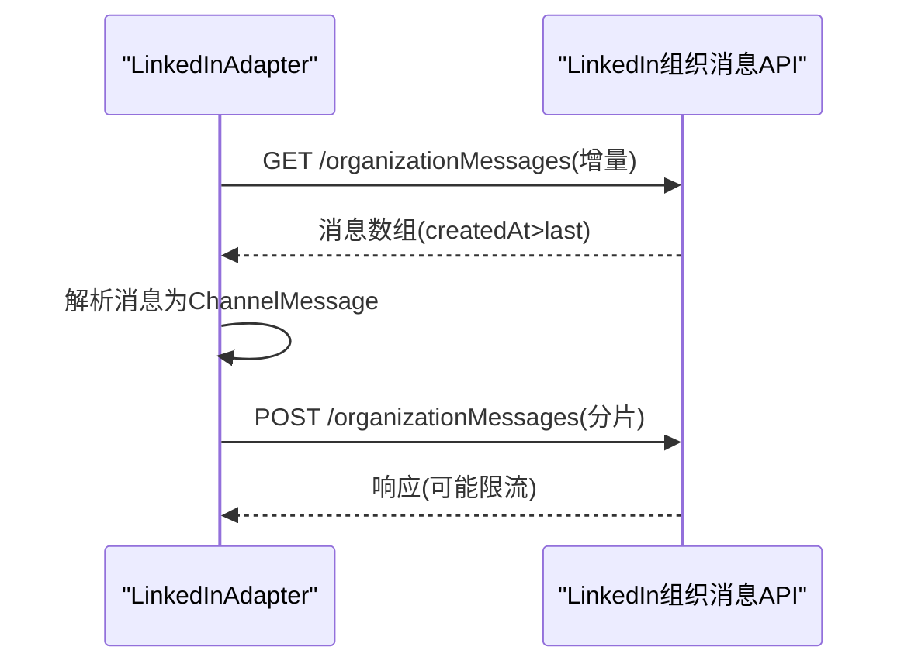
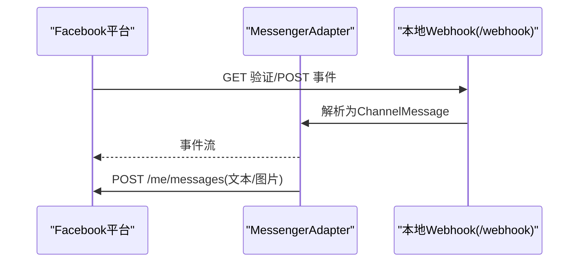
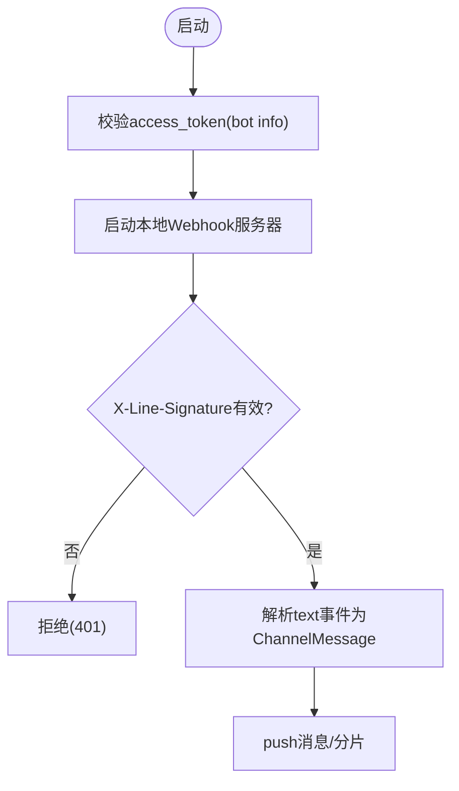
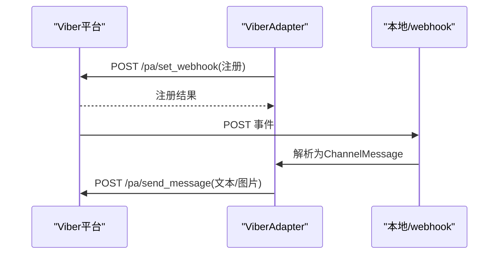
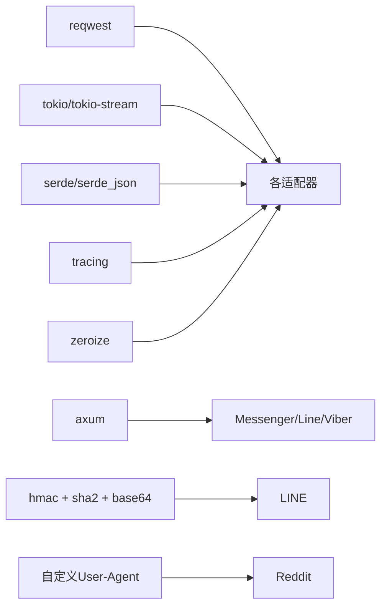

# 社交媒体平台

<cite>
**本文引用的文件**
- [bluesky.rs](file://crates/openfang-channels/src/bluesky.rs)
- [mastodon.rs](file://crates/openfang-channels/src/mastodon.rs)
- [reddit.rs](file://crates/openfang-channels/src/reddit.rs)
- [linkedin.rs](file://crates/openfang-channels/src/linkedin.rs)
- [messenger.rs](file://crates/openfang-channels/src/messenger.rs)
- [line.rs](file://crates/openfang-channels/src/line.rs)
- [viber.rs](file://crates/openfang-channels/src/viber.rs)
- [types.rs](file://crates/openfang-channels/src/types.rs)
- [lib.rs](file://crates/openfang-channels/src/lib.rs)
- [Cargo.toml](file://crates/openfang-channels/Cargo.toml)
- [README.md](file://README.md)
</cite>

## 目录
1. [简介](#简介)
2. [项目结构](#项目结构)
3. [核心组件](#核心组件)
4. [架构总览](#架构总览)
5. [详细组件分析](#详细组件分析)
6. [依赖关系分析](#依赖关系分析)
7. [性能考量](#性能考量)
8. [故障排查指南](#故障排查指南)
9. [结论](#结论)
10. [附录](#附录)

## 简介
本技术文档聚焦于 OpenFang 的社交媒体平台适配器，覆盖 Bluesky、Mastodon、Reddit、LinkedIn、Facebook Messenger、LINE、Viber 等渠道。文档从架构与数据流入手，系统阐述各平台的认证方式（OAuth 或令牌）、消息格式与媒体处理、内容审核与合规要点，并给出配置建议、最佳实践与常见问题排查方法。目标是帮助开发者与运维人员快速、安全地集成并稳定运行这些社交媒体适配器。

## 项目结构
- 适配器模块位于 openfang-channels 子 crate 中，每个平台一个独立文件，统一实现 ChannelAdapter trait。
- 核心类型与消息模型在 types.rs 中定义，确保跨平台一致性。
- 平台适配器共享通用工具函数（如消息分片）与错误处理模式。

图表来源
- [lib.rs:25-33](file://crates/openfang-channels/src/lib.rs#L25-L33)
- [types.rs:12-96](file://crates/openfang-channels/src/types.rs#L12-L96)

章节来源
- [lib.rs:1-55](file://crates/openfang-channels/src/lib.rs#L1-L55)
- [types.rs:1-478](file://crates/openfang-channels/src/types.rs#L1-L478)
- [README.md:254-266](file://README.md#L254-L266)

## 核心组件
- ChannelAdapter trait：定义了所有适配器必须实现的方法族，包括 start（接收）、send（发送）、send_typing（可选）、send_in_thread（可选）、stop、status、suppress_error_responses（可选）等。
- ChannelMessage：统一的消息载体，包含渠道类型、平台消息 ID、发送者信息、内容体、时间戳、是否群组、线程 ID、元数据等。
- ChannelContent：统一的内容枚举，支持文本、图片、文件、语音、位置、命令等；部分平台在发送时会进行类型裁剪或转换。
- split_message：通用的长文本分片工具，按换行优先策略切分，避免截断 UTF-8 字符串。

章节来源
- [types.rs:215-280](file://crates/openfang-channels/src/types.rs#L215-L280)
- [types.rs:74-96](file://crates/openfang-channels/src/types.rs#L74-L96)
- [types.rs:41-71](file://crates/openfang-channels/src/types.rs#L41-L71)
- [types.rs:282-309](file://crates/openfang-channels/src/types.rs#L282-L309)

## 架构总览
各社交媒体适配器遵循统一的生命周期：初始化与凭据校验 → 启动接收循环（轮询或事件流）→ 解析平台事件为 ChannelMessage → 内核处理后通过 send 回写响应 → 停止时清理资源。

图表来源
- [types.rs:215-280](file://crates/openfang-channels/src/types.rs#L215-L280)
- [messenger.rs:267-361](file://crates/openfang-channels/src/messenger.rs#L267-L361)
- [line.rs:339-432](file://crates/openfang-channels/src/line.rs#L339-L432)
- [viber.rs:310-370](file://crates/openfang-channels/src/viber.rs#L310-L370)

## 详细组件分析

### Bluesky（ATProtocol）
- 认证与会话
  - 使用 AT Protocol XRPC createSession 创建会话，缓存 accessJwt/refreshJwt/did，并在接近过期前自动刷新。
  - 会话有效期约 2 小时，采用提前刷新缓冲策略降低失效风险。
- 消息接收
  - 轮询 app.bsky.notification.listNotifications，解析 mention/reply 事件，过滤自身消息与非文本内容。
  - 支持命令解析（以“/”开头），将命令名与参数注入 ChannelContent::Command。
- 消息发送
  - 通过 com.atproto.repo.createRecord 提交 app.bsky.feed.post，按长度切片分发。
  - 不支持打字指示。
- 数据模型与元数据
  - 元数据包含 uri/cid/handle/reason/indexedAt 等字段，回复场景包含 reply_ref 引用。
- 错误与退避
  - 401 时清空会话以触发重新登录；失败时指数退避，最大回退时间受限。

图表来源
- [bluesky.rs:94-127](file://crates/openfang-channels/src/bluesky.rs#L94-L127)
- [bluesky.rs:348-516](file://crates/openfang-channels/src/bluesky.rs#L348-L516)

章节来源
- [bluesky.rs:1-699](file://crates/openfang-channels/src/bluesky.rs#L1-L699)

### Mastodon（Streaming API + REST）
- 认证与校验
  - 使用 Bearer 令牌访问 verify_credentials 获取账号信息，存储 own_account_id。
- 消息接收
  - 优先尝试 SSE 用户流（/api/v1/streaming/user），失败则回退到 REST 通知轮询（/api/v1/notifications?types[]=mention）。
  - 解析 mention 事件，剥离 HTML 标签为纯文本，记录 visibility 与 in_reply_to_id。
- 消息发送
  - 通过 statuses 接口发布新状态，支持回复链式拼接（in_reply_to_id）。
  - 默认可见性为 unlisted；支持 send_in_thread 指定回复目标。
- 特性
  - 支持命令解析；HTML 内容经简单清洗；抑制错误响应（suppress_error_responses）。
- 错误与回退
  - SSE 失败或非成功状态码时切换轮询；轮询失败时指数退避。

图表来源
- [mastodon.rs:316-485](file://crates/openfang-channels/src/mastodon.rs#L316-L485)

章节来源
- [mastodon.rs:1-710](file://crates/openfang-channels/src/mastodon.rs#L1-L710)

### Reddit（OAuth2 + REST）
- 认证与令牌
  - 使用密码授权（script app）获取 access_token，缓存并带安全缓冲刷新。
  - 自定义 User-Agent 必须满足 Reddit API 规范。
- 消息接收
  - 轮询 /r/{subreddit}/comments/new.json，过滤 t1 类型评论（非帖子），跳过自身与已删除账户。
  - 支持命令解析；记录 fullname/link_id/parent_id/permalink 等元数据。
- 消息发送
  - 通过 /api/comment 发送回复；单父级只允许一次回复，多段文本以分隔符合并。
- 特性
  - is_group=true（公共子版块）；thread_id 映射为 subreddit 名称；维护 seen_comments 集合防止重复。
- 错误与回退
  - 令牌过期或获取失败时重试并指数退避；定期清理 seen 缓存。

图表来源
- [reddit.rs:319-492](file://crates/openfang-channels/src/reddit.rs#L319-L492)

章节来源
- [reddit.rs:1-705](file://crates/openfang-channels/src/reddit.rs#L1-L705)

### LinkedIn（组织消息 REST）
- 认证与校验
  - 使用 OAuth2 Bearer 令牌访问组织信息接口进行校验；请求头包含 LinkedIn-Version 与 X-Restli-Protocol-Version。
- 消息接收
  - 轮询 /organizationMessages，基于 createdAt 时间戳增量拉取；过滤来自本组织的消息。
  - 支持命令解析；元数据包含 sender_urn 与 organization_id。
- 消息发送
  - 通过 /organizationMessages 发送 MEMEBER_TO_MEMBER 类型消息；长文本分片发送，片段间延迟。
- 特性
  - 不支持打字指示；组织 ID 统一为 URN 格式。
- 错误与回退
  - 请求失败时指数退避；最大回退时间受限。

图表来源
- [linkedin.rs:225-363](file://crates/openfang-channels/src/linkedin.rs#L225-L363)

章节来源
- [linkedin.rs:1-485](file://crates/openfang-channels/src/linkedin.rs#L1-L485)

### Facebook Messenger（Webhook + Graph API）
- 认证与校验
  - 使用 page access token 调用 me 接口校验页面信息。
- 消息接收
  - 启动本地 HTTP 服务器监听 /webhook，支持 GET 验证与 POST 事件。
  - 仅处理 message 事件且非 echo；支持命令解析；提取 quick_reply_payload 与 NLP 实体元数据。
- 消息发送
  - 通过 /me/messages 发送文本；支持图片附件与单独标题文本；支持 typing_on 打字指示。
- 特性
  - 1:1 对话（is_group=false）；消息 ID 映射为 platform_message_id。
- 错误与回退
  - 绑定失败会记录警告；事件处理幂等（忽略 echo）。

图表来源
- [messenger.rs:267-361](file://crates/openfang-channels/src/messenger.rs#L267-L361)

章节来源
- [messenger.rs:1-626](file://crates/openfang-channels/src/messenger.rs#L1-L626)

### LINE（Webhook + HMAC-SHA256）
- 认证与校验
  - 使用 channel_access_token 调用 bot info 校验；签名验证使用 X-Line-Signature 与 HMAC-SHA256。
- 消息接收
  - 启动本地 HTTP 服务器监听 /webhook，仅处理 text 类型消息；区分 user/group/room 场景。
  - 支持命令解析；记录 reply_token/source_type 等元数据。
- 消息发送
  - 通过 /v2/bot/message/push 发送文本；图片消息支持预览图；默认最多 5000 字符。
- 特性
  - 支持回复 token（30 秒窗口）；不支持打字指示。
- 错误与回退
  - 签名验证失败返回 401；绑定失败记录警告。

图表来源
- [line.rs:339-432](file://crates/openfang-channels/src/line.rs#L339-L432)

章节来源
- [line.rs:1-651](file://crates/openfang-channels/src/line.rs#L1-L651)

### Viber（Webhook + Auth-Token）
- 认证与校验
  - 使用 X-Viber-Auth-Token 调用 get_account_info 校验；注册 webhook 时声明事件类型。
- 消息接收
  - 启动本地 HTTP 服务器监听 /viber/webhook，仅处理 text 类型消息。
  - 支持命令解析；记录 sender_id/sender_avatar/tracking_data 等元数据。
- 消息发送
  - 通过 /pa/send_message 发送文本；图片消息支持标题与媒体 URL；默认最多 7000 字符。
- 特性
  - 1:1 对话（is_group=false）；支持自定义发送者名称与头像。
- 错误与回退
  - API 返回 status 非 0 记录警告；绑定失败记录警告。

图表来源
- [viber.rs:310-370](file://crates/openfang-channels/src/viber.rs#L310-L370)

章节来源
- [viber.rs:1-588](file://crates/openfang-channels/src/viber.rs#L1-L588)

## 依赖关系分析
- 通用依赖：reqwest、tokio、tokio-stream、futures、serde_json、tracing、zeroize、axum、hmac/sha2/base64 等。
- 平台特定：LINE 使用 HMAC-SHA256 验证；Viber 使用 X-Viber-Auth-Token；Mastodon/Reddit/LinkedIn 使用 OAuth2；Bluesky 使用 ATProtocol XRPC；Messenger 使用 Graph API；Reddit 需要自定义 User-Agent。

图表来源
- [Cargo.toml:8-43](file://crates/openfang-channels/Cargo.toml#L8-L43)

章节来源
- [Cargo.toml:1-43](file://crates/openfang-channels/Cargo.toml#L1-L43)

## 性能考量
- 轮询节流：各适配器均设置轮询间隔与指数退避，避免平台限流与资源浪费。
- 分片发送：统一使用 split_message，按换行优先切分，避免超长消息导致失败。
- 令牌/会话缓存：Bluesky/Mastodon/Reddit/LinkedIn 缓存令牌/会话，减少频繁认证开销。
- SSE 降级：Mastodon 在 SSE 不可用时自动回退到 REST 轮询，保证可用性。
- 增量拉取：LinkedIn 使用时间戳增量拉取，减少无效数据传输。

## 故障排查指南
- 认证失败
  - 检查令牌/密钥是否正确、scope 是否足够、User-Agent 是否符合要求（Reddit）。
  - 查看日志中的 HTTP 状态码与响应体，定位具体错误。
- Webhook/签名问题
  - LINE：确认 X-Line-Signature 与 channel_secret 匹配，避免 401。
  - Viber：确认 X-Viber-Auth-Token 正确，set_webhook 返回 status=0。
  - Messenger：确认 verify_token 与 webhook 验证一致。
- 速率限制
  - Bluesky：会话刷新缓冲与失败退避；关注 401 并自动重建会话。
  - LinkedIn：每日消息数限制，注意分片与延迟。
  - Reddit：每分钟约 60 次请求，合理设置轮询间隔。
- 内容与媒体
  - 各平台最大字符/大小限制不同，发送前检查 split_message 与平台限制。
  - 图片/语音等媒体需确保 URL 可访问且符合平台规范。
- 日志与可观测性
  - 使用 tracing 输出关键事件（连接、解析、发送、错误），结合退避与重试策略定位问题。

章节来源
- [bluesky.rs:348-516](file://crates/openfang-channels/src/bluesky.rs#L348-L516)
- [mastodon.rs:316-485](file://crates/openfang-channels/src/mastodon.rs#L316-L485)
- [reddit.rs:319-492](file://crates/openfang-channels/src/reddit.rs#L319-L492)
- [linkedin.rs:225-363](file://crates/openfang-channels/src/linkedin.rs#L225-L363)
- [messenger.rs:267-426](file://crates/openfang-channels/src/messenger.rs#L267-L426)
- [line.rs:339-494](file://crates/openfang-channels/src/line.rs#L339-L494)
- [viber.rs:310-427](file://crates/openfang-channels/src/viber.rs#L310-L427)

## 结论
OpenFang 的社交媒体适配器以统一的 ChannelAdapter 抽象屏蔽平台差异，通过标准化的消息模型与通用工具实现跨平台一致性。各适配器针对平台特性（OAuth2、令牌、SSE、Webhook、签名验证等）实现了稳健的认证、接收与发送流程，并内置限流、退避与错误抑制策略。遵循本文的配置建议与最佳实践，可在保证合规与性能的前提下，稳定地集成 Bluesky、Mastodon、Reddit、LinkedIn、Facebook Messenger、LINE、Viber 等社交媒体渠道。

## 附录
- 配置清单（示例字段，按平台实际需求填写）
  - Bluesky
    - identifier：用户名或 DID
    - app_password：应用密码
    - service_url：PDS 地址（可选）
  - Mastodon
    - instance_url：实例地址
    - access_token：Bearer 令牌
  - Reddit
    - client_id/client_secret：OAuth2 凭据
    - username/password：脚本应用凭据
    - subreddits：监控列表（可含 r/ 前缀）
  - LinkedIn
    - access_token：OAuth2 令牌
    - organization_id：组织 URN 或数字 ID
  - Facebook Messenger
    - page_token：页面访问令牌
    - verify_token：Webhook 验证令牌
    - webhook_port：本地端口
  - LINE
    - channel_secret：Webhook 签名密钥
    - access_token：长期访问令牌
    - webhook_port：本地端口
  - Viber
    - auth_token：X-Viber-Auth-Token
    - webhook_url：公网回调地址
    - webhook_port：本地端口
- 最佳实践
  - 使用最小权限 scope 与受控环境变量管理密钥，启用 zeroize。
  - 为公网 webhook 配置反向代理与 TLS，严格校验签名与来源。
  - 合理设置轮询间隔与退避上限，避免触发平台限流。
  - 对命令与敏感操作增加审批与审计链路。
  - 定期审查平台政策与 API 变更，保持适配器兼容性。