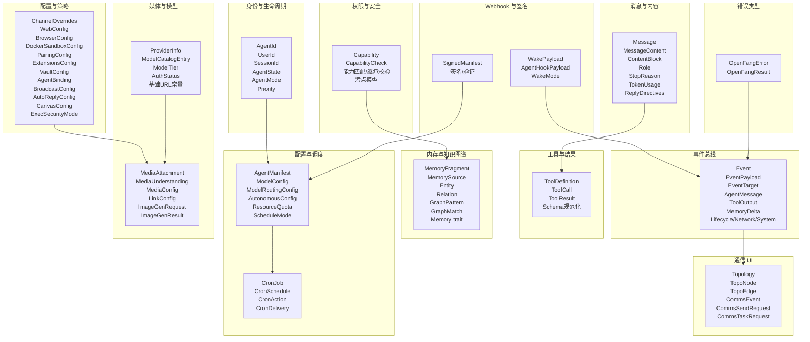
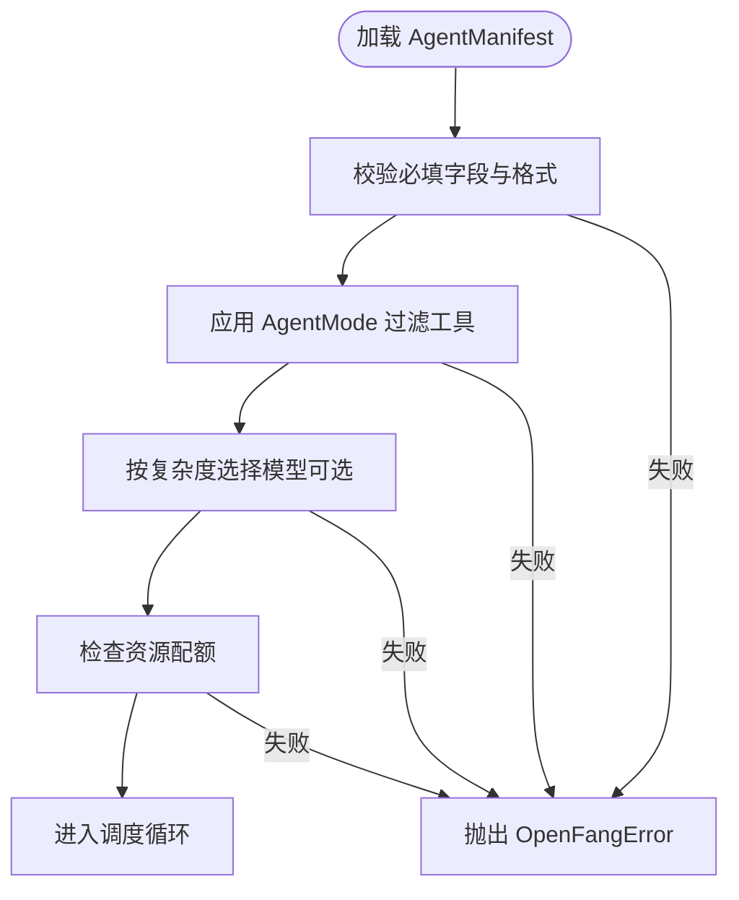
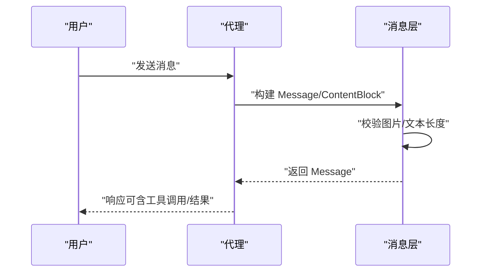
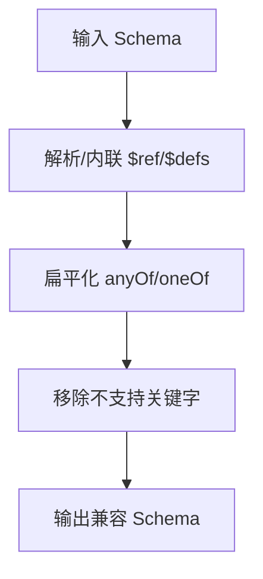
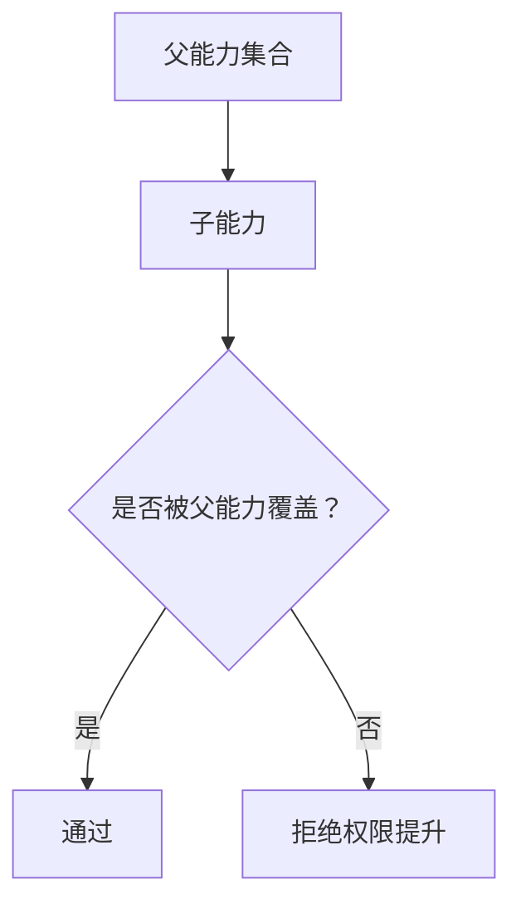
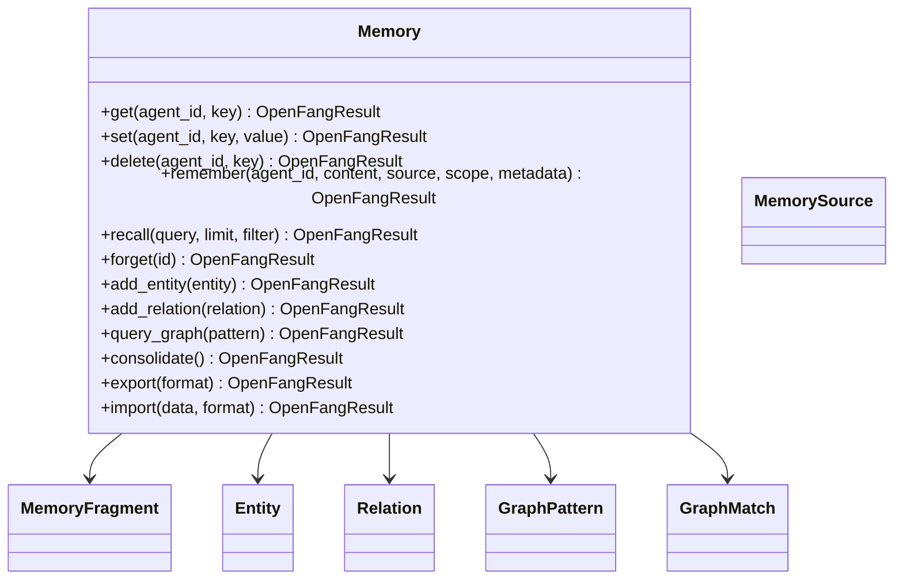
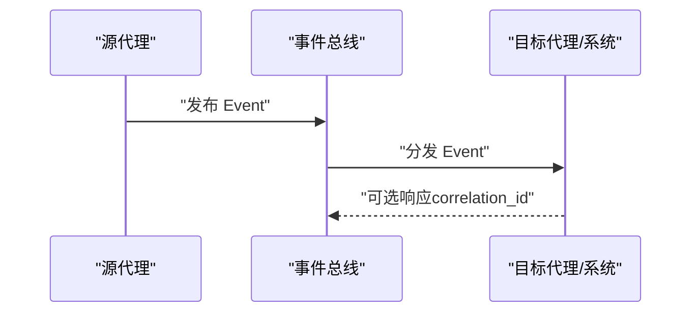
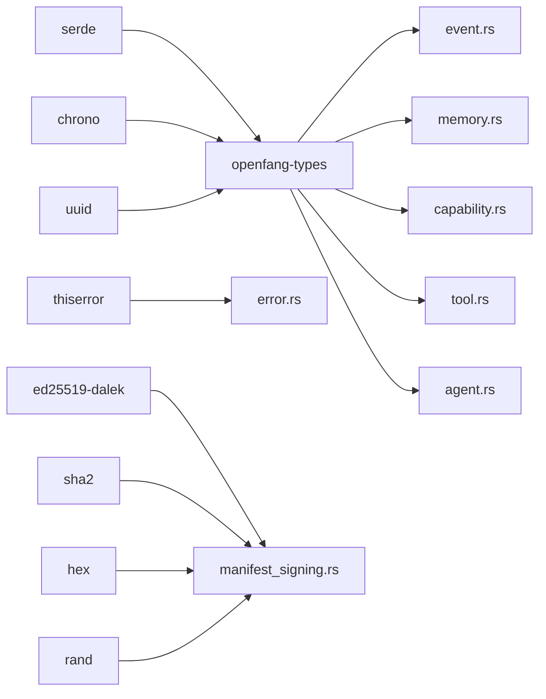

# 类型系统（openfang-types）

<cite>
**本文引用的文件**
- [lib.rs](file://crates/openfang-types/src/lib.rs)
- [agent.rs](file://crates/openfang-types/src/agent.rs)
- [message.rs](file://crates/openfang-types/src/message.rs)
- [tool.rs](file://crates/openfang-types/src/tool.rs)
- [capability.rs](file://crates/openfang-types/src/capability.rs)
- [memory.rs](file://crates/openfang-types/src/memory.rs)
- [event.rs](file://crates/openfang-types/src/event.rs)
- [comms.rs](file://crates/openfang-types/src/comms.rs)
- [config.rs](file://crates/openfang-types/src/config.rs)
- [error.rs](file://crates/openfang-types/src/error.rs)
- [media.rs](file://crates/openfang-types/src/media.rs)
- [model_catalog.rs](file://crates/openfang-types/src/model_catalog.rs)
- [scheduler.rs](file://crates/openfang-types/src/scheduler.rs)
- [taint.rs](file://crates/openfang-types/src/taint.rs)
- [webhook.rs](file://crates/openfang-types/src/webhook.rs)
- [manifest_signing.rs](file://crates/openfang-types/src/manifest_signing.rs)
</cite>

## 目录
1. [简介](#简介)
2. [项目结构](#项目结构)
3. [核心组件](#核心组件)
4. [架构总览](#架构总览)
5. [详细组件分析](#详细组件分析)
6. [依赖分析](#依赖分析)
7. [性能考虑](#性能考虑)
8. [故障排查指南](#故障排查指南)
9. [结论](#结论)
10. [附录](#附录)

## 简介
本文件为 OpenFang 类型系统（openfang-types）的权威数据模型文档。该 crate 定义了跨内核、运行时、内存子系统与通信协议共享的核心数据结构与契约，不包含业务逻辑，确保系统在安全、可扩展与可维护性方面的一致性。本文面向开发者与运维人员，既提供高层概览，也给出代码级细节、序列化格式、字段约束与错误处理策略。

## 项目结构
openfang-types 按功能域划分模块，每个模块聚焦一类数据模型：
- 身份与生命周期：AgentId、UserId、SessionId、AgentState、AgentMode、Priority 等
- 配置与调度：AgentManifest、ModelConfig、ModelRoutingConfig、AutonomousConfig、ResourceQuota、ScheduleMode、Scheduler（CronJob）
- 消息与内容：Message、MessageContent、ContentBlock、Role、StopReason、TokenUsage、ReplyDirectives
- 工具与结果：ToolDefinition、ToolCall、ToolResult、Schema 规范化
- 权限与安全：Capability、CapabilityCheck、能力匹配与继承校验、信息流污点（Taint）
- 内存与知识图谱：MemoryFragment、MemorySource、Entity、Relation、GraphPattern、GraphMatch、Memory trait
- 事件总线：Event、EventPayload、EventTarget、AgentMessage、ToolOutput、MemoryDelta、LifecycleEvent、NetworkEvent、SystemEvent
- 通信 UI：Topology、TopoNode、TopoEdge、CommsEvent、CommsSendRequest、CommsTaskRequest
- 配置与策略：ChannelOverrides、WebConfig、BrowserConfig、DockerSandboxConfig、PairingConfig、ExtensionsConfig、VaultConfig、AgentBinding、BroadcastConfig、AutoReplyConfig、CanvasConfig、ExecSecurityMode
- 媒体理解与图像生成：MediaAttachment、MediaUnderstanding、MediaConfig、LinkConfig、ImageGenRequest、ImageGenResult
- 模型目录：ProviderInfo、ModelCatalogEntry、ModelTier、AuthStatus、基础 URL 常量
- Webhook 触发：WakePayload、AgentHookPayload、WakeMode
- 清单签名：SignedManifest、签名与验证流程
- 错误类型：OpenFangError、OpenFangResult

图表来源
- [agent.rs:112-186](file://crates/openfang-types/src/agent.rs#L112-L186)
- [scheduler.rs:167-189](file://crates/openfang-types/src/scheduler.rs#L167-L189)
- [message.rs:6-34](file://crates/openfang-types/src/message.rs#L6-L34)
- [tool.rs:6-36](file://crates/openfang-types/src/tool.rs#L6-L36)
- [capability.rs:12-72](file://crates/openfang-types/src/capability.rs#L12-L72)
- [memory.rs:53-76](file://crates/openfang-types/src/memory.rs#L53-L76)
- [event.rs:284-300](file://crates/openfang-types/src/event.rs#L284-L300)
- [comms.rs:10-48](file://crates/openfang-types/src/comms.rs#L10-L48)
- [config.rs:71-113](file://crates/openfang-types/src/config.rs#L71-L113)
- [media.rs:38-60](file://crates/openfang-types/src/media.rs#L38-L60)
- [model_catalog.rs:121-200](file://crates/openfang-types/src/model_catalog.rs#L121-L200)
- [webhook.rs:17-46](file://crates/openfang-types/src/webhook.rs#L17-L46)
- [manifest_signing.rs:24-36](file://crates/openfang-types/src/manifest_signing.rs#L24-L36)
- [error.rs:6-101](file://crates/openfang-types/src/error.rs#L6-L101)

章节来源
- [lib.rs:1-82](file://crates/openfang-types/src/lib.rs#L1-L82)

## 核心组件
本节概述关键数据结构及其职责边界，并给出序列化格式与典型字段约束。

- 身份与会话
  - AgentId/UserId/SessionId：UUID 包装器，支持显示与解析；用于区分实体与会话上下文。
  - AgentState：Created/Running/Suspended/Terminated/Crashed，驱动内核状态机。
  - AgentMode：Observe/Assist/Full，基于权限的运行模式，影响工具过滤。
  - Priority：Low/Normal/High/Critical，调度优先级。
  - SessionLabel：长度限制与字符集约束（1-128，字母数字+空格+连字符+下划线）。
- 配置与调度
  - AgentManifest：完整代理清单，包含调度、模型、资源配额、能力授予、工具配置、技能、MCP 服务器、元数据、标签、模型路由、自治配置、工作区、执行策略、工具白/黑名单等。
  - ModelConfig/ModelRoutingConfig/AutonomousConfig/ResourceQuota：分别控制模型参数、复杂度路由、24/7 自治行为与资源上限。
  - ScheduleMode：Reactive/Periodic/Proactive/Continuous，支持定时表达式与检查间隔。
  - CronJob/CronSchedule/CronAction/CronDelivery：计划任务的触发时间、动作与投递目标。
- 消息与内容
  - Message/MessageContent/ContentBlock：支持纯文本与多块内容（文本、图片、工具调用、工具结果、思考块），并提供校验与提取工具。
  - Role/StopReason/TokenUsage/ReplyDirectives：角色枚举、停止原因、令牌用量统计、回复指令。
- 工具与结果
  - ToolDefinition/ToolCall/ToolResult：工具定义、请求与结果；提供跨提供商的 JSON Schema 规范化。
- 权限与安全
  - Capability：文件读写、网络连接/监听、工具调用、LLM 查询/额度、代理交互、内存读写、Shell/环境变量、OFP、经济支出/收入/转账等。
  - CapabilityCheck：授权检查结果；支持 require() 抛错。
  - 能力匹配与继承校验：支持通配符与中间通配，禁止越权继承。
  - 污点模型：TaintLabel/TaintedValue/TaintSink/TaintViolation，防止敏感通道污染。
- 内存与知识图谱
  - MemoryFragment/MemorySource：片段、来源类型（对话/文档/观察/推断/用户/系统）。
  - Entity/Relation/GraphPattern/GraphMatch：实体、关系、查询模式与匹配结果。
  - Memory trait：键值、语义检索、遗忘、知识图谱增删查、合并优化、导入导出。
- 事件总线
  - Event/EventPayload/EventTarget：事件 ID、来源、目标（单播/广播/模式/系统）、负载（消息/工具结果/内存变更/生命周期/网络/系统/自定义）。
  - AgentMessage/ToolOutput/MemoryDelta/LifecycleEvent/NetworkEvent/SystemEvent：各类事件载体。
- 通信 UI
  - Topology/TopoNode/TopoEdge：拓扑节点与边，EdgeKind 支持父子与对等关系。
  - CommsEvent/CommsSendRequest/CommsTaskRequest：通信事件与请求体。
- 配置与策略
  - ChannelOverrides/WebConfig/BrowserConfig/DockerSandboxConfig/PairingConfig/ExtensionsConfig/VaultConfig/AgentBinding/BroadcastConfig/AutoReplyConfig/CanvasConfig/ExecSecurityMode：覆盖通道行为、Web 搜索/抓取、浏览器自动化、容器沙箱、设备配对、扩展健康、凭据库、绑定规则、广播策略、自动回复、画布、执行安全模式。
- 媒体与模型
  - MediaAttachment/MediaUnderstanding/MediaConfig/LinkConfig/ImageGenRequest/ImageGenResult：媒体附件与理解、配置、链接理解、图像生成请求与结果。
  - ProviderInfo/ModelCatalogEntry/ModelTier/AuthStatus/基础 URL 常量：模型目录与提供商信息。
- Webhook 与签名
  - WakePayload/AgentHookPayload/WakeMode：系统事件注入与隔离代理回合的 Webhook 载荷。
  - SignedManifest：Ed25519 对代理清单进行完整性与来源验证。
- 错误类型
  - OpenFangError/OpenFangResult：统一错误类型与返回别名，覆盖代理、能力、配额、状态、会话、内存、工具、LLM、配置、清单、沙箱、网络、序列化、迭代超限、关闭、IO、内部、鉴权、计费、输入无效等场景。

章节来源
- [agent.rs:112-186](file://crates/openfang-types/src/agent.rs#L112-L186)
- [agent.rs:424-494](file://crates/openfang-types/src/agent.rs#L424-L494)
- [agent.rs:532-561](file://crates/openfang-types/src/agent.rs#L532-L561)
- [scheduler.rs:167-189](file://crates/openfang-types/src/scheduler.rs#L167-L189)
- [message.rs:6-34](file://crates/openfang-types/src/message.rs#L6-L34)
- [message.rs:169-201](file://crates/openfang-types/src/message.rs#L169-L201)
- [tool.rs:6-36](file://crates/openfang-types/src/tool.rs#L6-L36)
- [capability.rs:12-72](file://crates/openfang-types/src/capability.rs#L12-L72)
- [taint.rs:13-48](file://crates/openfang-types/src/taint.rs#L13-L48)
- [memory.rs:53-76](file://crates/openfang-types/src/memory.rs#L53-L76)
- [event.rs:284-300](file://crates/openfang-types/src/event.rs#L284-L300)
- [comms.rs:10-48](file://crates/openfang-types/src/comms.rs#L10-L48)
- [config.rs:71-113](file://crates/openfang-types/src/config.rs#L71-L113)
- [media.rs:38-60](file://crates/openfang-types/src/media.rs#L38-L60)
- [model_catalog.rs:121-200](file://crates/openfang-types/src/model_catalog.rs#L121-L200)
- [webhook.rs:17-46](file://crates/openfang-types/src/webhook.rs#L17-L46)
- [manifest_signing.rs:24-36](file://crates/openfang-types/src/manifest_signing.rs#L24-L36)
- [error.rs:6-101](file://crates/openfang-types/src/error.rs#L6-L101)

## 架构总览
类型系统通过模块化设计实现高内聚、低耦合的数据契约，所有模块均以 serde 友好方式导出，便于跨进程与跨语言使用。核心关系如下：

```mermaid
classDiagram
class AgentId
class UserId
class SessionId
class AgentState
class AgentMode
class Priority
class SessionLabel
class AgentManifest
class ModelConfig
class ModelRoutingConfig
class AutonomousConfig
class ResourceQuota
class ScheduleMode
class CronJob
class CronSchedule
class CronAction
class CronDelivery
class Message
class MessageContent
class ContentBlock
class Role
class StopReason
class TokenUsage
class ReplyDirectives
class ToolDefinition
class ToolCall
class ToolResult
class Capability
class CapabilityCheck
class TaintLabel
class TaintedValue
class TaintSink
class TaintViolation
class MemoryFragment
class MemorySource
class Entity
class Relation
class GraphPattern
class GraphMatch
class Memory
class Event
class EventPayload
class EventTarget
class AgentMessage
class ToolOutput
class MemoryDelta
class LifecycleEvent
class NetworkEvent
class SystemEvent
class Topology
class TopoNode
class TopoEdge
class CommsEvent
class CommsSendRequest
class CommsTaskRequest
class ChannelOverrides
class WebConfig
class BrowserConfig
class DockerSandboxConfig
class PairingConfig
class ExtensionsConfig
class VaultConfig
class AgentBinding
class BroadcastConfig
class AutoReplyConfig
class CanvasConfig
class ExecSecurityMode
class MediaAttachment
class MediaUnderstanding
class MediaConfig
class LinkConfig
class ImageGenRequest
class ImageGenResult
class ProviderInfo
class ModelCatalogEntry
class ModelTier
class AuthStatus
class WakePayload
class AgentHookPayload
class WakeMode
class SignedManifest
class OpenFangError
class OpenFangResult
AgentManifest --> ModelConfig
AgentManifest --> ModelRoutingConfig
AgentManifest --> AutonomousConfig
AgentManifest --> ResourceQuota
AgentManifest --> ScheduleMode
CronJob --> CronSchedule
CronJob --> CronAction
CronJob --> CronDelivery
Message --> MessageContent
MessageContent --> ContentBlock
ToolDefinition --> ToolCall
ToolCall --> ToolResult
Capability --> CapabilityCheck
TaintedValue --> TaintSink
TaintViolation --> TaintLabel
MemoryFragment --> MemorySource
Entity --> Relation
GraphPattern --> GraphMatch
Memory <|.. MemoryFragment
Event --> EventPayload
EventPayload --> AgentMessage
EventPayload --> ToolOutput
EventPayload --> MemoryDelta
EventPayload --> LifecycleEvent
EventPayload --> NetworkEvent
EventPayload --> SystemEvent
Topology --> TopoNode
Topology --> TopoEdge
CommsEvent --> CommsSendRequest
CommsEvent --> CommsTaskRequest
AgentManifest --> ChannelOverrides
AgentManifest --> WebConfig
AgentManifest --> BrowserConfig
AgentManifest --> DockerSandboxConfig
AgentManifest --> PairingConfig
AgentManifest --> ExtensionsConfig
AgentManifest --> VaultConfig
AgentManifest --> AgentBinding
AgentManifest --> BroadcastConfig
AgentManifest --> AutoReplyConfig
AgentManifest --> CanvasConfig
MediaAttachment --> MediaUnderstanding
MediaAttachment --> MediaConfig
MediaAttachment --> LinkConfig
MediaAttachment --> ImageGenRequest
ImageGenRequest --> ImageGenResult
ProviderInfo --> ModelCatalogEntry
WakePayload --> AgentHookPayload
SignedManifest --> AgentManifest
OpenFangResult --> OpenFangError
```

图表来源
- [agent.rs:424-494](file://crates/openfang-types/src/agent.rs#L424-L494)
- [scheduler.rs:167-189](file://crates/openfang-types/src/scheduler.rs#L167-L189)
- [message.rs:6-34](file://crates/openfang-types/src/message.rs#L6-L34)
- [tool.rs:6-36](file://crates/openfang-types/src/tool.rs#L6-L36)
- [capability.rs:12-72](file://crates/openfang-types/src/capability.rs#L12-L72)
- [taint.rs:13-48](file://crates/openfang-types/src/taint.rs#L13-L48)
- [memory.rs:53-76](file://crates/openfang-types/src/memory.rs#L53-L76)
- [event.rs:284-300](file://crates/openfang-types/src/event.rs#L284-L300)
- [comms.rs:10-48](file://crates/openfang-types/src/comms.rs#L10-L48)
- [config.rs:71-113](file://crates/openfang-types/src/config.rs#L71-L113)
- [media.rs:38-60](file://crates/openfang-types/src/media.rs#L38-L60)
- [model_catalog.rs:121-200](file://crates/openfang-types/src/model_catalog.rs#L121-L200)
- [webhook.rs:17-46](file://crates/openfang-types/src/webhook.rs#L17-L46)
- [manifest_signing.rs:24-36](file://crates/openfang-types/src/manifest_signing.rs#L24-L36)
- [error.rs:6-101](file://crates/openfang-types/src/error.rs#L6-L101)

## 详细组件分析

### Agent 代理模型
- 设计理念
  - 以 AgentManifest 为中心，集中声明代理的调度、模型、资源、能力、工具、技能、MCP 服务器、元数据与策略。
  - 通过 AgentMode 实现基于权限的运行模式，结合 ToolProfile 推导能力集合。
  - 通过 ModelRoutingConfig/AutonomousConfig/ResourceQuota 控制成本与稳定性。
- 关键字段与约束
  - name/version/description/author/module：标识与定位。
  - schedule：Reactive/Periodic/Cron/Proactive/Continuous。
  - model/fallback_models：主备模型链。
  - resources：内存、CPU、工具调用/令牌/网络/成本配额。
  - capabilities/profile/tools/skills/mcp_servers/metadata/tags/workspace/generate_identity_files/exec_policy/tool_allowlist/tool_blocklist：能力授予与工具治理。
  - routing/autonomous/pinned_model：复杂度路由、24/7 自治与模型固定。
- 序列化格式
  - TOML（人类可读）与 JSON（机器可读）双通道，serde 兼容。
- 扩展指南
  - 新增工具：在 tools 中注册 ToolConfig；在 profile 或显式 tools 列表中启用；必要时扩展 ToolProfile。
  - 新增能力：在 capabilities 中添加对应条目；若涉及新领域（如 OFP），确保 ProviderInfo 与基础 URL 正确配置。
- 版本兼容性
  - 使用 serde 默认字段与 lenient 解析器，保证旧配置平滑升级。
- 错误处理
  - 无效输入（如 SessionLabel 字符集与长度）抛出 OpenFangError::InvalidInput。
  - Agent 循环迭代超限抛出 OpenFangError::MaxIterationsExceeded。

图表来源
- [agent.rs:424-494](file://crates/openfang-types/src/agent.rs#L424-L494)
- [agent.rs:532-561](file://crates/openfang-types/src/agent.rs#L532-L561)
- [agent.rs:564-592](file://crates/openfang-types/src/agent.rs#L564-L592)
- [error.rs:98-101](file://crates/openfang-types/src/error.rs#L98-L101)

章节来源
- [agent.rs:112-186](file://crates/openfang-types/src/agent.rs#L112-L186)
- [agent.rs:424-494](file://crates/openfang-types/src/agent.rs#L424-L494)
- [agent.rs:532-561](file://crates/openfang-types/src/agent.rs#L532-L561)
- [agent.rs:564-592](file://crates/openfang-types/src/agent.rs#L564-L592)
- [error.rs:98-101](file://crates/openfang-types/src/error.rs#L98-L101)

### Message 消息格式
- 设计理念
  - 统一的消息载体，支持纯文本与多块内容（文本、图片、工具调用/结果、思考块），并保留提供商特定元数据以实现往返兼容。
- 关键字段与约束
  - role：System/User/Assistant。
  - content：Text 或 Blocks；Blocks 支持 provider_metadata 透传。
  - 图片校验：允许类型与最大解码大小限制。
  - 文本长度与提取：提供 text_length/text_content 辅助方法。
- 序列化格式
  - JSON；ContentBlock 使用 tag 字段区分类型。
- 扩展指南
  - 新增内容块类型：在 ContentBlock 中新增变体并保持向后兼容。
- 性能考虑
  - 大图片 base64 编码需注意内存占用，建议使用外部存储或流式传输。

图表来源
- [message.rs:6-34](file://crates/openfang-types/src/message.rs#L6-L34)
- [message.rs:104-127](file://crates/openfang-types/src/message.rs#L104-L127)
- [message.rs:169-201](file://crates/openfang-types/src/message.rs#L169-L201)

章节来源
- [message.rs:6-34](file://crates/openfang-types/src/message.rs#L6-L34)
- [message.rs:104-127](file://crates/openfang-types/src/message.rs#L104-L127)
- [message.rs:129-167](file://crates/openfang-types/src/message.rs#L129-L167)
- [message.rs:169-201](file://crates/openfang-types/src/message.rs#L169-L201)

### Tool 工具定义与 Schema 规范化
- 设计理念
  - ToolDefinition 描述工具名称、描述与输入 JSON Schema；ToolCall/ToolResult 表达调用与结果。
  - normalize_schema_for_provider 将跨提供商不兼容的 Schema（anyOf/oneOf/ref/$defs/format 等）转换为兼容形式。
- 关键字段与约束
  - input_schema：支持字符串或对象；自动解析字符串形式。
  - anyOf/oneOf：扁平化为简单类型 + nullable；无法扁平化则剔除。
  - $ref/$defs：内联到实际定义；移除 $defs。
  - format/const/default/title/$schema：移除不受支持的关键字。
- 序列化格式
  - JSON；支持 serde tag/untagged。
- 扩展指南
  - 新工具：提供标准 JSON Schema；遵循 provider 兼容性要求。
- 性能考虑
  - 规范化过程为 O(n) 递归遍历，复杂 Schema 注意深度与属性数量。

图表来源
- [tool.rs:45-54](file://crates/openfang-types/src/tool.rs#L45-L54)
- [tool.rs:175-224](file://crates/openfang-types/src/tool.rs#L175-L224)
- [tool.rs:226-279](file://crates/openfang-types/src/tool.rs#L226-L279)

章节来源
- [tool.rs:6-36](file://crates/openfang-types/src/tool.rs#L6-L36)
- [tool.rs:45-54](file://crates/openfang-types/src/tool.rs#L45-L54)
- [tool.rs:175-224](file://crates/openfang-types/src/tool.rs#L175-L224)
- [tool.rs:226-279](file://crates/openfang-types/src/tool.rs#L226-L279)

### Capability 权限模型
- 设计理念
  - 基于 Capability 的不可变授权模型；支持通配符与中间通配；禁止越权继承。
- 关键字段与约束
  - 文件/网络/工具/LLM/代理交互/内存/Shell/环境变量/OFP/经济等细粒度授权。
  - capability_matches：精确匹配、通配符、数值边界比较。
  - validate_capability_inheritance：父能力必须覆盖子能力，防止权限提升。
- 序列化格式
  - JSON；tagged 枚举。
- 扩展指南
  - 新增授权类型：在 Capability 中新增变体；在 capability_matches 中补充匹配规则。
- 错误处理
  - CapabilityCheck::require 返回 OpenFangError::CapabilityDenied。

图表来源
- [capability.rs:106-166](file://crates/openfang-types/src/capability.rs#L106-L166)
- [capability.rs:168-187](file://crates/openfang-types/src/capability.rs#L168-L187)

章节来源
- [capability.rs:12-72](file://crates/openfang-types/src/capability.rs#L12-L72)
- [capability.rs:106-166](file://crates/openfang-types/src/capability.rs#L106-L166)
- [capability.rs:168-187](file://crates/openfang-types/src/capability.rs#L168-L187)
- [error.rs:16-18](file://crates/openfang-types/src/error.rs#L16-L18)

### Memory 存储结构
- 设计理念
  - 统一 Memory trait 抽象：键值（结构化）、语义（向量化）、知识图谱（实体/关系）三合一。
- 关键字段与约束
  - MemoryFragment：内容、嵌入、元数据、来源、置信度、时间戳、访问计数、作用域。
  - MemoryFilter：按 agent/source/scope/min_confidence/时间/元数据过滤。
  - Entity/Relation：实体类型与关系类型枚举；GraphPattern/GraphMatch 支持图查询。
  - 导出/导入：支持 JSON 与 MessagePack。
- 序列化格式
  - JSON；ExportFormat 枚举。
- 扩展指南
  - 新增实体/关系类型：在 EntityType/RelationType 中扩展；在 GraphPattern 中查询。
- 性能考虑
  - 向量检索与合并优化（ConsolidationReport）；注意内存与磁盘 IO。

图表来源
- [memory.rs:258-335](file://crates/openfang-types/src/memory.rs#L258-L335)
- [memory.rs:53-76](file://crates/openfang-types/src/memory.rs#L53-L76)
- [memory.rs:115-154](file://crates/openfang-types/src/memory.rs#L115-L154)
- [memory.rs:156-199](file://crates/openfang-types/src/memory.rs#L156-L199)
- [memory.rs:202-223](file://crates/openfang-types/src/memory.rs#L202-L223)

章节来源
- [memory.rs:53-76](file://crates/openfang-types/src/memory.rs#L53-L76)
- [memory.rs:78-95](file://crates/openfang-types/src/memory.rs#L78-L95)
- [memory.rs:115-154](file://crates/openfang-types/src/memory.rs#L115-L154)
- [memory.rs:156-199](file://crates/openfang-types/src/memory.rs#L156-L199)
- [memory.rs:202-223](file://crates/openfang-types/src/memory.rs#L202-L223)
- [memory.rs:225-256](file://crates/openfang-types/src/memory.rs#L225-L256)
- [memory.rs:258-335](file://crates/openfang-types/src/memory.rs#L258-L335)

### Event 事件模型
- 设计理念
  - 事件总线统一承载代理间与系统通信；EventId 唯一标识；EventTarget 支持单播/广播/模式/系统。
- 关键字段与约束
  - Event：id/source/target/payload/timestamp/correlation_id/ttl。
  - EventPayload：Message/ToolResult/MemoryUpdate/Lifecycle/Network/System/Custom。
  - EventTarget：Agent/Broadcast/Pattern/System。
  - 各事件载体：AgentMessage/ToolOutput/MemoryDelta/LifecycleEvent/NetworkEvent/SystemEvent。
- 序列化格式
  - JSON；Duration 以毫秒序列化。
- 扩展指南
  - 新增事件类型：在 EventPayload/tagged 枚举中新增；在 EventTarget 中扩展目标类型。
- 性能考虑
  - TTL 与 correlation_id 支持请求-响应模式与过期清理。

图表来源
- [event.rs:284-300](file://crates/openfang-types/src/event.rs#L284-L300)
- [event.rs:72-87](file://crates/openfang-types/src/event.rs#L72-L87)
- [event.rs:56-67](file://crates/openfang-types/src/event.rs#L56-L67)

章节来源
- [event.rs:32-53](file://crates/openfang-types/src/event.rs#L32-L53)
- [event.rs:56-67](file://crates/openfang-types/src/event.rs#L56-L67)
- [event.rs:72-87](file://crates/openfang-types/src/event.rs#L72-L87)
- [event.rs:284-300](file://crates/openfang-types/src/event.rs#L284-L300)
- [event.rs:302-327](file://crates/openfang-types/src/event.rs#L302-L327)

### 通信 UI 数据模型
- 设计理念
  - 为 UI 提供拓扑与通信事件视图；支持发送消息与发布任务。
- 关键字段与约束
  - Topology/TopoNode/TopoEdge：节点与边，EdgeKind 支持父子与对等。
  - CommsEvent：事件类型（消息/新建/终止/任务发布/认领/完成）。
  - CommsSendRequest/CommsTaskRequest：请求体字段与默认值。
- 序列化格式
  - JSON。
- 扩展指南
  - 新增事件类型：在 CommsEventKind 中扩展；在请求体中增加字段并提供默认值。

章节来源
- [comms.rs:10-48](file://crates/openfang-types/src/comms.rs#L10-L48)
- [comms.rs:50-87](file://crates/openfang-types/src/comms.rs#L50-L87)
- [comms.rs:89-104](file://crates/openfang-types/src/comms.rs#L89-L104)
- [comms.rs:106-171](file://crates/openfang-types/src/comms.rs#L106-L171)

### 配置与策略
- 设计理念
  - 通过 ChannelOverrides/WebConfig/BrowserConfig/DockerSandboxConfig 等模块集中管理行为与安全策略。
- 关键字段与约束
  - ChannelOverrides：模型覆盖、系统提示、DM/群组策略、速率限制、线程、输出格式、使用统计脚注、打字指示、生命周期反应。
  - WebConfig：搜索提供者选择、缓存、Brave/Tavily/Perplexity 配置、Web 抓取。
  - BrowserConfig：无头模式、视口、超时、空闲超时、并发会话、二进制路径。
  - DockerSandboxConfig：镜像、容器前缀、工作目录、网络、内存/CPU 限制、超时、只读根、cap_add、tmpfs、PID 限制、模式、作用域、复用冷却、空闲/最大年龄、挂载阻断。
  - PairingConfig：配对开关、最大设备数、令牌过期、推送服务。
  - ExtensionsConfig：自动重连、最大尝试次数、最大退避、健康检查间隔。
  - VaultConfig：凭据库开关与路径。
  - AgentBinding/BroadcastConfig/AutoReplyConfig/CanvasConfig/ExecSecurityMode：绑定规则、广播策略、自动回复、画布、执行安全模式。
- 序列化格式
  - JSON/TOML；部分字段提供 lenient 解析器。
- 扩展指南
  - 新增配置项：在对应结构体中添加字段并提供默认值；在 serde 中标注兼容别名。

章节来源
- [config.rs:71-113](file://crates/openfang-types/src/config.rs#L71-L113)
- [config.rs:182-210](file://crates/openfang-types/src/config.rs#L182-L210)
- [config.rs:212-238](file://crates/openfang-types/src/config.rs#L212-L238)
- [config.rs:240-282](file://crates/openfang-types/src/config.rs#L240-L282)
- [config.rs:284-307](file://crates/openfang-types/src/config.rs#L284-L307)
- [config.rs:309-341](file://crates/openfang-types/src/config.rs#L309-L341)
- [config.rs:343-375](file://crates/openfang-types/src/config.rs#L343-L375)
- [config.rs:377-404](file://crates/openfang-types/src/config.rs#L377-L404)
- [config.rs:406-426](file://crates/openfang-types/src/config.rs#L406-L426)
- [config.rs:428-457](file://crates/openfang-types/src/config.rs#L428-L457)
- [config.rs:459-482](file://crates/openfang-types/src/config.rs#L459-L482)
- [config.rs:484-507](file://crates/openfang-types/src/config.rs#L484-L507)
- [config.rs:509-590](file://crates/openfang-types/src/config.rs#L509-L590)
- [config.rs:592-621](file://crates/openfang-types/src/config.rs#L592-L621)
- [config.rs:623-646](file://crates/openfang-types/src/config.rs#L623-L646)
- [config.rs:648-666](file://crates/openfang-types/src/config.rs#L648-L666)
- [config.rs:667-714](file://crates/openfang-types/src/config.rs#L667-L714)
- [config.rs:716-735](file://crates/openfang-types/src/config.rs#L716-L735)
- [config.rs:737-760](file://crates/openfang-types/src/config.rs#L737-L760)
- [config.rs:762-783](file://crates/openfang-types/src/config.rs#L762-L783)
- [config.rs:785-800](file://crates/openfang-types/src/config.rs#L785-L800)

### 媒体理解与图像生成
- 设计理念
  - MediaAttachment/MediaUnderstanding 支持图像/音频/视频理解；ImageGenRequest/ImageGenResult 支持图像生成。
- 关键字段与约束
  - MediaAttachment：媒体类型、MIME、来源（本地/URL/Base64）、大小。
  - MediaConfig/LinkConfig：开关、并发、提供商、最大内容大小、超时。
  - ImageGenRequest：提示、模型、尺寸、质量、数量；严格校验提示长度、控制字符、模型特定约束。
- 序列化格式
  - JSON。
- 扩展指南
  - 新增模型：在 ImageGenModel 中扩展；更新尺寸/质量/数量约束。

章节来源
- [media.rs:38-60](file://crates/openfang-types/src/media.rs#L38-L60)
- [media.rs:62-91](file://crates/openfang-types/src/media.rs#L62-L91)
- [media.rs:93-116](file://crates/openfang-types/src/media.rs#L93-L116)
- [media.rs:148-179](file://crates/openfang-types/src/media.rs#L148-L179)
- [media.rs:202-231](file://crates/openfang-types/src/media.rs#L202-L231)
- [media.rs:238-321](file://crates/openfang-types/src/media.rs#L238-L321)

### 模型目录
- 设计理念
  - ProviderInfo/ModelCatalogEntry/ModelTier/AuthStatus 统一模型与提供商元数据；提供基础 URL 常量。
- 关键字段与约束
  - ModelTier：Frontier/Smart/Balanced/Fast/Local/Custom。
  - AuthStatus：Configured/Missing/NotRequired。
  - ProviderInfo：id/display_name/api_key_env/base_url/key_required/auth_status/model_count。
  - ModelCatalogEntry：id/display_name/provider/tier/context_window/max_output_tokens/costs/supports_*。
- 序列化格式
  - JSON。
- 扩展指南
  - 新增提供商：在基础 URL 常量中添加；在 ProviderInfo 中注册。

章节来源
- [model_catalog.rs:65-95](file://crates/openfang-types/src/model_catalog.rs#L65-L95)
- [model_catalog.rs:97-118](file://crates/openfang-types/src/model_catalog.rs#L97-L118)
- [model_catalog.rs:169-200](file://crates/openfang-types/src/model_catalog.rs#L169-L200)
- [model_catalog.rs:120-167](file://crates/openfang-types/src/model_catalog.rs#L120-L167)

### Webhook 触发
- 设计理念
  - WakePayload 注入系统事件；AgentHookPayload 触发隔离代理回合；支持立即处理或下一心跳处理。
- 关键字段与约束
  - WakePayload：text（最大 4096）、mode（Now/NextHeartbeat）。
  - AgentHookPayload：message（最大 16384）、agent/deliver/channel/model/timeout_secs（10-600，缺省 120）。
- 序列化格式
  - JSON。
- 扩展指南
  - 新增字段：在对应结构体中添加并提供默认值；在 validate 中追加校验。

章节来源
- [webhook.rs:6-14](file://crates/openfang-types/src/webhook.rs#L6-L14)
- [webhook.rs:17-46](file://crates/openfang-types/src/webhook.rs#L17-L46)
- [webhook.rs:68-94](file://crates/openfang-types/src/webhook.rs#L68-L94)
- [webhook.rs:96-131](file://crates/openfang-types/src/webhook.rs#L96-L131)

### 清单签名
- 设计理念
  - SignedManifest 使用 Ed25519 对代理清单进行完整性与来源验证，防止供应链攻击。
- 关键字段与约束
  - manifest/content_hash/signature/signer_public_key/signer_id。
  - verify：重新计算哈希并验证签名。
- 序列化格式
  - JSON。
- 扩展指南
  - 新增签名算法：扩展 SignedManifest 结构与 verify 流程。

章节来源
- [manifest_signing.rs:24-36](file://crates/openfang-types/src/manifest_signing.rs#L24-L36)
- [manifest_signing.rs:69-108](file://crates/openfang-types/src/manifest_signing.rs#L69-L108)

### 错误处理
- 设计理念
  - OpenFangError 统一错误类型；OpenFangResult 作为 Result 别名，贯穿所有异步接口。
- 关键错误类别
  - 代理：未找到/已存在/状态无效/循环迭代超限。
  - 能力：拒绝。
  - 资源：配额超限。
  - 会话：未找到。
  - 内存：错误。
  - 工具：执行失败。
  - LLM：驱动错误。
  - 配置：解析错误。
  - 清单：解析错误。
  - 沙箱：错误。
  - 网络：错误。
  - 序列化：错误。
  - 关闭：进行中。
  - IO：错误。
  - 内部：错误。
  - 鉴权：拒绝。
  - 计费：错误。
  - 输入：无效。
- 扩展指南
  - 新增错误类型：在 OpenFangError 中新增枚举变体；在调用方使用 require()/is_err() 处理。

章节来源
- [error.rs:6-101](file://crates/openfang-types/src/error.rs#L6-L101)

## 依赖分析
- 模块内聚与耦合
  - 各模块相对独立，通过 serde 与 UUID/chrono/uuid 等基础库耦合。
  - 事件总线与内存子系统为跨模块通信中枢。
- 外部依赖
  - serde、chrono、uuid、thiserror、ed25519-dalek、sha2、hex、rand（测试）。
- 循环依赖
  - 未发现循环依赖；模块间为单向使用关系。

图表来源
- [lib.rs:1-24](file://crates/openfang-types/src/lib.rs#L1-L24)
- [manifest_signing.rs:18-20](file://crates/openfang-types/src/manifest_signing.rs#L18-L20)
- [error.rs:3-4](file://crates/openfang-types/src/error.rs#L3-L4)

章节来源
- [lib.rs:1-24](file://crates/openfang-types/src/lib.rs#L1-L24)
- [manifest_signing.rs:18-20](file://crates/openfang-types/src/manifest_signing.rs#L18-L20)
- [error.rs:3-4](file://crates/openfang-types/src/error.rs#L3-L4)

## 性能考虑
- 序列化与反序列化
  - 优先使用 JSON；对大体量数据可考虑 MessagePack（Memory 导出/导入）。
- 内存与 I/O
  - 图像/音频/视频大小限制；媒体理解并发度控制；容器沙箱资源限制。
- 计算与网络
  - 模型路由与成本预算；Web 抓取超时与大小限制；Docker 沙箱超时与 PID 限制。
- 并发与锁
  - Memory trait 异步接口；事件总线分发；计划任务调度。

## 故障排查指南
- 常见问题与定位
  - 能力拒绝：检查 Capability 与 capability_matches；确认父能力覆盖子能力。
  - 配额超限：检查 ResourceQuota 与计费上报；调整配额或降级模型。
  - 会话/代理未找到：核对 Id 与状态；确认生命周期事件。
  - 序列化错误：检查字段类型与长度；确保 JSON Schema 兼容。
  - 清单签名失败：核对 content_hash 与公钥；避免篡改。
- 调试建议
  - 启用详细日志；使用 OpenFangError::require() 快速定位失败点。
  - 对大消息与媒体进行分块/流式处理；监控内存与 CPU 占用。

章节来源
- [capability.rs:106-166](file://crates/openfang-types/src/capability.rs#L106-L166)
- [error.rs:16-18](file://crates/openfang-types/src/error.rs#L16-L18)
- [manifest_signing.rs:76-108](file://crates/openfang-types/src/manifest_signing.rs#L76-L108)

## 结论
openfang-types 通过模块化的数据模型与严格的序列化契约，为 OpenFang 生态提供了安全、可扩展且易于演进的基础。其能力模型、事件总线、内存抽象与工具规范共同构成了系统的核心数据骨架。遵循本文档的字段约束、扩展指南与版本兼容性说明，可确保在不破坏现有功能的前提下持续增强系统能力。

## 附录
- 版本兼容性
  - 使用 serde 默认字段与 lenient 解析器，保证旧配置平滑迁移。
- 类型扩展指南
  - 在对应模块中新增结构体/枚举；提供默认值与校验；更新序列化格式与错误处理。
- 最佳实践
  - 严格控制输入长度与类型；启用能力检查与污点模型；合理设置配额与超时；使用签名保护供应链安全。