# Anthropic Claude 驱动实现

<cite>
**本文档引用的文件**
- [anthropic.rs](file://crates/openfang-runtime/src/drivers/anthropic.rs)
- [mod.rs](file://crates/openfang-runtime/src/drivers/mod.rs)
- [llm_driver.rs](file://crates/openfang-runtime/src/llm_driver.rs)
- [message.rs](file://crates/openfang-types/src/message.rs)
- [tool.rs](file://crates/openfang-types/src/tool.rs)
- [model_catalog.rs](file://crates/openfang-types/src/model_catalog.rs)
- [openai.rs](file://crates/openfang-runtime/src/drivers/openai.rs)
- [lib.rs](file://crates/openfang-runtime/src/lib.rs)
- [llm_errors.rs](file://crates/openfang-runtime/src/llm_errors.rs)
</cite>

## 目录
1. [简介](#简介)
2. [项目结构](#项目结构)
3. [核心组件](#核心组件)
4. [架构概览](#架构概览)
5. [详细组件分析](#详细组件分析)
6. [依赖关系分析](#依赖关系分析)
7. [性能考虑](#性能考虑)
8. [故障排除指南](#故障排除指南)
9. [结论](#结论)

## 简介

本文档详细介绍了 OpenFang 项目中 Anthropic Claude 驱动的实现。该驱动实现了完整的 Anthropic Messages API，支持工具调用、系统提示处理、流式响应以及 Kimi 编码模式等高级功能。

Anthropic Claude 驱动是 OpenFang 运行时系统的核心组件之一，负责与 Anthropic Claude API 进行交互，提供统一的 LLM 抽象接口。该实现特别关注以下特性：

- **Messages API 完整支持**：实现 Anthropic Messages API 的所有核心功能
- **工具调用集成**：无缝支持函数调用和工具使用
- **系统提示处理**：正确提取和处理系统提示
- **流式响应支持**：实时流式输出文本、工具输入和思考内容
- **Kimi 编码模式**：支持 Kimi 的编码专用端点
- **错误处理和重试**：智能的错误分类和自动重试机制

## 项目结构

OpenFang 项目的 Anthropic 驱动实现位于运行时模块中，采用模块化设计：

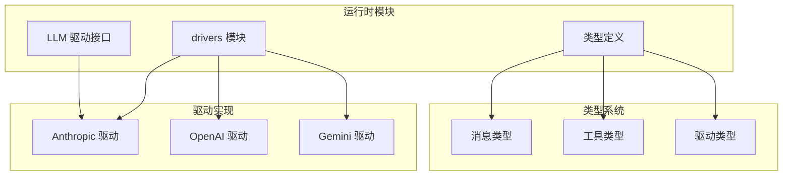

**图表来源**
- [mod.rs:1-800](file://crates/openfang-runtime/src/drivers/mod.rs#L1-L800)
- [lib.rs:1-59](file://crates/openfang-runtime/src/lib.rs#L1-L59)

**章节来源**
- [mod.rs:1-800](file://crates/openfang-runtime/src/drivers/mod.rs#L1-L800)
- [lib.rs:1-59](file://crates/openfang-runtime/src/lib.rs#L1-L59)

## 核心组件

### AnthropicDriver 结构体

AnthropicDriver 是主要的驱动实现，负责与 Anthropic API 的交互：

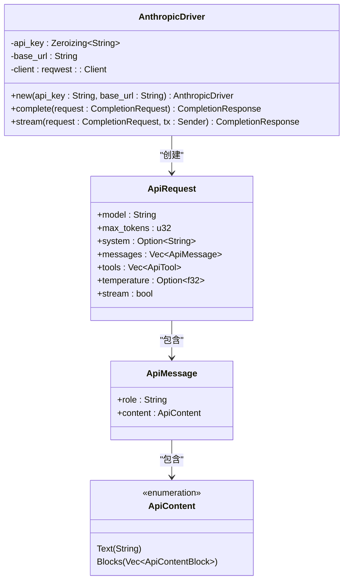

**图表来源**
- [anthropic.rs:18-36](file://crates/openfang-runtime/src/drivers/anthropic.rs#L18-L36)
- [anthropic.rs:39-87](file://crates/openfang-runtime/src/drivers/anthropic.rs#L39-L87)

### LLM 驱动接口

驱动实现遵循统一的 LLM 驱动接口，确保一致性：

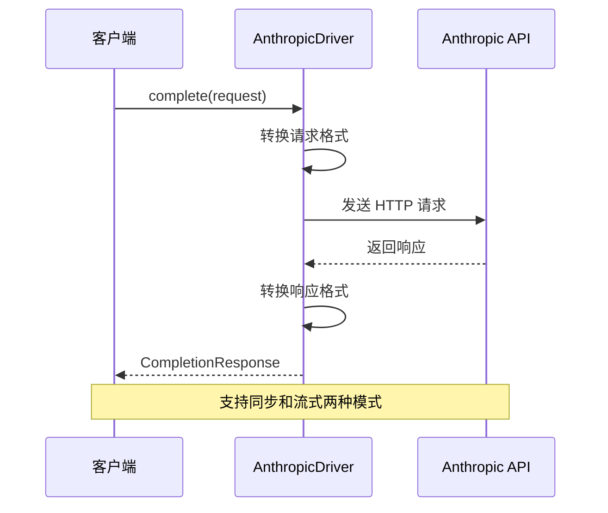

**图表来源**
- [llm_driver.rs:146-171](file://crates/openfang-runtime/src/llm_driver.rs#L146-L171)
- [anthropic.rs:156-260](file://crates/openfang-runtime/src/drivers/anthropic.rs#L156-L260)

**章节来源**
- [anthropic.rs:1-696](file://crates/openfang-runtime/src/drivers/anthropic.rs#L1-L696)
- [llm_driver.rs:1-327](file://crates/openfang-runtime/src/llm_driver.rs#L1-L327)

## 架构概览

### 整体架构设计

OpenFang 采用分层架构设计，Anthropic 驱动位于运行时层：

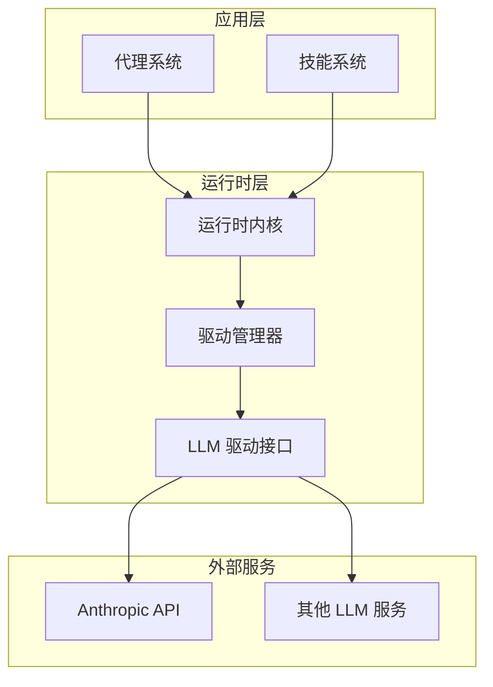

**图表来源**
- [mod.rs:257-456](file://crates/openfang-runtime/src/drivers/mod.rs#L257-L456)

### 驱动工厂模式

驱动创建采用工厂模式，支持多种提供商：

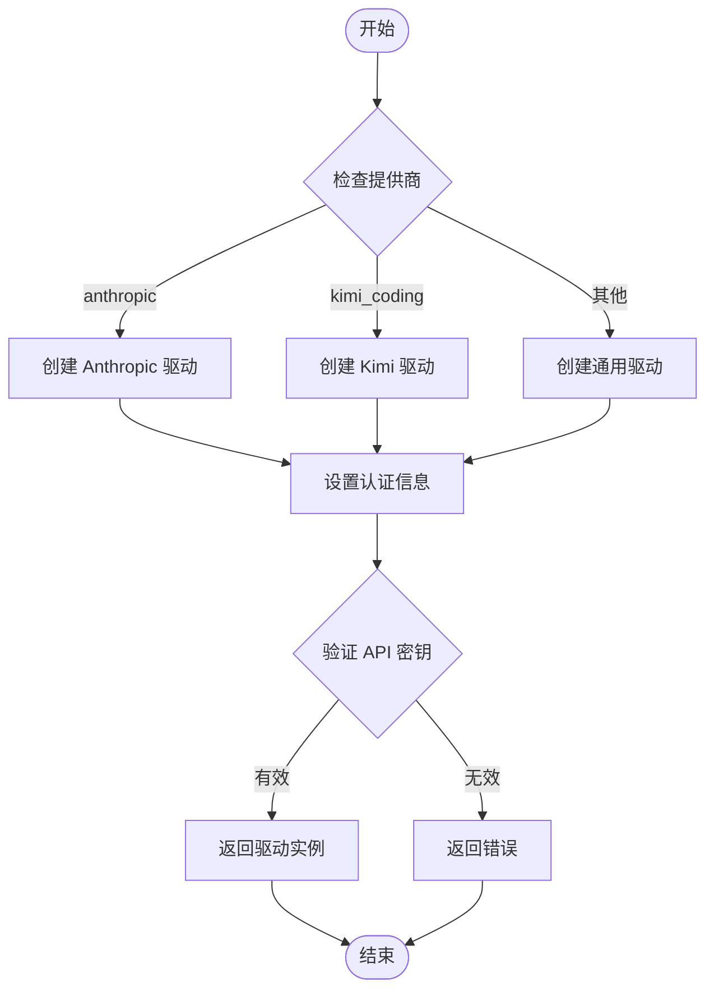

**图表来源**
- [mod.rs:257-456](file://crates/openfang-runtime/src/drivers/mod.rs#L257-L456)

**章节来源**
- [mod.rs:257-456](file://crates/openfang-runtime/src/drivers/mod.rs#L257-L456)

## 详细组件分析

### Messages API 请求格式转换

Anthropic 驱动实现了复杂的请求格式转换逻辑：

#### 系统提示处理

系统提示在 Anthropic API 中有特殊的处理方式：

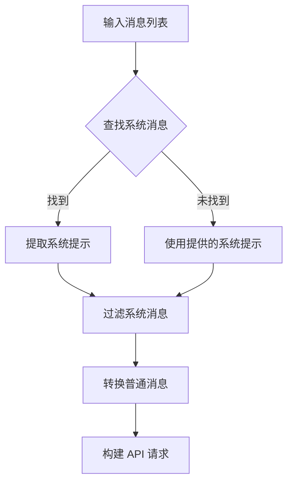

**图表来源**
- [anthropic.rs:158-178](file://crates/openfang-runtime/src/drivers/anthropic.rs#L158-L178)

#### 消息内容转换

消息内容从通用格式转换为 Anthropic API 格式：

| 内容类型 | 原始格式 | Anthropic 格式 | 处理逻辑 |
|---------|---------|---------------|----------|
| 文本 | `MessageContent::Text` | `ApiContent::Text` | 直接映射 |
| 图像 | `ContentBlock::Image` | `ApiContentBlock::Image` | Base64 编码 |
| 工具调用 | `ContentBlock::ToolUse` | `ApiContentBlock::ToolUse` | JSON 参数 |
| 工具结果 | `ContentBlock::ToolResult` | `ApiContentBlock::ToolResult` | 错误标记 |

**章节来源**
- [anthropic.rs:556-609](file://crates/openfang-runtime/src/drivers/anthropic.rs#L556-L609)

### 流式响应处理

流式响应是 Anthropic 驱动的核心特性之一：

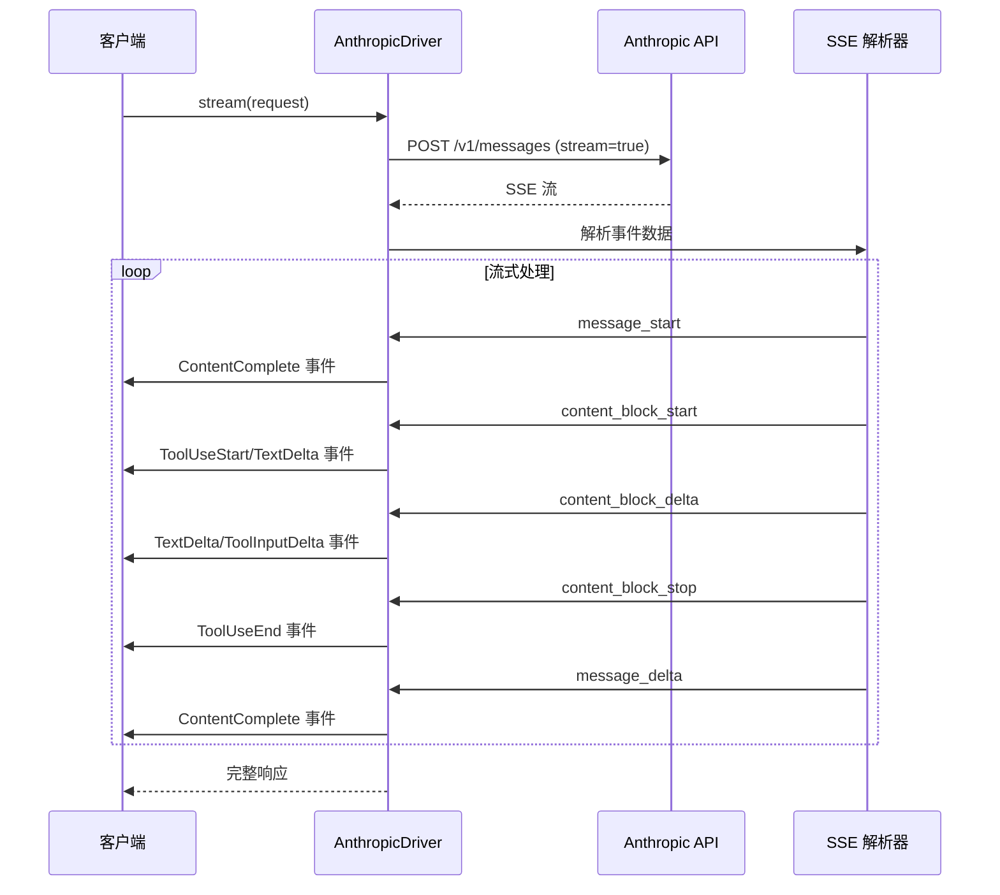

**图表来源**
- [anthropic.rs:262-553](file://crates/openfang-runtime/src/drivers/anthropic.rs#L262-L553)

#### 流式事件类型

驱动支持多种流式事件类型：

| 事件类型 | 触发时机 | 发送的数据 | 用途 |
|---------|---------|-----------|------|
| `message_start` | 流开始 | 使用量统计 | 初始化使用量 |
| `content_block_start` | 新内容块开始 | 内容块类型 | 开始处理新内容 |
| `content_block_delta` | 内容增量更新 | 文本或 JSON | 实时传输数据 |
| `content_block_stop` | 内容块结束 | 完整工具参数 | 工具调用完成 |
| `message_delta` | 消息状态更新 | 停止原因 | 流结束通知 |

**章节来源**
- [anthropic.rs:387-501](file://crates/openfang-runtime/src/drivers/anthropic.rs#L387-L501)

### 工具调用支持

Anthropic 驱动提供了完整的工具调用支持：

#### 工具定义转换

工具定义从通用格式转换为 Anthropic API 格式：

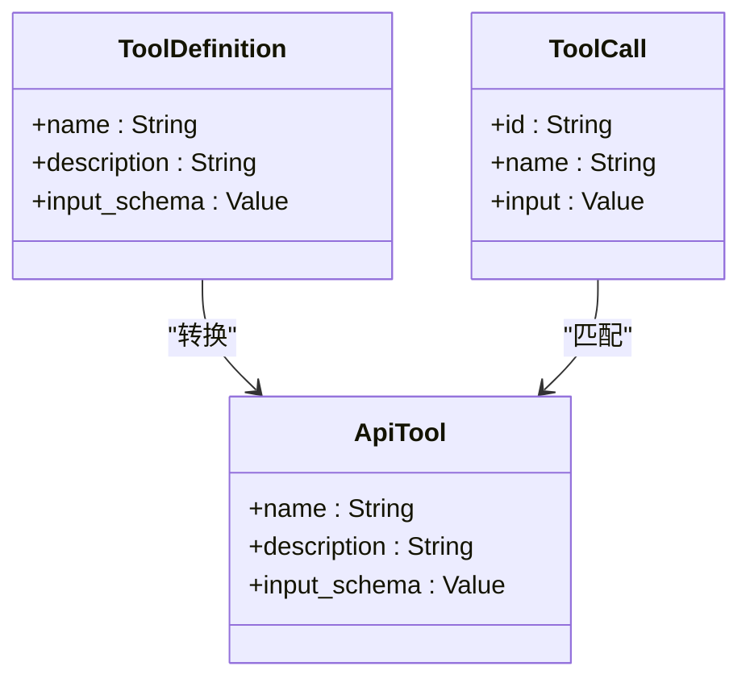

**图表来源**
- [tool.rs:6-25](file://crates/openfang-types/src/tool.rs#L6-L25)
- [anthropic.rs:181-189](file://crates/openfang-runtime/src/drivers/anthropic.rs#L181-L189)

#### 工具执行流程

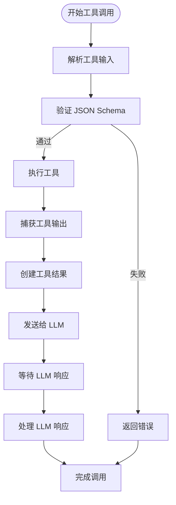

**图表来源**
- [anthropic.rs:519-534](file://crates/openfang-runtime/src/drivers/anthropic.rs#L519-L534)

**章节来源**
- [tool.rs:1-650](file://crates/openfang-types/src/tool.rs#L1-L650)
- [anthropic.rs:180-189](file://crates/openfang-runtime/src/drivers/anthropic.rs#L180-L189)

### Kimi 编码模式支持

Kimi（原 Moonshot）提供了专门的编码模式端点：

#### Kimi 端点配置

| 提供商 | 端点 URL | 认证方式 | 特殊功能 |
|-------|---------|---------|---------|
| Kimi 编码 | `https://api.kimi.com/coding` | API 密钥 | 编码专用模型 |
| Kimi 对话 | `https://api.moonshot.ai/v1` | API 密钥 | 通用对话模型 |

#### 编码模式特性

Kimi 编码模式具有以下特殊配置：

- **温度设置**：固定温度值以确保多轮对话兼容性
- **思考内容**：禁用思考内容以优化编码场景
- **上下文窗口**：更大的上下文窗口支持长代码片段

**章节来源**
- [mod.rs:373-387](file://crates/openfang-runtime/src/drivers/mod.rs#L373-L387)
- [openai.rs:61-66](file://crates/openfang-runtime/src/drivers/openai.rs#L61-L66)

### 错误处理和重试机制

驱动实现了智能的错误分类和重试机制：

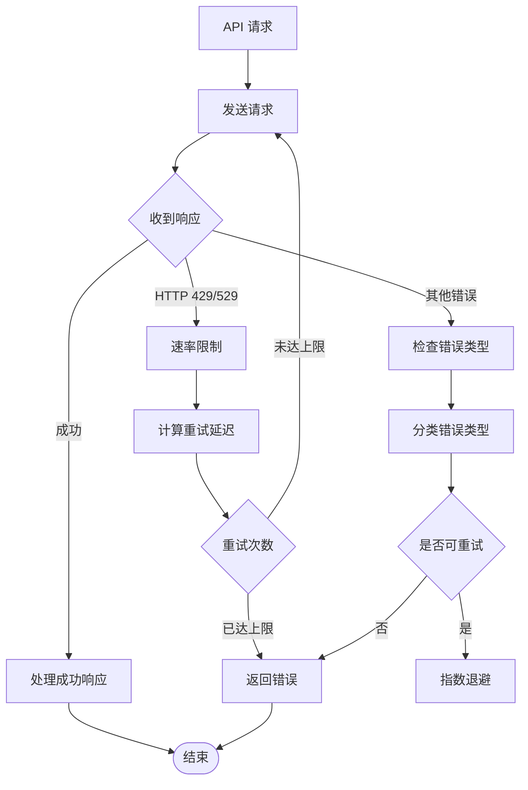

**图表来源**
- [anthropic.rs:201-254](file://crates/openfang-runtime/src/drivers/anthropic.rs#L201-L254)
- [llm_errors.rs:241-392](file://crates/openfang-runtime/src/llm_errors.rs#L241-L392)

#### 错误分类系统

驱动支持 8 种错误类型的智能分类：

| 错误类别 | 识别模式 | 处理策略 |
|---------|---------|---------|
| 速率限制 | `rate limit`, `429` | 自动重试，指数退避 |
| 服务过载 | `overloaded`, `503` | 重试，建议用户稍后重试 |
| 超时 | `timeout`, `ETIMEDOUT` | 重试，检查网络连接 |
| 计费问题 | `payment required`, `billing` | 停止重试，提示用户充值 |
| 认证失败 | `invalid api key`, `401/403` | 停止重试，检查密钥 |
| 上下文溢出 | `context length`, `token limit` | 建议减少上下文 |
| 格式错误 | `invalid request`, `validation` | 停止重试，修正请求 |
| 模型不存在 | `model not found`, `404` | 停止重试，检查模型名 |

**章节来源**
- [llm_errors.rs:18-38](file://crates/openfang-runtime/src/llm_errors.rs#L18-L38)
- [anthropic.rs:201-254](file://crates/openfang-runtime/src/drivers/anthropic.rs#L201-L254)

## 依赖关系分析

### 组件依赖图

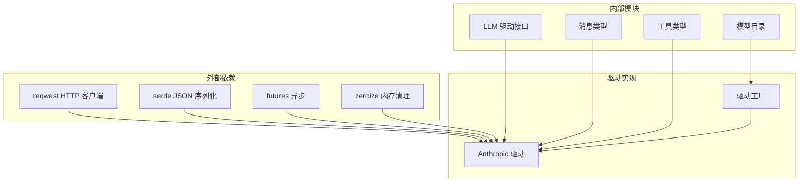

**图表来源**
- [anthropic.rs:6-15](file://crates/openfang-runtime/src/drivers/anthropic.rs#L6-L15)
- [mod.rs:15-26](file://crates/openfang-runtime/src/drivers/mod.rs#L15-L26)

### 数据类型依赖

驱动实现依赖于统一的数据类型系统：

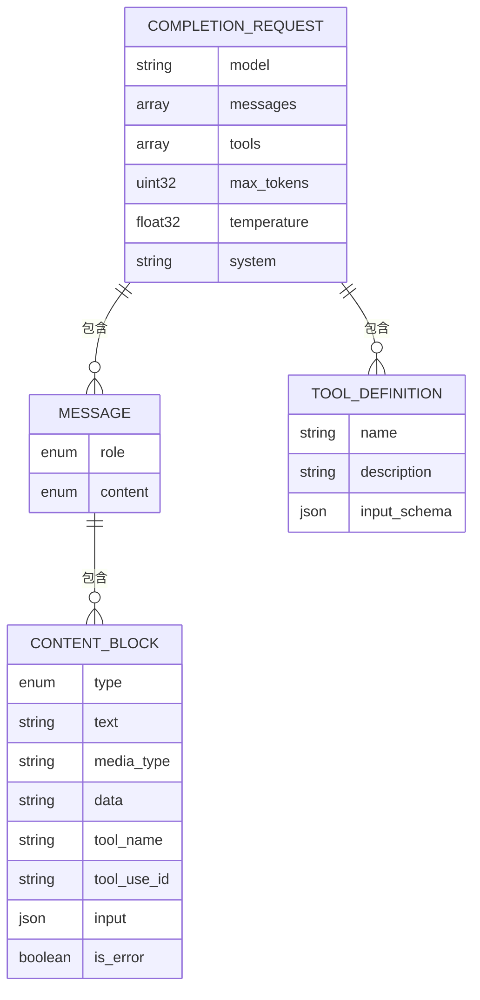

**图表来源**
- [llm_driver.rs:52-81](file://crates/openfang-runtime/src/llm_driver.rs#L52-L81)
- [message.rs:6-96](file://crates/openfang-types/src/message.rs#L6-L96)
- [tool.rs:6-36](file://crates/openfang-types/src/tool.rs#L6-L36)

**章节来源**
- [anthropic.rs:6-15](file://crates/openfang-runtime/src/drivers/anthropic.rs#L6-L15)
- [message.rs:1-341](file://crates/openfang-types/src/message.rs#L1-L341)
- [tool.rs:1-650](file://crates/openfang-types/src/tool.rs#L1-L650)

## 性能考虑

### 并发和异步处理

驱动实现了高效的并发处理机制：

- **异步 HTTP 客户端**：使用 `reqwest` 的异步能力
- **流式处理**：支持实时流式响应处理
- **内存安全**：使用 `zeroize` 确保敏感数据安全清理

### 缓存和优化策略

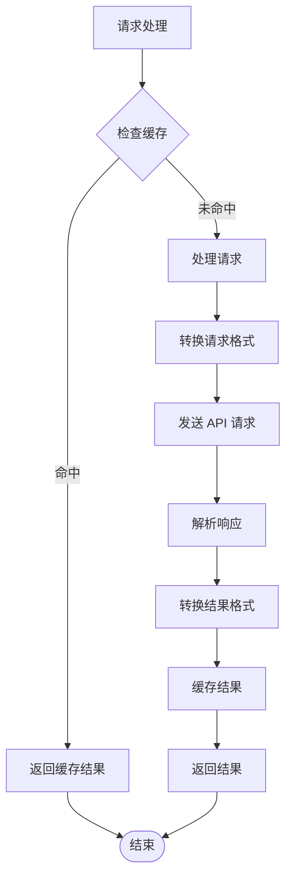

### 性能监控指标

驱动收集以下关键性能指标：

- **请求延迟**：从发送到接收完整响应的时间
- **吞吐量**：每秒处理的请求数
- **错误率**：各种错误类型的统计
- **使用量**：输入输出令牌计数

## 故障排除指南

### 常见问题诊断

#### 认证问题

**症状**：`401 Unauthorized` 或 `403 Forbidden` 错误

**解决方案**：
1. 验证 API 密钥是否正确设置
2. 检查环境变量 `ANTHROPIC_API_KEY`
3. 确认 API 密钥具有正确的权限

#### 速率限制问题

**症状**：频繁出现 `429 Too Many Requests`

**解决方案**：
1. 实现指数退避重试
2. 减少并发请求数量
3. 调整请求频率

#### 上下文溢出

**症状**：`context_length_exceeded` 错误

**解决方案**：
1. 减少消息历史长度
2. 使用更短的模型
3. 实现上下文压缩

#### 网络连接问题

**症状**：超时或连接中断

**解决方案**：
1. 检查网络连接稳定性
2. 增加超时时间
3. 实现连接池管理

**章节来源**
- [llm_errors.rs:60-222](file://crates/openfang-runtime/src/llm_errors.rs#L60-L222)
- [anthropic.rs:201-254](file://crates/openfang-runtime/src/drivers/anthropic.rs#L201-L254)

### 调试和日志

驱动提供了详细的日志记录：

- **请求日志**：记录完整的请求和响应
- **错误日志**：记录详细的错误信息
- **性能日志**：记录性能指标
- **调试模式**：支持详细调试输出

## 结论

Anthropic Claude 驱动实现了 OpenFang 项目中对 Anthropic API 的完整支持。该实现具有以下特点：

### 主要优势

1. **完整的 API 支持**：实现了 Anthropic Messages API 的所有核心功能
2. **灵活的配置**：支持多种提供商和自定义端点
3. **强大的工具调用**：无缝集成函数调用和工具使用
4. **流式响应**：提供实时的流式输出体验
5. **智能错误处理**：具备完善的错误分类和重试机制
6. **性能优化**：采用异步处理和内存安全设计

### 技术特色

- **模块化设计**：清晰的组件分离和职责划分
- **类型安全**：完整的 Rust 类型系统保证安全性
- **错误处理**：智能的错误分类和恢复策略
- **扩展性**：易于添加新的提供商和功能

### 应用场景

该驱动适用于以下应用场景：

- **智能代理系统**：构建复杂的 AI 代理
- **自动化工作流**：实现智能自动化任务
- **内容生成**：支持多种内容创作需求
- **数据分析**：结合工具调用进行数据分析

通过精心设计的架构和实现，Anthropic Claude 驱动为 OpenFang 项目提供了强大而可靠的 LLM 集成能力，为上层应用提供了稳定的服务基础。