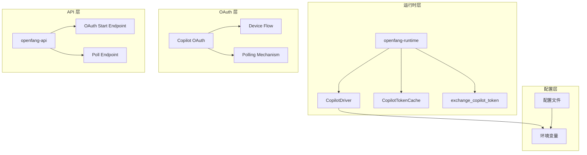
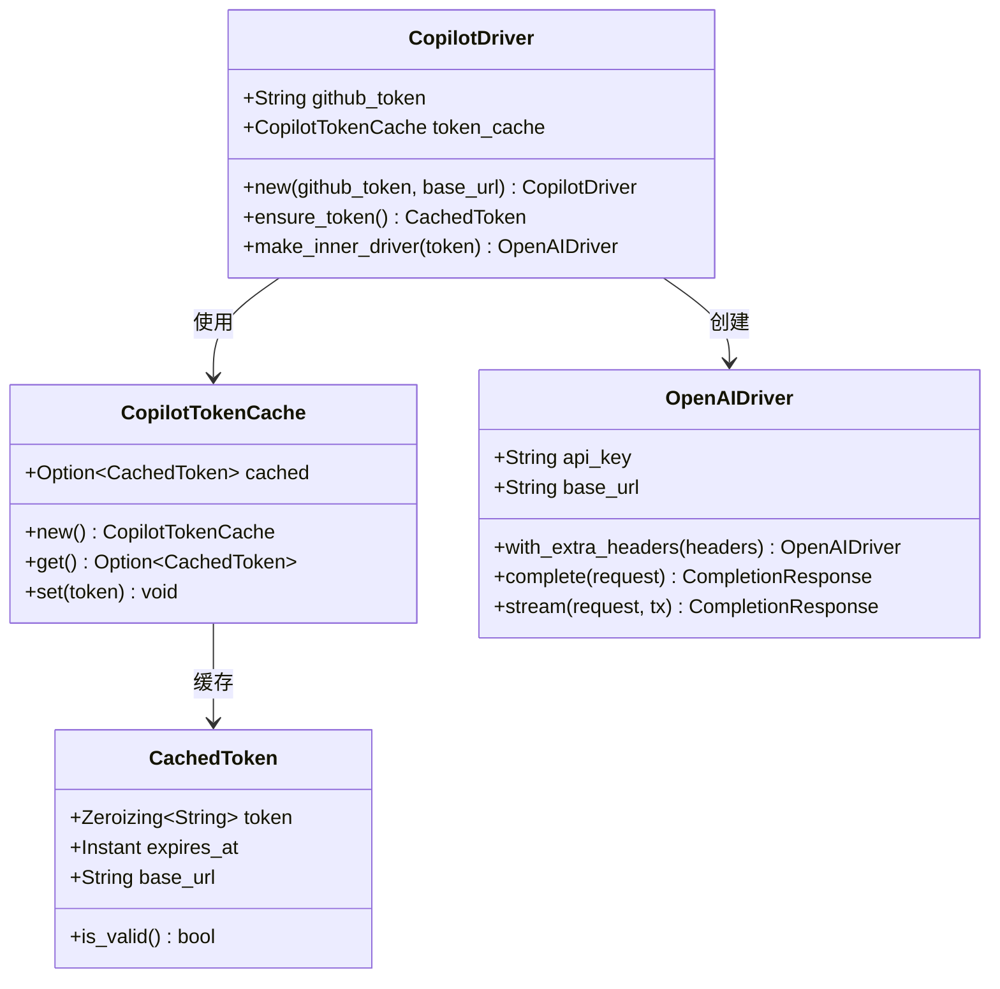
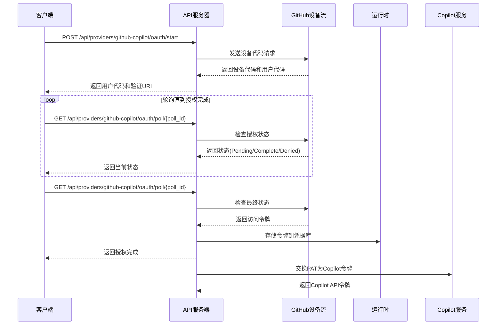
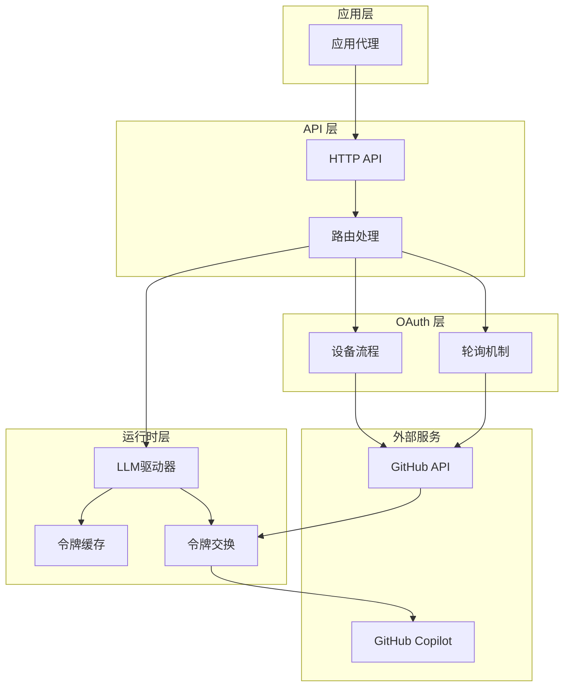
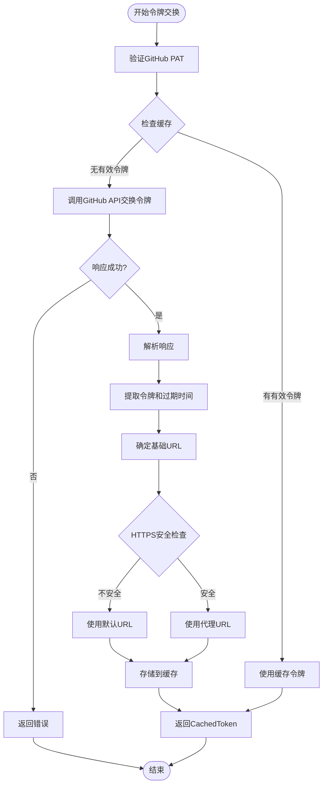
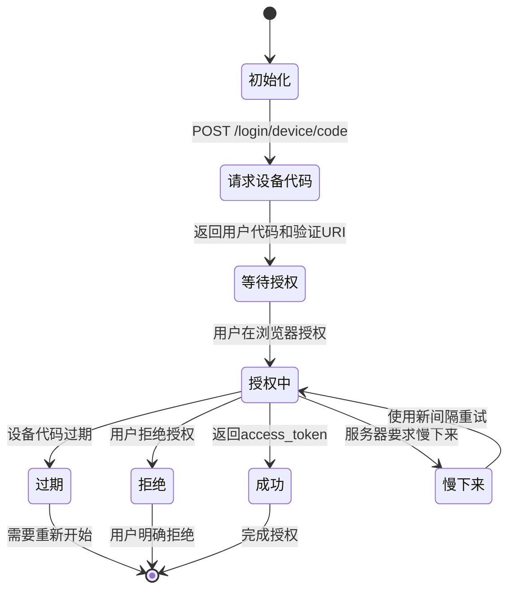
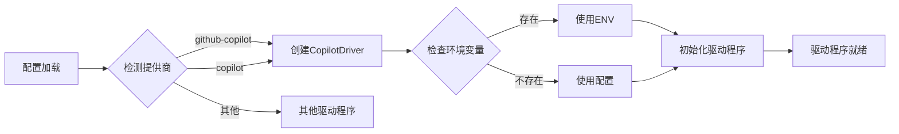
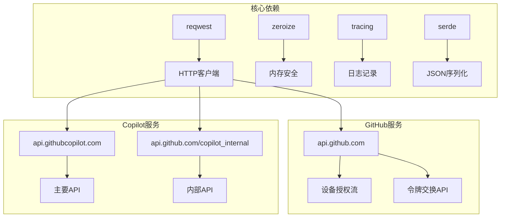
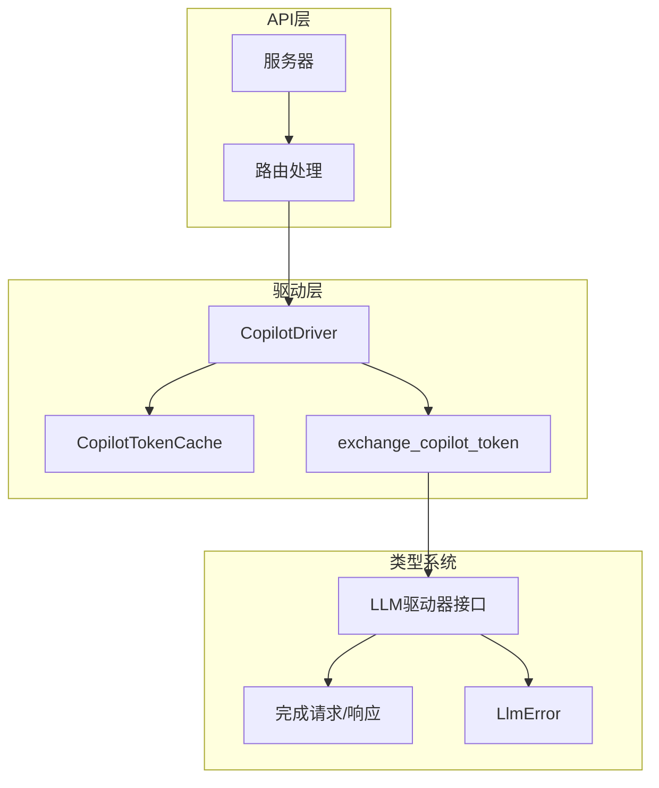

# GitHub Copilot 驱动实现

<cite>
**本文档引用的文件**
- [copilot.rs](file://crates/openfang-runtime/src/drivers/copilot.rs)
- [copilot_oauth.rs](file://crates/openfang-runtime/src/copilot_oauth.rs)
- [drivers/mod.rs](file://crates/openfang-runtime/src/drivers/mod.rs)
- [llm_driver.rs](file://crates/openfang-runtime/src/llm_driver.rs)
- [routes.rs](file://crates/openfang-api/src/routes.rs)
- [server.rs](file://crates/openfang-api/src/server.rs)
- [openfang.toml.example](file://openfang.toml.example)
</cite>

## 目录
1. [简介](#简介)
2. [项目结构](#项目结构)
3. [核心组件](#核心组件)
4. [架构概览](#架构概览)
5. [详细组件分析](#详细组件分析)
6. [依赖关系分析](#依赖关系分析)
7. [性能考虑](#性能考虑)
8. [故障排除指南](#故障排除指南)
9. [结论](#结论)

## 简介

OpenFang 项目实现了对 GitHub Copilot 的深度集成，提供了一个完整的认证和身份验证解决方案。该实现的核心目标是简化开发者使用 Copilot API 的复杂性，通过自动化的令牌管理和透明的身份验证机制，让开发者能够专注于构建智能代理应用。

本实现的关键特性包括：
- 自动化的 GitHub PAT 到 Copilot Token 交换机制
- 智能缓存策略和刷新逻辑
- 与 GitHub 身份验证系统的无缝集成
- 透明的身份验证，无需手动管理令牌
- 完整的错误处理和重试机制

## 项目结构

OpenFang 项目采用模块化设计，Copilot 集成分布在多个关键模块中：

**图表来源**
- [copilot.rs:162-243](file://crates/openfang-runtime/src/drivers/copilot.rs#L162-L243)
- [copilot_oauth.rs:45-137](file://crates/openfang-runtime/src/copilot_oauth.rs#L45-L137)
- [routes.rs:10490-10631](file://crates/openfang-api/src/routes.rs#L10490-L10631)

**章节来源**
- [copilot.rs:1-317](file://crates/openfang-runtime/src/drivers/copilot.rs#L1-L317)
- [copilot_oauth.rs:1-150](file://crates/openfang-runtime/src/copilot_oauth.rs#L1-L150)

## 核心组件

### CopilotDriver 结构体

CopilotDriver 是整个 Copilot 集成的核心组件，负责管理 GitHub PAT 和 Copilot API 令牌之间的转换过程。

**图表来源**
- [copilot.rs:162-221](file://crates/openfang-runtime/src/drivers/copilot.rs#L162-L221)

### OAuth 设备流程

OAuth 设备流程提供了用户友好的方式来获取 GitHub 访问令牌：

**图表来源**
- [routes.rs:10496-10631](file://crates/openfang-api/src/routes.rs#L10496-L10631)
- [copilot_oauth.rs:45-137](file://crates/openfang-runtime/src/copilot_oauth.rs#L45-L137)

**章节来源**
- [copilot.rs:162-243](file://crates/openfang-runtime/src/drivers/copilot.rs#L162-L243)
- [copilot_oauth.rs:1-150](file://crates/openfang-runtime/src/copilot_oauth.rs#L1-L150)

## 架构概览

OpenFang 的 Copilot 集成采用了分层架构设计，确保了模块间的清晰分离和高内聚低耦合：

**图表来源**
- [drivers/mod.rs:257-456](file://crates/openfang-runtime/src/drivers/mod.rs#L257-L456)
- [routes.rs:10490-10631](file://crates/openfang-api/src/routes.rs#L10490-L10631)

## 详细组件分析

### 令牌交换机制

令牌交换是 Copilot 集成的核心功能，它将 GitHub Personal Access Token (PAT) 转换为 Copilot API 可用的令牌格式。

#### 令牌交换流程

**图表来源**
- [copilot.rs:78-138](file://crates/openfang-runtime/src/drivers/copilot.rs#L78-L138)

#### 缓存策略

CopilotDriver 实现了智能缓存策略，确保令牌的有效性和性能优化：

| 缓存属性 | 值 | 描述 |
|---------|-----|------|
| 缓存类型 | 线程安全互斥锁 | 确保并发访问的安全性 |
| 刷新缓冲 | 5分钟前刷新 | 预防令牌在临界点过期 |
| 最小TTL | 60秒 | 防止过短的令牌生命周期 |
| 基础URL优先级 | 代理URL > 默认URL | 支持自定义代理设置 |

**章节来源**
- [copilot.rs:41-70](file://crates/openfang-runtime/src/drivers/copilot.rs#L41-L70)
- [copilot.rs:78-138](file://crates/openfang-runtime/src/drivers/copilot.rs#L78-L138)

### OAuth 设备流程实现

OAuth 设备流程提供了用户友好的令牌获取体验，遵循 OAuth 2.0 设备授权规范：

#### 设备流程状态机

**图表来源**
- [copilot_oauth.rs:29-43](file://crates/openfang-runtime/src/copilot_oauth.rs#L29-L43)

#### API 端点设计

| 端点 | 方法 | 功能 | 响应 |
|------|------|------|------|
| /api/providers/github-copilot/oauth/start | POST | 开始OAuth设备流程 | 用户代码、验证URI、poll_id |
| /api/providers/github-copilot/oauth/poll/{poll_id} | GET | 轮询授权状态 | pending/complete/expired/denied/error |

**章节来源**
- [routes.rs:10496-10631](file://crates/openfang-api/src/routes.rs#L10496-L10631)
- [copilot_oauth.rs:45-137](file://crates/openfang-runtime/src/copilot_oauth.rs#L45-L137)

### 集成点和配置

#### 驱动程序注册

Copilot 驱动程序在系统启动时自动注册，支持多种配置方式：

**图表来源**
- [drivers/mod.rs:330-351](file://crates/openfang-runtime/src/drivers/mod.rs#L330-L351)

#### 配置选项

| 配置项 | 环境变量 | 默认值 | 描述 |
|--------|----------|--------|------|
| provider | 无 | github-copilot | 指定使用Copilot提供商 |
| api_key | GITHUB_TOKEN | 无 | GitHub访问令牌 |
| base_url | 无 | https://api.githubcopilot.com | Copilot API基础URL |

**章节来源**
- [drivers/mod.rs:330-351](file://crates/openfang-runtime/src/drivers/mod.rs#L330-L351)
- [openfang.toml.example:1-49](file://openfang.toml.example#L1-L49)

## 依赖关系分析

### 外部依赖

OpenFang Copilot 集成依赖以下关键外部组件：

**图表来源**
- [copilot.rs:6-9](file://crates/openfang-runtime/src/drivers/copilot.rs#L6-L9)
- [copilot_oauth.rs:7-8](file://crates/openfang-runtime/src/copilot_oauth.rs#L7-L8)

### 内部依赖关系

**图表来源**
- [llm_driver.rs:145-171](file://crates/openfang-runtime/src/llm_driver.rs#L145-L171)
- [drivers/mod.rs:257-456](file://crates/openfang-runtime/src/drivers/mod.rs#L257-L456)

**章节来源**
- [copilot.rs:1-317](file://crates/openfang-runtime/src/drivers/copilot.rs#L1-L317)
- [llm_driver.rs:1-327](file://crates/openfang-runtime/src/llm_driver.rs#L1-L327)

## 性能考虑

### 缓存优化

Copilot 驱动程序实现了多层缓存策略来优化性能：

1. **内存缓存**：使用线程安全的互斥锁保护令牌缓存
2. **预刷新机制**：在令牌到期前5分钟自动刷新
3. **最小TTL保护**：确保令牌不会过短，减少频繁刷新
4. **零化内存**：使用 zeroize 确保敏感令牌从内存中安全清除

### 并发处理

系统采用异步编程模型处理并发请求：

- 使用 tokio 异步运行时
- 令牌交换操作非阻塞
- 支持多线程安全访问
- 内存中的令牌零化防止泄漏

### 错误处理和重试

实现包含了完善的错误处理机制：

- 网络超时和重试
- 令牌过期自动刷新
- OAuth 设备流程的慢下来处理
- 详细的错误日志和追踪

## 故障排除指南

### 常见问题诊断

#### 令牌交换失败

**症状**：`Copilot token exchange failed: ...`

**可能原因**：
1. GitHub PAT 无效或过期
2. 网络连接问题
3. GitHub API 服务不可用
4. 超时设置过短

**解决步骤**：
1. 验证 GITHUB_TOKEN 环境变量
2. 检查网络连接
3. 查看 API 响应状态码
4. 增加超时设置

#### OAuth 设备流程超时

**症状**：设备流程在轮询阶段超时

**可能原因**：
1. 用户未完成浏览器授权
2. 服务器要求慢下来
3. 设备代码过期

**解决步骤**：
1. 重新开始设备流程
2. 检查用户是否完成授权
3. 处理慢下来状态并调整轮询间隔

#### 缓存问题

**症状**：令牌频繁刷新或过期

**可能原因**：
1. 缓存未正确设置
2. 时间同步问题
3. 并发访问冲突

**解决步骤**：
1. 检查缓存初始化
2. 验证系统时间
3. 确认线程安全

**章节来源**
- [copilot.rs:180-197](file://crates/openfang-runtime/src/drivers/copilot.rs#L180-L197)
- [routes.rs:10563-10631](file://crates/openfang-api/src/routes.rs#L10563-L10631)

## 结论

OpenFang 的 GitHub Copilot 驱动实现提供了一个完整、安全且高效的解决方案，用于集成 GitHub Copilot 服务。该实现的主要优势包括：

### 技术优势

1. **自动化程度高**：完全自动化的令牌管理和刷新机制
2. **安全性强**：使用零化内存和 HTTPS 保护
3. **用户体验好**：提供 OAuth 设备流程，无需手动管理令牌
4. **性能优化**：智能缓存和预刷新机制
5. **错误处理完善**：全面的错误处理和重试机制

### 架构特点

1. **模块化设计**：清晰的分层架构，便于维护和扩展
2. **异步处理**：基于 tokio 的高性能异步实现
3. **类型安全**：完整的类型系统和错误处理
4. **配置灵活**：支持多种配置方式和环境变量

### 最佳实践建议

1. **安全配置**：始终使用环境变量存储敏感信息
2. **监控告警**：建立适当的监控和告警机制
3. **容量规划**：根据使用量合理配置缓存和超时参数
4. **故障恢复**：实现适当的故障恢复和降级策略

这个实现为开发者提供了一个可靠的框架，可以轻松地将 GitHub Copilot 集成到各种应用场景中，同时保持高度的安全性和性能。