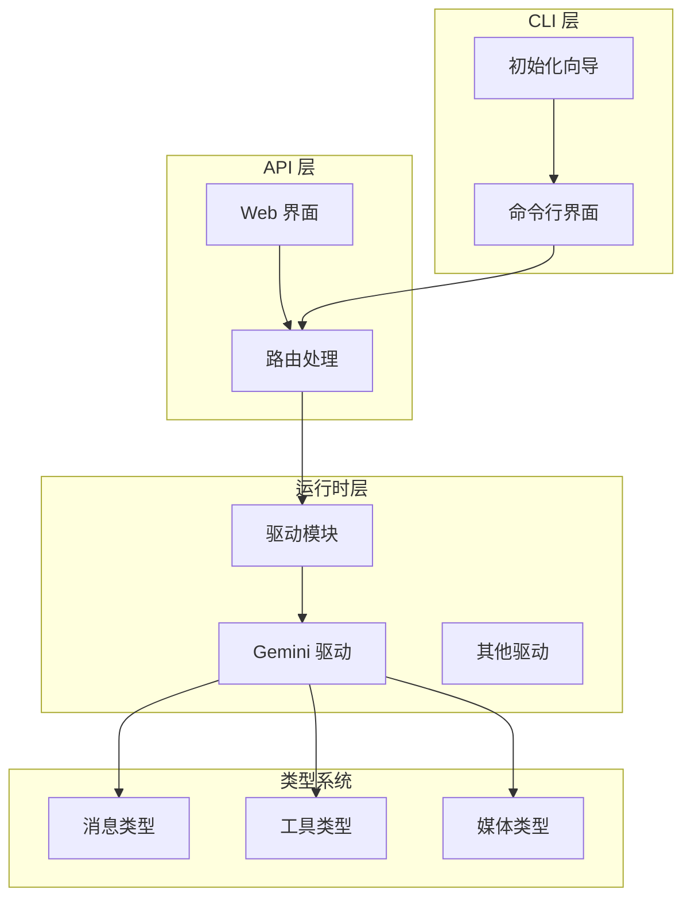
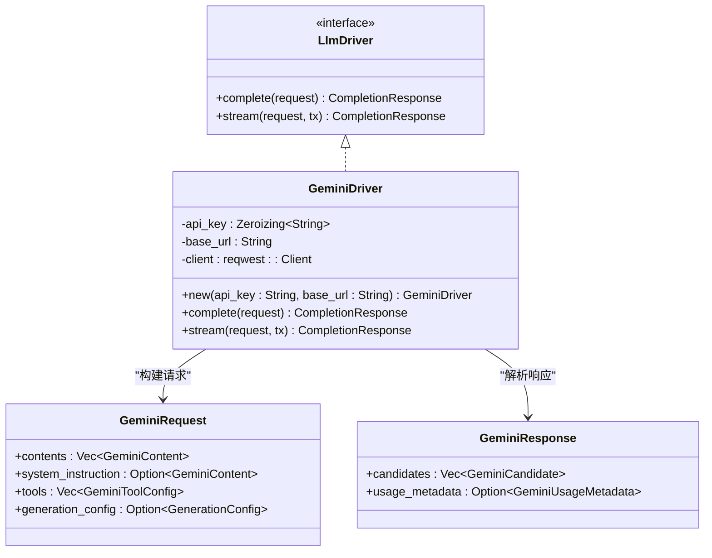
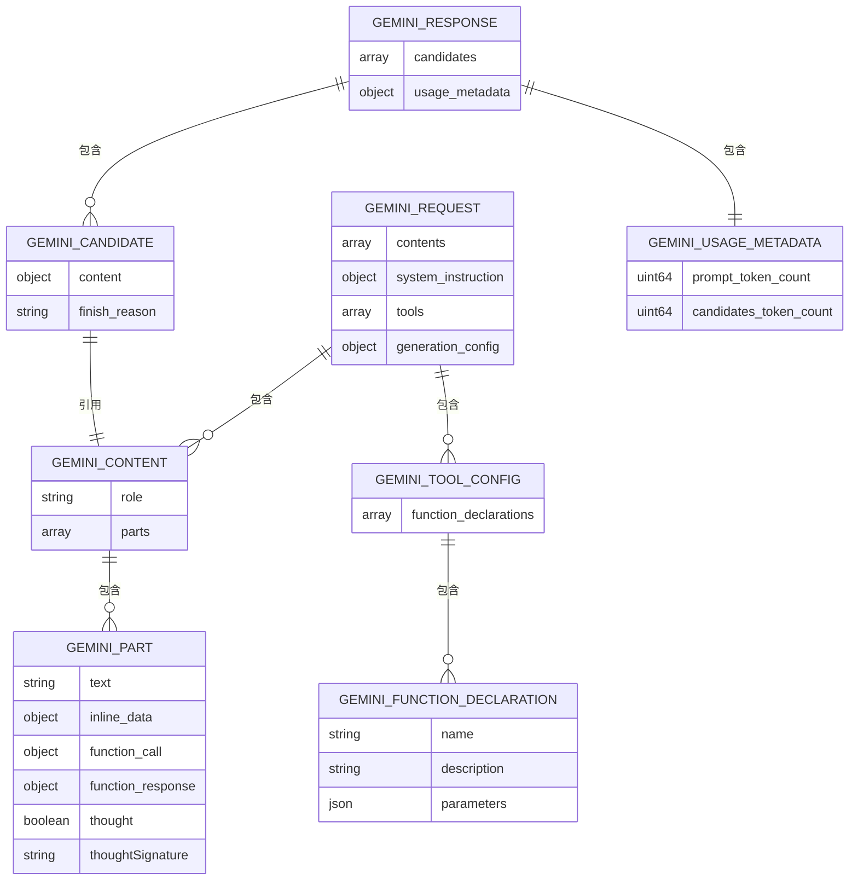
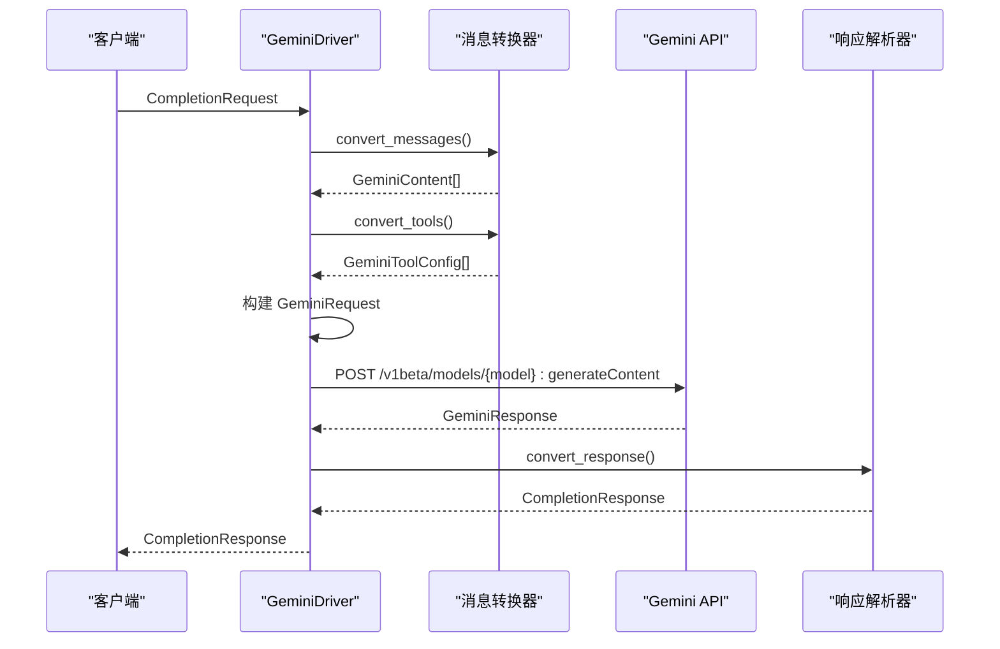
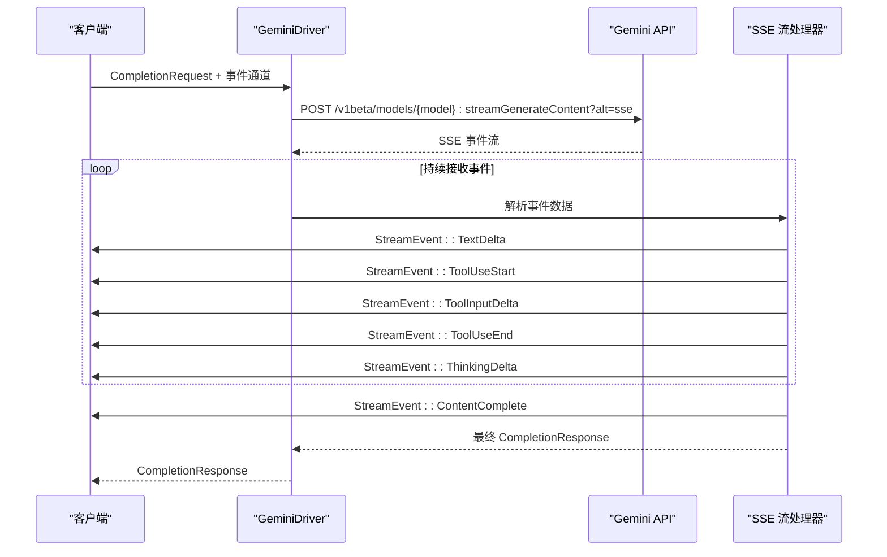
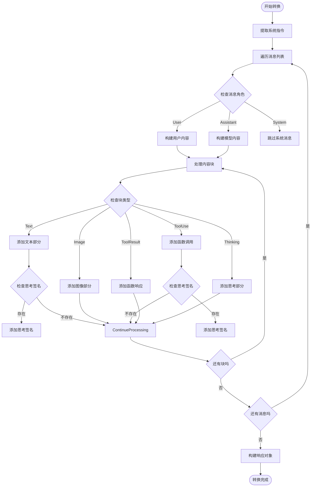
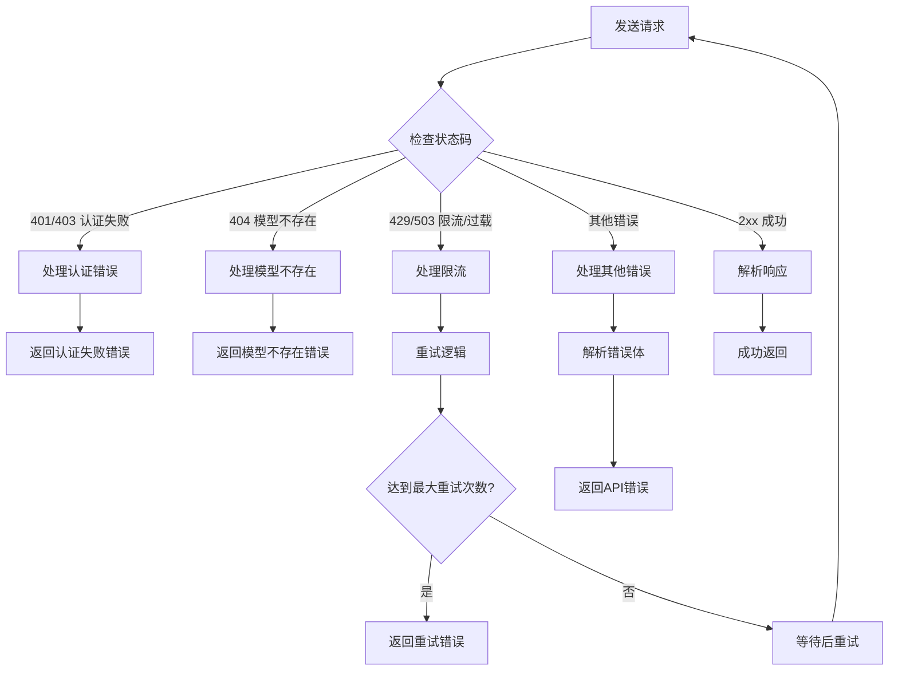
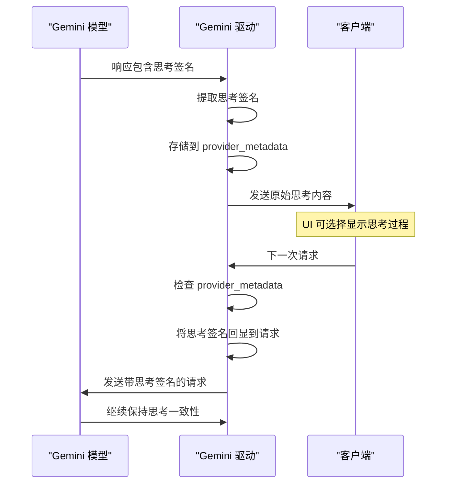
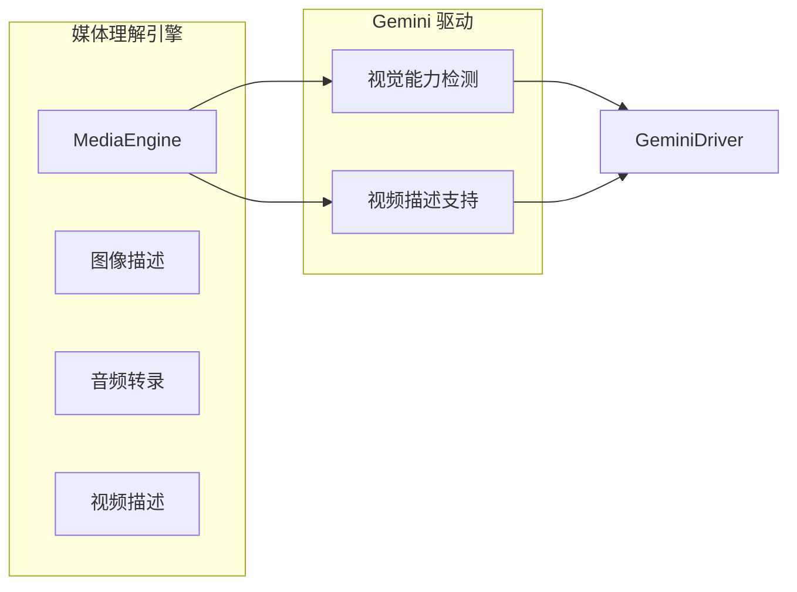

# Google Gemini 驱动实现

<cite>
**本文档引用的文件**
- [gemini.rs](file://crates/openfang-runtime/src/drivers/gemini.rs)
- [mod.rs](file://crates/openfang-runtime/src/drivers/mod.rs)
- [media_understanding.rs](file://crates/openfang-runtime/src/media_understanding.rs)
- [routes.rs](file://crates/openfang-api/src/routes.rs)
- [main.rs](file://crates/openfang-cli/src/main.rs)
- [init_wizard.rs](file://crates/openfang-cli/src/tui/screens/init_wizard.rs)
- [google_chat.rs](file://crates/openfang-channels/src/google_chat.rs)
- [SKILL.md](file://crates/openfang-skills/bundled/gcp/SKILL.md)
</cite>

## 目录
1. [简介](#简介)
2. [项目结构](#项目结构)
3. [核心组件](#核心组件)
4. [架构概览](#架构概览)
5. [详细组件分析](#详细组件分析)
6. [依赖关系分析](#依赖关系分析)
7. [性能考虑](#性能考虑)
8. [故障排除指南](#故障排除指南)
9. [结论](#结论)
10. [附录](#附录)

## 简介

本文件为 Google Gemini 驱动实现的详细技术文档。该实现提供了对 Google Gemini API 的原生适配，支持多模态输入处理、函数调用、流式响应以及安全设置配置。文档重点涵盖以下方面：

- Gemini API 格式差异的适配实现（模型路径、认证头、系统指令、工具定义、响应格式）
- 多模态输入处理（文本、图像、函数调用、思考过程）
- 安全设置配置（API 密钥管理、零化内存、错误处理）
- Google API 密钥和 Google API 密钥别名的支持
- 与 Google Cloud 服务的集成关系和最佳实践

## 项目结构

Gemini 驱动位于运行时层的驱动模块中，采用模块化设计，便于与其他 LLM 提供商统一集成。



**图表来源**
- [mod.rs:1-800](file://crates/openfang-runtime/src/drivers/mod.rs#L1-L800)
- [gemini.rs:1-80](file://crates/openfang-runtime/src/drivers/gemini.rs#L1-L80)

**章节来源**
- [mod.rs:1-800](file://crates/openfang-runtime/src/drivers/mod.rs#L1-L800)
- [gemini.rs:1-80](file://crates/openfang-runtime/src/drivers/gemini.rs#L1-L80)

## 核心组件

### Gemini 驱动架构

Gemini 驱动实现了统一的 LLM 驱动接口，提供同步和异步两种请求模式：



**图表来源**
- [gemini.rs:22-832](file://crates/openfang-runtime/src/drivers/gemini.rs#L22-L832)

### 数据类型映射

Gemini API 使用独特的数据结构，需要进行精确的序列化和反序列化映射：



**图表来源**
- [gemini.rs:45-194](file://crates/openfang-runtime/src/drivers/gemini.rs#L45-L194)

**章节来源**
- [gemini.rs:1-832](file://crates/openfang-runtime/src/drivers/gemini.rs#L1-L832)

## 架构概览

### 请求流程

Gemini 驱动的完整请求处理流程如下：



**图表来源**
- [gemini.rs:500-581](file://crates/openfang-runtime/src/drivers/gemini.rs#L500-L581)

### 流式响应处理

流式响应通过 Server-Sent Events (SSE) 实现，支持实时增量输出：



**图表来源**
- [gemini.rs:583-831](file://crates/openfang-runtime/src/drivers/gemini.rs#L583-L831)

**章节来源**
- [gemini.rs:500-831](file://crates/openfang-runtime/src/drivers/gemini.rs#L500-L831)

## 详细组件分析

### 消息转换器

消息转换器负责将内部消息格式转换为 Gemini API 所需的格式：



**图表来源**
- [gemini.rs:230-340](file://crates/openfang-runtime/src/drivers/gemini.rs#L230-L340)

#### 多模态输入处理

Gemini 驱动支持多种输入模态的处理：

| 输入类型 | 处理方式 | 输出格式 |
|---------|----------|----------|
| 文本 | 直接转换为 GeminiPart::Text | `{"text": "..."}` |
| 图像 | 转换为 GeminiPart::InlineData | `{"inlineData": {"mimeType": "...", "data": "..."}}` |
| 函数调用 | 转换为 GeminiPart::FunctionCall | `{"functionCall": {"name": "...", "args": {...}}}` |
| 工具结果 | 转换为 GeminiPart::FunctionResponse | `{"functionResponse": {"name": "...", "response": {...}}}` |
| 思考过程 | 转换为 GeminiPart::Thought | `{"text": "...", "thought": true}` |

**章节来源**
- [gemini.rs:230-340](file://crates/openfang-runtime/src/drivers/gemini.rs#L230-L340)

### 错误处理机制

Gemini 驱动实现了完善的错误处理机制：



**图表来源**
- [gemini.rs:515-581](file://crates/openfang-runtime/src/drivers/gemini.rs#L515-L581)

**章节来源**
- [gemini.rs:211-226](file://crates/openfang-runtime/src/drivers/gemini.rs#L211-L226)
- [gemini.rs:515-581](file://crates/openfang-runtime/src/drivers/gemini.rs#L515-L581)

### 思考过程处理

Gemini 2.5+ 思考模型引入了独特的思考签名机制：



**图表来源**
- [gemini.rs:76-88](file://crates/openfang-runtime/src/drivers/gemini.rs#L76-L88)
- [gemini.rs:416-422](file://crates/openfang-runtime/src/drivers/gemini.rs#L416-L422)

**章节来源**
- [gemini.rs:76-88](file://crates/openfang-runtime/src/drivers/gemini.rs#L76-L88)
- [gemini.rs:416-422](file://crates/openfang-runtime/src/drivers/gemini.rs#L416-L422)

## 依赖关系分析

### Provider 注册与配置

Gemini 驱动通过统一的驱动工厂进行注册和管理：

```mermaid
graph TB
subgraph "驱动工厂"
Factory[create_driver]
Defaults[provider_defaults]
Detect[detect_available_provider]
end
subgraph "Gemini 特殊处理"
GeminiCheck{检查 provider == "gemini" || "google"}
KeyCheck[检查 GEMINI_API_KEY 或 GOOGLE_API_KEY]
BaseURL[设置默认 base_url]
end
subgraph "环境变量支持"
EnvVars[GEMINI_API_KEY<br/>GOOGLE_API_KEY]
Aliases[API 密钥别名]
end
Factory --> Defaults
Factory --> Detect
Defaults --> GeminiCheck
GeminiCheck --> KeyCheck
KeyCheck --> EnvVars
EnvVars --> Aliases
BaseURL --> EnvVars
```

**图表来源**
- [mod.rs:276-293](file://crates/openfang-runtime/src/drivers/mod.rs#L276-L293)
- [mod.rs:74-78](file://crates/openfang-runtime/src/drivers/mod.rs#L74-L78)

### API 密钥管理

Gemini 支持两种主要的 API 密钥环境变量：

| 环境变量 | 用途 | 优先级 |
|---------|------|--------|
| `GEMINI_API_KEY` | 主要的 Gemini API 密钥 | 高 |
| `GOOGLE_API_KEY` | Google API 密钥别名 | 中等 |

**章节来源**
- [mod.rs:74-78](file://crates/openfang-runtime/src/drivers/mod.rs#L74-L78)
- [mod.rs:277-282](file://crates/openfang-runtime/src/drivers/mod.rs#L277-L282)

### 媒体理解集成

Gemini 驱动与媒体理解引擎深度集成：



**图表来源**
- [media_understanding.rs:27-54](file://crates/openfang-runtime/src/media_understanding.rs#L27-L54)
- [media_understanding.rs:183-207](file://crates/openfang-runtime/src/media_understanding.rs#L183-L207)

**章节来源**
- [media_understanding.rs:27-54](file://crates/openfang-runtime/src/media_understanding.rs#L27-L54)
- [media_understanding.rs:183-207](file://crates/openfang-runtime/src/media_understanding.rs#L183-L207)

## 性能考虑

### 连接池和并发控制

Gemini 驱动使用连接池优化网络请求性能：

- **HTTP 客户端配置**：使用 `reqwest::Client` 并设置合适的超时时间
- **并发限制**：通过外部媒体理解引擎的信号量控制并发数
- **重试机制**：实现指数退避的重试策略，避免雪崩效应

### 内存管理

- **API 密钥安全**：使用 `zeroize::Zeroizing<String>` 确保敏感信息在内存中被及时清理
- **响应解析优化**：采用流式解析减少内存占用
- **缓存策略**：合理使用 HTTP 缓存头避免重复请求

### 网络优化

- **用户代理**：设置标准的 `User-Agent` 头部标识
- **压缩支持**：启用 HTTP 压缩减少传输数据量
- **连接复用**：利用 HTTP/1.1 连接复用特性

## 故障排除指南

### 常见问题诊断

| 问题类型 | 错误代码 | 可能原因 | 解决方案 |
|---------|----------|----------|----------|
| 认证失败 | 401/403 | API 密钥无效或过期 | 检查 `GEMINI_API_KEY` 和 `GOOGLE_API_KEY` 环境变量 |
| 模型不存在 | 404 | 模型名称错误 | 验证模型 ID 是否正确 |
| 限流 | 429/503 | 请求频率过高 | 实现指数退避重试策略 |
| 网络错误 | 连接超时 | 网络不稳定 | 检查防火墙设置和网络连接 |
| JSON 解析错误 | 500 | 响应格式异常 | 检查 Gemini API 返回格式 |

### 调试技巧

1. **启用详细日志**：设置 `RUST_LOG=debug` 查看详细的请求和响应信息
2. **验证 API 密钥**：使用 CLI 工具测试 API 密钥的有效性
3. **检查模型权限**：确认 Google Cloud 项目中的 Gemini API 已启用
4. **监控配额使用**：定期检查 Google Cloud Console 中的 API 使用情况

**章节来源**
- [gemini.rs:537-553](file://crates/openfang-runtime/src/drivers/gemini.rs#L537-L553)
- [gemini.rs:623-642](file://crates/openfang-runtime/src/drivers/gemini.rs#L623-L642)

## 结论

Google Gemini 驱动实现提供了对 Google Gemini API 的完整适配，具有以下特点：

1. **完整的 API 兼容性**：准确实现了 Gemini API 的特殊格式要求
2. **多模态支持**：全面支持文本、图像、函数调用等多种输入模态
3. **安全设计**：采用零化内存、严格的错误处理和安全的密钥管理
4. **流式处理**：提供实时的流式响应处理能力
5. **集成友好**：与整个 OpenFang 生态系统无缝集成

该实现为开发者提供了可靠、高性能的 Gemini 集成解决方案，适用于各种企业级应用场景。

## 附录

### 配置示例

#### 环境变量配置
```bash
# 主要 API 密钥
export GEMINI_API_KEY="your-gemini-api-key"

# Google API 密钥别名（可选）
export GOOGLE_API_KEY="your-google-api-key"

# 自定义基础 URL（可选）
export GEMINI_BASE_URL="https://generativelanguage.googleapis.com"
```

#### 模型选择建议

| 应用场景 | 推荐模型 | 环境变量 |
|---------|----------|----------|
| 通用对话 | `gemini-2.5-flash` | `GEMINI_API_KEY` |
| 代码生成 | `gemini-2.5-flash` | `GEMINI_API_KEY` |
| 图像理解 | `gemini-2.5-flash` | `GEMINI_API_KEY` |
| 视频分析 | `gemini-2.5-flash` | `GEMINI_API_KEY` |

### 最佳实践

1. **密钥管理**
   - 使用环境变量而非硬编码密钥
   - 定期轮换 API 密钥
   - 在 CI/CD 环境中使用加密的密钥存储

2. **错误处理**
   - 实现指数退避的重试策略
   - 区分不同类型的错误并采取相应措施
   - 记录详细的错误日志用于调试

3. **性能优化**
   - 合理设置超时时间和重试次数
   - 使用连接池和并发控制
   - 监控 API 使用情况和成本

4. **安全性**
   - 避免在日志中记录敏感信息
   - 实施适当的访问控制
   - 定期审计 API 使用情况