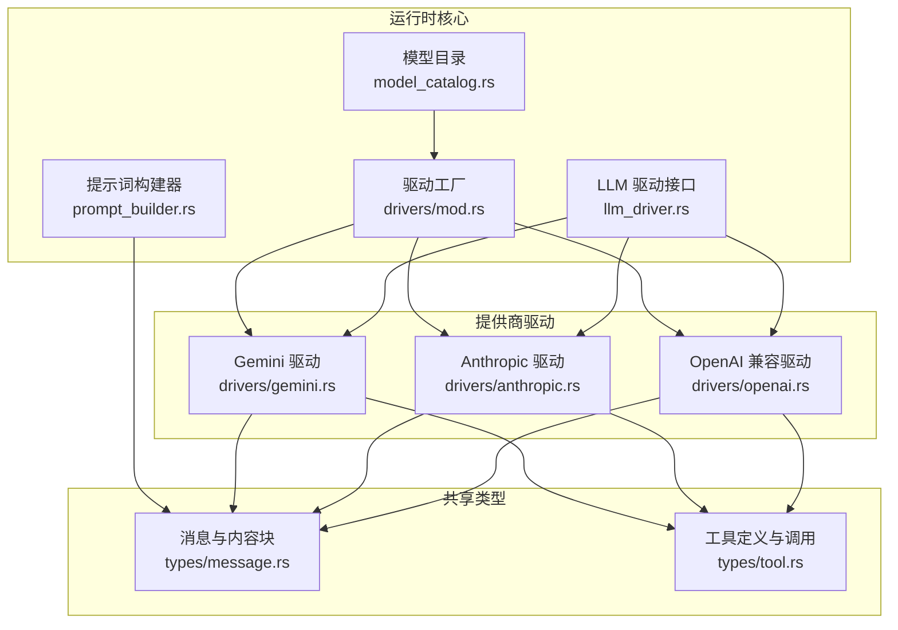
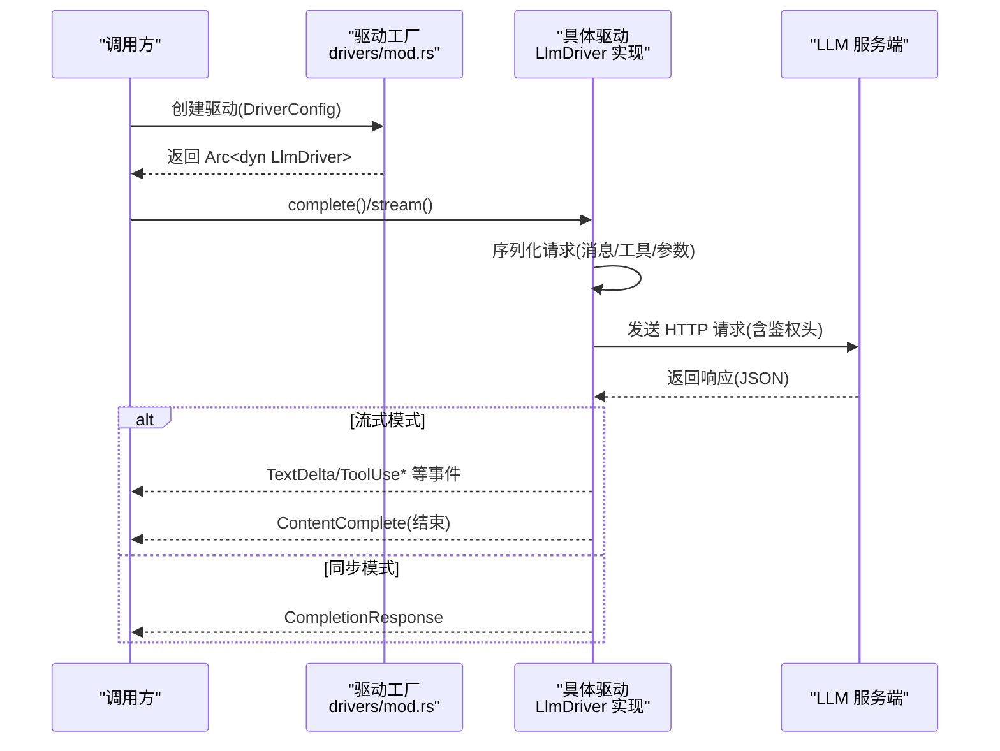
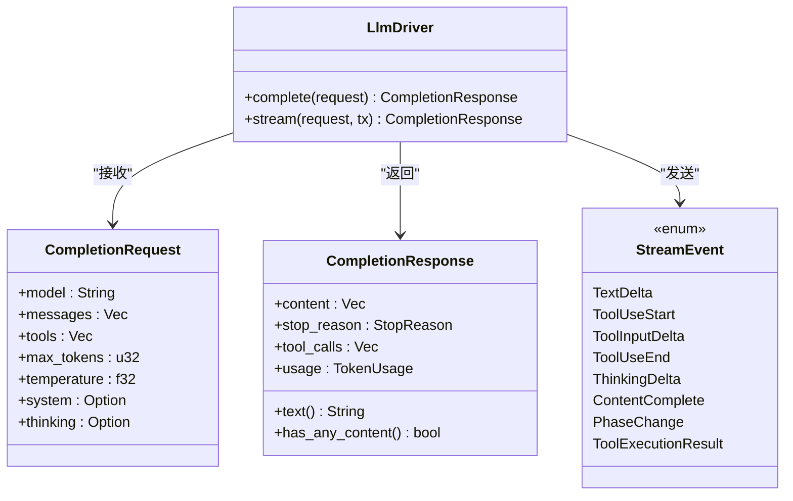
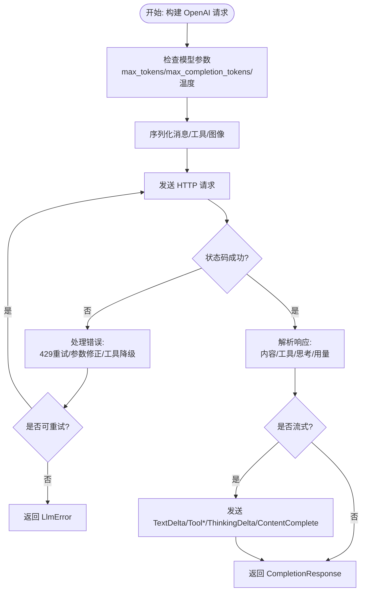
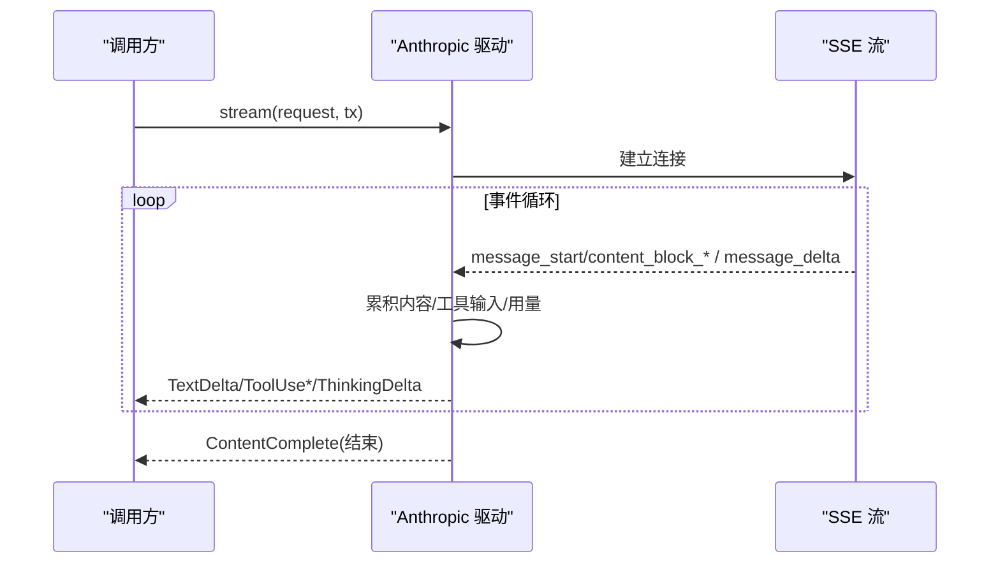
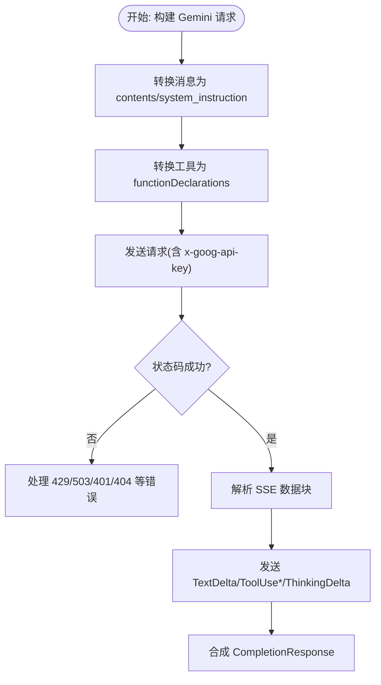
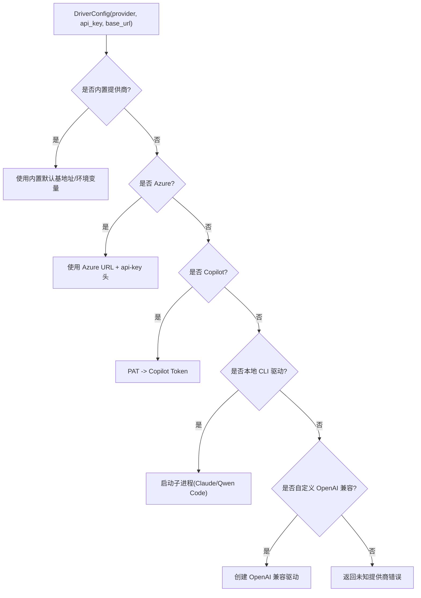
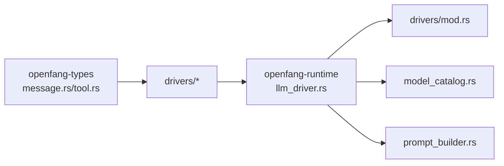

# LLM 驱动抽象

<cite>
**本文档引用的文件**
- [llm_driver.rs](file://crates/openfang-runtime/src/llm_driver.rs)
- [drivers/mod.rs](file://crates/openfang-runtime/src/drivers/mod.rs)
- [openai.rs](file://crates/openfang-runtime/src/drivers/openai.rs)
- [anthropic.rs](file://crates/openfang-runtime/src/drivers/anthropic.rs)
- [gemini.rs](file://crates/openfang-runtime/src/drivers/gemini.rs)
- [model_catalog.rs](file://crates/openfang-runtime/src/model_catalog.rs)
- [prompt_builder.rs](file://crates/openfang-runtime/src/prompt_builder.rs)
- [message.rs](file://crates/openfang-types/src/message.rs)
- [tool.rs](file://crates/openfang-types/src/tool.rs)
- [lib.rs](file://crates/openfang-runtime/src/lib.rs)
</cite>

## 目录
1. [简介](#简介)
2. [项目结构](#项目结构)
3. [核心组件](#核心组件)
4. [架构总览](#架构总览)
5. [详细组件分析](#详细组件分析)
6. [依赖关系分析](#依赖关系分析)
7. [性能考虑](#性能考虑)
8. [故障排除指南](#故障排除指南)
9. [结论](#结论)
10. [附录](#附录)

## 简介
本文件为 LLM 驱动抽象层的技术文档，系统性阐述统一接口设计、请求构建、响应解析与错误处理机制；深入对比 OpenAI、Anthropic、Gemini 主要提供商的适配实现与差异处理；提供新增 LLM 提供商的接入步骤、模型参数配置方法、流式响应实现要点；并说明与工具系统的集成关系及性能优化与成本控制策略。

## 项目结构
该模块位于 openfang-runtime 子工程中，采用“抽象接口 + 多提供商驱动”的分层设计：
- 抽象层：定义统一的 LLM 接口、消息与工具类型、流式事件等
- 驱动层：针对不同提供商的具体实现（OpenAI 兼容、Anthropic、Gemini 等）
- 工具与消息类型：在 openfang-types 中定义，跨模块共享
- 模型目录与提示词构建：提供模型注册、鉴权检测、系统提示词组装能力

图表来源
- [llm_driver.rs:1-327](file://crates/openfang-runtime/src/llm_driver.rs#L1-L327)
- [drivers/mod.rs:1-858](file://crates/openfang-runtime/src/drivers/mod.rs#L1-L858)
- [openai.rs:1-1834](file://crates/openfang-runtime/src/drivers/openai.rs#L1-L1834)
- [anthropic.rs:1-696](file://crates/openfang-runtime/src/drivers/anthropic.rs#L1-L696)
- [gemini.rs:1-1724](file://crates/openfang-runtime/src/drivers/gemini.rs#L1-L1724)
- [message.rs:1-341](file://crates/openfang-types/src/message.rs#L1-L341)
- [tool.rs:1-650](file://crates/openfang-types/src/tool.rs#L1-L650)

章节来源
- [lib.rs:1-59](file://crates/openfang-runtime/src/lib.rs#L1-L59)

## 核心组件
- 统一驱动接口与错误类型
  - 定义 CompletionRequest/CompletionResponse、流式事件 StreamEvent 以及 LlmDriver trait，支持同步完成与流式输出
  - 错误类型覆盖 HTTP、API、限流、解析、鉴权、模型不存在等场景
- 消息与工具类型
  - Message/ContentBlock 支持文本、图片、工具调用、工具结果、思考内容等多模态结构
  - ToolDefinition/ToolCall/ToolResult 规范化工具定义与调用结果
- 驱动工厂与提供商映射
  - 基于 DriverConfig 动态创建具体驱动，内置多家提供商默认基地址与鉴权键名
  - 支持自定义 OpenAI 兼容端点、Azure OpenAI、Copilot、本地推理服务等

章节来源
- [llm_driver.rs:1-327](file://crates/openfang-runtime/src/llm_driver.rs#L1-L327)
- [message.rs:1-341](file://crates/openfang-types/src/message.rs#L1-L341)
- [tool.rs:1-650](file://crates/openfang-types/src/tool.rs#L1-L650)
- [drivers/mod.rs:1-858](file://crates/openfang-runtime/src/drivers/mod.rs#L1-L858)

## 架构总览
统一接口通过 LlmDriver trait 抽象，具体提供商驱动实现各自的请求序列化、鉴权头设置、响应解析与流式事件发送。驱动工厂根据配置选择合适驱动，模型目录负责提供商鉴权状态检测与模型注册，提示词构建器负责生成系统提示词。

图表来源
- [drivers/mod.rs:233-456](file://crates/openfang-runtime/src/drivers/mod.rs#L233-L456)
- [llm_driver.rs:145-171](file://crates/openfang-runtime/src/llm_driver.rs#L145-L171)
- [openai.rs:266-745](file://crates/openfang-runtime/src/drivers/openai.rs#L266-L745)
- [anthropic.rs:155-553](file://crates/openfang-runtime/src/drivers/anthropic.rs#L155-L553)
- [gemini.rs:499-800](file://crates/openfang-runtime/src/drivers/gemini.rs#L499-L800)

## 详细组件分析

### 统一接口与数据模型
- CompletionRequest/CompletionResponse
  - 包含模型名、消息列表、可用工具、最大生成长度、采样温度、系统提示、思维配置等
  - CompletionResponse 提供 text() 与 has_any_content() 辅助方法
- StreamEvent
  - 文本增量、工具开始/输入增量/结束、思考增量、完整内容、阶段变化、工具执行结果等
- LlmDriver trait
  - complete(): 同步完成
  - stream(): 默认包装 complete() 并发送 TextDelta/ContentComplete 事件

图表来源
- [llm_driver.rs:51-171](file://crates/openfang-runtime/src/llm_driver.rs#L51-L171)
- [message.rs:5-231](file://crates/openfang-types/src/message.rs#L5-L231)
- [tool.rs:5-36](file://crates/openfang-types/src/tool.rs#L5-L36)

章节来源
- [llm_driver.rs:1-327](file://crates/openfang-runtime/src/llm_driver.rs#L1-L327)
- [message.rs:1-341](file://crates/openfang-types/src/message.rs#L1-L341)
- [tool.rs:1-650](file://crates/openfang-types/src/tool.rs#L1-L650)

### OpenAI 兼容驱动（含 Azure、本地推理）
- 关键特性
  - 支持标准 OpenAI 与 Azure OpenAI（部署路径 + api-version 查询参数）
  - 自动处理模型参数差异：max_tokens 与 max_completion_tokens 的切换、温度限制、Moonshot/Kimi 思维禁用等
  - 工具调用 schema 归一化（去除 $schema、$defs、anyOf/oneOf 等不被某些提供商支持的关键字）
  - 流式与非流式两种模式，自动恢复 Groq 失败的工具调用、按模型上限自动降级 max_tokens
- 错误处理
  - 429/529 重试退避；模型不支持工具时自动降级重试；温度/参数不兼容时自动修正
- 流式实现
  - 将增量文本、工具输入增量、思考增量转换为 StreamEvent 并发送

图表来源
- [openai.rs:109-745](file://crates/openfang-runtime/src/drivers/openai.rs#L109-L745)

章节来源
- [openai.rs:1-1834](file://crates/openfang-runtime/src/drivers/openai.rs#L1-L1834)

### Anthropic 驱动
- 关键特性
  - 使用 Messages API，系统提示从消息中提取或显式传入
  - 支持工具调用、图像、思考内容；流式解析 SSE，逐段发送事件
  - 对 429/529 进行重试退避
- 流式实现
  - 解析 message_start/content_block_* 系列事件，累积文本/思考/工具输入，最终合成 CompletionResponse

图表来源
- [anthropic.rs:262-553](file://crates/openfang-runtime/src/drivers/anthropic.rs#L262-L553)

章节来源
- [anthropic.rs:1-696](file://crates/openfang-runtime/src/drivers/anthropic.rs#L1-L696)

### Gemini 驱动
- 关键特性
  - 使用 generateContent API，模型在 URL 路径中，鉴权使用 x-goog-api-key
  - 系统提示通过 system_instruction 字段传递；工具以 functionDeclarations 形式声明
  - 支持思考内容（thoughtSignature）在多模态内容中的往返携带，确保后续请求兼容
- 流式实现
  - 解析 SSE 数据块，分别处理文本增量、函数调用增量与思考内容，最终合成 CompletionResponse

图表来源
- [gemini.rs:499-800](file://crates/openfang-runtime/src/drivers/gemini.rs#L499-L800)

章节来源
- [gemini.rs:1-1724](file://crates/openfang-runtime/src/drivers/gemini.rs#L1-L1724)

### 驱动工厂与提供商映射
- 工厂函数 create_driver
  - 内置多家提供商默认基地址与环境变量名；支持 Azure OpenAI 部署 URL、Copilot PAT 到 API Token 自动交换、本地 CLI 驱动（Claude/Qwen Code）
  - 自定义 OpenAI 兼容端点：若未指定 API Key，则尝试按 PROVIDER_API_KEY 环境变量推断
- 已知提供商清单
  - 包括 Anthropic、OpenAI、Groq、OpenRouter、DeepSeek、Together、Mistral、Fireworks、Ollama、vLLM、LM Studio、Perplexity、Cohere、AI21、Cerebras、SambaNova、HuggingFace、xAI、Replicate、GitHub Copilot、Moonshot、Qwen、MiniMax、Zhipu、Z.AI、Kimi 编程版、百度千帆、火山引擎、Chutes.ai、Venice.ai、NVIDIA NIM、Azure OpenAI、OpenAI Codex、Claude Code、Qwen Code 等

图表来源
- [drivers/mod.rs:233-456](file://crates/openfang-runtime/src/drivers/mod.rs#L233-L456)

章节来源
- [drivers/mod.rs:1-858](file://crates/openfang-runtime/src/drivers/mod.rs#L1-L858)

### 模型目录与提供商鉴权
- 模型目录 ModelCatalog
  - 注册 130+ 模型与 28 家提供商信息，支持别名解析、计数统计、价格查询
  - 自动检测各提供商鉴权状态（检查环境变量与特殊 CLI 可用性），并支持动态合并本地发现的模型
- 提示词构建器 PromptBuilder
  - 将多源上下文（工具、记忆、技能、MCP、身份、通道、心跳等）有序拼装为系统提示词，支持子代理模式下的节选

章节来源
- [model_catalog.rs:1-800](file://crates/openfang-runtime/src/model_catalog.rs#L1-L800)
- [prompt_builder.rs:1-800](file://crates/openfang-runtime/src/prompt_builder.rs#L1-L800)

## 依赖关系分析
- 模块耦合
  - 驱动实现依赖 openfang-types 的消息与工具类型，确保跨提供商的数据结构一致性
  - 驱动工厂集中管理提供商映射与鉴权逻辑，降低上层调用复杂度
- 外部依赖
  - HTTP 客户端（reqwest）、JSON 序列化（serde）、异步通道（tokio mpsc）、日志（tracing）
- 循环依赖
  - 无直接循环；驱动工厂与驱动实现通过 trait 解耦

图表来源
- [drivers/mod.rs:1-858](file://crates/openfang-runtime/src/drivers/mod.rs#L1-L858)
- [llm_driver.rs:1-327](file://crates/openfang-runtime/src/llm_driver.rs#L1-L327)
- [message.rs:1-341](file://crates/openfang-types/src/message.rs#L1-L341)
- [tool.rs:1-650](file://crates/openfang-types/src/tool.rs#L1-L650)
- [model_catalog.rs:1-800](file://crates/openfang-runtime/src/model_catalog.rs#L1-L800)
- [prompt_builder.rs:1-800](file://crates/openfang-runtime/src/prompt_builder.rs#L1-L800)

## 性能考虑
- 请求批量化与并发
  - 在上层工作流中合理组织工具调用批次，减少往返次数
- 流式响应
  - 优先使用流式接口，尽早感知文本增量与工具输入，改善用户体验
- 参数优化
  - 根据模型能力选择 max_tokens 与 max_completion_tokens；对不支持温度的模型避免发送温度参数
  - 合理设置 temperature，平衡创造性与稳定性
- 重试与退避
  - 遵循驱动内部的指数退避策略，避免雪崩效应
- 成本控制
  - 使用模型目录的价格查询功能估算成本；在高成本模型失败时自动降级到低成本模型
  - 控制上下文长度，利用提示词构建器的截断与摘要能力

## 故障排除指南
- 常见错误与处理
  - 缺少 API Key：检查环境变量或显式配置；Azure 需要 base_url
  - 429/529：驱动已内置重试；如持续出现，检查速率限制与配额
  - 模型不支持工具：驱动会自动降级重试；必要时调整工具 schema 或更换模型
  - 温度参数不被接受：对特定模型（如 o 系列、Reasoning 模型）自动移除温度字段
  - 最大生成长度受限：对部分模型（如 Groq）自动按模型上限下调
- 调试建议
  - 开启调试日志，观察请求 URL、状态码与响应体
  - 使用最小复现请求，逐步加入工具与长上下文定位问题
  - 检查消息与工具 schema 的跨提供商兼容性（参考 schema 归一化）

章节来源
- [openai.rs:474-745](file://crates/openfang-runtime/src/drivers/openai.rs#L474-L745)
- [anthropic.rs:201-260](file://crates/openfang-runtime/src/drivers/anthropic.rs#L201-L260)
- [gemini.rs:515-581](file://crates/openfang-runtime/src/drivers/gemini.rs#L515-L581)

## 结论
本抽象层通过统一接口与完善的错误处理、流式支持、跨提供商适配，有效屏蔽了不同 LLM 提供商的差异，同时保留了灵活扩展能力。结合模型目录与提示词构建器，可在保证质量的同时提升性能与成本可控性。

## 附录

### 如何添加新的 LLM 提供商
- 步骤概览
  - 在驱动目录新增驱动文件，实现 LlmDriver trait（complete/stream）
  - 在驱动工厂中注册提供商名称、默认基地址、环境变量名与鉴权方式
  - 若为 OpenAI 兼容，尽量遵循现有序列化与参数归一化策略
  - 在模型目录中补充提供商信息与鉴权检测逻辑
- 参考路径
  - 新增驱动：[drivers/mod.rs:1-858](file://crates/openfang-runtime/src/drivers/mod.rs#L1-L858)
  - OpenAI 兼容实现参考：[openai.rs:1-1834](file://crates/openfang-runtime/src/drivers/openai.rs#L1-L1834)
  - Anthropic 实现参考：[anthropic.rs:1-696](file://crates/openfang-runtime/src/drivers/anthropic.rs#L1-L696)
  - Gemini 实现参考：[gemini.rs:1-1724](file://crates/openfang-runtime/src/drivers/gemini.rs#L1-L1724)

### 配置模型参数与工具
- 模型参数
  - 在 CompletionRequest 中设置 model、max_tokens、temperature、system 等
  - 对于需要 max_completion_tokens 的模型，驱动会自动切换字段
- 工具定义
  - 使用 ToolDefinition 描述工具输入 schema；驱动会按提供商进行 schema 归一化
  - 工具调用结果以 ToolResult 回传给模型，作为下一轮消息的一部分

章节来源
- [llm_driver.rs:51-81](file://crates/openfang-runtime/src/llm_driver.rs#L51-L81)
- [tool.rs:38-173](file://crates/openfang-types/src/tool.rs#L38-L173)

### 实现流式响应
- 在调用 stream() 时传入 tokio mpsc 通道，驱动将按事件推送：
  - 文本增量、工具输入增量、思考增量、工具结束、内容完成、阶段变化、工具执行结果
- 注意事项
  - 流式模式下，务必消费通道事件，避免阻塞
  - 对于不支持流式的提供商，驱动会回退到一次性 complete() 并模拟事件

章节来源
- [llm_driver.rs:109-171](file://crates/openfang-runtime/src/llm_driver.rs#L109-L171)
- [openai.rs:747-800](file://crates/openfang-runtime/src/drivers/openai.rs#L747-L800)
- [anthropic.rs:262-553](file://crates/openfang-runtime/src/drivers/anthropic.rs#L262-L553)
- [gemini.rs:583-800](file://crates/openfang-runtime/src/drivers/gemini.rs#L583-L800)