# OpenAI 驱动实现

<cite>
**本文档引用的文件**
- [openai.rs](file://crates/openfang-runtime/src/drivers/openai.rs)
- [openai_compat.rs](file://crates/openfang-api/src/openai_compat.rs)
- [llm_driver.rs](file://crates/openfang-runtime/src/llm_driver.rs)
- [mod.rs](file://crates/openfang-runtime/src/drivers/mod.rs)
- [tool.rs](file://crates/openfang-types/src/tool.rs)
- [tool_runner.rs](file://crates/openfang-runtime/src/tool_runner.rs)
- [context_budget.rs](file://crates/openfang-runtime/src/context_budget.rs)
- [model_catalog.rs](file://crates/openfang-runtime/src/model_catalog.rs)
- [config.rs](file://crates/openfang-types/src/config.rs)
- [agent_loop.rs](file://crates/openfang-runtime/src/agent_loop.rs)
</cite>

## 目录
1. [简介](#简介)
2. [项目结构](#项目结构)
3. [核心组件](#核心组件)
4. [架构概览](#架构概览)
5. [详细组件分析](#详细组件分析)
6. [依赖关系分析](#依赖关系分析)
7. [性能考虑](#性能考虑)
8. [故障排除指南](#故障排除指南)
9. [结论](#结论)

## 简介

OpenFang 的 OpenAI 驱动实现是一个完整的 OpenAI 兼容 API 适配层，提供了对多种 LLM 提供商的统一抽象。该实现不仅支持标准的 OpenAI API，还特别集成了 Azure OpenAI、Codex 以及各种本地推理引擎（如 Ollama、vLLM）。

该驱动系统的核心特性包括：
- **多提供商兼容性**：支持 OpenAI、Azure OpenAI、Groq、Ollama、vLLM 等 30+ 个提供商
- **智能请求构建**：根据模型特性和提供商要求动态调整请求参数
- **流式处理支持**：完整的 SSE 流式响应处理机制
- **工具集成**：原生支持函数调用和工具执行
- **成本优化**：智能上下文管理和成本控制策略
- **错误处理**：完善的重试机制和错误恢复策略

## 项目结构

OpenFang 项目采用模块化架构，OpenAI 驱动相关的代码主要分布在以下模块中：

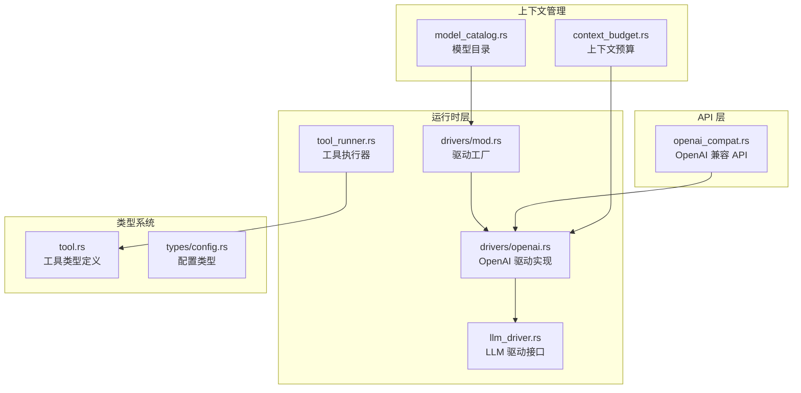

**图表来源**
- [openai.rs:1-100](file://crates/openfang-runtime/src/drivers/openai.rs#L1-L100)
- [openai_compat.rs:1-50](file://crates/openfang-api/src/openai_compat.rs#L1-L50)
- [llm_driver.rs:1-50](file://crates/openfang-runtime/src/llm_driver.rs#L1-L50)

**章节来源**
- [openai.rs:1-100](file://crates/openfang-runtime/src/drivers/openai.rs#L1-L100)
- [openai_compat.rs:1-50](file://crates/openfang-api/src/openai_compat.rs#L1-L50)
- [llm_driver.rs:1-50](file://crates/openfang-runtime/src/llm_driver.rs#L1-L50)

## 核心组件

### OpenAI 驱动核心类

OpenAI 驱动是整个系统的核心组件，实现了 LLM 驱动接口并提供了完整的 OpenAI 兼容功能：

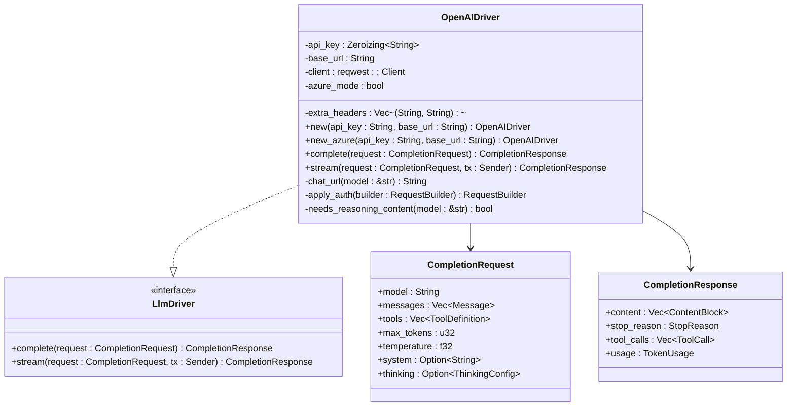

**图表来源**
- [openai.rs:18-26](file://crates/openfang-runtime/src/drivers/openai.rs#L18-L26)
- [llm_driver.rs:52-81](file://crates/openfang-runtime/src/llm_driver.rs#L52-L81)

### 请求构建器组件

驱动实现了智能的请求构建逻辑，能够根据不同的模型和提供商特性自动调整请求参数：

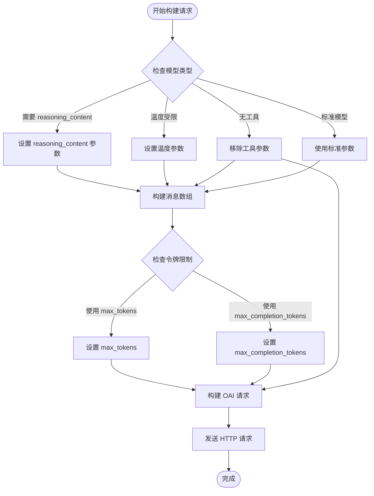

**图表来源**
- [openai.rs:443-472](file://crates/openfang-runtime/src/drivers/openai.rs#L443-L472)
- [openai.rs:899-927](file://crates/openfang-runtime/src/drivers/openai.rs#L899-L927)

**章节来源**
- [openai.rs:18-107](file://crates/openfang-runtime/src/drivers/openai.rs#L18-L107)
- [llm_driver.rs:52-81](file://crates/openfang-runtime/src/llm_driver.rs#L52-L81)

## 架构概览

OpenFang 的 OpenAI 驱动架构采用了分层设计，确保了高度的可扩展性和维护性：

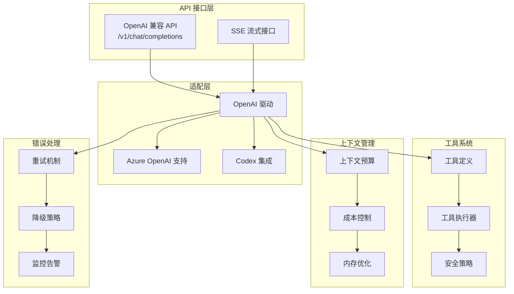

**图表来源**
- [openai_compat.rs:246-367](file://crates/openfang-api/src/openai_compat.rs#L246-L367)
- [openai.rs:267-745](file://crates/openfang-runtime/src/drivers/openai.rs#L267-L745)
- [tool_runner.rs:99-526](file://crates/openfang-runtime/src/tool_runner.rs#L99-L526)

## 详细组件分析

### OpenAI 兼容 API 适配层

OpenAI 兼容 API 适配层提供了标准的 OpenAI API 接口，允许任何 OpenAI 兼容的客户端库直接与 OpenFang 代理交互：

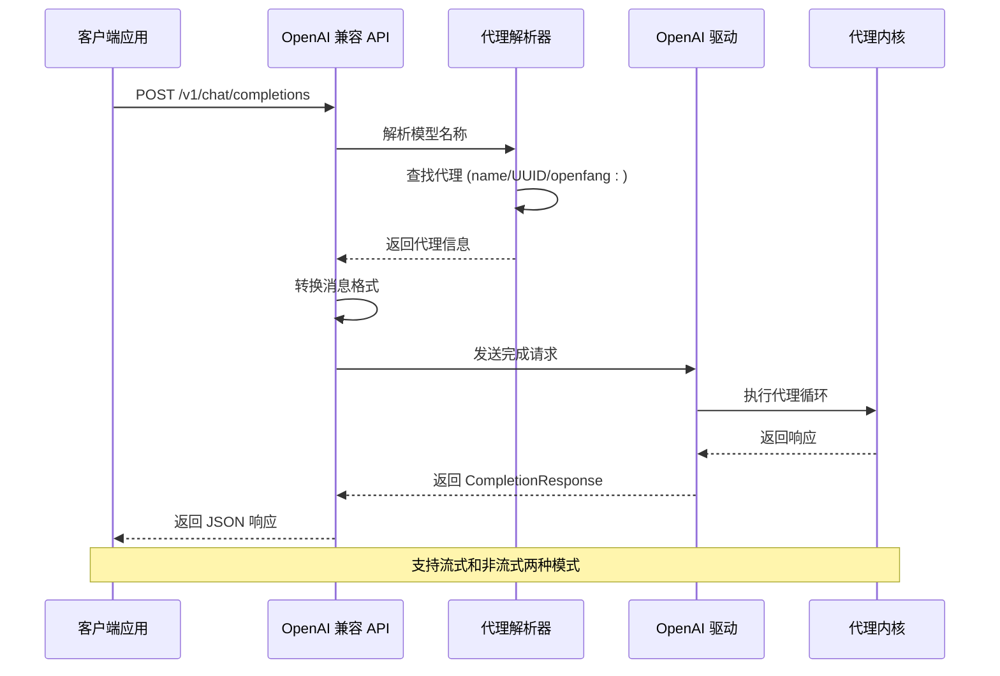

**图表来源**
- [openai_compat.rs:246-367](file://crates/openfang-api/src/openai_compat.rs#L246-L367)
- [openai_compat.rs:370-532](file://crates/openfang-api/src/openai_compat.rs#L370-L532)

#### 消息转换机制

适配层实现了双向的消息转换机制，确保与 OpenAI API 格式的完全兼容：

| OpenAI 兼容 API | OpenFang 内部格式 | 功能说明 |
|----------------|------------------|----------|
| `{"role": "user", "content": "text"}` | `Message { role: User, content: Text }` | 文本消息 |
| `{"role": "user", "content": [{"type": "text", "text": "..."}]}` | `Message { role: User, content: Blocks }` | 多模态文本 |
| `{"role": "user", "content": [{"type": "image_url", "image_url": {"url": "data:..."}}]}` | `Message { role: User, content: Image }` | 图像输入 |

**章节来源**
- [openai_compat.rs:188-241](file://crates/openfang-api/src/openai_compat.rs#L188-L241)
- [openai_compat.rs:26-64](file://crates/openfang-api/src/openai_compat.rs#L26-L64)

### Azure OpenAI 特殊支持

Azure OpenAI 驱动实现了特殊的 URL 格式和认证机制：

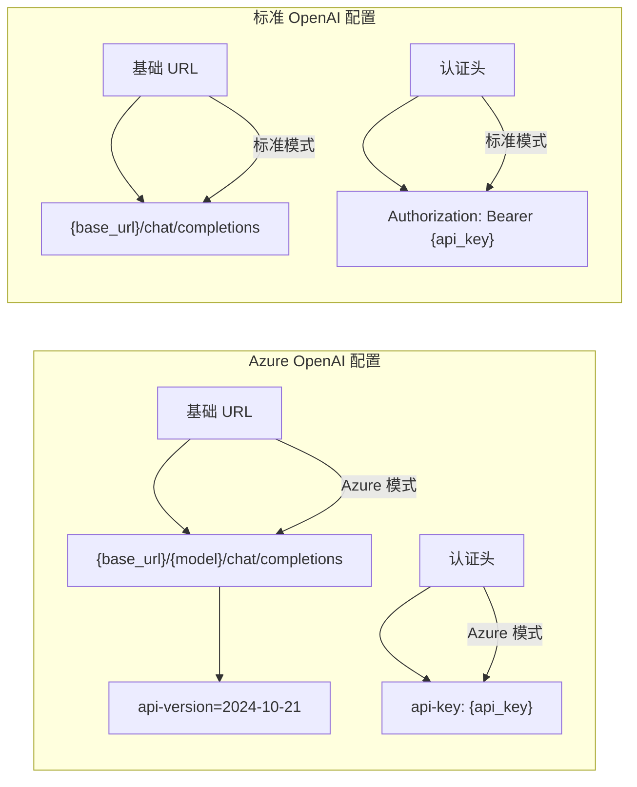

**图表来源**
- [openai.rs:78-106](file://crates/openfang-runtime/src/drivers/openai.rs#L78-L106)
- [openai.rs:15-16](file://crates/openfang-runtime/src/drivers/openai.rs#L15-L16)

#### Azure 驱动配置示例

Azure OpenAI 驱动的创建和配置过程如下：

1. **基础 URL 设置**：`https://{resource}.openai.azure.com/openai/deployments`
2. **模型部署**：在 URL 后添加具体的模型部署名称
3. **API 版本**：固定使用 `2024-10-21` 版本
4. **认证方式**：使用 `api-key` 头而不是 `Authorization: Bearer`

**章节来源**
- [openai.rs:48-59](file://crates/openfang-runtime/src/drivers/openai.rs#L48-L59)
- [openai.rs:1798-1833](file://crates/openfang-runtime/src/drivers/openai.rs#L1798-L1833)

### Codex 集成

Codex 集成功实现了与 GitHub Codex CLI 的无缝集成，提供了一致的 OpenAI 兼容体验：

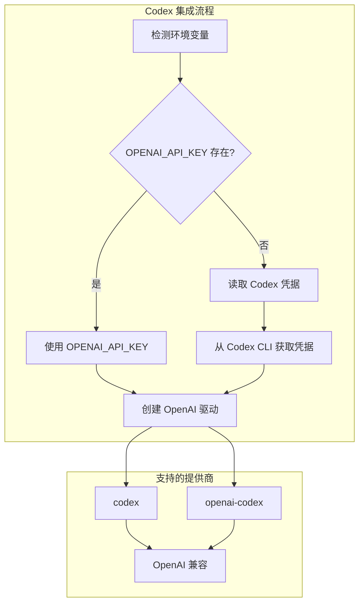

**图表来源**
- [mod.rs:296-310](file://crates/openfang-runtime/src/drivers/mod.rs#L296-L310)

#### Codex 驱动创建过程

Codex 驱动的创建过程体现了 OpenFang 的灵活性设计：

1. **优先级检查**：首先检查 `OPENAI_API_KEY` 环境变量
2. **后备方案**：如果主密钥不存在，尝试从 Codex CLI 读取凭据
3. **统一接口**：无论使用哪种凭据源，都创建相同的 OpenAI 驱动实例
4. **无缝切换**：应用程序无需修改即可在不同凭据源之间切换

**章节来源**
- [mod.rs:296-310](file://crates/openfang-runtime/src/drivers/mod.rs#L296-L310)

### 流式处理机制

OpenAI 驱动实现了完整的流式处理机制，支持实时的增量响应：

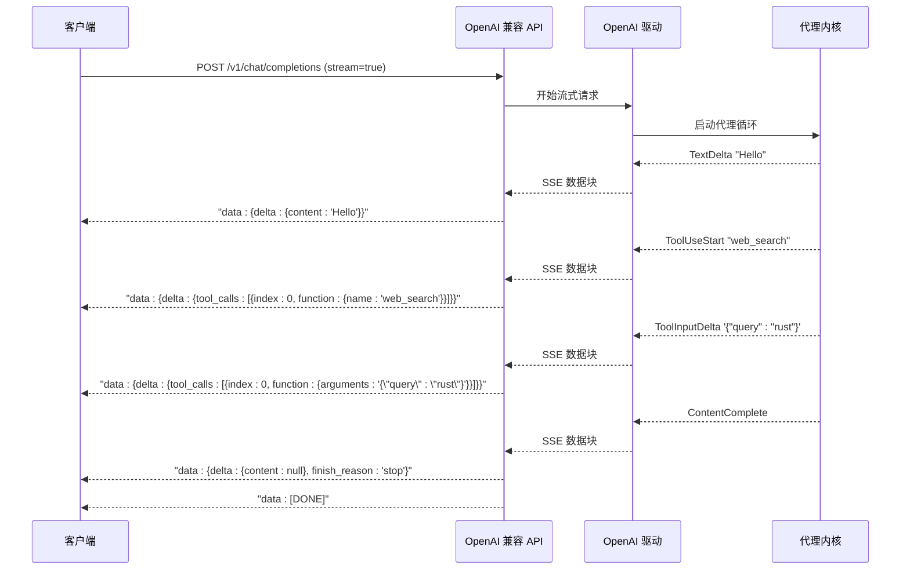

**图表来源**
- [openai_compat.rs:370-532](file://crates/openfang-api/src/openai_compat.rs#L370-L532)
- [openai_compat.rs:437-510](file://crates/openfang-api/src/openai_compat.rs#L437-L510)

#### 流式事件类型

流式处理支持多种事件类型，每种都有特定的用途：

| 事件类型 | 触发时机 | 数据内容 | 用途 |
|----------|----------|----------|------|
| `TextDelta` | 文本生成增量 | 新增的文本内容 | 实时显示生成结果 |
| `ToolUseStart` | 工具调用开始 | 工具名称和 ID | 显示工具调用开始 |
| `ToolInputDelta` | 工具参数增量 | JSON 参数的增量部分 | 实时显示工具参数 |
| `ContentComplete` | 内容生成完成 | 停止原因和用量统计 | 结束流式传输 |

**章节来源**
- [openai_compat.rs:437-510](file://crates/openfang-api/src/openai_compat.rs#L437-L510)
- [llm_driver.rs:110-143](file://crates/openfang-runtime/src/llm_driver.rs#L110-L143)

### 错误处理和重试机制

OpenAI 驱动实现了多层次的错误处理和重试机制：

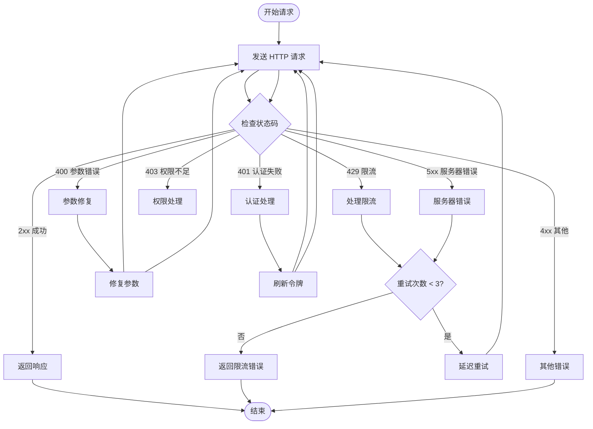

**图表来源**
- [openai.rs:474-745](file://crates/openfang-runtime/src/drivers/openai.rs#L474-L745)

#### 自动参数修复

驱动实现了智能的参数修复机制，能够自动处理不同模型的特殊要求：

| 错误场景 | 检测逻辑 | 修复策略 | 示例 |
|----------|----------|----------|------|
| `temperature` 参数不支持 | 检查错误消息包含 "temperature" 和 "unsupported_parameter" | 移除温度参数或设置为默认值 | `temperature_must_be_one` 模型 |
| `max_tokens` 参数不支持 | 检查错误消息包含 "max_tokens" | 切换到 `max_completion_tokens` | `uses_completion_tokens` 模型 |
| 工具调用不支持 | 检查错误消息包含 "tools" 或 "not supported" | 移除工具参数重试 | `GLM-5` 等模型 |
| 令牌数超出限制 | 解析错误消息中的限制值 | 将令牌数减半重试 | `Groq Maverick` 限制 8192 |

**章节来源**
- [openai.rs:527-594](file://crates/openfang-runtime/src/drivers/openai.rs#L527-L594)

### 工具系统集成

OpenAI 驱动与工具系统的集成提供了强大的函数调用能力：

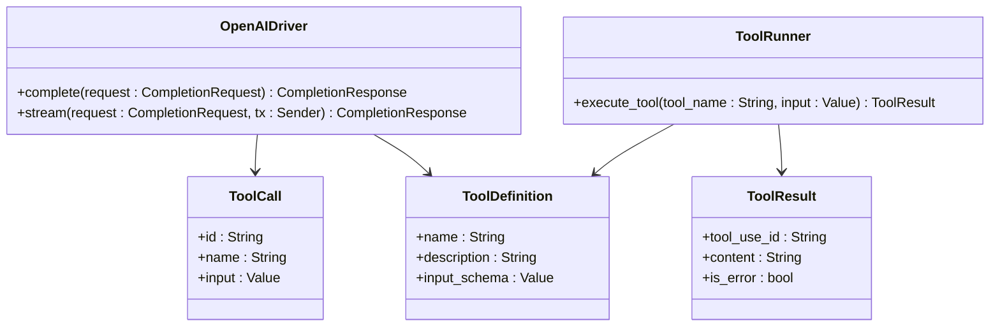

**图表来源**
- [tool.rs:6-25](file://crates/openfang-types/src/tool.rs#L6-L25)
- [tool_runner.rs:99-526](file://crates/openfang-runtime/src/tool_runner.rs#L99-L526)

#### 工具调用流程

工具调用的完整流程包括请求生成、执行和结果处理：

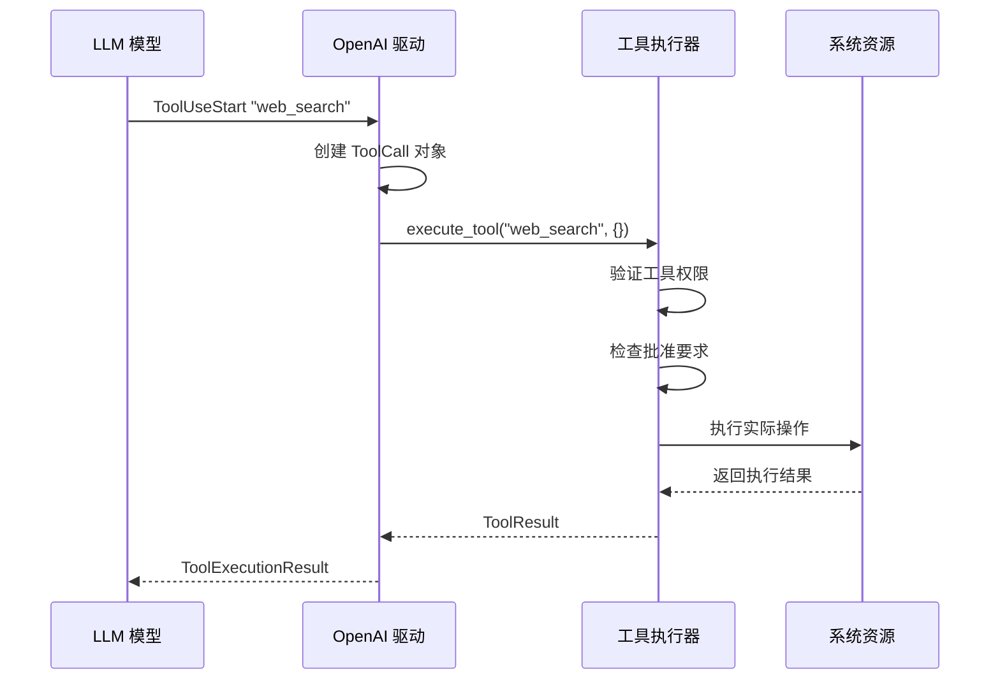

**图表来源**
- [tool_runner.rs:99-526](file://crates/openfang-runtime/src/tool_runner.rs#L99-L526)

**章节来源**
- [tool.rs:6-25](file://crates/openfang-types/src/tool.rs#L6-L25)
- [tool_runner.rs:99-526](file://crates/openfang-runtime/src/tool_runner.rs#L99-L526)

## 依赖关系分析

OpenAI 驱动的依赖关系展现了清晰的分层架构：

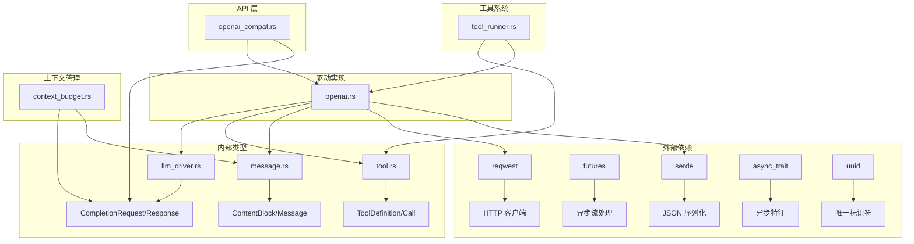

**图表来源**
- [openai.rs:5-13](file://crates/openfang-runtime/src/drivers/openai.rs#L5-L13)
- [openai_compat.rs:9-22](file://crates/openfang-api/src/openai_compat.rs#L9-L22)

### 关键依赖特性

| 依赖库 | 用途 | 版本要求 | 安全考虑 |
|--------|------|----------|----------|
| `reqwest` | HTTP 客户端 | ^0.11 | TLS 1.2+，超时配置 |
| `futures` | 异步流处理 | ^0.3 | 内存泄漏防护 |
| `serde` | JSON 序列化 | ^1.0 | 输入验证，拒绝恶意数据 |
| `async_trait` | 异步特征 | ^0.1 | 编译时检查 |
| `uuid` | 唯一标识符 | ^1.0 | 随机性保证 |

**章节来源**
- [openai.rs:5-13](file://crates/openfang-runtime/src/drivers/openai.rs#L5-L13)
- [openai_compat.rs:9-22](file://crates/openfang-api/src/openai_compat.rs#L9-L22)

## 性能考虑

OpenAI 驱动在性能方面采用了多项优化策略：

### 上下文预算管理

系统实现了智能的上下文预算管理，确保在有限的上下文窗口内最大化信息密度：

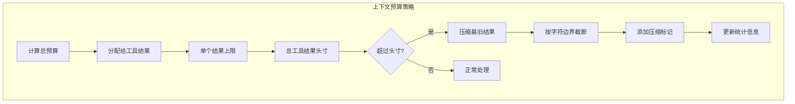

**图表来源**
- [context_budget.rs:100-198](file://crates/openfang-runtime/src/context_budget.rs#L100-L198)

#### 预算参数配置

| 参数 | 默认值 | 说明 | 影响范围 |
|------|--------|------|----------|
| `tool_chars_per_token` | 2.0 | 工具结果字符密度估算 | 单个结果上限计算 |
| `general_chars_per_token` | 4.0 | 一般内容字符密度估算 | 总体预算计算 |
| `per_result_cap` | 30% × 上下文窗口 | 单个工具结果最大字符数 | 防止溢出 |
| `single_result_max` | 50% × 上下文窗口 | 单个结果绝对最大值 | 强制截断阈值 |
| `total_tool_headroom` | 75% × 上下文窗口 | 工具结果总头寸 | 整体预算控制 |

**章节来源**
- [context_budget.rs:23-50](file://crates/openfang-runtime/src/context_budget.rs#L23-L50)
- [context_budget.rs:100-198](file://crates/openfang-runtime/src/context_budget.rs#L100-L198)

### 连接池和并发控制

驱动实现了高效的连接池管理和并发控制：

| 特性 | 实现方式 | 性能收益 |
|------|----------|----------|
| 连接复用 | `reqwest::Client` | 减少 TCP 握手开销 |
| 超时控制 | 30 秒请求超时 | 防止连接泄漏 |
| 并发限制 | 64 通道缓冲区 | 控制内存使用 |
| 重试退避 | 指数退避算法 | 避免雪崩效应 |

## 故障排除指南

### 常见问题诊断

#### 认证相关问题

| 问题症状 | 可能原因 | 解决方案 |
|----------|----------|----------|
| `401 Unauthorized` | API 密钥无效 | 检查环境变量或配置文件 |
| `403 Forbidden` | 权限不足 | 验证账户状态和配额 |
| `400 Invalid API Key` | 密钥格式错误 | 确认密钥长度和字符集 |
| `Missing API key` | 未设置密钥 | 检查 `OPENAI_API_KEY` 环境变量 |

#### 网络连接问题

| 问题症状 | 可能原因 | 解决方案 |
|----------|----------|----------|
| `Connect timeout` | 网络延迟过高 | 检查防火墙设置和网络质量 |
| `Read timeout` | 服务器响应慢 | 增加超时时间或选择更近的区域 |
| `TLS handshake error` | SSL 证书问题 | 更新系统证书或使用代理 |
| `Too many requests` | 速率限制触发 | 实现指数退避重试 |

#### 模型兼容性问题

| 问题症状 | 可能原因 | 解决方案 |
|----------|----------|----------|
| `unsupported_parameter` | 参数不被模型支持 | 使用 `rejects_temperature` 检测逻辑 |
| `max_tokens not supported` | 令牌限制参数错误 | 切换到 `max_completion_tokens` |
| `tools not supported` | 模型不支持函数调用 | 移除工具参数重试 |
| `temperature must be 1` | 特定模型限制 | 设置 `temperature_must_be_one` |

**章节来源**
- [openai.rs:527-594](file://crates/openfang-runtime/src/drivers/openai.rs#L527-L594)
- [agent_loop.rs:1140-1168](file://crates/openfang-runtime/src/agent_loop.rs#L1140-L1168)

### 调试和监控

系统提供了全面的调试和监控功能：

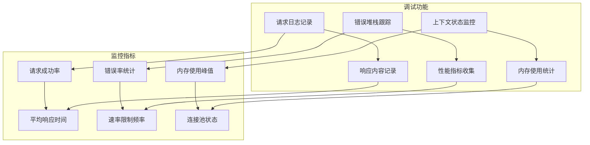

**图表来源**
- [openai.rs:474-745](file://crates/openfang-runtime/src/drivers/openai.rs#L474-L745)

## 结论

OpenFang 的 OpenAI 驱动实现展现了现代 LLM 集成系统的最佳实践。通过精心设计的架构和全面的功能覆盖，该系统为开发者提供了强大而灵活的工具来集成各种 LLM 提供商。

### 主要优势

1. **高度兼容性**：支持 30+ 个 LLM 提供商，涵盖云端和本地推理引擎
2. **智能适配**：自动处理不同提供商的特殊要求和限制
3. **流式处理**：完整的 SSE 流式响应支持，提供优秀的用户体验
4. **工具集成**：原生支持函数调用和工具执行，扩展性强
5. **成本优化**：智能上下文管理和预算控制，有效控制使用成本
6. **错误处理**：完善的重试机制和错误恢复策略

### 技术特色

- **模块化设计**：清晰的分层架构，便于维护和扩展
- **类型安全**：完整的 Rust 类型系统保证运行时安全
- **异步处理**：基于 Tokio 的高性能异步架构
- **配置灵活**：支持环境变量、配置文件和运行时参数
- **监控完备**：内置日志记录和性能监控功能

该实现为构建企业级 AI 应用程序提供了坚实的基础，无论是开发聊天机器人、智能助手还是复杂的 AI 工作流，都能提供可靠的支撑。