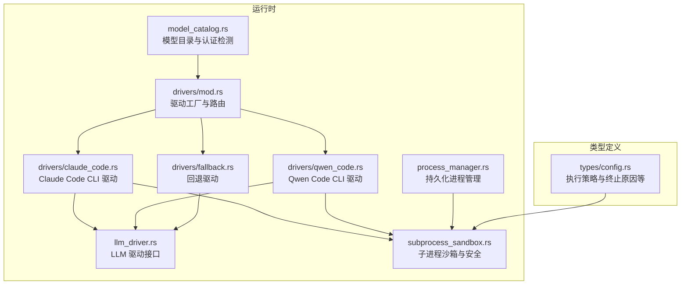
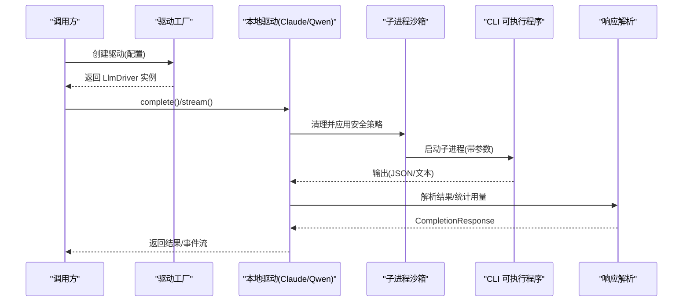
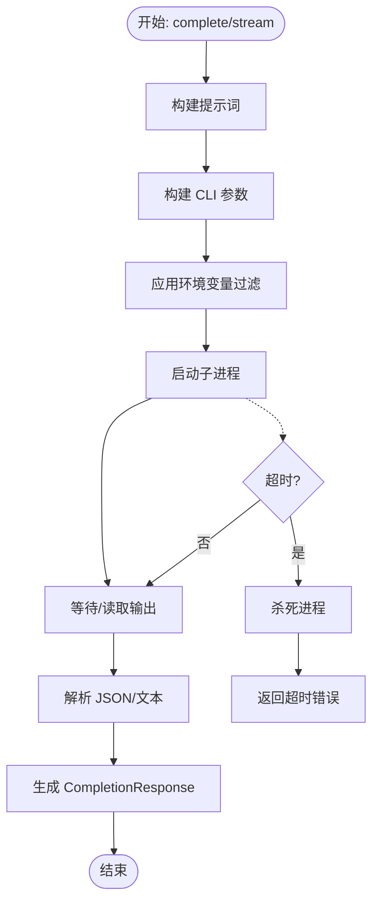
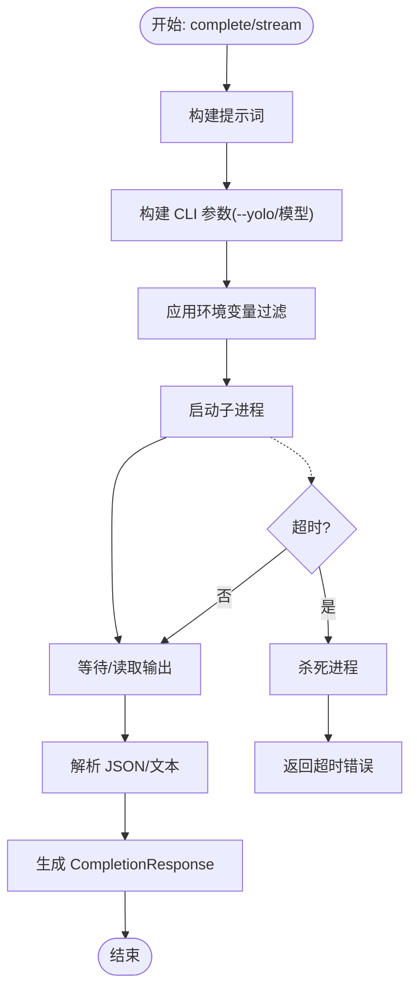
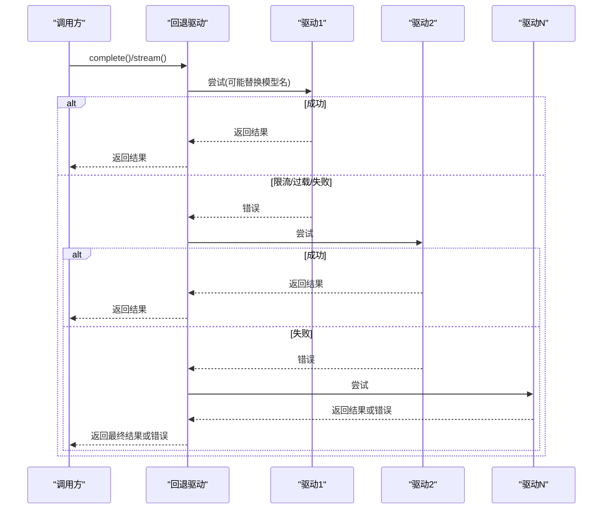
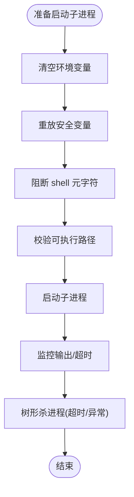
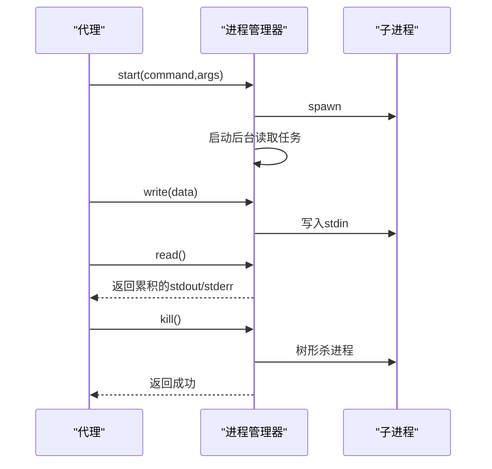
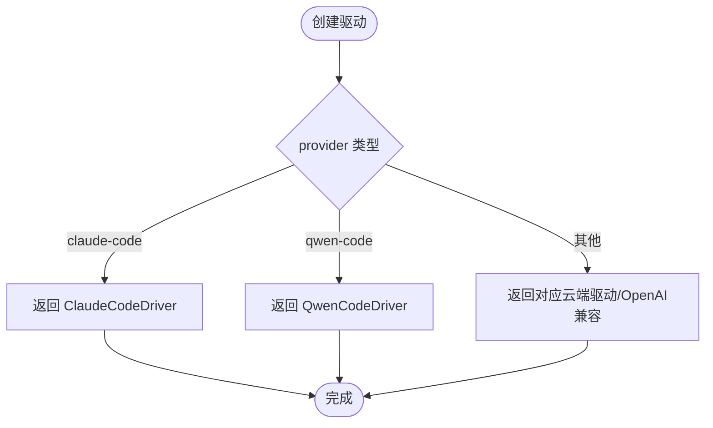
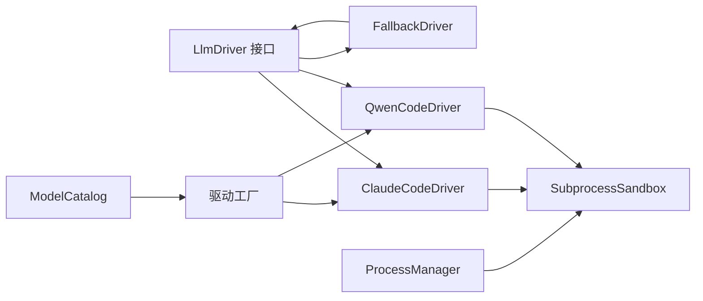

# 本地推理驱动实现

<cite>
**本文档引用的文件**
- [drivers/mod.rs](file://crates/openfang-runtime/src/drivers/mod.rs)
- [claude_code.rs](file://crates/openfang-runtime/src/drivers/claude_code.rs)
- [qwen_code.rs](file://crates/openfang-runtime/src/drivers/qwen_code.rs)
- [fallback.rs](file://crates/openfang-runtime/src/drivers/fallback.rs)
- [llm_driver.rs](file://crates/openfang-runtime/src/llm_driver.rs)
- [subprocess_sandbox.rs](file://crates/openfang-runtime/src/subprocess_sandbox.rs)
- [process_manager.rs](file://crates/openfang-runtime/src/process_manager.rs)
- [model_catalog.rs](file://crates/openfang-runtime/src/model_catalog.rs)
- [config.rs](file://crates/openfang-types/src/config.rs)
</cite>

## 目录
1. [简介](#简介)
2. [项目结构](#项目结构)
3. [核心组件](#核心组件)
4. [架构总览](#架构总览)
5. [详细组件分析](#详细组件分析)
6. [依赖关系分析](#依赖关系分析)
7. [性能考虑](#性能考虑)
8. [故障排除指南](#故障排除指南)
9. [结论](#结论)
10. [附录](#附录)

## 简介
本技术文档聚焦于本地推理驱动的实现，涵盖 Claude Code CLI、Qwen Code CLI 以及回退驱动的设计与实现机制。重点解释子进程管理、权限处理与安全隔离策略，并提供配置本地模型路径、命令行参数处理与进程间通信的具体示例路径。同时总结本地部署的优势、限制与常见问题排查方法，帮助开发者在生产环境中稳定使用本地推理能力。

## 项目结构
本地推理驱动位于运行时模块中，通过统一的 LLM 驱动接口对外提供能力，内部按供应商拆分为多个驱动实现，并辅以通用的安全隔离与进程管理工具。

图表来源
- [drivers/mod.rs:257-328](file://crates/openfang-runtime/src/drivers/mod.rs#L257-L328)
- [claude_code.rs:1-720](file://crates/openfang-runtime/src/drivers/claude_code.rs#L1-L720)
- [qwen_code.rs:1-590](file://crates/openfang-runtime/src/drivers/qwen_code.rs#L1-L590)
- [fallback.rs:1-249](file://crates/openfang-runtime/src/drivers/fallback.rs#L1-L249)
- [llm_driver.rs:1-327](file://crates/openfang-runtime/src/llm_driver.rs#L1-L327)
- [subprocess_sandbox.rs:1-906](file://crates/openfang-runtime/src/subprocess_sandbox.rs#L1-L906)
- [process_manager.rs:1-334](file://crates/openfang-runtime/src/process_manager.rs#L1-L334)
- [model_catalog.rs:1-800](file://crates/openfang-runtime/src/model_catalog.rs#L1-L800)
- [config.rs:800-860](file://crates/openfang-types/src/config.rs#L800-L860)

章节来源
- [drivers/mod.rs:1-858](file://crates/openfang-runtime/src/drivers/mod.rs#L1-L858)
- [llm_driver.rs:1-327](file://crates/openfang-runtime/src/llm_driver.rs#L1-L327)

## 核心组件
- 驱动工厂：根据配置选择 Claude Code、Qwen Code 或其他驱动，支持回退链路。
- Claude Code 驱动：封装 claude CLI 子进程，非交互模式运行，自动过滤敏感环境变量。
- Qwen Code 驱动：封装 qwen CLI 子进程，非交互模式运行，自动过滤敏感环境变量。
- 回退驱动：顺序尝试多个驱动，遇到限流或过载自动切换下一个。
- 子进程沙箱：清理环境变量、校验可执行路径、阻断危险元字符、树形杀进程。
- 持久化进程管理：长连接进程会话、读写管道、超时与清理。
- 模型目录：内置模型与提供商信息，检测认证状态（含本地 CLI）。

章节来源
- [drivers/mod.rs:257-328](file://crates/openfang-runtime/src/drivers/mod.rs#L257-L328)
- [claude_code.rs:1-720](file://crates/openfang-runtime/src/drivers/claude_code.rs#L1-L720)
- [qwen_code.rs:1-590](file://crates/openfang-runtime/src/drivers/qwen_code.rs#L1-L590)
- [fallback.rs:1-249](file://crates/openfang-runtime/src/drivers/fallback.rs#L1-L249)
- [subprocess_sandbox.rs:1-906](file://crates/openfang-runtime/src/subprocess_sandbox.rs#L1-L906)
- [process_manager.rs:1-334](file://crates/openfang-runtime/src/process_manager.rs#L1-L334)
- [model_catalog.rs:1-800](file://crates/openfang-runtime/src/model_catalog.rs#L1-L800)

## 架构总览
本地推理驱动采用“统一接口 + 多驱动实现 + 安全隔离”的分层设计：
- 接口层：LLM 驱动 trait 提供 complete/stream 统一能力。
- 驱动层：Claude/Qwen 驱动负责构建 CLI 命令、设置输出格式、解析响应。
- 安全层：子进程沙箱清理敏感环境变量，阻断 shell 元字符注入；树形杀进程保障资源回收。
- 管理层：持久化进程管理器用于 REPL/服务器类场景；回退驱动用于多源容错。

图表来源
- [llm_driver.rs:145-171](file://crates/openfang-runtime/src/llm_driver.rs#L145-L171)
- [drivers/mod.rs:257-328](file://crates/openfang-runtime/src/drivers/mod.rs#L257-L328)
- [claude_code.rs:232-399](file://crates/openfang-runtime/src/drivers/claude_code.rs#L232-L399)
- [qwen_code.rs:206-290](file://crates/openfang-runtime/src/drivers/qwen_code.rs#L206-L290)
- [subprocess_sandbox.rs:30-64](file://crates/openfang-runtime/src/subprocess_sandbox.rs#L30-L64)

## 详细组件分析

### Claude Code CLI 驱动
- 设计目标：无需 API 密钥，直接调用 claude CLI 的打印模式，适合本地部署。
- 关键特性：
  - 非交互模式：使用 `-p` 参数，避免阻塞。
  - 输出格式：支持 JSON/流式 JSON，自动解析内容与用量。
  - 权限跳过：在守护态下默认跳过交互式权限提示，配合系统级能力控制。
  - 超时保护：消息级超时，防止卡死。
  - 环境变量过滤：移除其他提供商的敏感密钥，仅保留必要变量。
  - 进程跟踪：记录活跃 PID，便于外部监控与清理。
- 命令行参数构建：根据请求消息构建提示词，映射模型名，追加输出格式与模型标志。
- 错误处理：区分未认证、权限拒绝、超时等场景，给出可操作提示。

图表来源
- [claude_code.rs:132-164](file://crates/openfang-runtime/src/drivers/claude_code.rs#L132-L164)
- [claude_code.rs:232-399](file://crates/openfang-runtime/src/drivers/claude_code.rs#L232-L399)
- [claude_code.rs:401-589](file://crates/openfang-runtime/src/drivers/claude_code.rs#L401-L589)

章节来源
- [claude_code.rs:1-720](file://crates/openfang-runtime/src/drivers/claude_code.rs#L1-L720)

### Qwen Code CLI 驱动
- 设计目标：无需 API 密钥，使用 Qwen OAuth，默认免费额度可用。
- 关键特性：
  - 非交互模式：使用 `-p` 参数，支持 `--yolo` 跳过交互式权限提示。
  - 输出格式：支持 JSON/流式 JSON，解析内容与用量。
  - 环境变量过滤：移除其他提供商的敏感密钥，仅保留必要变量。
  - 认证检测：检查 CLI 是否安装或凭据是否存在。
- 命令行参数构建：根据请求消息构建提示词，映射模型名，追加输出格式与模型标志。
- 错误处理：区分未认证、权限拒绝等场景，给出可操作提示。

图表来源
- [qwen_code.rs:115-147](file://crates/openfang-runtime/src/drivers/qwen_code.rs#L115-L147)
- [qwen_code.rs:206-290](file://crates/openfang-runtime/src/drivers/qwen_code.rs#L206-L290)
- [qwen_code.rs:292-413](file://crates/openfang-runtime/src/drivers/qwen_code.rs#L292-L413)

章节来源
- [qwen_code.rs:1-590](file://crates/openfang-runtime/src/drivers/qwen_code.rs#L1-L590)

### 回退驱动
- 设计目标：当主驱动出现限流/过载或失败时，自动切换到下一个驱动，提升可用性。
- 关键特性：
  - 顺序尝试：按配置顺序依次尝试，遇到速率限制/过载自动跳过。
  - 模型名映射：每个驱动可绑定特定模型名，便于不同驱动使用不同模型。
  - 最终失败：所有驱动都失败时，返回最后一个错误。
- 使用场景：混合云/本地多源部署，确保服务连续性。

图表来源
- [fallback.rs:36-115](file://crates/openfang-runtime/src/drivers/fallback.rs#L36-L115)

章节来源
- [fallback.rs:1-249](file://crates/openfang-runtime/src/drivers/fallback.rs#L1-L249)

### 子进程管理与安全隔离
- 环境变量沙箱：
  - 清空子进程环境，仅重放安全变量（如 PATH、HOME、LANG 等），Windows 平台额外允许平台相关变量。
  - 移除已知敏感变量（如各提供商 API Key）及以 `_SECRET/_TOKEN/_PASSWORD` 结尾的变量（保留以 `CLAUDE_/QWEN_` 开头的变量）。
- 可执行路径校验：禁止包含 `..` 的路径，防止目录穿越。
- Shell 元字符阻断：严格阻断命令替换、管道、重定向、逻辑与/或、后台执行、换行、空字节等，防注入。
- 进程树杀：优雅期后强制杀进程，跨平台实现（Unix 使用 `kill -TERM/-9`，Windows 使用 `taskkill`）。
- 双重超时：绝对超时 + 无输出空闲超时，避免僵尸进程与资源泄漏。

图表来源
- [subprocess_sandbox.rs:30-64](file://crates/openfang-runtime/src/subprocess_sandbox.rs#L30-L64)
- [subprocess_sandbox.rs:90-149](file://crates/openfang-runtime/src/subprocess_sandbox.rs#L90-L149)
- [subprocess_sandbox.rs:247-392](file://crates/openfang-runtime/src/subprocess_sandbox.rs#L247-L392)
- [subprocess_sandbox.rs:408-426](file://crates/openfang-runtime/src/subprocess_sandbox.rs#L408-L426)

章节来源
- [subprocess_sandbox.rs:1-906](file://crates/openfang-runtime/src/subprocess_sandbox.rs#L1-L906)
- [config.rs:800-860](file://crates/openfang-types/src/config.rs#L800-L860)

### 持久化进程管理
- 场景：需要长期运行的 REPL、服务器或监听器。
- 能力：启动/写入/读取/杀死/列表/清理，支持每代理最大进程数限制。
- 安全：使用沙箱策略与树形杀进程，避免资源泄漏。
- 缓冲：后台异步读取 stdout/stderr，限制缓冲大小并滚动丢弃旧数据。

图表来源
- [process_manager.rs:66-201](file://crates/openfang-runtime/src/process_manager.rs#L66-L201)
- [process_manager.rs:203-254](file://crates/openfang-runtime/src/process_manager.rs#L203-L254)

章节来源
- [process_manager.rs:1-334](file://crates/openfang-runtime/src/process_manager.rs#L1-L334)

### 驱动工厂与模型目录
- 驱动工厂：根据 provider 选择 Claude Code/Qwen Code/其他驱动；支持自定义 OpenAI 兼容端点。
- 认证检测：对本地 CLI 提供商（claude-code/qwen-code）检测 CLI 是否存在或凭据是否就绪，以便 UI 展示“已配置/未安装”。

图表来源
- [drivers/mod.rs:257-328](file://crates/openfang-runtime/src/drivers/mod.rs#L257-L328)
- [model_catalog.rs:54-103](file://crates/openfang-runtime/src/model_catalog.rs#L54-L103)

章节来源
- [drivers/mod.rs:1-858](file://crates/openfang-runtime/src/drivers/mod.rs#L1-L858)
- [model_catalog.rs:1-800](file://crates/openfang-runtime/src/model_catalog.rs#L1-L800)

## 依赖关系分析
- 驱动依赖 LLM 接口：所有驱动实现 LlmDriver trait，保证统一行为。
- 驱动依赖沙箱：Claude/Qwen 驱动在启动 CLI 时应用环境变量过滤与元字符阻断。
- 驱动依赖模型目录：驱动工厂依赖模型目录进行认证状态检测与 URL 覆盖。
- 回退驱动依赖多驱动：组合多个具体驱动形成容错链路。
- 持久化进程管理依赖沙箱：树形杀进程与优雅期策略由沙箱模块提供。

图表来源
- [llm_driver.rs:145-171](file://crates/openfang-runtime/src/llm_driver.rs#L145-L171)
- [claude_code.rs:1-720](file://crates/openfang-runtime/src/drivers/claude_code.rs#L1-L720)
- [qwen_code.rs:1-590](file://crates/openfang-runtime/src/drivers/qwen_code.rs#L1-L590)
- [fallback.rs:1-249](file://crates/openfang-runtime/src/drivers/fallback.rs#L1-L249)
- [subprocess_sandbox.rs:1-906](file://crates/openfang-runtime/src/subprocess_sandbox.rs#L1-L906)
- [process_manager.rs:1-334](file://crates/openfang-runtime/src/process_manager.rs#L1-L334)
- [model_catalog.rs:1-800](file://crates/openfang-runtime/src/model_catalog.rs#L1-L800)
- [drivers/mod.rs:257-328](file://crates/openfang-runtime/src/drivers/mod.rs#L257-L328)

章节来源
- [llm_driver.rs:1-327](file://crates/openfang-runtime/src/llm_driver.rs#L1-L327)
- [drivers/mod.rs:1-858](file://crates/openfang-runtime/src/drivers/mod.rs#L1-L858)

## 性能考虑
- 子进程开销：每次推理都会启动 CLI 子进程，建议在高并发场景结合回退驱动与缓存策略。
- 输出解析：JSON/流式 JSON 解析与令牌用量统计开销较小，注意避免过大输出导致内存压力。
- 超时策略：消息级超时与无输出空闲超时可有效防止资源泄漏，需根据模型与硬件调整阈值。
- 环境变量过滤：仅重放必要变量，减少不必要的环境污染与启动时间。
- 执行策略：默认允许安全工具集（如 echo、cat、sort 等），避免频繁阻断合法命令。

## 故障排除指南
- 未安装 CLI
  - 症状：启动时报“CLI 未找到”或“failed to start”。
  - 处理：安装相应 CLI 并确保在 PATH 中；对于 Claude Code，运行 `claude auth`；对于 Qwen Code，运行 `qwen auth`。
  - 参考路径：[claude_code.rs:258-265](file://crates/openfang-runtime/src/drivers/claude_code.rs#L258-L265)、[qwen_code.rs:224-230](file://crates/openfang-runtime/src/drivers/qwen_code.rs#L224-L230)
- 未认证
  - 症状：返回“not authenticated”或“auth”相关错误。
  - 处理：运行 CLI 自带的认证命令；确认凭据文件存在。
  - 参考路径：[claude_code.rs:335-351](file://crates/openfang-runtime/src/drivers/claude_code.rs#L335-L351)、[qwen_code.rs:238-251](file://crates/openfang-runtime/src/drivers/qwen_code.rs#L238-L251)
- 权限拒绝/交互式提示
  - 症状：提示需要接受权限或使用 `--dangerously-skip-permissions/--yolo`。
  - 处理：在守护态下启用跳过权限选项；或手动接受一次权限。
  - 参考路径：[claude_code.rs:342-348](file://crates/openfang-runtime/src/drivers/claude_code.rs#L342-L348)、[qwen_code.rs:58-64](file://crates/openfang-runtime/src/drivers/qwen_code.rs#L58-L64)
- 超时
  - 症状：长时间无响应后被杀死。
  - 处理：调整消息级超时；检查 CLI 是否卡在权限提示；确认网络与磁盘 IO。
  - 参考路径：[claude_code.rs:293-305](file://crates/openfang-runtime/src/drivers/claude_code.rs#L293-L305)、[qwen_code.rs:388-395](file://crates/openfang-runtime/src/drivers/qwen_code.rs#L388-L395)
- Shell 注入/命令被阻断
  - 症状：命令被阻断或报“包含 shell 元字符”。
  - 处理：避免使用管道、重定向、命令替换等；仅使用允许列表中的安全命令。
  - 参考路径：[subprocess_sandbox.rs:90-149](file://crates/openfang-runtime/src/subprocess_sandbox.rs#L90-L149)
- 进程泄漏
  - 症状：进程持续增长，资源占用上升。
  - 处理：启用树形杀进程；检查超时与空闲超时配置；定期清理陈旧进程。
  - 参考路径：[subprocess_sandbox.rs:247-392](file://crates/openfang-runtime/src/subprocess_sandbox.rs#L247-L392)、[process_manager.rs:236-249](file://crates/openfang-runtime/src/process_manager.rs#L236-L249)

章节来源
- [claude_code.rs:232-399](file://crates/openfang-runtime/src/drivers/claude_code.rs#L232-L399)
- [qwen_code.rs:206-413](file://crates/openfang-runtime/src/drivers/qwen_code.rs#L206-L413)
- [subprocess_sandbox.rs:90-149](file://crates/openfang-runtime/src/subprocess_sandbox.rs#L90-L149)
- [process_manager.rs:203-254](file://crates/openfang-runtime/src/process_manager.rs#L203-L254)

## 结论
本地推理驱动通过 Claude Code CLI 与 Qwen Code CLI 实现“零 API Key”的本地部署方案，结合严格的子进程沙箱与超时策略，确保安全性与稳定性。回退驱动进一步提升了可用性，适合混合云/本地多源部署。建议在生产环境中：
- 明确 CLI 安装与认证流程；
- 合理配置超时与空闲超时；
- 使用允许列表与安全变量；
- 在守护态下启用跳过权限选项并依赖系统级能力控制。

## 附录

### 配置与使用示例路径
- 配置本地模型路径与跳过权限
  - 示例路径：[drivers/mod.rs:312-328](file://crates/openfang-runtime/src/drivers/mod.rs#L312-L328)
- 构建命令行参数
  - Claude Code：[claude_code.rs:132-164](file://crates/openfang-runtime/src/drivers/claude_code.rs#L132-L164)
  - Qwen Code：[qwen_code.rs:90-113](file://crates/openfang-runtime/src/drivers/qwen_code.rs#L90-L113)
- 进程间通信与事件流
  - Claude Code 流式：[claude_code.rs:401-589](file://crates/openfang-runtime/src/drivers/claude_code.rs#L401-L589)
  - Qwen Code 流式：[qwen_code.rs:292-413](file://crates/openfang-runtime/src/drivers/qwen_code.rs#L292-L413)
- 安全策略与执行策略
  - 环境变量过滤：[subprocess_sandbox.rs:30-64](file://crates/openfang-runtime/src/subprocess_sandbox.rs#L30-L64)
  - Shell 元字符阻断：[subprocess_sandbox.rs:90-149](file://crates/openfang-runtime/src/subprocess_sandbox.rs#L90-L149)
  - 执行策略与终止原因：[config.rs:800-860](file://crates/openfang-types/src/config.rs#L800-L860)