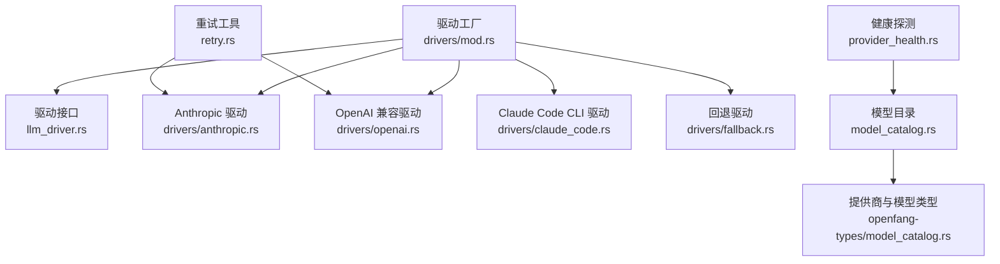
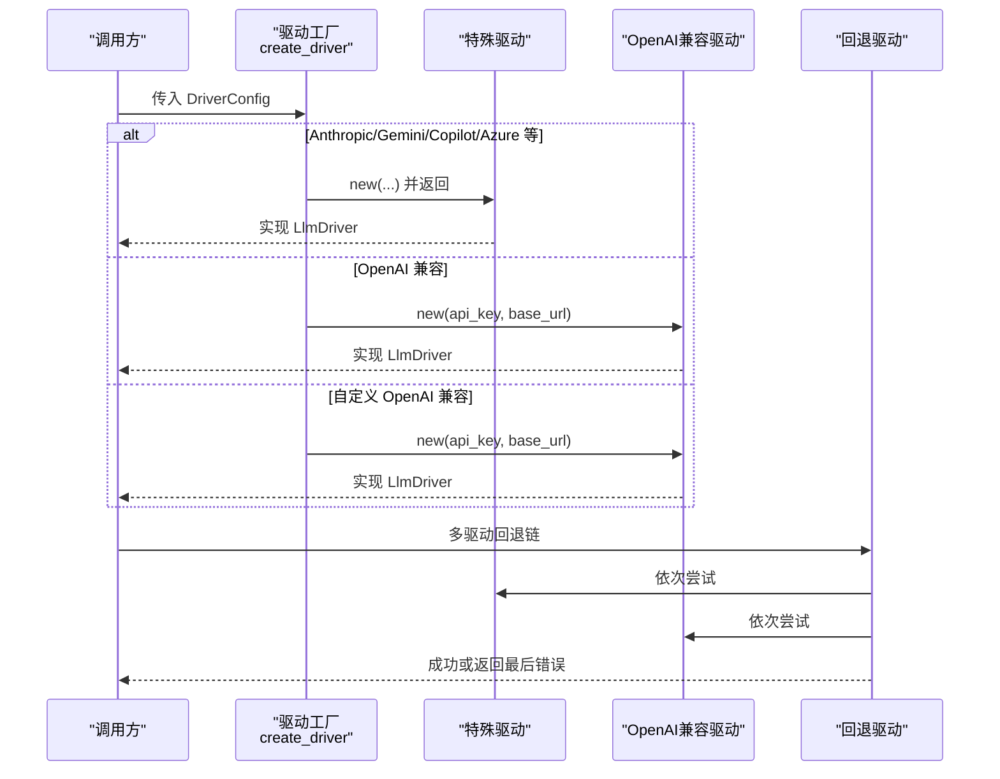
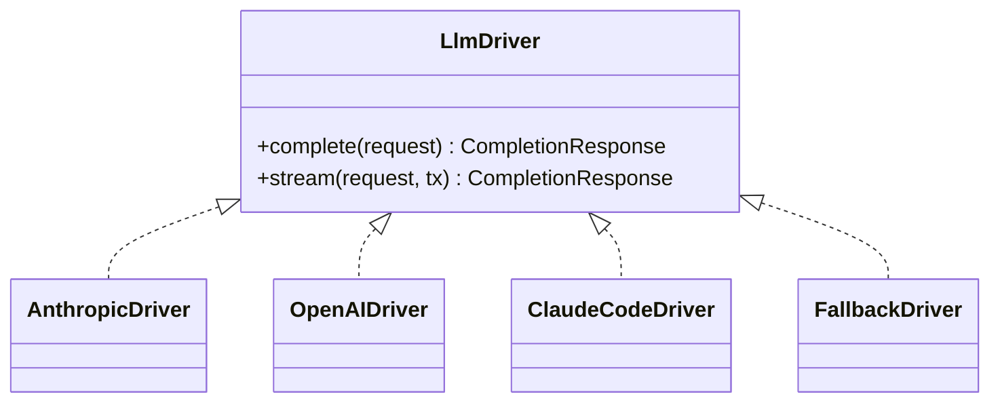
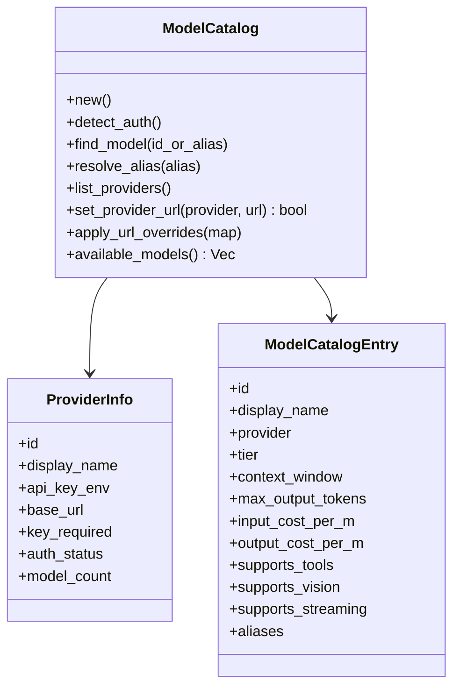
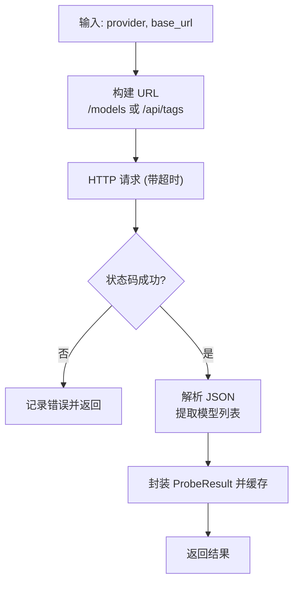
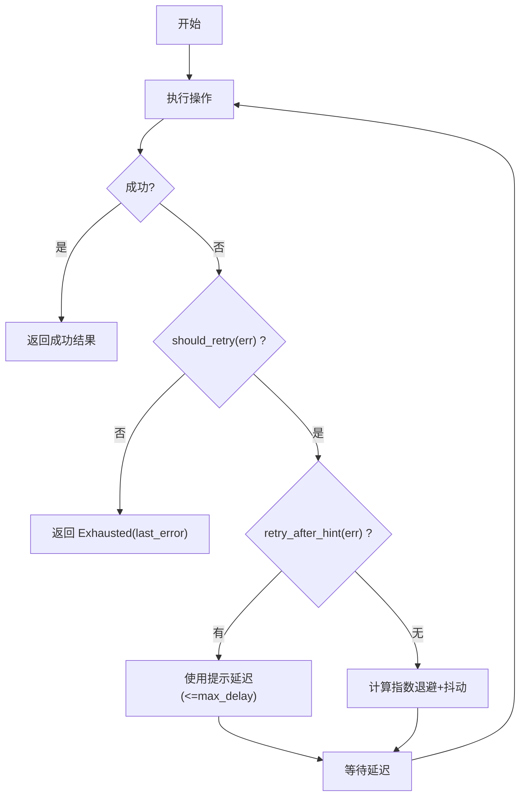
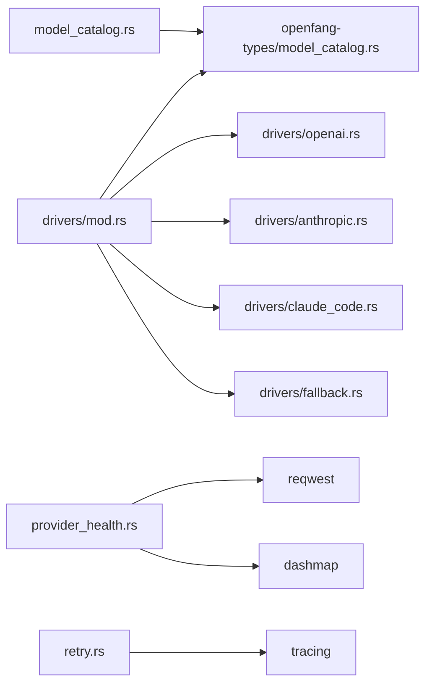

# 驱动配置和管理

<cite>
**本文档引用的文件**
- [drivers/mod.rs](file://crates/openfang-runtime/src/drivers/mod.rs)
- [llm_driver.rs](file://crates/openfang-runtime/src/llm_driver.rs)
- [model_catalog.rs](file://crates/openfang-runtime/src/model_catalog.rs)
- [provider_health.rs](file://crates/openfang-runtime/src/provider_health.rs)
- [retry.rs](file://crates/openfang-runtime/src/retry.rs)
- [anthropic.rs](file://crates/openfang-runtime/src/drivers/anthropic.rs)
- [openai.rs](file://crates/openfang-runtime/src/drivers/openai.rs)
- [fallback.rs](file://crates/openfang-runtime/src/drivers/fallback.rs)
- [claude_code.rs](file://crates/openfang-runtime/src/drivers/claude_code.rs)
- [model_catalog_types.rs](file://crates/openfang-types/src/model_catalog.rs)
</cite>

## 目录
1. [简介](#简介)
2. [项目结构](#项目结构)
3. [核心组件](#核心组件)
4. [架构总览](#架构总览)
5. [详细组件分析](#详细组件分析)
6. [依赖关系分析](#依赖关系分析)
7. [性能考量](#性能考量)
8. [故障排查指南](#故障排查指南)
9. [结论](#结论)
10. [附录](#附录)

## 简介
本文件面向 LLM 驱动配置与管理，系统性阐述驱动工厂模式设计、提供商检测、默认值管理与错误处理策略；详解支持的 37 个 LLM 提供商的配置选项、环境变量约定与最佳实践；提供新增提供商、自定义端点与提供商切换的具体示例路径；解释驱动选择算法、性能优化与故障转移机制。

## 项目结构
OpenFang 将 LLM 驱动抽象为统一接口，并通过工厂函数按提供商动态创建具体驱动实例。核心模块包括：
- 驱动工厂：根据提供商名称与配置创建对应驱动（含特殊提供商与自定义 OpenAI 兼容端点）
- 统一驱动接口：定义完成请求、流式输出与错误类型
- 模型目录与提供商元数据：内置模型与提供商信息、URL 覆盖、认证状态检测
- 健康探测：对本地 LLM 提供商进行可达性与模型发现探测
- 重试机制：指数退避与抖动的通用重试工具
- 特殊驱动：Anthropic、OpenAI 兼容、Claude Code CLI、回退链等

**图表来源**
- [drivers/mod.rs:257-456](file://crates/openfang-runtime/src/drivers/mod.rs#L257-L456)
- [llm_driver.rs:146-171](file://crates/openfang-runtime/src/llm_driver.rs#L146-L171)
- [anthropic.rs:156-260](file://crates/openfang-runtime/src/drivers/anthropic.rs#L156-L260)
- [openai.rs:267-380](file://crates/openfang-runtime/src/drivers/openai.rs#L267-L380)
- [claude_code.rs:232-399](file://crates/openfang-runtime/src/drivers/claude_code.rs#L232-L399)
- [fallback.rs:36-115](file://crates/openfang-runtime/src/drivers/fallback.rs#L36-L115)
- [model_catalog.rs:27-52](file://crates/openfang-runtime/src/model_catalog.rs#L27-L52)
- [model_catalog_types.rs:11-63](file://crates/openfang-types/src/model_catalog.rs#L11-L63)
- [provider_health.rs:92-198](file://crates/openfang-runtime/src/provider_health.rs#L92-L198)
- [retry.rs:123-202](file://crates/openfang-runtime/src/retry.rs#L123-L202)

**章节来源**
- [drivers/mod.rs:1-800](file://crates/openfang-runtime/src/drivers/mod.rs#L1-L800)
- [llm_driver.rs:1-327](file://crates/openfang-runtime/src/llm_driver.rs#L1-L327)
- [model_catalog.rs:1-800](file://crates/openfang-runtime/src/model_catalog.rs#L1-L800)
- [provider_health.rs:1-367](file://crates/openfang-runtime/src/provider_health.rs#L1-L367)
- [retry.rs:1-514](file://crates/openfang-runtime/src/retry.rs#L1-L514)

## 核心组件
- 驱动工厂 create_driver：根据 DriverConfig.provider 与配置决定使用哪个驱动，支持 Anthropic/Gemini/OpenAI 兼容/Azure/Copilot/Claude Code/Qwen Code/Kimi Coding 等特殊路径，以及未知提供商的自定义 OpenAI 兼容端点。
- 统一驱动接口 LlmDriver：定义 complete/stream 方法，返回 CompletionResponse 并携带内容块、停止原因与用量统计。
- 错误类型 LlmError：涵盖 HTTP/API/限流/解析/鉴权/模型不存在等错误，便于上层统一处理。
- 驱动配置 DriverConfig：包含 provider、api_key、base_url、skip_permissions 等字段。
- 模型目录 ModelCatalog：内置 37 家提供商与 130+ 模型，支持别名解析、认证状态检测、URL 覆盖、本地模型合并等。
- 健康探测 ProviderHealth：对本地提供商（Ollama/vLLM/LM Studio）进行轻量探测，缓存结果以降低仪表盘加载延迟。
- 重试工具 Retry：通用指数退避+抖动重试，支持提示延迟与可配置参数。

**章节来源**
- [drivers/mod.rs:257-456](file://crates/openfang-runtime/src/drivers/mod.rs#L257-L456)
- [llm_driver.rs:146-207](file://crates/openfang-runtime/src/llm_driver.rs#L146-L207)
- [model_catalog.rs:27-103](file://crates/openfang-runtime/src/model_catalog.rs#L27-L103)
- [provider_health.rs:92-215](file://crates/openfang-runtime/src/provider_health.rs#L92-L215)
- [retry.rs:123-202](file://crates/openfang-runtime/src/retry.rs#L123-L202)

## 架构总览
驱动工厂采用“优先级 + 默认值 + 自定义兼容”的策略：
- 特殊提供商：Anthropic/Gemini/Copilot/Azure/Claude Code/Qwen Code/Kimi Coding 等走专用分支，确保 API 差异被正确处理。
- 标准 OpenAI 兼容：除上述外的提供商均走 OpenAI 兼容驱动，自动从 ProviderDefaults 获取 base_url 与 API Key 环境变量约定。
- 自定义兼容：若未命中已知提供商且提供了 base_url，则按 OpenAI 兼容格式创建驱动；若仅设置了 API Key 环变量而无 base_url，会给出明确帮助信息。
- 回退链：FallbackDriver 可串联多个驱动，按顺序尝试，遇到限流/过载或非可重试错误时自动切换下一个。

**图表来源**
- [drivers/mod.rs:257-456](file://crates/openfang-runtime/src/drivers/mod.rs#L257-L456)
- [anthropic.rs:156-260](file://crates/openfang-runtime/src/drivers/anthropic.rs#L156-L260)
- [openai.rs:267-380](file://crates/openfang-runtime/src/drivers/openai.rs#L267-L380)
- [fallback.rs:36-115](file://crates/openfang-runtime/src/drivers/fallback.rs#L36-L115)

## 详细组件分析

### 驱动工厂与提供商检测
- ProviderDefaults：集中维护 37 家提供商的 base_url 与 API Key 环境变量名，以及 key_required 标记。
- create_driver：按以下顺序决策：
  1) Anthropic/Gemini/Copilot/Azure/Claude/Qwen/Kimi Coding 等特殊分支；
  2) 已知提供商：从 ProviderDefaults 获取 base_url 与 env var，校验 key_required；
  3) 自定义 OpenAI 兼容：若 config.base_url 存在则直接创建 OpenAI 兼容驱动；否则尝试推断 {PROVIDER}_API_KEY 约定；
  4) 未知提供商：返回明确错误，提示支持列表或设置 base_url。
- detect_available_provider：按用户友好优先级扫描环境变量，返回首个可用的 (provider, model, env)。

```mermaid
flowchart TD
Start(["开始"]) --> CheckSpecial["是否为特殊提供商?<br/>Anthropic/Gemini/Copilot/Azure/Claude/Qwen/Kimi"]
CheckSpecial --> |是| UseSpecial["创建专用驱动"]
CheckSpecial --> |否| Known["是否为已知提供商?"]
Known --> |是| Defaults["读取 ProviderDefaults<br/>检查 key_required"]
Defaults --> HasKey{"API Key 是否存在?"}
HasKey --> |是| UseOA["创建 OpenAI 兼容驱动"]
HasKey --> |否| ErrorKey["报错: 缺少 API Key"]
Known --> |否| CustomBase["是否有自定义 base_url?"]
CustomBase --> |是| UseOA
CustomBase --> |否| EnvKey["尝试 {PROVIDER}_API_KEY"]
EnvKey --> Found{"找到 Key?"}
Found --> |是| ErrorNoBase["报错: 设置 Key 但未设置 base_url"]
Found --> |否| ErrorUnknown["报错: 未知提供商"]
UseSpecial --> End(["结束"])
UseOA --> End
ErrorKey --> End
ErrorNoBase --> End
ErrorUnknown --> End
```

**图表来源**
- [drivers/mod.rs:37-456](file://crates/openfang-runtime/src/drivers/mod.rs#L37-L456)

**章节来源**
- [drivers/mod.rs:28-456](file://crates/openfang-runtime/src/drivers/mod.rs#L28-L456)

### 统一驱动接口与错误处理
- LlmDriver：定义 complete/stream 两个方法，默认 stream 通过 complete 包装文本增量事件。
- LlmError：覆盖 HTTP、API、限流、解析、鉴权失败、模型不存在等场景，便于上层策略化处理。
- CompletionRequest/CompletionResponse：标准化消息、工具调用、思考内容与用量统计。

**图表来源**
- [llm_driver.rs:146-171](file://crates/openfang-runtime/src/llm_driver.rs#L146-L171)
- [anthropic.rs:156-260](file://crates/openfang-runtime/src/drivers/anthropic.rs#L156-L260)
- [openai.rs:267-380](file://crates/openfang-runtime/src/drivers/openai.rs#L267-L380)
- [claude_code.rs:232-399](file://crates/openfang-runtime/src/drivers/claude_code.rs#L232-L399)
- [fallback.rs:36-115](file://crates/openfang-runtime/src/drivers/fallback.rs#L36-L115)

**章节来源**
- [llm_driver.rs:11-171](file://crates/openfang-runtime/src/llm_driver.rs#L11-L171)

### 模型目录与提供商元数据
- 内置 37 家提供商与 130+ 模型，提供别名解析、认证状态检测、URL 覆盖、本地模型合并与自定义模型增删。
- detect_auth：基于环境变量与提供商特定逻辑检测认证状态。
- set_provider_url/apply_url_overrides：允许运行时覆盖提供商 base_url，未知提供商自动注册为自定义 OpenAI 兼容入口。
- ProviderInfo/ModelCatalogEntry：标准化提供商与模型元数据，含成本、上下文窗口、工具/视觉/流式支持等。

**图表来源**
- [model_catalog.rs:27-235](file://crates/openfang-runtime/src/model_catalog.rs#L27-L235)
- [model_catalog_types.rs:169-200](file://crates/openfang-types/src/model_catalog.rs#L169-L200)

**章节来源**
- [model_catalog.rs:54-235](file://crates/openfang-runtime/src/model_catalog.rs#L54-L235)
- [model_catalog_types.rs:11-200](file://crates/openfang-types/src/model_catalog.rs#L11-L200)

### 健康探测与本地提供商
- is_local_provider：识别本地提供商（Ollama/vLLM/LM Studio），用于健康探测与模型发现。
- probe_provider/probe_provider_cached：对 /models 或 /api/tags 进行探测，缓存结果避免重复网络开销。
- probe_model：最小化请求验证模型可用性，用于电路断路器恢复测试。

**图表来源**
- [provider_health.rs:92-198](file://crates/openfang-runtime/src/provider_health.rs#L92-L198)

**章节来源**
- [provider_health.rs:26-215](file://crates/openfang-runtime/src/provider_health.rs#L26-L215)

### 重试机制与退避策略
- RetryConfig：最大尝试次数、最小/最大延迟、抖动系数。
- compute_backoff：指数退避，上限不超过 max_delay_ms，结合抖动避免雪崩。
- retry_async：支持错误谓词判断是否重试、从错误中提取建议延迟、记录调试日志。
- llm_retry_config/network_retry_config/channel_retry_config：针对不同场景的预设配置。

**图表来源**
- [retry.rs:123-202](file://crates/openfang-runtime/src/retry.rs#L123-L202)

**章节来源**
- [retry.rs:16-242](file://crates/openfang-runtime/src/retry.rs#L16-L242)

### 特殊驱动实现要点

#### Anthropic 驱动
- 使用 Messages API，支持系统提示抽取、工具调用、思考内容、流式事件解析。
- 对 429/529 场景进行有限次重试，避免阻塞。
- 流式解析 SSE 事件，逐段推送 TextDelta/ToolUse* 等事件。

**章节来源**
- [anthropic.rs:156-554](file://crates/openfang-runtime/src/drivers/anthropic.rs#L156-L554)

#### OpenAI 兼容驱动
- 支持标准 OpenAI 与 Azure OpenAI（部署 URL + api-key 头）。
- 智能参数适配：max_tokens/max_completion_tokens、温度限制、Moonshot/Kimi 思考禁用、Groq 工具调用失败恢复等。
- 流式支持：按 OpenAI 兼容格式解析增量事件，合成思考内容摘要。

**章节来源**
- [openai.rs:267-745](file://crates/openfang-runtime/src/drivers/openai.rs#L267-L745)

#### Claude Code CLI 驱动
- 通过子进程调用 claude CLI，非交互模式，支持权限跳过。
- 安全过滤敏感环境变量，避免泄露其他提供商密钥。
- 超时控制与 PID 跟踪，防止僵尸进程；支持 JSON/流式 JSON 输出解析。

**章节来源**
- [claude_code.rs:232-589](file://crates/openfang-runtime/src/drivers/claude_code.rs#L232-L589)

#### 回退驱动
- 顺序尝试多个驱动，遇到限流/过载或非可重试错误时切换下一个。
- 支持为每个驱动指定模型名，便于跨提供商迁移。

**章节来源**
- [fallback.rs:36-115](file://crates/openfang-runtime/src/drivers/fallback.rs#L36-L115)

## 依赖关系分析
- 驱动工厂依赖模型目录中的 ProviderDefaults 与提供商 URL 常量，以及类型模块中的 base_url 常量。
- OpenAI 兼容驱动依赖 think_filter 以处理本地模型的思考内容；Anthropic 驱动直接解析响应。
- 健康探测依赖 reqwest 与 DashMap 缓存；重试工具依赖 tracing 与系统时间生成伪随机抖动。
- 回退驱动聚合多个 LlmDriver 实例，形成链式容错。

**图表来源**
- [drivers/mod.rs:15-26](file://crates/openfang-runtime/src/drivers/mod.rs#L15-L26)
- [model_catalog_types.rs:11-63](file://crates/openfang-types/src/model_catalog.rs#L11-L63)
- [openai.rs:5-13](file://crates/openfang-runtime/src/drivers/openai.rs#L5-L13)
- [anthropic.rs:6-15](file://crates/openfang-runtime/src/drivers/anthropic.rs#L6-L15)
- [claude_code.rs:11-18](file://crates/openfang-runtime/src/drivers/claude_code.rs#L11-L18)
- [provider_health.rs:10-11](file://crates/openfang-runtime/src/provider_health.rs#L10-L11)
- [retry.rs:10-10](file://crates/openfang-runtime/src/retry.rs#L10-L10)

**章节来源**
- [drivers/mod.rs:15-26](file://crates/openfang-runtime/src/drivers/mod.rs#L15-L26)
- [model_catalog_types.rs:11-63](file://crates/openfang-types/src/model_catalog.rs#L11-L63)

## 性能考量
- 健康探测缓存：ProbeCache 默认 60 秒 TTL，显著降低仪表盘重复加载的网络开销。
- 重试退避：指数退避+抖动，避免雪崩效应；对限流/过载场景快速降级。
- 流式传输：Anthropic 的 SSE 与 OpenAI 兼容驱动的增量事件，减少首字节延迟感知。
- 本地模型优化：对本地 LLM（Ollama/vLLM/LM Studio）采用轻量探测与模型发现，避免不必要的连接超时。
- 认证状态预检：ModelCatalog.detect_auth 在启动阶段完成，避免运行时反复查询环境变量。

[本节为通用指导，无需特定文件引用]

## 故障排查指南
- 未知提供商错误：检查 create_driver 返回的错误消息，确认 provider 名称拼写与是否需要设置 base_url。
- 缺少 API Key：对于 key_required 的提供商，确保设置正确的 {PROVIDER}_API_KEY 环境变量；特殊提供商如 Gemini 可使用 GOOGLE_API_KEY 别名。
- Azure OpenAI：必须提供 base_url（资源级部署根地址），并设置 AZURE_OPENAI_API_KEY。
- 自定义 OpenAI 兼容：若仅设置 API Key 环变量而未设置 base_url，会提示缺少 base_url；可按约定 PROVIDER_API_KEY 设置后在 [provider_urls] 中配置 base_url。
- 限流/过载：驱动内部对 429/529 与 429/529 场景进行有限重试；可结合回退驱动切换到备用提供商。
- 本地 LLM 不可达：使用 provider_health.probe_provider_cached 快速诊断；检查本地服务端口与代理设置。
- Claude Code CLI：若未认证或权限未接受，会提示 claude auth 或 --dangerously-skip-permissions；注意超时与 PID 跟踪。

**章节来源**
- [drivers/mod.rs:390-456](file://crates/openfang-runtime/src/drivers/mod.rs#L390-L456)
- [anthropic.rs:220-236](file://crates/openfang-runtime/src/drivers/anthropic.rs#L220-L236)
- [openai.rs:496-506](file://crates/openfang-runtime/src/drivers/openai.rs#L496-L506)
- [provider_health.rs:92-198](file://crates/openfang-runtime/src/provider_health.rs#L92-L198)
- [claude_code.rs:336-357](file://crates/openfang-runtime/src/drivers/claude_code.rs#L336-L357)

## 结论
该驱动体系通过工厂模式与统一接口实现了对 37 家提供商的一致抽象，配合模型目录、健康探测与重试机制，既保证了易用性也兼顾了稳定性与性能。特殊提供商的专用实现确保了 API 差异的正确处理；回退链进一步增强了容错能力。推荐在生产环境中结合健康探测缓存、重试策略与回退链，以获得更佳的可用性与用户体验。

[本节为总结性内容，无需特定文件引用]

## 附录

### 支持的 37 个提供商与环境变量约定
- Anthropic：ANTHROPIC_API_KEY
- OpenAI：OPENAI_API_KEY
- Gemini/Google：GEMINI_API_KEY 或 GOOGLE_API_KEY
- Groq：GROQ_API_KEY
- OpenRouter：OPENROUTER_API_KEY
- DeepSeek：DEEPSEEK_API_KEY
- Together：TOGETHER_API_KEY
- Mistral：MISTRAL_API_KEY
- Fireworks：FIREWORKS_API_KEY
- Ollama：OLLAMA_API_KEY（可选）
- vLLM：VLLM_API_KEY（可选）
- LM Studio：LMSTUDIO_API_KEY（可选）
- Perplexity：PERPLEXITY_API_KEY
- Cohere：COHERE_API_KEY
- AI21：AI21_API_KEY
- Cerebras：CEREBRAS_API_KEY
- SambaNova：SAMBANOVA_API_KEY
- Hugging Face：HF_API_KEY
- xAI：XAI_API_KEY
- Replicate：REPLICATE_API_TOKEN
- GitHub Copilot：GITHUB_TOKEN
- Moonshot：MOONSHOT_API_KEY
- Qwen/DashScope/ModelStudio：DASHSCOPE_API_KEY
- MiniMax：MINIMAX_API_KEY
- Zhipu/GLM/Z.AI：ZHIPU_API_KEY
- Zhipu Coding/CodeGeex/Z.AI Coding：ZHIPU_API_KEY
- Qianfan/Baidu：QIANFAN_API_KEY
- Volcengine/Doubao/Doubao Coding：VOLCENGINE_API_KEY
- Chutes.ai：CHUTES_API_KEY
- Venice.ai：VENICE_API_KEY
- NVIDIA NIM：NVIDIA_API_KEY
- Azure OpenAI：AZURE_OPENAI_API_KEY（需 base_url）
- OpenAI Codex：OPENAI_API_KEY 或 Codex 凭据文件
- Claude Code CLI：无需 API Key（需安装 CLI）
- Qwen Code CLI：无需 API Key（需安装 CLI）

**章节来源**
- [drivers/mod.rs:37-231](file://crates/openfang-runtime/src/drivers/mod.rs#L37-L231)
- [model_catalog_types.rs:11-63](file://crates/openfang-types/src/model_catalog.rs#L11-L63)

### 新增提供商步骤示例（代码路径）
- 在驱动工厂中添加 ProviderDefaults 条目与特殊分支：[drivers/mod.rs:37-456](file://crates/openfang-runtime/src/drivers/mod.rs#L37-L456)
- 若为 OpenAI 兼容，补充 base_url 常量：[model_catalog_types.rs:11-63](file://crates/openfang-types/src/model_catalog.rs#L11-L63)
- 在模型目录中注册提供商与默认模型（可选）：[model_catalog.rs:421-800](file://crates/openfang-runtime/src/model_catalog.rs#L421-L800)
- 如需健康探测，扩展 probe_provider 逻辑：[provider_health.rs:92-198](file://crates/openfang-runtime/src/provider_health.rs#L92-L198)

### 配置自定义端点与提供商切换
- 设置 base_url：在 DriverConfig 或 [provider_urls] 中为指定提供商配置自定义端点
- 切换提供商：更新 DriverConfig.provider 后重新创建驱动；或在回退链中调整顺序
- URL 覆盖：使用 ModelCatalog.apply_url_overrides 批量应用

**章节来源**
- [drivers/mod.rs:416-425](file://crates/openfang-runtime/src/drivers/mod.rs#L416-L425)
- [model_catalog.rs:218-235](file://crates/openfang-runtime/src/model_catalog.rs#L218-L235)
- [fallback.rs:20-34](file://crates/openfang-runtime/src/drivers/fallback.rs#L20-L34)