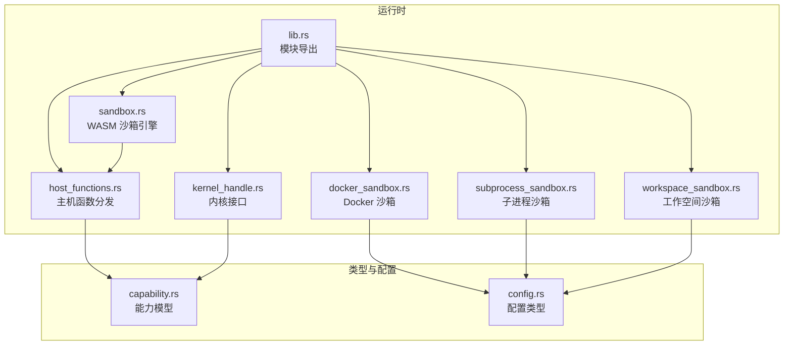
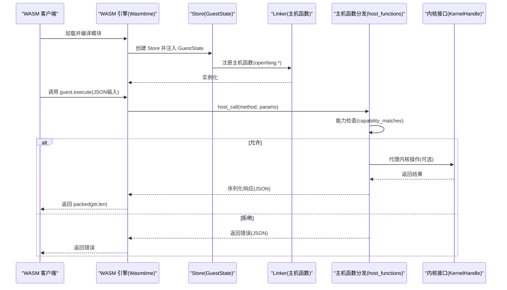
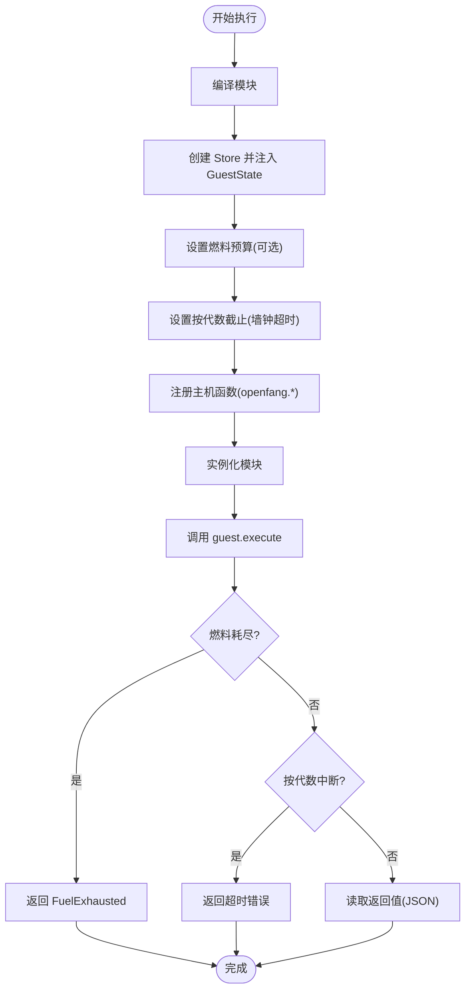
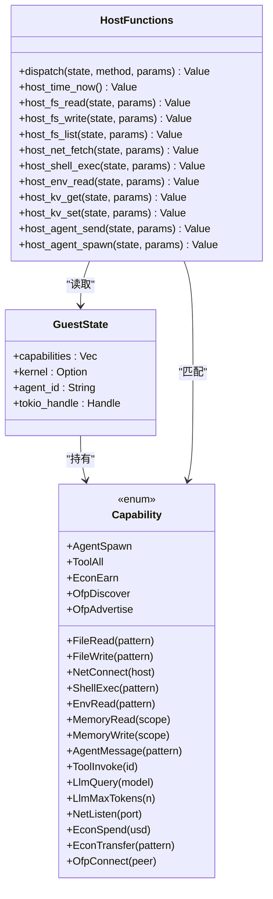
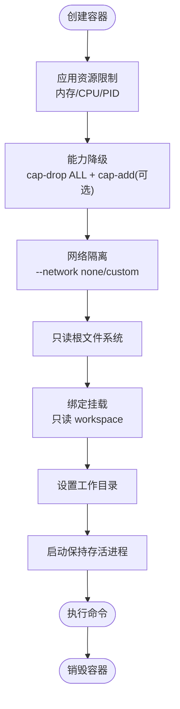
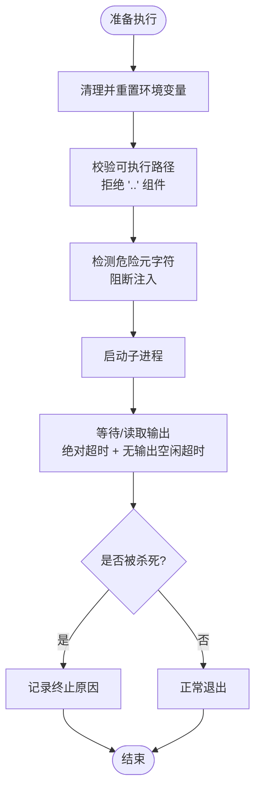
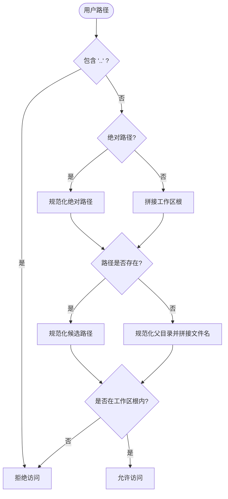
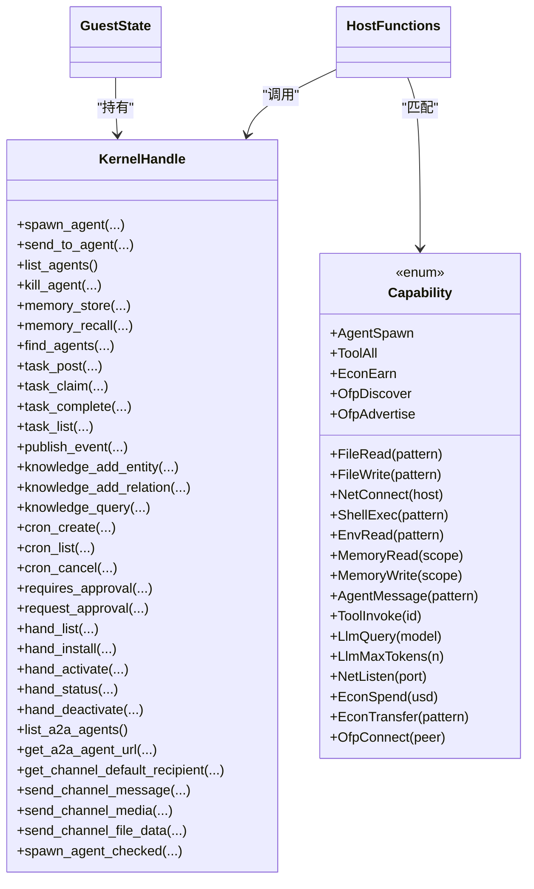
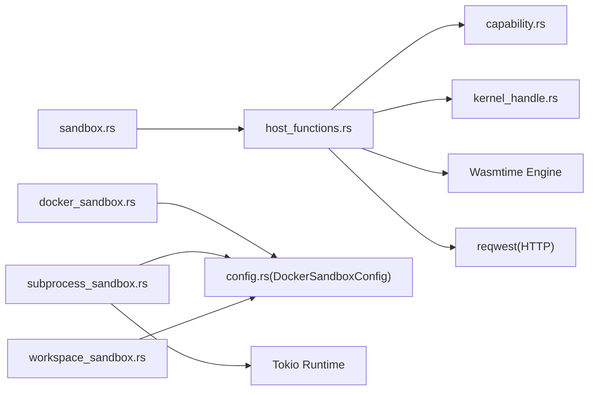

# WASM 沙箱隔离

<cite>
**本文引用的文件**
- [crates/openfang-runtime/src/sandbox.rs](file://crates/openfang-runtime/src/sandbox.rs)
- [crates/openfang-runtime/src/host_functions.rs](file://crates/openfang-runtime/src/host_functions.rs)
- [crates/openfang-runtime/src/docker_sandbox.rs](file://crates/openfang-runtime/src/docker_sandbox.rs)
- [crates/openfang-runtime/src/subprocess_sandbox.rs](file://crates/openfang-runtime/src/subprocess_sandbox.rs)
- [crates/openfang-runtime/src/workspace_sandbox.rs](file://crates/openfang-runtime/src/workspace_sandbox.rs)
- [crates/openfang-types/src/capability.rs](file://crates/openfang-types/src/capability.rs)
- [crates/openfang-types/src/config.rs](file://crates/openfang-types/src/config.rs)
- [crates/openfang-runtime/src/lib.rs](file://crates/openfang-runtime/src/lib.rs)
- [crates/openfang-runtime/src/kernel_handle.rs](file://crates/openfang-runtime/src/kernel_handle.rs)
</cite>

## 目录
1. [简介](#简介)
2. [项目结构](#项目结构)
3. [核心组件](#核心组件)
4. [架构总览](#架构总览)
5. [详细组件分析](#详细组件分析)
6. [依赖关系分析](#依赖关系分析)
7. [性能考量](#性能考量)
8. [故障排查指南](#故障排查指南)
9. [结论](#结论)
10. [附录](#附录)

## 简介
本技术文档围绕 WASM 沙箱隔离系统展开，系统通过多层安全机制保障不可信代码（如技能/插件）在受控环境中安全执行。核心能力包括：
- 基于 Wasmtime 的 WASM 沙箱：CPU 指令预算（燃料）、墙钟超时中断、能力授权、主机函数拦截与日志。
- Docker 容器沙箱：OS 级隔离、资源限制、网络隔离、只读根文件系统、能力降级。
- 子进程沙箱：环境变量清理、可执行路径校验、命令注入防护、进程树清理与双层超时控制。
- 工作空间沙箱：路径解析与访问控制，防止路径穿越与符号链接逃逸。

系统采用“能力基础”（Capability-based）授权模型，所有主机调用均需匹配授予的能力，未授权即拒绝；同时提供工具系统集成点，便于与内核交互、消息传递、任务队列等。

## 项目结构
本系统位于 openfang 项目的 openfang-runtime 子模块中，核心文件如下：
- WASM 沙箱与主机函数：sandbox.rs、host_functions.rs
- Docker 沙箱：docker_sandbox.rs
- 子进程沙箱：subprocess_sandbox.rs
- 工作空间沙箱：workspace_sandbox.rs
- 能力模型与配置：capability.rs、config.rs
- 内核接口：kernel_handle.rs
- 模块导出：lib.rs

**图表来源**
- [crates/openfang-runtime/src/lib.rs:1-59](file://crates/openfang-runtime/src/lib.rs#L1-L59)
- [crates/openfang-runtime/src/sandbox.rs:1-608](file://crates/openfang-runtime/src/sandbox.rs#L1-L608)
- [crates/openfang-runtime/src/host_functions.rs:1-669](file://crates/openfang-runtime/src/host_functions.rs#L1-L669)
- [crates/openfang-runtime/src/docker_sandbox.rs:1-636](file://crates/openfang-runtime/src/docker_sandbox.rs#L1-L636)
- [crates/openfang-runtime/src/subprocess_sandbox.rs:1-906](file://crates/openfang-runtime/src/subprocess_sandbox.rs#L1-L906)
- [crates/openfang-runtime/src/workspace_sandbox.rs:1-149](file://crates/openfang-runtime/src/workspace_sandbox.rs#L1-L149)
- [crates/openfang-types/src/capability.rs:1-317](file://crates/openfang-types/src/capability.rs#L1-L317)
- [crates/openfang-types/src/config.rs:509-590](file://crates/openfang-types/src/config.rs#L509-L590)
- [crates/openfang-runtime/src/kernel_handle.rs:1-256](file://crates/openfang-runtime/src/kernel_handle.rs#L1-L256)

**章节来源**
- [crates/openfang-runtime/src/lib.rs:1-59](file://crates/openfang-runtime/src/lib.rs#L1-L59)

## 核心组件
- WASM 沙箱引擎：基于 Wasmtime，启用燃料计量与按代数中断，严格检查主机调用能力，支持日志与错误处理。
- 主机函数分发：统一入口 openfang.host_call，按方法名分派到具体能力检查与实现，返回 JSON 结果。
- Docker 沙箱：创建受限容器，设置资源上限、网络隔离、只读根文件系统、能力降级与挂载白名单。
- 子进程沙箱：清理环境变量、命令注入检测、可执行路径校验、进程树清理与双层超时。
- 工作空间沙箱：路径解析与访问控制，阻止路径穿越与符号链接逃逸。
- 能力模型：以 Capability 枚举表达权限，支持通配与模式匹配，内核负责继承校验。
- 配置体系：ExecPolicy、DockerSandboxConfig 等，统一管理安全策略与资源限制。

**章节来源**
- [crates/openfang-runtime/src/sandbox.rs:33-608](file://crates/openfang-runtime/src/sandbox.rs#L33-L608)
- [crates/openfang-runtime/src/host_functions.rs:16-49](file://crates/openfang-runtime/src/host_functions.rs#L16-L49)
- [crates/openfang-runtime/src/docker_sandbox.rs:93-246](file://crates/openfang-runtime/src/docker_sandbox.rs#L93-L246)
- [crates/openfang-runtime/src/subprocess_sandbox.rs:30-64](file://crates/openfang-runtime/src/subprocess_sandbox.rs#L30-L64)
- [crates/openfang-runtime/src/workspace_sandbox.rs:8-69](file://crates/openfang-runtime/src/workspace_sandbox.rs#L8-L69)
- [crates/openfang-types/src/capability.rs:10-166](file://crates/openfang-types/src/capability.rs#L10-L166)
- [crates/openfang-types/src/config.rs:801-843](file://crates/openfang-types/src/config.rs#L801-L843)

## 架构总览
下图展示了 WASM 沙箱与主机函数、能力模型、内核接口以及外部工具链的交互关系。

**图表来源**
- [crates/openfang-runtime/src/sandbox.rs:146-275](file://crates/openfang-runtime/src/sandbox.rs#L146-L275)
- [crates/openfang-runtime/src/host_functions.rs:16-49](file://crates/openfang-runtime/src/host_functions.rs#L16-L49)
- [crates/openfang-types/src/capability.rs:100-166](file://crates/openfang-types/src/capability.rs#L100-L166)
- [crates/openfang-runtime/src/kernel_handle.rs:27-51](file://crates/openfang-runtime/src/kernel_handle.rs#L27-L51)

## 详细组件分析

### WASM 沙箱引擎（WasmSandbox）
- 关键特性
  - 启用燃料计量（consume_fuel）与按代数中断（epoch_interruption），分别用于 CPU 指令预算与墙钟超时。
  - 在阻塞线程中执行，避免 Tokio 执行器被 CPU 密集型 WASM 占满。
  - 严格 ABI：要求导出 memory、alloc、execute；execute 返回 packed 指针与长度。
  - 主机函数注册：openfang.host_call（RPC 分发）、openfang.host_log（轻量日志）。
- 资源限制与异常
  - 燃料耗尽触发 FuelExhausted；按代数中断触发超时错误；ABI 违规触发 AbiError。
- 配置项
  - SandboxConfig：fuel_limit、max_memory_bytes、capabilities、timeout_secs。

**图表来源**
- [crates/openfang-runtime/src/sandbox.rs:146-275](file://crates/openfang-runtime/src/sandbox.rs#L146-L275)

**章节来源**
- [crates/openfang-runtime/src/sandbox.rs:33-608](file://crates/openfang-runtime/src/sandbox.rs#L33-L608)

### 主机函数与能力检查（host_functions）
- 方法分发：dispatch 根据 method 路由到具体实现，如 time_now、fs_read、fs_write、net_fetch、shell_exec、env_read、kv_get/kv_set、agent_send/agent_spawn。
- 能力检查：check_capability 使用 capability_matches 对比授予与所需能力，支持通配与模式匹配。
- 安全增强：
  - 文件系统：safe_resolve_path/safe_resolve_parent 拒绝路径穿越，解析符号链接。
  - 网络：is_ssrf_target 拦截私有/元数据地址，仅允许 http/https。
  - Shell：使用 Command::new 直接执行，避免 shell 注入；配合 subprocess_sandbox 的 allowlist/禁止元字符。
- 内核交互：通过 GuestState.kernel 提供的 KernelHandle 访问跨代理能力（消息、内存、任务等）。

**图表来源**
- [crates/openfang-runtime/src/host_functions.rs:16-49](file://crates/openfang-runtime/src/host_functions.rs#L16-L49)
- [crates/openfang-types/src/capability.rs:10-72](file://crates/openfang-types/src/capability.rs#L10-L72)

**章节来源**
- [crates/openfang-runtime/src/host_functions.rs:16-669](file://crates/openfang-runtime/src/host_functions.rs#L16-L669)
- [crates/openfang-types/src/capability.rs:100-166](file://crates/openfang-types/src/capability.rs#L100-L166)

### Docker 容器沙箱
- 容器生命周期：创建、执行命令、销毁；支持容器池复用与清理。
- 安全策略：
  - 资源限制：内存、CPU、PID 数。
  - 能力降级：默认 drop ALL，仅允许显式添加的 cap_add。
  - 网络隔离：默认 none 网络或自定义网络。
  - 只读根文件系统：减少持久化风险。
  - 绑定挂载验证：拒绝敏感路径、相对路径、路径穿越、符号链接逃逸。
- 配置：DockerSandboxConfig，含 image、workdir、network、memory_limit、cpu_limit、timeout_secs、cap_add、tmpfs、pids_limit、mode、scope、reuse_cool_secs、idle_timeout_secs、max_age_secs、blocked_mounts。

**图表来源**
- [crates/openfang-runtime/src/docker_sandbox.rs:93-173](file://crates/openfang-runtime/src/docker_sandbox.rs#L93-L173)
- [crates/openfang-types/src/config.rs:509-590](file://crates/openfang-types/src/config.rs#L509-L590)

**章节来源**
- [crates/openfang-runtime/src/docker_sandbox.rs:93-246](file://crates/openfang-runtime/src/docker_sandbox.rs#L93-L246)
- [crates/openfang-types/src/config.rs:509-590](file://crates/openfang-types/src/config.rs#L509-L590)

### 子进程沙箱
- 环境变量清理：仅保留平台安全变量与显式允许的变量。
- 可执行路径校验：拒绝包含父目录组件的路径。
- 命令注入防护：全面禁止元字符（命令替换、管道、重定向、变量扩展、后台执行、逻辑连接、换行、空字节等）。
- 进程树清理：支持优雅终止与强制杀死，跨平台实现。
- 双层超时控制：绝对超时 + 无输出空闲超时，结合输出收集与终止原因返回。

**图表来源**
- [crates/openfang-runtime/src/subprocess_sandbox.rs:30-64](file://crates/openfang-runtime/src/subprocess_sandbox.rs#L30-L64)
- [crates/openfang-runtime/src/subprocess_sandbox.rs:90-149](file://crates/openfang-runtime/src/subprocess_sandbox.rs#L90-L149)
- [crates/openfang-runtime/src/subprocess_sandbox.rs:428-579](file://crates/openfang-runtime/src/subprocess_sandbox.rs#L428-L579)

**章节来源**
- [crates/openfang-runtime/src/subprocess_sandbox.rs:30-64](file://crates/openfang-runtime/src/subprocess_sandbox.rs#L30-L64)
- [crates/openfang-runtime/src/subprocess_sandbox.rs:90-149](file://crates/openfang-runtime/src/subprocess_sandbox.rs#L90-L149)
- [crates/openfang-runtime/src/subprocess_sandbox.rs:243-427](file://crates/openfang-runtime/src/subprocess_sandbox.rs#L243-L427)
- [crates/openfang-types/src/config.rs:801-843](file://crates/openfang-types/src/config.rs#L801-L843)

### 工作空间沙箱
- 路径解析：拒绝 '..' 组件；相对路径拼接到工作区根；绝对路径规范化后校验前缀。
- 新建文件：规范化父目录并拼接文件名，确保最终路径在工作区内。
- 符号链接防护：存在性检查时进行 canonicalize，阻断指向敏感区域的链接。

**图表来源**
- [crates/openfang-runtime/src/workspace_sandbox.rs:8-69](file://crates/openfang-runtime/src/workspace_sandbox.rs#L8-L69)

**章节来源**
- [crates/openfang-runtime/src/workspace_sandbox.rs:8-149](file://crates/openfang-runtime/src/workspace_sandbox.rs#L8-L149)

### 与工具系统的集成
- 能力模型：通过 Capability 枚举与 capability_matches 实现细粒度授权，支持通配与数值边界。
- 内核接口：KernelHandle 抽象跨代理能力（spawn/send/list/kill/memory/task/event 等），WASM 主机函数通过 GuestState.kernel 调用。
- 配置驱动：ExecPolicy 控制 shell 执行策略（deny/allowlist/full），DockerSandboxConfig 控制容器沙箱行为。

**图表来源**
- [crates/openfang-runtime/src/kernel_handle.rs:27-254](file://crates/openfang-runtime/src/kernel_handle.rs#L27-L254)
- [crates/openfang-types/src/capability.rs:10-72](file://crates/openfang-types/src/capability.rs#L10-L72)
- [crates/openfang-runtime/src/host_functions.rs:16-49](file://crates/openfang-runtime/src/host_functions.rs#L16-L49)

**章节来源**
- [crates/openfang-runtime/src/kernel_handle.rs:27-254](file://crates/openfang-runtime/src/kernel_handle.rs#L27-L254)
- [crates/openfang-types/src/capability.rs:100-166](file://crates/openfang-types/src/capability.rs#L100-L166)

## 依赖关系分析
- 模块耦合
  - sandbox.rs 依赖 host_functions.rs 与 capability.rs；host_functions.rs 依赖 capability.rs 与 kernel_handle.rs。
  - docker_sandbox.rs 依赖 config.rs 中的 DockerSandboxConfig；subprocess_sandbox.rs 依赖 config.rs 中的 ExecPolicy。
  - workspace_sandbox.rs 依赖 config.rs 的路径与挂载策略。
- 外部依赖
  - Wasmtime 作为 WASM 引擎，提供编译、实例化、燃料与按代数中断。
  - tokio 进程与异步运行时，用于子进程管理与超时控制。
  - reqwest 用于网络请求（在主机函数 net_fetch 中）。

**图表来源**
- [crates/openfang-runtime/src/sandbox.rs:26-31](file://crates/openfang-runtime/src/sandbox.rs#L26-L31)
- [crates/openfang-runtime/src/host_functions.rs:9-14](file://crates/openfang-runtime/src/host_functions.rs#L9-L14)
- [crates/openfang-runtime/src/docker_sandbox.rs:6-8](file://crates/openfang-runtime/src/docker_sandbox.rs#L6-L8)
- [crates/openfang-types/src/config.rs:509-590](file://crates/openfang-types/src/config.rs#L509-L590)

**章节来源**
- [crates/openfang-runtime/src/sandbox.rs:26-31](file://crates/openfang-runtime/src/sandbox.rs#L26-L31)
- [crates/openfang-runtime/src/host_functions.rs:9-14](file://crates/openfang-runtime/src/host_functions.rs#L9-L14)
- [crates/openfang-runtime/src/docker_sandbox.rs:6-8](file://crates/openfang-runtime/src/docker_sandbox.rs#L6-L8)

## 性能考量
- WASM 执行
  - 燃料计量与按代数中断双重限速，避免 CPU/IO 攻击；建议根据技能复杂度调整 fuel_limit 与 timeout_secs。
  - 将 CPU 密集型执行放入 spawn_blocking，避免阻塞 Tokio 主循环。
- Docker 沙箱
  - 合理设置内存与 CPU 上限，避免过度分配导致资源争用；使用容器池降低冷启动开销。
  - 选择合适的网络模式与 tmpfs 大小，平衡安全性与 I/O 性能。
- 子进程沙箱
  - 严格 allowlist 与元字符阻断可显著降低注入风险，但可能影响灵活性；根据场景选择模式。
  - 双层超时策略避免僵尸进程与资源泄漏。
- 工作空间沙箱
  - 路径规范化与符号链接检查带来少量开销，但在高安全场景必要。

[本节为通用指导，无需特定文件引用]

## 故障排查指南
- WASM 执行失败
  - 燃料耗尽：检查 fuel_limit 是否过低，适当提高或优化算法。
  - 墙钟超时：检查 timeout_secs 设置，确认宿主函数调用是否阻塞。
  - ABI 违规：确认导出 memory/alloc/execute 是否符合约定。
- 主机函数拒绝
  - 能力不足：检查授予的 Capability 是否覆盖所需方法与参数（如 fs_read 的路径模式）。
  - SSRF 拦截：net_fetch 仅允许 http/https，且不允许私有/元数据地址。
- Docker 沙箱问题
  - 容器创建失败：检查镜像名称、网络、资源限制与挂载路径合法性。
  - 权限不足：确认 cap-drop 与 cap-add 配置是否正确。
- 子进程问题
  - 命令被阻断：检查 ExecPolicy 模式与 allowlist；确认未包含危险元字符。
  - 进程无法终止：检查进程树清理逻辑与超时设置。
- 工作空间问题
  - 访问被拒：检查路径是否包含 '..' 或超出工作区根。

**章节来源**
- [crates/openfang-runtime/src/sandbox.rs:231-247](file://crates/openfang-runtime/src/sandbox.rs#L231-L247)
- [crates/openfang-runtime/src/host_functions.rs:55-67](file://crates/openfang-runtime/src/host_functions.rs#L55-L67)
- [crates/openfang-runtime/src/docker_sandbox.rs:93-173](file://crates/openfang-runtime/src/docker_sandbox.rs#L93-L173)
- [crates/openfang-runtime/src/subprocess_sandbox.rs:200-241](file://crates/openfang-runtime/src/subprocess_sandbox.rs#L200-L241)
- [crates/openfang-runtime/src/workspace_sandbox.rs:15-69](file://crates/openfang-runtime/src/workspace_sandbox.rs#L15-L69)

## 结论
本系统通过多层隔离与能力授权，构建了从字节码到操作系统级别的纵深防御。WASM 沙箱提供确定性与可预测的执行环境，Docker 沙箱提供 OS 级隔离，子进程沙箱与工作空间沙箱进一步收紧边界。配合能力模型与严格的配置策略，系统在保证安全性的同时兼顾可用性与可观测性。

[本节为总结，无需特定文件引用]

## 附录

### 配置与参数参考
- WASM 沙箱配置（SandboxConfig）
  - fuel_limit：CPU 指令预算
  - max_memory_bytes：线性内存上限（预留）
  - capabilities：授予的能力列表
  - timeout_secs：墙钟超时秒数
- Docker 沙箱配置（DockerSandboxConfig）
  - enabled、image、container_prefix、workdir、network、memory_limit、cpu_limit、timeout_secs、read_only_root、cap_add、tmpfs、pids_limit、mode、scope、reuse_cool_secs、idle_timeout_secs、max_age_secs、blocked_mounts
- 执行策略（ExecPolicy）
  - mode：deny/allowlist/full
  - safe_bins：免检命令集合
  - allowed_commands：全局允许命令
  - timeout_secs、max_output_bytes、no_output_timeout_secs

**章节来源**
- [crates/openfang-types/src/config.rs:509-590](file://crates/openfang-types/src/config.rs#L509-L590)
- [crates/openfang-types/src/config.rs:801-843](file://crates/openfang-types/src/config.rs#L801-L843)

### 代码示例路径（不直接展示代码内容）
- 配置 WASM 沙箱参数
  - [SandboxConfig 默认值:47-55](file://crates/openfang-runtime/src/sandbox.rs#L47-L55)
- 实现宿主函数绑定
  - [注册 openfang.host_call 与 openfang.host_log:277-387](file://crates/openfang-runtime/src/sandbox.rs#L277-L387)
- 处理沙箱异常
  - [燃料耗尽与超时错误分支:231-247](file://crates/openfang-runtime/src/sandbox.rs#L231-L247)
- Docker 沙箱创建与执行
  - [创建容器与执行命令:93-173](file://crates/openfang-runtime/src/docker_sandbox.rs#L93-L173)
  - [执行命令与超时处理:175-224](file://crates/openfang-runtime/src/docker_sandbox.rs#L175-L224)
- 子进程沙箱与命令注入防护
  - [环境变量清理:30-64](file://crates/openfang-runtime/src/subprocess_sandbox.rs#L30-L64)
  - [元字符阻断规则:90-149](file://crates/openfang-runtime/src/subprocess_sandbox.rs#L90-L149)
  - [双层超时与进程树清理:428-579](file://crates/openfang-runtime/src/subprocess_sandbox.rs#L428-L579)
- 工作空间路径解析
  - [路径解析与访问控制:8-69](file://crates/openfang-runtime/src/workspace_sandbox.rs#L8-L69)