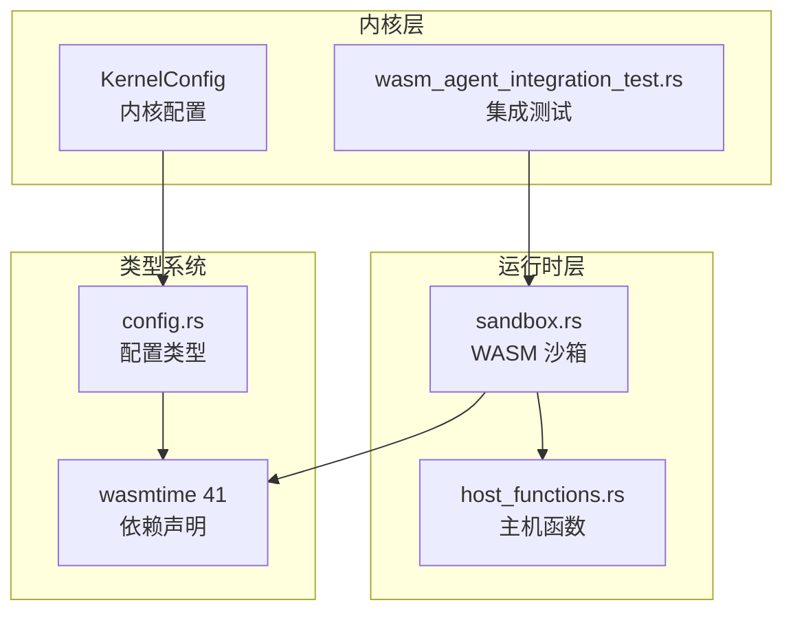
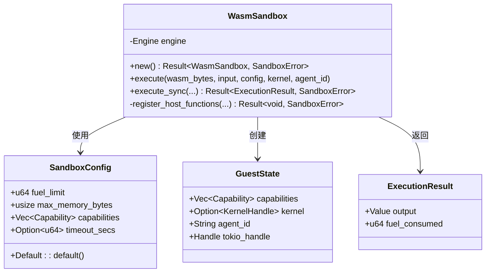
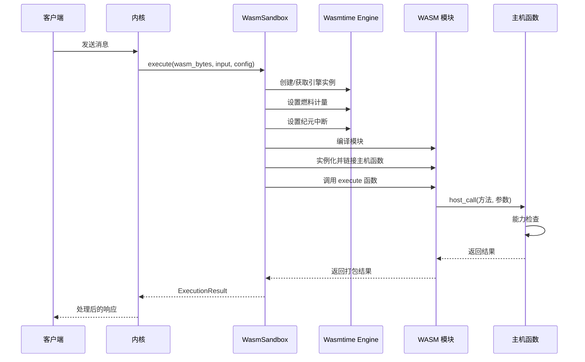
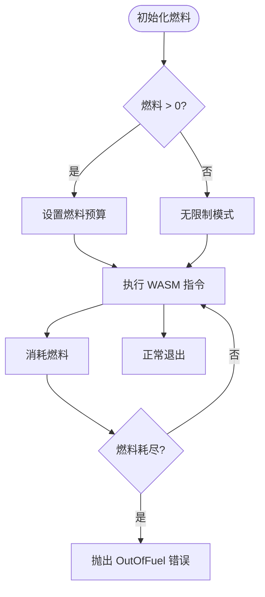
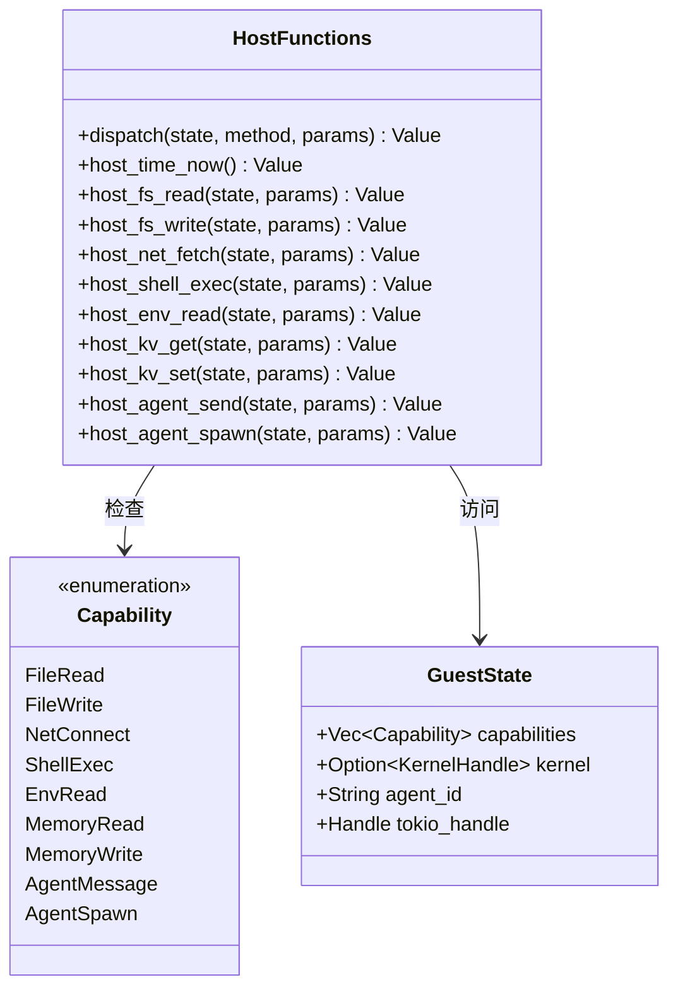
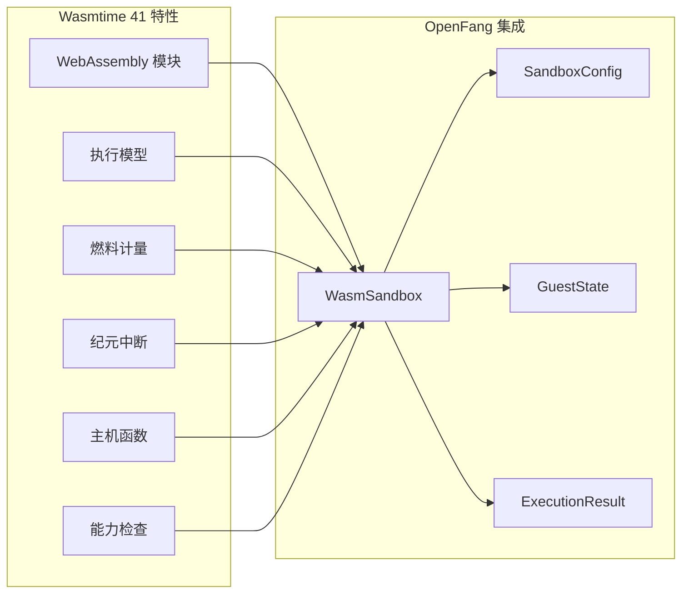
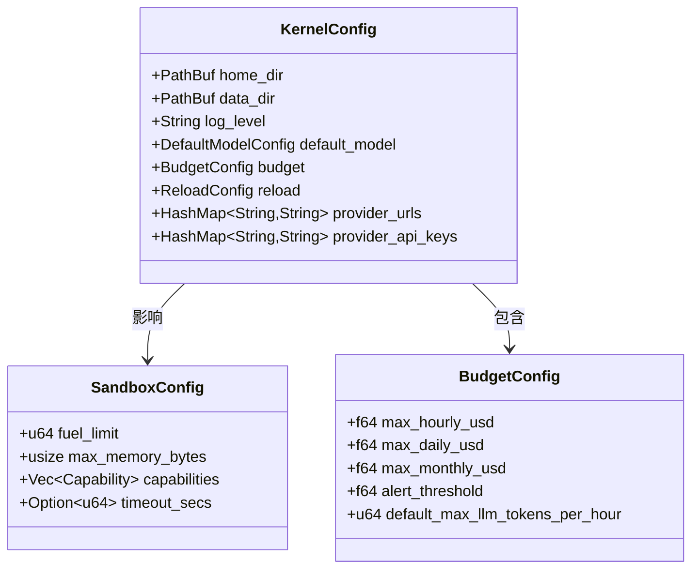
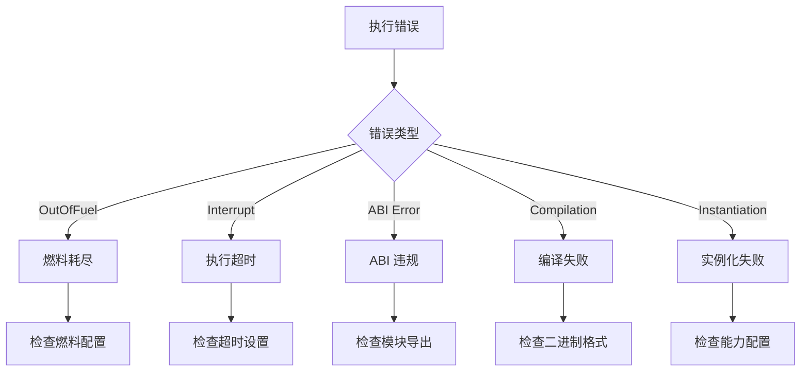

# Wasmtime 引擎配置

<cite>
**本文档引用的文件**
- [sandbox.rs](file://crates/openfang-runtime/src/sandbox.rs)
- [host_functions.rs](file://crates/openfang-runtime/src/host_functions.rs)
- [wasm_agent_integration_test.rs](file://crates/openfang-kernel/tests/wasm_agent_integration_test.rs)
- [Cargo.toml](file://Cargo.toml)
- [config.rs](file://crates/openfang-types/src/config.rs)
</cite>

## 目录
1. [简介](#简介)
2. [项目结构](#项目结构)
3. [核心组件](#核心组件)
4. [架构概览](#架构概览)
5. [详细组件分析](#详细组件分析)
6. [依赖关系分析](#依赖关系分析)
7. [性能考虑](#性能考虑)
8. [故障排除指南](#故障排除指南)
9. [结论](#结论)

## 简介

本文档深入解析 OpenFang 项目中的 Wasmtime 引擎配置与使用方式。项目通过 Wasmtime 实现安全的 WASM 沙箱执行环境，支持燃料计量（fuel metering）和纪元中断（epoch interruption）两种资源控制机制，确保未授权代码不会消耗过多 CPU 或内存资源。

Wasmtime 在本项目中的关键作用包括：
- 提供安全的 WASM 执行环境
- 支持燃料计量（基于指令数的 CPU 限制）
- 支持纪元中断（基于时间的执行超时控制）
- 提供主机函数绑定，实现能力化权限控制

## 项目结构

OpenFang 项目采用多 crate 架构，Wasmtime 相关功能主要集中在以下模块：



**图表来源**
- [sandbox.rs:1-608](file://crates/openfang-runtime/src/sandbox.rs#L1-L608)
- [host_functions.rs:1-669](file://crates/openfang-runtime/src/host_functions.rs#L1-L669)
- [wasm_agent_integration_test.rs:1-411](file://crates/openfang-kernel/tests/wasm_agent_integration_test.rs#L1-L411)
- [Cargo.toml:80-82](file://Cargo.toml#L80-L82)

**章节来源**
- [Cargo.toml:1-160](file://Cargo.toml#L1-L160)
- [sandbox.rs:1-608](file://crates/openfang-runtime/src/sandbox.rs#L1-L608)

## 核心组件

### WasmSandbox 引擎配置

WasmSandbox 是 Wasmtime 引擎的核心封装，负责创建和管理引擎实例：



**图表来源**
- [sandbox.rs:33-275](file://crates/openfang-runtime/src/sandbox.rs#L33-L275)

### 配置参数详解

| 参数名称 | 类型 | 默认值 | 描述 |
|---------|------|--------|------|
| fuel_limit | u64 | 1,000,000 | CPU 指令预算上限（0 表示无限制） |
| max_memory_bytes | usize | 16,777,216 (16MB) | 最大线性内存限制（预留未来实现） |
| capabilities | Vec<Capability> | 空数组 | 授予沙箱实例的能力列表 |
| timeout_secs | Option<u64> | None (30秒) | 墙钟超时时间（秒） |

**章节来源**
- [sandbox.rs:33-56](file://crates/openfang-runtime/src/sandbox.rs#L33-L56)

## 架构概览

Wasmtime 在 OpenFang 中的执行流程如下：



**图表来源**
- [sandbox.rs:112-275](file://crates/openfang-runtime/src/sandbox.rs#L112-L275)
- [host_functions.rs:16-49](file://crates/openfang-runtime/src/host_functions.rs#L16-L49)

## 详细组件分析

### 引擎初始化与配置

WasmSandbox 在创建时会进行关键的引擎配置：

```mermaid
flowchart TD
Start([创建 WasmSandbox]) --> NewConfig[创建 Config 实例]
NewConfig --> EnableFuel[启用燃料计量 consume_fuel(true)]
EnableFuel --> EnableEpoch[启用纪元中断 epoch_interruption(true)]
EnableEpoch --> CreateEngine[创建 Engine 实例]
CreateEngine --> Ready[引擎就绪]
Ready --> Execute[执行 WASM 模块]
Execute --> SetFuel[设置燃料预算]
Execute --> SetEpoch[设置纪元截止]
Execute --> LinkHost[链接主机函数]
Execute --> RunModule[运行模块]
```

**图表来源**
- [sandbox.rs:102-110](file://crates/openfang-runtime/src/sandbox.rs#L102-L110)

### 燃料计量机制

燃料计量是基于指令执行次数的 CPU 限制机制：



**图表来源**
- [sandbox.rs:170-175](file://crates/openfang-runtime/src/sandbox.rs#L170-L175)
- [sandbox.rs:234-237](file://crates/openfang-runtime/src/sandbox.rs#L234-L237)

### 纪元中断机制

纪元中断提供基于时间的执行超时控制：

```mermaid
flowchart TD
Start([设置纪元截止]) --> SetDeadline[store.set_epoch_deadline(1)]
SetDeadline --> StartTimer[启动超时计时器]
StartTimer --> Sleep[睡眠 timeout 秒]
Sleep --> IncrementEpoch[engine.increment_epoch()]
IncrementEpoch --> Interrupt[触发中断]
Interrupt --> Trap[生成 Trap::Interrupt]
Trap --> HandleError[捕获并处理错误]
HandleError --> TimeoutError[返回超时错误]
```

**图表来源**
- [sandbox.rs:177-184](file://crates/openfang-runtime/src/sandbox.rs#L177-L184)
- [sandbox.rs:238-244](file://crates/openfang-runtime/src/sandbox.rs#L238-L244)

### 主机函数绑定与能力检查

主机函数提供了受控的系统访问接口：



**图表来源**
- [host_functions.rs:16-49](file://crates/openfang-runtime/src/host_functions.rs#L16-L49)
- [host_functions.rs:55-67](file://crates/openfang-runtime/src/host_functions.rs#L55-L67)

**章节来源**
- [sandbox.rs:277-387](file://crates/openfang-runtime/src/sandbox.rs#L277-L387)
- [host_functions.rs:16-49](file://crates/openfang-runtime/src/host_functions.rs#L16-L49)

## 依赖关系分析

### Wasmtime 版本与特性

项目使用 Wasmtime 41 版本，具备以下关键特性：



**图表来源**
- [Cargo.toml:80-82](file://Cargo.toml#L80-L82)
- [sandbox.rs:102-110](file://crates/openfang-runtime/src/sandbox.rs#L102-L110)

### 内核配置集成

KernelConfig 为 Wasmtime 执行提供了全局配置上下文：



**图表来源**
- [config.rs:964-1159](file://crates/openfang-types/src/config.rs#L964-L1159)
- [config.rs:1151-1159](file://crates/openfang-types/src/config.rs#L1151-L1159)

**章节来源**
- [Cargo.toml:80-82](file://Cargo.toml#L80-L82)
- [config.rs:964-1159](file://crates/openfang-types/src/config.rs#L964-L1159)

## 性能考虑

### 燃料计量优化

1. **合理设置燃料预算**：根据模块复杂度和预期执行时间调整 `fuel_limit`
2. **监控燃料消耗**：通过 `ExecutionResult.fuel_consumed` 追踪实际消耗
3. **避免过度分配**：过高的燃料预算会降低资源保护效果

### 纪元中断配置

1. **超时时间选择**：根据业务需求设置合适的 `timeout_secs`
2. **后台监控**：使用独立线程处理超时，不影响主执行线程
3. **错误处理**：正确区分燃料耗尽和超时错误

### 内存管理

1. **最大内存限制**：当前版本预留 `max_memory_bytes` 字段
2. **内存分配策略**：WASM 模块通过 `alloc` 函数请求内存
3. **边界检查**：严格验证内存访问范围

## 故障排除指南

### 常见错误类型



**图表来源**
- [sandbox.rs:80-92](file://crates/openfang-runtime/src/sandbox.rs#L80-L92)

### 调试建议

1. **启用详细日志**：检查 `GuestState.agent_id` 相关的日志输出
2. **监控燃料消耗**：记录 `ExecutionResult.fuel_consumed` 值
3. **验证模块兼容性**：确保模块满足必需的导出函数
4. **测试超时行为**：使用无限循环模块验证纪元中断机制

**章节来源**
- [sandbox.rs:234-246](file://crates/openfang-runtime/src/sandbox.rs#L234-L246)
- [wasm_agent_integration_test.rs:199-223](file://crates/openfang-kernel/tests/wasm_agent_integration_test.rs#L199-L223)

## 结论

OpenFang 项目中的 Wasmtime 配置展现了现代 WebAssembly 安全执行的最佳实践。通过燃料计量和纪元中断双重机制，系统实现了对 CPU 和时间资源的有效控制。主机函数的能力检查进一步确保了最小权限原则的实施。

关键优势包括：
- **安全性**：默认拒绝所有操作，仅在明确授权下允许特定能力
- **可控性**：精确的资源限制和超时控制
- **可观测性**：详细的执行统计和日志记录
- **可扩展性**：模块化的架构支持功能扩展

对于生产环境部署，建议：
1. 根据实际负载调整燃料预算和超时设置
2. 为不同类型的模块制定差异化的资源配置
3. 建立完善的监控和告警机制
4. 定期审查和更新能力授权策略