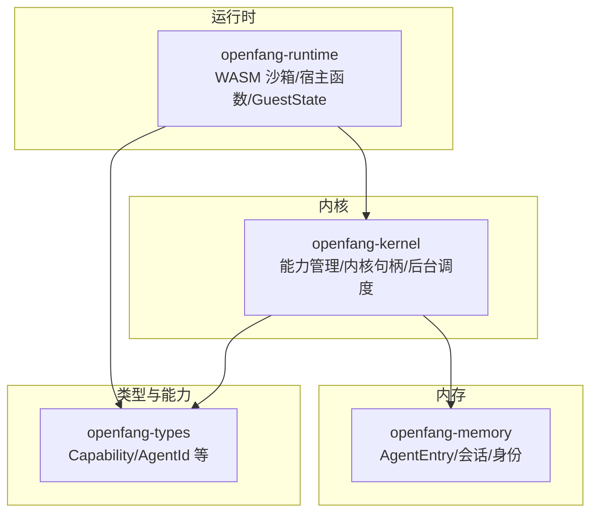
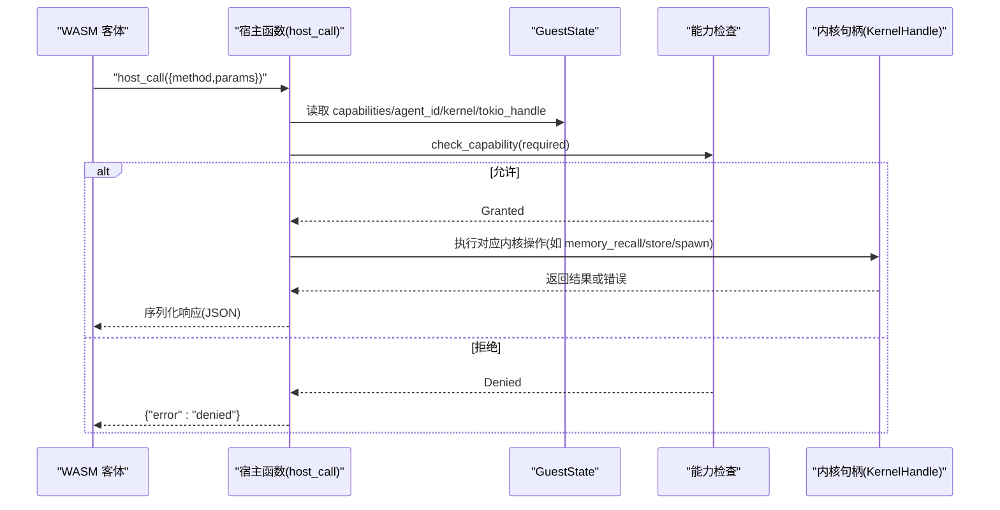
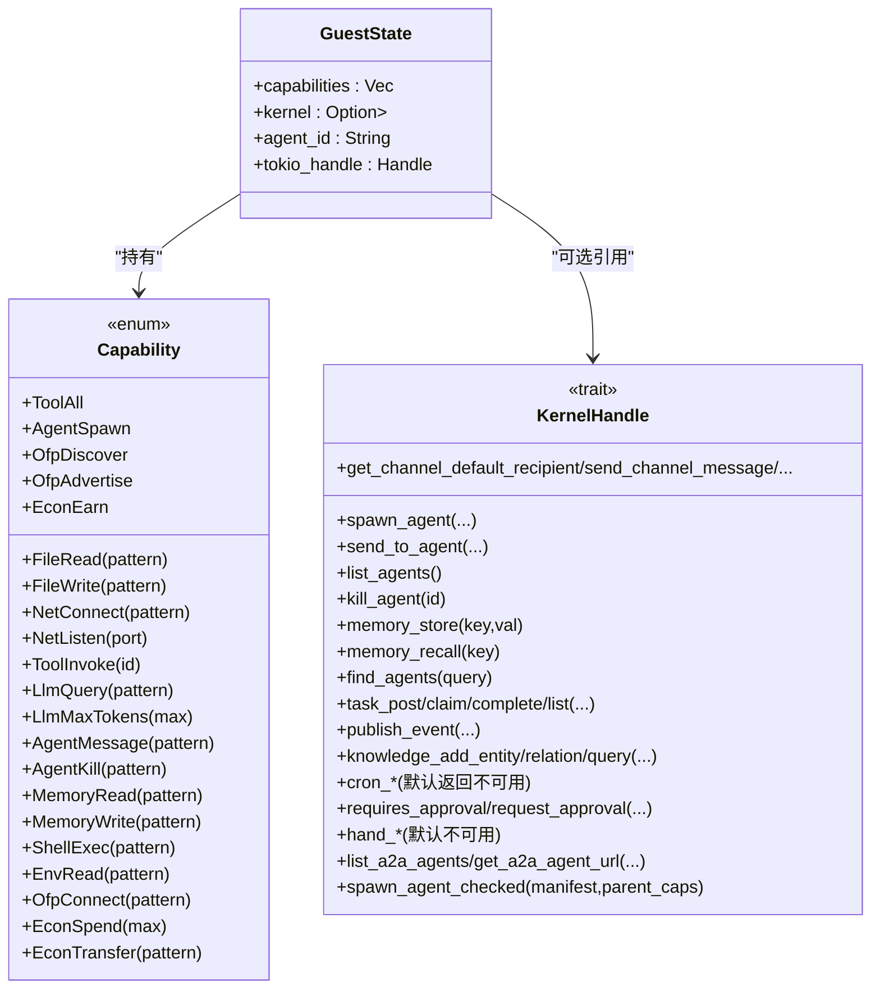
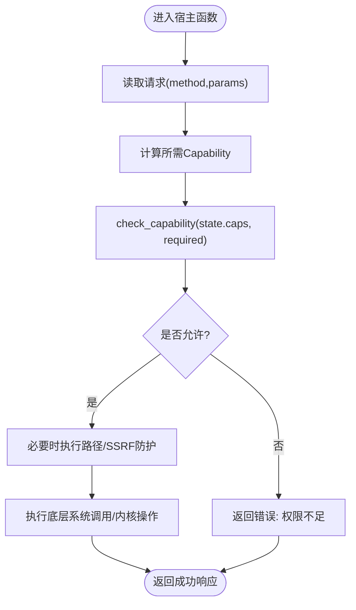
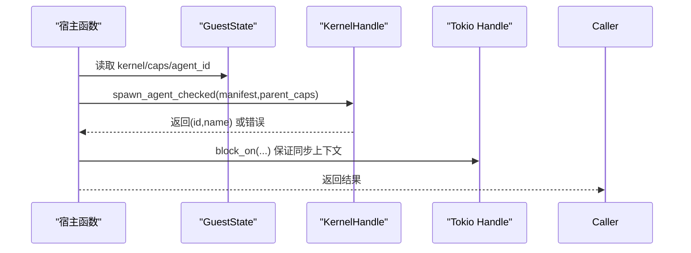
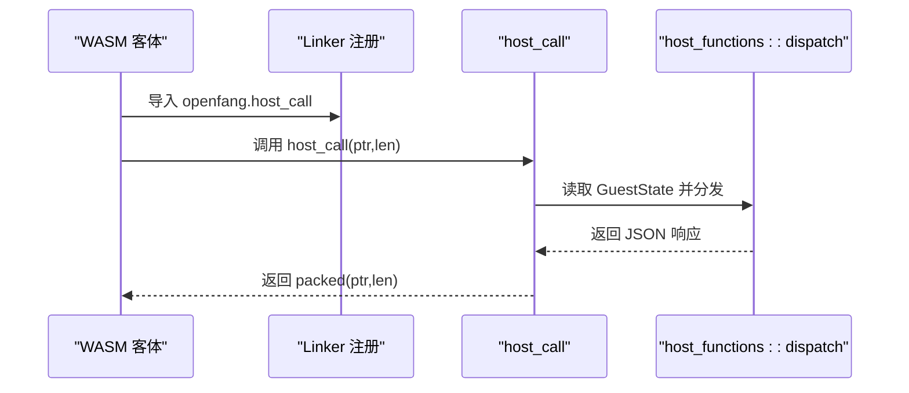
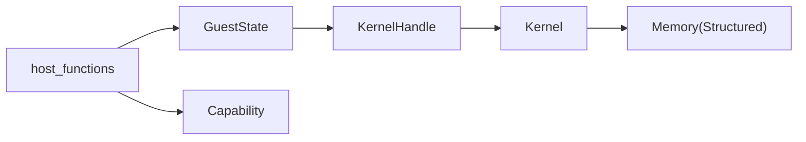

# 客体状态管理

<cite>
**本文引用的文件**
- [crates/openfang-runtime/src/sandbox.rs](file://crates/openfang-runtime/src/sandbox.rs)
- [crates/openfang-runtime/src/host_functions.rs](file://crates/openfang-runtime/src/host_functions.rs)
- [crates/openfang-runtime/src/kernel_handle.rs](file://crates/openfang-runtime/src/kernel_handle.rs)
- [crates/openfang-types/src/capability.rs](file://crates/openfang-types/src/capability.rs)
- [crates/openfang-types/src/agent.rs](file://crates/openfang-types/src/agent.rs)
- [crates/openfang-kernel/src/capabilities.rs](file://crates/openfang-kernel/src/capabilities.rs)
- [crates/openfang-kernel/src/kernel.rs](file://crates/openfang-kernel/src/kernel.rs)
- [crates/openfang-kernel/src/background.rs](file://crates/openfang-kernel/src/background.rs)
- [crates/openfang-memory/src/structured.rs](file://crates/openfang-memory/src/structured.rs)
</cite>

## 目录
1. [引言](#引言)
2. [项目结构](#项目结构)
3. [核心组件](#核心组件)
4. [架构总览](#架构总览)
5. [详细组件分析](#详细组件分析)
6. [依赖关系分析](#依赖关系分析)
7. [性能考量](#性能考量)
8. [故障排查指南](#故障排查指南)
9. [结论](#结论)
10. [附录](#附录)

## 引言
本文件围绕“客体状态管理”主题，系统阐述 GuestState 的设计理念与实现细节，覆盖能力权限检查、内核句柄访问、代理 ID 标识与 Tokio 运行时句柄的作用；并深入说明状态在 WASM 实例间的传递机制，以及宿主函数如何访问这些状态信息。文档同时解释与工具系统和内核通信的关系，并给出状态管理的最佳实践与排障建议。

## 项目结构
本仓库采用多 crate 组织方式，与客体状态管理直接相关的模块分布如下：
- openfang-runtime：WASM 沙箱执行引擎、宿主函数分发、GuestState 定义与传递
- openfang-types：通用类型（含 Capability、AgentId 等）
- openfang-kernel：内核能力管理、内核句柄接口、后台任务调度
- openfang-memory：持久化存储（AgentEntry、会话与身份等）

**图表来源**
- [crates/openfang-runtime/src/sandbox.rs:58-68](file://crates/openfang-runtime/src/sandbox.rs#L58-L68)
- [crates/openfang-types/src/capability.rs:12-72](file://crates/openfang-types/src/capability.rs#L12-L72)
- [crates/openfang-kernel/src/capabilities.rs:8-62](file://crates/openfang-kernel/src/capabilities.rs#L8-L62)
- [crates/openfang-kernel/src/kernel.rs:5474-5503](file://crates/openfang-kernel/src/kernel.rs#L5474-L5503)
- [crates/openfang-memory/src/structured.rs:160-231](file://crates/openfang-memory/src/structured.rs#L160-L231)

**章节来源**
- [crates/openfang-runtime/src/sandbox.rs:1-200](file://crates/openfang-runtime/src/sandbox.rs#L1-L200)
- [crates/openfang-types/src/capability.rs:1-200](file://crates/openfang-types/src/capability.rs#L1-L200)
- [crates/openfang-kernel/src/capabilities.rs:1-95](file://crates/openfang-kernel/src/capabilities.rs#L1-L95)
- [crates/openfang-kernel/src/kernel.rs:5474-5503](file://crates/openfang-kernel/src/kernel.rs#L5474-L5503)
- [crates/openfang-memory/src/structured.rs:160-231](file://crates/openfang-memory/src/structured.rs#L160-L231)

## 核心组件
- GuestState：承载每个 WASM 实例的“客体状态”，包括已授予能力、内核句柄、代理 ID、Tokio 运行时句柄。该结构通过 Wasmtime Store 在宿主与客体之间传递，是能力检查与内核交互的上下文载体。
- 能力模型（Capability）：以枚举形式描述可执行操作及其匹配规则，支持通配与模式匹配，用于严格限制客体可执行的操作范围。
- 内核句柄（KernelHandle）：抽象出内核提供的跨代理能力（如 spawn、send、memory recall/store、任务队列、知识图谱等），避免运行时与内核耦合。
- 宿主函数（host_functions）：统一的“host_call”入口，按方法名分发到具体宿主函数，所有敏感操作均需通过能力检查。

**章节来源**
- [crates/openfang-runtime/src/sandbox.rs:58-68](file://crates/openfang-runtime/src/sandbox.rs#L58-L68)
- [crates/openfang-types/src/capability.rs:12-72](file://crates/openfang-types/src/capability.rs#L12-L72)
- [crates/openfang-runtime/src/kernel_handle.rs:26-136](file://crates/openfang-runtime/src/kernel_handle.rs#L26-L136)
- [crates/openfang-runtime/src/host_functions.rs:16-49](file://crates/openfang-runtime/src/host_functions.rs#L16-L49)

## 架构总览
下图展示了从 WASM 客体发起调用到宿主函数执行、能力检查与内核交互的端到端流程。

**图表来源**
- [crates/openfang-runtime/src/sandbox.rs:277-387](file://crates/openfang-runtime/src/sandbox.rs#L277-L387)
- [crates/openfang-runtime/src/host_functions.rs:16-67](file://crates/openfang-runtime/src/host_functions.rs#L16-L67)
- [crates/openfang-runtime/src/kernel_handle.rs:26-136](file://crates/openfang-runtime/src/kernel_handle.rs#L26-L136)

## 详细组件分析

### GuestState 设计与实现
- 字段职责
  - capabilities：授予客体的 Capability 列表，作为所有宿主函数前置检查依据
  - kernel：可选的内核句柄，用于跨代理交互与共享内存等
  - agent_id：客体所属代理的标识字符串，便于日志与审计
  - tokio_handle：同步宿主函数中进行异步操作所需的运行时句柄
- 初始化路径
  - 在沙箱执行前，将配置中的 capabilities、可选 kernel、agent_id、当前 tokio 句柄注入到 Store 中，供后续宿主函数只读访问
- 传递机制
  - 通过 Wasmtime 的 Caller<'_, GuestState> 将状态传入宿主函数，确保每个方法仅能读取状态，不产生意外写入

**图表来源**
- [crates/openfang-runtime/src/sandbox.rs:58-68](file://crates/openfang-runtime/src/sandbox.rs#L58-L68)
- [crates/openfang-types/src/capability.rs:12-72](file://crates/openfang-types/src/capability.rs#L12-L72)
- [crates/openfang-runtime/src/kernel_handle.rs:26-136](file://crates/openfang-runtime/src/kernel_handle.rs#L26-L136)

**章节来源**
- [crates/openfang-runtime/src/sandbox.rs:58-68](file://crates/openfang-runtime/src/sandbox.rs#L58-L68)
- [crates/openfang-types/src/capability.rs:12-72](file://crates/openfang-types/src/capability.rs#L12-L72)
- [crates/openfang-runtime/src/kernel_handle.rs:26-136](file://crates/openfang-runtime/src/kernel_handle.rs#L26-L136)

### 能力权限检查机制
- 检查流程
  - 宿主函数收到请求后，先调用 check_capability 对比 GuestState 中的 capabilities 与所需 Capability
  - 匹配规则由 capability_matches 提供，支持通配符、前后缀匹配与数值阈值比较
- 防护措施
  - 文件系统：路径解析阶段拒绝 “..” 组件，强制规范化，防止越权访问
  - 网络：URL 仅允许 http/https，解析主机后对私有/回环地址进行阻断
- 子进程与环境变量：ShellExec 与 EnvRead 均需相应能力授权

**图表来源**
- [crates/openfang-runtime/src/host_functions.rs:55-67](file://crates/openfang-runtime/src/host_functions.rs#L55-L67)
- [crates/openfang-runtime/src/host_functions.rs:73-117](file://crates/openfang-runtime/src/host_functions.rs#L73-L117)
- [crates/openfang-runtime/src/host_functions.rs:123-176](file://crates/openfang-runtime/src/host_functions.rs#L123-L176)

**章节来源**
- [crates/openfang-runtime/src/host_functions.rs:55-67](file://crates/openfang-runtime/src/host_functions.rs#L55-L67)
- [crates/openfang-types/src/capability.rs:106-186](file://crates/openfang-types/src/capability.rs#L106-L186)

### 内核句柄访问与子代理生命周期
- 访问点
  - 宿主函数在需要跨代理能力时，从 GuestState.kernel 获取 KernelHandle 并调用相应方法
- 子代理创建
  - agent_spawn 会将父代理的能力集合与待创建子代理清单进行继承校验，防止越权
  - 通过 tokio_handle.block_on 在同步宿主函数中安全地等待异步内核操作完成
- 共享内存
  - kv_get/kv_set 通过 kernel.memory_recall/memory_store 实现跨代理键值存取

**图表来源**
- [crates/openfang-runtime/src/host_functions.rs:471-492](file://crates/openfang-runtime/src/host_functions.rs#L471-L492)
- [crates/openfang-runtime/src/kernel_handle.rs:241-254](file://crates/openfang-runtime/src/kernel_handle.rs#L241-L254)

**章节来源**
- [crates/openfang-runtime/src/host_functions.rs:471-492](file://crates/openfang-runtime/src/host_functions.rs#L471-L492)
- [crates/openfang-runtime/src/kernel_handle.rs:241-254](file://crates/openfang-runtime/src/kernel_handle.rs#L241-L254)

### 宿主函数与状态传递
- host_call 统一分发
  - 宿主函数通过 openfang.host_call 接收 JSON 请求，解析 method 与 params
  - 将 GuestState 作为上下文传入具体处理函数，实现只读访问
- 日志与安全
  - host_log 不做能力检查，但会记录 agent_id 以便追踪
  - 所有敏感操作均需能力检查并通过内存边界检查

**图表来源**
- [crates/openfang-runtime/src/sandbox.rs:277-387](file://crates/openfang-runtime/src/sandbox.rs#L277-L387)
- [crates/openfang-runtime/src/host_functions.rs:16-49](file://crates/openfang-runtime/src/host_functions.rs#L16-L49)

**章节来源**
- [crates/openfang-runtime/src/sandbox.rs:277-387](file://crates/openfang-runtime/src/sandbox.rs#L277-L387)
- [crates/openfang-runtime/src/host_functions.rs:16-49](file://crates/openfang-runtime/src/host_functions.rs#L16-L49)

### 工具系统与内核通信
- 工具调用审批
  - requires_approval/request_approval 由内核提供，默认自动批准，可按策略扩展
- 知识图谱与任务队列
  - knowledge_* 与 task_* 方法用于构建更复杂的协作能力
- 通道适配器
  - 支持通过 send_channel_message/send_channel_media 发送消息与媒体

**章节来源**
- [crates/openfang-runtime/src/kernel_handle.rs:120-204](file://crates/openfang-runtime/src/kernel_handle.rs#L120-L204)

### 与工具系统和内核通信的关系
- 能力继承与子代理
  - 内核将 manifest 中声明的能力转换为 Capability 列表，再通过 validate_capability_inheritance 确保子代理能力不得超出父代理
- 后台任务与触发
  - 内核后台循环根据调度模式驱动代理执行，宿主函数可在需要时通过内核句柄提交任务或发布事件

**章节来源**
- [crates/openfang-kernel/src/kernel.rs:5474-5503](file://crates/openfang-kernel/src/kernel.rs#L5474-L5503)
- [crates/openfang-kernel/src/background.rs:163-194](file://crates/openfang-kernel/src/background.rs#L163-L194)

## 依赖关系分析
- 运行时依赖类型层的 Capability 与 AgentId
- 宿主函数依赖 GuestState 的只读上下文
- 内核提供 KernelHandle 抽象，屏蔽具体实现细节
- 内存层负责持久化 AgentEntry、会话与身份信息

**图表来源**
- [crates/openfang-runtime/src/host_functions.rs:9-14](file://crates/openfang-runtime/src/host_functions.rs#L9-L14)
- [crates/openfang-runtime/src/sandbox.rs:26-31](file://crates/openfang-runtime/src/sandbox.rs#L26-L31)
- [crates/openfang-kernel/src/kernel.rs:5474-5503](file://crates/openfang-kernel/src/kernel.rs#L5474-L5503)
- [crates/openfang-memory/src/structured.rs:160-231](file://crates/openfang-memory/src/structured.rs#L160-L231)

**章节来源**
- [crates/openfang-runtime/src/host_functions.rs:9-14](file://crates/openfang-runtime/src/host_functions.rs#L9-L14)
- [crates/openfang-runtime/src/sandbox.rs:26-31](file://crates/openfang-runtime/src/sandbox.rs#L26-L31)
- [crates/openfang-kernel/src/kernel.rs:5474-5503](file://crates/openfang-kernel/src/kernel.rs#L5474-L5503)
- [crates/openfang-memory/src/structured.rs:160-231](file://crates/openfang-memory/src/structured.rs#L160-L231)

## 性能考量
- 燃料计量与限时中断
  - 沙箱启用燃料计量与基于 epoch 的中断，防止 CPU/时钟超支导致的资源滥用
- 同步与异步分离
  - 宿主函数在同步上下文中通过 tokio_handle.block_on 调用异步内核操作，避免阻塞事件循环
- 内存边界与序列化
  - 客体输出经由 alloc 分配并拷贝至 guest memory，随后打包指针长度返回，减少不必要的复制

**章节来源**
- [crates/openfang-runtime/src/sandbox.rs:104-143](file://crates/openfang-runtime/src/sandbox.rs#L104-L143)
- [crates/openfang-runtime/src/sandbox.rs:170-184](file://crates/openfang-runtime/src/sandbox.rs#L170-L184)
- [crates/openfang-runtime/src/sandbox.rs:277-387](file://crates/openfang-runtime/src/sandbox.rs#L277-L387)

## 故障排查指南
- 常见错误类型
  - 能力不足：返回 {"error":"Capability denied: ..."}
  - 路径越权：返回 {"error":"Path traversal denied: .. components forbidden"}
  - SSRF 阻断：返回 {"error":"SSRF blocked: ..."}
  - 内核句柄缺失：返回 {"error":"No kernel handle available"}
- 排查步骤
  - 确认 GuestState.capabilities 是否包含所需 Capability
  - 检查路径是否包含 “..” 或非法文件名
  - 核对网络 URL 是否为 http/https 且不指向私网地址
  - 确保在宿主函数中正确获取并使用 GuestState.kernel

**章节来源**
- [crates/openfang-runtime/src/host_functions.rs:55-67](file://crates/openfang-runtime/src/host_functions.rs#L55-L67)
- [crates/openfang-runtime/src/host_functions.rs:73-117](file://crates/openfang-runtime/src/host_functions.rs#L73-L117)
- [crates/openfang-runtime/src/host_functions.rs:392-411](file://crates/openfang-runtime/src/host_functions.rs#L392-L411)

## 结论
GuestState 作为 WASM 客体的只读上下文，将能力、内核句柄、代理标识与运行时句柄有机整合，配合统一的宿主函数分发与严格的权限检查，实现了在隔离沙箱内的可控能力开放。通过 KernelHandle 抽象，运行时与内核解耦，既保障了安全性，又提供了强大的跨代理协作能力。遵循本文最佳实践，可有效提升系统的稳定性与可维护性。

## 附录

### 最佳实践清单
- 明确最小权限原则：仅授予客体实际需要的 Capability
- 使用模式匹配：优先使用通配与前缀/后缀匹配，避免过度宽泛授权
- 路径与网络双重防护：始终进行路径规范化与 SSRF 检查
- 异步安全：在同步宿主函数中通过 tokio_handle.block_on 访问内核
- 审批与审计：对高风险工具启用审批流程并记录 agent_id

### 示例参考（路径）
- 宿主函数分发与能力检查
  - [crates/openfang-runtime/src/host_functions.rs:16-67](file://crates/openfang-runtime/src/host_functions.rs#L16-L67)
- 文件系统与网络访问
  - [crates/openfang-runtime/src/host_functions.rs:194-265](file://crates/openfang-runtime/src/host_functions.rs#L194-L265)
  - [crates/openfang-runtime/src/host_functions.rs:123-176](file://crates/openfang-runtime/src/host_functions.rs#L123-L176)
- 内核句柄与子代理创建
  - [crates/openfang-runtime/src/host_functions.rs:471-492](file://crates/openfang-runtime/src/host_functions.rs#L471-L492)
  - [crates/openfang-runtime/src/kernel_handle.rs:241-254](file://crates/openfang-runtime/src/kernel_handle.rs#L241-L254)
- 能力继承校验
  - [crates/openfang-kernel/src/kernel.rs:5474-5503](file://crates/openfang-kernel/src/kernel.rs#L5474-L5503)
- 持久化与会话
  - [crates/openfang-memory/src/structured.rs:160-231](file://crates/openfang-memory/src/structured.rs#L160-L231)