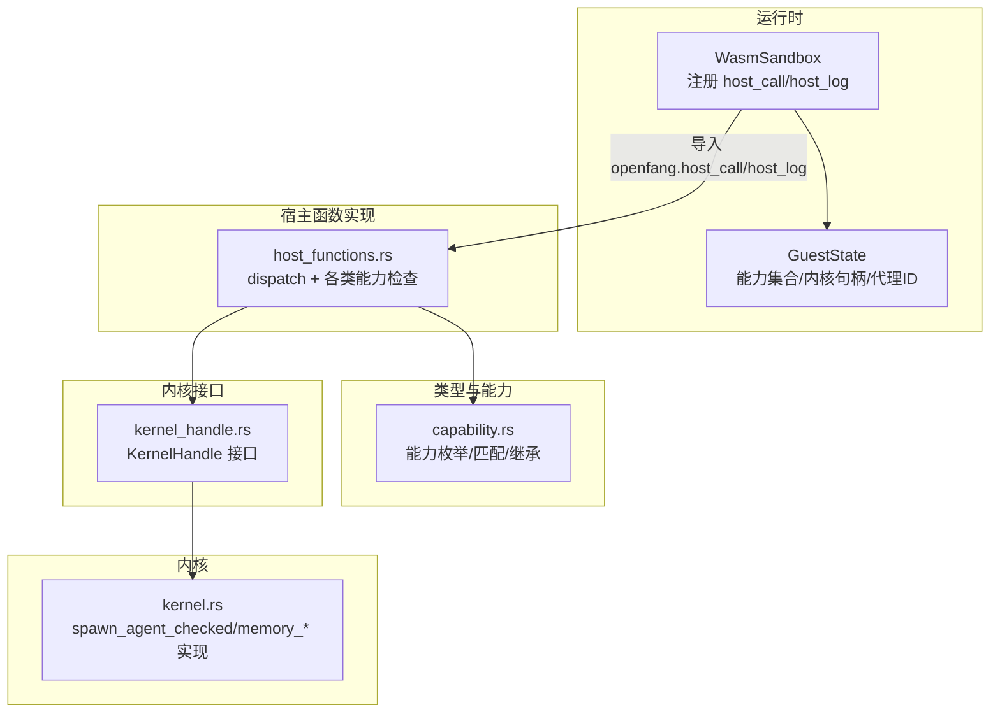
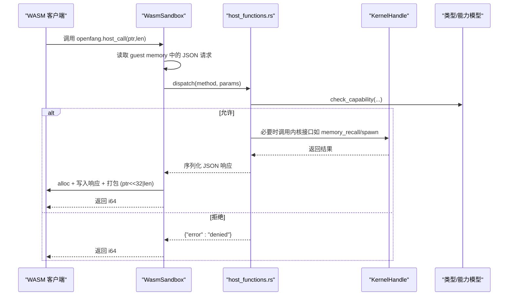
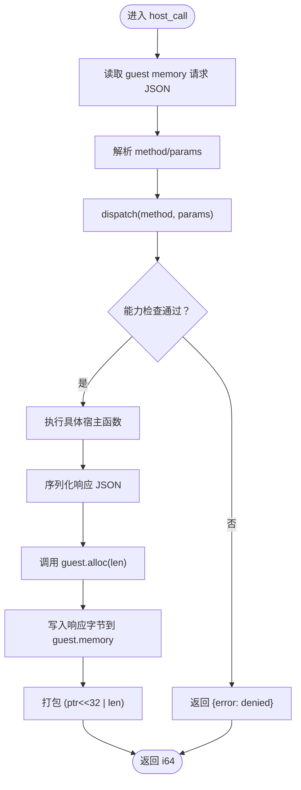
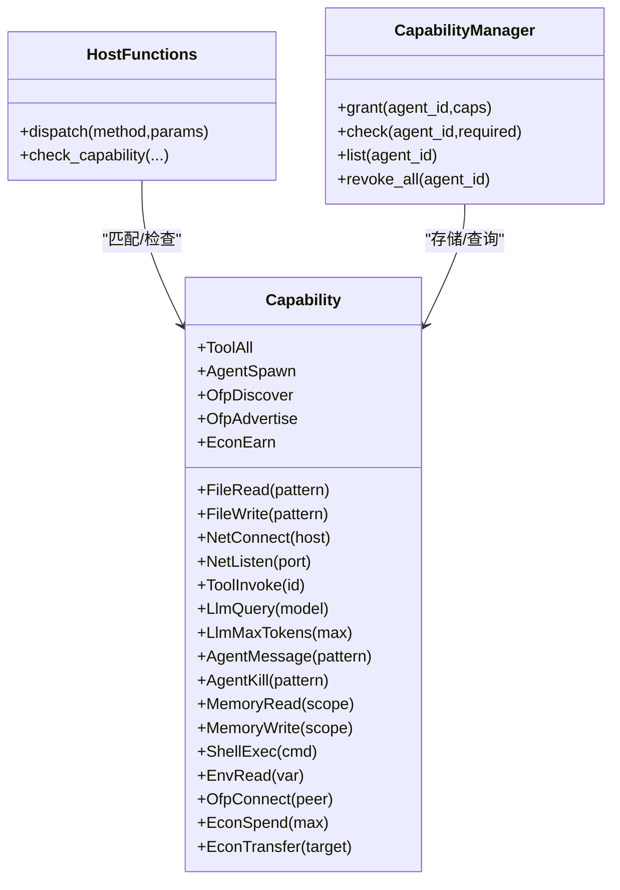
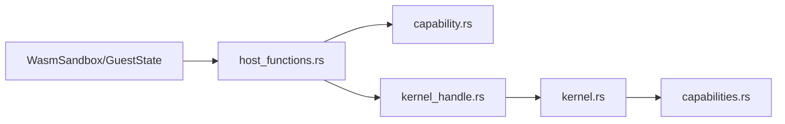

# 宿主函数绑定

<cite>
**本文引用的文件**
- [host_functions.rs](file://crates/openfang-runtime/src/host_functions.rs)
- [sandbox.rs](file://crates/openfang-runtime/src/sandbox.rs)
- [kernel_handle.rs](file://crates/openfang-runtime/src/kernel_handle.rs)
- [capability.rs](file://crates/openfang-types/src/capability.rs)
- [capabilities.rs](file://crates/openfang-kernel/src/capabilities.rs)
- [kernel.rs](file://crates/openfang-kernel/src/kernel.rs)
</cite>

## 目录
1. [简介](#简介)
2. [项目结构](#项目结构)
3. [核心组件](#核心组件)
4. [架构总览](#架构总览)
5. [详细组件分析](#详细组件分析)
6. [依赖分析](#依赖分析)
7. [性能考虑](#性能考虑)
8. [故障排查指南](#故障排查指南)
9. [结论](#结论)
10. [附录：扩展与调试指南](#附录扩展与调试指南)

## 简介
本技术文档聚焦于 openfang 模块中的“宿主函数绑定”系统，系统性解析以下关键点：
- host_call 与 host_log 的实现原理与调用流程
- JSON 请求/响应协议与跨边界数据传输（内存管理与指针打包）
- 能力检查系统（capability）在每次宿主调用前进行权限验证
- 不同类型系统调用的处理策略（文件系统、网络、环境变量、内存KV、代理交互等）
- 如何注册新的宿主函数、实现自定义能力检查与处理跨边界数据传输
- 与工具系统和内核的集成关系
- 扩展与调试指南

## 项目结构
宿主函数绑定系统主要分布在以下模块：
- 运行时沙箱层：负责将 WASM 客户端与宿主函数桥接，执行能力检查与内存管理
- 宿主函数实现层：提供具体的能力受限操作
- 类型与能力模型：定义能力枚举、匹配规则与继承约束
- 内核接口层：为宿主函数提供跨代理交互与共享内存能力

图表来源
- [sandbox.rs:277-387](file://crates/openfang-runtime/src/sandbox.rs#L277-L387)
- [host_functions.rs:16-49](file://crates/openfang-runtime/src/host_functions.rs#L16-L49)
- [capability.rs:9-72](file://crates/openfang-types/src/capability.rs#L9-L72)
- [kernel_handle.rs:27-51](file://crates/openfang-runtime/src/kernel_handle.rs#L27-L51)
- [kernel.rs:5779-5798](file://crates/openfang-kernel/src/kernel.rs#L5779-L5798)

章节来源
- [sandbox.rs:1-120](file://crates/openfang-runtime/src/sandbox.rs#L1-L120)
- [host_functions.rs:1-50](file://crates/openfang-runtime/src/host_functions.rs#L1-L50)
- [capability.rs:1-72](file://crates/openfang-types/src/capability.rs#L1-L72)
- [kernel_handle.rs:1-51](file://crates/openfang-runtime/src/kernel_handle.rs#L1-L51)
- [kernel.rs:5779-5798](file://crates/openfang-kernel/src/kernel.rs#L5779-L5798)

## 核心组件
- 宿主函数注册与调用分发
  - 在沙箱中注册 openfang.host_call 与 openfang.host_log
  - host_call 读取请求 JSON，按 method 分发到具体宿主函数，并返回打包后的结果指针
  - host_log 提供轻量日志，无需能力检查
- 能力检查与安全策略
  - 统一的 check_capability 与 capability_matches
  - 针对路径遍历、SSRF、私有IP访问等安全加固
- 跨边界数据传输
  - 使用 guest memory 与 alloc 导出进行双向数据交换
  - 返回值通过 i64 打包 (ptr<<32 | len)，便于 WASM 侧读取
- 内核集成
  - 通过 KernelHandle 抽象与内核交互（spawn、send、memory recall/store）

章节来源
- [sandbox.rs:277-387](file://crates/openfang-runtime/src/sandbox.rs#L277-L387)
- [host_functions.rs:55-67](file://crates/openfang-runtime/src/host_functions.rs#L55-L67)
- [capability.rs:100-166](file://crates/openfang-types/src/capability.rs#L100-L166)
- [kernel_handle.rs:27-51](file://crates/openfang-runtime/src/kernel_handle.rs#L27-L51)

## 架构总览
下图展示了从 WASM 客户端发起一次能力受限调用到宿主函数执行与返回的完整链路。

图表来源
- [sandbox.rs:282-346](file://crates/openfang-runtime/src/sandbox.rs#L282-L346)
- [host_functions.rs:16-49](file://crates/openfang-runtime/src/host_functions.rs#L16-L49)
- [kernel_handle.rs:27-51](file://crates/openfang-runtime/src/kernel_handle.rs#L27-L51)
- [capability.rs:100-166](file://crates/openfang-types/src/capability.rs#L100-L166)

## 详细组件分析

### host_call：统一调度与能力检查
- 请求协议
  - 请求 JSON 结构：{"method": "...", "params": {...}}
  - 参数校验：缺失参数时直接返回错误
- 能力检查
  - 对每类方法进行能力匹配，未授予则返回错误
  - 特殊方法（如 time_now）无需能力
- 响应协议
  - 将响应序列化为 JSON 字节，写入 guest memory
  - 返回 i64：高 32 位为指针，低 32 位为长度
- 安全加固
  - 文件系统：路径解析拒绝 “..” 遍历；写入前解析父目录并二次校验
  - 网络：仅允许 http/https；禁止私有/环回地址；主机名白名单
  - Shell：使用命令+参数直传，避免 shell 注入

图表来源
- [sandbox.rs:282-346](file://crates/openfang-runtime/src/sandbox.rs#L282-L346)
- [host_functions.rs:16-49](file://crates/openfang-runtime/src/host_functions.rs#L16-L49)

章节来源
- [sandbox.rs:277-347](file://crates/openfang-runtime/src/sandbox.rs#L277-L347)
- [host_functions.rs:16-49](file://crates/openfang-runtime/src/host_functions.rs#L16-L49)

### host_log：轻量日志通道
- 无能力检查
- 从 guest memory 读取 UTF-8 日志消息，按级别输出到 tracing
- 边界检查：越界即报错

章节来源
- [sandbox.rs:350-384](file://crates/openfang-runtime/src/sandbox.rs#L350-L384)

### 能力检查系统与匹配规则
- 能力枚举覆盖文件系统、网络、工具、LLM、代理交互、内存、Shell、环境变量、OFP、经济等
- 匹配规则
  - 精确匹配、通配符 "*"、后缀/前缀/中间带 * 的 glob
  - 数值上限比较（如 LlmMaxTokens、EconSpend）
  - 特殊规则：ToolAll 可授予任意 ToolInvoke
- 继承约束
  - 子代理能力必须是父代理能力的子集，防止权限提升

图表来源
- [capability.rs:9-72](file://crates/openfang-types/src/capability.rs#L9-L72)
- [host_functions.rs:55-67](file://crates/openfang-runtime/src/host_functions.rs#L55-L67)
- [capabilities.rs:8-62](file://crates/openfang-kernel/src/capabilities.rs#L8-L62)

章节来源
- [capability.rs:100-166](file://crates/openfang-types/src/capability.rs#L100-L166)
- [capabilities.rs:22-48](file://crates/openfang-kernel/src/capabilities.rs#L22-L48)

### 跨边界数据传输与内存管理
- WASM 客户端导出
  - memory：线性内存
  - alloc(size): 分配 size 字节并返回指针
  - execute(input_ptr, input_len): 主入口，返回 i64 打包值
- 宿主侧
  - 读取请求 JSON 并解析
  - 调用 guest.alloc 分配响应空间
  - 将响应 JSON 写入 guest.memory
  - 返回 i64：(ptr<<32) | len
- 边界检查
  - 越界读/写均抛出错误
  - 指针打包与解包严格按 32 位位宽

章节来源
- [sandbox.rs:1-120](file://crates/openfang-runtime/src/sandbox.rs#L1-L120)
- [sandbox.rs:212-275](file://crates/openfang-runtime/src/sandbox.rs#L212-L275)

### 与工具系统和内核的集成
- 工具系统
  - 内核根据代理配置与策略生成有效工具列表，结合能力模型决定可用工具
  - 支持 MCP 工具过滤与声明式工具白名单/黑名单
- 内核交互
  - KernelHandle 抽象屏蔽了运行时与内核的耦合
  - 宿主函数在需要时调用 memory_recall/store、agent_send/spawn 等
  - spawn_agent_checked 强制能力继承约束，防止子代理越权

章节来源
- [kernel.rs:5186-5503](file://crates/openfang-kernel/src/kernel.rs#L5186-L5503)
- [kernel.rs:5779-5798](file://crates/openfang-kernel/src/kernel.rs#L5779-L5798)
- [kernel_handle.rs:27-51](file://crates/openfang-runtime/src/kernel_handle.rs#L27-L51)
- [host_functions.rs:441-492](file://crates/openfang-runtime/src/host_functions.rs#L441-L492)

## 依赖分析
- 运行时沙箱依赖
  - GuestState：携带能力集合、内核句柄、代理ID、Tokio句柄
  - Wasmtime：编译、实例化、执行 WASM 模块
- 宿主函数依赖
  - capability.rs：能力枚举与匹配
  - kernel_handle.rs：内核交互抽象
- 内核依赖
  - capabilities.rs：能力存储与查询
  - kernel.rs：具体实现（memory recall/store、spawn_agent_checked 等）

图表来源
- [sandbox.rs:154-188](file://crates/openfang-runtime/src/sandbox.rs#L154-L188)
- [host_functions.rs:9-14](file://crates/openfang-runtime/src/host_functions.rs#L9-L14)
- [capability.rs:1-14](file://crates/openfang-types/src/capability.rs#L1-L14)
- [kernel_handle.rs:1-13](file://crates/openfang-runtime/src/kernel_handle.rs#L1-L13)
- [kernel.rs:5779-5798](file://crates/openfang-kernel/src/kernel.rs#L5779-L5798)
- [capabilities.rs:1-12](file://crates/openfang-kernel/src/capabilities.rs#L1-L12)

章节来源
- [sandbox.rs:154-188](file://crates/openfang-runtime/src/sandbox.rs#L154-L188)
- [host_functions.rs:9-14](file://crates/openfang-runtime/src/host_functions.rs#L9-L14)

## 性能考虑
- CPU 限制
  - 启用 fuel 计费与 epoch 中断，防止无限循环与长时间运行
- 内存与 I/O
  - 严格边界检查避免越界读写导致的额外开销
  - JSON 序列化/反序列化在宿主侧完成，尽量减少 guest 侧字符串处理
- 并发与异步
  - 宿主函数中需要异步操作时使用 Tokio 句柄，避免阻塞
- 调试与可观测性
  - host_log 提供多级别日志，便于定位问题

[本节为通用建议，不直接分析具体文件]

## 故障排查指南
- 常见错误与定位
  - “能力被拒绝”：确认代理是否具备相应 Capability；检查匹配规则（通配符、glob）
  - “请求/响应越界”：检查 guest.memory 边界与 alloc 分配大小
  - “未知 host 方法”：确认 method 是否在 dispatch 列表中
  - “超时/燃料耗尽”：调整 SandboxConfig 的 timeout_secs 与 fuel_limit
- 定位步骤
  - 在 host_log 中输出关键参数与状态
  - 在宿主函数中增加参数校验与错误返回
  - 使用测试用例覆盖典型场景（路径遍历、SSRF、空能力等）

章节来源
- [sandbox.rs:230-247](file://crates/openfang-runtime/src/sandbox.rs#L230-L247)
- [host_functions.rs:494-668](file://crates/openfang-runtime/src/host_functions.rs#L494-L668)

## 结论
宿主函数绑定系统以“能力优先”的安全模型为核心，通过统一的 host_call 分发与严格的边界检查，实现了对文件系统、网络、Shell、环境变量、内存KV与代理交互等能力的安全暴露。配合内核的工具系统与能力继承约束，既保证了灵活性，又确保了最小权限原则与权限不可提升。通过清晰的 JSON 协议与内存管理机制，系统在易用性与安全性之间取得了良好平衡。

[本节为总结，不直接分析具体文件]

## 附录：扩展与调试指南

### 如何注册新的宿主函数
- 在 host_functions.rs 中添加新方法，并在 dispatch 中注册
- 若涉及能力检查，先在 capability.rs 中定义对应 Capability 枚举项
- 若需要内核交互，通过 KernelHandle 接口调用
- 在 sandbox.rs 中确保 openfang.host_call 能正确分发到新方法

章节来源
- [host_functions.rs:16-49](file://crates/openfang-runtime/src/host_functions.rs#L16-L49)
- [capability.rs:9-72](file://crates/openfang-types/src/capability.rs#L9-L72)
- [kernel_handle.rs:27-51](file://crates/openfang-runtime/src/kernel_handle.rs#L27-L51)
- [sandbox.rs:277-347](file://crates/openfang-runtime/src/sandbox.rs#L277-L347)

### 自定义能力检查与匹配
- 在 capability.rs 中扩展匹配规则或新增能力类型
- 使用 validate_capability_inheritance 确保子代理能力不越权
- 在内核侧通过 CapabilityManager.grant 与 check 管理能力

章节来源
- [capability.rs:100-166](file://crates/openfang-types/src/capability.rs#L100-L166)
- [capability.rs:168-187](file://crates/openfang-types/src/capability.rs#L168-L187)
- [capabilities.rs:22-48](file://crates/openfang-kernel/src/capabilities.rs#L22-L48)

### 处理跨边界数据传输
- 客户端导出 memory 与 alloc
- 宿主侧读取/写入 guest.memory，使用 alloc 分配响应空间
- 返回 i64 打包值，客户端侧解包读取 JSON

章节来源
- [sandbox.rs:195-275](file://crates/openfang-runtime/src/sandbox.rs#L195-L275)

### 与工具系统和内核的集成要点
- 工具发现与过滤：内核根据代理配置与 MCP 服务器、工具白名单/黑名单生成最终工具集
- 能力映射：将代理配置转换为 Capability 集合，用于宿主函数检查
- 子代理能力继承：spawn_agent_checked 强制校验子代理能力是父代理能力的子集

章节来源
- [kernel.rs:5186-5503](file://crates/openfang-kernel/src/kernel.rs#L5186-L5503)
- [kernel.rs:5438-5503](file://crates/openfang-kernel/src/kernel.rs#L5438-L5503)
- [kernel.rs:5779-5798](file://crates/openfang-kernel/src/kernel.rs#L5779-L5798)
- [kernel_handle.rs:241-254](file://crates/openfang-runtime/src/kernel_handle.rs#L241-L254)