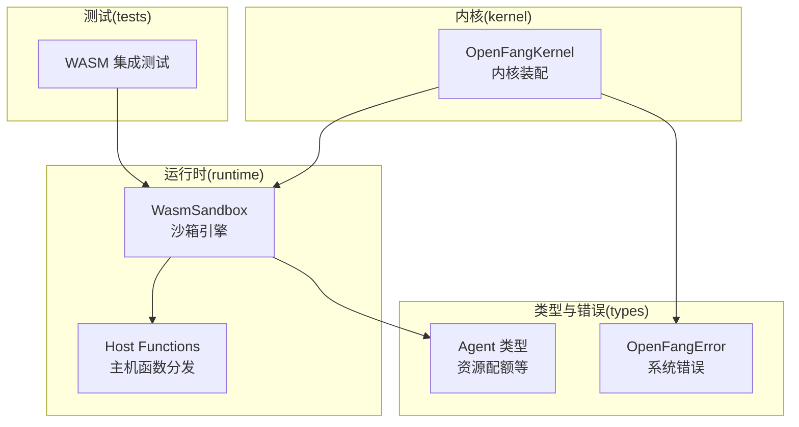
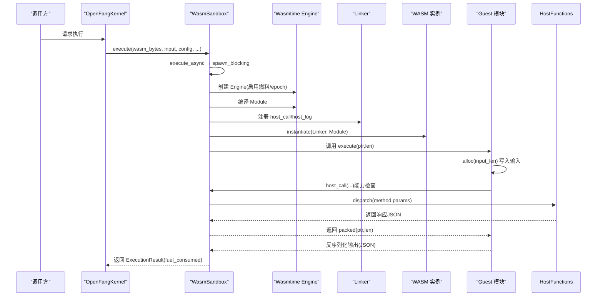
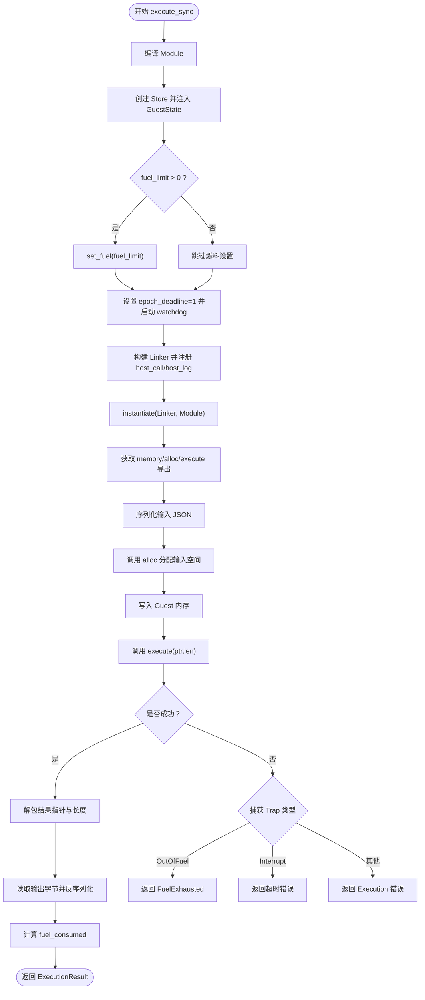
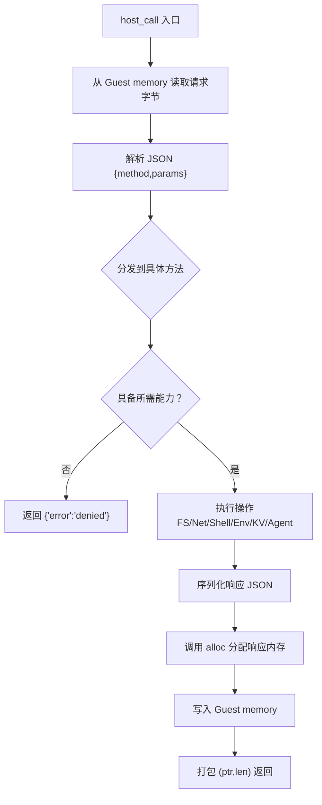
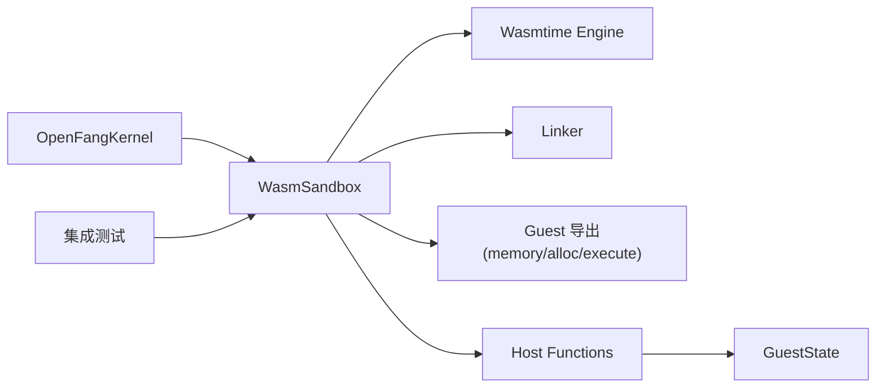

# 执行生命周期

<cite>
**本文引用的文件**
- [sandbox.rs](file://crates/openfang-runtime/src/sandbox.rs)
- [host_functions.rs](file://crates/openfang-runtime/src/host_functions.rs)
- [kernel.rs](file://crates/openfang-kernel/src/kernel.rs)
- [agent.rs](file://crates/openfang-types/src/agent.rs)
- [error.rs](file://crates/openfang-types/src/error.rs)
- [wasm_agent_integration_test.rs](file://crates/openfang-kernel/tests/wasm_agent_integration_test.rs)
</cite>

## 目录
1. [简介](#简介)
2. [项目结构](#项目结构)
3. [核心组件](#核心组件)
4. [架构总览](#架构总览)
5. [详细组件分析](#详细组件分析)
6. [依赖关系分析](#依赖关系分析)
7. [性能考量](#性能考量)
8. [故障排查指南](#故障排查指南)
9. [结论](#结论)
10. [附录](#附录)

## 简介
本文件面向 WASM 执行生命周期，系统性阐述从模块编译、实例化到执行完成的完整流程，覆盖同步与异步执行路径、输入参数的序列化与内存分配、输出结果的反序列化与边界检查、燃料耗尽与超时中断的处理机制，并给出执行配置、错误处理与性能监控的实践建议。文档同时提供可直接定位到源码的路径，便于读者深入理解实现细节。

## 项目结构
围绕 WASM 执行生命周期的关键代码主要位于 openfang-runtime 的 sandbox 模块与 host_functions 模块；kernel 负责装配与调度；类型定义与错误模型在 openfang-types 中；测试用例位于 openfang-kernel/tests 下。

图示来源
- [sandbox.rs:94-110](file://crates/openfang-runtime/src/sandbox.rs#L94-L110)
- [host_functions.rs:16-49](file://crates/openfang-runtime/src/host_functions.rs#L16-L49)
- [kernel.rs:60-164](file://crates/openfang-kernel/src/kernel.rs#L60-L164)
- [agent.rs:247-282](file://crates/openfang-types/src/agent.rs#L247-L282)
- [error.rs:6-101](file://crates/openfang-types/src/error.rs#L6-L101)
- [wasm_agent_integration_test.rs:43-78](file://crates/openfang-kernel/tests/wasm_agent_integration_test.rs#L43-L78)

章节来源
- [sandbox.rs:1-60](file://crates/openfang-runtime/src/sandbox.rs#L1-L60)
- [kernel.rs:60-164](file://crates/openfang-kernel/src/kernel.rs#L60-L164)

## 核心组件
- WasmSandbox：封装 Wasmtime 引擎、沙箱配置、ABI 约定（memory/alloc/execute）、宿主函数注册（host_call/host_log）与执行流程。
- Host Functions：能力检查与安全策略（路径穿越、SSRF、能力匹配），统一通过 host_call 分发。
- OpenFangKernel：内核装配，持有共享的 WasmSandbox 实例，协调调度与资源。
- Agent 类型：资源配额（最大内存、CPU 时间、工具调用频率等）。
- 错误模型：OpenFangError 与 SandboxError，用于统一错误分类与传播。

章节来源
- [sandbox.rs:33-92](file://crates/openfang-runtime/src/sandbox.rs#L33-L92)
- [host_functions.rs:16-49](file://crates/openfang-runtime/src/host_functions.rs#L16-L49)
- [kernel.rs:60-164](file://crates/openfang-kernel/src/kernel.rs#L60-L164)
- [agent.rs:247-282](file://crates/openfang-types/src/agent.rs#L247-L282)
- [error.rs:6-101](file://crates/openfang-types/src/error.rs#L6-L101)

## 架构总览
下图展示了从调用方到 WASM 模块执行的端到端流程，包括同步与异步两种入口、燃料与超时控制、输入/输出内存交互与能力检查。

图示来源
- [sandbox.rs:112-143](file://crates/openfang-runtime/src/sandbox.rs#L112-L143)
- [sandbox.rs:146-275](file://crates/openfang-runtime/src/sandbox.rs#L146-L275)
- [host_functions.rs:16-49](file://crates/openfang-runtime/src/host_functions.rs#L16-L49)

## 详细组件分析

### 组件一：WasmSandbox（沙箱引擎）
- 引擎与配置
  - 启用燃料计量与 epoch 中断，分别用于确定性 CPU 限制与墙钟超时。
  - 默认 fuel_limit 与 timeout_secs 可配置，未设置时使用默认值。
- 同步/异步执行
  - 提供 execute_async（返回 JoinHandle）与 execute_sync（在阻塞线程中执行）。
  - 异步入口通过 spawn_blocking 将 CPU 密集型执行移出 Tokio 主线程。
- ABI 约定
  - 必须导出 memory、alloc、execute。
  - execute 返回打包的 i64：高 32 位为结果指针，低 32 位为长度。
- 输入序列化与内存分配
  - 将 JSON 输入序列化为字节，调用 alloc 获取 Guest 内存指针，写入后传给 execute。
  - 对输入/输出指针进行越界检查，避免越界读写。
- 输出反序列化与燃料统计
  - 从 Guest 内存读取输出字节，反序列化为 JSON。
  - 基于初始 fuel_limit 与剩余 fuel 计算消耗量。
- 错误处理
  - 区分编译失败、实例化失败、ABI 违规、燃料耗尽、超时中断、执行异常等。
  - 超时中断通过 epoch 中断触发，错误类型区分 OutOfFuel 与 Interrupt。

图示来源
- [sandbox.rs:146-275](file://crates/openfang-runtime/src/sandbox.rs#L146-L275)

章节来源
- [sandbox.rs:33-92](file://crates/openfang-runtime/src/sandbox.rs#L33-L92)
- [sandbox.rs:112-143](file://crates/openfang-runtime/src/sandbox.rs#L112-L143)
- [sandbox.rs:146-275](file://crates/openfang-runtime/src/sandbox.rs#L146-L275)

### 组件二：Host Functions（主机函数）
- 能力检查
  - 所有需要权限的操作均需通过 capability 匹配，拒绝则返回错误 JSON。
  - 支持通配符与模式匹配，如 FileRead("*")、NetConnect(host:port) 等。
- 安全策略
  - 文件系统：严格路径解析，禁止父目录组件与符号链接滥用；写入前校验父目录与文件名。
  - 网络：仅允许 http/https，对解析后的 IP 地址进行私网/回环地址拦截（SSRF）。
  - 环境变量：按名称粒度授权读取。
  - Shell：命令与参数直接传递，避免 shell 注入风险。
- 分发与返回
  - host_call 接收 Guest 内存中的请求 JSON，解析 method 与 params，调用对应处理器。
  - 处理器返回 JSON，由 host_call 分配 Guest 内存并返回 packed 指针与长度。

图示来源
- [host_functions.rs:16-49](file://crates/openfang-runtime/src/host_functions.rs#L16-L49)
- [host_functions.rs:194-212](file://crates/openfang-runtime/src/host_functions.rs#L194-L212)
- [host_functions.rs:271-312](file://crates/openfang-runtime/src/host_functions.rs#L271-L312)
- [host_functions.rs:334-368](file://crates/openfang-runtime/src/host_functions.rs#L334-L368)
- [host_functions.rs:374-386](file://crates/openfang-runtime/src/host_functions.rs#L374-L386)
- [host_functions.rs:392-437](file://crates/openfang-runtime/src/host_functions.rs#L392-L437)
- [host_functions.rs:443-492](file://crates/openfang-runtime/src/host_functions.rs#L443-L492)

章节来源
- [host_functions.rs:16-49](file://crates/openfang-runtime/src/host_functions.rs#L16-L49)
- [host_functions.rs:55-67](file://crates/openfang-runtime/src/host_functions.rs#L55-L67)
- [host_functions.rs:73-117](file://crates/openfang-runtime/src/host_functions.rs#L73-L117)
- [host_functions.rs:123-176](file://crates/openfang-runtime/src/host_functions.rs#L123-L176)

### 组件三：OpenFangKernel（内核装配）
- 职责
  - 初始化并持有共享的 WasmSandbox 实例，供所有 WASM Agent 使用。
  - 协调调度、事件总线、工作流、内存子系统、LLM 驱动等。
- 关键点
  - 在内核启动阶段创建 WasmSandbox，确保跨调用复用引擎以降低开销。
  - 通过 GuestState 传递 agent_id、capabilities、kernel handle、tokio handle，供宿主函数使用。

章节来源
- [kernel.rs:60-164](file://crates/openfang-kernel/src/kernel.rs#L60-L164)
- [kernel.rs:726-728](file://crates/openfang-kernel/src/kernel.rs#L726-L728)

### 组件四：Agent 类型与资源配额
- ResourceQuota
  - 最大内存、CPU 时间、工具调用频率、网络字节数、成本限额等。
  - 作为上层调度与限流参考，与 WasmSandbox 的 fuel_limit/timeout_secs 形成互补。
- 用途
  - 在调度或代理层面对调用进行预估与限流，避免超出 Guest 的执行约束。

章节来源
- [agent.rs:247-282](file://crates/openfang-types/src/agent.rs#L247-L282)

### 组件五：错误模型
- OpenFangError
  - 系统级错误类型，涵盖 Agent、Session、Memory、Tool、LLM、配置、序列化、WASM、网络、计量等。
- SandboxError
  - 沙箱专用错误，覆盖编译、实例化、执行、燃料耗尽、ABI 违规等。
- 传播与处理
  - 上层根据错误类型决定重试、降级、告警或终止。

章节来源
- [error.rs:6-101](file://crates/openfang-types/src/error.rs#L6-L101)
- [sandbox.rs:80-92](file://crates/openfang-runtime/src/sandbox.rs#L80-L92)

## 依赖关系分析
- WasmSandbox 依赖 Wasmtime 引擎与 Linker，负责模块编译、实例化与执行。
- Host Functions 依赖 GuestState（包含 capabilities、kernel handle、agent_id、tokio handle）与能力匹配逻辑。
- OpenFangKernel 持有 WasmSandbox 实例，作为全局执行环境。
- 测试用例提供最小 echo 模块与无限循环模块，验证回显与燃料耗尽行为。

图示来源
- [kernel.rs:87-88](file://crates/openfang-kernel/src/kernel.rs#L87-L88)
- [sandbox.rs:98-110](file://crates/openfang-runtime/src/sandbox.rs#L98-L110)
- [host_functions.rs:9-14](file://crates/openfang-runtime/src/host_functions.rs#L9-L14)
- [wasm_agent_integration_test.rs:43-78](file://crates/openfang-kernel/tests/wasm_agent_integration_test.rs#L43-L78)

章节来源
- [kernel.rs:87-88](file://crates/openfang-kernel/src/kernel.rs#L87-L88)
- [sandbox.rs:98-110](file://crates/openfang-runtime/src/sandbox.rs#L98-L110)
- [host_functions.rs:9-14](file://crates/openfang-runtime/src/host_functions.rs#L9-L14)
- [wasm_agent_integration_test.rs:43-78](file://crates/openfang-kernel/tests/wasm_agent_integration_test.rs#L43-L78)

## 性能考量
- 燃料计量（Deterministic CPU）
  - 通过 set_fuel 与 consume_fuel 控制指令预算，适合 CPU 密集型任务的公平调度与上限控制。
  - 执行完成后基于初始与剩余燃料差值统计消耗量。
- 墙钟超时（Epoch 中断）
  - 通过 epoch_interruption 与 watchdog 线程实现，防止死循环或长时间阻塞。
  - 超时错误与燃料耗尽错误在调用侧区分处理。
- 内存与 I/O
  - 输入/输出均通过 Guest 内存传输，避免频繁拷贝；注意越界检查与 JSON 序列化开销。
- 异步执行
  - 将 CPU 密集型执行放入 spawn_blocking，避免阻塞 Tokio 主线程。
- 资源配额
  - 结合 Agent 的 ResourceQuota 与 WasmSandbox 的 fuel/timeout，形成多层保护。

章节来源
- [sandbox.rs:104-110](file://crates/openfang-runtime/src/sandbox.rs#L104-L110)
- [sandbox.rs:170-184](file://crates/openfang-runtime/src/sandbox.rs#L170-L184)
- [sandbox.rs:265-269](file://crates/openfang-runtime/src/sandbox.rs#L265-L269)
- [agent.rs:247-282](file://crates/openfang-types/src/agent.rs#L247-L282)

## 故障排查指南
- 常见错误与定位
  - 编译失败：检查模块格式（.wasm/.wat）与导出符号是否符合 ABI。
  - 实例化失败：确认 Linker 已正确注册 host_call/host_log。
  - ABI 违规：检查 memory/alloc/execute 是否存在且签名正确。
  - 燃料耗尽：提高 fuel_limit 或优化 Guest 逻辑。
  - 超时中断：缩短 timeout_secs 或优化 Guest 循环。
  - 能力不足：为 Guest 授予相应 Capability。
  - 路径穿越/SSRF：检查安全策略与 URL 解析。
- 日志与指标
  - 宿主日志通过 host_log 写入 tracing，级别映射到 trace/debug/info/warn/error。
  - 执行完成会记录 fuel_consumed，可用于性能分析与计费。
- 测试参考
  - echo 模块验证回显与 fuel 消耗。
  - 无限循环模块验证燃料耗尽。
  - host_call 代理模块验证能力检查与错误返回。

章节来源
- [sandbox.rs:80-92](file://crates/openfang-runtime/src/sandbox.rs#L80-L92)
- [sandbox.rs:231-247](file://crates/openfang-runtime/src/sandbox.rs#L231-L247)
- [host_functions.rs:55-67](file://crates/openfang-runtime/src/host_functions.rs#L55-L67)
- [host_functions.rs:73-117](file://crates/openfang-runtime/src/host_functions.rs#L73-L117)
- [host_functions.rs:123-176](file://crates/openfang-runtime/src/host_functions.rs#L123-L176)
- [wasm_agent_integration_test.rs:477-522](file://crates/openfang-kernel/tests/wasm_agent_integration_test.rs#L477-L522)

## 结论
该执行生命周期以 WasmSandbox 为核心，结合 Wasmtime 的燃料与 epoch 能力，实现了确定性 CPU 限制与墙钟超时双重保障；通过严格的 ABI 约定与能力检查，确保 Guest 与 Host 的交互安全可控；配合 OpenFangKernel 的装配与调度，形成可扩展、可观测、可治理的 WASM 执行平台。实践中应合理配置 fuel_limit 与 timeout_secs，并结合 Agent 的 ResourceQuota 实现多维限流与成本控制。

## 附录
- 执行配置要点
  - fuel_limit：CPU 指令预算，0 表示不限制。
  - timeout_secs：墙钟超时秒数，默认 30 秒。
  - capabilities：授予 Guest 的能力清单，影响 host_call 的可用性。
- 错误处理最佳实践
  - 明确区分 FuelExhausted 与 Timeout 错误，分别采取降级或重试策略。
  - 对能力检查失败返回清晰的错误信息，便于前端提示。
- 性能监控建议
  - 记录 fuel_consumed 与执行时间，建立基线与告警阈值。
  - 对 host_call 的热点方法进行采样与追踪，识别瓶颈。