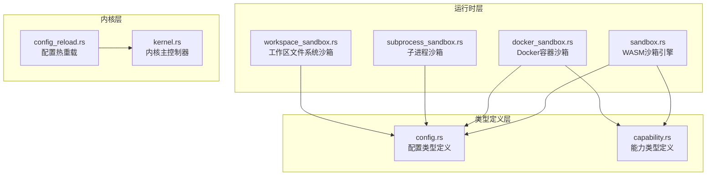
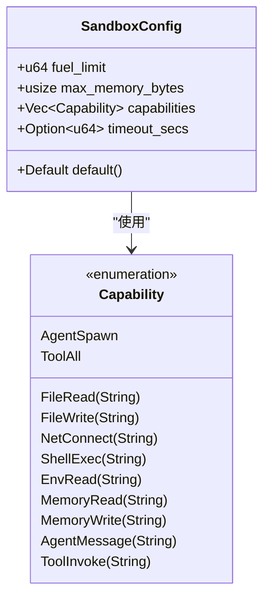
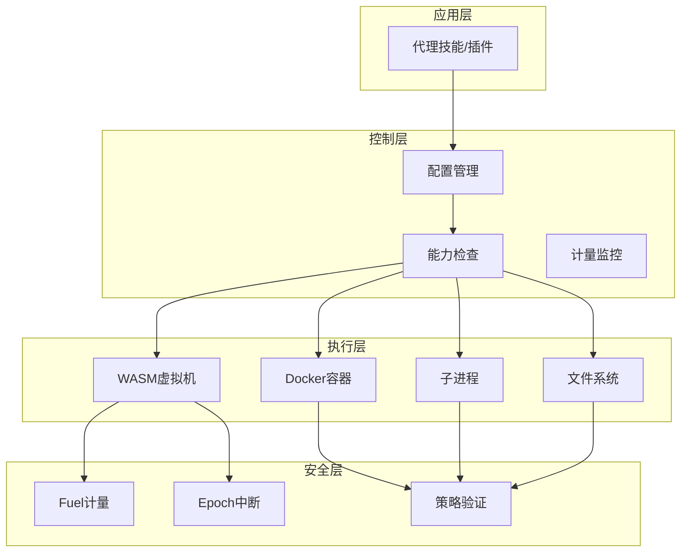
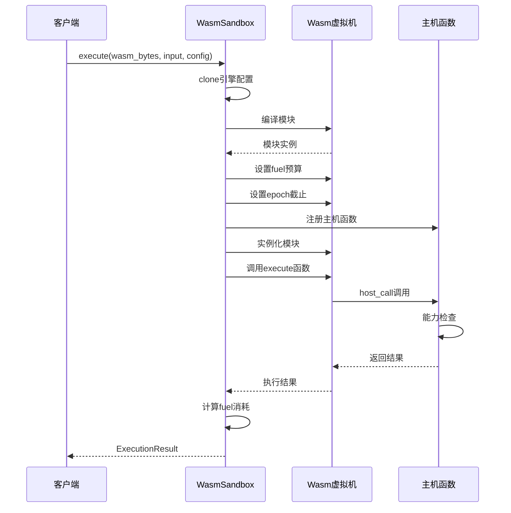
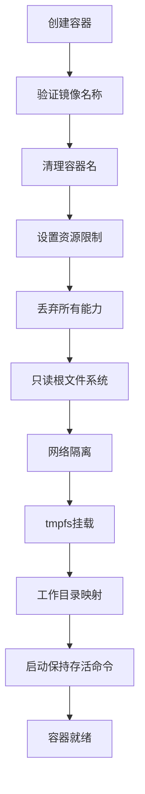
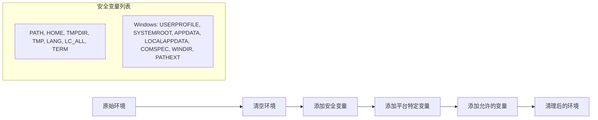
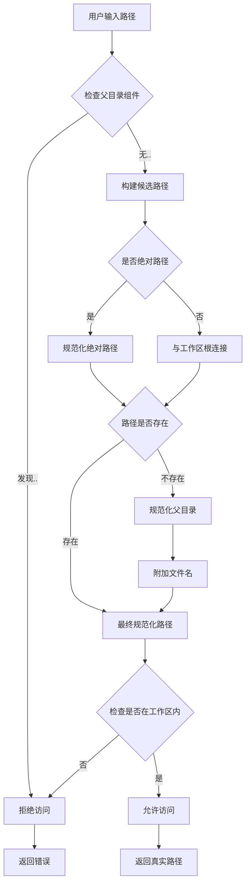
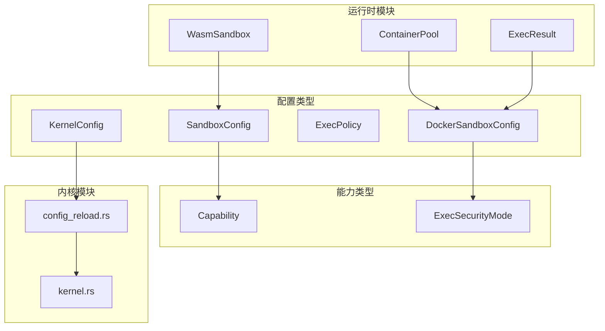
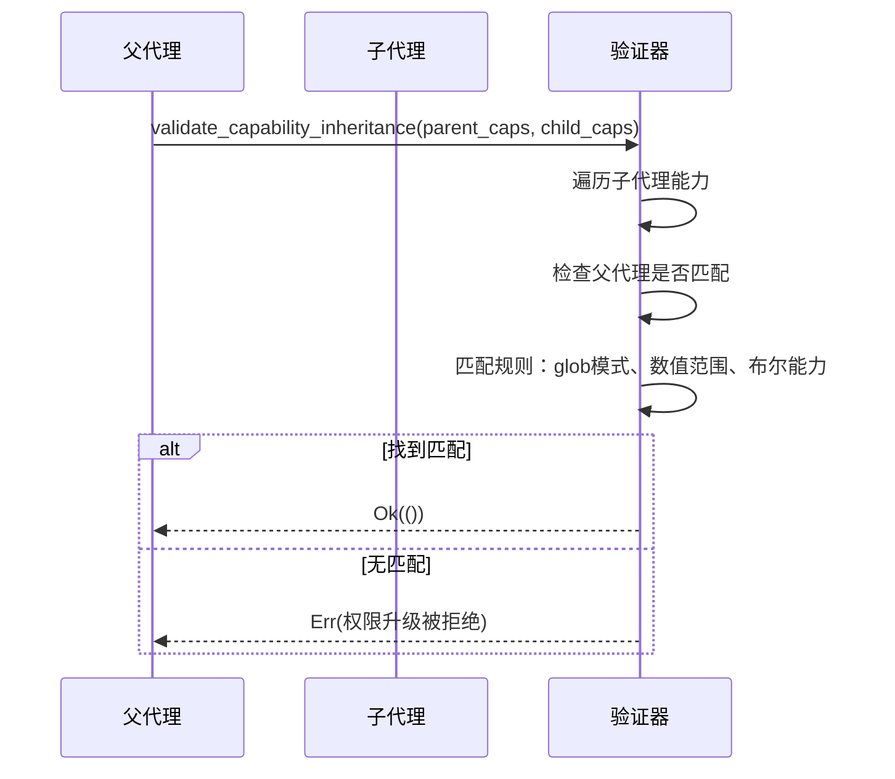
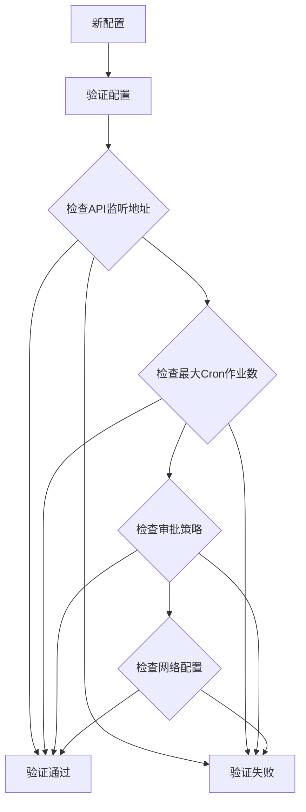

# 沙箱配置管理

<cite>
**本文档引用的文件**
- [crates/openfang-runtime/src/sandbox.rs](file://crates/openfang-runtime/src/sandbox.rs)
- [crates/openfang-runtime/src/docker_sandbox.rs](file://crates/openfang-runtime/src/docker_sandbox.rs)
- [crates/openfang-runtime/src/subprocess_sandbox.rs](file://crates/openfang-runtime/src/subprocess_sandbox.rs)
- [crates/openfang-runtime/src/workspace_sandbox.rs](file://crates/openfang-runtime/src/workspace_sandbox.rs)
- [crates/openfang-types/src/config.rs](file://crates/openfang-types/src/config.rs)
- [crates/openfang-types/src/capability.rs](file://crates/openfang-types/src/capability.rs)
- [crates/openfang-kernel/src/config_reload.rs](file://crates/openfang-kernel/src/config_reload.rs)
- [crates/openfang-kernel/src/kernel.rs](file://crates/openfang-kernel/src/kernel.rs)
- [openfang.toml.example](file://openfang.toml.example)
</cite>

## 目录
1. [简介](#简介)
2. [项目结构](#项目结构)
3. [核心组件](#核心组件)
4. [架构概览](#架构概览)
5. [详细组件分析](#详细组件分析)
6. [依赖关系分析](#依赖关系分析)
7. [性能考虑](#性能考虑)
8. [故障排除指南](#故障排除指南)
9. [结论](#结论)
10. [附录](#附录)

## 简介

OpenFang 的沙箱配置管理系统是一个多层次的安全执行环境，旨在为代理技能和插件提供受控的执行空间。该系统通过多种隔离机制确保未信任代码的安全执行，包括 WebAssembly 虚拟机隔离、Docker 容器隔离、子进程沙箱化以及工作区文件系统限制。

本系统采用"默认拒绝"的安全模型，所有操作都必须显式授权。配置参数的设计充分考虑了安全性与性能之间的平衡，提供了灵活的调优选项以适应不同的使用场景。

## 项目结构

OpenFang 沙箱配置管理涉及多个核心模块：



**图表来源**
- [crates/openfang-runtime/src/sandbox.rs:1-608](file://crates/openfang-runtime/src/sandbox.rs#L1-L608)
- [crates/openfang-types/src/config.rs:1-800](file://crates/openfang-types/src/config.rs#L1-L800)

**章节来源**
- [crates/openfang-runtime/src/sandbox.rs:1-608](file://crates/openfang-runtime/src/sandbox.rs#L1-L608)
- [crates/openfang-types/src/config.rs:1-800](file://crates/openfang-types/src/config.rs#L1-L800)

## 核心组件

### SandboxConfig 结构设计

SandboxConfig 是 WASM 沙箱的核心配置结构，包含以下关键参数：



**图表来源**
- [crates/openfang-runtime/src/sandbox.rs:33-56](file://crates/openfang-runtime/src/sandbox.rs#L33-L56)
- [crates/openfang-types/src/capability.rs:10-72](file://crates/openfang-types/src/capability.rs#L10-L72)

### 默认配置值选择依据

系统为每个配置参数提供了经过深思熟虑的默认值：

| 配置参数 | 默认值 | 选择依据 | 性能影响 | 安全性影响 |
|---------|--------|----------|----------|------------|
| fuel_limit | 1,000,000 | 平衡大多数技能的CPU需求与防滥用 | 中等（CPU计量） | 高（防止无限循环） |
| max_memory_bytes | 16MB | 限制线性内存增长，预留未来强制执行 | 低（内存限制） | 中等（内存溢出防护） |
| capabilities | 空列表 | 默认拒绝，需要显式授权 | 无 | 最高（最小权限原则） |
| timeout_secs | None (30秒) | 墙钟超时作为第二层防护 | 低（定时器开销） | 高（防止长时间阻塞） |

**章节来源**
- [crates/openfang-runtime/src/sandbox.rs:47-56](file://crates/openfang-runtime/src/sandbox.rs#L47-L56)
- [crates/openfang-runtime/src/sandbox.rs:177-184](file://crates/openfang-runtime/src/sandbox.rs#L177-L184)

## 架构概览

OpenFang 的沙箱配置管理采用多层隔离架构：



**图表来源**
- [crates/openfang-runtime/src/sandbox.rs:102-143](file://crates/openfang-runtime/src/sandbox.rs#L102-L143)
- [crates/openfang-runtime/src/docker_sandbox.rs:93-173](file://crates/openfang-runtime/src/docker_sandbox.rs#L93-L173)

## 详细组件分析

### WASM 沙箱引擎

WASM 沙箱引擎是系统的核心执行环境，提供了基于 Wasmtime 的安全执行框架：

#### 执行流程



**图表来源**
- [crates/openfang-runtime/src/sandbox.rs:117-275](file://crates/openfang-runtime/src/sandbox.rs#L117-L275)

#### 配置参数详解

**燃料限制 (fuel_limit)**
- **作用**: 通过 Wasmtime 的 fuel 计量机制限制 CPU 指令执行数量
- **实现**: `store.set_fuel(config.fuel_limit)`
- **默认值**: 1,000,000 单位
- **性能影响**: 无显著开销，仅在指令执行时递减
- **安全性**: 防止无限循环和CPU滥用

**内存限制 (max_memory_bytes)**
- **作用**: 当前为预留字段，用于未来的线性内存强制执行
- **默认值**: 16MB
- **当前状态**: 未强制执行，但为未来扩展做准备

**能力授予 (capabilities)**
- **作用**: 基于能力的安全模型，拒绝默认授权
- **实现**: 在 GuestState 中传递给主机函数
- **检查点**: 每次主机调用前进行能力验证

**超时设置 (timeout_secs)**
- **作用**: 墙钟超时保护，防止长时间阻塞
- **实现**: 使用 epoch 中断机制
- **默认行为**: 30秒（None时）
- **实现细节**: 后台线程睡眠指定秒数后触发引擎增量

**章节来源**
- [crates/openfang-runtime/src/sandbox.rs:33-56](file://crates/openfang-runtime/src/sandbox.rs#L33-L56)
- [crates/openfang-runtime/src/sandbox.rs:170-184](file://crates/openfang-runtime/src/sandbox.rs#L170-L184)

### Docker 容器沙箱

Docker 沙箱提供操作系统级别的隔离，适用于需要真实系统访问的场景：

#### 安全特性



**图表来源**
- [crates/openfang-runtime/src/docker_sandbox.rs:93-173](file://crates/openfang-runtime/src/docker_sandbox.rs#L93-L173)

#### 资源限制配置

| 参数 | 默认值 | 描述 | 安全影响 |
|------|--------|------|----------|
| memory_limit | "512m" | 内存使用上限 | 高（防止内存耗尽） |
| cpu_limit | 1.0 | CPU配额 | 高（防止CPU滥用） |
| pids_limit | 100 | 进程数限制 | 中（防止fork炸弹） |
| timeout_secs | 60 | 执行超时 | 高（防止长时间占用） |
| tmpfs | ["/tmp:size=64m"] | 临时文件系统 | 中（限制持久化） |

**章节来源**
- [crates/openfang-types/src/config.rs:512-590](file://crates/openfang-types/src/config.rs#L512-L590)
- [crates/openfang-runtime/src/docker_sandbox.rs:93-173](file://crates/openfang-runtime/src/docker_sandbox.rs#L93-L173)

### 子进程沙箱

子进程沙箱专注于防止敏感信息泄露和命令注入：

#### 环境变量安全



**图表来源**
- [crates/openfang-runtime/src/subprocess_sandbox.rs:13-64](file://crates/openfang-runtime/src/subprocess_sandbox.rs#L13-L64)

#### 命令注入防护

系统实现了多层次的命令注入防护：

| 防护层 | 检查内容 | 防护效果 |
|--------|----------|----------|
| 路径遍历检查 | 拒绝包含 ".." 组件的路径 | 防止目录穿越 |
| 元字符检测 | 拒绝管道、重定向、命令替换等 | 防止命令注入 |
| 可执行文件验证 | 验证可执行文件路径合法性 | 防止恶意文件执行 |
| 环境变量清理 | 清除敏感环境变量 | 防止凭据泄露 |

**章节来源**
- [crates/openfang-runtime/src/subprocess_sandbox.rs:66-149](file://crates/openfang-runtime/src/subprocess_sandbox.rs#L66-L149)

### 工作区文件系统沙箱

工作区沙箱确保代理只能访问其指定的工作目录：

#### 路径解析流程



**图表来源**
- [crates/openfang-runtime/src/workspace_sandbox.rs:8-69](file://crates/openfang-runtime/src/workspace_sandbox.rs#L8-L69)

**章节来源**
- [crates/openfang-runtime/src/workspace_sandbox.rs:15-69](file://crates/openfang-runtime/src/workspace_sandbox.rs#L15-L69)

## 依赖关系分析

### 配置类型依赖



**图表来源**
- [crates/openfang-types/src/config.rs:509-590](file://crates/openfang-types/src/config.rs#L509-L590)
- [crates/openfang-types/src/capability.rs:10-72](file://crates/openfang-types/src/capability.rs#L10-L72)

### 能力继承验证

系统实现了严格的能力继承验证机制，防止权限升级：



**图表来源**
- [crates/openfang-types/src/capability.rs:168-187](file://crates/openfang-types/src/capability.rs#L168-L187)

**章节来源**
- [crates/openfang-types/src/capability.rs:106-187](file://crates/openfang-types/src/capability.rs#L106-L187)

## 性能考虑

### 配置参数对性能的影响

| 配置参数 | 性能影响 | 调优建议 | 场景适用 |
|----------|----------|----------|----------|
| fuel_limit | CPU计量开销 | 根据技能复杂度调整 | 复杂计算任务 |
| timeout_secs | 定时器开销 | 设置合理的超时时间 | 长时间运行任务 |
| memory_limit | 内存分配成本 | 适度增加以减少重分配 | 大数据处理 |
| max_memory_bytes | 未使用 | 保持默认值 | 一般场景 |
| cap_add | 容器启动成本 | 最小化能力集合 | 生产环境 |

### 性能优化策略

1. **燃料预算优化**
   - 分析技能的典型CPU消耗，设置合适的燃料预算
   - 对于简单技能使用较低预算，复杂技能使用较高预算

2. **超时策略**
   - 为不同类型的任务设置不同的超时时间
   - 使用较短超时处理交互式任务，较长超时处理批处理任务

3. **容器池复用**
   - 启用容器池以减少容器创建开销
   - 合理设置冷却时间和生命周期

**章节来源**
- [crates/openfang-runtime/src/docker_sandbox.rs:248-341](file://crates/openfang-runtime/src/docker_sandbox.rs#L248-L341)

## 故障排除指南

### 常见配置问题

#### 燃料耗尽错误
**症状**: 执行过程中出现 FuelExhausted 错误
**原因**: 燃料预算不足或存在无限循环
**解决方案**:
- 增加 fuel_limit 配置
- 优化技能算法，避免无限循环
- 使用更高效的实现方式

#### 超时错误
**症状**: 执行过程中出现超时错误
**原因**: 超时设置过短或任务执行时间过长
**解决方案**:
- 增加 timeout_secs 配置
- 优化任务执行效率
- 分解大型任务为多个小任务

#### 权限拒绝错误
**症状**: 主机调用返回 Capability denied 错误
**原因**: 缺少必要的能力授权
**解决方案**:
- 添加相应的 Capability 授权
- 使用通配符能力（谨慎使用）
- 检查能力匹配规则

### 配置验证

系统提供了完整的配置验证机制：



**图表来源**
- [crates/openfang-kernel/src/config_reload.rs:277-303](file://crates/openfang-kernel/src/config_reload.rs#L277-L303)

**章节来源**
- [crates/openfang-kernel/src/config_reload.rs:277-303](file://crates/openfang-kernel/src/config_reload.rs#L277-L303)

## 结论

OpenFang 的沙箱配置管理系统通过多层次的安全隔离和精细的配置控制，为代理技能提供了强大而灵活的执行环境。系统的设计充分体现了"最小权限"和"深度防御"的安全理念，同时保持了良好的性能表现。

关键优势包括：
- **多层隔离**: WASM、Docker、文件系统、子进程的全方位隔离
- **精细化控制**: 基于能力的安全模型，精确的权限控制
- **性能优化**: 合理的默认配置和灵活的调优选项
- **安全可靠**: 完整的配置验证和错误处理机制

建议在生产环境中：
- 使用最小必要的能力授权
- 根据实际需求调整燃料和超时配置
- 启用适当的日志记录和监控
- 定期审查和更新安全配置

## 附录

### 配置示例

#### 基础 WASM 沙箱配置
```toml
# 基础配置示例
[sandbox]
fuel_limit = 1000000
timeout_secs = 30
```

#### Docker 沙箱配置
```toml
# Docker沙箱配置示例
[docker_sandbox]
enabled = true
image = "python:3.12-slim"
memory_limit = "512m"
cpu_limit = 1.0
timeout_secs = 60
```

#### 能力授权示例
```toml
# 能力授权示例
[[capabilities]]
type = "FileRead"
value = "/data/*"

[[capabilities]]
type = "NetConnect"
value = "*.openai.com:443"

[[capabilities]]
type = "ShellExec"
value = "ls"
```

**章节来源**
- [openfang.toml.example:1-49](file://openfang.toml.example#L1-L49)