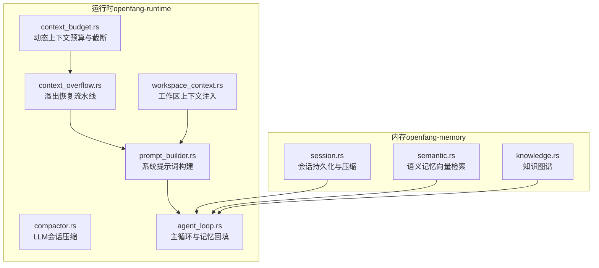
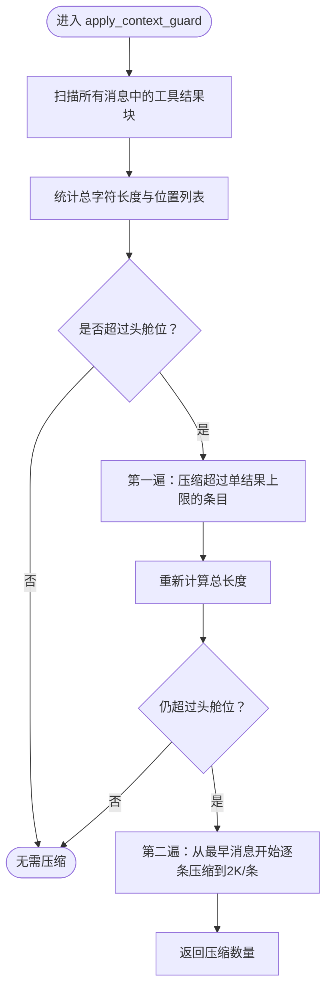
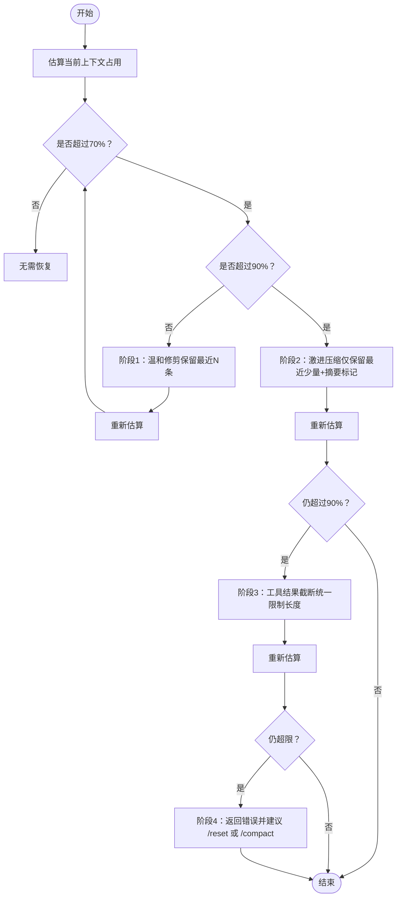
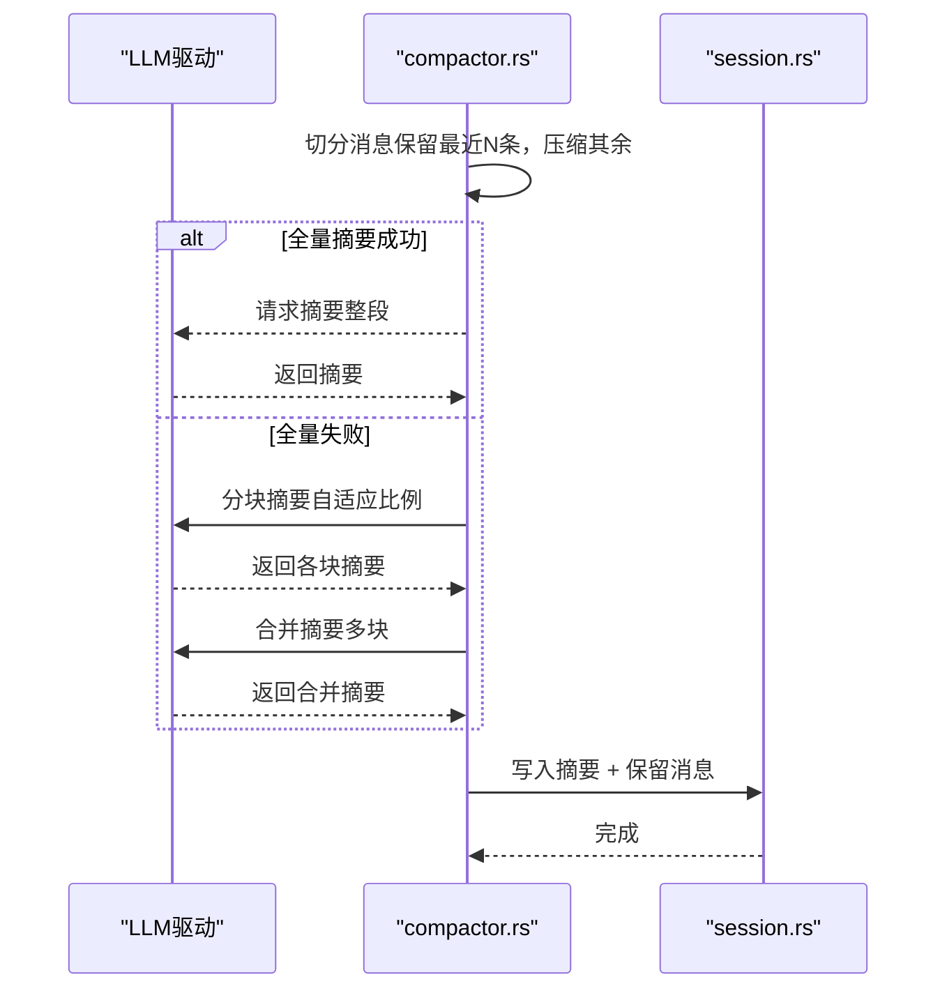
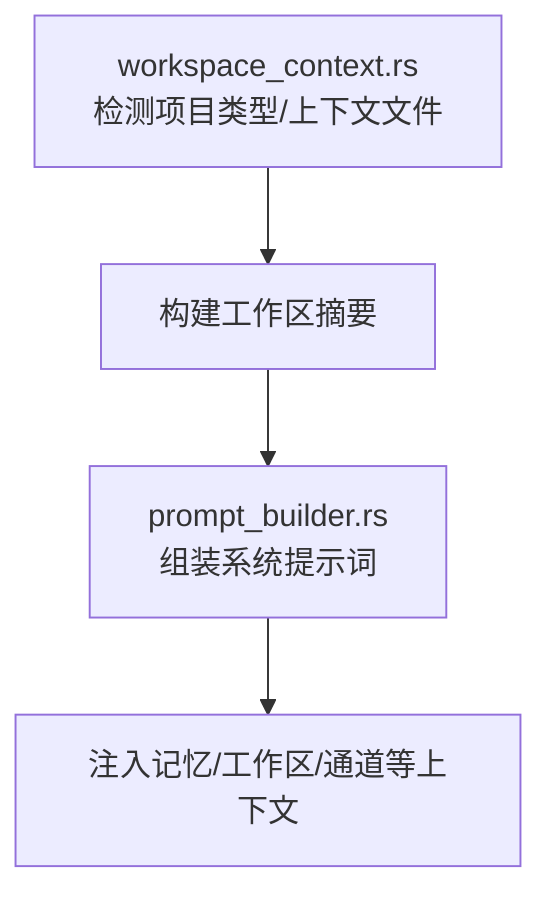
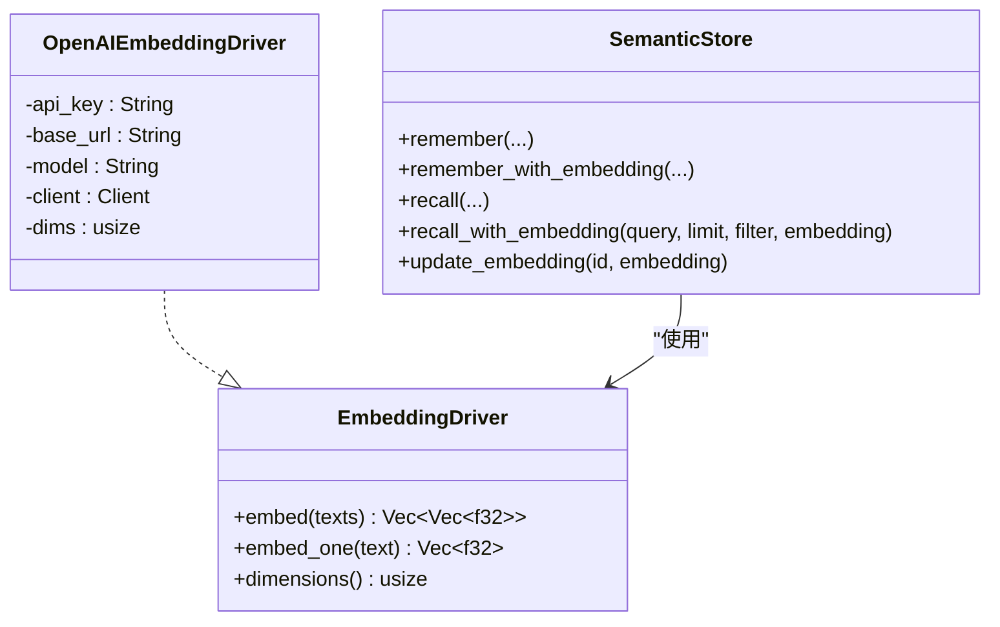
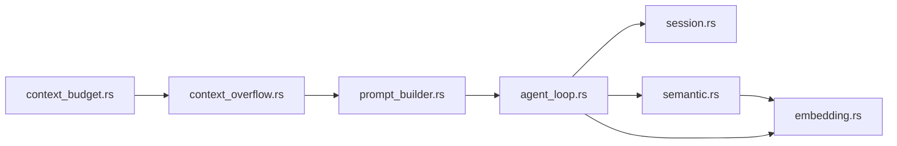

# 上下文管理

<cite>
**本文引用的文件**
- [crates/openfang-runtime/src/context_budget.rs](file://crates/openfang-runtime/src/context_budget.rs)
- [crates/openfang-runtime/src/context_overflow.rs](file://crates/openfang-runtime/src/context_overflow.rs)
- [crates/openfang-runtime/src/compactor.rs](file://crates/openfang-runtime/src/compactor.rs)
- [crates/openfang-runtime/src/prompt_builder.rs](file://crates/openfang-runtime/src/prompt_builder.rs)
- [crates/openfang-runtime/src/workspace_context.rs](file://crates/openfang-runtime/src/workspace_context.rs)
- [crates/openfang-runtime/src/agent_loop.rs](file://crates/openfang-runtime/src/agent_loop.rs)
- [crates/openfang-memory/src/session.rs](file://crates/openfang-memory/src/session.rs)
- [crates/openfang-memory/src/semantic.rs](file://crates/openfang-memory/src/semantic.rs)
- [crates/openfang-runtime/src/embedding.rs](file://crates/openfang-runtime/src/embedding.rs)
- [crates/openfang-memory/src/knowledge.rs](file://crates/openfang-memory/src/knowledge.rs)
</cite>

## 目录
1. [简介](#简介)
2. [项目结构](#项目结构)
3. [核心组件](#核心组件)
4. [架构总览](#架构总览)
5. [详细组件分析](#详细组件分析)
6. [依赖关系分析](#依赖关系分析)
7. [性能考量](#性能考量)
8. [故障排查指南](#故障排查指南)
9. [结论](#结论)
10. [附录：最佳实践与示例路径](#附录最佳实践与示例路径)

## 简介
本技术文档围绕“上下文管理系统”展开，聚焦以下目标：
- 深入解释上下文预算控制机制：token 计数估算、动态预算参数、分层截断与压缩策略。
- 详述上下文溢出处理方案：四级恢复流程（自动修剪、激进压缩、工具结果截断、最终错误）。
- 提供构建高效提示词、管理对话历史、实现上下文压缩的具体方法与示例路径。
- 解释与嵌入向量系统的集成方式，以及上下文优化的最佳实践。

## 项目结构
上下文管理涉及运行时（runtime）与内存（memory）两大模块：
- 运行时（openfang-runtime）：负责会话压缩、上下文报告、溢出恢复、提示词构建、工作区上下文注入等。
- 内存（openfang-memory）：负责会话持久化、语义记忆（向量检索）、知识图谱存储等。



图表来源
- [crates/openfang-runtime/src/context_budget.rs:1-355](file://crates/openfang-runtime/src/context_budget.rs#L1-L355)
- [crates/openfang-runtime/src/context_overflow.rs:1-268](file://crates/openfang-runtime/src/context_overflow.rs#L1-L268)
- [crates/openfang-runtime/src/compactor.rs:1-800](file://crates/openfang-runtime/src/compactor.rs#L1-L800)
- [crates/openfang-runtime/src/prompt_builder.rs:1-800](file://crates/openfang-runtime/src/prompt_builder.rs#L1-L800)
- [crates/openfang-runtime/src/workspace_context.rs:1-416](file://crates/openfang-runtime/src/workspace_context.rs#L1-L416)
- [crates/openfang-runtime/src/agent_loop.rs:527-3488](file://crates/openfang-runtime/src/agent_loop.rs#L527-L3488)
- [crates/openfang-memory/src/session.rs:1-800](file://crates/openfang-memory/src/session.rs#L1-L800)
- [crates/openfang-memory/src/semantic.rs:1-557](file://crates/openfang-memory/src/semantic.rs#L1-L557)
- [crates/openfang-memory/src/knowledge.rs:1-355](file://crates/openfang-memory/src/knowledge.rs#L1-L355)

章节来源
- [crates/openfang-runtime/src/context_budget.rs:1-355](file://crates/openfang-runtime/src/context_budget.rs#L1-L355)
- [crates/openfang-runtime/src/context_overflow.rs:1-268](file://crates/openfang-runtime/src/context_overflow.rs#L1-L268)
- [crates/openfang-runtime/src/compactor.rs:1-800](file://crates/openfang-runtime/src/compactor.rs#L1-L800)
- [crates/openfang-runtime/src/prompt_builder.rs:1-800](file://crates/openfang-runtime/src/prompt_builder.rs#L1-L800)
- [crates/openfang-runtime/src/workspace_context.rs:1-416](file://crates/openfang-runtime/src/workspace_context.rs#L1-L416)
- [crates/openfang-runtime/src/agent_loop.rs:527-3488](file://crates/openfang-runtime/src/agent_loop.rs#L527-L3488)
- [crates/openfang-memory/src/session.rs:1-800](file://crates/openfang-memory/src/session.rs#L1-L800)
- [crates/openfang-memory/src/semantic.rs:1-557](file://crates/openfang-memory/src/semantic.rs#L1-L557)
- [crates/openfang-memory/src/knowledge.rs:1-355](file://crates/openfang-memory/src/knowledge.rs#L1-L355)

## 核心组件
- 动态上下文预算与截断（context_budget.rs）
  - 基于模型上下文窗口计算预算，提供“单结果上限”和“总工具结果头舱位”的两层保护。
  - 支持按换行边界安全截断，避免字符边界破坏。
- 溢出恢复流水线（context_overflow.rs）
  - 四阶段恢复：温和修剪、激进压缩、工具结果截断、最终错误提示。
- 会话压缩（compactor.rs + session.rs）
  - 基于LLM的会话摘要生成，支持自适应分块与合并，保留最近消息并用摘要替换旧内容。
- 提示词构建（prompt_builder.rs）
  - 结构化多段落系统提示词，支持记忆、技能、通道、工作区等上下文注入。
- 工作区上下文（workspace_context.rs）
  - 自动检测项目类型、缓存上下文文件，构建工作区摘要注入到提示词。
- 嵌入与语义检索（embedding.rs + semantic.rs）
  - 统一的嵌入驱动接口，支持本地与远端提供商；语义记忆通过向量相似度召回。

章节来源
- [crates/openfang-runtime/src/context_budget.rs:1-355](file://crates/openfang-runtime/src/context_budget.rs#L1-L355)
- [crates/openfang-runtime/src/context_overflow.rs:1-268](file://crates/openfang-runtime/src/context_overflow.rs#L1-L268)
- [crates/openfang-runtime/src/compactor.rs:1-800](file://crates/openfang-runtime/src/compactor.rs#L1-L800)
- [crates/openfang-memory/src/session.rs:1-800](file://crates/openfang-memory/src/session.rs#L1-L800)
- [crates/openfang-runtime/src/prompt_builder.rs:1-800](file://crates/openfang-runtime/src/prompt_builder.rs#L1-L800)
- [crates/openfang-runtime/src/workspace_context.rs:1-416](file://crates/openfang-runtime/src/workspace_context.rs#L1-L416)
- [crates/openfang-runtime/src/embedding.rs:1-420](file://crates/openfang-runtime/src/embedding.rs#L1-L420)
- [crates/openfang-memory/src/semantic.rs:1-557](file://crates/openfang-memory/src/semantic.rs#L1-L557)

## 架构总览
上下文管理在主循环中贯穿多个阶段：构建系统提示词、注入记忆与工作区上下文、评估上下文压力、必要时进行压缩或溢出恢复，最后将交互记忆持久化并可选地生成向量嵌入。

```mermaid
sequenceDiagram
participant User as "用户"
participant Loop as "agent_loop.rs"
participant PB as "prompt_builder.rs"
participant MEM as "memorysemantic.rs/session.rs"
participant COMP as "compactor.rs"
participant BUD as "context_budget.rs"
participant OV as "context_overflow.rs"
User->>Loop : 发送消息
Loop->>PB : 构建系统提示词含记忆/工作区
PB-->>Loop : 返回完整提示
Loop->>MEM : 查询记忆/知识图谱可选
MEM-->>Loop : 返回召回片段
Loop->>BUD : 动态预算检查工具结果
BUD-->>Loop : 截断/压缩建议
alt 上下文接近阈值
Loop->>OV : 触发溢出恢复流水线
OV-->>Loop : 返回恢复阶段
end
alt 需要会话压缩
Loop->>COMP : 生成摘要并替换旧消息
COMP-->>Loop : 返回压缩结果
end
Loop->>MEM : 可选：对交互文本生成嵌入并持久化
MEM-->>Loop : 存储完成
Loop-->>User : 返回响应
```

图表来源
- [crates/openfang-runtime/src/agent_loop.rs:527-3488](file://crates/openfang-runtime/src/agent_loop.rs#L527-L3488)
- [crates/openfang-runtime/src/prompt_builder.rs:64-206](file://crates/openfang-runtime/src/prompt_builder.rs#L64-L206)
- [crates/openfang-runtime/src/context_budget.rs:58-198](file://crates/openfang-runtime/src/context_budget.rs#L58-L198)
- [crates/openfang-runtime/src/context_overflow.rs:35-137](file://crates/openfang-runtime/src/context_overflow.rs#L35-L137)
- [crates/openfang-runtime/src/compactor.rs:609-719](file://crates/openfang-runtime/src/compactor.rs#L609-L719)
- [crates/openfang-memory/src/semantic.rs:93-277](file://crates/openfang-memory/src/semantic.rs#L93-L277)
- [crates/openfang-memory/src/session.rs:317-335](file://crates/openfang-memory/src/session.rs#L317-L335)

## 详细组件分析

### 动态上下文预算与截断（context_budget.rs）
- 预算参数
  - 单结果上限：占上下文窗口的30%，用于单个工具结果的动态截断。
  - 总工具结果头舱位：占上下文窗口的75%，超过后触发“上下文守卫”压缩。
  - 字符/令牌估算：工具结果使用2.0，一般内容使用4.0。
- 分层策略
  - 第一层：对单个工具结果进行安全截断，优先在换行处断开，避免字符边界错误。
  - 第二层：扫描所有消息中的工具结果块，若总长度超过头舱位，则先压缩过长单条，再从最早的消息开始逐条压缩至满足限额。
- 多字节安全
  - 所有截断均在字符边界上进行，确保UTF-8与多字节字符不被破坏。



图表来源
- [crates/openfang-runtime/src/context_budget.rs:96-198](file://crates/openfang-runtime/src/context_budget.rs#L96-L198)

章节来源
- [crates/openfang-runtime/src/context_budget.rs:1-355](file://crates/openfang-runtime/src/context_budget.rs#L1-L355)

### 上下文溢出恢复流水线（context_overflow.rs）
- 四阶段恢复
  - 阶段1：温和修剪——仅保留最近N条消息，降低上下文占用。
  - 阶段2：激进压缩——仅保留最近少量消息，并插入摘要标记，以“继续对话”语义提示替代被移除的历史。
  - 阶段3：工具结果截断——将历史工具结果统一截断为固定上限（例如2K），减少冗余输出。
  - 阶段4：最终错误——若仍超限，返回错误并建议执行重置或压缩命令。
- 阈值策略
  - 70%与90%的上下文窗口作为阶段性阈值，避免一次性过度裁剪。



图表来源
- [crates/openfang-runtime/src/context_overflow.rs:35-137](file://crates/openfang-runtime/src/context_overflow.rs#L35-L137)

章节来源
- [crates/openfang-runtime/src/context_overflow.rs:1-268](file://crates/openfang-runtime/src/context_overflow.rs#L1-L268)

### 会话压缩（compactor.rs + session.rs）
- 压缩配置
  - 阈值、保留最近消息数、最大摘要长度、自适应分块比例、安全系数、摘要提示开销、每块最大字符、重试次数、令牌阈值比例、上下文窗口大小。
- 三阶段压缩
  - 全量单次摘要：尝试一次性摘要全部待压缩消息。
  - 自适应分块摘要：按消息平均长度自适应分块，分别摘要后再合并。
  - 最小回退：当LLM不可用时，生成简要说明而非空摘要。
- 结果注入
  - 将摘要与保留的最近消息写回会话，必要时更新“规范会话”以跨渠道共享。



图表来源
- [crates/openfang-runtime/src/compactor.rs:609-719](file://crates/openfang-runtime/src/compactor.rs#L609-L719)
- [crates/openfang-memory/src/session.rs:317-335](file://crates/openfang-memory/src/session.rs#L317-L335)

章节来源
- [crates/openfang-runtime/src/compactor.rs:1-800](file://crates/openfang-runtime/src/compactor.rs#L1-L800)
- [crates/openfang-memory/src/session.rs:1-800](file://crates/openfang-memory/src/session.rs#L1-L800)

### 提示词构建与上下文注入（prompt_builder.rs + workspace_context.rs）
- 系统提示词结构
  - 身份、日期、工具行为、行为准则、可用工具、记忆协议、技能、MCP、身份/心灵/persona、心跳清单、用户个性化、通道感知、发送者身份、同侪代理、安全、操作指南、Bootstrap协议、工作区上下文等。
- 记忆注入
  - 将召回的记忆片段拼接为“记忆”段落，限制条数与单条长度。
- 工作区上下文
  - 自动识别项目类型、检测.git/.openfang目录，缓存上下文文件（如AGENTS.md/SOUL.md等），构建摘要并注入到提示词。



图表来源
- [crates/openfang-runtime/src/prompt_builder.rs:64-206](file://crates/openfang-runtime/src/prompt_builder.rs#L64-L206)
- [crates/openfang-runtime/src/workspace_context.rs:126-158](file://crates/openfang-runtime/src/workspace_context.rs#L126-L158)

章节来源
- [crates/openfang-runtime/src/prompt_builder.rs:1-800](file://crates/openfang-runtime/src/prompt_builder.rs#L1-L800)
- [crates/openfang-runtime/src/workspace_context.rs:1-416](file://crates/openfang-runtime/src/workspace_context.rs#L1-L416)

### 嵌入与语义检索（embedding.rs + semantic.rs）
- 嵌入驱动
  - 统一的EmbeddingDriver接口，支持OpenAI兼容的多种提供商；自动推断维度，支持本地/远端部署。
- 语义记忆
  - 记忆可无嵌入或带嵌入；召回时优先使用向量相似度排序，否则回退LIKE匹配。
  - 支持更新已有记忆的嵌入，便于后续向量召回。



图表来源
- [crates/openfang-runtime/src/embedding.rs:42-175](file://crates/openfang-runtime/src/embedding.rs#L42-L175)
- [crates/openfang-memory/src/semantic.rs:19-307](file://crates/openfang-memory/src/semantic.rs#L19-L307)

章节来源
- [crates/openfang-runtime/src/embedding.rs:1-420](file://crates/openfang-runtime/src/embedding.rs#L1-L420)
- [crates/openfang-memory/src/semantic.rs:1-557](file://crates/openfang-memory/src/semantic.rs#L1-L557)

### 主循环中的上下文管理（agent_loop.rs）
- 在主循环中：
  - 构建系统提示词（含记忆与工作区）。
  - 将用户消息加入会话历史。
  - 在调用LLM前进行上下文预算检查与溢出恢复。
  - 将交互文本（可选嵌入）写入语义记忆。
- 与会话存储协作，支持跨渠道的“规范会话”与最近窗口注入。

章节来源
- [crates/openfang-runtime/src/agent_loop.rs:527-3488](file://crates/openfang-runtime/src/agent_loop.rs#L527-L3488)

## 依赖关系分析
- 组件耦合
  - context_budget.rs与context_overflow.rs共同作用于上下文窗口压力控制。
  - compactor.rs与session.rs配合实现会话级压缩。
  - prompt_builder.rs与workspace_context.rs共同决定提示词规模。
  - embedding.rs与semantic.rs为上下文优化提供语义检索能力。
- 外部依赖
  - LLM驱动（用于会话压缩摘要生成）。
  - SQLite（rusqlite）用于会话与记忆持久化。
  - 向量相似度计算（cosine_similarity）。



图表来源
- [crates/openfang-runtime/src/context_budget.rs:1-355](file://crates/openfang-runtime/src/context_budget.rs#L1-L355)
- [crates/openfang-runtime/src/context_overflow.rs:1-268](file://crates/openfang-runtime/src/context_overflow.rs#L1-L268)
- [crates/openfang-runtime/src/prompt_builder.rs:1-800](file://crates/openfang-runtime/src/prompt_builder.rs#L1-L800)
- [crates/openfang-runtime/src/agent_loop.rs:527-3488](file://crates/openfang-runtime/src/agent_loop.rs#L527-L3488)
- [crates/openfang-memory/src/session.rs:1-800](file://crates/openfang-memory/src/session.rs#L1-L800)
- [crates/openfang-memory/src/semantic.rs:1-557](file://crates/openfang-memory/src/semantic.rs#L1-L557)
- [crates/openfang-runtime/src/embedding.rs:1-420](file://crates/openfang-runtime/src/embedding.rs#L1-L420)

## 性能考量
- 估算与阈值
  - 使用字符/令牌估算（chars/4）快速判断是否需要压缩或溢出恢复，避免昂贵的精确token计数。
- 截断与压缩
  - 截断在字符边界进行，避免多字节字符损坏；工具结果采用保守上限（如2K/条）以减少LLM输入。
- 向量检索
  - 向量召回先扩大候选集再重排，平衡召回质量与性能；嵌入维度影响相似度计算成本。
- 会话压缩
  - 自适应分块与合并摘要，兼顾大历史的可处理性与摘要质量；失败时最小回退，保证稳定性。

## 故障排查指南
- 上下文持续超限
  - 检查是否频繁产生超长工具结果；启用“上下文守卫”压缩或调整预算上限。
  - 若已触发溢出恢复但仍未缓解，考虑增加上下文窗口或启用会话压缩。
- 提示词过大
  - 关注“记忆”“工作区”“技能”等段落长度，必要时缩短或减少注入项。
- 向量检索效果差
  - 确认嵌入维度与模型一致；检查嵌入是否正确写入与更新；尝试更换嵌入模型或调整相似度阈值。
- 会话压缩失败
  - 检查LLM可用性与网络；适当降低摘要长度或放宽重试次数；必要时启用最小回退。

章节来源
- [crates/openfang-runtime/src/context_budget.rs:228-355](file://crates/openfang-runtime/src/context_budget.rs#L228-L355)
- [crates/openfang-runtime/src/context_overflow.rs:139-268](file://crates/openfang-runtime/src/context_overflow.rs#L139-L268)
- [crates/openfang-runtime/src/compactor.rs:721-800](file://crates/openfang-runtime/src/compactor.rs#L721-L800)
- [crates/openfang-memory/src/semantic.rs:347-557](file://crates/openfang-memory/src/semantic.rs#L347-L557)

## 结论
上下文管理系统通过“预算—守卫—恢复—压缩—检索”的多层协同，实现了在不同上下文窗口与数据规模下的稳定运行。结合提示词结构化注入与语义检索，既保障了响应质量，又有效控制了上下文膨胀风险。建议在生产环境中根据模型能力与业务场景调整预算参数、压缩策略与嵌入模型，并建立定期的会话压缩与记忆清理机制。

## 附录：最佳实践与示例路径
- 构建高效提示词
  - 使用结构化段落组织上下文，避免在系统提示词中注入过多动态内容。
  - 示例路径：[系统提示词构建入口:64-206](file://crates/openfang-runtime/src/prompt_builder.rs#L64-L206)
- 管理对话历史
  - 启用“规范会话”跨渠道共享，并设置合理的压缩阈值与最近窗口。
  - 示例路径：[会话压缩与摘要写入:317-335](file://crates/openfang-memory/src/session.rs#L317-L335)
- 实现上下文压缩
  - 对超长消息采用自适应分块摘要，失败时启用最小回退。
  - 示例路径：[压缩流程与回退:609-719](file://crates/openfang-runtime/src/compactor.rs#L609-L719)
- 处理上下文溢出
  - 逐步应用温和修剪、激进压缩、工具结果截断，直至恢复可控范围。
  - 示例路径：[溢出恢复流水线:35-137](file://crates/openfang-runtime/src/context_overflow.rs#L35-L137)
- 动态预算与截断
  - 对单条工具结果与整体工具结果分别设定上限，确保字符边界安全。
  - 示例路径：[预算与守卫:23-198](file://crates/openfang-runtime/src/context_budget.rs#L23-L198)
- 与嵌入向量系统集成
  - 为交互文本生成嵌入并写入语义记忆，提升后续检索质量。
  - 示例路径：[主循环中嵌入与记忆:527-554](file://crates/openfang-runtime/src/agent_loop.rs#L527-L554)
- 工作区上下文注入
  - 自动检测项目类型与上下文文件，构建摘要并注入提示词。
  - 示例路径：[工作区上下文构建:126-158](file://crates/openfang-runtime/src/workspace_context.rs#L126-L158)