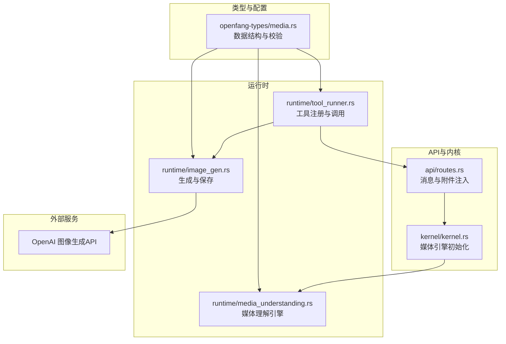
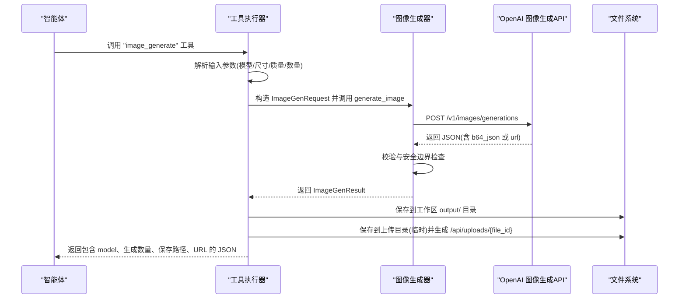
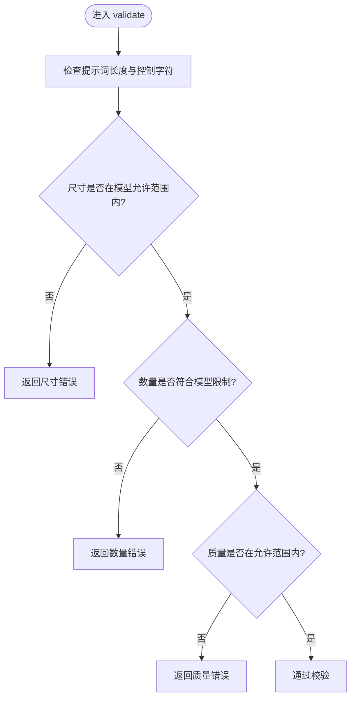
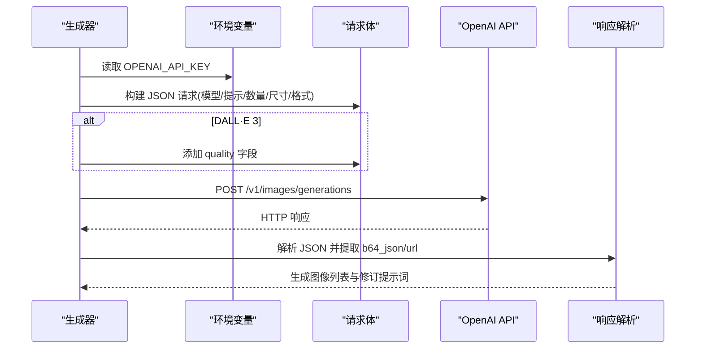
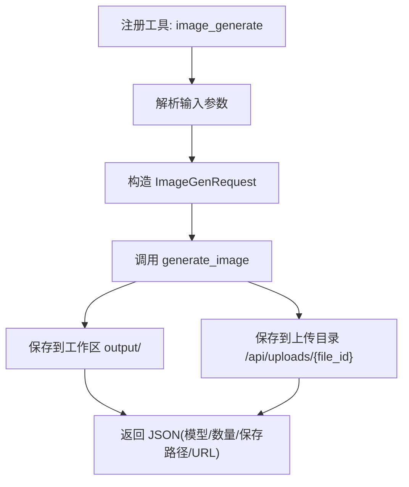
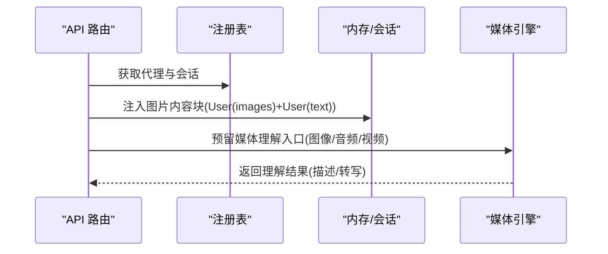
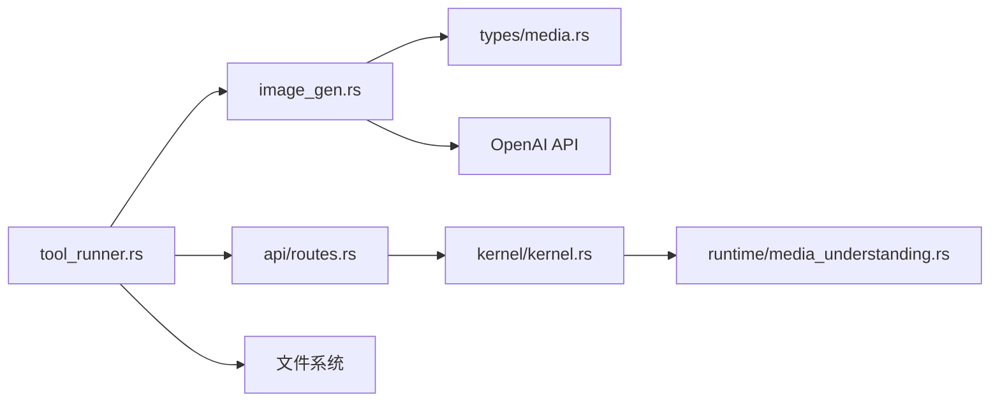

# 图像生成

<cite>
**本文引用的文件**
- [crates/openfang-types/src/media.rs](file://crates/openfang-types/src/media.rs)
- [crates/openfang-runtime/src/image_gen.rs](file://crates/openfang-runtime/src/image_gen.rs)
- [crates/openfang-runtime/src/tool_runner.rs](file://crates/openfang-runtime/src/tool_runner.rs)
- [crates/openfang-runtime/src/media_understanding.rs](file://crates/openfang-runtime/src/media_understanding.rs)
- [crates/openfang-api/src/routes.rs](file://crates/openfang-api/src/routes.rs)
- [crates/openfang-kernel/src/kernel.rs](file://crates/openfang-kernel/src/kernel.rs)
- [openfang.toml.example](file://openfang.toml.example)
</cite>

## 目录
1. [简介](#简介)
2. [项目结构](#项目结构)
3. [核心组件](#核心组件)
4. [架构总览](#架构总览)
5. [详细组件分析](#详细组件分析)
6. [依赖关系分析](#依赖关系分析)
7. [性能考量](#性能考量)
8. [故障排查指南](#故障排查指南)
9. [结论](#结论)
10. [附录](#附录)

## 简介
本技术文档聚焦于系统内的图像生成功能，涵盖以下方面：
- 图像生成API集成：当前通过OpenAI图像生成接口完成，支持DALL·E 3、DALL·E 2与GPT-Image-1。
- 提示词处理：对提示词长度、控制字符进行校验；DALL·E 3会返回修订后的提示词。
- 参数配置：模型选择、尺寸、质量、数量等参数的约束与默认值。
- 输出格式管理：统一以base64编码返回，可选保存至工作区与上传目录，便于Web端渲染。
- 质量控制与安全：大小限制、允许的MIME类型、超时与错误截断、日志脱敏。
- 成本优化与批量处理：并发与限流策略（由上游API与运行时共同保障）、批量生成与保存。
- 智能体工作流集成：作为工具在智能体内被调用，支持将生成结果注入会话或直接返回。

## 项目结构
与图像生成相关的核心模块分布如下：
- 类型定义与校验：位于媒体类型与图像生成请求/结果的数据结构及校验逻辑。
- 运行时实现：图像生成工具函数、请求构建与响应解析、保存到工作区与上传目录。
- 工具注册与调用：在工具注册表中声明“image_generate”工具，并在执行器中实现具体行为。
- 媒体理解引擎：用于图像描述、音频转写等多模态能力（与图像生成形成互补）。
- API路由：消息发送与附件注入，支持将图片内容块注入到智能体会话中。
- 内核初始化：媒体引擎初始化，为后续多模态能力提供基础。

**图表来源**
- [crates/openfang-types/src/media.rs:202-341](file://crates/openfang-types/src/media.rs#L202-L341)
- [crates/openfang-runtime/src/image_gen.rs:10-105](file://crates/openfang-runtime/src/image_gen.rs#L10-L105)
- [crates/openfang-runtime/src/tool_runner.rs:980-995](file://crates/openfang-runtime/src/tool_runner.rs#L980-L995)
- [crates/openfang-api/src/routes.rs:290-326](file://crates/openfang-api/src/routes.rs#L290-L326)
- [crates/openfang-kernel/src/kernel.rs:919-921](file://crates/openfang-kernel/src/kernel.rs#L919-L921)

**章节来源**
- [crates/openfang-types/src/media.rs:202-341](file://crates/openfang-types/src/media.rs#L202-L341)
- [crates/openfang-runtime/src/image_gen.rs:10-105](file://crates/openfang-runtime/src/image_gen.rs#L10-L105)
- [crates/openfang-runtime/src/tool_runner.rs:980-995](file://crates/openfang-runtime/src/tool_runner.rs#L980-L995)
- [crates/openfang-runtime/src/media_understanding.rs:12-26](file://crates/openfang-runtime/src/media_understanding.rs#L12-L26)
- [crates/openfang-api/src/routes.rs:290-326](file://crates/openfang-api/src/routes.rs#L290-L326)
- [crates/openfang-kernel/src/kernel.rs:919-921](file://crates/openfang-kernel/src/kernel.rs#L919-L921)

## 核心组件
- 数据模型与校验
  - 图像生成请求结构包含提示词、模型、尺寸、质量、数量等字段，并提供严格的校验规则（如提示词长度、控制字符、尺寸集合、数量范围、质量枚举）。
  - 结果结构包含生成的图像列表、所用模型以及可能的修订提示词。
- 生成实现
  - 构建请求体，按模型差异设置质量字段；调用OpenAI图像生成API；解析响应并进行安全边界检查（如base64长度限制）。
- 工具封装
  - 在工具注册表中声明“image_generate”，在执行器中解析输入参数、构造请求、调用生成函数，并将结果保存到工作区与上传目录，最终返回统一的JSON响应。
- 输出管理
  - 将base64解码后保存为PNG文件；同时生成临时上传目录中的UUID文件以便Web端GET访问；若未提供工作区则仅保存到上传目录。
- 多模态协同
  - 媒体理解引擎支持图像描述、音频转写等，与图像生成形成互补，可在智能体工作流中组合使用。

**章节来源**
- [crates/openfang-types/src/media.rs:202-341](file://crates/openfang-types/src/media.rs#L202-L341)
- [crates/openfang-runtime/src/image_gen.rs:10-105](file://crates/openfang-runtime/src/image_gen.rs#L10-L105)
- [crates/openfang-runtime/src/tool_runner.rs:2816-2893](file://crates/openfang-runtime/src/tool_runner.rs#L2816-L2893)
- [crates/openfang-runtime/src/media_understanding.rs:12-26](file://crates/openfang-runtime/src/media_understanding.rs#L12-L26)

## 架构总览
下图展示了从智能体调用到API响应的关键交互路径，包括参数解析、请求构建、外部API调用、结果保存与回传。

**图表来源**
- [crates/openfang-runtime/src/tool_runner.rs:2816-2893](file://crates/openfang-runtime/src/tool_runner.rs#L2816-L2893)
- [crates/openfang-runtime/src/image_gen.rs:10-105](file://crates/openfang-runtime/src/image_gen.rs#L10-L105)

**章节来源**
- [crates/openfang-runtime/src/tool_runner.rs:2816-2893](file://crates/openfang-runtime/src/tool_runner.rs#L2816-L2893)
- [crates/openfang-runtime/src/image_gen.rs:10-105](file://crates/openfang-runtime/src/image_gen.rs#L10-L105)

## 详细组件分析

### 组件A：图像生成请求与校验
- 关键点
  - 提示词长度上限与控制字符过滤，防止异常输入。
  - 尺寸集合按模型限定，DALL·E 3支持特定尺寸集，DALL·E 2与GPT-Image-1各有各自集合。
  - 数量限制：DALL·E 3仅支持1；DALL·E 2/GPT-Image-1支持1-4。
  - 质量枚举：DALL·E 3仅支持“standard/hd”；其他模型支持“standard/auto/high/medium/low”。
  - 返回修订提示词：DALL·E 3会返回经修正的提示词，可用于质量优化。
- 安全与边界
  - 对base64数据长度进行上限控制，避免内存压力。
  - 对响应体进行截断，避免敏感信息泄露到日志。

**图表来源**
- [crates/openfang-types/src/media.rs:238-321](file://crates/openfang-types/src/media.rs#L238-L321)

**章节来源**
- [crates/openfang-types/src/media.rs:238-321](file://crates/openfang-types/src/media.rs#L238-L321)

### 组件B：图像生成器与外部API集成
- 关键点
  - 读取环境变量OPENAI_API_KEY；构建请求体（模型、提示词、数量、尺寸、响应格式为b64_json）。
  - DALL·E 3额外携带质量字段；设置超时时间；对非成功状态进行错误截断与安全处理。
  - 解析响应数组，提取base64或URL；对空结果进行错误处理。
- 输出与存储
  - 生成结果包含模型名与修订提示词；可选保存到工作区output/目录（PNG格式）。
- 错误处理
  - API失败、解析失败、无图像返回、base64过大等均进行明确错误返回。

**图表来源**
- [crates/openfang-runtime/src/image_gen.rs:10-105](file://crates/openfang-runtime/src/image_gen.rs#L10-L105)

**章节来源**
- [crates/openfang-runtime/src/image_gen.rs:10-105](file://crates/openfang-runtime/src/image_gen.rs#L10-L105)

### 组件C：工具注册与调用流程
- 关键点
  - 工具注册表声明“image_generate”，定义输入schema（提示词必填，模型/尺寸/质量/数量有默认值与范围）。
  - 执行器解析输入，映射模型别名为内部枚举；构造请求并调用生成器。
  - 保存到工作区与上传目录，生成Web可访问URL；返回统一JSON。
- 并发与批量
  - 单次工具调用对应一次请求；批量可通过多次调用实现；运行时未内置并发队列，建议在上层工作流中控制并发。

**图表来源**
- [crates/openfang-runtime/src/tool_runner.rs:980-995](file://crates/openfang-runtime/src/tool_runner.rs#L980-L995)
- [crates/openfang-runtime/src/tool_runner.rs:2816-2893](file://crates/openfang-runtime/src/tool_runner.rs#L2816-L2893)

**章节来源**
- [crates/openfang-runtime/src/tool_runner.rs:980-995](file://crates/openfang-runtime/src/tool_runner.rs#L980-L995)
- [crates/openfang-runtime/src/tool_runner.rs:2816-2893](file://crates/openfang-runtime/src/tool_runner.rs#L2816-L2893)

### 组件D：与智能体工作流的集成
- 会话注入
  - 可将图片内容块预注入到智能体会话中，确保大模型在当前轮次即可看到图片。
- 媒体引擎
  - 媒体理解引擎支持图像描述、音频转写等，可与图像生成配合，形成“生成-理解-再生成”的闭环。
- 内核初始化
  - 内核启动时初始化媒体引擎，为后续多模态能力提供基础。

**图表来源**
- [crates/openfang-api/src/routes.rs:290-326](file://crates/openfang-api/src/routes.rs#L290-L326)
- [crates/openfang-kernel/src/kernel.rs:919-921](file://crates/openfang-kernel/src/kernel.rs#L919-L921)
- [crates/openfang-runtime/src/media_understanding.rs:12-26](file://crates/openfang-runtime/src/media_understanding.rs#L12-L26)

**章节来源**
- [crates/openfang-api/src/routes.rs:290-326](file://crates/openfang-api/src/routes.rs#L290-L326)
- [crates/openfang-kernel/src/kernel.rs:919-921](file://crates/openfang-kernel/src/kernel.rs#L919-L921)
- [crates/openfang-runtime/src/media_understanding.rs:12-26](file://crates/openfang-runtime/src/media_understanding.rs#L12-L26)

## 依赖关系分析
- 组件耦合
  - 工具执行器依赖图像生成器；图像生成器依赖类型定义与环境变量；API路由依赖工具执行器与会话管理。
- 外部依赖
  - OpenAI图像生成API；文件系统（工作区与上传目录）；环境变量（OPENAI_API_KEY）。
- 潜在风险
  - API失败、网络超时、响应体异常、磁盘写入失败、base64过大等均需妥善处理。

**图表来源**
- [crates/openfang-runtime/src/tool_runner.rs:2816-2893](file://crates/openfang-runtime/src/tool_runner.rs#L2816-L2893)
- [crates/openfang-runtime/src/image_gen.rs:10-105](file://crates/openfang-runtime/src/image_gen.rs#L10-L105)
- [crates/openfang-types/src/media.rs:202-341](file://crates/openfang-types/src/media.rs#L202-L341)
- [crates/openfang-api/src/routes.rs:290-326](file://crates/openfang-api/src/routes.rs#L290-L326)
- [crates/openfang-kernel/src/kernel.rs:919-921](file://crates/openfang-kernel/src/kernel.rs#L919-L921)
- [crates/openfang-runtime/src/media_understanding.rs:12-26](file://crates/openfang-runtime/src/media_understanding.rs#L12-L26)

**章节来源**
- [crates/openfang-runtime/src/tool_runner.rs:2816-2893](file://crates/openfang-runtime/src/tool_runner.rs#L2816-L2893)
- [crates/openfang-runtime/src/image_gen.rs:10-105](file://crates/openfang-runtime/src/image_gen.rs#L10-L105)
- [crates/openfang-types/src/media.rs:202-341](file://crates/openfang-types/src/media.rs#L202-L341)
- [crates/openfang-api/src/routes.rs:290-326](file://crates/openfang-api/src/routes.rs#L290-L326)
- [crates/openfang-kernel/src/kernel.rs:919-921](file://crates/openfang-kernel/src/kernel.rs#L919-L921)
- [crates/openfang-runtime/src/media_understanding.rs:12-26](file://crates/openfang-runtime/src/media_understanding.rs#L12-L26)

## 性能考量
- 超时与重试
  - 生成请求设置了超时时间，避免长时间阻塞；对外部API失败采用错误截断与安全处理。
- 并发与限流
  - 当前未在运行时实现显式的并发队列；建议在上层工作流或任务调度中控制并发度，避免触发上游API限流。
- 存储与I/O
  - 保存到工作区与上传目录均为同步写入；对于大批量生成，建议分批处理并监控磁盘空间。
- 安全边界
  - 对base64长度与解码后大小进行上限控制，防止内存与磁盘压力。

[本节为通用性能建议，不直接分析具体文件]

## 故障排查指南
- 常见错误与定位
  - 缺少OPENAI_API_KEY：生成器会在读取环境变量时报错，确认密钥已正确设置。
  - 请求参数非法：提示词过长、包含控制字符、尺寸不在允许集合、数量超出限制、质量不在允许集合等，均会触发校验错误。
  - API失败：HTTP状态非成功时，会对响应体进行截断并返回错误信息，注意查看状态码与截断文本。
  - 无图像返回：当响应数组为空时，会返回“无图像返回”的错误。
  - base64过大：超过上限会跳过该图像并记录警告。
- 排查步骤
  - 检查环境变量OPENAI_API_KEY是否设置且有效。
  - 校验提示词长度与内容，确保不包含非法控制字符。
  - 确认尺寸、数量、质量参数符合目标模型要求。
  - 查看生成器返回的错误信息与状态码，结合日志定位问题。
  - 若涉及工作区保存，检查输出目录权限与磁盘空间。

**章节来源**
- [crates/openfang-runtime/src/image_gen.rs:14-105](file://crates/openfang-runtime/src/image_gen.rs#L14-L105)
- [crates/openfang-types/src/media.rs:238-321](file://crates/openfang-types/src/media.rs#L238-L321)

## 结论
本图像生成功能以OpenAI图像生成API为核心，围绕类型校验、参数约束、安全边界与输出管理构建了完整的运行链路。通过工具注册与智能体工作流集成，实现了从提示词到图像的自动化生成，并支持将结果注入会话或直接返回。在实际部署中，建议关注API配额与并发控制、磁盘空间与I/O性能、以及日志与错误信息的安全处理，以获得稳定高效的图像生成体验。

[本节为总结性内容，不直接分析具体文件]

## 附录

### A. 配置与环境变量
- OPENAI_API_KEY：必需，用于调用OpenAI图像生成API。
- 示例配置文件位置：openfang.toml.example，可参考其结构进行自定义。

**章节来源**
- [crates/openfang-runtime/src/image_gen.rs:14-16](file://crates/openfang-runtime/src/image_gen.rs#L14-L16)
- [openfang.toml.example:1-49](file://openfang.toml.example#L1-L49)

### B. 工具输入参数与默认值
- prompt：必填，最大长度受控。
- model：可选，默认dall-e-3；支持dall-e-3、dall-e-2、gpt-image-1。
- size：可选，默认1024x1024；按模型限定集合选择。
- quality：可选，默认hd（DALL·E 3）或standard（其他模型）。
- count：可选，默认1；DALL·E 3仅支持1，其他模型支持1-4。

**章节来源**
- [crates/openfang-runtime/src/tool_runner.rs:980-995](file://crates/openfang-runtime/src/tool_runner.rs#L980-L995)
- [crates/openfang-types/src/media.rs:202-231](file://crates/openfang-types/src/media.rs#L202-L231)

### C. 输出格式与保存策略
- 输出格式：统一以base64编码返回；可选保存为PNG文件。
- 保存位置：
  - 工作区：output/ 目录，文件名包含时间戳与序号。
  - 上传目录：临时目录，文件名UUID，可通过 /api/uploads/{file_id} 访问。
- Web集成：返回 image_urls 以便前端直接渲染。

**章节来源**
- [crates/openfang-runtime/src/image_gen.rs:107-145](file://crates/openfang-runtime/src/image_gen.rs#L107-L145)
- [crates/openfang-runtime/src/tool_runner.rs:2864-2893](file://crates/openfang-runtime/src/tool_runner.rs#L2864-L2893)