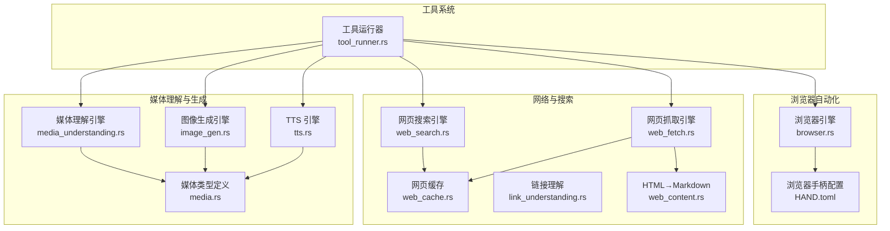
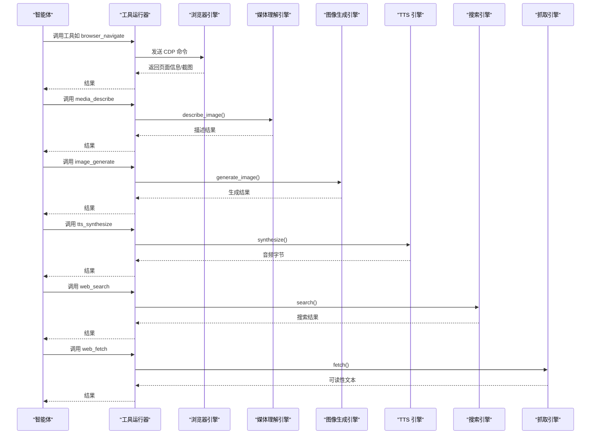
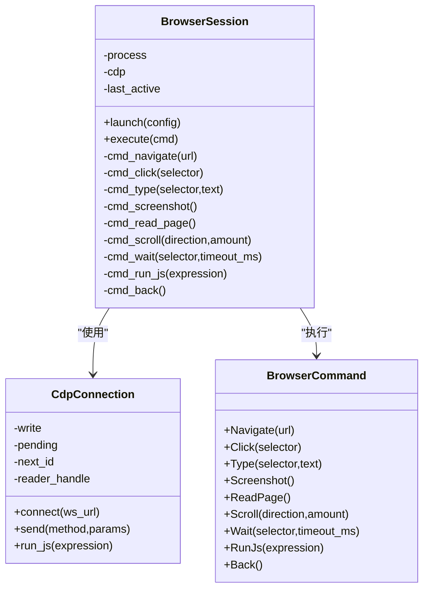
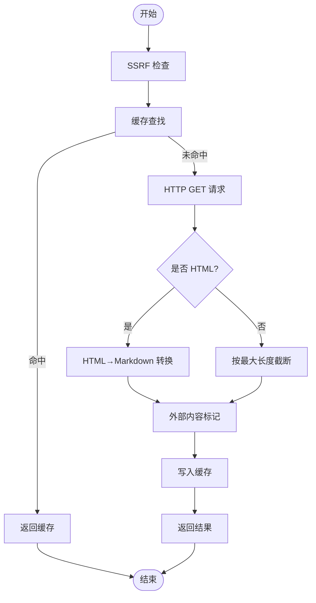
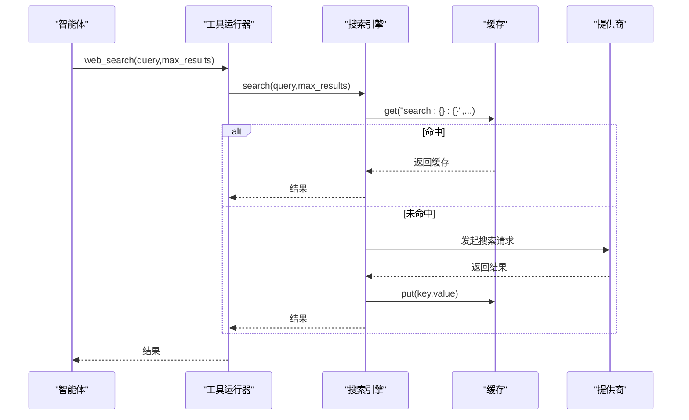
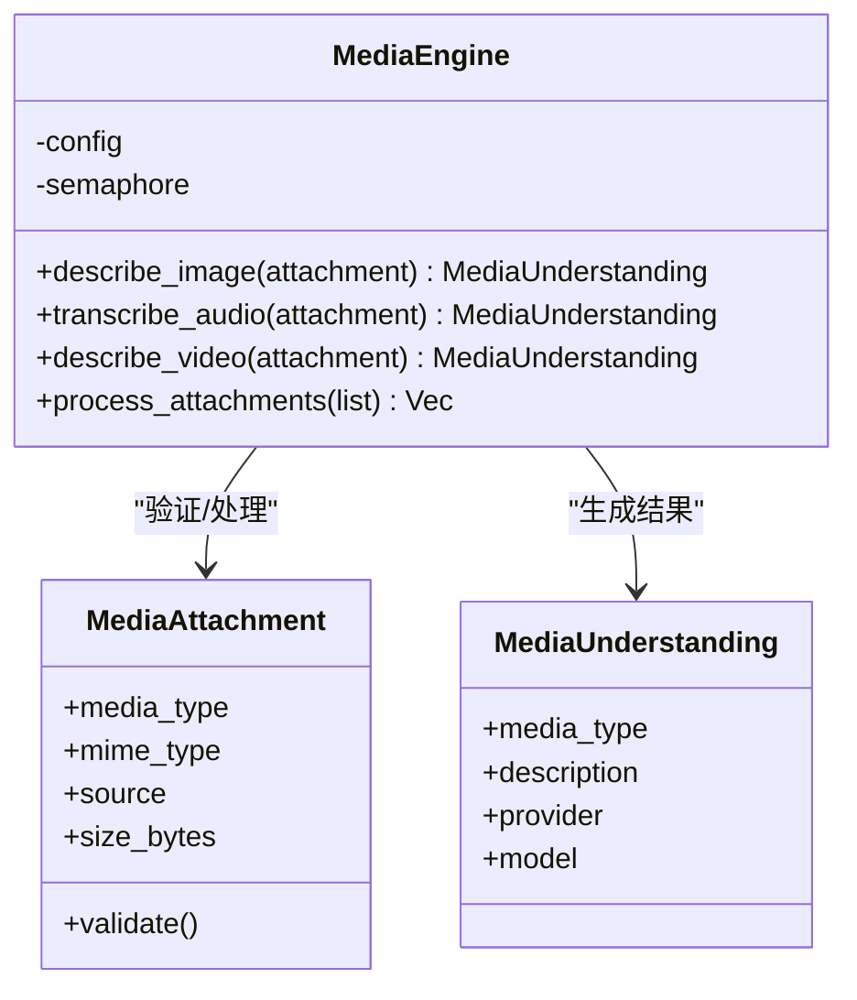
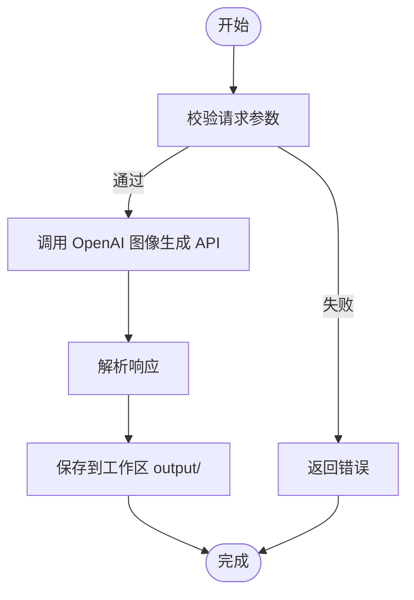
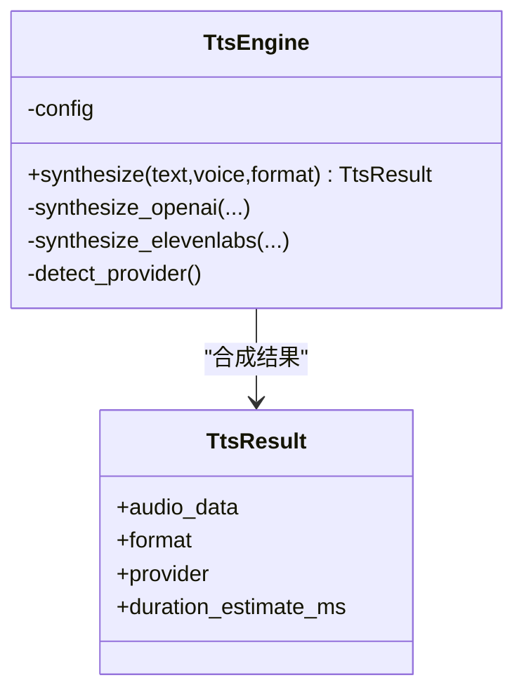
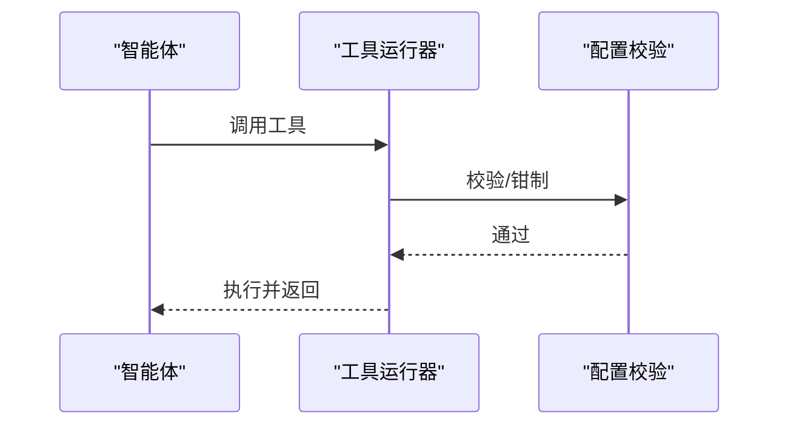
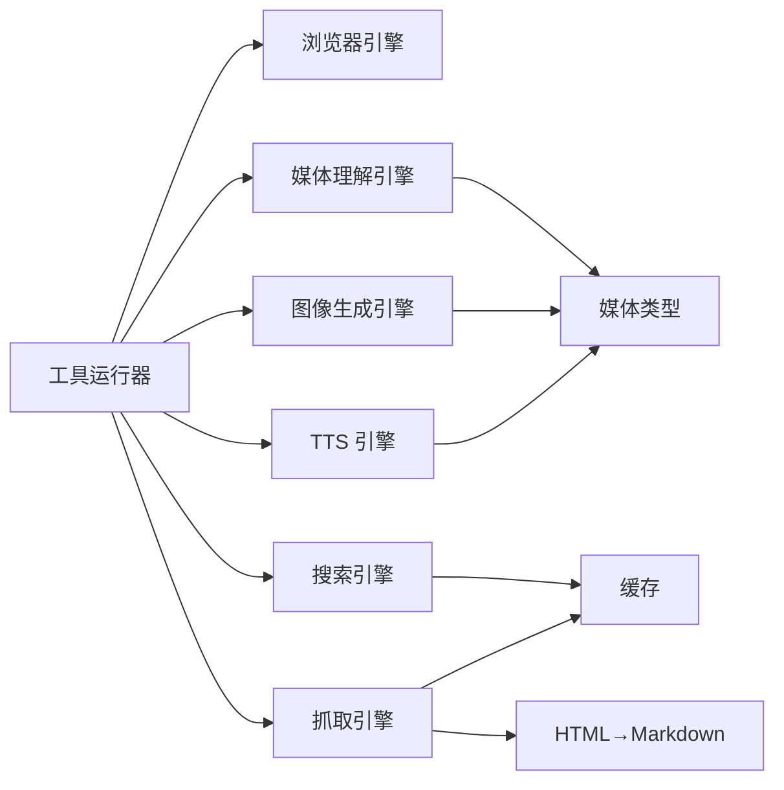

# 媒体处理

<cite>
**本文引用的文件**
- [media_understanding.rs](file://crates/openfang-runtime/src/media_understanding.rs)
- [image_gen.rs](file://crates/openfang-runtime/src/image_gen.rs)
- [tts.rs](file://crates/openfang-runtime/src/tts.rs)
- [browser.rs](file://crates/openfang-runtime/src/browser.rs)
- [web_content.rs](file://crates/openfang-runtime/src/web_content.rs)
- [web_cache.rs](file://crates/openfang-runtime/src/web_cache.rs)
- [web_fetch.rs](file://crates/openfang-runtime/src/web_fetch.rs)
- [web_search.rs](file://crates/openfang-runtime/src/web_search.rs)
- [link_understanding.rs](file://crates/openfang-runtime/src/link_understanding.rs)
- [tool_runner.rs](file://crates/openfang-runtime/src/tool_runner.rs)
- [media.rs](file://crates/openfang-types/src/media.rs)
- [config.rs](file://crates/openfang-types/src/config.rs)
- [HAND.toml](file://crates/openfang-hands/bundled/browser/HAND.toml)
</cite>

## 目录
1. [简介](#简介)
2. [项目结构](#项目结构)
3. [核心组件](#核心组件)
4. [架构总览](#架构总览)
5. [详细组件分析](#详细组件分析)
6. [依赖关系分析](#依赖关系分析)
7. [性能考量](#性能考量)
8. [故障排查指南](#故障排查指南)
9. [结论](#结论)
10. [附录](#附录)

## 简介
本技术文档面向“媒体处理系统”，聚焦于网页内容提取、网络请求处理与搜索引擎集成，以及浏览器自动化、图像生成与文本转语音（TTS）的技术实现。文档从系统架构、组件关系、数据流与处理逻辑入手，结合具体代码路径与图示，帮助读者快速理解并高效使用与扩展该能力体系。

## 项目结构
媒体处理系统主要由以下模块构成：
- 浏览器自动化：基于 Chrome DevTools Protocol 的原生无头浏览器会话管理与交互。
- 网络层：增强型抓取（含 SSRF 防护、HTML→Markdown 提取、缓存）、搜索引擎多提供商集成与自动降级。
- 多媒体理解：图像描述、音频转写、视频描述；支持并发限流与本地/云端模型切换。
- 文本转语音：多提供商自动选择与参数覆盖，安全内存管理与大小限制。
- 工具系统：统一的工具定义与调用入口，封装浏览器、媒体理解、图像生成、TTS 等能力。

**图表来源**
- [tool_runner.rs](file://crates/openfang-runtime/src/tool_runner.rs)
- [browser.rs](file://crates/openfang-runtime/src/browser.rs)
- [web_fetch.rs](file://crates/openfang-runtime/src/web_fetch.rs)
- [web_search.rs](file://crates/openfang-runtime/src/web_search.rs)
- [web_content.rs](file://crates/openfang-runtime/src/web_content.rs)
- [web_cache.rs](file://crates/openfang-runtime/src/web_cache.rs)
- [media_understanding.rs](file://crates/openfang-runtime/src/media_understanding.rs)
- [image_gen.rs](file://crates/openfang-runtime/src/image_gen.rs)
- [tts.rs](file://crates/openfang-runtime/src/tts.rs)
- [media.rs](file://crates/openfang-types/src/media.rs)
- [HAND.toml](file://crates/openfang-hands/bundled/browser/HAND.toml)

**章节来源**
- [tool_runner.rs](file://crates/openfang-runtime/src/tool_runner.rs)
- [browser.rs](file://crates/openfang-runtime/src/browser.rs)
- [web_fetch.rs](file://crates/openfang-runtime/src/web_fetch.rs)
- [web_search.rs](file://crates/openfang-runtime/src/web_search.rs)
- [web_content.rs](file://crates/openfang-runtime/src/web_content.rs)
- [web_cache.rs](file://crates/openfang-runtime/src/web_cache.rs)
- [media_understanding.rs](file://crates/openfang-runtime/src/media_understanding.rs)
- [image_gen.rs](file://crates/openfang-runtime/src/image_gen.rs)
- [tts.rs](file://crates/openfang-runtime/src/tts.rs)
- [media.rs](file://crates/openfang-types/src/media.rs)
- [HAND.toml](file://crates/openfang-hands/bundled/browser/HAND.toml)

## 核心组件
- 浏览器自动化引擎：通过 CDP 连接 Chromium，提供导航、点击、输入、截图、读页、滚动、等待、JS 执行等命令，并内置安全与超时控制。
- 网络抓取与可读性：在 SSRF 检查、缓存命中、HTML→Markdown 转换、外部内容标记后返回精简文本。
- 搜索引擎集成：支持 Brave、Tavily、Perplexity、DuckDuckGo 四大提供商，自动优先级降级与缓存。
- 媒体理解：图像描述（视觉模型自动选择）、音频转写（Groq/OpenAI/Parakeet MLX）、视频描述（Gemini），并发限流与多源支持。
- 图像生成：基于 OpenAI 接口的 DALL-E 系列生成，支持质量与尺寸约束，输出保存到工作区。
- 文本转语音：OpenAI 或 ElevenLabs 自动选择，支持语音与格式覆盖，带大小限制与内存安全。
- 工具系统：统一的工具定义与调用，封装上述能力，便于在智能体流程中组合使用。

**章节来源**
- [browser.rs](file://crates/openfang-runtime/src/browser.rs)
- [web_fetch.rs](file://crates/openfang-runtime/src/web_fetch.rs)
- [web_search.rs](file://crates/openfang-runtime/src/web_search.rs)
- [media_understanding.rs](file://crates/openfang-runtime/src/media_understanding.rs)
- [image_gen.rs](file://crates/openfang-runtime/src/image_gen.rs)
- [tts.rs](file://crates/openfang-runtime/src/tts.rs)
- [tool_runner.rs](file://crates/openfang-runtime/src/tool_runner.rs)

## 架构总览
媒体处理系统采用“工具化 + 引擎化”的分层设计：
- 工具层：对外暴露标准化工具接口，屏蔽底层实现细节。
- 引擎层：浏览器、网络、搜索、媒体理解、TTS 等独立引擎，职责清晰、可替换。
- 类型与配置：统一的数据结构与配置校验，确保跨模块一致性与安全性。

**图表来源**
- [tool_runner.rs](file://crates/openfang-runtime/src/tool_runner.rs)
- [browser.rs](file://crates/openfang-runtime/src/browser.rs)
- [media_understanding.rs](file://crates/openfang-runtime/src/media_understanding.rs)
- [image_gen.rs](file://crates/openfang-runtime/src/image_gen.rs)
- [tts.rs](file://crates/openfang-runtime/src/tts.rs)
- [web_search.rs](file://crates/openfang-runtime/src/web_search.rs)
- [web_fetch.rs](file://crates/openfang-runtime/src/web_fetch.rs)

## 详细组件分析

### 浏览器自动化（CDP）
- 安全与隔离：启动无头 Chromium，严格环境变量白名单，避免子进程泄露；连接 CDP 后启用 Page/Runtime 域。
- 会话管理：每个智能体一个会话，超时与空闲回收；命令超时与读取循环分离，异常通道路由。
- 交互能力：导航、点击、输入、截图、读页、滚动、等待元素出现、执行 JS、后退等。
- SSRF 与内容保护：页面内容经外部内容标记包裹，避免信任边界污染。

**图表来源**
- [browser.rs](file://crates/openfang-runtime/src/browser.rs)

**章节来源**
- [browser.rs](file://crates/openfang-runtime/src/browser.rs)
- [HAND.toml](file://crates/openfang-hands/bundled/browser/HAND.toml)

### 网络请求与内容提取
- 抓取管线：SSRF 检查 → 缓存查找 → HTTP 请求 → HTML 检测 → HTML→Markdown → 截断 → 外部内容标记 → 缓存写入 → 返回。
- HTML→Markdown：移除非内容块、提取主内容区、转换标签为 Markdown、清理空白与实体解码。
- 缓存：基于 DashMap 的线程安全内存缓存，惰性过期清理，零 TTL 即禁用缓存。
- 链接理解：从消息中抽取 URL，注入上下文提示，配合 web_fetch 使用。

**图表来源**
- [web_fetch.rs](file://crates/openfang-runtime/src/web_fetch.rs)
- [web_content.rs](file://crates/openfang-runtime/src/web_content.rs)
- [web_cache.rs](file://crates/openfang-runtime/src/web_cache.rs)
- [link_understanding.rs](file://crates/openfang-runtime/src/link_understanding.rs)

**章节来源**
- [web_fetch.rs](file://crates/openfang-runtime/src/web_fetch.rs)
- [web_content.rs](file://crates/openfang-runtime/src/web_content.rs)
- [web_cache.rs](file://crates/openfang-runtime/src/web_cache.rs)
- [link_understanding.rs](file://crates/openfang-runtime/src/link_understanding.rs)

### 搜索引擎集成
- 多提供商：Brave、Tavily、Perplexity、DuckDuckGo；Auto 模式按可用密钥自动降级。
- 统一缓存：搜索结果按查询+数量键值缓存，提升重复查询性能。
- 外部内容标记：对第三方来源结果进行标记，统一安全边界。

**图表来源**
- [web_search.rs](file://crates/openfang-runtime/src/web_search.rs)
- [web_cache.rs](file://crates/openfang-runtime/src/web_cache.rs)
- [tool_runner.rs](file://crates/openfang-runtime/src/tool_runner.rs)

**章节来源**
- [web_search.rs](file://crates/openfang-runtime/src/web_search.rs)
- [web_cache.rs](file://crates/openfang-runtime/src/web_cache.rs)
- [tool_runner.rs](file://crates/openfang-runtime/src/tool_runner.rs)

### 媒体理解（图像/音频/视频）
- 图像描述：自动检测可用视觉模型（Anthropic/OpenAI/Gemini），返回描述与模型信息。
- 音频转写：Groq Whisper、OpenAI Whisper、Parakeet MLX（本地）三选一；支持多种音频格式与并发限流。
- 视频描述：Gemini；需开启配置并设置相应密钥。
- 并发控制：信号量限制最大并发任务数，保障资源不被压垮。

**图表来源**
- [media_understanding.rs](file://crates/openfang-runtime/src/media_understanding.rs)
- [media.rs](file://crates/openfang-types/src/media.rs)

**章节来源**
- [media_understanding.rs](file://crates/openfang-runtime/src/media_understanding.rs)
- [media.rs](file://crates/openfang-types/src/media.rs)

### 图像生成（DALL-E 系列）
- 输入校验：提示词长度、尺寸、质量、数量等约束。
- API 调用：OpenAI 图像生成接口，支持响应格式为 base64。
- 输出处理：保存到工作区 output 目录，带大小限制与二次校验。

**图表来源**
- [image_gen.rs](file://crates/openfang-runtime/src/image_gen.rs)
- [media.rs](file://crates/openfang-types/src/media.rs)

**章节来源**
- [image_gen.rs](file://crates/openfang-runtime/src/image_gen.rs)
- [media.rs](file://crates/openfang-types/src/media.rs)

### 文本转语音（TTS）
- 自动选择：OpenAI 或 ElevenLabs，支持语音与格式覆盖。
- 安全与限制：文本长度上限、音频大小上限、超时控制。
- 结果结构：包含音频字节、格式、提供商与粗略时长估算。

**图表来源**
- [tts.rs](file://crates/openfang-runtime/src/tts.rs)

**章节来源**
- [tts.rs](file://crates/openfang-runtime/src/tts.rs)

### 工具系统与配置
- 工具定义：统一的工具定义结构，包含名称、描述与输入模式。
- 浏览器工具：navigate、click、type、screenshot、read_page、scroll、wait、run_js、back 等。
- 媒体工具：media_describe、media_transcribe、image_generate。
- 配置校验：Web 搜索提供商密钥检查、生产边界值钳制（超时、并发、响应大小等）。

**图表来源**
- [tool_runner.rs](file://crates/openfang-runtime/src/tool_runner.rs)
- [config.rs](file://crates/openfang-types/src/config.rs)

**章节来源**
- [tool_runner.rs](file://crates/openfang-runtime/src/tool_runner.rs)
- [config.rs](file://crates/openfang-types/src/config.rs)

## 依赖关系分析
- 模块耦合：工具运行器作为统一入口，依赖各引擎；引擎之间低耦合，通过类型与配置协作。
- 外部依赖：reqwest、tokio、dashmap、sha2、zeroize 等；浏览器依赖 Chromium 可执行文件。
- 安全边界：所有外部内容标记边界、HTML→Markdown 清洗、SSRF 检查、API 密钥零化存储。

**图表来源**
- [tool_runner.rs](file://crates/openfang-runtime/src/tool_runner.rs)
- [browser.rs](file://crates/openfang-runtime/src/browser.rs)
- [media_understanding.rs](file://crates/openfang-runtime/src/media_understanding.rs)
- [image_gen.rs](file://crates/openfang-runtime/src/image_gen.rs)
- [tts.rs](file://crates/openfang-runtime/src/tts.rs)
- [web_search.rs](file://crates/openfang-runtime/src/web_search.rs)
- [web_fetch.rs](file://crates/openfang-runtime/src/web_fetch.rs)
- [web_cache.rs](file://crates/openfang-runtime/src/web_cache.rs)
- [web_content.rs](file://crates/openfang-runtime/src/web_content.rs)
- [media.rs](file://crates/openfang-types/src/media.rs)

**章节来源**
- [tool_runner.rs](file://crates/openfang-runtime/src/tool_runner.rs)
- [media.rs](file://crates/openfang-types/src/media.rs)

## 性能考量
- 并发与限流：媒体理解使用信号量限制并发，避免资源争用；浏览器会话单实例、超时回收。
- 缓存策略：搜索与抓取均支持 TTL 缓存，减少重复请求；惰性过期，降低内存占用。
- I/O 与压缩：抓取启用 gzip/deflate/brotli；响应按最大长度截断，防止内存膨胀。
- 安全与健壮性：严格的 MIME 类型与大小限制、HTML 清洗、外部内容标记、API 密钥零化。

[本节为通用指导，无需特定文件引用]

## 故障排查指南
- 浏览器无法启动：确认 Chromium 可执行文件存在或通过环境变量指定路径；检查权限与沙箱设置。
- API 密钥缺失：根据配置校验提示设置对应环境变量；注意不同提供商的密钥名。
- 内容过大/超时：调整抓取/搜索/浏览器超时与大小限制；检查网络连通性。
- HTML→Markdown 异常：确认输入 HTML 结构；关注非内容块移除与实体解码逻辑。
- 并发过高：降低媒体理解并发度或增加资源；检查信号量与任务队列。

**章节来源**
- [browser.rs](file://crates/openfang-runtime/src/browser.rs)
- [web_fetch.rs](file://crates/openfang-runtime/src/web_fetch.rs)
- [web_search.rs](file://crates/openfang-runtime/src/web_search.rs)
- [media_understanding.rs](file://crates/openfang-runtime/src/media_understanding.rs)
- [config.rs](file://crates/openfang-types/src/config.rs)

## 结论
媒体处理系统以“工具化 + 引擎化”为核心，实现了从网页抓取、搜索引擎到浏览器自动化、图像生成与 TTS 的完整链路。通过严格的 SSRF 检查、内容清洗、缓存与并发控制，系统在保证安全性的同时兼顾性能与可扩展性。建议在生产环境中结合配置校验与边界钳制，合理设置超时与并发，以获得稳定高效的媒体处理体验。

[本节为总结，无需特定文件引用]

## 附录

### 常见配置与使用要点
- 网络代理：抓取引擎默认使用系统代理；如需自定义可在客户端构建时设置代理（参考抓取引擎初始化）。
- 内容过滤：HTML→Markdown 清洗非内容块与注释；外部内容统一标记，避免信任边界污染。
- 多媒体数据处理：图像/音频/视频均受 MIME 与大小限制；音频转写支持多种格式与本地模型。
- 工具调用：通过工具运行器统一调度，浏览器工具与媒体工具均可在智能体流程中组合使用。

**章节来源**
- [web_fetch.rs](file://crates/openfang-runtime/src/web_fetch.rs)
- [web_content.rs](file://crates/openfang-runtime/src/web_content.rs)
- [media_understanding.rs](file://crates/openfang-runtime/src/media_understanding.rs)
- [tool_runner.rs](file://crates/openfang-runtime/src/tool_runner.rs)