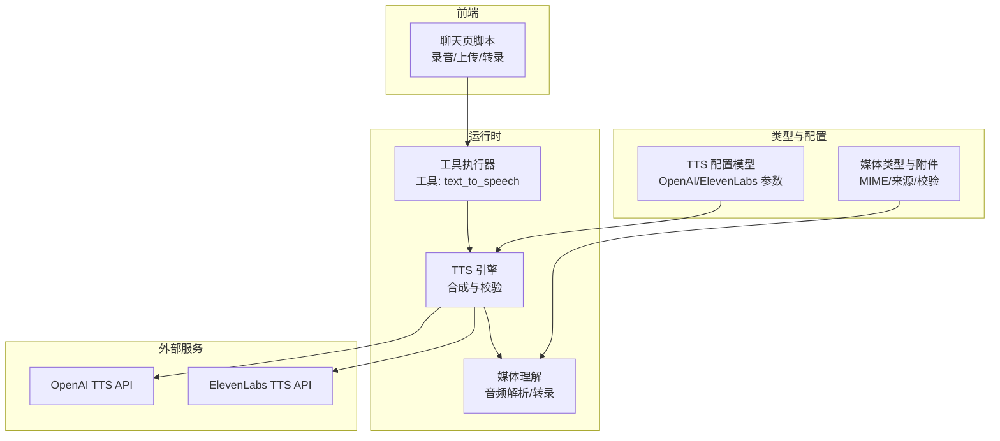
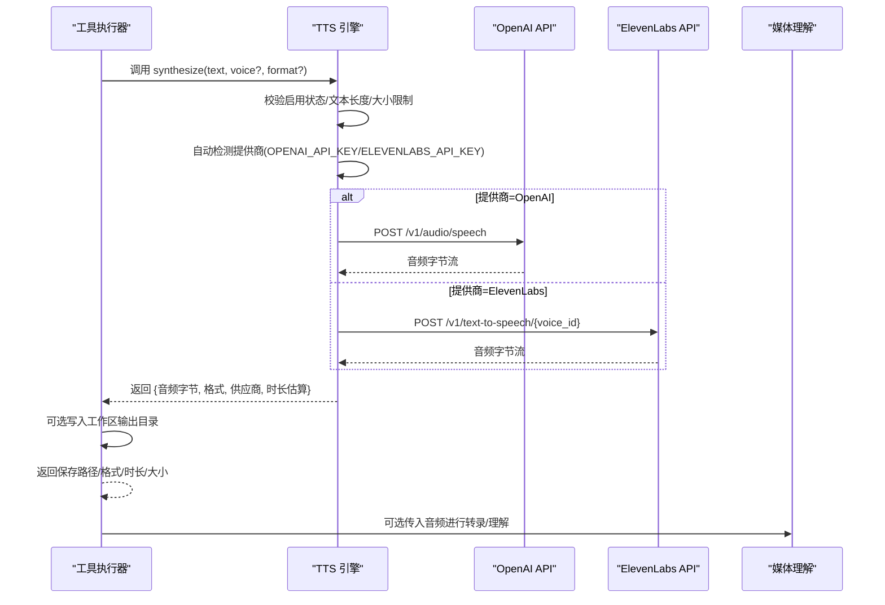
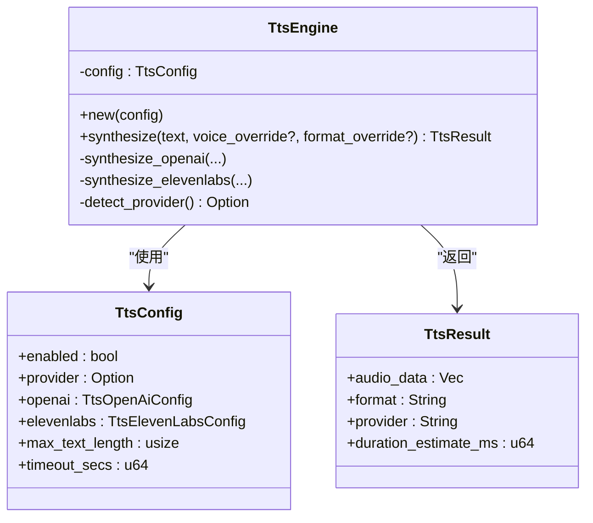
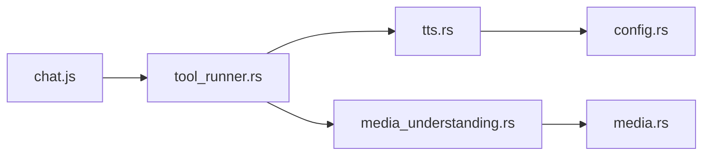
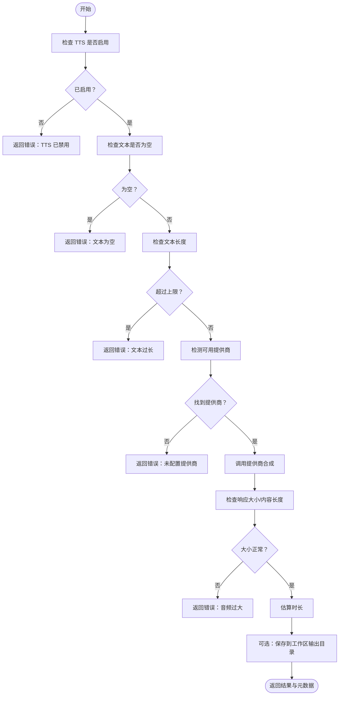

# 文本转语音

<cite>
**本文引用的文件**
- [tts.rs](file://crates/openfang-runtime/src/tts.rs)
- [config.rs](file://crates/openfang-types/src/config.rs)
- [tool_runner.rs](file://crates/openfang-runtime/src/tool_runner.rs)
- [media_understanding.rs](file://crates/openfang-runtime/src/media_understanding.rs)
- [media.rs](file://crates/openfang-types/src/media.rs)
- [lib.rs](file://crates/openfang-runtime/src/lib.rs)
- [chat.js](file://crates/openfang-api/static/js/pages/chat.js)
- [SKILL.md](file://crates/openfang-hands/bundled/clip/SKILL.md)
- [openfang.toml.example](file://openfang.toml.example)
</cite>

## 目录
1. [简介](#简介)
2. [项目结构](#项目结构)
3. [核心组件](#核心组件)
4. [架构总览](#架构总览)
5. [详细组件分析](#详细组件分析)
6. [依赖关系分析](#依赖关系分析)
7. [性能考量](#性能考量)
8. [故障排查指南](#故障排查指南)
9. [结论](#结论)
10. [附录](#附录)

## 简介
本技术文档围绕文本转语音（Text-to-Speech, TTS）子系统展开，覆盖语音合成引擎集成、语音参数配置、音频格式处理与播放控制机制，并深入说明语音质量优化、语速调节、音调控制与多语言支持。文档同时解释与通信渠道的集成方式，提供音质优化与性能调优的实用建议，并通过图示与路径引用帮助读者快速定位实现细节。

## 项目结构
TTS 子系统主要由以下模块构成：
- 运行时引擎：负责文本到音频的合成、参数校验、超时与大小限制、跨提供商自动降级。
- 配置模型：定义 TTS 开关、默认提供商、OpenAI/ElevenLabs 参数、最大文本长度与请求超时。
- 工具执行器：在工作流中以工具形式调用 TTS 引擎，保存音频并返回元数据。
- 媒体理解：负责音频输入的解析与格式推断，支撑语音识别与后续 TTS 播放。
- 前端交互：浏览器侧录音与上传流程，配合后端完成语音到文本与文本到语音的闭环。
- 手册与示例：提供第三方 API 调用示例与音视频合并技巧。

**图表来源**
- [tts.rs:1-310](file://crates/openfang-runtime/src/tts.rs#L1-L310)
- [config.rs:446-507](file://crates/openfang-types/src/config.rs#L446-L507)
- [tool_runner.rs:2899-2941](file://crates/openfang-runtime/src/tool_runner.rs#L2899-L2941)
- [media_understanding.rs:83-295](file://crates/openfang-runtime/src/media_understanding.rs#L83-L295)
- [media.rs:1-179](file://crates/openfang-types/src/media.rs#L1-L179)
- [chat.js:1132-1184](file://crates/openfang-api/static/js/pages/chat.js#L1132-L1184)

**章节来源**
- [lib.rs:50-52](file://crates/openfang-runtime/src/lib.rs#L50-L52)

## 核心组件
- TTS 引擎：提供统一的合成接口，自动检测可用提供商（OpenAI 或 ElevenLabs），并在超出阈值或不满足条件时返回错误；对响应大小与内容长度进行限制；估算音频时长用于播放控制。
- TTS 配置：集中管理开关、默认提供商、OpenAI 语音与速度、ElevenLabs 声音与稳定性等参数；限制单次合成文本长度与请求超时。
- 工具执行器：封装工具调用入口，接收 text/voice/format 等参数，调用引擎并落盘输出，返回保存路径与元信息。
- 媒体理解：根据 MIME 类型推断扩展名，读取本地/Base64/URL 音频源，支持转录与后续播放。
- 前端交互：浏览器侧录音、选择编解码格式、上传并触发转录，形成语音输入闭环。

**章节来源**
- [tts.rs:19-80](file://crates/openfang-runtime/src/tts.rs#L19-L80)
- [config.rs:446-507](file://crates/openfang-types/src/config.rs#L446-L507)
- [tool_runner.rs:2899-2941](file://crates/openfang-runtime/src/tool_runner.rs#L2899-L2941)
- [media_understanding.rs:83-295](file://crates/openfang-runtime/src/media_understanding.rs#L83-L295)
- [media.rs:1-179](file://crates/openfang-types/src/media.rs#L1-L179)
- [chat.js:1132-1184](file://crates/openfang-api/static/js/pages/chat.js#L1132-L1184)

## 架构总览
下图展示了从工具调用到外部服务请求，再到媒体理解与前端播放的整体流程。

**图表来源**
- [tool_runner.rs:2899-2941](file://crates/openfang-runtime/src/tool_runner.rs#L2899-L2941)
- [tts.rs:43-80](file://crates/openfang-runtime/src/tts.rs#L43-L80)
- [tts.rs:83-152](file://crates/openfang-runtime/src/tts.rs#L83-L152)
- [tts.rs:155-224](file://crates/openfang-runtime/src/tts.rs#L155-L224)
- [media_understanding.rs:83-295](file://crates/openfang-runtime/src/media_understanding.rs#L83-L295)

## 详细组件分析

### 组件一：TTS 引擎
- 功能要点
  - 启用状态与文本长度校验：禁用时报错；空文本或超长文本拒绝处理。
  - 提供商自动检测：优先使用配置中的 provider，否则基于环境变量自动选择 OpenAI 或 ElevenLabs。
  - OpenAI 合成：支持 voice/model/response_format/speed；限制响应大小与内容长度；估算时长。
  - ElevenLabs 合成：支持 voice_settings(stability/similarity_boost)；限制响应大小与内容长度；估算时长。
  - 错误处理：HTTP 失败时返回带截断的错误信息；超大音频报错；未知提供商报错。
- 关键数据结构
  - TtsResult：包含音频字节、格式、供应商、时长估算。
  - TtsEngine：持有 TtsConfig 并暴露 synthesize 接口。
- 性能与安全
  - 最大音频响应大小常量限制，避免内存压力。
  - 请求超时可配置，防止阻塞。
  - 单次文本长度上限，降低外部服务压力。

**图表来源**
- [tts.rs:11-22](file://crates/openfang-runtime/src/tts.rs#L11-L22)
- [config.rs:446-507](file://crates/openfang-types/src/config.rs#L446-L507)

**章节来源**
- [tts.rs:43-80](file://crates/openfang-runtime/src/tts.rs#L43-L80)
- [tts.rs:83-152](file://crates/openfang-runtime/src/tts.rs#L83-L152)
- [tts.rs:155-224](file://crates/openfang-runtime/src/tts.rs#L155-L224)

### 组件二：TTS 配置模型
- TtsConfig
  - enabled：是否启用 TTS。
  - provider：显式指定提供商（可为空，自动检测）。
  - openai：voice、model、format、speed。
  - elevenlabs：voice_id、model_id、stability、similarity_boost。
  - max_text_length、timeout_secs：文本长度上限与请求超时。
- 默认值
  - openai.voice="alloy"、model="tts-1"、format="mp3"、speed=1.0。
  - elevenlabs.voice_id="21m00Tcm4TlvDq8ikWAM"、model_id="eleven_monolingual_v1"、stability=0.5、similarity_boost=0.75。

**章节来源**
- [config.rs:446-507](file://crates/openfang-types/src/config.rs#L446-L507)

### 组件三：工具执行器（text_to_speech）
- 输入参数
  - text：必填。
  - voice、format：可选，按请求覆盖配置。
- 输出
  - 保存音频至工作区输出目录（若提供 workspace_root）。
  - 返回 JSON 包含 saved_to、format、provider、duration_estimate_ms、size_bytes。
- 错误处理
  - 若未启用 TTS 引擎或缺少 text，直接报错。

**章节来源**
- [tool_runner.rs:2899-2941](file://crates/openfang-runtime/src/tool_runner.rs#L2899-L2941)

### 组件四：媒体理解与音频格式处理
- 音频格式推断
  - 根据 MIME 类型映射扩展名（wav、mp3、ogg、webm、m4a、flac）。
  - 支持从本地文件、Base64 数据读取，必要时落地临时文件。
- 安全与限制
  - 对 MIME 类型与大小进行白名单与上限检查。
  - 仅允许受支持的音频类型。
- 用途
  - 为 TTS 输出提供统一的媒体结构，便于后续播放或转录。

**章节来源**
- [media_understanding.rs:83-295](file://crates/openfang-runtime/src/media_understanding.rs#L83-L295)
- [media.rs:134-147](file://crates/openfang-types/src/media.rs#L134-L147)

### 组件五：前端录音与上传（浏览器侧）
- 录音能力
  - 使用 MediaRecorder 选择最佳编解码（webm+opus > webm > ogg）。
  - 采集音频片段并停止时触发处理。
- 上传与转录
  - 将录音封装为文件并上传，随后移除“转录中”提示。
  - 该流程与后端媒体理解配合，形成语音输入闭环。

**章节来源**
- [chat.js:1132-1184](file://crates/openfang-api/static/js/pages/chat.js#L1132-L1184)

## 依赖关系分析
- 运行时模块导出
  - 运行时库导出了 tts 模块，表明 TTS 引擎作为运行时的一部分被其他模块复用。
- 外部依赖
  - OpenAI TTS API：/v1/audio/speech。
  - ElevenLabs TTS API：/v1/text-to-speech/{voice_id}。
- 内部依赖
  - 工具执行器依赖 TTS 引擎；媒体理解依赖媒体类型与附件模型；前端脚本与后端工具/媒体理解协作。

**图表来源**
- [lib.rs:50-52](file://crates/openfang-runtime/src/lib.rs#L50-L52)
- [tts.rs:1-10](file://crates/openfang-runtime/src/tts.rs#L1-L10)
- [tool_runner.rs:2899-2941](file://crates/openfang-runtime/src/tool_runner.rs#L2899-L2941)
- [media_understanding.rs:83-295](file://crates/openfang-runtime/src/media_understanding.rs#L83-L295)
- [media.rs:1-179](file://crates/openfang-types/src/media.rs#L1-L179)
- [chat.js:1132-1184](file://crates/openfang-api/static/js/pages/chat.js#L1132-L1184)

**章节来源**
- [lib.rs:50-52](file://crates/openfang-runtime/src/lib.rs#L50-L52)

## 性能考量
- 文本长度与超时
  - 合理设置 max_text_length 与 timeout_secs，避免长文本与慢网络导致的资源占用。
- 响应大小限制
  - 引擎内置最大音频响应大小常量，防止异常响应造成内存压力。
- 估算时长
  - 基于词数估算时长，可用于播放进度与 UI 更新。
- 编解码与格式
  - 浏览器侧优先选择 webm+opus，减少上传体积与转码成本。
- 第三方 API 调优
  - 参考手册中的 FFmpeg 参数与第三方 API 示例，优化最终音视频合并质量与体积。

**章节来源**
- [tts.rs:7-10](file://crates/openfang-runtime/src/tts.rs#L7-L10)
- [tts.rs:142-144](file://crates/openfang-runtime/src/tts.rs#L142-L144)
- [chat.js:1137-1138](file://crates/openfang-api/static/js/pages/chat.js#L1137-L1138)
- [SKILL.md:324-367](file://crates/openfang-hands/bundled/clip/SKILL.md#L324-L367)

## 故障排查指南
- 常见错误与定位
  - TTS 未启用：检查配置中的 enabled 与相关环境变量。
  - 缺少 API 密钥：确认 OPENAI_API_KEY 或 ELEVENLABS_API_KEY 是否设置。
  - 文本为空或过长：核对 max_text_length 与输入文本长度。
  - 响应过大：关注音频大小限制与外部服务返回的内容长度。
  - HTTP 失败：查看截断后的错误信息，定位具体提供商与状态码。
- 工具调用失败
  - 确认工具输入包含 text；若未启用 TTS 引擎会直接报错。
- 媒体理解异常
  - 检查 MIME 类型是否在允许列表内；确保文件大小未超过上限。

**章节来源**
- [tts.rs:49-63](file://crates/openfang-runtime/src/tts.rs#L49-L63)
- [tts.rs:89-119](file://crates/openfang-runtime/src/tts.rs#L89-L119)
- [tts.rs:160-193](file://crates/openfang-runtime/src/tts.rs#L160-L193)
- [tool_runner.rs:2904-2905](file://crates/openfang-runtime/src/tool_runner.rs#L2904-L2905)
- [media.rs:150-178](file://crates/openfang-types/src/media.rs#L150-L178)

## 结论
本 TTS 子系统通过统一的引擎抽象与严格的参数/大小/超时控制，实现了对 OpenAI 与 ElevenLabs 的无缝集成；结合工具执行器与媒体理解模块，形成了从文本到音频、从音频到文本的完整链路。前端录音与上传进一步完善了语音输入体验。通过合理配置与遵循性能与安全约束，可在保证质量的同时提升整体吞吐与稳定性。

## 附录

### 配置与示例参考
- 全局配置示例（包含默认模型与频道适配器等）
  - [openfang.toml.example:1-49](file://openfang.toml.example#L1-L49)
- OpenAI 与 ElevenLabs 的调用示例与音视频合并技巧
  - [SKILL.md:324-367](file://crates/openfang-hands/bundled/clip/SKILL.md#L324-L367)

### 关键流程图：TTS 合成与保存

**图表来源**
- [tts.rs:49-80](file://crates/openfang-runtime/src/tts.rs#L49-L80)
- [tts.rs:135-140](file://crates/openfang-runtime/src/tts.rs#L135-L140)
- [tool_runner.rs:2912-2930](file://crates/openfang-runtime/src/tool_runner.rs#L2912-L2930)