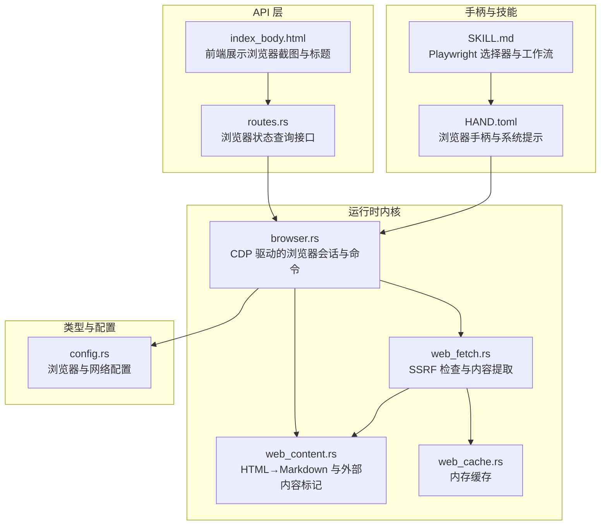
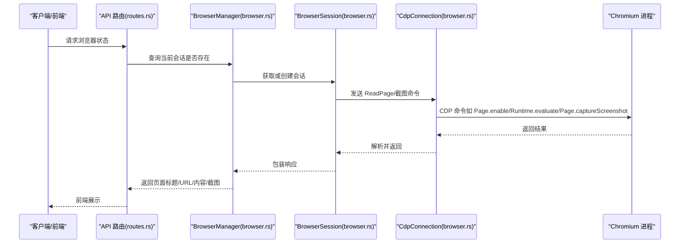
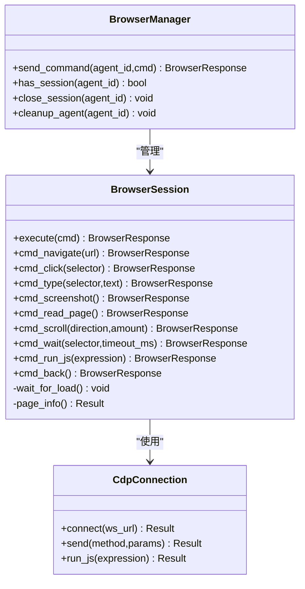
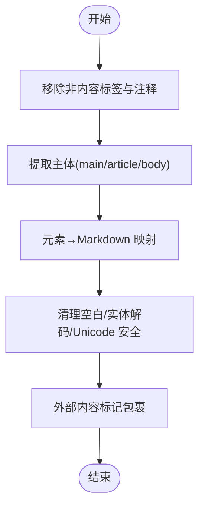
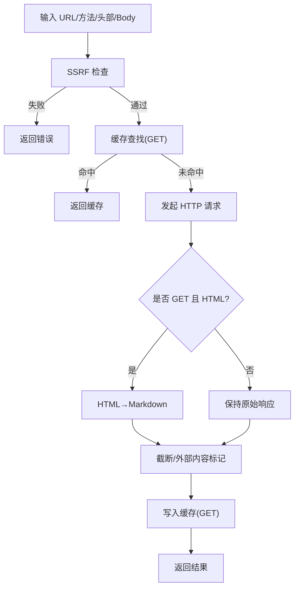
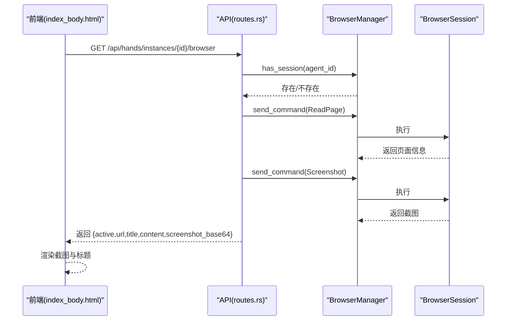
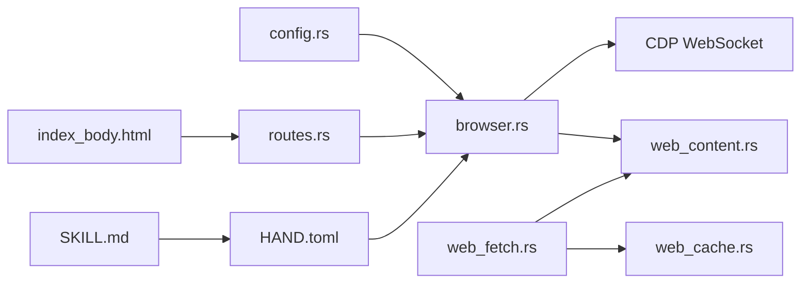

# 浏览器自动化

<cite>
**本文引用的文件**
- [browser.rs](file://crates/openfang-runtime/src/browser.rs)
- [routes.rs](file://crates/openfang-api/src/routes.rs)
- [config.rs](file://crates/openfang-types/src/config.rs)
- [web_content.rs](file://crates/openfang-runtime/src/web_content.rs)
- [web_cache.rs](file://crates/openfang-runtime/src/web_cache.rs)
- [web_fetch.rs](file://crates/openfang-runtime/src/web_fetch.rs)
- [HAND.toml](file://crates/openfang-hands/bundled/browser/HAND.toml)
- [SKILL.md](file://crates/openfang-hands/bundled/browser/SKILL.md)
- [index_body.html](file://crates/openfang-api/static/index_body.html)
</cite>

## 目录
1. [简介](#简介)
2. [项目结构](#项目结构)
3. [核心组件](#核心组件)
4. [架构总览](#架构总览)
5. [详细组件分析](#详细组件分析)
6. [依赖关系分析](#依赖关系分析)
7. [性能考量](#性能考量)
8. [故障排查指南](#故障排查指南)
9. [结论](#结论)
10. [附录](#附录)

## 简介
本技术文档面向浏览器自动化系统，聚焦于无头浏览器集成、页面渲染、JavaScript 执行与动态内容处理，覆盖页面导航、元素定位、用户交互模拟与截图捕获机制。文档同时阐述与内容提取系统的协同工作方式，并提供配置、等待策略、错误恢复与性能优化的实践建议，帮助开发者在生产环境中稳定、安全地使用浏览器自动化能力。

## 项目结构
浏览器自动化能力由运行时内核（openfang-runtime）提供，通过 Chrome DevTools Protocol（CDP）直接驱动 Chromium 实例；API 层（openfang-api）提供对外接口以查询浏览器状态并触发工具调用；类型定义（openfang-types）提供配置项；内容提取与缓存（web_content、web_cache、web_fetch）负责网页内容的可读性转换与安全保护；手柄（openfang-hands）提供可复用的技能与系统提示，指导自动化流程与安全规则。

图表来源
- [routes.rs:4704-4799](file://crates/openfang-api/src/routes.rs#L4704-L4799)
- [browser.rs:1-1363](file://crates/openfang-runtime/src/browser.rs#L1-L1363)
- [web_content.rs:1-450](file://crates/openfang-runtime/src/web_content.rs#L1-L450)
- [web_cache.rs:1-146](file://crates/openfang-runtime/src/web_cache.rs#L1-L146)
- [web_fetch.rs:1-378](file://crates/openfang-runtime/src/web_fetch.rs#L1-L378)
- [config.rs:309-341](file://crates/openfang-types/src/config.rs#L309-L341)
- [HAND.toml:1-255](file://crates/openfang-hands/bundled/browser/HAND.toml#L1-L255)
- [SKILL.md:1-125](file://crates/openfang-hands/bundled/browser/SKILL.md#L1-L125)
- [index_body.html:3021-3035](file://crates/openfang-api/static/index_body.html#L3021-L3035)

章节来源
- [routes.rs:4704-4799](file://crates/openfang-api/src/routes.rs#L4704-L4799)
- [browser.rs:1-1363](file://crates/openfang-runtime/src/browser.rs#L1-L1363)
- [web_content.rs:1-450](file://crates/openfang-runtime/src/web_content.rs#L1-L450)
- [web_cache.rs:1-146](file://crates/openfang-runtime/src/web_cache.rs#L1-L146)
- [web_fetch.rs:1-378](file://crates/openfang-runtime/src/web_fetch.rs#L1-L378)
- [config.rs:309-341](file://crates/openfang-types/src/config.rs#L309-L341)
- [HAND.toml:1-255](file://crates/openfang-hands/bundled/browser/HAND.toml#L1-L255)
- [SKILL.md:1-125](file://crates/openfang-hands/bundled/browser/SKILL.md#L1-L125)
- [index_body.html:3021-3035](file://crates/openfang-api/static/index_body.html#L3021-L3035)

## 核心组件
- 浏览器管理器（BrowserManager）：按代理（agent）维度维护浏览器会话，支持并发限制与超时回收。
- 浏览器会话（BrowserSession）：基于 CDP 连接 Chromium，封装导航、点击、输入、截图、滚动、等待、JS 执行等命令。
- 工具函数（tool_*）：对外暴露的浏览器工具，统一参数校验、SSRF 检查、响应包装与外部内容标记。
- 内容提取与安全（web_content、web_fetch、web_cache）：HTML→Markdown 转换、外部内容边界标记、SSRF 防护、缓存与大小限制。
- API 接口：提供浏览器状态查询端点，聚合页面信息与截图。
- 手柄与技能：定义浏览器工具清单、系统提示、CSS 选择器参考与典型工作流。

章节来源
- [browser.rs:798-869](file://crates/openfang-runtime/src/browser.rs#L798-L869)
- [browser.rs:394-663](file://crates/openfang-runtime/src/browser.rs#L394-L663)
- [browser.rs:871-1119](file://crates/openfang-runtime/src/browser.rs#L871-L1119)
- [web_content.rs:1-450](file://crates/openfang-runtime/src/web_content.rs#L1-L450)
- [web_fetch.rs:1-378](file://crates/openfang-runtime/src/web_fetch.rs#L1-L378)
- [web_cache.rs:1-146](file://crates/openfang-runtime/src/web_cache.rs#L1-L146)
- [routes.rs:4704-4799](file://crates/openfang-api/src/routes.rs#L4704-L4799)
- [HAND.toml:1-255](file://crates/openfang-hands/bundled/browser/HAND.toml#L1-L255)
- [SKILL.md:1-125](file://crates/openfang-hands/bundled/browser/SKILL.md#L1-L125)

## 架构总览
系统采用“内核直连 CDP”的轻量架构：API 层接收请求后，通过 BrowserManager 将命令投递到对应代理的 BrowserSession；BrowserSession 借助 CdpConnection 与 Chromium 的 CDP WebSocket 通信，执行导航、交互、截图等操作；内容提取与安全模块在必要时参与数据处理与防护。

图表来源
- [routes.rs:4704-4799](file://crates/openfang-api/src/routes.rs#L4704-L4799)
- [browser.rs:818-835](file://crates/openfang-runtime/src/browser.rs#L818-L835)
- [browser.rs:394-435](file://crates/openfang-runtime/src/browser.rs#L394-L435)
- [browser.rs:516-540](file://crates/openfang-runtime/src/browser.rs#L516-L540)

## 详细组件分析

### 组件一：浏览器会话与命令执行（BrowserSession）
- 启动与连接
  - 自动发现 Chromium 可执行路径，支持 headless/headful 模式与窗口尺寸配置。
  - 通过解析 Chromium 输出的调试 WebSocket 地址，建立 CDP 连接并启用 Page/Runtime 域。
- 命令集
  - 导航（Navigate）：执行页面跳转并等待加载完成，返回标题、URL 与可读内容。
  - 点击（Click）：支持 CSS 选择器与可见文本匹配，自动滚动至可视区域并触发点击。
  - 输入（Type）：聚焦目标输入框并注入值，派发 input/change 事件。
  - 截图（Screenshot）：调用 Page.captureScreenshot，返回 PNG 数据与当前 URL。
  - 读取页面（ReadPage）：执行内置 JavaScript 提取主内容区为 Markdown。
  - 滚动（Scroll）：按方向与像素量滚动窗口。
  - 等待（Wait）：轮询指定选择器出现，支持超时控制。
  - 运行 JS（RunJs）：在页面上下文中执行表达式并返回结果。
  - 回退（Back）：历史回退并刷新页面信息。
- 加载与等待
  - 页面加载轮询：检测 document.readyState，避免过早读取未完成的 DOM。
  - 元素等待：基于 Runtime.evaluate 轮询查询选择器存在性。
- 安全与健壮性
  - 导航前进行 SSRF 检查（仅允许 http/https，阻断私有地址与元数据主机名）。
  - JS 异常捕获：对 Runtime.evaluate 的异常进行透传。
  - 超时与重试：命令级超时与最大轮询次数限制。

图表来源
- [browser.rs:224-663](file://crates/openfang-runtime/src/browser.rs#L224-L663)
- [browser.rs:804-869](file://crates/openfang-runtime/src/browser.rs#L804-L869)

章节来源
- [browser.rs:234-331](file://crates/openfang-runtime/src/browser.rs#L234-L331)
- [browser.rs:394-663](file://crates/openfang-runtime/src/browser.rs#L394-L663)
- [browser.rs:818-869](file://crates/openfang-runtime/src/browser.rs#L818-L869)

### 组件二：内容提取与外部内容标记（web_content）
- HTML→Markdown 转换
  - 移除非内容块（script/style/nav/footer/iframe/svg/form 等），保留 main/article/body 主体。
  - 标题、段落、列表、链接、粗体/斜体、代码块等元素映射为 Markdown。
  - 清理空白、实体解码与 Unicode 安全处理。
- 外部内容标记
  - 基于源 URL 的 SHA256 派生边界标识，包裹不可信内容并标注来源，便于后续处理与审计。

图表来源
- [web_content.rs:84-207](file://crates/openfang-runtime/src/web_content.rs#L84-L207)
- [web_content.rs:48-57](file://crates/openfang-runtime/src/web_content.rs#L48-L57)

章节来源
- [web_content.rs:63-207](file://crates/openfang-runtime/src/web_content.rs#L63-L207)
- [web_content.rs:48-57](file://crates/openfang-runtime/src/web_content.rs#L48-L57)

### 组件三：网络抓取与 SSRF 防护（web_fetch）
- 抓取管线
  - SSRF 检查（仅允许 http/https，阻断 localhost、metadata 主机与私有 IP）。
  - 缓存命中（GET 请求）。
  - 发起 HTTP 请求（支持自定义方法、头部、Body）。
  - HTML 检测与可读性提取（可选）。
  - 字符数截断与外部内容标记。
  - GET 结果写入缓存。
- 配置
  - 最大字符数、最大响应字节数、超时秒数、可读性开关。

图表来源
- [web_fetch.rs:46-166](file://crates/openfang-runtime/src/web_fetch.rs#L46-L166)
- [web_fetch.rs:188-235](file://crates/openfang-runtime/src/web_fetch.rs#L188-L235)

章节来源
- [web_fetch.rs:1-378](file://crates/openfang-runtime/src/web_fetch.rs#L1-L378)
- [config.rs:284-307](file://crates/openfang-types/src/config.rs#L284-L307)

### 组件四：API 状态查询与前端展示（routes + index_body）
- API 端点
  - /api/hands/instances/{id}/browser：查询手柄实例的浏览器状态，返回 active、url、title、content、screenshot_base64。
- 前端展示
  - 基于浏览器截图与页面标题进行可视化反馈，便于用户确认当前状态。

图表来源
- [routes.rs:4704-4799](file://crates/openfang-api/src/routes.rs#L4704-L4799)
- [index_body.html:3021-3035](file://crates/openfang-api/static/index_body.html#L3021-L3035)

章节来源
- [routes.rs:4704-4799](file://crates/openfang-api/src/routes.rs#L4704-L4799)
- [index_body.html:3021-3035](file://crates/openfang-api/static/index_body.html#L3021-L3035)

### 组件五：手柄与技能（HAND + SKILL）
- 手柄（HAND.toml）
  - 定义工具清单（browser_navigate、browser_click、browser_type、browser_screenshot、browser_read_page、browser_close 等）。
  - 系统提示（system_prompt）：多阶段任务流水线、购买审批、安全规则、会话管理与指标更新。
  - 设置项：headless、approval_mode、max_pages_per_task、default_wait、screenshot_on_action 等。
- 技能（SKILL.md）
  - Playwright 选择器参考与常用模式（搜索、登录、表单、价格比较）。
  - 错误恢复策略与安全检查清单。

章节来源
- [HAND.toml:1-255](file://crates/openfang-hands/bundled/browser/HAND.toml#L1-L255)
- [SKILL.md:1-125](file://crates/openfang-hands/bundled/browser/SKILL.md#L1-L125)

## 依赖关系分析
- 运行时内核依赖
  - openfang-types：提供 BrowserConfig/WebConfig 等配置结构。
  - tokio、futures、dashmap：异步运行时、通道与并发哈希表。
  - reqwest：HTTP 客户端（用于 web_fetch）。
  - tokio-tungstenite：WebSocket 客户端（CDP）。
- 组件耦合
  - BrowserManager 与 BrowserSession：一对多管理，确保并发会话上限与资源回收。
  - BrowserSession 与 CdpConnection：低耦合命令封装，便于扩展新命令。
  - web_fetch 与 web_content/web_cache：内容提取与缓存独立，便于替换与测试。
- 外部依赖
  - Chromium：通过 CDP 协议交互，不依赖 Playwright 或 Python。
  - 前端：通过 API 获取截图与页面信息，实现可视化反馈。

图表来源
- [config.rs:309-341](file://crates/openfang-types/src/config.rs#L309-L341)
- [browser.rs:1-1363](file://crates/openfang-runtime/src/browser.rs#L1-L1363)
- [web_content.rs:1-450](file://crates/openfang-runtime/src/web_content.rs#L1-L450)
- [web_cache.rs:1-146](file://crates/openfang-runtime/src/web_cache.rs#L1-L146)
- [web_fetch.rs:1-378](file://crates/openfang-runtime/src/web_fetch.rs#L1-L378)
- [routes.rs:4704-4799](file://crates/openfang-api/src/routes.rs#L4704-L4799)
- [index_body.html:3021-3035](file://crates/openfang-api/static/index_body.html#L3021-L3035)
- [HAND.toml:1-255](file://crates/openfang-hands/bundled/browser/HAND.toml#L1-L255)
- [SKILL.md:1-125](file://crates/openfang-hands/bundled/browser/SKILL.md#L1-L125)

章节来源
- [config.rs:309-341](file://crates/openfang-types/src/config.rs#L309-L341)
- [browser.rs:1-1363](file://crates/openfang-runtime/src/browser.rs#L1-L1363)
- [web_fetch.rs:1-378](file://crates/openfang-runtime/src/web_fetch.rs#L1-L378)
- [web_content.rs:1-450](file://crates/openfang-runtime/src/web_content.rs#L1-L450)
- [web_cache.rs:1-146](file://crates/openfang-runtime/src/web_cache.rs#L1-L146)
- [routes.rs:4704-4799](file://crates/openfang-api/src/routes.rs#L4704-L4799)
- [index_body.html:3021-3035](file://crates/openfang-api/static/index_body.html#L3021-L3035)
- [HAND.toml:1-255](file://crates/openfang-hands/bundled/browser/HAND.toml#L1-L255)
- [SKILL.md:1-125](file://crates/openfang-hands/bundled/browser/SKILL.md#L1-L125)

## 性能考量
- 并发与会话
  - 通过 BrowserManager 控制最大会话数，避免资源耗尽；空闲会话可设置超时回收。
- 等待策略
  - 页面加载轮询与元素等待结合，减少不必要的阻塞；合理设置超时与轮询间隔。
- 内容提取
  - HTML→Markdown 在 GET 且可读性开启时进行，避免对非 HTML 响应做无意义转换。
- 缓存
  - WebCache 支持 TTL，GET 请求命中缓存可显著降低延迟与带宽消耗。
- 截图与负载
  - 截图仅在需要时触发，避免频繁生成大体积图像；前端按需展示，避免传输冗余数据。

## 故障排查指南
- 导航失败
  - 检查 URL 是否通过 SSRF 检查；确认 Chromium 可执行路径与 headless/headful 模式配置。
  - 使用 browser_read_page 校验页面标题/URL/内容，辅助定位问题。
- 元素未找到
  - 切换更精确的选择器或使用可见文本匹配；必要时先执行 browser_scroll。
- 页面超时
  - 增加等待时间或改用 browser_wait；检查网络与目标站点可用性。
- 登录/验证码
  - 遵循“购买/支付必须人工确认”的规则；遇到验证码时停止自动化并提示用户。
- 权限与私有网络
  - SSRF 检查会阻止访问 localhost、metadata 主机与私有 IP；请调整目标或网络环境。
- 错误恢复策略
  - 元素未找到：尝试替代选择器、滚动页面、等待后再试。
  - 页面超时：重试导航、检查 URL 正确性。
  - 登录要求：提示用户提供凭据（不存储密码）。
  - 验证码：无法自动解决，需人工介入。
  - 弹窗/横幅：优先关闭同意/提示横幅。
  - 速率限制：等待 30 秒后重试。
  - 错误页面：使用 browser_read_page 校验当前页面，必要时 browser_back 返回上一页。

章节来源
- [browser.rs:873-903](file://crates/openfang-runtime/src/browser.rs#L873-L903)
- [browser.rs:1052-1076](file://crates/openfang-runtime/src/browser.rs#L1052-L1076)
- [web_fetch.rs:188-235](file://crates/openfang-runtime/src/web_fetch.rs#L188-L235)
- [SKILL.md:104-125](file://crates/openfang-hands/bundled/browser/SKILL.md#L104-L125)

## 结论
该浏览器自动化系统以 CDP 直连 Chromium 为核心，结合内容提取与 SSRF 防护，提供了稳定、安全且可扩展的网页交互能力。通过 API 端点与前端可视化反馈，实现了从导航、交互到截图的完整闭环。配合手柄与技能模板，能够快速构建多步骤的网页任务，并在关键节点（如支付）强制人工确认，确保安全性与可控性。

## 附录

### 配置项参考（BrowserConfig/WebConfig）
- 浏览器配置（BrowserConfig）
  - headless：是否无头模式
  - viewport_width/viewport_height：窗口尺寸
  - timeout_secs：单次操作超时
  - idle_timeout_secs：空闲会话超时
  - max_sessions：最大并发会话数
  - chromium_path：浏览器路径（可选）
- 网络配置（WebFetchConfig）
  - max_chars：最大字符数
  - max_response_bytes：最大响应字节
  - timeout_secs：HTTP 超时
  - readability：是否启用 HTML→Markdown

章节来源
- [config.rs:309-341](file://crates/openfang-types/src/config.rs#L309-L341)
- [config.rs:284-307](file://crates/openfang-types/src/config.rs#L284-L307)

### API 端点参考
- GET /api/hands/instances/{id}/browser
  - 功能：获取手柄实例的浏览器状态（active、url、title、content、screenshot_base64）
  - 返回：JSON 对象，包含当前页面信息与截图

章节来源
- [routes.rs:4704-4799](file://crates/openfang-api/src/routes.rs#L4704-L4799)

### 工具函数与使用示例（路径引用）
- 导航：[tool_browser_navigate:873-903](file://crates/openfang-runtime/src/browser.rs#L873-L903)
- 点击：[tool_browser_click:905-931](file://crates/openfang-runtime/src/browser.rs#L905-L931)
- 输入：[tool_browser_type:933-957](file://crates/openfang-runtime/src/browser.rs#L933-L957)
- 截图：[tool_browser_screenshot:959-998](file://crates/openfang-runtime/src/browser.rs#L959-L998)
- 读取页面：[tool_browser_read_page:1000-1018](file://crates/openfang-runtime/src/browser.rs#L1000-L1018)
- 关闭会话：[tool_browser_close:1020-1028](file://crates/openfang-runtime/src/browser.rs#L1020-L1028)
- 滚动：[tool_browser_scroll:1030-1050](file://crates/openfang-runtime/src/browser.rs#L1030-L1050)
- 等待：[tool_browser_wait:1052-1076](file://crates/openfang-runtime/src/browser.rs#L1052-L1076)
- 运行 JS：[tool_browser_run_js:1078-1103](file://crates/openfang-runtime/src/browser.rs#L1078-L1103)
- 回退：[tool_browser_back:1105-1119](file://crates/openfang-runtime/src/browser.rs#L1105-L1119)