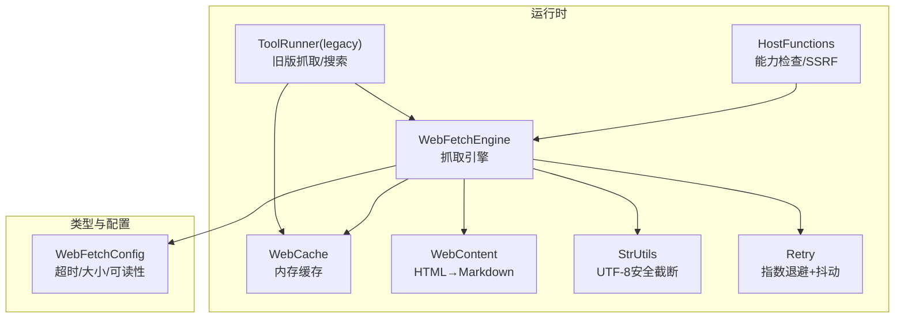
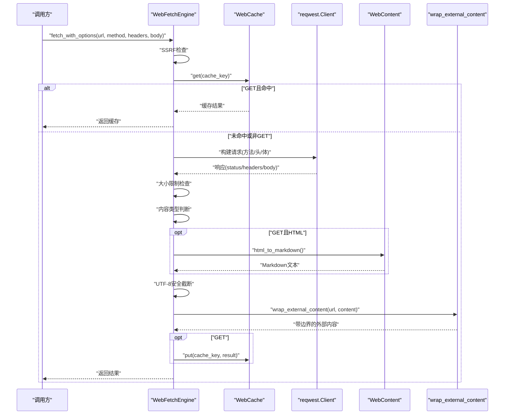
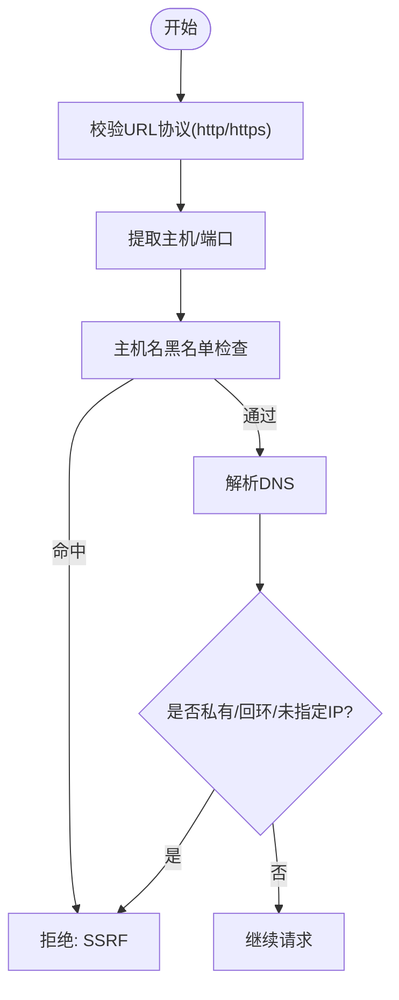
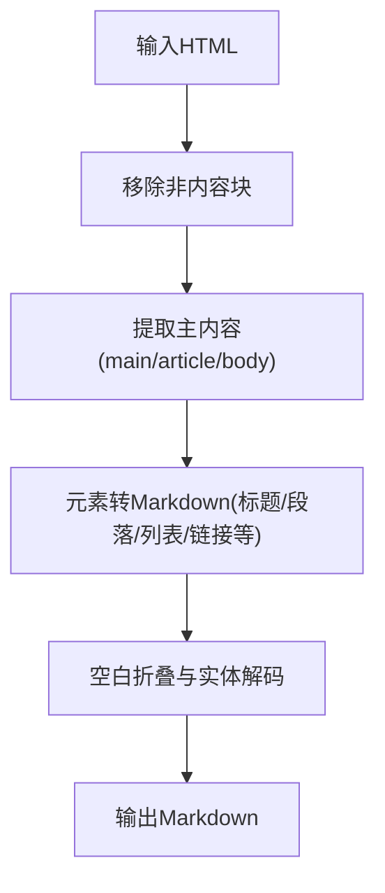
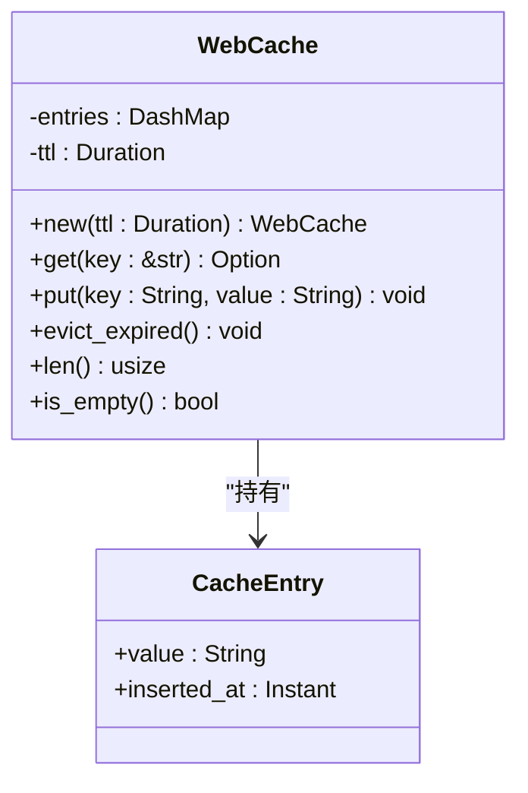
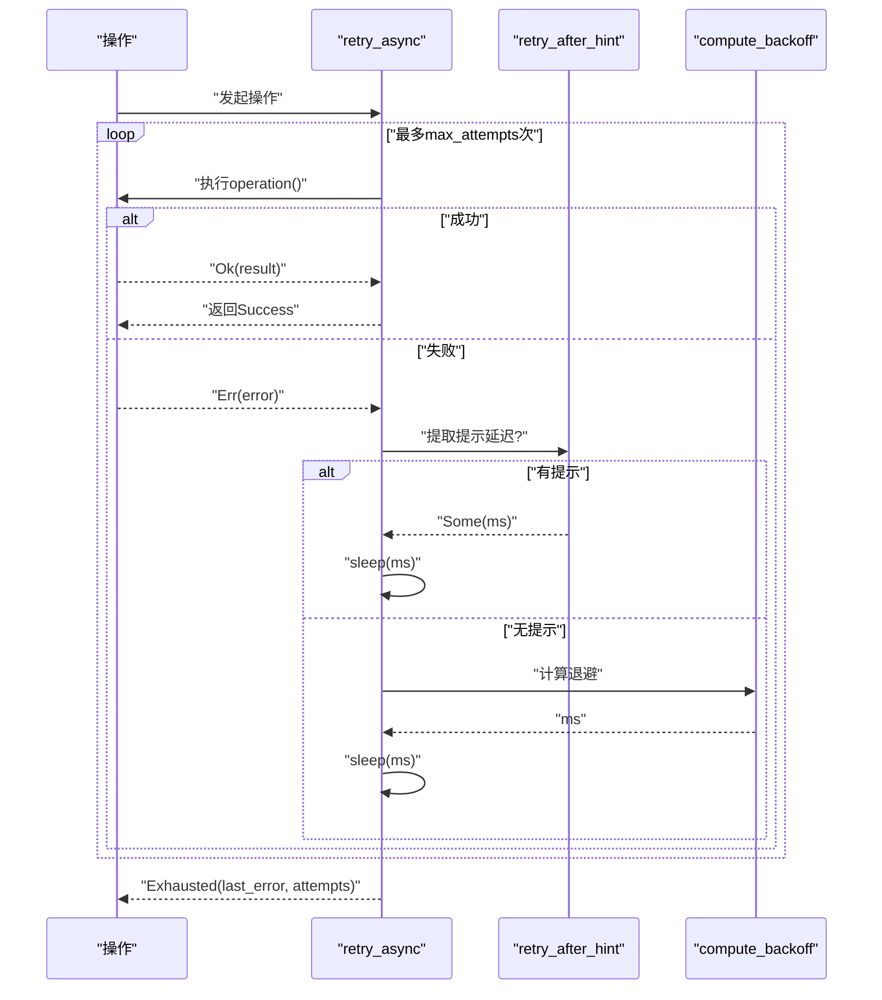
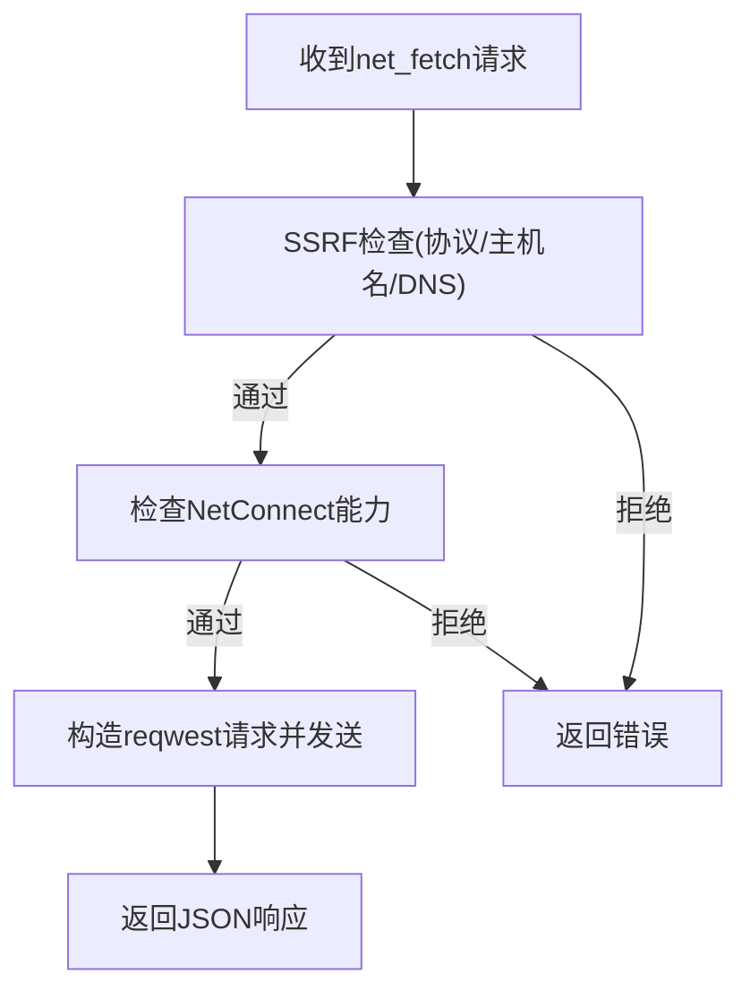
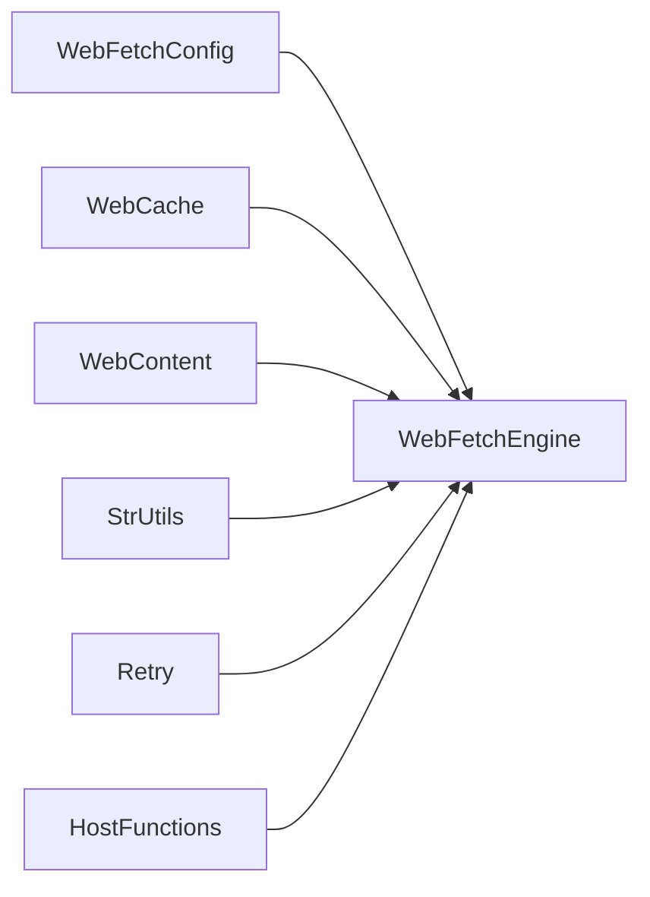

# 网络请求处理

<cite>
**本文引用的文件**
- [web_fetch.rs](file://crates/openfang-runtime/src/web_fetch.rs)
- [web_content.rs](file://crates/openfang-runtime/src/web_content.rs)
- [web_cache.rs](file://crates/openfang-runtime/src/web_cache.rs)
- [config.rs](file://crates/openfang-types/src/config.rs)
- [host_functions.rs](file://crates/openfang-runtime/src/host_functions.rs)
- [tool_runner.rs](file://crates/openfang-runtime/src/tool_runner.rs)
- [retry.rs](file://crates/openfang-runtime/src/retry.rs)
- [str_utils.rs](file://crates/openfang-runtime/src/str_utils.rs)
- [web_search.rs](file://crates/openfang-runtime/src/web_search.rs)
</cite>

## 目录
1. [简介](#简介)
2. [项目结构](#项目结构)
3. [核心组件](#核心组件)
4. [架构总览](#架构总览)
5. [详细组件分析](#详细组件分析)
6. [依赖分析](#依赖分析)
7. [性能考量](#性能考量)
8. [故障排查指南](#故障排查指南)
9. [结论](#结论)
10. [附录](#附录)

## 简介
本技术文档围绕网络请求处理系统进行系统化梳理，重点覆盖以下方面：
- HTTP 客户端实现与请求头管理
- 响应处理与内容提取（HTML→Markdown）
- 错误重试机制与退避策略
- SSRF 防护与能力控制
- 超时设置、缓存与内存限制
- 与内容提取系统的集成关系
- 性能优化与安全最佳实践

该系统在 Rust 生态中通过 reqwest 构建 HTTP 客户端，并结合内置的 SSRF 检查、可选的 HTML 可读性提取、统一的外部内容标记以及内存级 TTL 缓存，形成“安全、可控、可扩展”的网络抓取与搜索能力。

## 项目结构
网络请求处理相关代码主要分布在 openfang-runtime 的运行时模块中，类型与配置集中在 openfang-types 中，形成清晰的分层：
- 运行时层：HTTP 抓取引擎、内容提取、缓存、重试、主机函数桥接
- 类型与配置层：WebFetch/WebConfig 等配置项
- 工具层：遗留工具（无 SSRF/可读性）与搜索引擎

图示来源
- [web_fetch.rs:15-38](file://crates/openfang-runtime/src/web_fetch.rs#L15-L38)
- [web_cache.rs:16-20](file://crates/openfang-runtime/src/web_cache.rs#L16-L20)
- [web_content.rs:63-82](file://crates/openfang-runtime/src/web_content.rs#L63-L82)
- [str_utils.rs:3-19](file://crates/openfang-runtime/src/str_utils.rs#L3-L19)
- [retry.rs:16-41](file://crates/openfang-runtime/src/retry.rs#L16-L41)
- [host_functions.rs:55-67](file://crates/openfang-runtime/src/host_functions.rs#L55-L67)
- [tool_runner.rs:1365-1399](file://crates/openfang-runtime/src/tool_runner.rs#L1365-L1399)
- [config.rs:284-307](file://crates/openfang-types/src/config.rs#L284-L307)

章节来源
- [web_fetch.rs:1-38](file://crates/openfang-runtime/src/web_fetch.rs#L1-L38)
- [web_cache.rs:1-76](file://crates/openfang-runtime/src/web_cache.rs#L1-L76)
- [web_content.rs:1-82](file://crates/openfang-runtime/src/web_content.rs#L1-L82)
- [str_utils.rs:1-71](file://crates/openfang-runtime/src/str_utils.rs#L1-L71)
- [retry.rs:1-123](file://crates/openfang-runtime/src/retry.rs#L1-L123)
- [host_functions.rs:1-67](file://crates/openfang-runtime/src/host_functions.rs#L1-L67)
- [tool_runner.rs:1365-1399](file://crates/openfang-runtime/src/tool_runner.rs#L1365-L1399)
- [config.rs:284-307](file://crates/openfang-types/src/config.rs#L284-L307)

## 核心组件
- WebFetchEngine：统一的抓取引擎，支持方法选择、自定义头、自动 JSON 内容类型检测、SSRF 检查、可选 HTML→Markdown、字符/字节长度限制、外部内容标记与缓存。
- WebCache：基于 DashMap 的线程安全内存缓存，支持 TTL 清理与惰性过期剔除。
- WebContent：HTML→Markdown 提取器，移除非内容块、提取主内容区、转换标签为 Markdown、清理空白与实体解码。
- StrUtils：UTF-8 安全截断，避免多字节字符边界错误。
- Retry：通用异步重试工具，指数退避+抖动，支持提示延迟与最大尝试次数。
- HostFunctions：WASM 主机函数入口，执行能力检查与 SSRF 检查后调用 reqwest 发起请求。
- ToolRunner(legacy)：旧版抓取/搜索工具，用于无 WebToolsContext 的场景。

章节来源
- [web_fetch.rs:15-167](file://crates/openfang-runtime/src/web_fetch.rs#L15-L167)
- [web_cache.rs:16-76](file://crates/openfang-runtime/src/web_cache.rs#L16-L76)
- [web_content.rs:63-359](file://crates/openfang-runtime/src/web_content.rs#L63-L359)
- [str_utils.rs:3-19](file://crates/openfang-runtime/src/str_utils.rs#L3-L19)
- [retry.rs:16-123](file://crates/openfang-runtime/src/retry.rs#L16-L123)
- [host_functions.rs:271-301](file://crates/openfang-runtime/src/host_functions.rs#L271-L301)
- [tool_runner.rs:1365-1399](file://crates/openfang-runtime/src/tool_runner.rs#L1365-L1399)

## 架构总览
下图展示了从调用到返回的关键流程：请求进入 WebFetchEngine 后依次经过 SSRF 检查、缓存命中、HTTP 请求、内容类型判断、可读性提取、截断与外部内容标记，最后写入缓存并返回。

图示来源
- [web_fetch.rs:46-166](file://crates/openfang-runtime/src/web_fetch.rs#L46-L166)
- [web_content.rs:63-82](file://crates/openfang-runtime/src/web_content.rs#L63-L82)
- [web_cache.rs:31-59](file://crates/openfang-runtime/src/web_cache.rs#L31-L59)
- [str_utils.rs:3-19](file://crates/openfang-runtime/src/str_utils.rs#L3-L19)

章节来源
- [web_fetch.rs:41-166](file://crates/openfang-runtime/src/web_fetch.rs#L41-L166)
- [web_content.rs:63-82](file://crates/openfang-runtime/src/web_content.rs#L63-L82)
- [web_cache.rs:31-59](file://crates/openfang-runtime/src/web_cache.rs#L31-L59)
- [str_utils.rs:3-19](file://crates/openfang-runtime/src/str_utils.rs#L3-L19)

## 详细组件分析

### WebFetchEngine 组件分析
- 功能要点
  - 支持 GET/POST/PUT/PATCH/DELETE 方法；GET 时启用缓存键。
  - 自动注入 User-Agent；允许传入自定义头；对 JSON 负载自动设置 Content-Type。
  - 响应体大小限制与字符数限制；UTF-8 安全截断。
  - 对 GET 且为 HTML 的响应执行可读性提取；非 GET 保持原始响应。
  - 外部内容标记包裹，便于后续处理识别与安全处置。
  - SSRF 检查前置，阻断私有/回环/元数据地址解析。

- 关键流程图（SSRF 检查与缓存）

图示来源
- [web_fetch.rs:185-235](file://crates/openfang-runtime/src/web_fetch.rs#L185-L235)

章节来源
- [web_fetch.rs:46-166](file://crates/openfang-runtime/src/web_fetch.rs#L46-L166)
- [web_fetch.rs:185-281](file://crates/openfang-runtime/src/web_fetch.rs#L185-L281)

### WebContent 组件分析（HTML→Markdown）
- 功能要点
  - 移除脚本、样式、导航、页脚、iframe、svg、表单等非内容标签。
  - 提取 main/article/body 中的内容作为主区。
  - 将标题、段落、粗体、斜体、代码块、引用、列表、链接等转换为 Markdown。
  - 清理多余空白、解码常见 HTML 实体。
  - Unicode 安全处理，避免大小写转换导致的字节长度变化问题。

- 转换流程图

图示来源
- [web_content.rs:63-82](file://crates/openfang-runtime/src/web_content.rs#L63-L82)
- [web_content.rs:84-207](file://crates/openfang-runtime/src/web_content.rs#L84-L207)

章节来源
- [web_content.rs:63-359](file://crates/openfang-runtime/src/web_content.rs#L63-L359)

### WebCache 组件分析
- 功能要点
  - 使用 DashMap 存储键值对与插入时间戳。
  - get 时惰性剔除过期条目；put 直接写入；evict_expired 手动清理。
  - TTL 为零时禁用缓存（零成本直通）。

- 类图

图示来源
- [web_cache.rs:16-76](file://crates/openfang-runtime/src/web_cache.rs#L16-L76)

章节来源
- [web_cache.rs:16-76](file://crates/openfang-runtime/src/web_cache.rs#L16-L76)

### Retry 组件分析
- 功能要点
  - 指数退避：min_delay * 2^attempt，上限 max_delay。
  - 抖动：在退避基础上引入随机扰动，降低全局同拍。
  - 提示延迟：若错误携带“Retry-After”等提示，优先使用提示值。
  - 记录尝试次数与最后一次错误，便于可观测性。

- 序列图（重试流程）

图示来源
- [retry.rs:123-200](file://crates/openfang-runtime/src/retry.rs#L123-L200)

章节来源
- [retry.rs:16-200](file://crates/openfang-runtime/src/retry.rs#L16-L200)

### HostFunctions 与能力控制
- 功能要点
  - net_fetch 入口：先执行 SSRF 检查，再检查 NetConnect 能力，最后发起请求。
  - 能力匹配：Capability::NetConnect(host:port) 与 URL 解析出的主机端口一致才放行。
  - SSRF 检查：协议白名单、主机名黑名单、DNS 解析后 IP 范围检查。

- 流程图

图示来源
- [host_functions.rs:271-301](file://crates/openfang-runtime/src/host_functions.rs#L271-L301)
- [host_functions.rs:123-160](file://crates/openfang-runtime/src/host_functions.rs#L123-L160)

章节来源
- [host_functions.rs:271-301](file://crates/openfang-runtime/src/host_functions.rs#L271-L301)
- [host_functions.rs:123-160](file://crates/openfang-runtime/src/host_functions.rs#L123-L160)

### 旧版工具链（ToolRunner legacy）
- 功能要点
  - 无 SSRF/可读性保护的抓取与 DuckDuckGo 搜索。
  - 用于无 WebToolsContext 的降级路径。
  - 响应体大小限制与字符截断。

章节来源
- [tool_runner.rs:1365-1399](file://crates/openfang-runtime/src/tool_runner.rs#L1365-L1399)
- [tool_runner.rs:1401-1445](file://crates/openfang-runtime/src/tool_runner.rs#L1401-L1445)

## 依赖分析
- 配置依赖
  - WebFetchConfig 控制超时、最大响应字节数、最大字符数、是否启用可读性提取。
- 运行时依赖
  - reqwest 作为 HTTP 客户端；DashMap 作为缓存容器；Tracing 用于日志。
- 内聚与耦合
  - WebFetchEngine 与 WebCache、WebContent、StrUtils 高内聚；与配置低耦合。
  - HostFunctions 与 Capability/SSRF 检查强耦合，确保最小权限。

图示来源
- [config.rs:284-307](file://crates/openfang-types/src/config.rs#L284-L307)
- [web_fetch.rs:15-38](file://crates/openfang-runtime/src/web_fetch.rs#L15-L38)
- [web_cache.rs:16-20](file://crates/openfang-runtime/src/web_cache.rs#L16-L20)
- [web_content.rs:6-13](file://crates/openfang-runtime/src/web_content.rs#L6-L13)
- [str_utils.rs:1-7](file://crates/openfang-runtime/src/str_utils.rs#L1-L7)
- [retry.rs:10-14](file://crates/openfang-runtime/src/retry.rs#L10-L14)
- [host_functions.rs:9-14](file://crates/openfang-runtime/src/host_functions.rs#L9-L14)

章节来源
- [config.rs:284-307](file://crates/openfang-types/src/config.rs#L284-L307)
- [web_fetch.rs:15-38](file://crates/openfang-runtime/src/web_fetch.rs#L15-L38)
- [web_cache.rs:16-20](file://crates/openfang-runtime/src/web_cache.rs#L16-L20)
- [web_content.rs:6-13](file://crates/openfang-runtime/src/web_content.rs#L6-L13)
- [str_utils.rs:1-7](file://crates/openfang-runtime/src/str_utils.rs#L1-L7)
- [retry.rs:10-14](file://crates/openfang-runtime/src/retry.rs#L10-L14)
- [host_functions.rs:9-14](file://crates/openfang-runtime/src/host_functions.rs#L9-L14)

## 性能考量
- 超时与大小限制
  - HTTP 客户端超时由 WebFetchConfig.timeout_secs 控制；响应体大小与字符数限制防止内存膨胀。
- 压缩与传输
  - 启用 gzip/deflate/brotli 压缩以减少带宽占用。
- 缓存策略
  - GET 请求写入内存缓存，命中直接返回；TTL 为零时禁用缓存。
- 截断与安全
  - UTF-8 安全截断避免 panic；外部内容标记便于下游处理。
- 重试与抖动
  - 指数退避+抖动降低雪崩风险；提示延迟优先于计算延迟。
- 搜索与抓取
  - 搜索引擎同样具备缓存与超时控制；自动回退策略提升可用性。

章节来源
- [web_fetch.rs:24-32](file://crates/openfang-runtime/src/web_fetch.rs#L24-L32)
- [web_fetch.rs:105-113](file://crates/openfang-runtime/src/web_fetch.rs#L105-L113)
- [web_cache.rs:22-29](file://crates/openfang-runtime/src/web_cache.rs#L22-L29)
- [str_utils.rs:3-19](file://crates/openfang-runtime/src/str_utils.rs#L3-L19)
- [retry.rs:72-90](file://crates/openfang-runtime/src/retry.rs#L72-L90)
- [web_search.rs:32-42](file://crates/openfang-runtime/src/web_search.rs#L32-L42)

## 故障排查指南
- 常见错误与定位
  - SSRF 拒绝：检查 URL 协议、主机名是否在黑名单、解析后的 IP 是否为私有/回环。
  - 能力不足：确认 Capability::NetConnect(host:port) 是否授予。
  - 响应过大：检查 max_response_bytes 与 max_chars 配置。
  - 重试耗尽：观察 RetryOutcome.Exhausted 的 last_error 与 attempts。
- 排查步骤
  - 开启调试日志，关注 cache 命中/未命中、SSRF 检查结果、HTML 判断与可读性提取分支。
  - 对外发请求增加超时与重试策略，必要时开启提示延迟优先。
  - 对搜索与抓取分别检查缓存命中率与 API Key 配置。

章节来源
- [web_fetch.rs:185-235](file://crates/openfang-runtime/src/web_fetch.rs#L185-L235)
- [host_functions.rs:282-291](file://crates/openfang-runtime/src/host_functions.rs#L282-L291)
- [retry.rs:136-174](file://crates/openfang-runtime/src/retry.rs#L136-L174)

## 结论
该网络请求处理系统在安全性（SSRF/能力控制）、可靠性（缓存/重试/超时/大小限制）与可用性（HTML→Markdown/自动回退）之间取得良好平衡。通过模块化设计与清晰的职责划分，既满足生产环境的高可用需求，又为后续扩展（如代理、连接池、TLS 优化）预留了空间。

## 附录

### 配置项参考（WebFetchConfig）
- max_chars：最大返回字符数
- max_response_bytes：最大响应字节数
- timeout_secs：HTTP 请求超时（秒）
- readability：是否启用 HTML→Markdown 可读性提取

章节来源
- [config.rs:284-307](file://crates/openfang-types/src/config.rs#L284-L307)

### 代码示例（路径指引）
- 配置请求参数与超时
  - [WebFetchEngine::new:24-32](file://crates/openfang-runtime/src/web_fetch.rs#L24-L32)
  - [WebFetchConfig 默认值:298-307](file://crates/openfang-types/src/config.rs#L298-L307)
- 处理不同响应状态与大小限制
  - [响应大小检查与错误返回:105-113](file://crates/openfang-runtime/src/web_fetch.rs#L105-L113)
- 实现自定义头部与认证机制
  - [添加自定义头与JSON自动Content-Type:80-96](file://crates/openfang-runtime/src/web_fetch.rs#L80-L96)
  - [HostFunctions 能力检查与SSRF:282-291](file://crates/openfang-runtime/src/host_functions.rs#L282-L291)
- HTML→Markdown 提取与外部内容标记
  - [html_to_markdown:63-82](file://crates/openfang-runtime/src/web_content.rs#L63-L82)
  - [wrap_external_content:48-57](file://crates/openfang-runtime/src/web_content.rs#L48-L57)
- 重试与退避策略
  - [retry_async:123-200](file://crates/openfang-runtime/src/retry.rs#L123-L200)
  - [compute_backoff:72-90](file://crates/openfang-runtime/src/retry.rs#L72-L90)