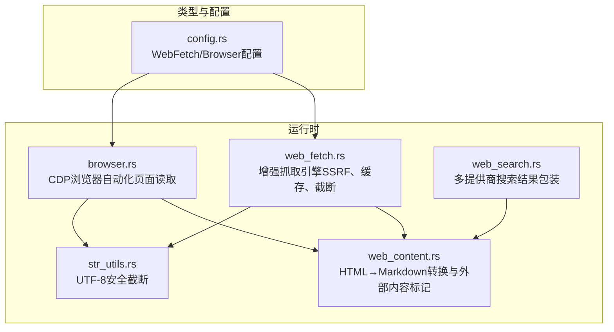
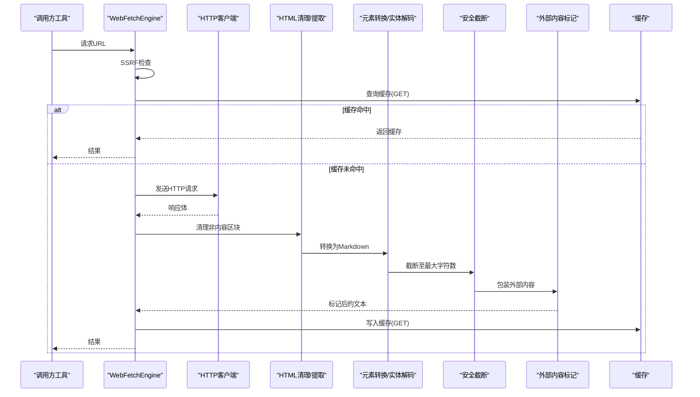
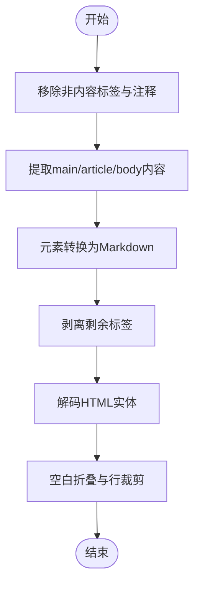
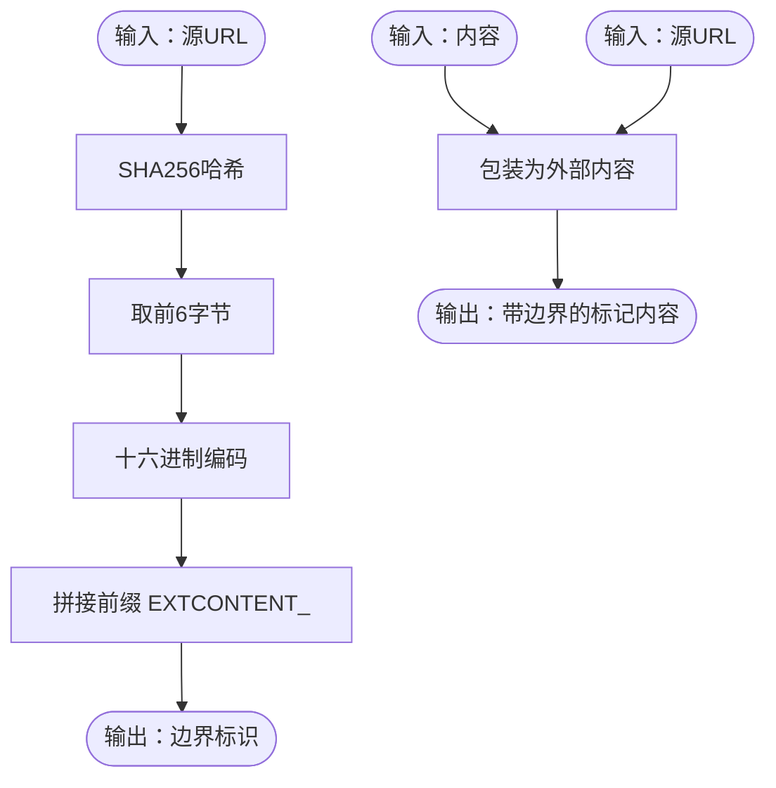
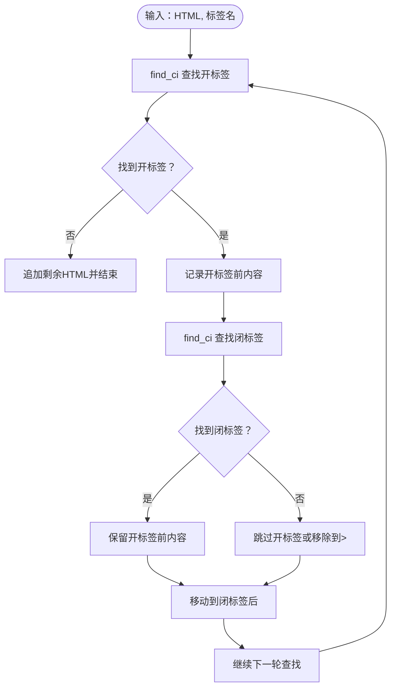
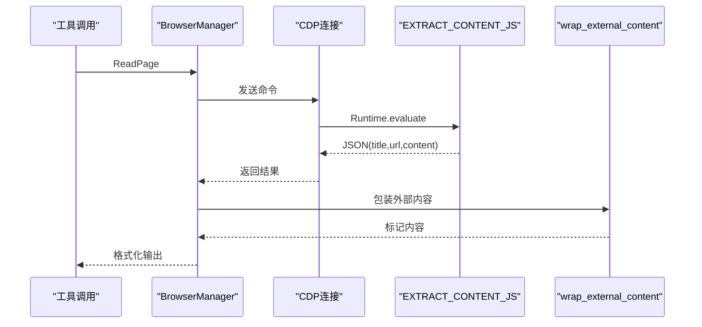
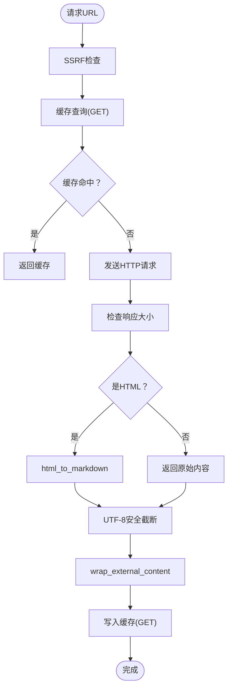
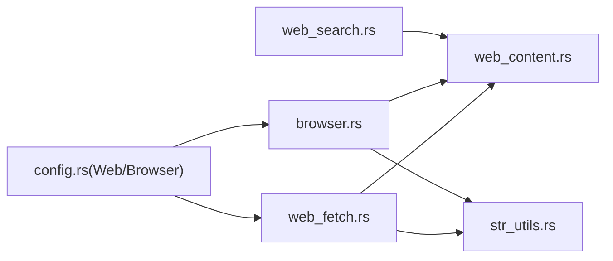

# 网页内容提取

<cite>
**本文引用的文件**
- [web_content.rs](file://crates/openfang-runtime/src/web_content.rs)
- [web_fetch.rs](file://crates/openfang-runtime/src/web_fetch.rs)
- [browser.rs](file://crates/openfang-runtime/src/browser.rs)
- [web_search.rs](file://crates/openfang-runtime/src/web_search.rs)
- [str_utils.rs](file://crates/openfang-runtime/src/str_utils.rs)
- [config.rs](file://crates/openfang-types/src/config.rs)
</cite>

## 目录
1. [简介](#简介)
2. [项目结构](#项目结构)
3. [核心组件](#核心组件)
4. [架构总览](#架构总览)
5. [详细组件分析](#详细组件分析)
6. [依赖关系分析](#依赖关系分析)
7. [性能考量](#性能考量)
8. [故障排查指南](#故障排查指南)
9. [结论](#结论)
10. [附录](#附录)

## 简介
本技术文档面向网页内容提取系统，聚焦于从HTML到Markdown的完整转换流程，涵盖以下关键能力：
- 外部内容标记机制：基于SHA256的确定性边界生成，用于包装来自外部来源的不可信内容并警示风险
- HTML清理算法：移除非内容区块（如脚本、样式、导航、页脚、iframe、SVG、表单等），并剥离注释
- 元素转换规则：将标题、段落、粗体、斜体、代码块、引用、列表、链接等HTML元素映射为Markdown格式
- 实体解码过程：对常见HTML实体进行解码，还原为Unicode字符
- 大小写不敏感的字符串匹配：在ASCII范围内进行大小写不敏感查找，避免多字节Unicode导致的字节长度变化问题
- 标签块移除策略：通过成对标签定位与闭合标签匹配，安全地移除指定标签及其内容
- 性能优化与错误处理：包含缓存、超时控制、响应大小限制、字符边界安全截断、SSRF防护等

## 项目结构
该系统主要由运行时模块组成，涉及内容提取、网络抓取、浏览器自动化与搜索集成：
- 运行时核心：HTML→Markdown转换、外部内容标记、字符串安全截断
- 网络抓取：增强的HTTP抓取引擎，支持SSRF防护、HTML可读性提取、缓存与截断
- 浏览器自动化：通过CDP连接Chromium，执行页面读取与截图等操作，并将结果包装为外部内容
- 搜索集成：多提供商搜索结果统一包装为外部内容

图表来源
- [web_content.rs:1-450](file://crates/openfang-runtime/src/web_content.rs#L1-L450)
- [web_fetch.rs:1-378](file://crates/openfang-runtime/src/web_fetch.rs#L1-L378)
- [browser.rs:1-200](file://crates/openfang-runtime/src/browser.rs#L1-L200)
- [web_search.rs:1-200](file://crates/openfang-runtime/src/web_search.rs#L1-L200)
- [str_utils.rs:1-71](file://crates/openfang-runtime/src/str_utils.rs#L1-L71)
- [config.rs:284-341](file://crates/openfang-types/src/config.rs#L284-L341)

章节来源
- [web_content.rs:1-450](file://crates/openfang-runtime/src/web_content.rs#L1-L450)
- [web_fetch.rs:1-378](file://crates/openfang-runtime/src/web_fetch.rs#L1-L378)
- [browser.rs:1-200](file://crates/openfang-runtime/src/browser.rs#L1-L200)
- [web_search.rs:1-200](file://crates/openfang-runtime/src/web_search.rs#L1-L200)
- [str_utils.rs:1-71](file://crates/openfang-runtime/src/str_utils.rs#L1-L71)
- [config.rs:284-341](file://crates/openfang-types/src/config.rs#L284-L341)

## 核心组件
- 外部内容标记与SHA256边界生成
  - 基于源URL计算SHA256，取前6字节的十六进制编码作为边界标识，形成“EXTCONTENT_”前缀的确定性边界
  - 包装不可信内容，添加来源与风险提示
- HTML清理与内容提取
  - 移除非内容区块与注释
  - 提取main/article/body区域作为主要内容
- 元素转换与实体解码
  - 将HTML元素映射为Markdown语法
  - 解码常见HTML实体为Unicode字符
- 大小写不敏感匹配与标签块移除
  - 使用ASCII大小写不敏感查找，避免多字节Unicode导致的字节长度变化
  - 安全移除指定标签及其内容
- 字符串安全截断
  - 在UTF-8字符边界处截断，避免panic
- SSRF防护与缓存
  - 抓取前进行SSRF检查，阻止私有/元数据IP与主机名
  - 支持GET请求缓存与响应大小限制

章节来源
- [web_content.rs:38-57](file://crates/openfang-runtime/src/web_content.rs#L38-L57)
- [web_content.rs:84-102](file://crates/openfang-runtime/src/web_content.rs#L84-L102)
- [web_content.rs:134-151](file://crates/openfang-runtime/src/web_content.rs#L134-L151)
- [web_content.rs:153-207](file://crates/openfang-runtime/src/web_content.rs#L153-L207)
- [web_content.rs:323-338](file://crates/openfang-runtime/src/web_content.rs#L323-L338)
- [web_content.rs:17-32](file://crates/openfang-runtime/src/web_content.rs#L17-L32)
- [web_content.rs:104-132](file://crates/openfang-runtime/src/web_content.rs#L104-L132)
- [str_utils.rs:9-19](file://crates/openfang-runtime/src/str_utils.rs#L9-L19)
- [web_fetch.rs:188-235](file://crates/openfang-runtime/src/web_fetch.rs#L188-L235)
- [web_fetch.rs:160-166](file://crates/openfang-runtime/src/web_fetch.rs#L160-L166)

## 架构总览
系统采用分层设计：抓取层负责网络I/O与安全检查；内容层负责HTML清理与转换；包装层负责外部内容标记；工具层（浏览器、搜索）复用内容层能力。

图表来源
- [web_fetch.rs:41-166](file://crates/openfang-runtime/src/web_fetch.rs#L41-L166)
- [web_content.rs:70-82](file://crates/openfang-runtime/src/web_content.rs#L70-L82)
- [str_utils.rs:9-19](file://crates/openfang-runtime/src/str_utils.rs#L9-L19)

## 详细组件分析

### 组件A：HTML到Markdown转换流水线
- 阶段一：移除非内容区块与注释
  - 移除script/style/nav/footer/iframe/svg/form/noscript/header等标签及其内容
  - 同步移除HTML注释
- 阶段二：提取主要内容区域
  - 优先选择main/article/body，若不存在则回退为整段HTML
- 阶段三：元素转换
  - 标题：h1-h6映射为Markdown标题
  - 段落：p标签映射为段落
  - 行内：strong/b、em/i、code、pre、blockquote、ul/ol/li、div/span/section等
  - 链接：解析a标签href并生成Markdown链接
  - 最终剥离剩余标签并解码HTML实体
- 阶段四：空白折叠与输出
  - 折叠多余空白行，按行裁剪，返回最终Markdown

图表来源
- [web_content.rs:70-82](file://crates/openfang-runtime/src/web_content.rs#L70-L82)
- [web_content.rs:84-102](file://crates/openfang-runtime/src/web_content.rs#L84-L102)
- [web_content.rs:134-151](file://crates/openfang-runtime/src/web_content.rs#L134-L151)
- [web_content.rs:153-207](file://crates/openfang-runtime/src/web_content.rs#L153-L207)
- [web_content.rs:308-338](file://crates/openfang-runtime/src/web_content.rs#L308-L338)
- [web_content.rs:340-359](file://crates/openfang-runtime/src/web_content.rs#L340-L359)

章节来源
- [web_content.rs:70-207](file://crates/openfang-runtime/src/web_content.rs#L70-L207)
- [web_content.rs:308-359](file://crates/openfang-runtime/src/web_content.rs#L308-L359)

### 组件B：外部内容标记与SHA256边界生成
- 边界生成
  - 输入：源URL
  - 处理：对URL进行SHA256哈希，取前6字节十六进制编码，拼接“EXTCONTENT_”前缀
  - 输出：12位十六进制边界标识
- 内容包装
  - 将原始内容包裹在边界标记中，并添加来源与不可信内容警告
- 使用场景
  - 抓取引擎与浏览器读取结果均使用此机制包装外部内容

图表来源
- [web_content.rs:38-57](file://crates/openfang-runtime/src/web_content.rs#L38-L57)

章节来源
- [web_content.rs:38-57](file://crates/openfang-runtime/src/web_content.rs#L38-L57)
- [web_fetch.rs:154-158](file://crates/openfang-runtime/src/web_fetch.rs#L154-L158)
- [browser.rs:898](file://crates/openfang-runtime/src/browser.rs#L898)
- [browser.rs:1015](file://crates/openfang-runtime/src/browser.rs#L1015)

### 组件C：大小写不敏感的字符串匹配与标签块移除
- 大小写不敏感查找
  - 对ASCII字符进行大小写不敏感比较，避免多字节Unicode导致的字节长度变化问题
  - 返回绝对偏移位置，保证后续切片安全
- 标签块移除
  - 以“<tag”和“</tag”为边界，定位开闭标签
  - 若无闭合标签，跳过或移除到下一个“>”
  - 逐段构建结果，确保不破坏其他内容

图表来源
- [web_content.rs:17-32](file://crates/openfang-runtime/src/web_content.rs#L17-L32)
- [web_content.rs:104-132](file://crates/openfang-runtime/src/web_content.rs#L104-L132)

章节来源
- [web_content.rs:17-32](file://crates/openfang-runtime/src/web_content.rs#L17-L32)
- [web_content.rs:104-132](file://crates/openfang-runtime/src/web_content.rs#L104-L132)

### 组件D：浏览器页面读取与Markdown生成
- 页面读取
  - 通过CDP执行内置JavaScript，克隆body节点并移除非内容标签
  - 选择main/article或role="main"或特定类名/ID作为根节点
  - 递归遍历节点，生成行数组，合并并折叠多余空行
  - 截断至最大字符数，返回JSON包含title/url/content
- 工具封装
  - ReadPage命令返回JSON，随后调用wrap_external_content包装外部内容

图表来源
- [browser.rs:542-553](file://crates/openfang-runtime/src/browser.rs#L542-L553)
- [browser.rs:1124-1169](file://crates/openfang-runtime/src/browser.rs#L1124-L1169)
- [browser.rs:898](file://crates/openfang-runtime/src/browser.rs#L898)

章节来源
- [browser.rs:542-553](file://crates/openfang-runtime/src/browser.rs#L542-L553)
- [browser.rs:1124-1169](file://crates/openfang-runtime/src/browser.rs#L1124-L1169)
- [browser.rs:898](file://crates/openfang-runtime/src/browser.rs#L898)

### 组件E：增强抓取引擎（SSRF、缓存、截断）
- SSRF防护
  - 仅允许http/https协议
  - 拦截localhost、metadata端点、0.0.0.0、IPv6本地环回等受限主机
  - 解析DNS并检查解析出的IP是否为私有/环回地址
- 缓存与响应大小限制
  - GET请求使用方法+URL作为键缓存
  - 限制最大响应字节数，防止内存膨胀
- HTML检测与转换
  - 仅对GET且Content-Type为HTML或以<html开头的内容进行可读性提取
  - 使用html_to_markdown转换为Markdown
- 安全截断与包装
  - 使用UTF-8安全截断，避免多字节字符截断
  - 包装外部内容并返回HTTP状态头

图表来源
- [web_fetch.rs:41-166](file://crates/openfang-runtime/src/web_fetch.rs#L41-L166)
- [web_fetch.rs:169-179](file://crates/openfang-runtime/src/web_fetch.rs#L169-L179)
- [web_fetch.rs:188-235](file://crates/openfang-runtime/src/web_fetch.rs#L188-L235)
- [str_utils.rs:9-19](file://crates/openfang-runtime/src/str_utils.rs#L9-L19)

章节来源
- [web_fetch.rs:41-166](file://crates/openfang-runtime/src/web_fetch.rs#L41-L166)
- [web_fetch.rs:169-179](file://crates/openfang-runtime/src/web_fetch.rs#L169-L179)
- [web_fetch.rs:188-235](file://crates/openfang-runtime/src/web_fetch.rs#L188-L235)
- [str_utils.rs:9-19](file://crates/openfang-runtime/src/str_utils.rs#L9-L19)

### 组件F：多提供商搜索结果包装
- 搜索引擎
  - 支持Brave、Tavily、Perplexity、DuckDuckGo，自动回退
- 结果包装
  - 将搜索结果组织为文本，统一使用wrap_external_content包装外部内容

章节来源
- [web_search.rs:104-163](file://crates/openfang-runtime/src/web_search.rs#L104-L163)
- [web_search.rs:165-200](file://crates/openfang-runtime/src/web_search.rs#L165-L200)

## 依赖关系分析
- 组件耦合
  - web_fetch依赖web_content进行HTML清理与转换
  - browser依赖web_content进行外部内容标记
  - web_search依赖web_content进行结果包装
  - 所有组件共享UTF-8安全截断工具
- 外部依赖
  - sha2用于SHA256哈希
  - hex用于十六进制编码
  - reqwest用于HTTP请求
  - serde_json用于JSON序列化/反序列化
  - tracing用于日志

图表来源
- [web_fetch.rs:7-13](file://crates/openfang-runtime/src/web_fetch.rs#L7-L13)
- [browser.rs:1-26](file://crates/openfang-runtime/src/browser.rs#L1-L26)
- [web_search.rs:10-15](file://crates/openfang-runtime/src/web_search.rs#L10-L15)
- [config.rs:284-341](file://crates/openfang-types/src/config.rs#L284-L341)

章节来源
- [web_fetch.rs:7-13](file://crates/openfang-runtime/src/web_fetch.rs#L7-L13)
- [browser.rs:1-26](file://crates/openfang-runtime/src/browser.rs#L1-L26)
- [web_search.rs:10-15](file://crates/openfang-runtime/src/web_search.rs#L10-L15)
- [config.rs:284-341](file://crates/openfang-types/src/config.rs#L284-L341)

## 性能考量
- 时间复杂度
  - HTML清理与标签移除：O(n)扫描，每次查找开闭标签为O(n)，整体近似O(n^2)最坏情况（大量嵌套标签）
  - 大小写不敏感查找：O(n*m)（n为HTML长度，m为模式长度）
  - 实体解码与空白折叠：O(n)
- 空间复杂度
  - 中间字符串构建：O(n)
  - 缓存：按GET键存储响应，受max_response_bytes与max_chars限制
- 优化建议
  - 使用更高效的标签解析器（如流式解析）替代逐次查找
  - 对常用标签（如p、br、strong、em、code）建立索引或预处理
  - 并行化不同阶段（清理、转换、解码）以提升吞吐
  - 合理设置max_chars与max_response_bytes，避免大响应带来的内存压力

## 故障排查指南
- SSRF被阻断
  - 现象：抛出“SSRF blocked”错误
  - 排查：确认URL协议为http/https；检查主机名是否在黑名单；验证解析IP是否为私有/环回
  - 参考路径：[web_fetch.rs:188-235](file://crates/openfang-runtime/src/web_fetch.rs#L188-L235)
- 响应过大
  - 现象：返回“Response too large”错误
  - 排查：调整WebFetchConfig.max_response_bytes与max_chars
  - 参考路径：[web_fetch.rs:105-113](file://crates/openfang-runtime/src/web_fetch.rs#L105-L113)，[config.rs:284-307](file://crates/openfang-types/src/config.rs#L284-L307)
- Unicode截断panic
  - 现象：多字节字符截断导致panic
  - 处理：使用UTF-8安全截断工具，避免直接按字节切片
  - 参考路径：[str_utils.rs:9-19](file://crates/openfang-runtime/src/str_utils.rs#L9-L19)，[web_fetch.rs:144-152](file://crates/openfang-runtime/src/web_fetch.rs#L144-L152)
- 大小写不敏感匹配异常
  - 现象：多字节Unicode大小写转换导致字节长度变化
  - 处理：使用ASCII大小写不敏感比较，避免to_lowercase()引发的问题
  - 参考路径：[web_content.rs:17-32](file://crates/openfang-runtime/src/web_content.rs#L17-L32)
- 浏览器读取失败
  - 现象：ReadPage命令返回错误
  - 排查：检查CDP连接、页面加载状态、JS执行权限
  - 参考路径：[browser.rs:542-553](file://crates/openfang-runtime/src/browser.rs#L542-L553)

章节来源
- [web_fetch.rs:105-113](file://crates/openfang-runtime/src/web_fetch.rs#L105-L113)
- [web_fetch.rs:188-235](file://crates/openfang-runtime/src/web_fetch.rs#L188-L235)
- [str_utils.rs:9-19](file://crates/openfang-runtime/src/str_utils.rs#L9-L19)
- [web_content.rs:17-32](file://crates/openfang-runtime/src/web_content.rs#L17-L32)
- [browser.rs:542-553](file://crates/openfang-runtime/src/browser.rs#L542-L553)

## 结论
本系统通过“外部内容标记 + HTML清理 + 元素转换 + 实体解码 + 安全截断”的完整流水线，实现了从HTML到Markdown的安全高效转换。其关键优势在于：
- 确定性边界与外部内容标记，有效隔离不可信来源
- 大小写不敏感匹配与UTF-8安全截断，规避多字节字符陷阱
- SSRF防护与响应大小限制，保障运行时安全与稳定性
- 可扩展的抓取、浏览器与搜索集成，满足多样化内容提取需求

## 附录
- 配置项参考
  - WebFetchConfig：max_chars、max_response_bytes、timeout_secs、readability
  - BrowserConfig：headless、viewport_width、viewport_height、timeout_secs、idle_timeout_secs、max_sessions、chromium_path
- 关键函数路径
  - 外部内容标记：[content_boundary:40-46](file://crates/openfang-runtime/src/web_content.rs#L40-L46)、[wrap_external_content:49-57](file://crates/openfang-runtime/src/web_content.rs#L49-L57)
  - HTML清理：[remove_non_content_blocks:85-102](file://crates/openfang-runtime/src/web_content.rs#L85-L102)、[remove_tag_blocks:105-132](file://crates/openfang-runtime/src/web_content.rs#L105-L132)
  - 内容提取：[extract_main_content:135-151](file://crates/openfang-runtime/src/web_content.rs#L135-L151)
  - 元素转换：[convert_elements:154-207](file://crates/openfang-runtime/src/web_content.rs#L154-L207)
  - 链接转换：[convert_links:251-286](file://crates/openfang-runtime/src/web_content.rs#L251-L286)
  - 属性提取：[extract_attribute:289-306](file://crates/openfang-runtime/src/web_content.rs#L289-L306)
  - 标签剥离：[strip_all_tags:309-321](file://crates/openfang-runtime/src/web_content.rs#L309-L321)
  - 实体解码：[decode_entities:324-338](file://crates/openfang-runtime/src/web_content.rs#L324-L338)
  - 空白折叠：[collapse_whitespace:341-359](file://crates/openfang-runtime/src/web_content.rs#L341-L359)
  - 大小写不敏感查找：[find_ci:17-32](file://crates/openfang-runtime/src/web_content.rs#L17-L32)
  - UTF-8安全截断：[safe_truncate_str:9-19](file://crates/openfang-runtime/src/str_utils.rs#L9-L19)
  - 抓取流程：[WebFetchEngine::fetch_with_options:46-166](file://crates/openfang-runtime/src/web_fetch.rs#L46-L166)
  - SSRF检查：[check_ssrf:188-235](file://crates/openfang-runtime/src/web_fetch.rs#L188-L235)
  - 浏览器读取：[EXTRACT_CONTENT_JS:1124-1169](file://crates/openfang-runtime/src/browser.rs#L1124-L1169)