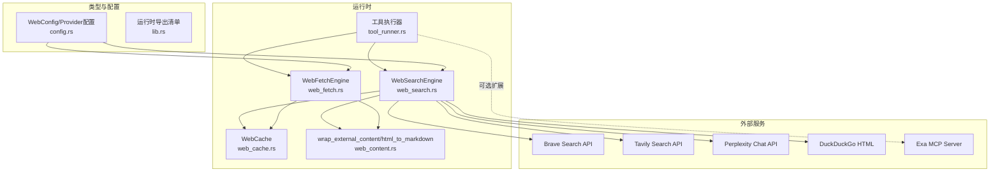
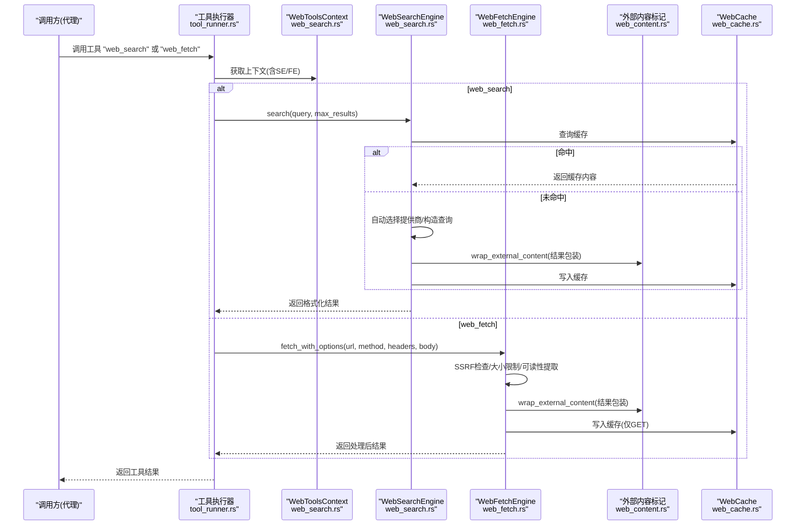
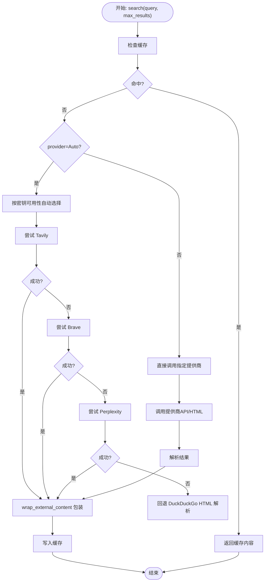
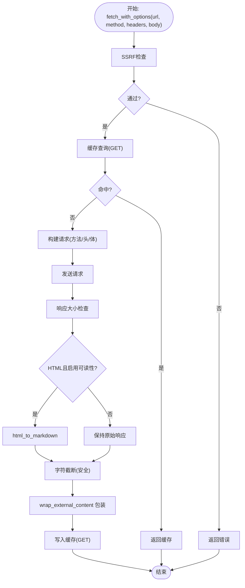
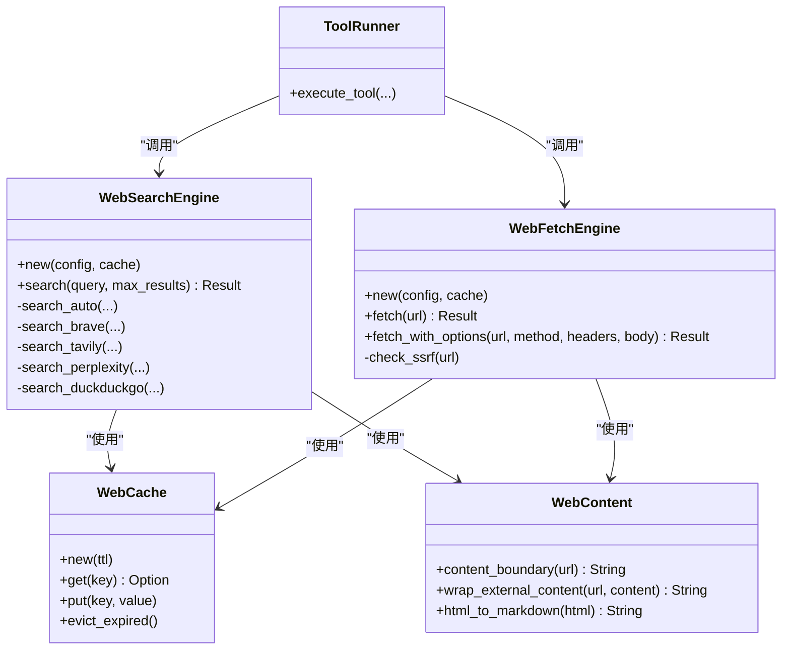

# 网页搜索

<cite>
**本文引用的文件**
- [web_search.rs](file://crates/openfang-runtime/src/web_search.rs)
- [web_fetch.rs](file://crates/openfang-runtime/src/web_fetch.rs)
- [web_content.rs](file://crates/openfang-runtime/src/web_content.rs)
- [web_cache.rs](file://crates/openfang-runtime/src/web_cache.rs)
- [tool_runner.rs](file://crates/openfang-runtime/src/tool_runner.rs)
- [config.rs](file://crates/openfang-types/src/config.rs)
- [lib.rs](file://crates/openfang-runtime/src/lib.rs)
- [SKILL.md](file://crates/openfang-skills/bundled/web-search/SKILL.md)
- [brave-search.toml](file://crates/openfang-extensions/integrations/brave-search.toml)
- [exa-search.toml](file://crates/openfang-extensions/integrations/exa-search.toml)
</cite>

## 目录
1. [简介](#简介)
2. [项目结构](#项目结构)
3. [核心组件](#核心组件)
4. [架构总览](#架构总览)
5. [详细组件分析](#详细组件分析)
6. [依赖关系分析](#依赖关系分析)
7. [性能考量](#性能考量)
8. [故障排查指南](#故障排查指南)
9. [结论](#结论)
10. [附录](#附录)

## 简介
本文件面向网页搜索系统的技术文档，聚焦于多提供商搜索引擎集成（Brave、Tavily、Perplexity、DuckDuckGo）、查询构建、结果解析与排序、去重策略、内容摘要与链接提取、以及与内容提取系统的协同工作流程。文档同时提供配置要点、结果处理与过滤建议、质量评估方法、以及性能优化与安全防护实践，帮助开发者在生产环境中稳定、高效地使用该能力。

## 项目结构
网页搜索能力由运行时模块提供，核心文件包括：
- 搜索引擎封装：web_search.rs
- 内容抓取与可读性提取：web_fetch.rs
- 外部内容标记与HTML→Markdown转换：web_content.rs
- 内存缓存：web_cache.rs
- 工具执行入口：tool_runner.rs
- 配置模型：config.rs
- 运行时导出清单：lib.rs
- 技能说明（搜索技巧与原则）：SKILL.md
- 扩展集成配置（示例）：brave-search.toml、exa-search.toml

图表来源
- [web_search.rs:1-468](file://crates/openfang-runtime/src/web_search.rs#L1-L468)
- [web_fetch.rs:1-378](file://crates/openfang-runtime/src/web_fetch.rs#L1-L378)
- [web_content.rs:1-450](file://crates/openfang-runtime/src/web_content.rs#L1-L450)
- [web_cache.rs:1-146](file://crates/openfang-runtime/src/web_cache.rs#L1-L146)
- [tool_runner.rs:1-400](file://crates/openfang-runtime/src/tool_runner.rs#L1-L400)
- [config.rs:164-307](file://crates/openfang-types/src/config.rs#L164-L307)
- [lib.rs:1-59](file://crates/openfang-runtime/src/lib.rs#L1-L59)

章节来源
- [lib.rs:1-59](file://crates/openfang-runtime/src/lib.rs#L1-L59)

## 核心组件
- WebSearchEngine：统一的多提供商搜索引擎，支持自动回退与缓存；负责查询构建、API调用、结果解析与格式化输出。
- WebFetchEngine：增强型抓取引擎，具备SSRF防护、HTML→Markdown可读性提取、响应大小限制、字符截断与缓存。
- WebContent：外部内容标记与HTML到Markdown转换管线，确保不可信内容被安全包裹与清洗。
- WebCache：基于DashMap的线程安全内存缓存，支持TTL过期清理。
- 工具执行器：将“web_search”、“web_fetch”等工具调用路由到对应引擎，注入上下文并执行。

章节来源
- [web_search.rs:17-67](file://crates/openfang-runtime/src/web_search.rs#L17-L67)
- [web_fetch.rs:15-167](file://crates/openfang-runtime/src/web_fetch.rs#L15-L167)
- [web_content.rs:38-82](file://crates/openfang-runtime/src/web_content.rs#L38-L82)
- [web_cache.rs:16-76](file://crates/openfang-runtime/src/web_cache.rs#L16-L76)
- [tool_runner.rs:99-211](file://crates/openfang-runtime/src/tool_runner.rs#L99-L211)

## 架构总览
下图展示了从工具调用到外部服务请求、再到结果返回与缓存的完整链路。

图表来源
- [tool_runner.rs:99-211](file://crates/openfang-runtime/src/tool_runner.rs#L99-L211)
- [web_search.rs:44-67](file://crates/openfang-runtime/src/web_search.rs#L44-L67)
- [web_fetch.rs:45-166](file://crates/openfang-runtime/src/web_fetch.rs#L45-L166)
- [web_content.rs:48-57](file://crates/openfang-runtime/src/web_content.rs#L48-L57)
- [web_cache.rs:31-65](file://crates/openfang-runtime/src/web_cache.rs#L31-L65)

## 详细组件分析

### WebSearchEngine：多提供商搜索引擎
- 功能要点
  - 支持Brave、Tavily、Perplexity、DuckDuckGo四种提供商；Auto模式按可用密钥优先级自动回退。
  - 统一查询构建与结果解析，输出结构化文本，便于后续LLM消费。
  - 结果外层包裹外部内容标记，提示不可信来源。
  - 使用共享WebCache进行查询结果缓存，提升重复查询性能。
- 关键流程
  - 缓存命中直接返回；未命中则按提供商顺序尝试，失败即回退下一个。
  - 各提供商返回体解析后拼接为统一格式字符串。
- 安全与健壮性
  - resolve_api_key使用零拷贝内存擦除，避免敏感信息残留。
  - DuckDuckGo解析采用HTML片段切分与URL解码，处理重定向链接。

图表来源
- [web_search.rs:44-102](file://crates/openfang-runtime/src/web_search.rs#L44-L102)
- [web_search.rs:104-315](file://crates/openfang-runtime/src/web_search.rs#L104-L315)
- [web_content.rs:48-57](file://crates/openfang-runtime/src/web_content.rs#L48-L57)
- [web_cache.rs:31-65](file://crates/openfang-runtime/src/web_cache.rs#L31-L65)

章节来源
- [web_search.rs:17-102](file://crates/openfang-runtime/src/web_search.rs#L17-L102)
- [web_search.rs:104-315](file://crates/openfang-runtime/src/web_search.rs#L104-L315)
- [web_content.rs:38-57](file://crates/openfang-runtime/src/web_content.rs#L38-L57)
- [web_cache.rs:16-76](file://crates/openfang-runtime/src/web_cache.rs#L16-L76)

### DuckDuckGo HTML解析器
- 功能要点
  - 将HTML结果切分为多个“result__a”块，提取标题、URL与摘要。
  - 处理DDG重定向URL中的编码参数，还原真实目标地址。
  - 清洗HTML标签与实体，保留可读文本。
- 复杂度与边界
  - 线性扫描HTML，时间复杂度O(n)，空间开销取决于结果数量。
  - 对URL解码与HTML实体解码做了健壮处理，避免异常崩溃。

章节来源
- [web_search.rs:322-420](file://crates/openfang-runtime/src/web_search.rs#L322-L420)

### WebFetchEngine：抓取与可读性提取
- 功能要点
  - SSRF防护：在发起网络请求前对URL进行主机名与IP范围校验，阻断私有/元数据地址。
  - 可读性提取：对HTML内容进行Markdown转换，剥离脚本、样式、导航等非正文元素。
  - 截断与包装：超过最大字符数时截断并追加提示；统一添加外部内容标记。
  - 缓存：仅对GET请求进行缓存，命中直接返回。
- 安全与健壮性
  - 严格限制协议与主机名白名单，避免内网探测与元数据泄露。
  - 多字节UTF-8安全截断，避免panic。
  - 响应大小上限控制，防止超大响应占用资源。

图表来源
- [web_fetch.rs:45-166](file://crates/openfang-runtime/src/web_fetch.rs#L45-L166)
- [web_content.rs:63-82](file://crates/openfang-runtime/src/web_content.rs#L63-L82)
- [web_cache.rs:31-65](file://crates/openfang-runtime/src/web_cache.rs#L31-L65)

章节来源
- [web_fetch.rs:15-167](file://crates/openfang-runtime/src/web_fetch.rs#L15-L167)
- [web_content.rs:63-359](file://crates/openfang-runtime/src/web_content.rs#L63-L359)
- [web_cache.rs:16-76](file://crates/openfang-runtime/src/web_cache.rs#L16-L76)

### WebContent：外部内容标记与HTML→Markdown
- 外部内容标记
  - 基于URL的SHA256派生边界标识，确保不同源内容边界唯一且可复现。
  - 输出包含“外部内容”警告，提示不可信来源。
- HTML→Markdown
  - 移除非正文标签与注释，提取主内容区域。
  - 转换标题、段落、列表、链接、代码块等结构为Markdown。
  - 实体解码与空白折叠，保证输出整洁。

章节来源
- [web_content.rs:38-57](file://crates/openfang-runtime/src/web_content.rs#L38-L57)
- [web_content.rs:63-359](file://crates/openfang-runtime/src/web_content.rs#L63-L359)

### WebCache：内存缓存
- 特性
  - 基于DashMap的并发安全缓存，惰性淘汰过期条目。
  - TTL为零时禁用缓存，实现零成本旁路。
  - 提供显式清理过期项与统计接口。
- 性能
  - 读写均为O(1)期望复杂度；过期清理在访问时触发，避免额外后台任务。

章节来源
- [web_cache.rs:16-76](file://crates/openfang-runtime/src/web_cache.rs#L16-L76)

### 工具执行器：web_search/web_fetch入口
- 能力
  - 将“web_search”、“web_fetch”等工具调用映射到WebToolsContext中的引擎实例。
  - 在执行前进行能力授权与审批门禁，保障安全可控。
  - 对fetch场景进行Taint检测，阻断潜在的数据外泄路径。
- 兼容性
  - 当WebToolsContext不可用时，回退到旧版DuckDuckGo HTML解析实现。

章节来源
- [tool_runner.rs:99-211](file://crates/openfang-runtime/src/tool_runner.rs#L99-L211)
- [tool_runner.rs:1401-1442](file://crates/openfang-runtime/src/tool_runner.rs#L1401-L1442)

## 依赖关系分析
- WebSearchEngine依赖WebCache进行查询缓存；依赖WebContent进行外部内容包装。
- WebFetchEngine同样依赖WebCache与WebContent；并在请求前执行SSRF检查。
- 工具执行器在运行时注入WebToolsContext，统一调度搜索与抓取。
- 配置模型定义了WebConfig、各提供商配置与默认值，贯穿整个链路。

图表来源
- [web_search.rs:17-67](file://crates/openfang-runtime/src/web_search.rs#L17-L67)
- [web_fetch.rs:15-38](file://crates/openfang-runtime/src/web_fetch.rs#L15-L38)
- [web_cache.rs:16-76](file://crates/openfang-runtime/src/web_cache.rs#L16-L76)
- [web_content.rs:38-82](file://crates/openfang-runtime/src/web_content.rs#L38-L82)
- [tool_runner.rs:99-211](file://crates/openfang-runtime/src/tool_runner.rs#L99-L211)

章节来源
- [config.rs:164-307](file://crates/openfang-types/src/config.rs#L164-L307)

## 性能考量
- 缓存策略
  - WebCache支持TTL，建议根据业务场景设置合理TTL以平衡新鲜度与性能。
  - 对高频查询（如相同关键词）可显著降低外部API调用次数。
- 请求与解析
  - DuckDuckGo HTML解析为O(n)线性扫描，建议限制max_results以控制解析成本。
  - 可读性提取与实体解码会增加CPU消耗，建议仅在需要时开启。
- 网络与超时
  - 合理设置WebFetchConfig的timeout_secs与max_response_bytes，避免慢响应与内存压力。
- 并发与线程安全
  - DashMap提供高并发读写，但大量写入可能带来锁竞争；建议结合业务峰值评估并发量。

[本节为通用指导，无需特定文件引用]

## 故障排查指南
- API密钥问题
  - 若选择Brave/Tavily/Perplexity但未设置对应环境变量，将无法使用该提供商或自动回退。
  - 建议检查环境变量是否正确配置，或切换至DuckDuckGo免密钥模式。
- SSRF拦截
  - 若出现“SSRF blocked”错误，检查URL是否指向本地/私有/元数据地址。
  - 确认域名解析结果不在私有IP范围内。
- 结果为空
  - DuckDuckGo解析可能因页面结构调整导致匹配失败；可尝试提高max_results或改用API提供商。
  - Tavily/Perplexity若无答案，将返回空答案提示；可调整查询或切换提供商。
- 缓存异常
  - TTL为0时缓存被禁用；确认WebConfig.cache_ttl_minutes设置。
  - 过期条目在访问时清理，短期内可能出现“命中后立即过期”的现象。

章节来源
- [web_search.rs:44-102](file://crates/openfang-runtime/src/web_search.rs#L44-L102)
- [web_fetch.rs:188-235](file://crates/openfang-runtime/src/web_fetch.rs#L188-L235)
- [config.rs:3434-3470](file://crates/openfang-types/src/config.rs#L3434-L3470)

## 结论
该网页搜索系统通过统一的WebToolsContext将多提供商搜索与内容抓取整合，配合外部内容标记与可读性提取，形成从查询到结果的闭环。其内置缓存、SSRF防护与安全截断等特性，既提升了性能也增强了安全性。建议在生产中结合业务需求合理配置提供商与缓存策略，并持续监控API可用性与响应质量。

[本节为总结，无需特定文件引用]

## 附录

### 配置与使用要点
- 搜索配置
  - WebConfig.search_provider：选择Brave、Tavily、Perplexity、DuckDuckGo或Auto。
  - WebConfig.cache_ttl_minutes：设置缓存TTL（分钟），0表示禁用。
  - 各提供商子配置（如BraveSearchConfig、TavilySearchConfig、PerplexitySearchConfig）用于控制参数与密钥环境变量。
- 抓取配置
  - WebFetchConfig.max_chars/max_response_bytes/timeout_secs/readability：控制输出长度、响应大小、超时与可读性提取。
- 工具调用
  - web_search：输入包含query与max_results。
  - web_fetch：输入包含url、method、headers、body（可选）。

章节来源
- [config.rs:181-307](file://crates/openfang-types/src/config.rs#L181-L307)
- [tool_runner.rs:203-211](file://crates/openfang-runtime/src/tool_runner.rs#L203-L211)

### 搜索技巧与质量评估（参考技能文档）
- 搜索技巧
  - 使用精确短语、站点限定、版本号与当前年份等策略提升相关性。
- 结果合成
  - 先给直接答案，再提供支撑上下文；按相关性而非发现顺序组织。
- 质量评估
  - 引用权威来源（官方文档、研究论文）；标注日期与来源冲突；避免单源定论。
- 链接与摘要
  - 仅使用已验证链接；对长文进行要点提炼而非全文摘录。

章节来源
- [SKILL.md:1-39](file://crates/openfang-skills/bundled/web-search/SKILL.md#L1-L39)

### 扩展集成示例
- Brave Search MCP：通过npx启动Brave MCP服务器，需设置BRAVE_API_KEY。
- Exa Search MCP：通过npx启动Exa MCP服务器，需设置EXA_API_KEY。

章节来源
- [brave-search.toml:1-29](file://crates/openfang-extensions/integrations/brave-search.toml#L1-L29)
- [exa-search.toml:1-29](file://crates/openfang-extensions/integrations/exa-search.toml#L1-L29)