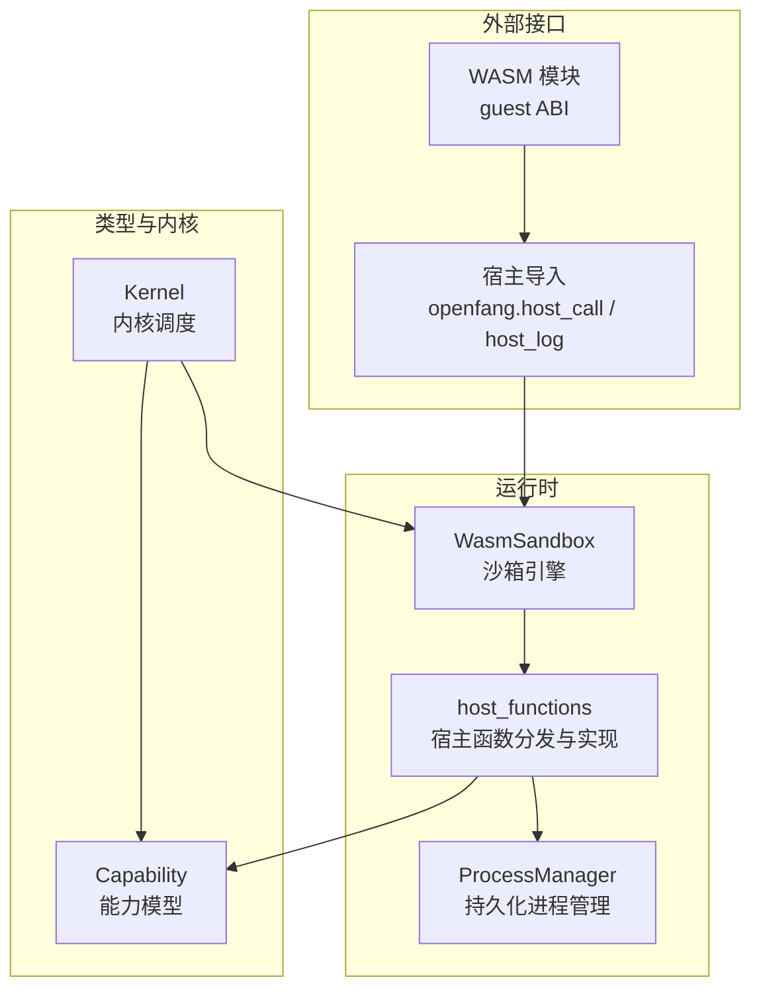
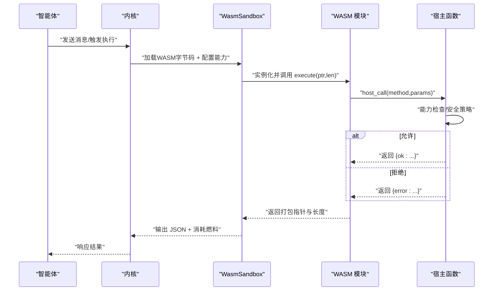
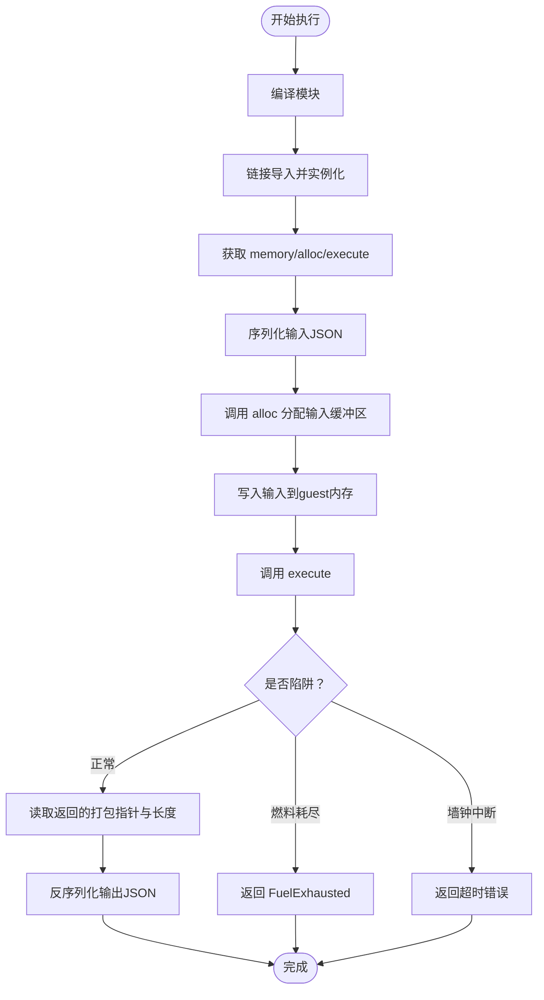
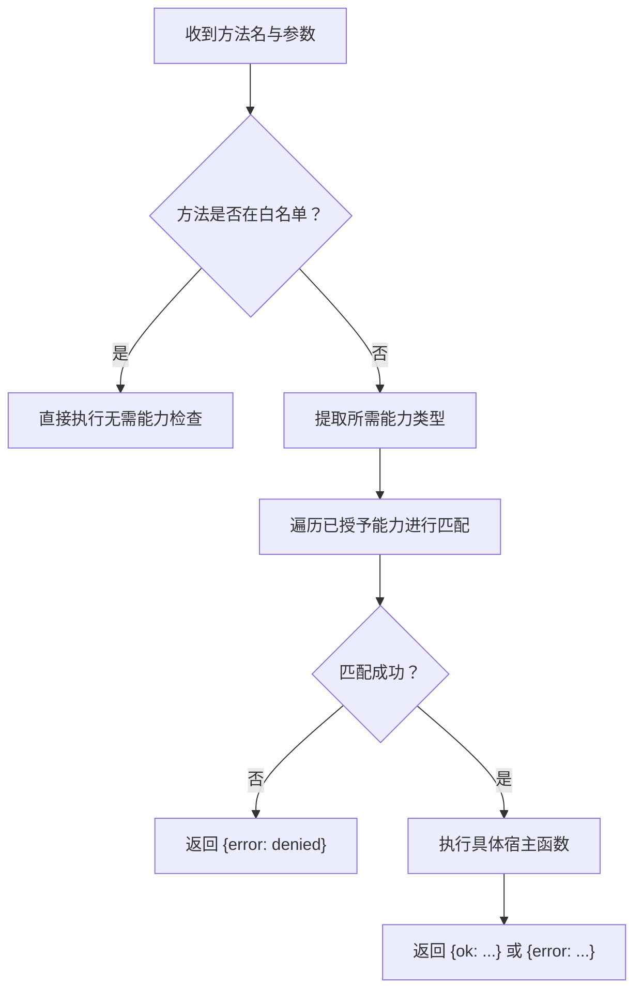
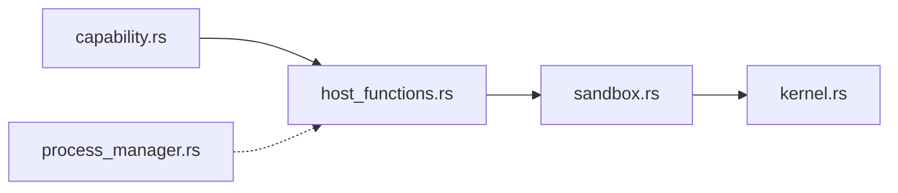

# 宿主函数

<cite>
**本文引用的文件**
- [crates/openfang-runtime/src/sandbox.rs](file://crates/openfang-runtime/src/sandbox.rs)
- [crates/openfang-runtime/src/host_functions.rs](file://crates/openfang-runtime/src/host_functions.rs)
- [crates/openfang-types/src/capability.rs](file://crates/openfang-types/src/capability.rs)
- [crates/openfang-kernel/src/kernel.rs](file://crates/openfang-kernel/src/kernel.rs)
- [crates/openfang-runtime/src/lib.rs](file://crates/openfang-runtime/src/lib.rs)
- [crates/openfang-kernel/tests/wasm_agent_integration_test.rs](file://crates/openfang-kernel/tests/wasm_agent_integration_test.rs)
- [crates/openfang-runtime/src/process_manager.rs](file://crates/openfang-runtime/src/process_manager.rs)
</cite>

## 目录
1. [简介](#简介)
2. [项目结构](#项目结构)
3. [核心组件](#核心组件)
4. [架构总览](#架构总览)
5. [详细组件分析](#详细组件分析)
6. [依赖关系分析](#依赖关系分析)
7. [性能考量](#性能考量)
8. [故障排查指南](#故障排查指南)
9. [结论](#结论)
10. [附录](#附录)

## 简介
本文件系统性阐述 OpenFang 的宿主函数（Host Functions）体系：从设计理念到实现机制，覆盖 WASM 沙箱与宿主环境的交互接口、函数注册与调用流程、能力许可（Capability）模型、安全边界与权限校验、以及性能与稳定性保障。文档同时给出各类宿主函数的功能清单（系统时间、文件读写、网络请求、Shell 执行、环境变量读取、内存键值存取、智能体间通信等），并提供在智能体中调用宿主函数的实践路径（参数传递、返回值处理、错误处理），最后总结安全边界、权限验证与性能优化建议。

## 项目结构
宿主函数系统主要由以下模块构成：
- 运行时沙箱引擎：负责加载 WASM、建立 host 函数导入、执行与计量（燃料/超时）、ABI 调用打包解包。
- 宿主函数实现：集中于单一分发器，按方法名路由到具体能力检查与执行逻辑。
- 能力类型定义：统一的能力枚举、匹配规则与继承校验。
- 内核集成：内核在启动 WASM 代理时映射 manifest 能力到沙箱配置，并驱动执行。
- 测试与示例：提供最小 echo/host_call 代理、燃料耗尽测试、能力拒绝测试等。

**图表来源**
- [crates/openfang-runtime/src/sandbox.rs](file://crates/openfang-runtime/src/sandbox.rs)
- [crates/openfang-runtime/src/host_functions.rs](file://crates/openfang-runtime/src/host_functions.rs)
- [crates/openfang-types/src/capability.rs](file://crates/openfang-types/src/capability.rs)
- [crates/openfang-kernel/src/kernel.rs](file://crates/openfang-kernel/src/kernel.rs)
- [crates/openfang-runtime/src/process_manager.rs](file://crates/openfang-runtime/src/process_manager.rs)

**章节来源**
- [crates/openfang-runtime/src/lib.rs](file://crates/openfang-runtime/src/lib.rs)
- [crates/openfang-kernel/src/kernel.rs](file://crates/openfang-kernel/src/kernel.rs)

## 核心组件
- 沙箱引擎（WasmSandbox）
  - 提供 WASM 模块编译、实例化、执行入口。
  - 注册宿主导入：openfang.host_call（统一能力检查与分发）、openfang.host_log（轻量日志）。
  - 实现 guest ABI：要求导出 memory、alloc、execute；execute 返回打包指针与长度。
  - 配置与计量：燃料（CPU 指令预算）、按 epoch 中断（墙钟超时）。
- 宿主函数分发器（host_functions）
  - 统一方法名到实现的路由表，支持“始终允许”与“需能力许可”的两类方法。
  - 每个方法在执行前进行能力检查，失败即返回错误 JSON。
- 能力模型（Capability）
  - 枚举式能力类型，支持通配符与通配模式匹配。
  - 提供能力继承校验，防止子代理越权。
- 内核集成
  - 将代理清单中的能力映射为沙箱配置，设置燃料与超时。
  - 发送消息给 WASM 代理，等待执行结果。

**章节来源**
- [crates/openfang-runtime/src/sandbox.rs](file://crates/openfang-runtime/src/sandbox.rs)
- [crates/openfang-runtime/src/host_functions.rs](file://crates/openfang-runtime/src/host_functions.rs)
- [crates/openfang-types/src/capability.rs](file://crates/openfang-types/src/capability.rs)
- [crates/openfang-kernel/src/kernel.rs](file://crates/openfang-kernel/src/kernel.rs)

## 架构总览
下图展示了从智能体到 WASM 模块，再到宿主函数的完整调用链路与安全边界：

**图表来源**
- [crates/openfang-runtime/src/sandbox.rs](file://crates/openfang-runtime/src/sandbox.rs)
- [crates/openfang-runtime/src/host_functions.rs](file://crates/openfang-runtime/src/host_functions.rs)
- [crates/openfang-kernel/src/kernel.rs](file://crates/openfang-kernel/src/kernel.rs)

## 详细组件分析

### 沙箱引擎与 ABI
- 导入模块 openfang
  - host_call：统一的宿主调用入口，接收 JSON 请求，返回打包的 JSON 结果指针与长度。
  - host_log：轻量日志，不进行能力检查。
- 导出 ABI（guest 必须提供）
  - memory：线性内存导出。
  - alloc(size): 在 guest 内存分配空间，返回指针。
  - execute(input_ptr: i32, input_len: i32) -> i64：主入口，返回打包结果。
- 执行流程要点
  - 将输入 JSON 序列化后写入 guest 内存，调用 execute。
  - 从返回的打包值中解析指针与长度，读取 guest 内存中的 JSON 输出。
  - 捕获燃料耗尽与墙钟中断异常，转换为明确错误。

**图表来源**
- [crates/openfang-runtime/src/sandbox.rs](file://crates/openfang-runtime/src/sandbox.rs)

**章节来源**
- [crates/openfang-runtime/src/sandbox.rs](file://crates/openfang-runtime/src/sandbox.rs)

### 宿主函数分发与能力检查
- 方法分发
  - 始终允许：time_now。
  - 文件系统：fs_read、fs_write、fs_list（需要 FileRead/FileWrite）。
  - 网络：net_fetch（需要 NetConnect）。
  - Shell：shell_exec（需要 ShellExec）。
  - 环境变量：env_read（需要 EnvRead）。
  - 内存键值：kv_get、kv_set（需要 MemoryRead/MemoryWrite）。
  - 智能体交互：agent_send、agent_spawn（需要 AgentMessage/AgentSpawn）。
- 能力检查
  - check_capability：遍历已授予能力，使用 capability_matches 判断是否匹配。
  - 不匹配则直接返回 {"error": "..."}。
- 安全加固
  - 路径解析：safe_resolve_path/safe_resolve_parent 拒绝父目录组件与非法路径，必要时规范化。
  - SSRF 防护：is_ssrf_target 仅允许 http/https，阻断私有/回环地址与元数据主机名。
  - 日志：host_log 无能力检查，但严格边界检查，避免越界读取。

**图表来源**
- [crates/openfang-runtime/src/host_functions.rs](file://crates/openfang-runtime/src/host_functions.rs)
- [crates/openfang-types/src/capability.rs](file://crates/openfang-types/src/capability.rs)

**章节来源**
- [crates/openfang-runtime/src/host_functions.rs](file://crates/openfang-runtime/src/host_functions.rs)
- [crates/openfang-types/src/capability.rs](file://crates/openfang-types/src/capability.rs)

### 能力模型与继承校验
- 能力类型
  - 文件系统：FileRead、FileWrite（支持通配与 glob）。
  - 网络：NetConnect、NetListen。
  - 工具与 LLM：ToolInvoke、ToolAll、LlmQuery、LlmMaxTokens。
  - 智能体交互：AgentSpawn、AgentMessage、AgentKill。
  - 内存：MemoryRead、MemoryWrite。
  - Shell 与环境：ShellExec、EnvRead。
  - OFP 与经济：OfpDiscover、OfpConnect、OfpAdvertise、EconSpend、EconEarn、EconTransfer。
- 匹配规则
  - 通配符 "*" 匹配任意。
  - 后缀/前缀/中间带 * 的 glob。
  - 数值型能力取上界（如 LlmMaxTokens、EconSpend）。
- 继承校验
  - validate_capability_inheritance：确保子代理能力是父代理能力的子集，防止越权。

**章节来源**
- [crates/openfang-types/src/capability.rs](file://crates/openfang-types/src/capability.rs)

### 内核集成与执行管线
- 内核将代理清单中的能力映射为 SandboxConfig，设置燃料上限、内存限制与超时。
- 内核向沙箱传入 GuestState（包含 agent_id、能力列表、内核句柄、Tokio 句柄）。
- 内核负责消息路由、资源配额与生命周期管理。

**章节来源**
- [crates/openfang-kernel/src/kernel.rs](file://crates/openfang-kernel/src/kernel.rs)

### 示例：在智能体中调用宿主函数
- 最小代理（echo）
  - guest 导出 memory、alloc、execute；execute 直接返回输入 JSON。
  - 通过 host_call 代理可转发任意方法调用。
- 测试用例
  - echo：验证输入 JSON 原样返回。
  - host_call：time_now 无需能力即可调用；fs_read 无能力被拒绝；未知方法返回错误。
  - 燃料耗尽：无限循环导致 FuelExhausted。

**章节来源**
- [crates/openfang-kernel/tests/wasm_agent_integration_test.rs](file://crates/openfang-kernel/tests/wasm_agent_integration_test.rs)
- [crates/openfang-runtime/src/sandbox.rs](file://crates/openfang-runtime/src/sandbox.rs)

### 进程管理（与宿主函数的关系）
- ProcessManager 支持启动、写入、读取与终止持久化进程，用于需要长期运行的工具或服务。
- 宿主函数中的 shell_exec 与 ProcessManager 面向不同场景：前者适合一次性命令执行，后者适合 REPL/服务类长任务。

**章节来源**
- [crates/openfang-runtime/src/process_manager.rs](file://crates/openfang-runtime/src/process_manager.rs)

## 依赖关系分析
- 模块耦合
  - sandbox.rs 依赖 host_functions.rs 进行方法分发。
  - host_functions.rs 依赖 capability.rs 进行能力匹配与继承校验。
  - kernel.rs 依赖 sandbox.rs 执行 WASM 代理，并将 manifest 能力映射为 SandboxConfig。
- 外部依赖
  - Wasmtime 引擎、reqwest 网络库、Tokio 异步运行时。
- 循环依赖
  - 未发现直接循环；能力模型独立于运行时，仅被宿主函数与内核使用。

**图表来源**
- [crates/openfang-runtime/src/sandbox.rs](file://crates/openfang-runtime/src/sandbox.rs)
- [crates/openfang-runtime/src/host_functions.rs](file://crates/openfang-runtime/src/host_functions.rs)
- [crates/openfang-types/src/capability.rs](file://crates/openfang-types/src/capability.rs)
- [crates/openfang-kernel/src/kernel.rs](file://crates/openfang-kernel/src/kernel.rs)
- [crates/openfang-runtime/src/process_manager.rs](file://crates/openfang-runtime/src/process_manager.rs)

**章节来源**
- [crates/openfang-runtime/src/lib.rs](file://crates/openfang-runtime/src/lib.rs)

## 性能考量
- 燃料计量（CPU）
  - 通过 Wasmtime 的 consume_fuel 与 set_fuel 控制指令预算，避免 CPU 洪水。
  - 执行完成后统计消耗，便于审计与限流。
- 墙钟超时
  - epoch_interruption 与 deadline 防止长时间阻塞（如死循环、慢网络）。
- 内存与 I/O
  - guest 侧通过 alloc 与 memory 管理内存，避免越界访问。
  - 文件系统与网络调用应配合能力范围与超时控制，避免滥用。
- 并发与阻塞
  - 沙箱执行在 blocking 线程池中运行，避免阻塞 Tokio 主事件循环。
- 缓存与复用
  - Engine 可复用以减少编译成本；每个内核可复用同一 Engine。

[本节为通用指导，无需特定文件引用]

## 故障排查指南
- 常见错误与定位
  - 能力不足：返回 {"error": "...denied..."}。检查代理清单中的 capabilities 是否覆盖所需方法与参数。
  - 路径问题：路径包含 ".." 或无法规范化会触发错误。确认 safe_resolve_* 的约束。
  - SSRF 阻断：非 http/https 或目标为私有/元数据地址会被拒绝。检查 URL 与 DNS 解析结果。
  - 燃料耗尽：出现 FuelExhausted 错误。提高 max_cpu_time_ms 或优化算法。
  - 墙钟超时：出现 epoch 中断错误。检查网络请求、外部服务响应时间。
  - ABI 违规：缺少 memory/alloc/execute 导出或返回值越界。确保 guest 符合 ABI。
- 调试建议
  - 使用 host_log 记录关键信息（注意无能力检查）。
  - 在内核侧打印执行结果与燃料消耗，辅助定位性能瓶颈。
  - 单元测试覆盖：参考测试用例中的 echo/host_call/unknown method/fuel exhaustion。

**章节来源**
- [crates/openfang-runtime/src/sandbox.rs](file://crates/openfang-runtime/src/sandbox.rs)
- [crates/openfang-runtime/src/host_functions.rs](file://crates/openfang-runtime/src/host_functions.rs)
- [crates/openfang-kernel/tests/wasm_agent_integration_test.rs](file://crates/openfang-kernel/tests/wasm_agent_integration_test.rs)

## 结论
宿主函数系统以“默认拒绝、能力驱动”为核心原则，通过统一的 host_call 分发器与严格的边界检查（路径、SSRF、能力匹配、继承校验）构建了安全可控的执行环境。沙箱引擎提供确定性的 CPU/内存/超时控制，结合内核的资源编排，使智能体能够在受控范围内调用宿主能力，完成文件、网络、Shell、内存与智能体交互等多样化任务。建议在生产中：
- 明确最小能力集，避免过度授权；
- 对网络与文件操作设置合理超时与大小限制；
- 使用测试用例覆盖边界条件与错误路径；
- 定期审计能力继承与权限范围。

[本节为总结，无需特定文件引用]

## 附录

### 宿主函数一览与调用要点
- time_now
  - 用途：获取系统时间戳。
  - 能力：无需。
  - 参数：无。
  - 返回：{"ok": 时间戳}。
- fs_read
  - 用途：读取文件内容。
  - 能力：FileRead。
  - 参数：{"path": "..."}。
  - 返回：{"ok": 文本内容} 或 {"error": "..."}。
- fs_write
  - 用途：写入文件内容。
  - 能力：FileWrite。
  - 参数：{"path": "...", "content": "..."}。
  - 返回：{"ok": true} 或 {"error": "..."}。
- fs_list
  - 用途：列出目录项。
  - 能力：FileRead。
  - 参数：{"path": "..."}。
  - 返回：{"ok": ["文件名列表"]} 或 {"error": "..."}。
- net_fetch
  - 用途：HTTP/HTTPS 请求。
  - 能力：NetConnect（基于主机名与端口）。
  - 参数：{"url": "...", "method": "GET|POST|PUT|DELETE", "body": "..."}。
  - 返回：{"ok": {"status": 200, "body": "..."} } 或 {"error": "..."}。
- shell_exec
  - 用途：执行系统命令（不使用 shell，参数直传）。
  - 能力：ShellExec。
  - 参数：{"command": "...", "args": ["..."]}。
  - 返回：{"ok": {"exit_code": 0, "stdout": "...", "stderr": "..."}} 或 {"error": "..."}。
- env_read
  - 用途：读取环境变量。
  - 能力：EnvRead。
  - 参数：{"name": "..."}。
  - 返回：{"ok": "值或null"}。
- kv_get / kv_set
  - 用途：内存键值存取（依赖内核句柄）。
  - 能力：MemoryRead/MemoryWrite。
  - 参数：{"key": "...", "value": "..."}。
  - 返回：{"ok": 值或true/false} 或 {"error": "..."}。
- agent_send / agent_spawn
  - 用途：与其他智能体通信与子代理创建。
  - 能力：AgentMessage/AgentSpawn。
  - 参数：{"target": "...", "message": "..."} / {"manifest": "..."}。
  - 返回：{"ok": 响应或{id,name}} 或 {"error": "..."}。

**章节来源**
- [crates/openfang-runtime/src/host_functions.rs](file://crates/openfang-runtime/src/host_functions.rs)
- [crates/openfang-types/src/capability.rs](file://crates/openfang-types/src/capability.rs)