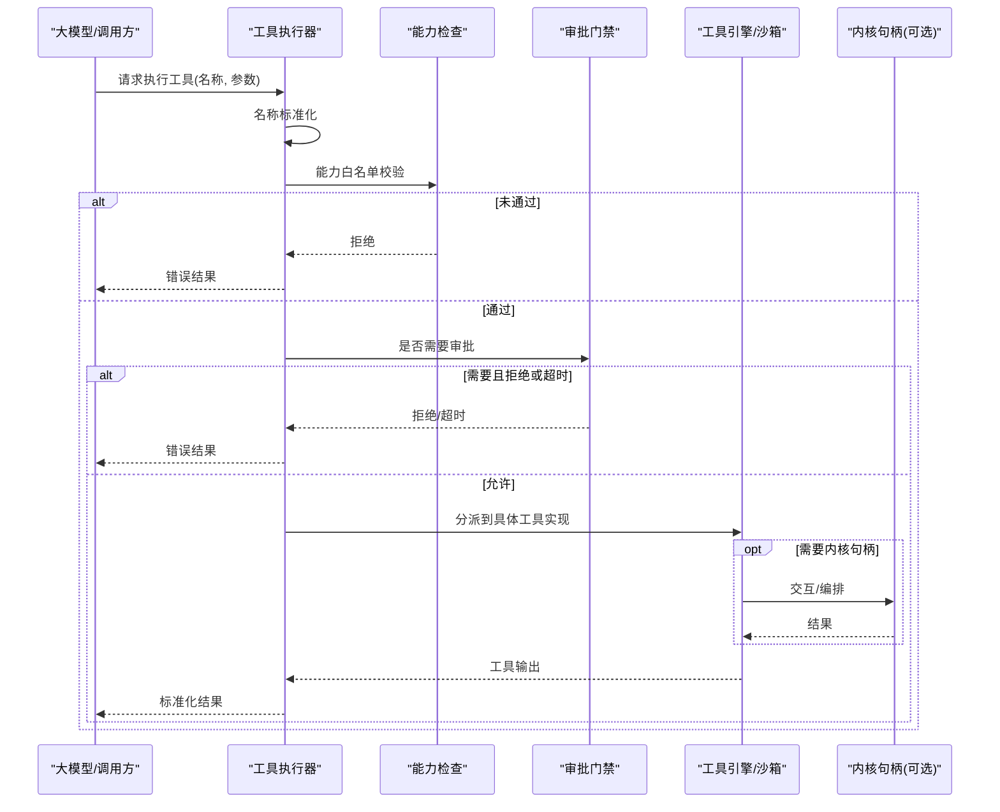
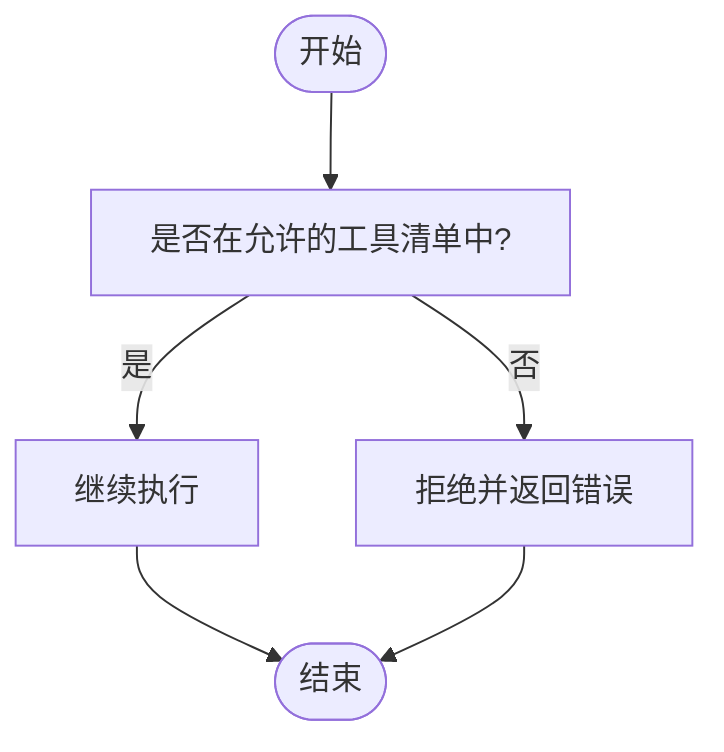
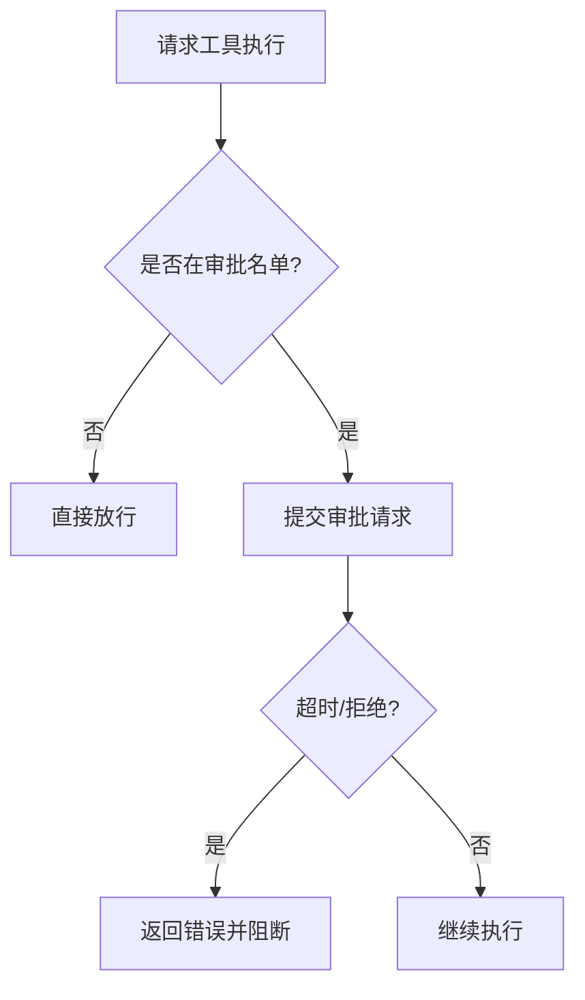
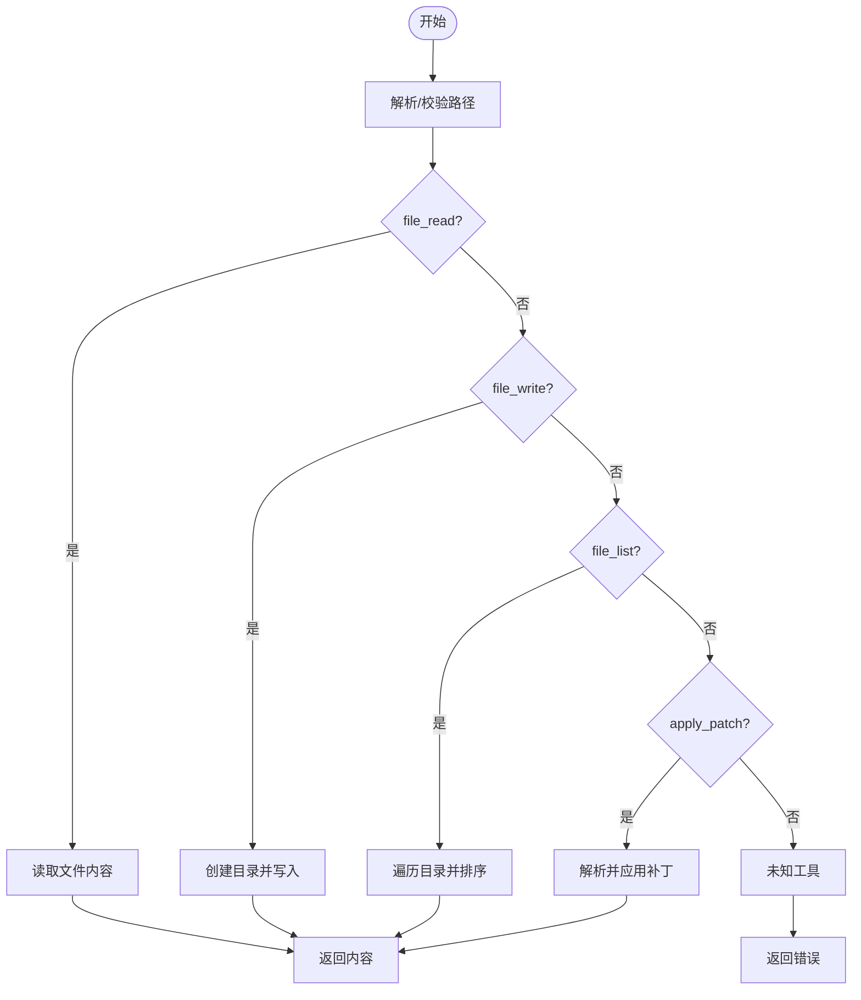
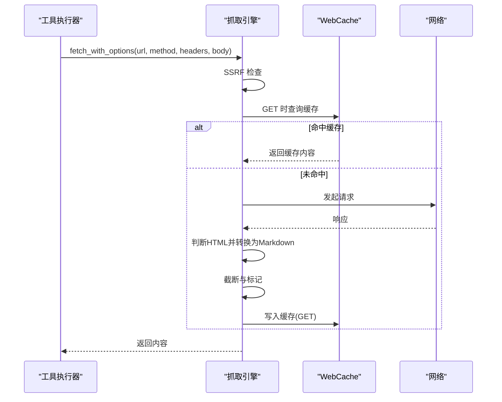
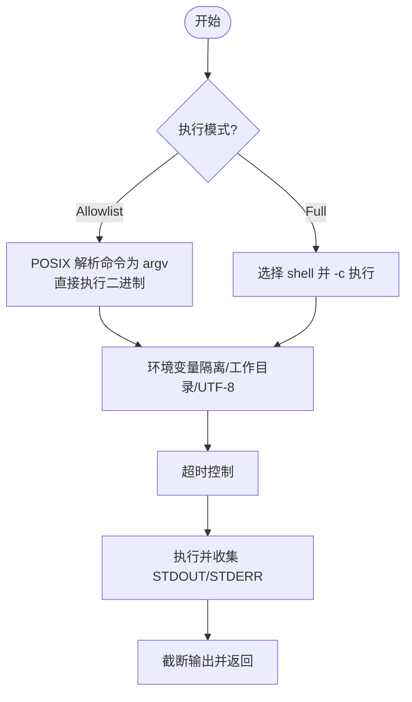
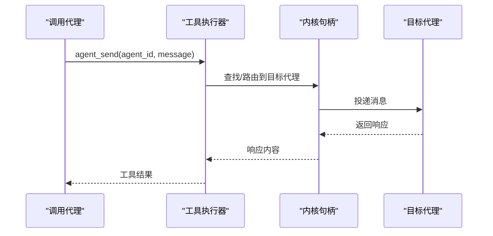
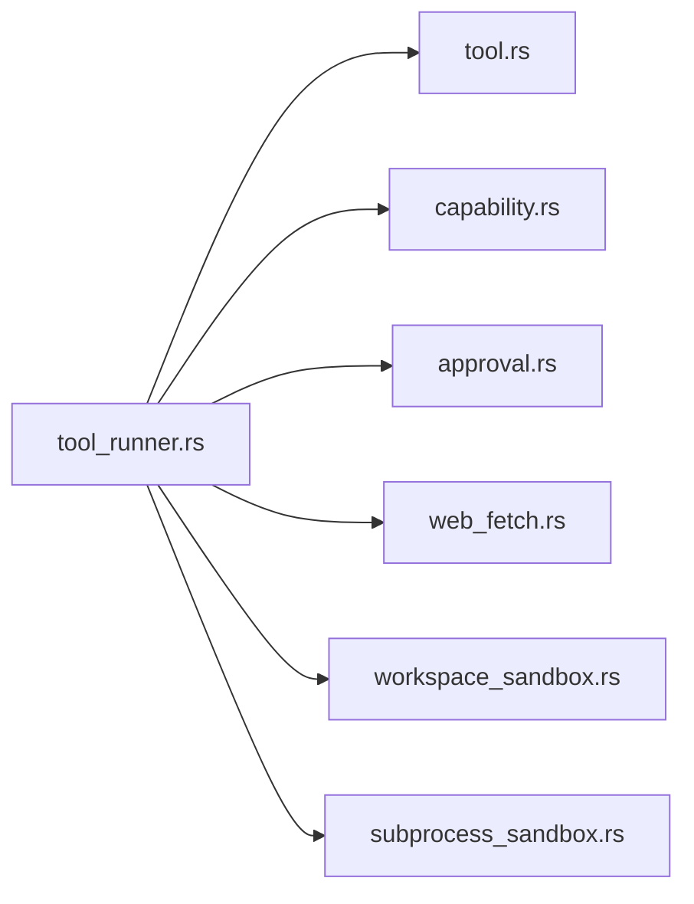

# 工具执行器

<cite>
**本文引用的文件**
- [tool_runner.rs](file://crates/openfang-runtime/src/tool_runner.rs)
- [tool.rs](file://crates/openfang-types/src/tool.rs)
- [capability.rs](file://crates/openfang-types/src/capability.rs)
- [approval.rs](file://crates/openfang-kernel/src/approval.rs)
- [web_fetch.rs](file://crates/openfang-runtime/src/web_fetch.rs)
- [web_search.rs](file://crates/openfang-runtime/src/web_search.rs)
- [subprocess_sandbox.rs](file://crates/openfang-runtime/src/subprocess_sandbox.rs)
- [workspace_sandbox.rs](file://crates/openfang-runtime/src/workspace_sandbox.rs)
</cite>

## 目录
1. [简介](#简介)
2. [项目结构](#项目结构)
3. [核心组件](#核心组件)
4. [架构总览](#架构总览)
5. [详细组件分析](#详细组件分析)
6. [依赖关系分析](#依赖关系分析)
7. [性能考量](#性能考量)
8. [故障排查指南](#故障排查指南)
9. [结论](#结论)
10. [附录](#附录)

## 简介
本文件面向“工具执行器”（ToolRunner）的技术文档，系统阐述其核心执行逻辑与安全控制机制，并对内置工具族进行分门别类的解析。重点覆盖以下方面：
- 工具名称标准化与兼容映射
- 能力检查与权限边界
- 审批门禁与风险分级
- 文件系统工具（读写、列出、补丁应用）
- 网络工具（网页抓取、多引擎搜索）
- Shell 执行工具（安全沙箱、策略模式）
- 跨智能体通信工具（消息发送、实例编排）
- 上下文管理、任务局部存储与深度跟踪
- 返回值格式与错误处理规范

## 项目结构
工具执行器位于运行时层，围绕统一入口函数组织各类工具的执行路径；同时通过类型定义、能力模型与审批管理形成安全闭环。

```mermaid
graph TB
TR["工具执行器<br/>tool_runner.rs"] --> FS["文件系统工具<br/>file_read / file_write / file_list / apply_patch"]
TR --> NET["网络工具<br/>web_fetch / web_search"]
TR --> SH["Shell 执行<br/>shell_exec"]
TR --> AG["跨智能体工具<br/>agent_send / agent_spawn / agent_list / agent_kill"]
TR --> MEM["共享内存工具<br/>memory_store / memory_recall"]
TR --> COL["协作工具<br/>agent_find / task_* / event_publish / schedule_* / cron_*"]
TR --> IMG["媒体理解工具<br/>image_analyze / media_describe / media_transcribe / image_generate"]
TR --> BR["浏览器自动化工具<br/>browser_*"]
TR --> CH["通道发送工具<br/>channel_send"]
TR --> PROC["持久进程工具<br/>process_*"]
TR --> DOCK["容器沙箱工具<br/>docker_exec"]
TR --> CAN["画布呈现工具<br/>canvas_present"]
TR --> MISC["其他工具<br/>location_get / system_time / a2a_* / hand_*"]
TR --> TYPES["类型定义<br/>tool.rs"]
TR --> CAP["能力模型<br/>capability.rs"]
TR --> APP["审批管理<br/>approval.rs"]
TR --> WF["增强抓取引擎<br/>web_fetch.rs"]
TR --> WS["工作区沙箱<br/>workspace_sandbox.rs"]
TR --> SB["子进程沙箱<br/>subprocess_sandbox.rs"]
```

图表来源
- [tool_runner.rs:90-526](file://crates/openfang-runtime/src/tool_runner.rs#L90-L526)
- [tool.rs:5-36](file://crates/openfang-types/src/tool.rs#L5-L36)
- [capability.rs:9-72](file://crates/openfang-types/src/capability.rs#L9-L72)
- [approval.rs:18-188](file://crates/openfang-kernel/src/approval.rs#L18-L188)
- [web_fetch.rs:15-167](file://crates/openfang-runtime/src/web_fetch.rs#L15-L167)
- [workspace_sandbox.rs](file://crates/openfang-runtime/src/workspace_sandbox.rs)
- [subprocess_sandbox.rs](file://crates/openfang-runtime/src/subprocess_sandbox.rs)

章节来源
- [tool_runner.rs:90-526](file://crates/openfang-runtime/src/tool_runner.rs#L90-L526)
- [tool.rs:5-36](file://crates/openfang-types/src/tool.rs#L5-L36)
- [capability.rs:9-72](file://crates/openfang-types/src/capability.rs#L9-L72)
- [approval.rs:18-188](file://crates/openfang-kernel/src/approval.rs#L18-L188)
- [web_fetch.rs:15-167](file://crates/openfang-runtime/src/web_fetch.rs#L15-L167)
- [workspace_sandbox.rs](file://crates/openfang-runtime/src/workspace_sandbox.rs)
- [subprocess_sandbox.rs](file://crates/openfang-runtime/src/subprocess_sandbox.rs)

## 核心组件
- 统一执行入口：根据工具名分派到具体实现，支持标准化名称映射、能力校验、审批门禁、上下文注入与错误包装。
- 类型与契约：工具定义、调用与结果的结构化描述，确保跨提供方的输入模式一致性。
- 能力与审批：基于能力清单的白名单控制与风险分级审批，防止越权与高危操作。
- 增强网络栈：抓取引擎内置 SSRF 检测、缓存、可读性提取与内容标记；搜索引擎多提供商自动回退。
- 沙箱与隔离：工作区路径沙箱、子进程环境隔离、Shell 允许列表/全量模式切换。

章节来源
- [tool_runner.rs:90-526](file://crates/openfang-runtime/src/tool_runner.rs#L90-L526)
- [tool.rs:5-36](file://crates/openfang-types/src/tool.rs#L5-L36)
- [capability.rs:9-72](file://crates/openfang-types/src/capability.rs#L9-L72)
- [approval.rs:18-188](file://crates/openfang-kernel/src/approval.rs#L18-L188)
- [web_fetch.rs:15-167](file://crates/openfang-runtime/src/web_fetch.rs#L15-L167)

## 架构总览
工具执行器采用“入口分派 + 安全前置 + 引擎化实现”的架构。执行流程在进入具体工具前完成名称归一、能力与审批检查；网络工具通过专用引擎实现 SSRF 防护与可读性转换；Shell 执行通过沙箱策略保障安全；跨智能体工具依赖内核句柄与深度限制避免递归风暴。

图表来源
- [tool_runner.rs:90-526](file://crates/openfang-runtime/src/tool_runner.rs#L90-L526)
- [approval.rs:46-96](file://crates/openfang-kernel/src/approval.rs#L46-L96)
- [capability.rs:100-166](file://crates/openfang-types/src/capability.rs#L100-L166)

## 详细组件分析

### 工具名称标准化与兼容映射
- 归一化策略：通过兼容层将不同提供方的别名映射到统一名称，降低 LLM 幻觉导致的工具名差异。
- 作用范围：所有工具在执行前均会经过该步骤，保证后续能力检查与分派一致。

章节来源
- [tool_runner.rs:118-120](file://crates/openfang-runtime/src/tool_runner.rs#L118-L120)

### 能力检查与权限边界
- 能力模型：以细粒度能力项（文件读写、网络连接、工具调用、Shell 执行、代理交互等）表达授权范围。
- 匹配规则：支持精确匹配、通配符与 glob 模式；数值型能力（如最大令牌数、花费限额）按阈值比较。
- 继承校验：禁止子代理权限超过父代理，防止权限提升。

图表来源
- [tool_runner.rs:122-134](file://crates/openfang-runtime/src/tool_runner.rs#L122-L134)
- [capability.rs:100-166](file://crates/openfang-types/src/capability.rs#L100-L166)

章节来源
- [capability.rs:9-72](file://crates/openfang-types/src/capability.rs#L9-L72)
- [capability.rs:100-166](file://crates/openfang-types/src/capability.rs#L100-L166)
- [capability.rs:168-187](file://crates/openfang-types/src/capability.rs#L168-L187)

### 审批门禁与风险分级
- 风险分类：依据工具潜在危害分为低、中、高、严重等级，决定是否纳入审批。
- 门禁策略：可配置要求审批的工具集合、超时时间、自动批准策略等。
- 并发与历史：限制每代理待审批请求数，维护近期审批记录以便审计。

图表来源
- [tool_runner.rs:136-171](file://crates/openfang-runtime/src/tool_runner.rs#L136-L171)
- [approval.rs:46-96](file://crates/openfang-kernel/src/approval.rs#L46-L96)
- [approval.rs:160-168](file://crates/openfang-kernel/src/approval.rs#L160-L168)

章节来源
- [approval.rs:18-188](file://crates/openfang-kernel/src/approval.rs#L18-L188)

### 文件系统工具族
- file_read：解析工作区路径，读取文本内容。
- file_write：解析工作区路径，创建父目录并写入内容，返回写入字节数。
- file_list：解析工作区路径，枚举目录条目并排序输出。
- apply_patch：解析并应用多段补丁，汇总成功/失败信息。

图表来源
- [tool_runner.rs:1276-1336](file://crates/openfang-runtime/src/tool_runner.rs#L1276-L1336)
- [tool_runner.rs:1342-1359](file://crates/openfang-runtime/src/tool_runner.rs#L1342-L1359)
- [workspace_sandbox.rs](file://crates/openfang-runtime/src/workspace_sandbox.rs)

章节来源
- [tool_runner.rs:1256-1359](file://crates/openfang-runtime/src/tool_runner.rs#L1256-L1359)
- [workspace_sandbox.rs](file://crates/openfang-runtime/src/workspace_sandbox.rs)

### 网络工具族
- web_fetch：增强抓取引擎，支持 SSRF 检测、缓存、HTML→Markdown 可读性转换、字符截断与外部内容标记。
- web_search：多提供商自动回退（Tavily/Brave/Perplexity/DuckDuckGo），支持缓存与结果格式化。

图表来源
- [tool_runner.rs:182-202](file://crates/openfang-runtime/src/tool_runner.rs#L182-L202)
- [web_fetch.rs:46-167](file://crates/openfang-runtime/src/web_fetch.rs#L46-L167)

章节来源
- [tool_runner.rs:182-211](file://crates/openfang-runtime/src/tool_runner.rs#L182-L211)
- [web_fetch.rs:15-167](file://crates/openfang-runtime/src/web_fetch.rs#L15-L167)
- [web_search.rs:17-102](file://crates/openfang-runtime/src/web_search.rs#L17-L102)

### Shell 执行工具
- 安全策略：默认允许列表模式（直接二进制执行，避免 shell 注入）；全量模式下使用 shell 解释器。
- 环境隔离：仅暴露白名单环境变量，设置工作目录为工作区，UTF-8 输出与 stdin 隔离。
- 超时控制：优先使用输入指定超时，其次执行策略超时，最后默认 30 秒。
- 注入检测：严格阻止 shell 元字符与可疑模式（curl/base64/eval 等）。

图表来源
- [tool_runner.rs:214-266](file://crates/openfang-runtime/src/tool_runner.rs#L214-L266)
- [subprocess_sandbox.rs](file://crates/openfang-runtime/src/subprocess_sandbox.rs)

章节来源
- [tool_runner.rs:214-266](file://crates/openfang-runtime/src/tool_runner.rs#L214-L266)
- [subprocess_sandbox.rs](file://crates/openfang-runtime/src/subprocess_sandbox.rs)

### 跨智能体通信工具
- agent_send：向目标代理发送消息并等待响应；需内核句柄。
- agent_spawn：从 TOML 清单创建新代理；需内核句柄与调用者身份。
- agent_list/agent_kill：列举与终止代理；需内核句柄。
- 任务队列与事件：task_*、event_publish 提供协作编排能力。
- 深度跟踪：任务局部存储与任务 ID 关联，配合内核状态机实现。

图表来源
- [tool_runner.rs:269-273](file://crates/openfang-runtime/src/tool_runner.rs#L269-L273)

章节来源
- [tool_runner.rs:1584-1660](file://crates/openfang-runtime/src/tool_runner.rs#L1584-L1660)

### 浏览器自动化工具
- 导航/点击/输入/截图/滚动/等待/JS 执行/后退等，均进行 URL taint 校验与浏览器上下文绑定。
- 无可用浏览器时返回明确提示。

章节来源
- [tool_runner.rs:347-447](file://crates/openfang-runtime/src/tool_runner.rs#L347-L447)

### 媒体理解与生成工具
- 图像分析、媒体描述、语音转文本、图像生成等，结合媒体引擎与工作区路径，返回结构化结果或保存产物。

章节来源
- [tool_runner.rs:297-309](file://crates/openfang-runtime/src/tool_runner.rs#L297-L309)

### 定时与调度工具
- cron_*：创建/列出/取消一次性或周期性任务。
- schedule_*：自然语言/CRON 表达式驱动的计划任务。

章节来源
- [tool_runner.rs:322-324](file://crates/openfang-runtime/src/tool_runner.rs#L322-L324)
- [tool_runner.rs:287-289](file://crates/openfang-runtime/src/tool_runner.rs#L287-L289)

### 通道发送工具
- channel_send：向已配置通道（邮件、Telegram、Slack 等）发送消息或媒体，支持线程回复。

章节来源
- [tool_runner.rs:327](file://crates/openfang-runtime/src/tool_runner.rs#L327)

### 持久进程工具
- process_start/poll/write/kill/list：启动长进程、轮询输出、写入标准输入、终止与列举。

章节来源
- [tool_runner.rs:330-334](file://crates/openfang-runtime/src/tool_runner.rs#L330-L334)

### 容器沙箱工具
- docker_exec：在受控容器中执行命令，提供网络与资源隔离。

章节来源
- [tool_runner.rs:312-313](file://crates/openfang-runtime/src/tool_runner.rs#L312-L313)

### 画布呈现工具
- canvas_present：渲染富交互 HTML，经净化后保存并在仪表板面板展示。

章节来源
- [tool_runner.rs:449](file://crates/openfang-runtime/src/tool_runner.rs#L449)

### 其他工具
- location_get/system_time/a2a_*（发现/发送）/hand_*（手部能力包）等。

章节来源
- [tool_runner.rs:316-319](file://crates/openfang-runtime/src/tool_runner.rs#L316-L319)
- [tool_runner.rs:343-344](file://crates/openfang-runtime/src/tool_runner.rs#L343-L344)
- [tool_runner.rs:337-340](file://crates/openfang-runtime/src/tool_runner.rs#L337-L340)

## 依赖关系分析
- 工具执行器依赖类型系统（ToolDefinition/ToolResult）、能力模型与审批管理；网络工具依赖抓取与搜索引擎；Shell 工具依赖子进程沙箱；文件系统工具依赖工作区沙箱。
- 任务局部存储与深度跟踪由内核与工具实现共同支撑。

图表来源
- [tool_runner.rs:90-526](file://crates/openfang-runtime/src/tool_runner.rs#L90-L526)
- [tool.rs:5-36](file://crates/openfang-types/src/tool.rs#L5-L36)
- [capability.rs:9-72](file://crates/openfang-types/src/capability.rs#L9-L72)
- [approval.rs:18-188](file://crates/openfang-kernel/src/approval.rs#L18-L188)
- [web_fetch.rs:15-167](file://crates/openfang-runtime/src/web_fetch.rs#L15-L167)
- [workspace_sandbox.rs](file://crates/openfang-runtime/src/workspace_sandbox.rs)
- [subprocess_sandbox.rs](file://crates/openfang-runtime/src/subprocess_sandbox.rs)

章节来源
- [tool_runner.rs:90-526](file://crates/openfang-runtime/src/tool_runner.rs#L90-L526)

## 性能考量
- 缓存策略：抓取与搜索结果缓存显著降低重复请求开销。
- 输出截断：对长输出进行安全截断，避免内存膨胀与传输负担。
- 超时控制：为网络与进程执行设定合理上限，防止阻塞与资源耗尽。
- 多提供商回退：在可用 API Key 下自动选择最优提供方，提升成功率与稳定性。

## 故障排查指南
- 工具名不生效：确认是否通过名称归一化映射；检查能力清单是否包含该工具。
- 审批被拒/超时：检查审批策略配置与待审批队列；关注每代理最大挂起数量。
- 网络访问失败：检查 SSRF 检测与主机名/IP 白名单；确认缓存命中情况。
- Shell 执行失败：核对执行模式（Allowlist vs Full）、环境变量白名单与超时设置；查看元字符注入阻断日志。
- 文件系统错误：确认路径解析与工作区沙箱策略；注意路径穿越防护。

章节来源
- [tool_runner.rs:118-171](file://crates/openfang-runtime/src/tool_runner.rs#L118-L171)
- [web_fetch.rs:185-235](file://crates/openfang-runtime/src/web_fetch.rs#L185-L235)
- [subprocess_sandbox.rs](file://crates/openfang-runtime/src/subprocess_sandbox.rs)

## 结论
工具执行器通过“名称归一化 + 能力白名单 + 审批门禁 + 引擎化实现 + 沙箱隔离”的设计，在开放生态中实现了可控、可观测、可扩展的工具执行框架。内置工具族覆盖文件系统、网络、Shell、跨智能体通信、媒体理解与可视化等关键场景，满足复杂任务编排需求。

## 附录
- 返回值格式：统一为 ToolResult，包含工具 use_id、内容字符串与错误标志位。
- 参数验证：工具输入遵循 JSON Schema，执行前进行必需字段与类型校验。
- 错误处理：将底层异常包装为人类可读的错误信息，必要时返回 is_error 标记。

章节来源
- [tool.rs:27-36](file://crates/openfang-types/src/tool.rs#L27-L36)
- [tool_runner.rs:514-526](file://crates/openfang-runtime/src/tool_runner.rs#L514-L526)