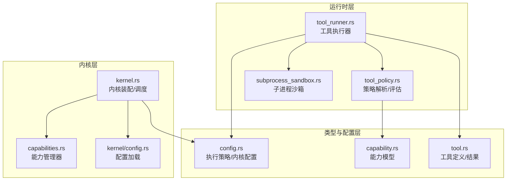
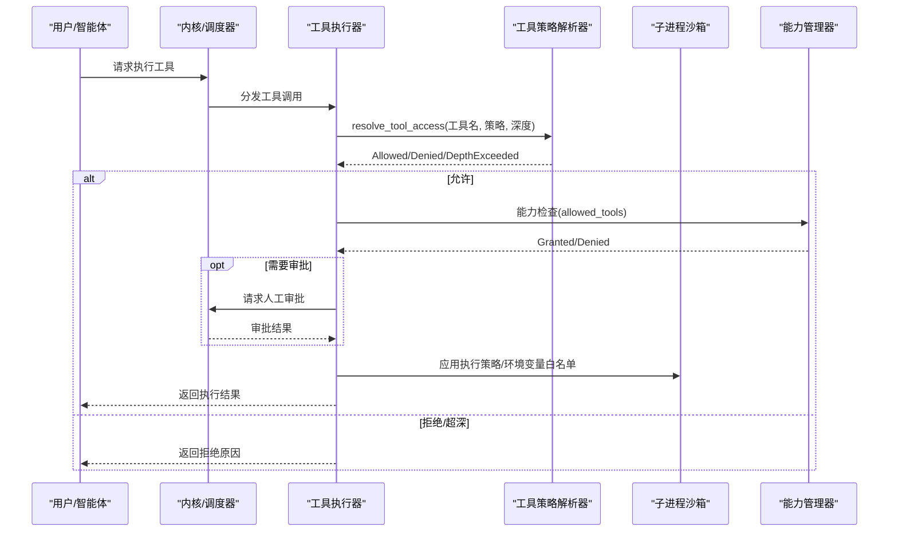
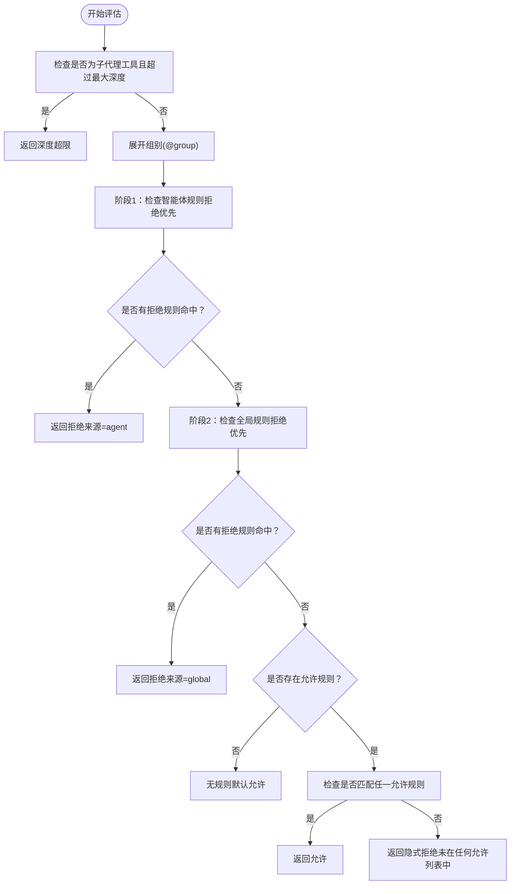
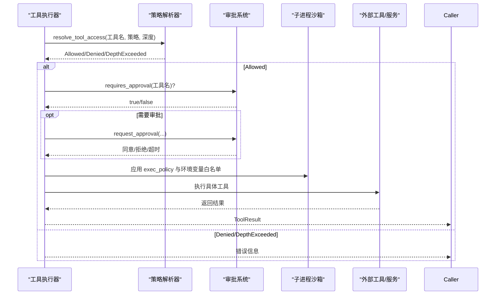
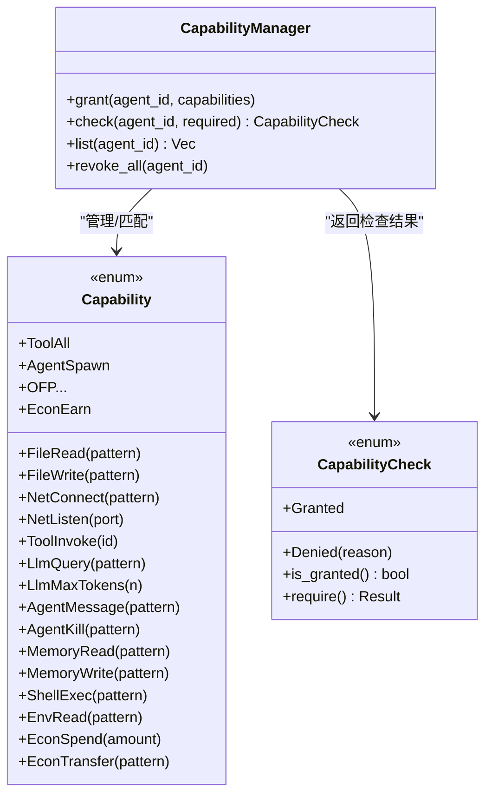
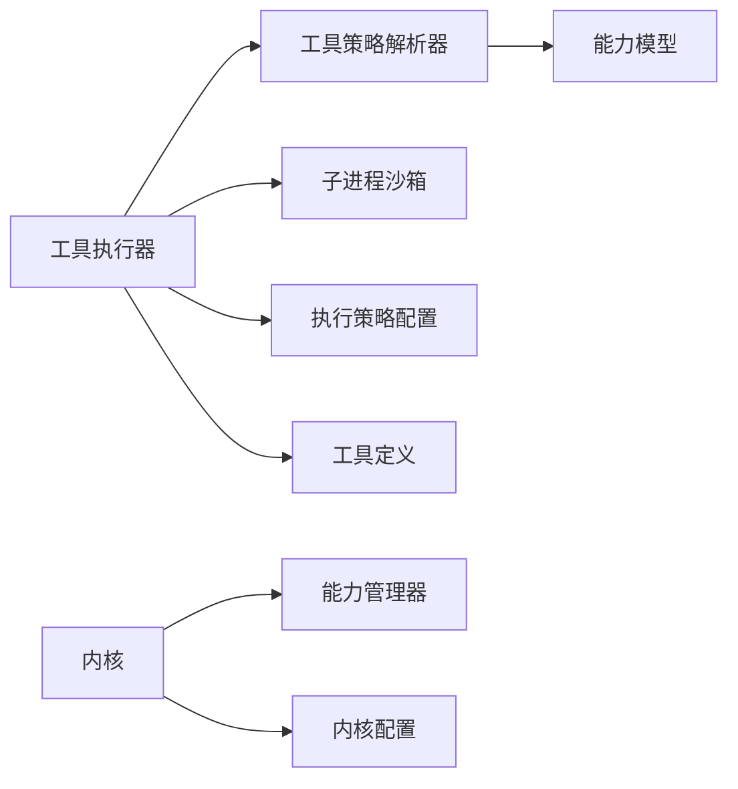

# 工具策略系统

<cite>
**本文档引用的文件**
- [tool_policy.rs](file://crates/openfang-runtime/src/tool_policy.rs)
- [tool_runner.rs](file://crates/openfang-runtime/src/tool_runner.rs)
- [capabilities.rs](file://crates/openfang-kernel/src/capabilities.rs)
- [capability.rs](file://crates/openfang-types/src/capability.rs)
- [config.rs](file://crates/openfang-types/src/config.rs)
- [config.rs](file://crates/openfang-kernel/src/config.rs)
- [subprocess_sandbox.rs](file://crates/openfang-runtime/src/subprocess_sandbox.rs)
- [tool.rs](file://crates/openfang-types/src/tool.rs)
- [agent.toml](file://agents/analyst/agent.toml)
- [kernel.rs](file://crates/openfang-kernel/src/kernel.rs)
</cite>

## 目录
1. [简介](#简介)
2. [项目结构](#项目结构)
3. [核心组件](#核心组件)
4. [架构总览](#架构总览)
5. [详细组件分析](#详细组件分析)
6. [依赖关系分析](#依赖关系分析)
7. [性能考虑](#性能考虑)
8. [故障排除指南](#故障排除指南)
9. [结论](#结论)
10. [附录](#附录)

## 简介
本文件系统性阐述 OpenFang 工具策略系统的设计与实现，重点覆盖以下方面：
- 能力基安全模型（Capability-Based Security）：以授权清单为核心，确保“最小权限”原则。
- 工具白名单/黑名单管理：基于通配符模式的多层策略（全局/智能体级别），支持组别展开与显式优先级。
- 调用频率限制与资源配额控制：通过执行策略（exec_policy）、预算配置与会话令牌限制实现。
- 策略配置层次结构：从全局内核配置到智能体清单的细粒度控制。
- 策略评估流程、缓存机制与性能优化策略。

## 项目结构
工具策略系统横跨多个模块：
- 运行时层：工具执行器、子进程沙箱、策略解析与评估。
- 类型与配置层：策略数据结构、执行策略、内核配置。
- 内核层：能力管理器、策略应用入口与生命周期集成。

图表来源
- [tool_runner.rs](file://crates/openfang-runtime/src/tool_runner.rs)
- [tool_policy.rs](file://crates/openfang-runtime/src/tool_policy.rs)
- [subprocess_sandbox.rs](file://crates/openfang-runtime/src/subprocess_sandbox.rs)
- [config.rs](file://crates/openfang-types/src/config.rs)
- [capability.rs](file://crates/openfang-types/src/capability.rs)
- [tool.rs](file://crates/openfang-types/src/tool.rs)
- [kernel.rs](file://crates/openfang-kernel/src/kernel.rs)
- [capabilities.rs](file://crates/openfang-kernel/src/capabilities.rs)
- [config.rs](file://crates/openfang-kernel/src/config.rs)

章节来源
- [tool_policy.rs](file://crates/openfang-runtime/src/tool_policy.rs)
- [tool_runner.rs](file://crates/openfang-runtime/src/tool_runner.rs)
- [capability.rs](file://crates/openfang-types/src/capability.rs)
- [config.rs](file://crates/openfang-types/src/config.rs)
- [kernel.rs](file://crates/openfang-kernel/src/kernel.rs)

## 核心组件
- 工具策略解析器（ToolPolicy/resolve_tool_access）
  - 多层策略：智能体规则优先于全局规则；拒绝优先于允许；显式规则优先于通配符。
  - 组别展开：支持以 @group 形式的组引用，提升可维护性。
  - 深度限制：针对子代理工具（spawn/call）进行最大深度限制与叶节点限制。
- 工具执行器（execute_tool）
  - 能力基检查：仅允许在 allowed_tools 列表中的工具执行。
  - 审批门禁：对需要人工审批的工具进行前置审批。
  - 执行策略：根据 exec_policy 对 shell 命令进行阻断或放行。
  - 环境变量白名单：通过 subprocess_sandbox 清理并仅保留允许的环境变量。
- 能力管理器（CapabilityManager）
  - 授权与匹配：基于通配符与精确匹配的能力授予与校验。
  - 防特权升级：校验子能力不得超出父能力集合。
- 执行策略（ExecPolicy）
  - 三种模式：deny（全部阻断）、allowlist（仅允许列表）、full（开发模式）。
  - 安全边界：元字符阻断优先于允许列表，防止注入与逃逸。
- 配置层次
  - 全局内核配置：exec_policy、预算、网络与资源上限等。
  - 智能体清单：capabilities/tools/network/memory/shell 等细粒度授权。

章节来源
- [tool_policy.rs](file://crates/openfang-runtime/src/tool_policy.rs)
- [tool_runner.rs](file://crates/openfang-runtime/src/tool_runner.rs)
- [capabilities.rs](file://crates/openfang-kernel/src/capabilities.rs)
- [capability.rs](file://crates/openfang-types/src/capability.rs)
- [config.rs](file://crates/openfang-types/src/config.rs)
- [config.rs](file://crates/openfang-kernel/src/config.rs)

## 架构总览
工具策略系统在“请求进入—策略评估—执行”的主路径上，结合能力基与策略规则，形成纵深防御：

图表来源
- [tool_runner.rs](file://crates/openfang-runtime/src/tool_runner.rs)
- [tool_policy.rs](file://crates/openfang-runtime/src/tool_policy.rs)
- [subprocess_sandbox.rs](file://crates/openfang-runtime/src/subprocess_sandbox.rs)
- [capabilities.rs](file://crates/openfang-kernel/src/capabilities.rs)

## 详细组件分析

### 工具策略解析器（ToolPolicy/resolve_tool_access）
- 规则优先级
  - 智能体规则优先于全局规则。
  - 拒绝优先于允许（deny-wins）。
  - 显式规则优先于通配符规则。
- 组别展开
  - 支持以 @group 的形式引用一组工具模式，简化维护。
- 深度限制
  - 子代理工具（spawn/call）受最大深度限制；叶节点进一步限制某些高危工具。
- 结果类型
  - Allowed、Denied（含规则模式与来源）、DepthExceeded。

图表来源
- [tool_policy.rs](file://crates/openfang-runtime/src/tool_policy.rs)

章节来源
- [tool_policy.rs](file://crates/openfang-runtime/src/tool_policy.rs)

### 工具执行器（execute_tool）
- 能力基检查
  - 仅当工具名出现在 allowed_tools 中才允许执行，防止 LLM 幻觉调用未授权工具。
- 审批门禁
  - 对需人工审批的工具，先请求审批再执行。
- 执行策略
  - shell_exec：先阻断元字符注入，再按 exec_policy 模式校验命令。
  - 允许列表模式下，严格禁止管道、重定向、变量扩展等危险操作。
- 环境变量白名单
  - 通过 subprocess_sandbox 清空子进程环境，仅重放安全变量与显式允许变量。
- 其他工具
  - 文件系统、网络、浏览器、Docker、任务调度、手（Hand）等工具均在统一入口下分派执行。

图表来源
- [tool_runner.rs](file://crates/openfang-runtime/src/tool_runner.rs)
- [subprocess_sandbox.rs](file://crates/openfang-runtime/src/subprocess_sandbox.rs)

章节来源
- [tool_runner.rs](file://crates/openfang-runtime/src/tool_runner.rs)
- [subprocess_sandbox.rs](file://crates/openfang-runtime/src/subprocess_sandbox.rs)

### 能力管理器（CapabilityManager）
- 授权与匹配
  - 支持文件读写、网络连接、工具调用、LLM 查询、代理交互、内存读写、Shell 执行、环境变量读取等多类能力。
  - 通配符与精确匹配相结合，如 "api.*.com:443" 可匹配 "api.openai.com:443"。
- 防特权升级
  - 校验子能力不得超出父能力集合，避免越权创建不受控子代理。
- 运行时检查
  - 在工具执行前，对 allowed_tools 进行快速过滤，确保最小权限。

图表来源
- [capabilities.rs](file://crates/openfang-kernel/src/capabilities.rs)
- [capability.rs](file://crates/openfang-types/src/capability.rs)

章节来源
- [capabilities.rs](file://crates/openfang-kernel/src/capabilities.rs)
- [capability.rs](file://crates/openfang-types/src/capability.rs)

### 执行策略（ExecPolicy）与子进程沙箱
- 模式与安全边界
  - deny：完全阻断 shell 执行。
  - allowlist：仅允许 safe_bins 与 allowed_commands；严格阻断元字符注入。
  - full：开发模式，不加限制（不建议生产使用）。
- 元字符阻断
  - 回溯、变量扩展、管道、重定向、大括号扩展、换行、空字节、后台执行等一律阻断。
- 环境变量白名单
  - 默认保留 PATH、HOME、LANG 等基础变量，Windows 下额外保留平台特定变量；其余变量需显式允许。
- 超时与空输出超时
  - 支持绝对超时与无输出空闲超时，双重保障资源占用。

章节来源
- [config.rs](file://crates/openfang-types/src/config.rs)
- [subprocess_sandbox.rs](file://crates/openfang-runtime/src/subprocess_sandbox.rs)

### 策略配置层次结构
- 全局内核配置（config.toml）
  - exec_policy：执行策略（模式、允许列表、超时、输出大小、无输出超时）。
  - budget：全局消费预算（小时/日/月）与阈值告警。
  - 其他：网络、浏览器、Docker、OAuth、配额等。
- 智能体清单（agent.toml）
  - capabilities：tools、network、memory、shell 等授权清单。
  - resources：每小时 LLM token 上限等资源配额。
- 实践示例（路径引用）
  - [全局执行策略示例](file://crates/openfang-types/src/config.rs)
  - [智能体能力授权示例](file://agents/analyst/agent.toml)

章节来源
- [config.rs](file://crates/openfang-types/src/config.rs)
- [config.rs](file://crates/openfang-kernel/src/config.rs)
- [agent.toml](file://agents/analyst/agent.toml)

## 依赖关系分析
- 组件耦合
  - 工具执行器依赖策略解析器、执行策略、能力管理器与子进程沙箱。
  - 能力管理器与策略解析器共享能力模型与通配符匹配逻辑。
  - 内核负责装配上述组件，并在生命周期中加载配置与策略。
- 外部依赖
  - MCP 服务器、技能注册表、浏览器自动化、媒体引擎等作为工具执行的后端。

图表来源
- [tool_runner.rs](file://crates/openfang-runtime/src/tool_runner.rs)
- [tool_policy.rs](file://crates/openfang-runtime/src/tool_policy.rs)
- [subprocess_sandbox.rs](file://crates/openfang-runtime/src/subprocess_sandbox.rs)
- [capability.rs](file://crates/openfang-types/src/capability.rs)
- [config.rs](file://crates/openfang-types/src/config.rs)
- [kernel.rs](file://crates/openfang-kernel/src/kernel.rs)
- [capabilities.rs](file://crates/openfang-kernel/src/capabilities.rs)
- [config.rs](file://crates/openfang-kernel/src/config.rs)
- [tool.rs](file://crates/openfang-types/src/tool.rs)

章节来源
- [kernel.rs](file://crates/openfang-kernel/src/kernel.rs)
- [tool_runner.rs](file://crates/openfang-runtime/src/tool_runner.rs)

## 性能考虑
- 策略评估复杂度
  - 规则线性扫描：O(R)（R 为规则数）。可通过分组与早期短路减少比较次数。
  - 通配符匹配：简单模式 O(P)（P 为片段数），复杂模式采用贪心匹配。
- 缓存机制
  - 当前实现未见专用缓存；可在高频场景对 resolve_tool_access 的结果进行短期缓存（基于工具名+策略哈希+深度）。
- 并发与深度控制
  - 子代理最大深度与并发限制可有效防止资源耗尽与递归风暴。
- I/O 与超时
  - 子进程等待与无输出空闲超时避免僵尸进程与长时间占用。

[本节提供通用指导，无需特定文件引用]

## 故障排除指南
- 工具被拒绝
  - 检查 allowed_tools 是否包含该工具名（能力基检查）。
  - 若存在 deny 规则，确认是否为智能体规则或全局规则导致。
  - 检查是否命中深度限制（子代理工具）。
- shell 命令被阻断
  - 确认 exec_policy.mode 设置是否为 full（开发模式）。
  - 检查命令是否包含元字符（回溯、管道、重定向等）。
  - 确认命令是否在 safe_bins 或 allowed_commands 中。
- 环境变量泄漏
  - 确认 allowed_env_vars 是否包含所需变量。
  - 检查 subprocess_sandbox 是否正确清理了其他变量。
- 审批未通过
  - 检查审批策略配置与审批流程状态。
- 预算/配额超限
  - 检查全局预算与智能体资源配额设置。

章节来源
- [tool_runner.rs](file://crates/openfang-runtime/src/tool_runner.rs)
- [tool_policy.rs](file://crates/openfang-runtime/src/tool_policy.rs)
- [subprocess_sandbox.rs](file://crates/openfang-runtime/src/subprocess_sandbox.rs)
- [config.rs](file://crates/openfang-types/src/config.rs)

## 结论
OpenFang 工具策略系统通过“能力基 + 多层策略 + 执行策略 + 沙箱隔离”的组合拳，实现了从全局到智能体级别的细粒度访问控制。其设计强调“拒绝优先、显式优于通配符、深度与并发限制”，并在生产环境中提供了安全边界（元字符阻断、环境变量白名单、超时与空闲超时）。配合全局预算与智能体资源配额，系统在安全性与可用性之间取得平衡。

[本节为总结性内容，无需特定文件引用]

## 附录

### 配置示例与最佳实践（路径引用）
- 全局执行策略（exec_policy）
  - [执行策略定义与默认值](file://crates/openfang-types/src/config.rs)
  - [allowlist 模式下的安全边界与元字符阻断](file://crates/openfang-runtime/src/subprocess_sandbox.rs)
- 智能体能力授权
  - [能力模型与匹配规则](file://crates/openfang-types/src/capability.rs)
  - [能力管理器接口](file://crates/openfang-kernel/src/capabilities.rs)
  - [智能体清单示例（capabilities/resources）](file://agents/analyst/agent.toml)
- 策略评估流程
  - [工具策略解析与评估](file://crates/openfang-runtime/src/tool_policy.rs)
- 工具执行与审批
  - [工具执行器主流程](file://crates/openfang-runtime/src/tool_runner.rs)

章节来源
- [config.rs](file://crates/openfang-types/src/config.rs)
- [subprocess_sandbox.rs](file://crates/openfang-runtime/src/subprocess_sandbox.rs)
- [capability.rs](file://crates/openfang-types/src/capability.rs)
- [capabilities.rs](file://crates/openfang-kernel/src/capabilities.rs)
- [agent.toml](file://agents/analyst/agent.toml)
- [tool_policy.rs](file://crates/openfang-runtime/src/tool_policy.rs)
- [tool_runner.rs](file://crates/openfang-runtime/src/tool_runner.rs)