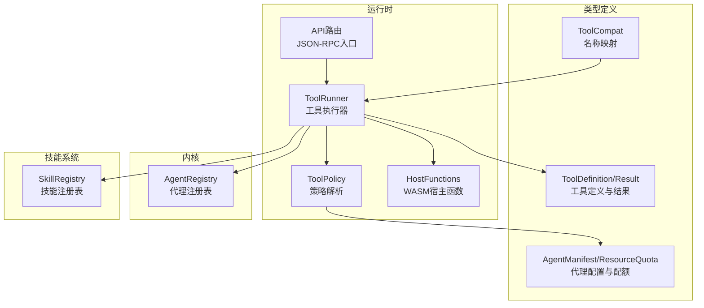
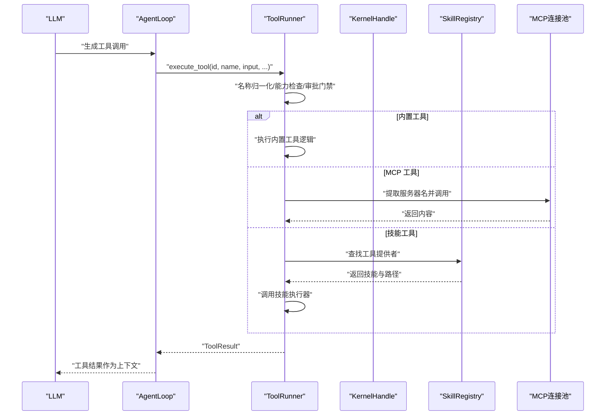
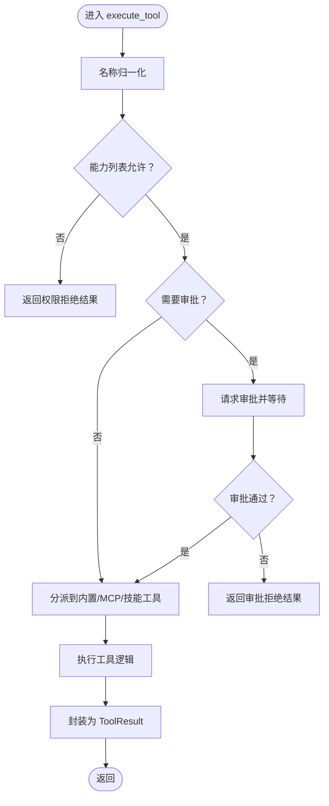
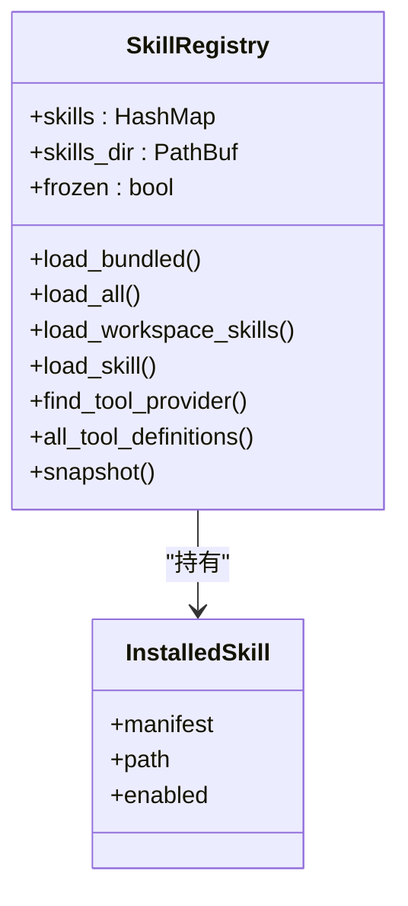
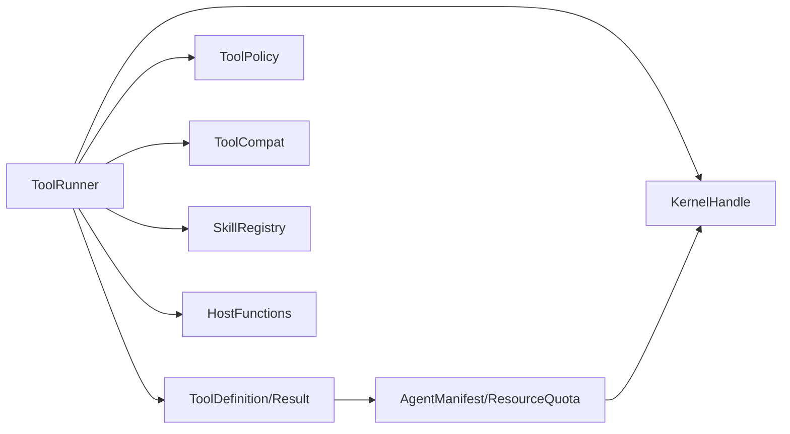

# 工具系统

<cite>
**本文引用的文件**
- [tool_runner.rs](file://crates/openfang-runtime/src/tool_runner.rs)
- [tool_policy.rs](file://crates/openfang-runtime/src/tool_policy.rs)
- [tool.rs](file://crates/openfang-types/src/tool.rs)
- [tool_compat.rs](file://crates/openfang-types/src/tool_compat.rs)
- [host_functions.rs](file://crates/openfang-runtime/src/host_functions.rs)
- [registry.rs（内核）](file://crates/openfang-kernel/src/registry.rs)
- [registry.rs（技能）](file://crates/openfang-skills/src/registry.rs)
- [agent.rs](file://crates/openfang-types/src/agent.rs)
- [agent_loop.rs](file://crates/openfang-runtime/src/agent_loop.rs)
- [routes.rs](file://crates/openfang-api/src/routes.rs)
</cite>

## 目录
1. [简介](#简介)
2. [项目结构](#项目结构)
3. [核心组件](#核心组件)
4. [架构总览](#架构总览)
5. [详细组件分析](#详细组件分析)
6. [依赖关系分析](#依赖关系分析)
7. [性能考虑](#性能考虑)
8. [故障排查指南](#故障排查指南)
9. [结论](#结论)
10. [附录：开发与调试最佳实践](#附录开发与调试最佳实践)

## 简介
本技术文档围绕工具系统展开，重点阐述 ToolRunner 的工具注册机制、动态加载策略与执行流程控制；详解工具策略系统的权限控制、资源限制与调用频率管理；并给出创建自定义工具、实现宿主函数、配置工具参数的方法与最佳实践。同时解释工具与 LLM 的交互模式，并提供调试方法与排障建议。

## 项目结构
工具系统横跨运行时、类型定义、内核与技能系统等模块：
- 运行时层负责工具执行、策略解析、宿主函数与浏览器/网络等能力封装
- 类型层提供工具定义、结果、兼容映射与代理清单等数据模型
- 内核层维护代理注册表与资源配额
- 技能系统提供可动态加载的“技能”工具集

图示来源
- [tool_runner.rs](file://crates/openfang-runtime/src/tool_runner.rs)
- [tool_policy.rs](file://crates/openfang-runtime/src/tool_policy.rs)
- [tool.rs](file://crates/openfang-types/src/tool.rs)
- [tool_compat.rs](file://crates/openfang-types/src/tool_compat.rs)
- [host_functions.rs](file://crates/openfang-runtime/src/host_functions.rs)
- [registry.rs（内核）](file://crates/openfang-kernel/src/registry.rs)
- [registry.rs（技能）](file://crates/openfang-skills/src/registry.rs)
- [agent.rs](file://crates/openfang-types/src/agent.rs)
- [routes.rs](file://crates/openfang-api/src/routes.rs)

章节来源
- [tool_runner.rs](file://crates/openfang-runtime/src/tool_runner.rs)
- [tool_policy.rs](file://crates/openfang-runtime/src/tool_policy.rs)
- [tool.rs](file://crates/openfang-types/src/tool.rs)
- [tool_compat.rs](file://crates/openfang-types/src/tool_compat.rs)
- [host_functions.rs](file://crates/openfang-runtime/src/host_functions.rs)
- [registry.rs（内核）](file://crates/openfang-kernel/src/registry.rs)
- [registry.rs（技能）](file://crates/openfang-skills/src/registry.rs)
- [agent.rs](file://crates/openfang-types/src/agent.rs)
- [routes.rs](file://crates/openfang-api/src/routes.rs)

## 核心组件
- ToolRunner：统一的工具执行器，支持内置工具、MCP 工具与技能工具的分发与执行，内置能力包括文件系统、网络抓取、Web 搜索、Shell 执行、跨代理通信、知识图谱、媒体理解、Docker 执行、浏览器自动化、Canvas 展示等。
- ToolPolicy：多层策略解析，支持“拒绝优先”的规则体系、通配匹配、组展开、深度限制与并发限制。
- ToolDefinition/ToolResult：标准化工具定义与结果格式，提供跨 Provider 的 Schema 规范化。
- ToolCompat：LLM 常见别名到 OpenFang 标准名的映射与规范化。
- HostFunctions：WASM 沙箱宿主函数，基于能力授权与路径/SSRF 安全检查。
- SkillRegistry：技能注册表，支持捆绑技能、用户安装技能与工作区覆盖，动态发现工具提供者。
- AgentRegistry：内核代理注册表，维护代理状态、索引与资源配额更新。
- AgentManifest/ResourceQuota：代理清单与资源配额，用于工具可用性与频率限制的配置基础。

章节来源
- [tool_runner.rs](file://crates/openfang-runtime/src/tool_runner.rs)
- [tool_policy.rs](file://crates/openfang-runtime/src/tool_policy.rs)
- [tool.rs](file://crates/openfang-types/src/tool.rs)
- [tool_compat.rs](file://crates/openfang-types/src/tool_compat.rs)
- [host_functions.rs](file://crates/openfang-runtime/src/host_functions.rs)
- [registry.rs（技能）](file://crates/openfang-skills/src/registry.rs)
- [registry.rs（内核）](file://crates/openfang-kernel/src/registry.rs)
- [agent.rs](file://crates/openfang-types/src/agent.rs)

## 架构总览
工具系统在运行时中以 ToolRunner 为核心，接收来自 LLM 的工具调用请求，经过能力与策略校验后，按优先级分派至内置工具、MCP 工具或技能工具执行器。执行结果通过 ToolResult 返回给 LLM 或上层流程。

图示来源
- [tool_runner.rs](file://crates/openfang-runtime/src/tool_runner.rs)
- [agent_loop.rs](file://crates/openfang-runtime/src/agent_loop.rs)
- [routes.rs](file://crates/openfang-api/src/routes.rs)

章节来源
- [tool_runner.rs](file://crates/openfang-runtime/src/tool_runner.rs)
- [agent_loop.rs](file://crates/openfang-runtime/src/agent_loop.rs)
- [routes.rs](file://crates/openfang-api/src/routes.rs)

## 详细组件分析

### ToolRunner：工具注册与执行
- 工具注册与发现
  - 内置工具：集中于 execute_tool 分支，涵盖文件系统、Web、Shell、跨代理、任务/事件、调度、知识图谱、图像分析、媒体理解、Docker、位置、系统时间、Cron、通道发送、持久进程、Hand 工具、A2A 出站、浏览器自动化、Canvas 等。
  - MCP 工具：通过 is_mcp_tool 识别，从已连接的 MCP 连接池中定位服务器并调用。
  - 技能工具：通过 SkillRegistry.find_tool_provider 查找提供者，使用 openfang_skills::loader::execute_skill_tool 动态执行。
- 能力与策略控制
  - 名称归一化：通过 tool_compat::normalize_tool_name 将 LLM 可能的别名映射为标准名。
  - 能力列表检查：若传入 allowed_tools，则仅允许其中的工具执行。
  - 审批门禁：若 KernelHandle 标记该工具需要审批，则阻塞等待审批结果。
  - 策略解析：对子代理工具进行深度限制与并发限制，拒绝特定工具在特定深度下的执行。
- 安全与合规
  - Shell 执行：先做元字符注入检测，再依据执行策略（allowlist/deny/full）与污点检查（taint）决定是否放行。
  - 网络访问：对 URL 进行污点检查（避免泄露密钥/令牌），并进行 SSRF 防护（主机名黑名单+解析地址私网范围检查）。
  - 浏览器工具：同样进行 URL 污点检查，并要求已安装浏览器环境。
- 结果封装：统一包装为 ToolResult，错误路径自动转为 is_error=true 的字符串内容。

图示来源
- [tool_runner.rs](file://crates/openfang-runtime/src/tool_runner.rs)
- [tool_compat.rs](file://crates/openfang-types/src/tool_compat.rs)

章节来源
- [tool_runner.rs](file://crates/openfang-runtime/src/tool_runner.rs)
- [tool_compat.rs](file://crates/openfang-types/src/tool_compat.rs)

### 工具策略系统：权限、资源与频率
- 规则体系
  - 拒绝优先：deny 规则优先于 allow 规则；全局规则覆盖代理规则。
  - 通配匹配：支持 shell_*、web_* 等通配；组展开支持 @web_tools 等命名组。
  - 深度限制：对子代理相关工具（如 agent_spawn）设置最大深度，防止无限递归。
  - 并发限制：限制子代理最大并发数。
- 资源配额
  - AgentManifest 中的 ResourceQuota 提供内存、CPU、工具调用频次、网络字节、LLM Token、成本上限等配额。
  - 内核 AgentRegistry 支持动态更新资源配额，影响工具执行的可用性与频率。
- 实践要点
  - 使用 ToolPolicyRule 与 ToolGroup 组合构建细粒度访问控制。
  - 在代理清单中配置 tool_allowlist/tool_blocklist 与 exec_policy，结合 ToolPolicy 达成“最小权限+深度约束”。

章节来源
- [tool_policy.rs](file://crates/openfang-runtime/src/tool_policy.rs)
- [agent.rs](file://crates/openfang-types/src/agent.rs)
- [registry.rs（内核）](file://crates/openfang-kernel/src/registry.rs)

### 宿主函数与沙箱安全
- 宿主函数（WASM 沙箱）
  - 方法分派：time_now、fs_read/write/list、net_fetch、shell_exec、env_read、kv_get/set、agent_send/spawn 等。
  - 能力检查：每个方法均需满足对应 Capability，否则直接拒绝。
  - 路径安全：禁止父目录组件，强制 canonicalize，写入前校验父目录与文件名。
  - SSRF 防护：仅允许 http/https，阻止 localhost/metadata.* 与私网 IP。
  - Shell 执行：命令不通过 shell，参数直接传递，避免注入。
- 适用场景
  - 由 WASM 客户端在受限环境中调用宿主能力，确保最小暴露面与强隔离。

章节来源
- [host_functions.rs](file://crates/openfang-runtime/src/host_functions.rs)

### 技能注册与动态加载
- 注册表职责
  - 加载捆绑技能（编译期嵌入）、用户安装技能与工作区覆盖技能。
  - 自动转换 SKILL.md 到 skill.toml 并进行提示词注入扫描。
  - 冻结模式（Stable）下禁止动态加载新技能，保证运行稳定性。
- 工具发现
  - find_tool_provider 根据工具名反查提供该工具的技能。
  - all_tool_definitions/tool_definitions_for_skills 提供工具清单聚合。
- 生命周期
  - load_all/load_workspace_skills：批量加载
  - load_skill/remove/count：单个管理
  - snapshot：快照以避免锁跨越 await

图示来源
- [registry.rs（技能）](file://crates/openfang-skills/src/registry.rs)

章节来源
- [registry.rs（技能）](file://crates/openfang-skills/src/registry.rs)

### 与 LLM 的交互模式
- 工具定义与 Schema 规范化
  - ToolDefinition 描述工具名称、描述与输入 Schema。
  - normalize_schema_for_provider 将复杂 Schema（anyOf/oneOf/ref 等）适配不同 Provider 的限制。
- 工具调用与回传
  - AgentLoop 从 LLM 获取工具调用，调用 ToolRunner.execute_tool，将 ToolResult 作为后续上下文。
  - 对空响应进行保护性兜底，避免 LLM 产生幻觉但未实际调用工具。
- API 入口
  - JSON-RPC 接口在 routes.rs 中验证工具存在性并快照技能注册表，随后分派执行。

章节来源
- [tool.rs](file://crates/openfang-types/src/tool.rs)
- [tool_runner.rs](file://crates/openfang-runtime/src/tool_runner.rs)
- [agent_loop.rs](file://crates/openfang-runtime/src/agent_loop.rs)
- [routes.rs](file://crates/openfang-api/src/routes.rs)

## 依赖关系分析
- ToolRunner 依赖
  - ToolDefinition/ToolResult：统一工具接口
  - ToolPolicy：策略解析与深度/并发控制
  - ToolCompat：名称归一化
  - SkillRegistry：技能工具分派
  - KernelHandle：跨代理工具与审批门禁
  - HostFunctions：WASM 沙箱能力
- 类型与配置
  - ToolDefinition/ToolResult：跨 Provider 的 Schema 规范化
  - AgentManifest/ResourceQuota：工具可用性与频率限制的基础
  - ToolProfile：工具预设集合与隐含能力推导
- 外部集成
  - MCP：通过连接池调用外部工具
  - 技能系统：动态扩展工具集

图示来源
- [tool_runner.rs](file://crates/openfang-runtime/src/tool_runner.rs)
- [tool.rs](file://crates/openfang-types/src/tool.rs)
- [tool_policy.rs](file://crates/openfang-runtime/src/tool_policy.rs)
- [tool_compat.rs](file://crates/openfang-types/src/tool_compat.rs)
- [registry.rs（技能）](file://crates/openfang-skills/src/registry.rs)
- [agent.rs](file://crates/openfang-types/src/agent.rs)
- [host_functions.rs](file://crates/openfang-runtime/src/host_functions.rs)

章节来源
- [tool_runner.rs](file://crates/openfang-runtime/src/tool_runner.rs)
- [tool.rs](file://crates/openfang-types/src/tool.rs)
- [tool_policy.rs](file://crates/openfang-runtime/src/tool_policy.rs)
- [tool_compat.rs](file://crates/openfang-types/src/tool_compat.rs)
- [registry.rs（技能）](file://crates/openfang-skills/src/registry.rs)
- [agent.rs](file://crates/openfang-types/src/agent.rs)
- [host_functions.rs](file://crates/openfang-runtime/src/host_functions.rs)

## 性能考虑
- 工具执行超时：AgentLoop 对工具调用设置了超时（TOOL_TIMEOUT_SECS），避免长时间阻塞。
- 策略解析开销：ToolPolicy 的通配与组展开为 O(N) 匹配，建议合理设计规则与组，减少不必要的复杂度。
- 技能加载：SkillRegistry 支持冻结模式，避免运行期动态加载带来的抖动。
- 网络与浏览器：Web 搜索/抓取与浏览器自动化为 IO 密集，建议结合资源配额与并发限制，避免过载。

章节来源
- [agent_loop.rs](file://crates/openfang-runtime/src/agent_loop.rs)
- [tool_policy.rs](file://crates/openfang-runtime/src/tool_policy.rs)
- [registry.rs（技能）](file://crates/openfang-skills/src/registry.rs)

## 故障排查指南
- 权限相关
  - “Permission denied: agent does not have capability to use tool”：检查 AgentManifest 的 capabilities/profile/tool_allowlist/tool_blocklist。
  - “Capability denied”：确认 HostFunctions 的 Capability 是否满足。
- 审批相关
  - “requires human approval and was denied or timed out”：检查 KernelHandle 的审批策略与超时设置。
- 工具不存在
  - “Unknown tool” 或 “Skill execution failed”：确认工具名是否正确、是否存在于技能注册表或 MCP 服务器。
- 网络与安全
  - “SSRF blocked” 或 URL 被拒绝：检查 URL 是否为 http/https，是否命中私网/元数据域名。
  - “shell_exec blocked”：检查 exec_policy 与命令是否包含元字符注入。
- 空响应兜底
  - AgentLoop 对空文本响应进行保护性提示，必要时检查工具链路是否被正确调用。

章节来源
- [tool_runner.rs](file://crates/openfang-runtime/src/tool_runner.rs)
- [host_functions.rs](file://crates/openfang-runtime/src/host_functions.rs)
- [agent_loop.rs](file://crates/openfang-runtime/src/agent_loop.rs)

## 结论
工具系统通过 ToolRunner 实现统一的工具注册、动态加载与执行控制，结合 ToolPolicy 的多层策略、AgentManifest 的资源配额以及 HostFunctions 的沙箱安全，形成“最小权限+深度约束+合规检查”的完整闭环。技能系统进一步增强了工具生态的可扩展性。配合规范化的工具定义与 LLM 交互模式，开发者可以快速构建稳定、可控且可审计的工具链路。

## 附录：开发与调试最佳实践

- 创建自定义工具
  - 定义 ToolDefinition：明确工具名称、描述与输入 Schema（参考内置工具定义）。
  - 实现执行逻辑：在 ToolRunner 的分支中添加新工具处理逻辑，或通过技能系统提供。
  - 规范化 Schema：使用 normalize_schema_for_provider 适配不同 Provider 的限制。
- 实现宿主函数
  - 在 HostFunctions 中新增方法，严格进行能力检查与路径/网络安全校验。
  - 明确错误返回格式，便于上层统一处理。
- 配置工具参数
  - 在 AgentManifest 中配置 capabilities/profile/tool_allowlist/tool_blocklist 与 exec_policy。
  - 使用 ToolProfile 快速生成常用工具集与隐含能力。
- 调试方法
  - 启用详细日志（tracing），观察 ToolRunner 的分派与策略决策路径。
  - 使用 AgentLoop 的空响应兜底逻辑定位工具未被调用的问题。
  - 对网络与 Shell 执行失败，检查 SSRF 与元字符注入拦截日志。
  - 对审批流问题，检查 KernelHandle 的审批请求与超时配置。

章节来源
- [tool.rs](file://crates/openfang-types/src/tool.rs)
- [tool_runner.rs](file://crates/openfang-runtime/src/tool_runner.rs)
- [host_functions.rs](file://crates/openfang-runtime/src/host_functions.rs)
- [agent.rs](file://crates/openfang-types/src/agent.rs)
- [agent_loop.rs](file://crates/openfang-runtime/src/agent_loop.rs)