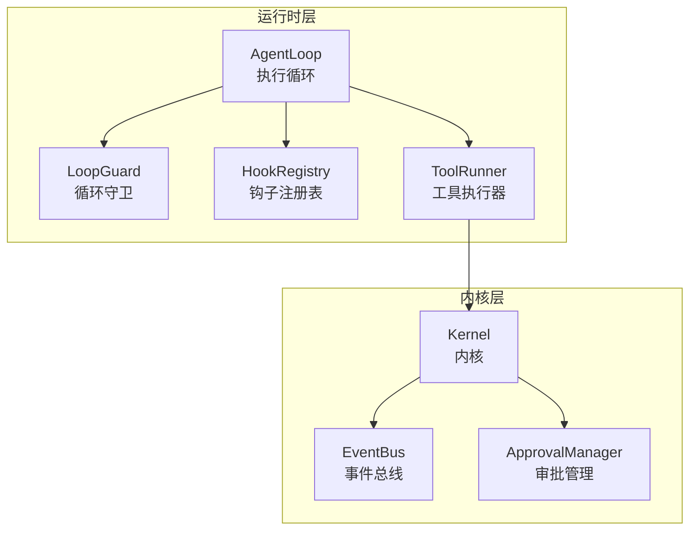
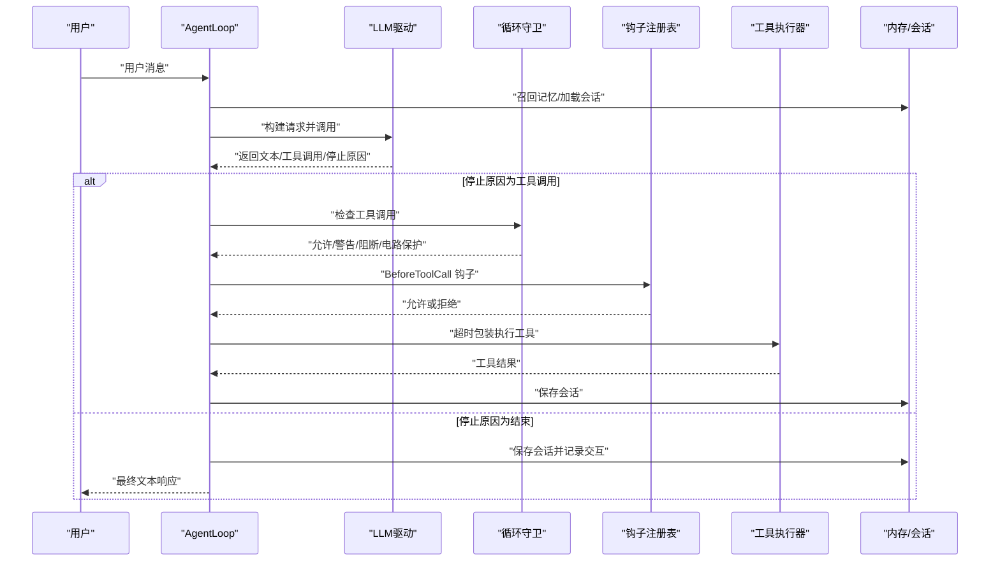
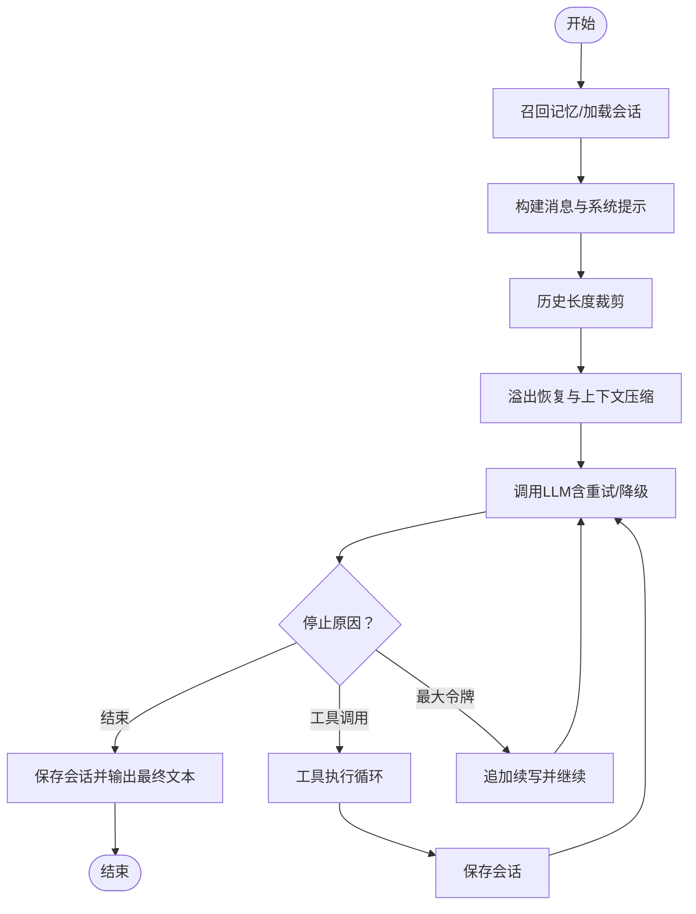
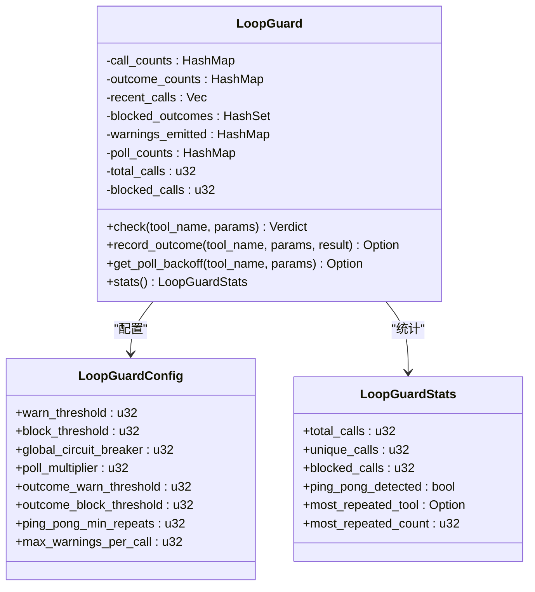
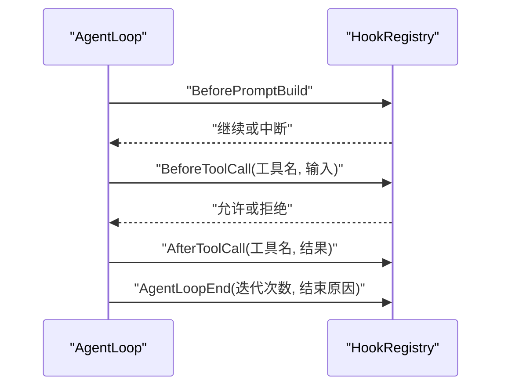
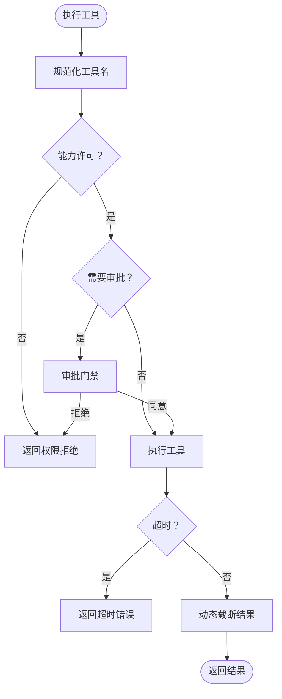
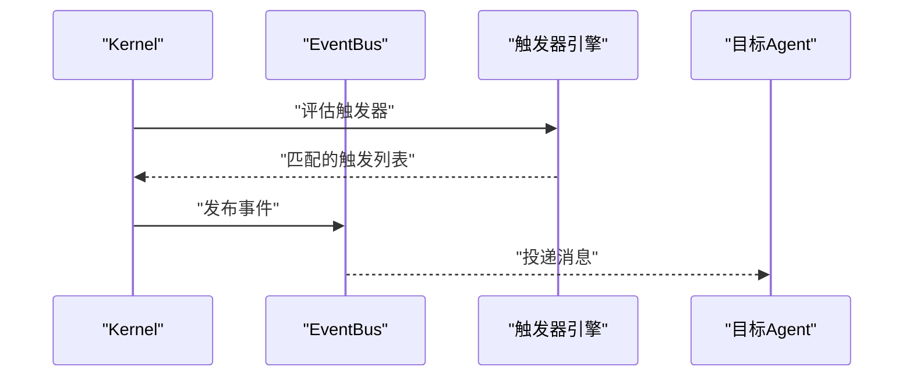
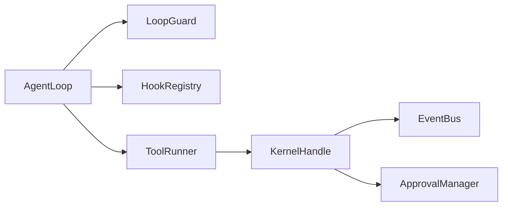

# 智能体执行循环

<cite>
**本文档引用的文件**
- [agent_loop.rs](file://crates/openfang-runtime/src/agent_loop.rs)
- [loop_guard.rs](file://crates/openfang-runtime/src/loop_guard.rs)
- [graceful_shutdown.rs](file://crates/openfang-runtime/src/graceful_shutdown.rs)
- [hooks.rs](file://crates/openfang-runtime/src/hooks.rs)
- [tool_runner.rs](file://crates/openfang-runtime/src/tool_runner.rs)
- [kernel.rs](file://crates/openfang-kernel/src/kernel.rs)
- [event_bus.rs](file://crates/openfang-kernel/src/event_bus.rs)
- [approval.rs](file://crates/openfang-kernel/src/approval.rs)
</cite>

## 目录
1. [引言](#引言)
2. [项目结构](#项目结构)
3. [核心组件](#核心组件)
4. [架构总览](#架构总览)
5. [详细组件分析](#详细组件分析)
6. [依赖关系分析](#依赖关系分析)
7. [性能考虑](#性能考虑)
8. [故障排查指南](#故障排查指南)
9. [结论](#结论)

## 引言
本文件面向需要深入理解 OpenFang 智能体执行循环（AgentLoop）的开发者与运维人员，系统性阐述其事件驱动架构、消息处理流程、状态管理与生命周期控制，重点解析循环守卫机制如何防止无限循环与资源耗尽，以及优雅关闭流程的实现细节。文档同时覆盖与内核模块的交互关系、调试技巧与性能优化建议，并通过图示帮助读者建立从代码到架构的整体认知。

## 项目结构
AgentLoop 相关的核心代码主要位于 openfang-runtime 子工程中，围绕以下关键模块组织：
- 执行循环：负责接收用户消息、调用 LLM、执行工具、保存会话与结果输出
- 循环守卫：检测重复/循环调用、阻断无效工具调用、触发全局电路保护
- 钩子系统：在关键节点注入观察与扩展点（如 BeforeToolCall、AfterToolCall、AgentLoopEnd）
- 工具执行器：统一调度与安全策略（能力许可、审批、沙箱、超时等）
- 内核集成：事件总线、触发器、审批管理、内存与会话管理等

**图表来源**
- [agent_loop.rs](file://crates/openfang-runtime/src/agent_loop.rs)
- [loop_guard.rs](file://crates/openfang-runtime/src/loop_guard.rs)
- [hooks.rs](file://crates/openfang-runtime/src/hooks.rs)
- [tool_runner.rs](file://crates/openfang-runtime/src/tool_runner.rs)
- [kernel.rs](file://crates/openfang-kernel/src/kernel.rs)
- [event_bus.rs](file://crates/openfang-kernel/src/event_bus.rs)
- [approval.rs](file://crates/openfang-kernel/src/approval.rs)

**章节来源**
- [agent_loop.rs](file://crates/openfang-runtime/src/agent_loop.rs)
- [kernel.rs](file://crates/openfang-kernel/src/kernel.rs)

## 核心组件
- AgentLoop：事件驱动的主循环，处理 LLM 推理、工具调用、上下文压缩、会话持久化与结果输出；支持同步与流式两种模式
- LoopGuard：基于哈希计数与结果哈希的循环检测器，具备“警告-阻断-电路保护”三级响应，防止无限循环与资源耗尽
- HookRegistry：在 BeforeToolCall、AfterToolCall、BeforePromptBuild、AgentLoopEnd 等关键节点注入回调
- ToolRunner：统一的工具执行入口，负责能力许可、审批门禁、沙箱与超时控制
- Kernel：内核协调者，提供事件总线、触发器、审批管理、内存与会话管理等基础设施

**章节来源**
- [agent_loop.rs](file://crates/openfang-runtime/src/agent_loop.rs)
- [loop_guard.rs](file://crates/openfang-runtime/src/loop_guard.rs)
- [hooks.rs](file://crates/openfang-runtime/src/hooks.rs)
- [tool_runner.rs](file://crates/openfang-runtime/src/tool_runner.rs)
- [kernel.rs](file://crates/openfang-kernel/src/kernel.rs)

## 架构总览
AgentLoop 采用事件驱动与状态机结合的方式：
- 生命周期阶段：Thinking（推理）、ToolUse（工具执行）、Streaming（流式）、Done（完成）、Error（错误）
- 消息处理：接收用户消息 → 召回记忆 → 构建提示 → 调用 LLM → 解析停止原因（结束/工具调用/最大令牌）
- 工具执行：循环守卫检查 → 钩子拦截 → 审批门禁 → 超时包装 → 结果动态截断 → 注入指导信息
- 上下文管理：历史长度裁剪、溢出恢复、动态结果截断、会话持久化
- 优雅关闭：有序关闭阶段、广播通知、等待在途任务、清理资源

**图表来源**
- [agent_loop.rs](file://crates/openfang-runtime/src/agent_loop.rs)
- [loop_guard.rs](file://crates/openfang-runtime/src/loop_guard.rs)
- [hooks.rs](file://crates/openfang-runtime/src/hooks.rs)
- [tool_runner.rs](file://crates/openfang-runtime/src/tool_runner.rs)

## 详细组件分析

### AgentLoop 执行循环
- 同步与流式双路径：分别对应 run_agent_loop 与 run_agent_loop_streaming，共享核心逻辑但流式路径额外推送工具执行结果预览
- 迭代上限与令牌限制：通过 MAX_ITERATIONS 与 MAX_CONTINUATIONS 防止无限循环与长文本续写导致的资源占用
- 上下文溢出防护：recover_from_overflow 与 apply_context_guard 在每次迭代前进行溢出恢复与结果压缩
- 空响应保护：对 LLM 返回空文本且无工具调用的情况注入引导文本，避免静默失败
- 会话持久化：在关键节点（工具执行后、最大续写、最大迭代）保存会话，降低崩溃风险
- 钩子触发：在提示构建前、工具调用前后、循环结束时触发相应钩子

**图表来源**
- [agent_loop.rs](file://crates/openfang-runtime/src/agent_loop.rs)

**章节来源**
- [agent_loop.rs](file://crates/openfang-runtime/src/agent_loop.rs)

### 循环守卫（LoopGuard）
- 核心目标：检测并阻止智能体陷入工具调用循环，防止无限循环与资源耗尽
- 关键机制：
  - 全局电路保护：累计工具调用次数超过阈值直接电路保护
  - 哈希计数：对 (工具名, 参数序列化) 计算 SHA-256，统计重复次数
  - 结果感知：对 (调用哈希 + 结果截断) 计算哈希，识别“相同参数+相同结果”的无效循环
  - Ping-pong 检测：追踪最近 N 次调用，检测 A-B-A-B 或 A-B-C-A-B-C 的交替模式
  - 放宽策略：对预期轮询类工具（如 shell_exec 状态检查）使用乘数放宽阈值
  - 警告桶：同一调用发出多次警告后自动升级为阻断
- 输出：Allow/Warn/Block/CircuitBreak 四种裁决，配合统计快照用于调试

**图表来源**
- [loop_guard.rs](file://crates/openfang-runtime/src/loop_guard.rs)

**章节来源**
- [loop_guard.rs](file://crates/openfang-runtime/src/loop_guard.rs)

### 钩子系统（Hooks）
- 观察点：BeforePromptBuild、BeforeToolCall、AfterToolCall、AgentLoopEnd
- 行为：BeforeToolCall 可以拒绝工具调用（返回 Err），其他事件为只读观察
- 使用场景：审计日志、策略拦截、指标上报、调试增强

**图表来源**
- [hooks.rs](file://crates/openfang-runtime/src/hooks.rs)
- [agent_loop.rs](file://crates/openfang-runtime/src/agent_loop.rs)

**章节来源**
- [hooks.rs](file://crates/openfang-runtime/src/hooks.rs)
- [agent_loop.rs](file://crates/openfang-runtime/src/agent_loop.rs)

### 工具执行器（ToolRunner）
- 能力许可：根据 agent 的 allowed_tools 列表拒绝未授权工具
- 审批门禁：通过 KernelHandle 查询是否需要人工审批，必要时阻断并返回明确错误
- 超时控制：对每个工具调用设置固定超时（默认 120 秒），超时即返回错误
- 动态截断：根据上下文预算对工具结果进行动态截断，避免上下文溢出
- 任务深度：限制跨智能体调用的最大深度，防止递归陷阱

**图表来源**
- [tool_runner.rs](file://crates/openfang-runtime/src/tool_runner.rs)
- [agent_loop.rs](file://crates/openfang-runtime/src/agent_loop.rs)

**章节来源**
- [tool_runner.rs](file://crates/openfang-runtime/src/tool_runner.rs)
- [agent_loop.rs](file://crates/openfang-runtime/src/agent_loop.rs)

### 与内核模块的交互
- 事件总线与触发器：Kernel.publish_event 评估触发器并分发消息给订阅的 Agent
- 审批管理：Kernel.approval_manager 提供审批请求提交与等待，支持并发上限与超时
- 内存与会话：Kernel.memory 提供向量化检索与会话持久化接口
- 运行时集成：Kernel 将 AgentLoop、LLM 驱动、工具执行器、钩子注册表等整合为统一服务

**图表来源**
- [kernel.rs](file://crates/openfang-kernel/src/kernel.rs)
- [event_bus.rs](file://crates/openfang-kernel/src/event_bus.rs)

**章节来源**
- [kernel.rs](file://crates/openfang-kernel/src/kernel.rs)
- [event_bus.rs](file://crates/openfang-kernel/src/event_bus.rs)
- [approval.rs](file://crates/openfang-kernel/src/approval.rs)

## 依赖关系分析
- AgentLoop 依赖 LoopGuard 进行循环检测，依赖 HookRegistry 注入扩展点，依赖 ToolRunner 执行工具，依赖 KernelHandle 与审批系统协作
- ToolRunner 依赖 KernelHandle 获取审批与跨智能体通信能力，依赖 WebToolsContext、浏览器管理器、媒体引擎等外部能力
- Kernel 作为协调者，聚合 EventBus、触发器、审批管理、内存与会话管理等子系统

**图表来源**
- [agent_loop.rs](file://crates/openfang-runtime/src/agent_loop.rs)
- [loop_guard.rs](file://crates/openfang-runtime/src/loop_guard.rs)
- [hooks.rs](file://crates/openfang-runtime/src/hooks.rs)
- [tool_runner.rs](file://crates/openfang-runtime/src/tool_runner.rs)
- [kernel.rs](file://crates/openfang-kernel/src/kernel.rs)

**章节来源**
- [agent_loop.rs](file://crates/openfang-runtime/src/agent_loop.rs)
- [tool_runner.rs](file://crates/openfang-runtime/src/tool_runner.rs)
- [kernel.rs](file://crates/openfang-kernel/src/kernel.rs)

## 性能考虑
- 上下文预算与动态截断：通过 ContextBudget 与 truncate_tool_result_dynamic 控制单次工具结果大小，避免上下文暴涨
- 历史长度裁剪：MAX_HISTORY_MESSAGES 限制消息数量，减少计算与存储压力
- 溢出恢复：recover_from_overflow 在严重溢出时进行阶段性恢复，避免崩溃
- 流式输出：run_agent_loop_streaming 在工具执行期间不流式传输，仅在工具完成后发送结果预览，平衡实时性与开销
- 超时控制：统一的 TOOL_TIMEOUT_SECS 限制单次工具执行时间，防止长时间阻塞
- 重试与退避：call_with_retry/stream_with_retry 使用指数退避与分类错误处理，提升鲁棒性

[本节为通用性能讨论，无需特定文件引用]

## 故障排查指南
- 无限循环/卡死
  - 现象：工具反复调用相同参数，CPU 占用高
  - 排查：查看 LoopGuard 统计（most_repeated_tool、ping_pong_detected），确认是否触发 CircuitBreak
  - 处置：调整阈值、放宽轮询工具策略、引入外部条件退出
  - 参考：[循环守卫实现](file://crates/openfang-runtime/src/loop_guard.rs)
- 工具执行超时
  - 现象：工具执行超过 120 秒返回错误
  - 排查：检查工具类型（如浏览器自动化、长任务）、网络状况、资源限制
  - 处置：增加超时、优化工具实现、使用异步轮询替代阻塞调用
  - 参考：[工具执行器](file://crates/openfang-runtime/src/tool_runner.rs)
- 空响应与静默失败
  - 现象：LLM 返回空文本且无工具调用
  - 排查：检查输入令牌为 0 的情况、模型过载、上下文过大
  - 处置：注入引导文本、压缩上下文、分段对话
  - 参考：[AgentLoop 空响应保护](file://crates/openfang-runtime/src/agent_loop.rs)
- 审批拒绝导致的循环
  - 现象：工具被拒绝后不断重试
  - 排查：核对审批策略、用户反馈与超时设置
  - 处置：启用自动审批或改进策略
  - 参考：[审批管理](file://crates/openfang-kernel/src/approval.rs)
- 优雅关闭异常
  - 现象：服务关闭时资源未释放或任务未终止
  - 排查：检查 ShutdownCoordinator 的阶段推进与超时判断
  - 处置：调整超时配置、确保钩子与资源清理顺序正确
  - 参考：[优雅关闭](file://crates/openfang-runtime/src/graceful_shutdown.rs)

**章节来源**
- [loop_guard.rs](file://crates/openfang-runtime/src/loop_guard.rs)
- [tool_runner.rs](file://crates/openfang-runtime/src/tool_runner.rs)
- [agent_loop.rs](file://crates/openfang-runtime/src/agent_loop.rs)
- [approval.rs](file://crates/openfang-kernel/src/approval.rs)
- [graceful_shutdown.rs](file://crates/openfang-runtime/src/graceful_shutdown.rs)

## 结论
AgentLoop 通过事件驱动与状态机相结合的方式，实现了稳定、可观测、可扩展的智能体执行框架。循环守卫与工具执行器共同保障了安全性与稳定性，钩子系统提供了强大的扩展能力，而与内核模块的紧密集成则使得事件驱动、审批与内存管理等能力得以统一调度。遵循本文档的调试与优化建议，可在生产环境中获得更可靠的执行体验。