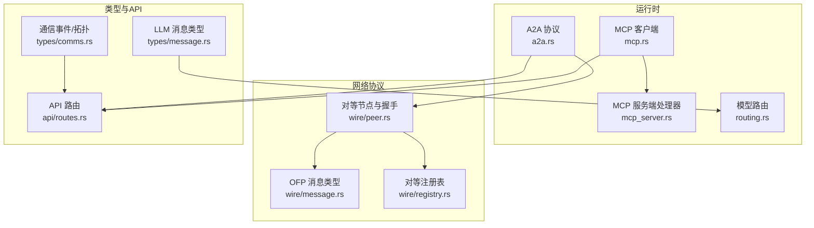
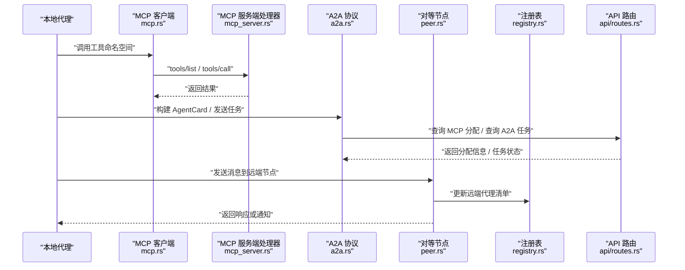
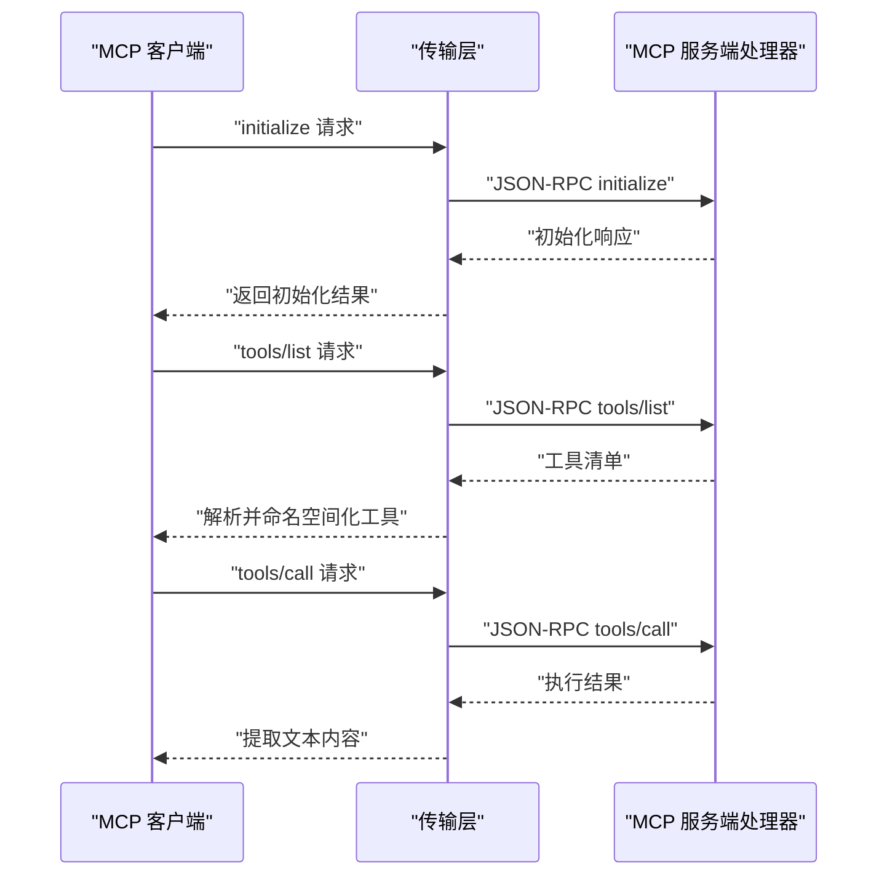
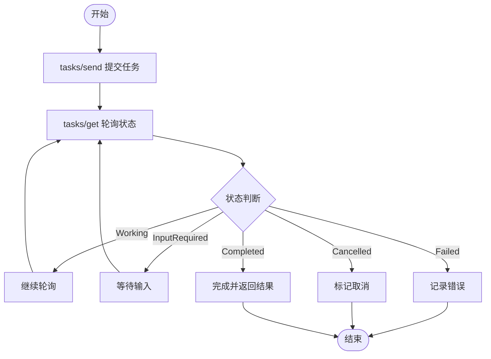
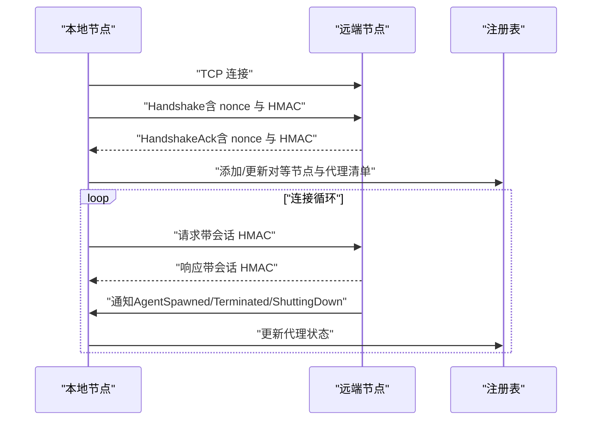
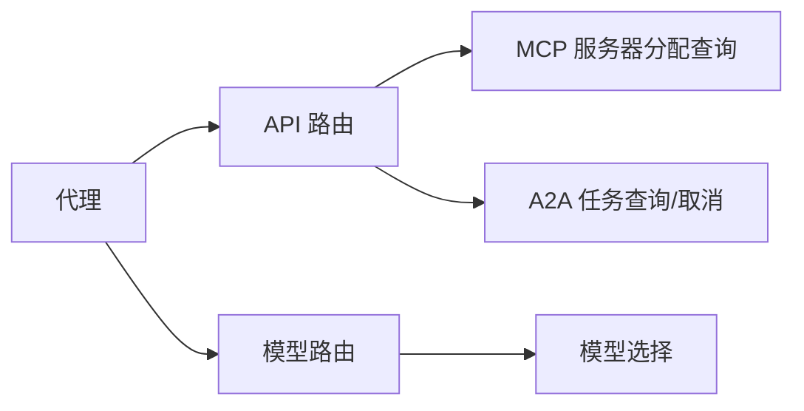
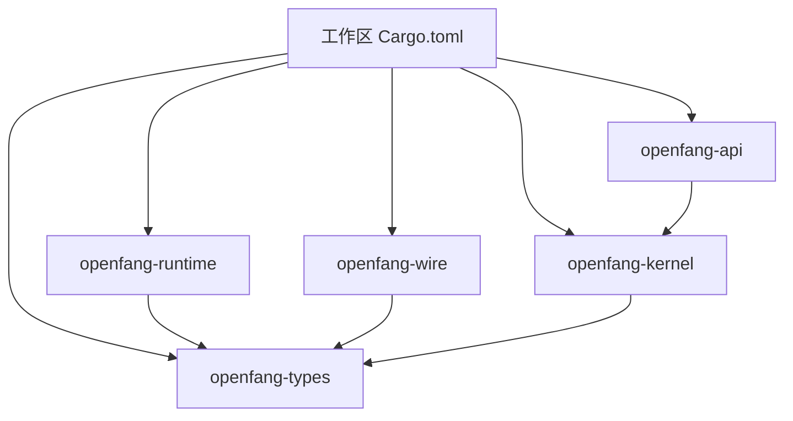

# 消息集成

<cite>
**本文引用的文件**
- [mcp.rs](file://crates/openfang-runtime/src/mcp.rs)
- [mcp_server.rs](file://crates/openfang-runtime/src/mcp_server.rs)
- [a2a.rs](file://crates/openfang-runtime/src/a2a.rs)
- [message.rs](file://crates/openfang-wire/src/message.rs)
- [peer.rs](file://crates/openfang-wire/src/peer.rs)
- [registry.rs](file://crates/openfang-wire/src/registry.rs)
- [comms.rs](file://crates/openfang-types/src/comms.rs)
- [message.rs](file://crates/openfang-types/src/message.rs)
- [Cargo.toml](file://Cargo.toml)
- [openfang.toml.example](file://openfang.toml.example)
- [routing.rs](file://crates/openfang-runtime/src/routing.rs)
</cite>

## 目录
1. [引言](#引言)
2. [项目结构](#项目结构)
3. [核心组件](#核心组件)
4. [架构总览](#架构总览)
5. [详细组件分析](#详细组件分析)
6. [依赖分析](#依赖分析)
7. [性能考虑](#性能考虑)
8. [故障排查指南](#故障排查指南)
9. [结论](#结论)
10. [附录](#附录)

## 引言
本技术文档聚焦于消息集成系统，围绕以下目标展开：
- MCP（Model Context Protocol）协议实现：消息格式、连接管理、握手与工具发现、调用流程与错误处理。
- A2A（Agent-to-Agent）通信机制：Agent 卡片、任务生命周期、任务存储、外部代理发现与交互。
- 跨节点消息传输：基于 TCP 的 OpenFang Wire 协议（OFP），包括握手、认证、请求/响应与通知。
- 与通道适配器的集成：通过路由与广播策略实现跨通道的消息分发。
- 网络优化与故障恢复：连接安全、重放防护、消息大小限制、会话密钥派生与超时控制。

## 项目结构
消息集成涉及多个子模块：
- 运行时（openfang-runtime）：MCP 客户端与服务端、A2A 协议、模型路由。
- 网络协议（openfang-wire）：OFP 消息类型、对等节点管理、注册表。
- 类型定义（openfang-types）：消息内容、通信事件、拓扑图等。
- API 层（openfang-api）：对外暴露 MCP 服务器分配查询与 A2A 任务查询接口。
- 配置示例（openfang.toml.example）：网络监听地址与共享密钥等。

**图表来源**
- [mcp.rs:1-788](file://crates/openfang-runtime/src/mcp.rs#L1-L788)
- [mcp_server.rs:1-187](file://crates/openfang-runtime/src/mcp_server.rs#L1-L187)
- [a2a.rs:1-755](file://crates/openfang-runtime/src/a2a.rs#L1-L755)
- [message.rs:1-293](file://crates/openfang-wire/src/message.rs#L1-L293)
- [peer.rs:1-800](file://crates/openfang-wire/src/peer.rs#L1-L800)
- [registry.rs:1-352](file://crates/openfang-wire/src/registry.rs#L1-L352)
- [comms.rs:1-171](file://crates/openfang-types/src/comms.rs#L1-L171)
- [message.rs:1-341](file://crates/openfang-types/src/message.rs#L1-L341)
- [routing.rs:1-376](file://crates/openfang-runtime/src/routing.rs#L1-L376)

**章节来源**
- [Cargo.toml:1-160](file://Cargo.toml#L1-L160)
- [openfang.toml.example:1-49](file://openfang.toml.example#L1-L49)

## 核心组件
- MCP 客户端与服务端
  - 客户端支持 stdio 与 HTTP+SSE 两种传输，完成握手、工具列表发现与工具调用。
  - 服务端处理器提供 initialize、tools/list、tools/call 等方法。
- A2A 协议
  - AgentCard 描述能力；A2A 任务结构化状态、消息与制品；内置任务存储与外部代理发现。
- OFP 对等节点
  - 基于 TCP 的消息编解码（长度前缀 + JSON）、HMAC 认证、握手与会话密钥派生、通知与请求/响应。
- 注册表
  - 维护已知对等节点及其代理清单，支持查询与更新。
- 类型与 API
  - LLM 消息与内容块、通信事件与拓扑、API 路由用于 MCP 分配查询与 A2A 任务查询。

**章节来源**
- [mcp.rs:1-788](file://crates/openfang-runtime/src/mcp.rs#L1-L788)
- [mcp_server.rs:1-187](file://crates/openfang-runtime/src/mcp_server.rs#L1-L187)
- [a2a.rs:1-755](file://crates/openfang-runtime/src/a2a.rs#L1-L755)
- [message.rs:1-293](file://crates/openfang-wire/src/message.rs#L1-L293)
- [peer.rs:1-800](file://crates/openfang-wire/src/peer.rs#L1-L800)
- [registry.rs:1-352](file://crates/openfang-wire/src/registry.rs#L1-L352)
- [comms.rs:1-171](file://crates/openfang-types/src/comms.rs#L1-L171)
- [message.rs:1-341](file://crates/openfang-types/src/message.rs#L1-L341)

## 架构总览
下图展示了 MCP、A2A 与 OFP 在系统中的协作关系，以及与 API 层的交互。

**图表来源**
- [mcp.rs:126-281](file://crates/openfang-runtime/src/mcp.rs#L126-L281)
- [mcp_server.rs:19-85](file://crates/openfang-runtime/src/mcp_server.rs#L19-L85)
- [a2a.rs:360-518](file://crates/openfang-runtime/src/a2a.rs#L360-L518)
- [peer.rs:176-458](file://crates/openfang-wire/src/peer.rs#L176-L458)
- [registry.rs:56-206](file://crates/openfang-wire/src/registry.rs#L56-L206)
- [openfang.toml.example:18-21](file://openfang.toml.example#L18-L21)

## 详细组件分析

### MCP（Model Context Protocol）
- 消息格式与握手
  - 使用 JSON-RPC 2.0，客户端支持 stdio 子进程与 HTTP+SSE 两种传输。
  - 握手阶段发送 initialize 并在收到后立即发送 notifications/initialized。
- 工具发现与调用
  - 通过 tools/list 获取工具清单，并以 mcp_{server}_{tool} 命名空间进行规范化。
  - tools/call 将原始工具名映射回服务器期望的名称（保留连字符等）。
- 错误处理
  - 对 JSON 反序列化失败、超时、HTTP 失败、SSRF 检查失败等情况进行统一错误封装。

**图表来源**
- [mcp.rs:126-281](file://crates/openfang-runtime/src/mcp.rs#L126-L281)
- [mcp_server.rs:19-85](file://crates/openfang-runtime/src/mcp_server.rs#L19-L85)

**章节来源**
- [mcp.rs:1-788](file://crates/openfang-runtime/src/mcp.rs#L1-L788)
- [mcp_server.rs:1-187](file://crates/openfang-runtime/src/mcp_server.rs#L1-L187)

### A2A（Agent-to-Agent）
- AgentCard 与技能描述
  - 从代理清单生成技能列表，描述工具使用能力。
- 任务生命周期与存储
  - 支持提交、工作、输入需求、完成、取消、失败等状态；内存任务存储带容量限制与 FIFO 淘汰。
- 外部代理发现与交互
  - 通过 HTTP 获取远端 Agent Card；tasks/send 与 tasks/get 实现任务流转。
- 任务状态包装
  - 兼容字符串与对象两种状态编码形式。

**图表来源**
- [a2a.rs:81-205](file://crates/openfang-runtime/src/a2a.rs#L81-L205)
- [a2a.rs:211-312](file://crates/openfang-runtime/src/a2a.rs#L211-L312)
- [a2a.rs:439-512](file://crates/openfang-runtime/src/a2a.rs#L439-L512)

**章节来源**
- [a2a.rs:1-755](file://crates/openfang-runtime/src/a2a.rs#L1-L755)

### OpenFang Wire 协议（OFP）
- 消息编解码
  - 4 字节大端长度前缀 + JSON；支持 Request/Response/Notification 三类消息。
- 握手与认证
  - 初始 Handshake 包含节点标识、协议版本、代理清单与 HMAC；后续连接循环采用会话密钥进行每消息认证。
- 连接管理
  - 接受与发起连接，维护对等节点注册表；支持通知（AgentSpawned/Terminated/ShuttingDown）。
- 安全与健壮性
  - 非法消息拒绝、版本不匹配、重放攻击防护（时间窗口非ces跟踪）、最大消息尺寸限制。

**图表来源**
- [peer.rs:176-458](file://crates/openfang-wire/src/peer.rs#L176-L458)
- [peer.rs:490-647](file://crates/openfang-wire/src/peer.rs#L490-L647)
- [message.rs:8-172](file://crates/openfang-wire/src/message.rs#L8-L172)
- [registry.rs:56-206](file://crates/openfang-wire/src/registry.rs#L56-L206)

**章节来源**
- [message.rs:1-293](file://crates/openfang-wire/src/message.rs#L1-L293)
- [peer.rs:1-800](file://crates/openfang-wire/src/peer.rs#L1-L800)
- [registry.rs:1-352](file://crates/openfang-wire/src/registry.rs#L1-L352)

### 与通道适配器的集成与路由
- MCP 服务器分配
  - API 提供查询某代理可使用的 MCP 服务器集合，支持“全部”或“白名单”模式。
- A2A 任务查询
  - API 提供查询任务状态与取消任务的接口，便于前端与 TUI 控制。
- 模型路由
  - 基于消息长度、工具数量、代码标记、对话深度与系统提示长度评分，自动选择简单/中等/复杂模型。

**图表来源**
- [openfang.toml.example:18-21](file://openfang.toml.example#L18-L21)
- [routing.rs:31-164](file://crates/openfang-runtime/src/routing.rs#L31-L164)

**章节来源**
- [routing.rs:1-376](file://crates/openfang-runtime/src/routing.rs#L1-L376)

## 依赖分析
- 工作区与依赖
  - 工作区包含 openfang-types、openfang-runtime、openfang-wire、openfang-api、openfang-kernel、openfang-cli、openfang-channels、openfang-skills、openfang-hands、openfang-extensions 等。
  - 关键依赖：tokio、serde、reqwest、dashmap、hmac、sha2、uuid、chrono 等。
- 模块耦合
  - openfang-runtime 依赖 openfang-types 的消息与工具类型；openfang-wire 依赖 openfang-types 的远程代理信息结构；API 路由依赖 openfang-kernel 的内核状态与任务存储。

**图表来源**
- [Cargo.toml:1-160](file://Cargo.toml#L1-L160)

**章节来源**
- [Cargo.toml:1-160](file://Cargo.toml#L1-L160)

## 性能考虑
- 消息大小与流控
  - OFP 单条消息最大 16 MB；超出将被拒绝。
- 认证与握手成本
  - HMAC 计算与会话密钥派生带来额外 CPU 开销，建议在长连接上复用会话密钥。
- 任务存储与内存占用
  - A2A 任务存储采用有界内存，完成/失败/取消的任务优先淘汰，避免内存膨胀。
- 模型路由评分
  - 评分综合考虑字符数、工具数量、代码标记、对话深度与系统提示长度，避免不必要的高成本模型调用。

**章节来源**
- [peer.rs:107-108](file://crates/openfang-wire/src/peer.rs#L107-L108)
- [a2a.rs:211-312](file://crates/openfang-runtime/src/a2a.rs#L211-L312)
- [routing.rs:31-164](file://crates/openfang-runtime/src/routing.rs#L31-L164)

## 故障排查指南
- MCP 连接问题
  - 检查命令路径与环境变量白名单（stdio 传输）；确认 SSE URL 不指向元数据端点（SSRF 检查）。
  - 查看 stderr 日志以定位外部 MCP 服务器启动与运行问题。
- OFP 握手失败
  - 核对 shared_secret 是否配置；检查 nonce 重放（时间窗口）与 HMAC 验证失败原因。
  - 确认协议版本一致，避免版本不匹配导致握手失败。
- A2A 任务异常
  - 使用 API 查询任务状态与取消任务；检查任务存储是否因容量限制被提前淘汰。
- 网络与超时
  - 若远端节点不可达，检查监听地址与防火墙；合理设置超时参数以避免长时间阻塞。

**章节来源**
- [mcp.rs:515-531](file://crates/openfang-runtime/src/mcp.rs#L515-L531)
- [peer.rs:183-188](file://crates/openfang-wire/src/peer.rs#L183-L188)
- [peer.rs:276-291](file://crates/openfang-wire/src/peer.rs#L276-L291)
- [a2a.rs:631-706](file://crates/openfang-runtime/src/a2a.rs#L631-L706)

## 结论
本消息集成系统通过 MCP、A2A 与 OFP 三大支柱实现了：
- 与外部工具生态（MCP 服务器）的无缝对接；
- 跨框架代理互操作（A2A）与任务编排；
- 安全可靠的跨节点消息传输（OFP）。
配合 API 层的 MCP 分配查询与 A2A 任务查询，以及模型路由与任务存储的优化，系统在功能完整性与运行稳定性之间取得良好平衡。建议在生产环境中严格配置 shared_secret、合理设置超时与消息大小上限，并结合监控与日志持续优化性能与可用性。

## 附录
- 配置参考
  - 网络监听与共享密钥：见 [openfang.toml.example:18-21](file://openfang.toml.example#L18-L21)。
- API 端点
  - MCP 服务器分配查询与 A2A 任务查询/取消端点参见 [API 路由:6354-6395](file://crates/openfang-api/src/routes.rs#L6354-L6395) 与 [API 路由:7063-7111](file://crates/openfang-api/src/routes.rs#L7063-L7111)。