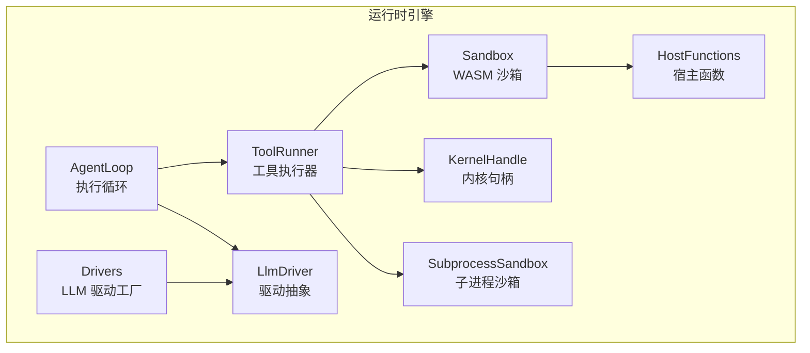
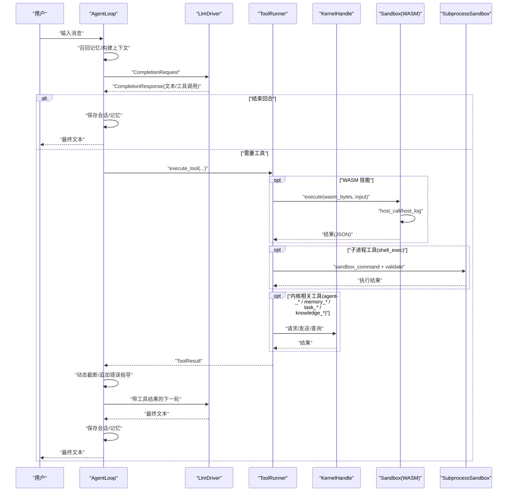
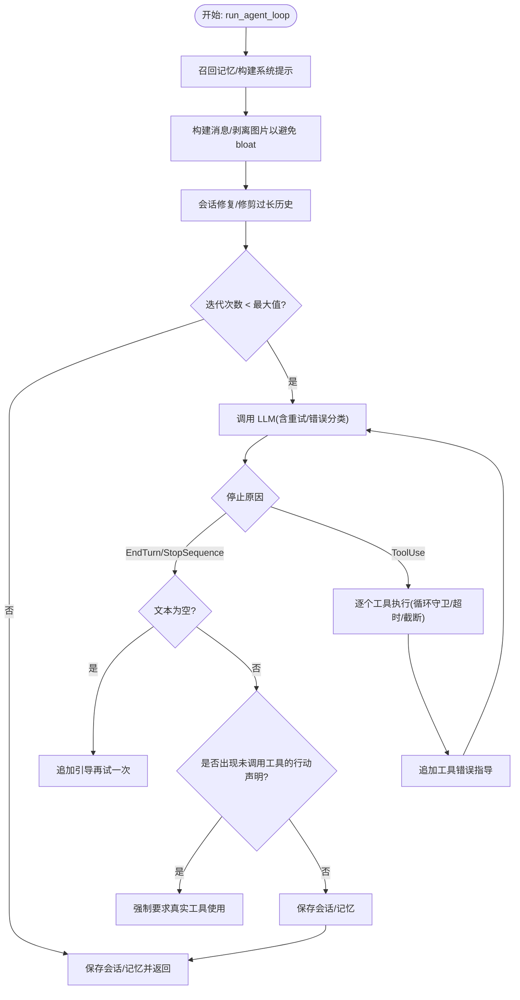
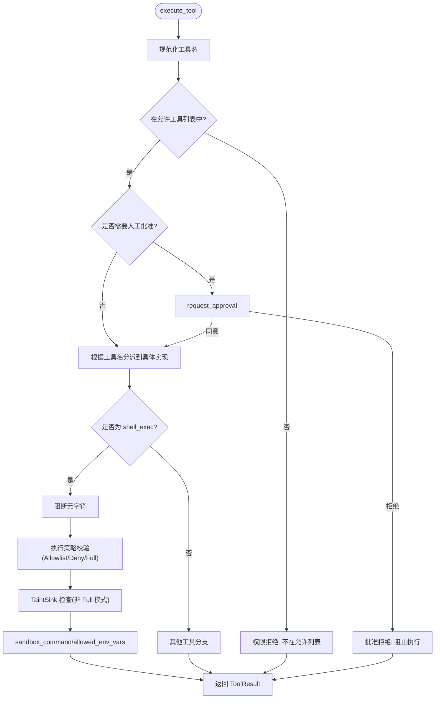
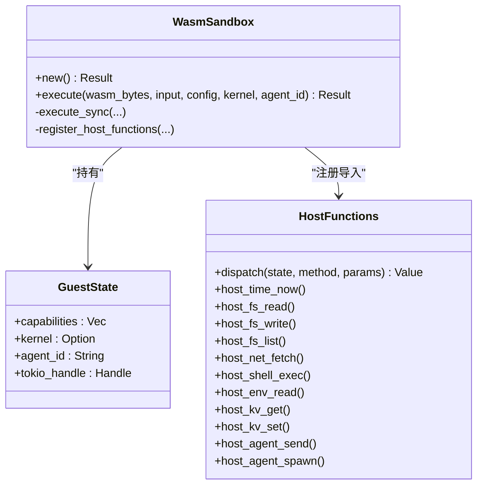
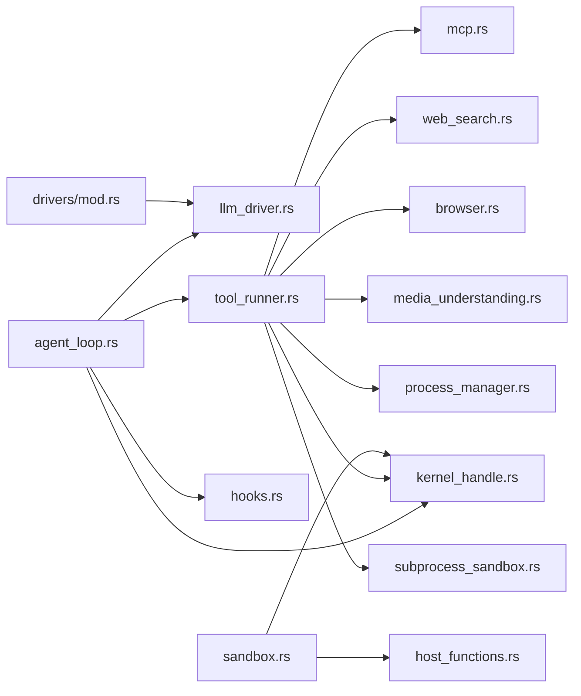

# 运行时引擎 (openfang-runtime)

<cite>
**本文引用的文件**
- [lib.rs](file://crates/openfang-runtime/src/lib.rs)
- [agent_loop.rs](file://crates/openfang-runtime/src/agent_loop.rs)
- [tool_runner.rs](file://crates/openfang-runtime/src/tool_runner.rs)
- [sandbox.rs](file://crates/openfang-runtime/src/sandbox.rs)
- [host_functions.rs](file://crates/openfang-runtime/src/host_functions.rs)
- [drivers/mod.rs](file://crates/openfang-runtime/src/drivers/mod.rs)
- [llm_driver.rs](file://crates/openfang-runtime/src/llm_driver.rs)
- [kernel_handle.rs](file://crates/openfang-runtime/src/kernel_handle.rs)
- [subprocess_sandbox.rs](file://crates/openfang-runtime/src/subprocess_sandbox.rs)
- [Cargo.toml](file://crates/openfang-runtime/Cargo.toml)
</cite>

## 目录
1. [简介](#简介)
2. [项目结构](#项目结构)
3. [核心组件](#核心组件)
4. [架构总览](#架构总览)
5. [详细组件分析](#详细组件分析)
6. [依赖分析](#依赖分析)
7. [性能考虑](#性能考虑)
8. [故障排查指南](#故障排查指南)
9. [结论](#结论)
10. [附录](#附录)

## 简介
本文件面向 OpenFang 运行时引擎（openfang-runtime），系统性阐述以下主题：
- 智能体执行循环（AgentLoop）的事件驱动架构与控制流
- WASM 沙箱的安全隔离原理与能力控制
- 工具系统（ToolRunner）的动态加载与调用策略
- 与内核（KernelHandle）及 API 模块的集成关系
- 调试技巧与性能监控方法

目标是帮助开发者快速理解并扩展运行时能力，包括创建自定义工具、配置 LLM 驱动、实现宿主函数等。

## 项目结构
openfang-runtime 是运行时与执行环境的核心模块，负责：
- 执行智能体循环：接收用户消息、召回记忆、调用 LLM、执行工具、保存会话
- 抽象 LLM 驱动：统一多提供商接口，支持流式与非流式响应
- 工具执行：内置文件系统、网络、Shell、跨智能体协作等工具
- 安全隔离：WASM 沙箱与子进程沙箱，能力控制与资源限制
- 内核交互：通过 KernelHandle 提供跨智能体通信与共享内存等能力

图表来源
- [lib.rs:10-59](file://crates/openfang-runtime/src/lib.rs#L10-L59)
- [agent_loop.rs:145-167](file://crates/openfang-runtime/src/agent_loop.rs#L145-L167)
- [tool_runner.rs:99-117](file://crates/openfang-runtime/src/tool_runner.rs#L99-L117)
- [sandbox.rs:98-143](file://crates/openfang-runtime/src/sandbox.rs#L98-L143)
- [host_functions.rs:16-49](file://crates/openfang-runtime/src/host_functions.rs#L16-L49)
- [drivers/mod.rs:257-456](file://crates/openfang-runtime/src/drivers/mod.rs#L257-L456)
- [llm_driver.rs:146-171](file://crates/openfang-runtime/src/llm_driver.rs#L146-L171)
- [kernel_handle.rs:26-255](file://crates/openfang-runtime/src/kernel_handle.rs#L26-L255)
- [subprocess_sandbox.rs:30-64](file://crates/openfang-runtime/src/subprocess_sandbox.rs#L30-L64)

章节来源
- [lib.rs:10-59](file://crates/openfang-runtime/src/lib.rs#L10-L59)
- [Cargo.toml:8-32](file://crates/openfang-runtime/Cargo.toml#L8-L32)

## 核心组件
- AgentLoop：事件驱动的执行循环，负责构建提示词、调用 LLM、解析工具调用、执行工具、上下文预算与溢出恢复、阶段回调与钩子触发。
- ToolRunner：工具分发器，执行内置工具、MCP 工具、技能包工具；执行前进行能力检查、批准门禁、超时与截断；对 Shell 命令进行元字符与策略校验。
- Sandbox：基于 Wasmtime 的 WASM 沙箱，deny-by-default 能力模型，host_call/host_log 宿主函数桥接，燃料与时间片中断。
- HostFunctions：WASM 客户端可调用的宿主函数集合，按能力授权，路径穿越防护、SSRF 检测、命令执行沙箱化。
- Drivers/LlmDriver：LLM 驱动抽象与工厂，统一多提供商接口，支持流式事件与错误分类。
- KernelHandle：内核操作抽象，用于跨智能体通信、任务队列、共享内存、知识图谱、手（Hand）系统等。
- SubprocessSandbox：子进程环境沙箱，清理继承环境变量、仅允许白名单变量、可选允许列表、可执行路径校验、命令元字符阻断、执行策略校验。

章节来源
- [agent_loop.rs:145-167](file://crates/openfang-runtime/src/agent_loop.rs#L145-L167)
- [tool_runner.rs:99-117](file://crates/openfang-runtime/src/tool_runner.rs#L99-L117)
- [sandbox.rs:98-143](file://crates/openfang-runtime/src/sandbox.rs#L98-L143)
- [host_functions.rs:16-49](file://crates/openfang-runtime/src/host_functions.rs#L16-L49)
- [drivers/mod.rs:257-456](file://crates/openfang-runtime/src/drivers/mod.rs#L257-L456)
- [llm_driver.rs:146-171](file://crates/openfang-runtime/src/llm_driver.rs#L146-L171)
- [kernel_handle.rs:26-255](file://crates/openfang-runtime/src/kernel_handle.rs#L26-L255)
- [subprocess_sandbox.rs:30-64](file://crates/openfang-runtime/src/subprocess_sandbox.rs#L30-L64)

## 架构总览
下图展示了 AgentLoop 与 ToolRunner 的主要交互，以及与 LLM 驱动、内核、沙箱、子进程沙箱的关系。

图表来源
- [agent_loop.rs:145-605](file://crates/openfang-runtime/src/agent_loop.rs#L145-L605)
- [tool_runner.rs:99-526](file://crates/openfang-runtime/src/tool_runner.rs#L99-L526)
- [sandbox.rs:117-275](file://crates/openfang-runtime/src/sandbox.rs#L117-L275)
- [subprocess_sandbox.rs:30-64](file://crates/openfang-runtime/src/subprocess_sandbox.rs#L30-L64)
- [kernel_handle.rs:26-255](file://crates/openfang-runtime/src/kernel_handle.rs#L26-L255)

## 详细组件分析

### AgentLoop 组件分析
- 事件驱动与阶段回调：通过 LoopPhase 与 PhaseCallback 实现 Thinking/ToolUse/Streaming/Done/Error 等阶段通知，便于前端或上层系统更新 UI。
- 上下文管理：向量化记忆召回、会话修复与修剪、上下文预算与动态截断、历史消息上限保护。
- LLM 调用：支持文本工具调用恢复、空响应保护、幻觉动作检测（phantom_action）、重试与指数退避。
- 工具执行：循环守卫（LoopGuard）防止无限/高风险工具调用；超时包装；钩子（BeforeToolCall/AfterToolCall/AgentLoopEnd）贯穿执行周期。
- 结果输出：NO_REPLY/silent 处理、回复指令解析、成本统计占位。

图表来源
- [agent_loop.rs:145-605](file://crates/openfang-runtime/src/agent_loop.rs#L145-L605)

章节来源
- [agent_loop.rs:105-138](file://crates/openfang-runtime/src/agent_loop.rs#L105-L138)
- [agent_loop.rs:347-390](file://crates/openfang-runtime/src/agent_loop.rs#L347-L390)
- [agent_loop.rs:420-513](file://crates/openfang-runtime/src/agent_loop.rs#L420-L513)
- [agent_loop.rs:606-786](file://crates/openfang-runtime/src/agent_loop.rs#L606-L786)

### ToolRunner 组件分析
- 工具分发：内置工具（文件系统、Web、Shell、跨智能体、共享内存、协作、调度、知识图谱、媒体理解、图像生成、TTS/STT、Docker、位置、系统时间、Cron、通道发送、持久进程、Hand、A2A 出站、浏览器自动化等）；MCP 工具；技能包工具。
- 安全与合规：能力列表强制、批准门禁（requires_approval/request_approval）、任务本地深度限制、TaintSink 检测（Shell 元字符注入、URL 中敏感参数）。
- 执行策略：Shell 元字符阻断、执行策略（Deny/Full/Allowlist）校验、环境变量白名单注入、超时与动态截断。
- 错误处理：未知工具/失败 MCP/失败技能的统一错误封装。

图表来源
- [tool_runner.rs:99-117](file://crates/openfang-runtime/src/tool_runner.rs#L99-L117)
- [tool_runner.rs:174-526](file://crates/openfang-runtime/src/tool_runner.rs#L174-L526)
- [subprocess_sandbox.rs:96-241](file://crates/openfang-runtime/src/subprocess_sandbox.rs#L96-L241)
- [host_functions.rs:55-67](file://crates/openfang-runtime/src/host_functions.rs#L55-L67)

章节来源
- [tool_runner.rs:17-18](file://crates/openfang-runtime/src/tool_runner.rs#L17-L18)
- [tool_runner.rs:122-134](file://crates/openfang-runtime/src/tool_runner.rs#L122-L134)
- [tool_runner.rs:136-171](file://crates/openfang-runtime/src/tool_runner.rs#L136-L171)
- [tool_runner.rs:213-266](file://crates/openfang-runtime/src/tool_runner.rs#L213-L266)
- [tool_runner.rs:451-512](file://crates/openfang-runtime/src/tool_runner.rs#L451-L512)

### Sandbox/WASM 安全隔离分析
- ABI 约定：guest 必须导出 memory/alloc/execute；host 提供 openfang.host_call/openfang.host_log。
- 能力模型：GuestState 持有授予的能力列表，每次 host_call 前进行匹配检查；默认 deny-by-default。
- 资源限制：启用 fuel 计量与 epoch 中断（墙钟超时），超时后抛出中断异常；可配置 fuel_limit 与 timeout_secs。
- 宿主函数：time_now 无能力检查；fs_*、net_fetch、shell_exec、env_read、kv_*、agent_* 等均需相应能力；路径解析与 SSRF 检测强化安全。
- 错误类型：编译/实例化/执行失败、燃料耗尽、ABI 违规、epoch 中断（超时）。

图表来源
- [sandbox.rs:98-143](file://crates/openfang-runtime/src/sandbox.rs#L98-L143)
- [sandbox.rs:146-275](file://crates/openfang-runtime/src/sandbox.rs#L146-L275)
- [host_functions.rs:16-49](file://crates/openfang-runtime/src/host_functions.rs#L16-L49)

章节来源
- [sandbox.rs:33-56](file://crates/openfang-runtime/src/sandbox.rs#L33-L56)
- [sandbox.rs:117-143](file://crates/openfang-runtime/src/sandbox.rs#L117-L143)
- [sandbox.rs:277-387](file://crates/openfang-runtime/src/sandbox.rs#L277-L387)
- [host_functions.rs:55-67](file://crates/openfang-runtime/src/host_functions.rs#L55-L67)

### 子进程沙箱与 Shell 安全
- 环境变量清理：仅保留 PATH/HOME/TMPDIR/LANG/TERM 等安全变量，Windows 平台额外允许系统目录变量；可选择性放行 caller 指定变量。
- 可执行路径校验：拒绝包含父目录组件的路径，防止逃逸工作目录。
- Shell 元字符阻断：回溯/命令替换、$()/${}、管道/分号/逻辑与/重定向、花括号展开、换行/空字节等。
- 执行策略：Deny（禁用）、Full（不限制）、Allowlist（白名单 + safe_bins）。Allowlist 模式下仍先阻断元字符，再提取命令基名进行白名单校验。
- 进程树管理：优雅终止（SIGTERM/taskkill）→ 等待 → 强制终止（SIGKILL/taskkill /F），支持绝对超时与“无输出”空闲超时。

章节来源
- [subprocess_sandbox.rs:30-64](file://crates/openfang-runtime/src/subprocess_sandbox.rs#L30-L64)
- [subprocess_sandbox.rs:66-82](file://crates/openfang-runtime/src/subprocess_sandbox.rs#L66-L82)
- [subprocess_sandbox.rs:96-149](file://crates/openfang-runtime/src/subprocess_sandbox.rs#L96-L149)
- [subprocess_sandbox.rs:203-241](file://crates/openfang-runtime/src/subprocess_sandbox.rs#L203-L241)
- [subprocess_sandbox.rs:261-426](file://crates/openfang-runtime/src/subprocess_sandbox.rs#L261-L426)

### LLM 驱动与多提供商适配
- 抽象与工厂：LlmDriver trait 提供 complete/stream；drivers/mod.rs 的 create_driver 支持 Anthropic、Gemini、OpenAI、Groq、OpenRouter、DeepSeek、Together、Mistral、Fireworks、Ollama、vLLM、LM Studio、Perplexity、Cohere、AI21、Cerebras、SambaNova、HuggingFace、xAI、Replicate、GitHub Copilot、Moonshot、Qwen、Minimax、智谱、Zhipu、ZAI、Kimi Coding、千帆、火山引擎、Chutes、Venice、NVIDIA、Codex、Claude Code、Qwen Code、Azure OpenAI 等。
- 错误分类：HTTP/API/速率限制/解析/鉴权/模型不存在/过载/缺少密钥等，便于统一重试与降级。
- 流式事件：TextDelta/ToolUseStart/InputDelta/ToolUseEnd/ContentComplete/PhaseChange/ToolExecutionResult。

章节来源
- [llm_driver.rs:11-49](file://crates/openfang-runtime/src/llm_driver.rs#L11-L49)
- [llm_driver.rs:51-107](file://crates/openfang-runtime/src/llm_driver.rs#L51-L107)
- [llm_driver.rs:110-143](file://crates/openfang-runtime/src/llm_driver.rs#L110-L143)
- [llm_driver.rs:146-171](file://crates/openfang-runtime/src/llm_driver.rs#L146-L171)
- [drivers/mod.rs:257-456](file://crates/openfang-runtime/src/drivers/mod.rs#L257-L456)

### 内核交互与 KernelHandle
- 跨智能体能力：spawn_agent/send_to_agent/list_agents/kill_agent/find_agents/spawn_agent_checked。
- 共享内存：memory_store/memory_recall。
- 协作与任务：task_post/claim/complete/list。
- 知识图谱：knowledge_add_entity/add_relation/query。
- Cron：create/list/cancel。
- 手（Hand）：list/install/activate/status/deactivate。
- 通道发送：get_channel_default_recipient/send_channel_message/send_channel_media/send_channel_file_data。
- 审批与 A2A：requires_approval/request_approval、list_a2a_agents/get_a2a_agent_url。

章节来源
- [kernel_handle.rs:26-255](file://crates/openfang-runtime/src/kernel_handle.rs#L26-L255)

## 依赖分析
- 内部模块耦合
  - agent_loop 依赖 llm_driver、tool_runner、kernel_handle、hooks、browser、media、process_manager 等。
  - tool_runner 依赖 kernel_handle、mcp、web_search、browser、media、tts、docker_config、process_manager 等。
  - sandbox 依赖 host_functions、kernel_handle。
  - subprocess_sandbox 为工具执行提供子进程安全基线。
- 外部依赖
  - wasmtime：WASM 引擎与沙箱。
  - tokio/reqwest/serde/json：异步运行时、HTTP、序列化。
  - tracing/uuid/chrono/futures/base64 等：日志、标识、时间、流处理、编码。
  - dashmap/regex-lite/rusqlite 等：并发映射、正则、SQLite。

图表来源
- [agent_loop.rs:145-167](file://crates/openfang-runtime/src/agent_loop.rs#L145-L167)
- [tool_runner.rs:99-117](file://crates/openfang-runtime/src/tool_runner.rs#L99-L117)
- [sandbox.rs:98-143](file://crates/openfang-runtime/src/sandbox.rs#L98-L143)
- [drivers/mod.rs:257-456](file://crates/openfang-runtime/src/drivers/mod.rs#L257-L456)

章节来源
- [Cargo.toml:8-32](file://crates/openfang-runtime/Cargo.toml#L8-L32)

## 性能考虑
- 上下文预算与动态截断：在 LLM 调用前对工具结果进行动态截断，避免超出上下文窗口导致的失败与重试。
- 循环守卫：防止高风险/无限工具调用，减少无效重试与资源浪费。
- 超时与重试：工具执行与 LLM 调用采用超时与指数退避，降低尾延迟影响。
- WASM 燃料与时间片：通过 fuel 与 epoch 中断限制 CPU 使用与执行时间，避免恶意/失控模块。
- 子进程超时与空闲超时：绝对超时与“无输出”空闲超时结合，防止僵尸进程与资源泄漏。
- 日志与指标：利用 tracing 输出关键事件，结合外部监控系统采集令牌用量、迭代次数、阶段耗时等指标。

## 故障排查指南
- LLM 返回空文本
  - 触发条件：首次调用或 input_tokens=output_tokens=0 的静默失败。
  - 处理：自动追加引导消息重试一次；若仍为空，根据是否执行过工具给出不同提示。
  - 参考路径：[agent_loop.rs:456-478](file://crates/openfang-runtime/src/agent_loop.rs#L456-L478)
- 幻觉动作检测
  - 触发条件：声称完成某渠道动作但未调用对应工具。
  - 处理：强制要求真实工具使用，避免空转。
  - 参考路径：[agent_loop.rs:502-513](file://crates/openfang-runtime/src/agent_loop.rs#L502-L513)
- 工具执行超时
  - 触发条件：超过工具超时阈值（默认 120 秒）。
  - 处理：返回超时错误，避免阻塞循环。
  - 参考路径：[agent_loop.rs:713-753](file://crates/openfang-runtime/src/agent_loop.rs#L713-L753)
- Shell 元字符注入
  - 触发条件：命令包含反引号/$( )/${ }、管道、分号、重定向、花括号、换行/空字节等。
  - 处理：直接阻断，不进入执行策略校验。
  - 参考路径：[subprocess_sandbox.rs:96-149](file://crates/openfang-runtime/src/subprocess_sandbox.rs#L96-L149)
- 执行策略拒绝
  - 触发条件：Allowlist 模式下命令不在 safe_bins 或 allowed_commands。
  - 处理：返回拒绝原因，建议添加到白名单。
  - 参考路径：[subprocess_sandbox.rs:203-241](file://crates/openfang-runtime/src/subprocess_sandbox.rs#L203-L241)
- WASM 超时/燃料耗尽
  - 触发条件：epoch 中断或燃料耗尽。
  - 处理：捕获 Trap 并转换为对应错误类型。
  - 参考路径：[sandbox.rs:234-247](file://crates/openfang-runtime/src/sandbox.rs#L234-L247)
- MCP/技能执行失败
  - 触发条件：MCP 服务器不可达或技能执行异常。
  - 处理：统一错误封装，避免循环崩溃。
  - 参考路径：[tool_runner.rs:451-512](file://crates/openfang-runtime/src/tool_runner.rs#L451-L512)

## 结论
openfang-runtime 通过事件驱动的 AgentLoop、严格的工具执行与安全沙箱、灵活的 LLM 驱动适配，构建了稳定、可扩展且安全的智能体执行环境。其能力模型与资源限制确保在开放生态中可控运行，同时提供丰富的内核交互能力以支撑复杂协作场景。

## 附录
- 如何创建自定义工具
  - 在 ToolRunner 中新增分支，实现工具逻辑，并在 builtin_tool_definitions 中补充工具定义。
  - 若为子进程工具，务必通过 subprocess_sandbox 的 sandbox_command 与 validate_command_allowlist 进行安全加固。
  - 若为 MCP 工具，确保连接池中存在对应服务器名称。
  - 参考路径：
    - [tool_runner.rs:174-526](file://crates/openfang-runtime/src/tool_runner.rs#L174-L526)
    - [subprocess_sandbox.rs:30-64](file://crates/openfang-runtime/src/subprocess_sandbox.rs#L30-L64)
- 如何配置 LLM 驱动
  - 使用 drivers/mod.rs 的 create_driver，传入 DriverConfig（provider/base_url/api_key）。
  - 对于 Azure OpenAI、GitHub Copilot、Claude Code/Qwen Code 等特殊提供商，遵循各自约定。
  - 参考路径：
    - [drivers/mod.rs:257-456](file://crates/openfang-runtime/src/drivers/mod.rs#L257-L456)
    - [llm_driver.rs:174-207](file://crates/openfang-runtime/src/llm_driver.rs#L174-L207)
- 如何实现宿主函数
  - 在 host_functions.rs 中新增方法，并在 dispatch 中注册；注意能力检查与安全防护（路径解析、SSRF、环境变量）。
  - 在 sandbox.rs 的 register_host_functions 中绑定到 openfang 模块。
  - 参考路径：
    - [host_functions.rs:16-49](file://crates/openfang-runtime/src/host_functions.rs#L16-L49)
    - [host_functions.rs:55-67](file://crates/openfang-runtime/src/host_functions.rs#L55-L67)
    - [sandbox.rs:277-387](file://crates/openfang-runtime/src/sandbox.rs#L277-L387)