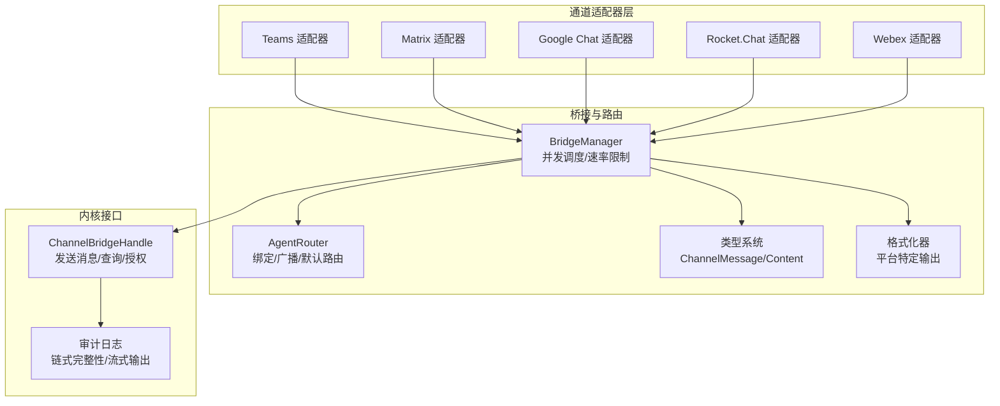
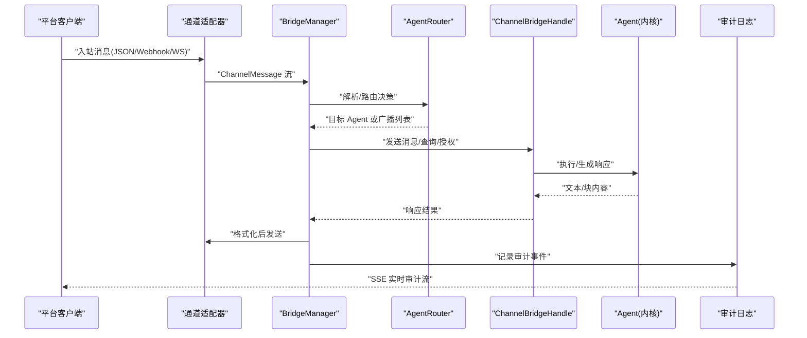
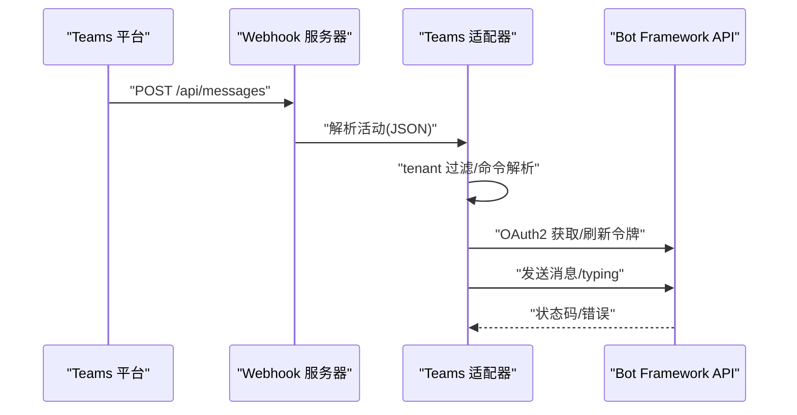
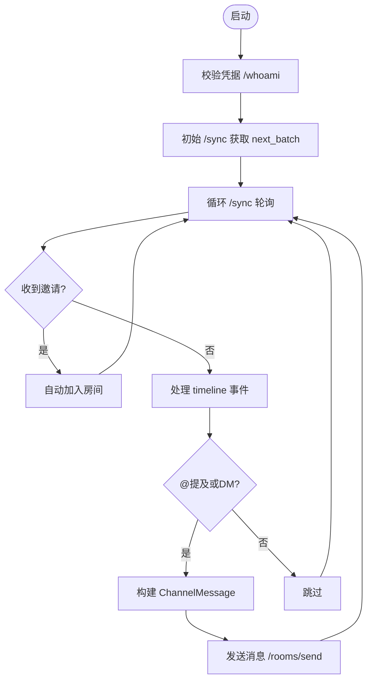
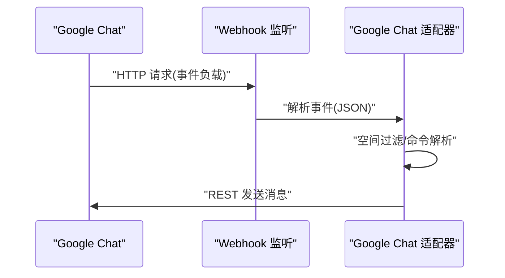
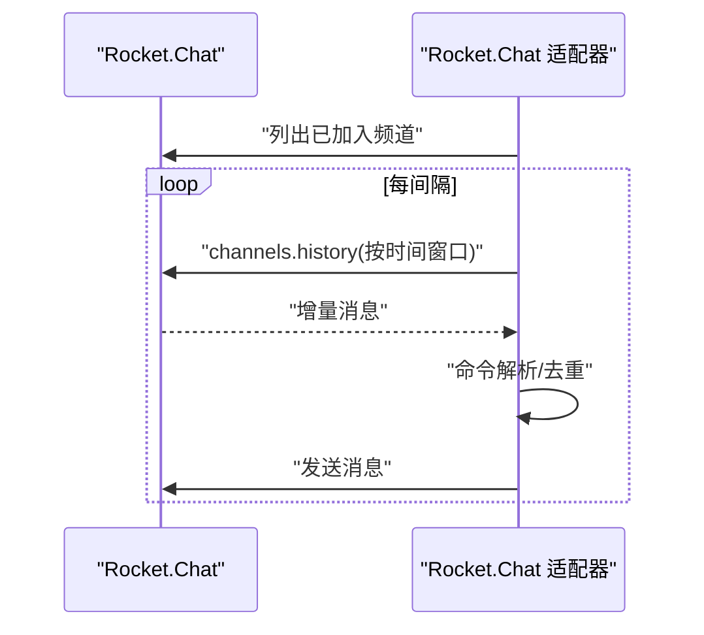
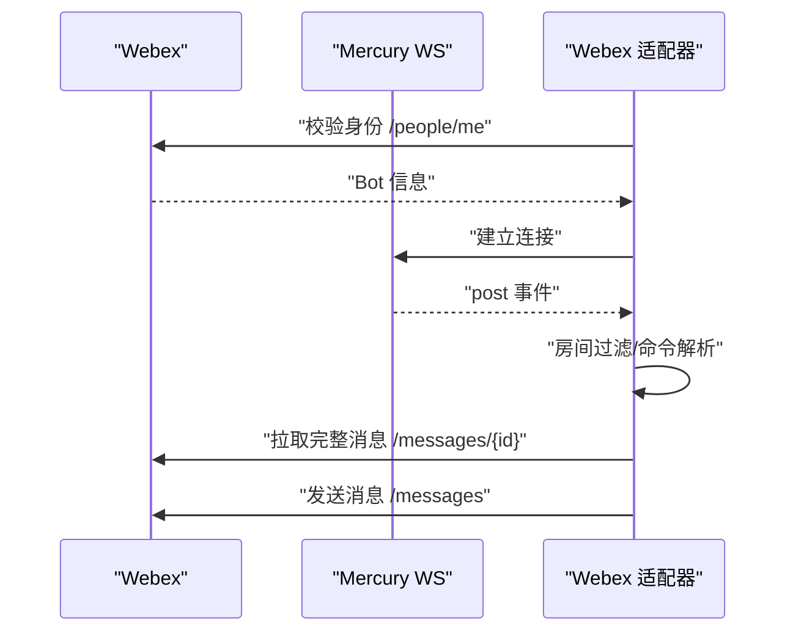
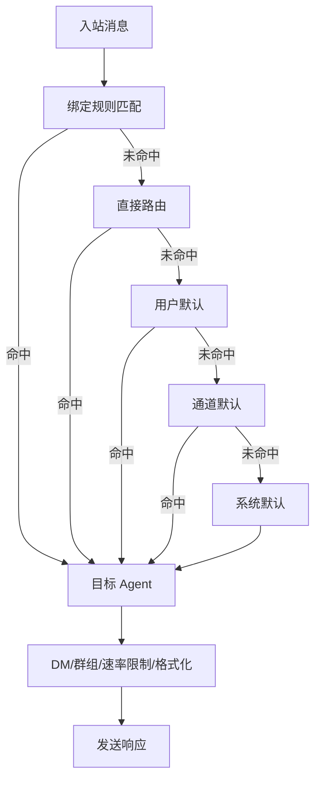
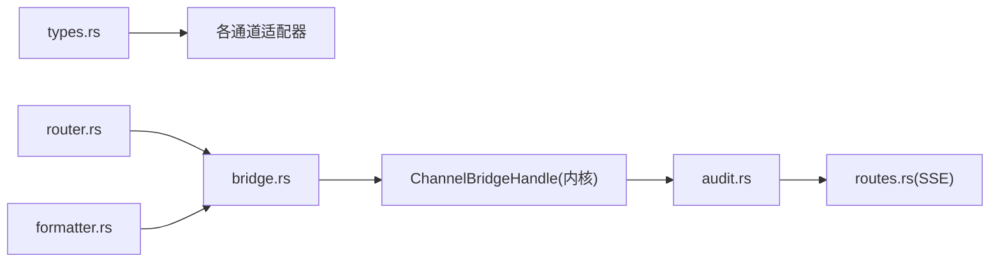

# 企业协作渠道

<cite>
**本文引用的文件**
- [crates/openfang-channels/src/lib.rs](file://crates/openfang-channels/src/lib.rs)
- [crates/openfang-channels/src/types.rs](file://crates/openfang-channels/src/types.rs)
- [crates/openfang-channels/src/router.rs](file://crates/openfang-channels/src/router.rs)
- [crates/openfang-channels/src/bridge.rs](file://crates/openfang-channels/src/bridge.rs)
- [crates/openfang-channels/src/teams.rs](file://crates/openfang-channels/src/teams.rs)
- [crates/openfang-channels/src/matrix.rs](file://crates/openfang-channels/src/matrix.rs)
- [crates/openfang-channels/src/google_chat.rs](file://crates/openfang-channels/src/google_chat.rs)
- [crates/openfang-channels/src/rocketchat.rs](file://crates/openfang-channels/src/rocketchat.rs)
- [crates/openfang-channels/src/webex.rs](file://crates/openfang-channels/src/webex.rs)
- [crates/openfang-channels/src/formatter.rs](file://crates/openfang-channels/src/formatter.rs)
- [crates/openfang-api/src/routes.rs](file://crates/openfang-api/src/routes.rs)
- [crates/openfang-runtime/src/audit.rs](file://crates/openfang-runtime/src/audit.rs)
</cite>

## 目录
1. [简介](#简介)
2. [项目结构](#项目结构)
3. [核心组件](#核心组件)
4. [架构总览](#架构总览)
5. [详细组件分析](#详细组件分析)
6. [依赖关系分析](#依赖关系分析)
7. [性能考量](#性能考量)
8. [故障排除指南](#故障排除指南)
9. [结论](#结论)
10. [附录](#附录)

## 简介
本文件面向企业级部署与运维团队，系统化阐述 OpenFang 在企业协作渠道（Microsoft Teams、Matrix、Google Chat、Rocket.Chat、Webex 等）上的集成实现与最佳实践。内容覆盖认证与授权（SAML/OAuth2/Azure AD）、权限与组织架构同步、合规与审计、API 限流与批量管理、多租户支持、安全策略配置、性能调优与故障排除等。

## 项目结构
OpenFang 将“通道适配器”作为桥接层，统一将各平台消息转换为内核可识别的 ChannelMessage，并通过路由与桥接逻辑分发到具体 Agent。核心模块包括：
- 通道适配器：teams、matrix、google_chat、rocketchat、webex 等
- 类型与协议：统一的消息类型、内容类型、通道类型
- 路由器：基于绑定规则、直接路由、默认路由的智能分发
- 桥接层：连接内核接口、输出格式化、生命周期反应、速率限制
- 格式化器：按平台特性进行消息格式转换
- 审计与日志：实时审计事件流与链式完整性校验

图示来源
- [crates/openfang-channels/src/teams.rs:36-404](file://crates/openfang-channels/src/teams.rs#L36-L404)
- [crates/openfang-channels/src/matrix.rs:22-452](file://crates/openfang-channels/src/matrix.rs#L22-L452)
- [crates/openfang-channels/src/google_chat.rs:29-355](file://crates/openfang-channels/src/google_chat.rs#L29-L355)
- [crates/openfang-channels/src/rocketchat.rs:25-383](file://crates/openfang-channels/src/rocketchat.rs#L25-L383)
- [crates/openfang-channels/src/webex.rs:37-476](file://crates/openfang-channels/src/webex.rs#L37-L476)
- [crates/openfang-channels/src/bridge.rs:272-800](file://crates/openfang-channels/src/bridge.rs#L272-L800)
- [crates/openfang-channels/src/router.rs:28-341](file://crates/openfang-channels/src/router.rs#L28-L341)
- [crates/openfang-channels/src/types.rs:14-96](file://crates/openfang-channels/src/types.rs#L14-L96)
- [crates/openfang-channels/src/formatter.rs:10-27](file://crates/openfang-channels/src/formatter.rs#L10-L27)
- [crates/openfang-api/src/routes.rs:4939-4975](file://crates/openfang-api/src/routes.rs#L4939-L4975)
- [crates/openfang-runtime/src/audit.rs:113-347](file://crates/openfang-runtime/src/audit.rs#L113-L347)

章节来源
- [crates/openfang-channels/src/lib.rs:1-55](file://crates/openfang-channels/src/lib.rs#L1-L55)

## 核心组件
- 统一消息模型：ChannelMessage/ChannelContent/ChannelUser/ChannelType，确保跨平台一致性
- 通道适配器：实现 ChannelAdapter trait，负责接收与发送消息、命令解析、线程/提及检测、速率限制
- 路由器：支持绑定规则（通道/账号/用户/服务器/角色）、直接路由、默认路由、广播策略
- 桥接层：并发调度、输出格式化、生命周期反应、速率限制、重解析默认代理
- 格式化器：针对 Telegram HTML、Slack mrkdwn、WeCom 强制纯文本等平台差异进行转换
- 审计与日志：链式完整性校验、SSE 实时审计流

章节来源
- [crates/openfang-channels/src/types.rs:14-96](file://crates/openfang-channels/src/types.rs#L14-L96)
- [crates/openfang-channels/src/router.rs:28-341](file://crates/openfang-channels/src/router.rs#L28-L341)
- [crates/openfang-channels/src/bridge.rs:272-800](file://crates/openfang-channels/src/bridge.rs#L272-L800)
- [crates/openfang-channels/src/formatter.rs:10-27](file://crates/openfang-channels/src/formatter.rs#L10-L27)
- [crates/openfang-api/src/routes.rs:4939-4975](file://crates/openfang-api/src/routes.rs#L4939-L4975)
- [crates/openfang-runtime/src/audit.rs:113-347](file://crates/openfang-runtime/src/audit.rs#L113-L347)

## 架构总览
下图展示从平台消息到 Agent 响应的端到端流程，包括认证、路由、并发控制、格式化与审计。

图示来源
- [crates/openfang-channels/src/bridge.rs:526-800](file://crates/openfang-channels/src/bridge.rs#L526-L800)
- [crates/openfang-channels/src/router.rs:138-221](file://crates/openfang-channels/src/router.rs#L138-L221)
- [crates/openfang-api/src/routes.rs:4939-4975](file://crates/openfang-api/src/routes.rs#L4939-L4975)
- [crates/openfang-runtime/src/audit.rs:113-347](file://crates/openfang-runtime/src/audit.rs#L113-L347)

## 详细组件分析

### Microsoft Teams 集成
- 认证与令牌：使用 Bot Framework v3 REST API 的 OAuth2 客户端凭证流，缓存访问令牌并在到期前刷新
- 入站：基于 axum 的 HTTP Webhook 接收 /api/messages；按 tenant 白名单过滤；忽略机器人自身消息；解析命令
- 出站：按 conversation_id 与 serviceUrl 发送 message/typing；支持长文本分片
- 多租户：allowed_tenants 列表控制接入范围

图示来源
- [crates/openfang-channels/src/teams.rs:36-404](file://crates/openfang-channels/src/teams.rs#L36-L404)

章节来源
- [crates/openfang-channels/src/teams.rs:21-176](file://crates/openfang-channels/src/teams.rs#L21-L176)

### Matrix 集成
- 认证：/whoami 校验；Bearer Token
- 同步：/sync 长轮询，初始同步跳过历史；自动接受邀请；@提及检测；DM/群组判定
- 出站：/rooms/{roomId}/send/m.room.message/{txnId}；支持长文本分片
- 可选：自动接受房间邀请、成员数检测

图示来源
- [crates/openfang-channels/src/matrix.rs:22-452](file://crates/openfang-channels/src/matrix.rs#L22-L452)

章节来源
- [crates/openfang-channels/src/matrix.rs:178-399](file://crates/openfang-channels/src/matrix.rs#L178-L399)

### Google Chat 集成
- 认证：服务账号 JWT（当前示例使用预置 access_token 字段，完整 JWT 流程预留）
- 入站：自建 HTTP 监听解析 MESSAGE 事件；空间白名单过滤；支持命令解析
- 出站：/v1/{space}/messages；支持长文本分片
- 空间类型：区分 ROOM/DM，用于群组策略判断

图示来源
- [crates/openfang-channels/src/google_chat.rs:29-355](file://crates/openfang-channels/src/google_chat.rs#L29-L355)

章节来源
- [crates/openfang-channels/src/google_chat.rs:134-329](file://crates/openfang-channels/src/google_chat.rs#L134-L329)

### Rocket.Chat 集成
- 认证：个人访问令牌 + X-Auth-Token/X-User-Id 头
- 同步：channels.history 增量拉取；按时间戳推进；支持命令解析
- 出站：/api/v1/chat.sendMessage；支持长文本分片
- 注意：REST 无专用打字指示器，需通过 WebSocket/DDP 实现（适配器注释说明）

图示来源
- [crates/openfang-channels/src/rocketchat.rs:25-383](file://crates/openfang-channels/src/rocketchat.rs#L25-L383)

章节来源
- [crates/openfang-channels/src/rocketchat.rs:125-344](file://crates/openfang-channels/src/rocketchat.rs#L125-L344)

### Webex 集成
- 认证：Bot Bearer Token；/people/me 校验身份
- 事件：Mercury WebSocket 接收 post 事件；按房间白名单过滤；拉取完整消息内容
- 出站：/messages 发送；支持长文本分片；支持直接消息（邮箱/ID）
- 打字指示：未发现公开 Bot 打字指示 API，适配器返回空操作

图示来源
- [crates/openfang-channels/src/webex.rs:37-476](file://crates/openfang-channels/src/webex.rs#L37-L476)

章节来源
- [crates/openfang-channels/src/webex.rs:224-445](file://crates/openfang-channels/src/webex.rs#L224-L445)

### 路由与策略
- 绑定规则：通道/账号/用户/服务器/角色多维匹配，按特异性排序
- 直接路由：(通道键, 用户ID) → Agent
- 默认路由：用户默认、通道默认、系统默认
- 广播：并行/串行两种策略，支持按用户配置多 Agent 分发
- 策略应用：DM/群组策略、速率限制、输出格式、线程化回复

图示来源
- [crates/openfang-channels/src/router.rs:138-221](file://crates/openfang-channels/src/router.rs#L138-L221)
- [crates/openfang-channels/src/bridge.rs:526-800](file://crates/openfang-channels/src/bridge.rs#L526-L800)

章节来源
- [crates/openfang-channels/src/router.rs:113-341](file://crates/openfang-channels/src/router.rs#L113-L341)
- [crates/openfang-channels/src/bridge.rs:526-800](file://crates/openfang-channels/src/bridge.rs#L526-L800)

### 输出格式化与合规
- 平台差异：Telegram HTML、Slack mrkdwn、WeCom 强制纯文本、通用 Markdown
- WeCom 特性：去除标题、引用、任务列表、代码块等，避免泄露 Markdown 语法
- 企业合规：在企业聊天中强制纯文本，降低误读与信息泄露风险

章节来源
- [crates/openfang-channels/src/formatter.rs:10-27](file://crates/openfang-channels/src/formatter.rs#L10-L27)
- [crates/openfang-channels/src/formatter.rs:460-513](file://crates/openfang-channels/src/formatter.rs#L460-L513)

## 依赖关系分析
- 通道适配器依赖统一类型系统(types)与通道接口(ChannelAdapter)
- 桥接层依赖路由器(router)与格式化器(formatter)，并通过 ChannelBridgeHandle 与内核交互
- 审计日志独立于通道，通过 SSE 对外提供实时审计流

图示来源
- [crates/openfang-channels/src/types.rs:14-96](file://crates/openfang-channels/src/types.rs#L14-L96)
- [crates/openfang-channels/src/router.rs:28-341](file://crates/openfang-channels/src/router.rs#L28-L341)
- [crates/openfang-channels/src/bridge.rs:272-800](file://crates/openfang-channels/src/bridge.rs#L272-L800)
- [crates/openfang-channels/src/formatter.rs:10-27](file://crates/openfang-channels/src/formatter.rs#L10-L27)
- [crates/openfang-api/src/routes.rs:4939-4975](file://crates/openfang-api/src/routes.rs#L4939-L4975)
- [crates/openfang-runtime/src/audit.rs:113-347](file://crates/openfang-runtime/src/audit.rs#L113-L347)

章节来源
- [crates/openfang-channels/src/lib.rs:1-55](file://crates/openfang-channels/src/lib.rs#L1-L55)

## 性能考量
- 并发调度：每个入站消息派生独立任务，避免慢 LLM 阻塞后续消息；通过信号量限制并发数量
- 速率限制：按“通道类型:用户ID”桶统计，1 分钟滑动窗口，防止刷屏
- 打字指示：周期刷新以覆盖平台超时（如 Telegram 约 5 秒）
- 线程化回复：根据通道覆盖策略启用，保持上下文连续性
- 平台特性：各平台最大消息长度限制（Teams/Matrix/Google Chat/Webex），超出自动分片

章节来源
- [crates/openfang-channels/src/bridge.rs:309-382](file://crates/openfang-channels/src/bridge.rs#L309-L382)
- [crates/openfang-channels/src/bridge.rs:229-269](file://crates/openfang-channels/src/bridge.rs#L229-L269)
- [crates/openfang-channels/src/teams.rs:25-29](file://crates/openfang-channels/src/teams.rs#L25-L29)
- [crates/openfang-channels/src/matrix.rs:18-19](file://crates/openfang-channels/src/matrix.rs#L18-L19)
- [crates/openfang-channels/src/google_chat.rs:21-22](file://crates/openfang-channels/src/google_chat.rs#L21-L22)
- [crates/openfang-channels/src/webex.rs:28-29](file://crates/openfang-channels/src/webex.rs#L28-L29)

## 故障排除指南
- 认证失败
  - Teams：检查 app_id/app_password 与 token URL；确认 allowed_tenants 正确
  - Matrix：验证 /whoami 返回；确认 access_token 有效
  - Google Chat：确认服务账号 JSON 包含 access_token；完整 JWT 流程待实现
  - Rocket.Chat：确认 X-Auth-Token/X-User-Id 头正确；/api/v1/me 可用
  - Webex：确认 Bearer Token 有效；/people/me 成功
- 速率限制触发：调整 per-user 限额或等待 1 分钟窗口
- 广播未生效：检查广播配置与 Agent 名称缓存是否一致
- 审计与日志
  - 使用 SSE /api/logs/stream 实时查看审计事件
  - 审计日志具备链式完整性校验，可检测篡改
- 平台兼容问题
  - WeCom 强制纯文本，避免 Markdown 泄露
  - Webex 无公开打字指示 API，适配器为空操作

章节来源
- [crates/openfang-channels/src/teams.rs:80-126](file://crates/openfang-channels/src/teams.rs#L80-L126)
- [crates/openfang-channels/src/matrix.rs:102-121](file://crates/openfang-channels/src/matrix.rs#L102-L121)
- [crates/openfang-channels/src/google_chat.rs:65-99](file://crates/openfang-channels/src/google_chat.rs#L65-L99)
- [crates/openfang-channels/src/rocketchat.rs:78-90](file://crates/openfang-channels/src/rocketchat.rs#L78-L90)
- [crates/openfang-channels/src/webex.rs:68-92](file://crates/openfang-channels/src/webex.rs#L68-L92)
- [crates/openfang-channels/src/bridge.rs:229-269](file://crates/openfang-channels/src/bridge.rs#L229-L269)
- [crates/openfang-channels/src/router.rs:223-254](file://crates/openfang-channels/src/router.rs#L223-L254)
- [crates/openfang-api/src/routes.rs:4939-4975](file://crates/openfang-api/src/routes.rs#L4939-L4975)
- [crates/openfang-runtime/src/audit.rs:113-347](file://crates/openfang-runtime/src/audit.rs#L113-L347)

## 结论
OpenFang 的通道适配器层提供了企业级多平台统一接入能力，结合路由器与桥接层实现了灵活的路由、策略与并发控制。通过严格的认证与授权、速率限制、输出格式化与审计日志，满足企业合规与安全需求。建议在生产环境中：
- 明确多租户与房间/空间白名单
- 配置合理的 DM/群组策略与速率限制
- 使用 SSE 审计流持续监控
- 针对不同平台启用合适的输出格式与线程化回复

## 附录

### 企业特性与合规要点
- 多租户与组织同步：Teams 支持 tenant 白名单；Matrix/Google Chat/Rocket.Chat/Webex 提供各自鉴权与房间/空间过滤
- 权限与授权：通过 ChannelBridgeHandle.authorize_channel_user 实施 RBAC；支持广播场景的授权检查
- 合规与审计：链式审计日志与 SSE 实时流，支持按级别与关键词过滤
- 数据保留与最小暴露：WeCom 强制纯文本输出，减少 Markdown 泄露风险

章节来源
- [crates/openfang-channels/src/teams.rs:43-44](file://crates/openfang-channels/src/teams.rs#L43-L44)
- [crates/openfang-channels/src/matrix.rs:31-32](file://crates/openfang-channels/src/matrix.rs#L31-L32)
- [crates/openfang-channels/src/google_chat.rs:32-33](file://crates/openfang-channels/src/google_chat.rs#L32-L33)
- [crates/openfang-channels/src/rocketchat.rs:32-33](file://crates/openfang-channels/src/rocketchat.rs#L32-L33)
- [crates/openfang-channels/src/webex.rs:38-40](file://crates/openfang-channels/src/webex.rs#L38-L40)
- [crates/openfang-channels/src/bridge.rs:117-128](file://crates/openfang-channels/src/bridge.rs#L117-L128)
- [crates/openfang-api/src/routes.rs:4939-4975](file://crates/openfang-api/src/routes.rs#L4939-L4975)
- [crates/openfang-runtime/src/audit.rs:113-347](file://crates/openfang-runtime/src/audit.rs#L113-L347)