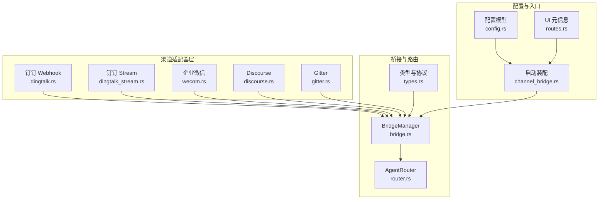
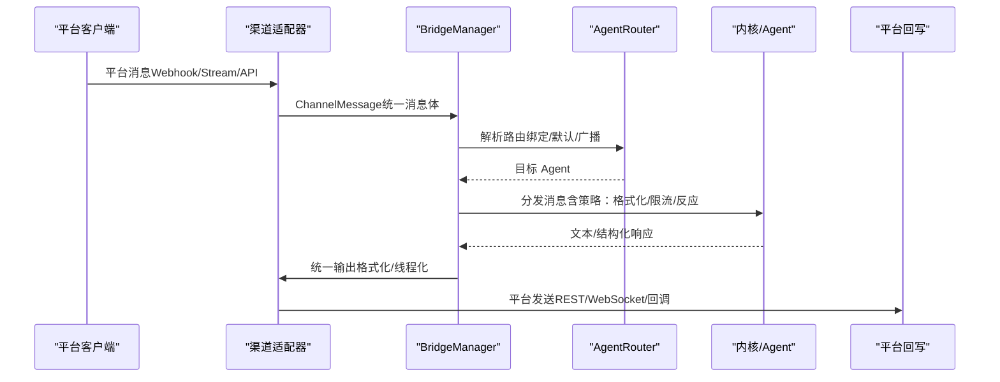
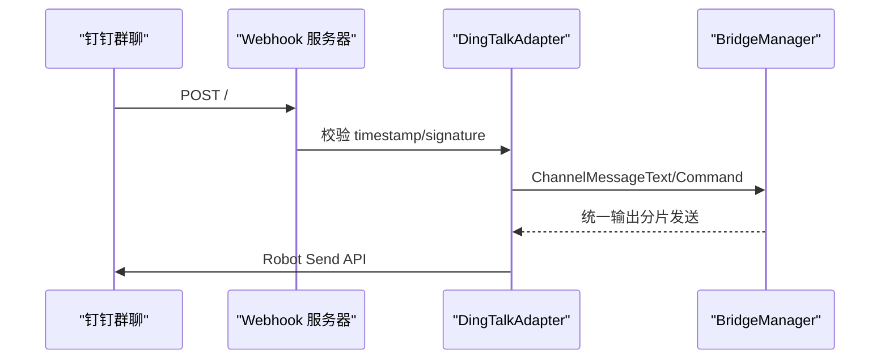
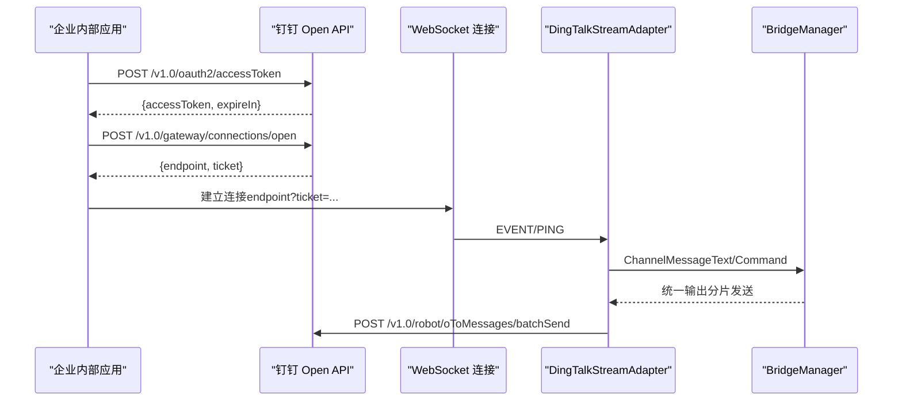
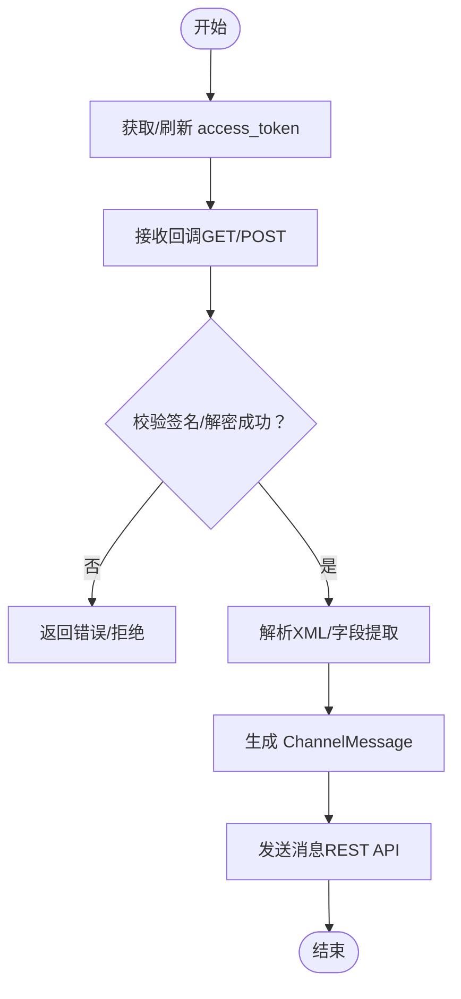
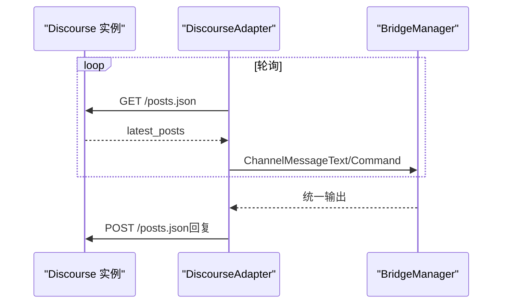
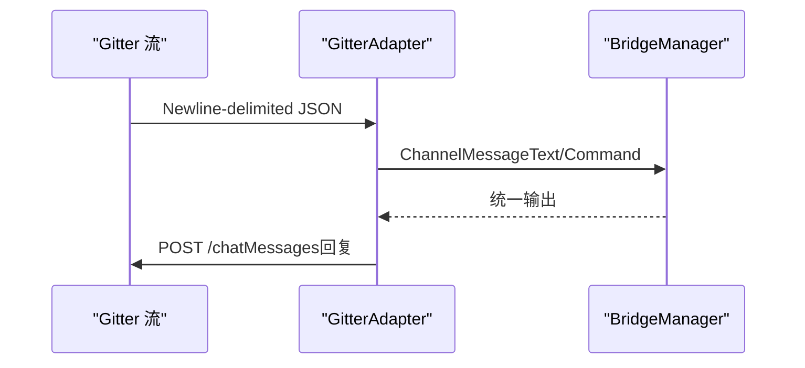
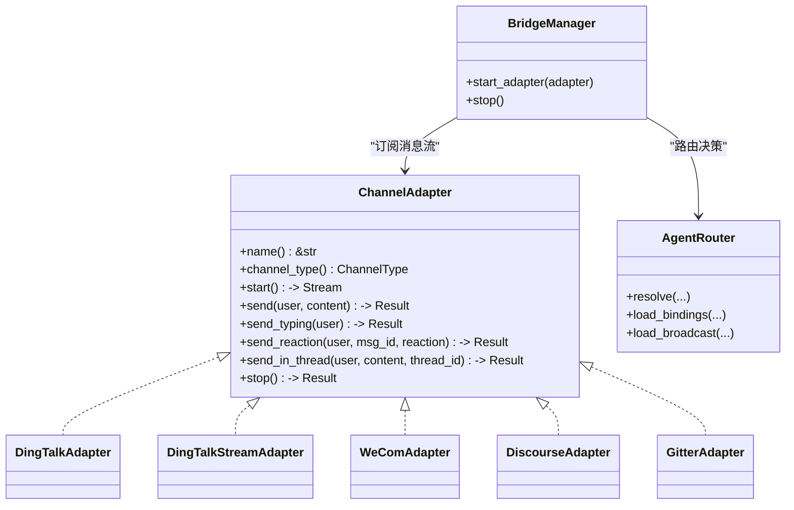

# 新兴和特殊渠道

<cite>
**本文引用的文件**
- [dingtalk.rs](file://crates/openfang-channels/src/dingtalk.rs)
- [dingtalk_stream.rs](file://crates/openfang-channels/src/dingtalk_stream.rs)
- [wecom.rs](file://crates/openfang-channels/src/wecom.rs)
- [discourse.rs](file://crates/openfang-channels/src/discourse.rs)
- [gitter.rs](file://crates/openfang-channels/src/gitter.rs)
- [types.rs](file://crates/openfang-channels/src/types.rs)
- [bridge.rs](file://crates/openfang-channels/src/bridge.rs)
- [router.rs](file://crates/openfang-channels/src/router.rs)
- [lib.rs](file://crates/openfang-channels/src/lib.rs)
- [config.rs](file://crates/openfang-types/src/config.rs)
- [routes.rs](file://crates/openfang-api/src/routes.rs)
- [channel_bridge.rs](file://crates/openfang-api/src/channel_bridge.rs)
</cite>

## 目录
1. [引言](#引言)
2. [项目结构](#项目结构)
3. [核心组件](#核心组件)
4. [架构总览](#架构总览)
5. [详细组件分析](#详细组件分析)
6. [依赖关系分析](#依赖关系分析)
7. [性能考量](#性能考量)
8. [故障排查指南](#故障排查指南)
9. [结论](#结论)
10. [附录](#附录)

## 引言
本文件面向 OpenFang 在“新兴与特殊消息渠道”方向的集成能力，聚焦以下平台：
- 钉钉（DingTalk）：提供机器人 Webhook 与 Stream 模式（WebSocket）两种接入方式，分别覆盖传统群聊与更现代的企业级长连接场景。
- 企业微信（WeCom）：基于 Work API 的消息收发与回调校验，支持加密回调与令牌缓存。
- Discourse：论坛型社区的长轮询订阅与回复，适合技术讨论与知识沉淀。
- Gitter：开发者社区的实时流式聊天，适合开源协作与即时沟通。

我们将从架构、数据流、认证与接口、适配器实现细节、场景化应用与最佳实践等维度进行系统化说明，并给出可操作的集成步骤与排障建议。

## 项目结构
OpenFang 将“渠道适配器”统一抽象为 ChannelAdapter trait，通过桥接层（BridgeManager）将来自不同平台的消息转化为统一的 ChannelMessage，并路由至内核处理。各渠道适配器位于 openfang-channels 子模块中，类型定义与通用桥接逻辑位于 types.rs、bridge.rs、router.rs；具体渠道配置项位于 openfang-types 的 config.rs；UI 与初始化入口位于 openfang-api 的 routes.rs 与 channel_bridge.rs。

图示来源
- [lib.rs:45-54](file://crates/openfang-channels/src/lib.rs#L45-L54)
- [bridge.rs:271-382](file://crates/openfang-channels/src/bridge.rs#L271-L382)
- [router.rs:28-45](file://crates/openfang-channels/src/router.rs#L28-L45)
- [types.rs:12-27](file://crates/openfang-channels/src/types.rs#L12-L27)
- [config.rs:2782-2841](file://crates/openfang-types/src/config.rs#L2782-L2841)
- [routes.rs:1903-2203](file://crates/openfang-api/src/routes.rs#L1903-L2203)
- [channel_bridge.rs:1586-1612](file://crates/openfang-api/src/channel_bridge.rs#L1586-L1612)

章节来源
- [lib.rs:45-54](file://crates/openfang-channels/src/lib.rs#L45-L54)
- [bridge.rs:271-382](file://crates/openfang-channels/src/bridge.rs#L271-L382)
- [router.rs:28-45](file://crates/openfang-channels/src/router.rs#L28-L45)
- [types.rs:12-27](file://crates/openfang-channels/src/types.rs#L12-L27)
- [config.rs:2782-2841](file://crates/openfang-types/src/config.rs#L2782-L2841)
- [routes.rs:1903-2203](file://crates/openfang-api/src/routes.rs#L1903-L2203)
- [channel_bridge.rs:1586-1612](file://crates/openfang-api/src/channel_bridge.rs#L1586-L1612)

## 核心组件
- ChannelAdapter 抽象：统一的 start/send/stop 生命周期与可选 send_typing/send_reaction/send_in_thread 能力，屏蔽平台差异。
- ChannelMessage/ChannelContent：统一的消息体与内容类型，支持文本、命令、图片、文件、语音、位置等。
- BridgeManager：订阅适配器消息流，按策略分发给 AgentRouter，执行输出格式化、反应式反馈、速率限制等。
- AgentRouter：基于绑定规则、用户默认、直接路由、频道默认与系统默认的多级路由决策。
- 各渠道适配器：分别实现 DingTalk（Webhook/Stream）、WeCom、Discourse、Gitter 的接入与消息编解码。

章节来源
- [types.rs:215-280](file://crates/openfang-channels/src/types.rs#L215-L280)
- [bridge.rs:271-382](file://crates/openfang-channels/src/bridge.rs#L271-L382)
- [router.rs:28-45](file://crates/openfang-channels/src/router.rs#L28-L45)

## 架构总览
下图展示从渠道到内核的端到端数据流：适配器解析平台消息为统一 ChannelMessage，BridgeManager 应用策略后路由到目标 Agent，再由适配器将 Agent 输出回写到平台。

图示来源
- [bridge.rs:526-800](file://crates/openfang-channels/src/bridge.rs#L526-L800)
- [router.rs:138-187](file://crates/openfang-channels/src/router.rs#L138-L187)
- [types.rs:74-96](file://crates/openfang-channels/src/types.rs#L74-L96)

## 详细组件分析

### 钉钉（DingTalk）Webhook 适配器
- 特色功能
  - 基于 Webhook 的回调接收，支持签名验证与时间戳新鲜度检查。
  - 支持命令解析（以“/”开头），自动拆分超长文本。
- 认证与接口
  - 回调签名校验：HMAC-SHA256（timestamp + “\n” + secret）。
  - 发送接口：Robot Send API，携带 access_token、timestamp、sign 参数。
- 数据格式
  - 回调 JSON 字段：msgtype、text.content、senderId、senderNick、conversationId、conversationType。
  - 发送请求体：msgtype=text，text.content。
- 场景优势
  - 适合企业内部群聊自动化、通知播报、快速问答。
- 最佳实践
  - 使用独立 webhook 端口，开启签名与时间戳校验。
  - 对超长文本进行分片发送，避免平台限制。
- 适用性提示
  - 该适配器为遗留方案；推荐使用 Stream 模式以获得更稳定的长连接体验。

图示来源
- [dingtalk.rs:127-328](file://crates/openfang-channels/src/dingtalk.rs#L127-L328)

章节来源
- [dingtalk.rs:24-125](file://crates/openfang-channels/src/dingtalk.rs#L24-L125)
- [dingtalk.rs:127-328](file://crates/openfang-channels/src/dingtalk.rs#L127-L328)

### 钉钉（DingTalk）Stream 适配器（WebSocket）
- 特色功能
  - 基于 WebSocket 的 Stream Mode，支持事件推送、心跳、ACK 确认。
  - 自动获取与缓存访问令牌，连接失败指数退避重连。
- 认证与接口
  - 第一步：OAuth 获取 accessToken。
  - 第二步：申请连接，获取 WebSocket URL 与 ticket。
  - 第三步：建立连接，处理 ping/pong 与 EVENT 消息。
  - 第四步：批量发送 oToMessages。
- 数据格式
  - 协议帧包含 type、headers、data；回调负载包含 msgtype、text、senderStaffId/senderId、conversationId、messageId。
  - 发送参数：robotCode、userIds、msgKey(sampleText)、msgParam（JSON 字符串）。
- 场景优势
  - 更适合企业内部应用、需要低延迟与稳定连接的场景。
- 最佳实践
  - 正确设置订阅主题与 UA，确保事件可达。
  - 处理 ACK 与心跳，维持连接健康。
  - 对批量发送进行分片与延时控制。

图示来源
- [dingtalk_stream.rs:153-283](file://crates/openfang-channels/src/dingtalk_stream.rs#L153-L283)
- [dingtalk_stream.rs:293-389](file://crates/openfang-channels/src/dingtalk_stream.rs#L293-L389)

章节来源
- [dingtalk_stream.rs:33-151](file://crates/openfang-channels/src/dingtalk_stream.rs#L33-L151)
- [dingtalk_stream.rs:153-283](file://crates/openfang-channels/src/dingtalk_stream.rs#L153-L283)
- [dingtalk_stream.rs:293-389](file://crates/openfang-channels/src/dingtalk_stream.rs#L293-L389)

### 企业微信（WeCom）适配器
- 特色功能
  - 支持回调 URL 校验与可选加密回调（AES-CBC 解密）。
  - 自动缓存与刷新 access_token，带缓冲过期时间。
- 认证与接口
  - 获取令牌：GET https://qyapi.weixin.qq.com/cgi-bin/gettoken。
  - 发送消息：POST https://qyapi.weixin.qq.com/cgi-bin/message/send。
  - 回调校验：SHA1(token+timestamp+nonce+echostr) 与 msg_signature 比较。
- 数据格式
  - 回调 XML 解析为字段映射；支持事件（如 subscribe/enter_agent）与文本消息。
  - 发送请求体：touser、msgtype=text、agentid、text.content。
- 场景优势
  - 适合企业内协同与合规要求较高的场景。
- 最佳实践
  - 开启回调校验与加密回调，妥善保管 Encoding AES Key 与 Token。
  - 合理设置 webhook 端口，避免与其它服务冲突。

图示来源
- [wecom.rs:338-585](file://crates/openfang-channels/src/wecom.rs#L338-L585)

章节来源
- [wecom.rs:188-336](file://crates/openfang-channels/src/wecom.rs#L188-L336)
- [wecom.rs:338-585](file://crates/openfang-channels/src/wecom.rs#L338-L585)

### Discourse 适配器（论坛型社区）
- 特色功能
  - 基于 REST API 的长轮询，监听最新帖子并过滤分类。
  - 支持主题内回复与线程元数据透传。
- 认证与接口
  - 认证头：Api-Key、Api-Username。
  - 轮询：GET /posts.json（可带 before 参数）。
  - 回复：POST /posts.json（topic_id/raw）。
- 数据格式
  - 轮询返回包含 latest_posts 数组；回复时以 topic_id 定位主题。
  - 元数据：topic_id/topic_slug/post_number/category。
- 场景优势
  - 适合技术论坛、知识社区、FAQ 与问答沉淀。
- 最佳实践
  - 设置合理的轮询间隔与指数退避，避免平台压力。
  - 使用分类过滤减少无关噪音。

图示来源
- [discourse.rs:166-399](file://crates/openfang-channels/src/discourse.rs#L166-L399)

章节来源
- [discourse.rs:24-164](file://crates/openfang-channels/src/discourse.rs#L24-L164)
- [discourse.rs:166-399](file://crates/openfang-channels/src/discourse.rs#L166-L399)

### Gitter 适配器（开发者社区）
- 特色功能
  - 基于流式 API 的实时消息订阅，支持心跳与断线重连。
  - 支持命令解析与线程化回复。
- 认证与接口
  - 认证：Bearer Token。
  - 流式：GET https://stream.gitter.im/v1/rooms/{roomId}/chatMessages。
  - 回复：POST https://api.gitter.im/v1/rooms/{roomId}/chatMessages。
- 数据格式
  - 流式消息为 newline-delimited JSON，包含 id/text/fromUser。
  - 回复请求体：text。
- 场景优势
  - 适合开源项目、开发者即时讨论与协作。
- 最佳实践
  - 断线重连采用指数退避，避免频繁重试。
  - 忽略自身消息，避免回环。

图示来源
- [gitter.rs:149-351](file://crates/openfang-channels/src/gitter.rs#L149-L351)

章节来源
- [gitter.rs:25-147](file://crates/openfang-channels/src/gitter.rs#L25-L147)
- [gitter.rs:149-351](file://crates/openfang-channels/src/gitter.rs#L149-L351)

## 依赖关系分析
- 类型与协议
  - ChannelType/ChannelUser/ChannelContent/ChannelMessage 统一了跨平台消息模型。
- 桥接与路由
  - BridgeManager 作为适配器与内核之间的协调者，负责并发调度、速率限制、格式化与反应式反馈。
  - AgentRouter 提供多级路由与广播策略，支持绑定规则、用户默认、频道默认与系统默认。
- 配置与入口
  - config.rs 定义各渠道的配置项（环境变量、端口、默认 Agent、行为覆盖等）。
  - routes.rs 提供 UI 层的渠道元信息与表单字段。
  - channel_bridge.rs 在运行时读取配置并实例化适配器。

图示来源
- [types.rs:215-280](file://crates/openfang-channels/src/types.rs#L215-L280)
- [bridge.rs:271-382](file://crates/openfang-channels/src/bridge.rs#L271-L382)
- [router.rs:28-45](file://crates/openfang-channels/src/router.rs#L28-L45)
- [dingtalk.rs:24-41](file://crates/openfang-channels/src/dingtalk.rs#L24-L41)
- [dingtalk_stream.rs:33-55](file://crates/openfang-channels/src/dingtalk_stream.rs#L33-L55)
- [wecom.rs:188-209](file://crates/openfang-channels/src/wecom.rs#L188-L209)
- [discourse.rs:24-44](file://crates/openfang-channels/src/discourse.rs#L24-L44)
- [gitter.rs:25-40](file://crates/openfang-channels/src/gitter.rs#L25-L40)

章节来源
- [types.rs:215-280](file://crates/openfang-channels/src/types.rs#L215-L280)
- [bridge.rs:271-382](file://crates/openfang-channels/src/bridge.rs#L271-L382)
- [router.rs:28-45](file://crates/openfang-channels/src/router.rs#L28-L45)

## 性能考量
- 并发与背压
  - BridgeManager 使用信号量限制并发分发任务数量，避免突发流量导致内存膨胀。
- 速率限制
  - ChannelRateLimiter 基于用户粒度的滑动窗口计数，防止平台限流。
- 指数退避
  - Discourse/Gitter/WeCom Stream 等在轮询或连接失败时采用指数退避，降低重试频率。
- 分片发送
  - 钉钉 Webhook/Stream、WeCom、Discourse、Gitter 均对超长文本进行分片发送，必要时插入延时以规避限速。

章节来源
- [bridge.rs:309-373](file://crates/openfang-channels/src/bridge.rs#L309-L373)
- [bridge.rs:229-269](file://crates/openfang-channels/src/bridge.rs#L229-L269)
- [discourse.rs:206-242](file://crates/openfang-channels/src/discourse.rs#L206-L242)
- [gitter.rs:172-210](file://crates/openfang-channels/src/gitter.rs#L172-L210)
- [wecom.rs:244-291](file://crates/openfang-channels/src/wecom.rs#L244-L291)

## 故障排查指南
- 钉钉 Webhook
  - 现象：403 Forbidden 或“无效签名/时间戳过期”。
  - 排查：确认 timestamp 与 sign 请求头、secret 配置正确；检查本地时间与时区。
- 钉钉 Stream
  - 现象：连接失败或频繁断开。
  - 排查：检查 app_key/app_secret、robot_code；关注 token 缓存与过期；确认订阅主题与 UA。
- 企业微信
  - 现象：回调校验失败或解密异常。
  - 排查：核对 token、encoding_aes_key；确认回调 URL 与加密模式配置一致。
- Discourse
  - 现象：轮询失败或回复无响应。
  - 排查：检查 Api-Key/Api-Username；确认分类过滤与 topic_id 传递。
- Gitter
  - 现象：流中断或无法发送消息。
  - 排查：确认 Bearer Token；检查房间 ID；观察断线重连日志。

章节来源
- [dingtalk.rs:172-185](file://crates/openfang-channels/src/dingtalk.rs#L172-L185)
- [dingtalk_stream.rs:185-222](file://crates/openfang-channels/src/dingtalk_stream.rs#L185-L222)
- [wecom.rs:369-462](file://crates/openfang-channels/src/wecom.rs#L369-L462)
- [discourse.rs:112-125](file://crates/openfang-channels/src/discourse.rs#L112-L125)
- [gitter.rs:187-210](file://crates/openfang-channels/src/gitter.rs#L187-L210)

## 结论
OpenFang 通过统一的 ChannelAdapter 抽象与桥接层，实现了对钉钉、企业微信、Discourse、Gitter 等新兴与特殊渠道的一致化接入。各适配器针对平台特性提供了差异化的认证、接口与数据格式处理，并结合路由与策略层实现灵活的业务编排。在实际落地中，建议优先采用 Stream 模式（如钉钉 Stream）以提升稳定性，同时严格遵循各平台的安全与限流策略，结合配置与 UI 元信息完成快速部署与运维。

## 附录

### 场景化应用与最佳实践
- 远程办公
  - 钉钉 Stream：用于企业内部会议通知、待办提醒与工作流触发。
  - 企业微信：用于合规审批、安全审计与内部知识库联动。
- 在线教育
  - Discourse：用于课程问答、学习社区与作业讨论。
  - Gitter：用于开源课程协作、代码评审与即时答疑。
- 开源社区
  - Gitter：用于项目讨论、贡献者沟通与 CI 反馈。
  - Discourse：用于长期知识沉淀与社区治理。
- 技术讨论
  - 钉钉/企业微信：用于团队内部技术分享与问题追踪。
  - Gitter/Discourse：用于跨组织的技术交流与文档协作。

### 集成步骤（以 UI 表单为例）
- 钉钉（Webhook）
  - 创建群聊机器人，复制 Access Token 与签名密钥。
  - 在 UI 中填写 webhook_port 与 default_agent，保存配置。
- 钉钉（Stream）
  - 创建企业内部应用，启用 Stream Mode，获取 App Key/Secret/Robot Code。
  - 在 UI 中填写 app_key_env/app_secret_env/robot_code_env，保存配置。
- 企业微信
  - 在管理后台创建应用，获取 Corp ID、Agent ID、Secret。
  - 可选配置 token 与 encoding_aes_key，设置 webhook_port。
- Discourse
  - 获取 API Key 与用户名，配置 base_url 与 categories。
- Gitter
  - 获取个人访问 Token 与房间 ID，配置 default_agent。

章节来源
- [routes.rs:1903-2203](file://crates/openfang-api/src/routes.rs#L1903-L2203)
- [config.rs:2782-2841](file://crates/openfang-types/src/config.rs#L2782-L2841)
- [config.rs:2844-2890](file://crates/openfang-types/src/config.rs#L2844-L2890)
- [config.rs:2877-2890](file://crates/openfang-types/src/config.rs#L2877-L2890)