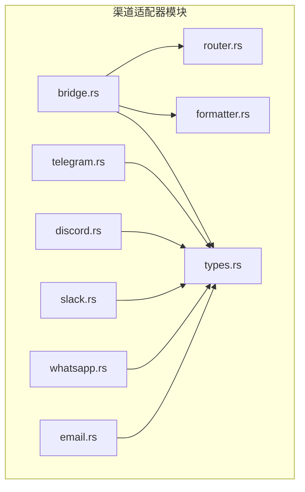
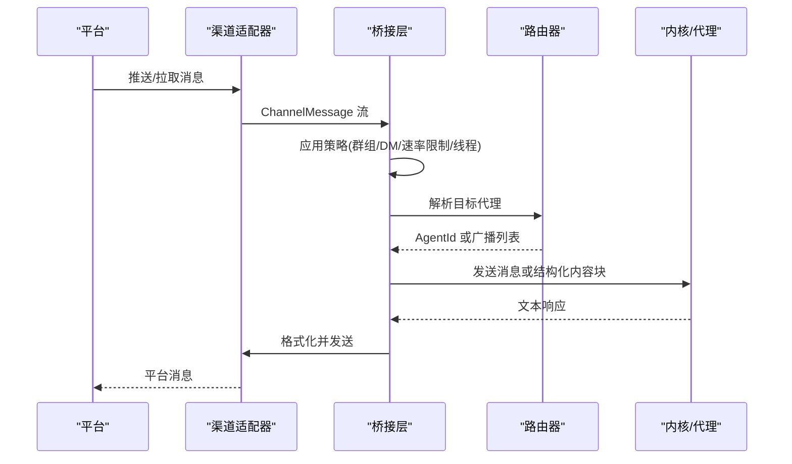
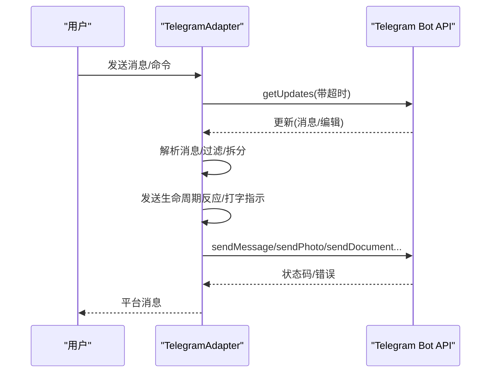
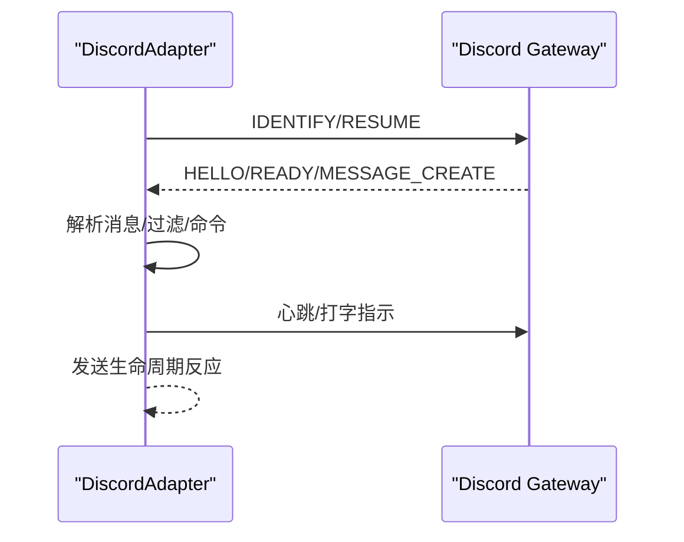
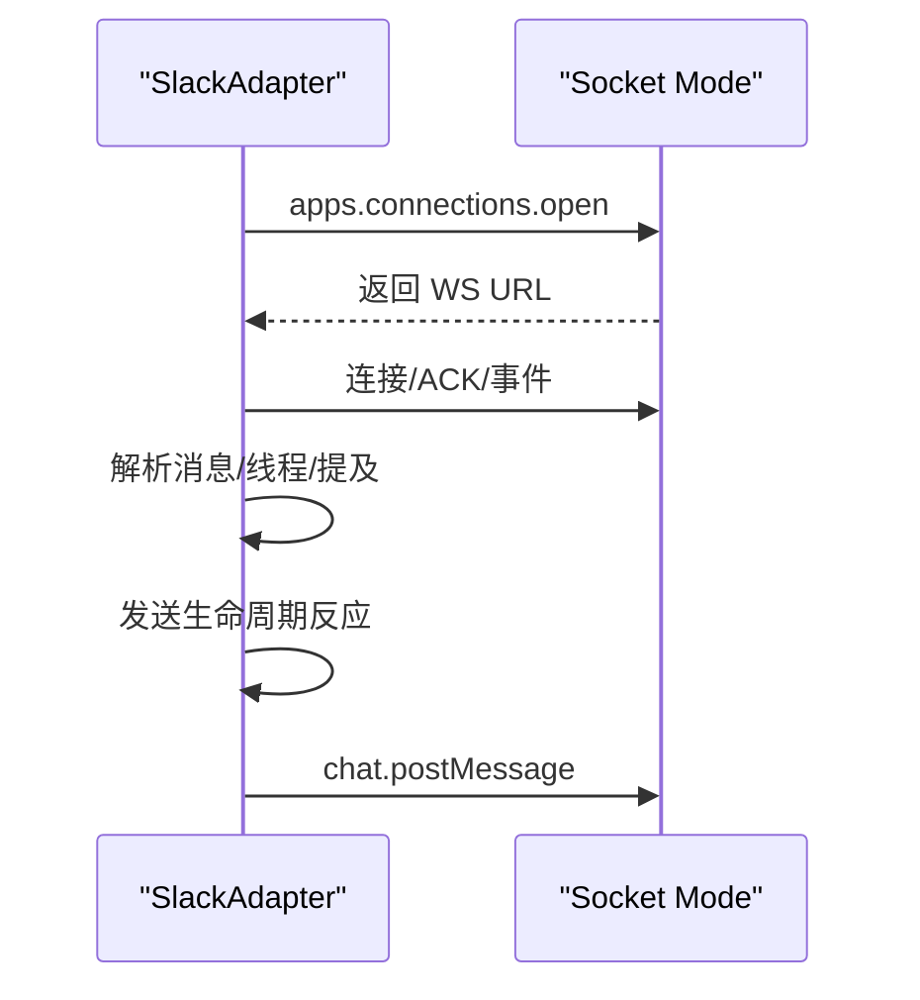
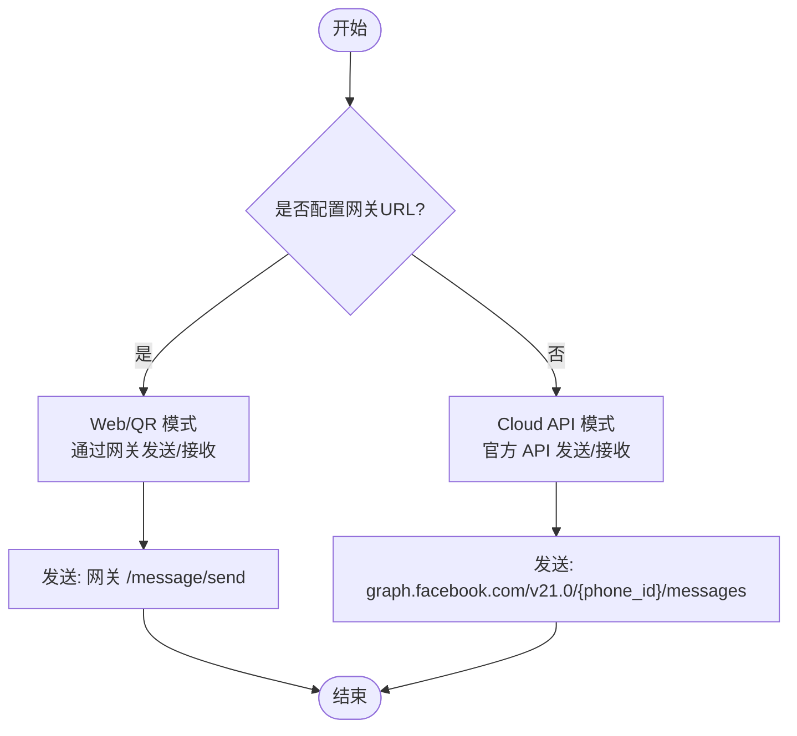
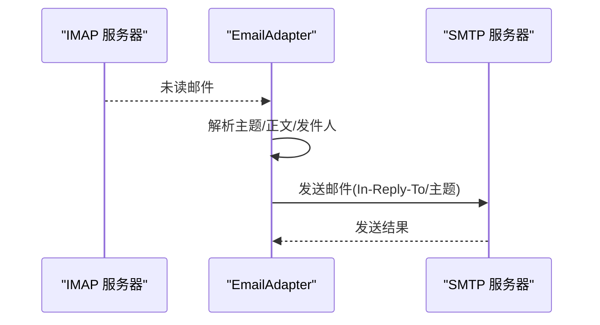
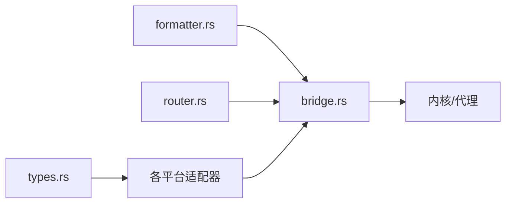

# 核心消息渠道

<cite>
**本文档引用的文件**
- [crates/openfang-channels/src/lib.rs](file://crates/openfang-channels/src/lib.rs)
- [crates/openfang-channels/src/telegram.rs](file://crates/openfang-channels/src/telegram.rs)
- [crates/openfang-channels/src/discord.rs](file://crates/openfang-channels/src/discord.rs)
- [crates/openfang-channels/src/slack.rs](file://crates/openfang-channels/src/slack.rs)
- [crates/openfang-channels/src/whatsapp.rs](file://crates/openfang-channels/src/whatsapp.rs)
- [crates/openfang-channels/src/email.rs](file://crates/openfang-channels/src/email.rs)
- [crates/openfang-channels/src/types.rs](file://crates/openfang-channels/src/types.rs)
- [crates/openfang-channels/src/formatter.rs](file://crates/openfang-channels/src/formatter.rs)
- [crates/openfang-channels/src/router.rs](file://crates/openfang-channels/src/router.rs)
- [crates/openfang-channels/src/bridge.rs](file://crates/openfang-channels/src/bridge.rs)
</cite>

## 目录
1. [简介](#简介)
2. [项目结构](#项目结构)
3. [核心组件](#核心组件)
4. [架构总览](#架构总览)
5. [详细组件分析](#详细组件分析)
6. [依赖关系分析](#依赖关系分析)
7. [性能考虑](#性能考虑)
8. [故障排查指南](#故障排查指南)
9. [结论](#结论)
10. [附录](#附录)

## 简介
本文件面向 OpenFang 核心消息渠道的实现与使用，聚焦于 Telegram、Discord、Slack、WhatsApp、Email 等主流消息平台的集成。内容涵盖：
- 认证机制：各平台令牌校验、网关连接、会话恢复
- API 集成方式：长轮询、WebSocket、REST 调用
- 消息格式转换：Markdown 到平台特定标记的映射
- 实时通信处理：事件解析、线程回复、生命周期反应
- 渠道特有能力：多媒体消息、文件传输、群组管理、机器人权限
- 配置示例、密钥管理、速率限制、错误恢复策略
- 渠道适配器开发模式、调试技巧、性能优化建议

## 项目结构
OpenFang 的消息渠道位于 openfang-channels 子工程中，采用模块化设计，每个平台一个适配器模块，并通过统一的类型系统和桥接层进行编排。

图表来源
- [crates/openfang-channels/src/lib.rs:1-56](file://crates/openfang-channels/src/lib.rs#L1-L56)
- [crates/openfang-channels/src/telegram.rs:1-800](file://crates/openfang-channels/src/telegram.rs#L1-L800)
- [crates/openfang-channels/src/discord.rs:1-800](file://crates/openfang-channels/src/discord.rs#L1-L800)
- [crates/openfang-channels/src/slack.rs:1-746](file://crates/openfang-channels/src/slack.rs#L1-L746)
- [crates/openfang-channels/src/whatsapp.rs:1-378](file://crates/openfang-channels/src/whatsapp.rs#L1-L378)
- [crates/openfang-channels/src/email.rs:1-628](file://crates/openfang-channels/src/email.rs#L1-L628)
- [crates/openfang-channels/src/formatter.rs:1-676](file://crates/openfang-channels/src/formatter.rs#L1-L676)
- [crates/openfang-channels/src/types.rs:1-478](file://crates/openfang-channels/src/types.rs#L1-L478)
- [crates/openfang-channels/src/router.rs:1-645](file://crates/openfang-channels/src/router.rs#L1-L645)
- [crates/openfang-channels/src/bridge.rs:1-800](file://crates/openfang-channels/src/bridge.rs#L1-L800)

章节来源
- [crates/openfang-channels/src/lib.rs:1-56](file://crates/openfang-channels/src/lib.rs#L1-L56)

## 核心组件
- 统一消息模型与适配器接口
  - ChannelType、ChannelUser、ChannelContent、ChannelMessage 定义跨平台消息的统一结构
  - ChannelAdapter trait 规范了 start/send/send_typing/send_reaction/stop/status 等能力
- 消息格式化器
  - 将 Markdown 转换为 Telegram HTML、Slack Mrkdwn、纯文本等平台特定格式
- 路由器
  - 基于绑定规则、直接路由、用户默认、频道默认、系统默认的多级路由
- 桥接层
  - ChannelBridgeHandle 抽象内核操作；BridgeManager 启动适配器、并发分发消息、应用策略（DM/群组策略、速率限制、线程、生命周期反应）

章节来源
- [crates/openfang-channels/src/types.rs:12-280](file://crates/openfang-channels/src/types.rs#L12-L280)
- [crates/openfang-channels/src/formatter.rs:10-27](file://crates/openfang-channels/src/formatter.rs#L10-L27)
- [crates/openfang-channels/src/router.rs:25-341](file://crates/openfang-channels/src/router.rs#L25-L341)
- [crates/openfang-channels/src/bridge.rs:27-227](file://crates/openfang-channels/src/bridge.rs#L27-L227)

## 架构总览
下图展示了从平台到内核的消息通路：适配器负责接收与发送，桥接层负责策略与并发调度，路由器决定目标代理，格式化器保证输出兼容性。

图表来源
- [crates/openfang-channels/src/bridge.rs:526-800](file://crates/openfang-channels/src/bridge.rs#L526-L800)
- [crates/openfang-channels/src/router.rs:138-221](file://crates/openfang-channels/src/router.rs#L138-L221)
- [crates/openfang-channels/src/formatter.rs:10-27](file://crates/openfang-channels/src/formatter.rs#L10-L27)

## 详细组件分析

### Telegram 适配器
- 认证与初始化
  - 使用 Bot Token 调用 getMe 校验有效性
  - 清理旧 webhook，确保长轮询模式稳定
- 传输协议与实时性
  - 长轮询 getUpdates，指数退避重试，处理 429 限流与 409 冲突
  - 支持论坛主题（forum topics）的线程回复
- 多媒体与文件
  - 支持图片、文档、语音、位置；本地文件通过 multipart 上传
  - 自动 HTML 转义与 4096 字符限制拆分
- 生命周期反应与打字指示
  - setMessageReaction（fire-and-forget）
  - sendChatAction 打字指示
- 群组与命令
  - @botname 提及检测；支持 /command 解析

图表来源
- [crates/openfang-channels/src/telegram.rs:408-645](file://crates/openfang-channels/src/telegram.rs#L408-L645)
- [crates/openfang-channels/src/telegram.rs:647-800](file://crates/openfang-channels/src/telegram.rs#L647-L800)

章节来源
- [crates/openfang-channels/src/telegram.rs:20-97](file://crates/openfang-channels/src/telegram.rs#L20-L97)
- [crates/openfang-channels/src/telegram.rs:99-343](file://crates/openfang-channels/src/telegram.rs#L99-L343)
- [crates/openfang-channels/src/telegram.rs:345-645](file://crates/openfang-channels/src/telegram.rs#L345-L645)
- [crates/openfang-channels/src/telegram.rs:647-800](file://crates/openfang-channels/src/telegram.rs#L647-L800)

### Discord 适配器
- 认证与连接
  - 通过 REST 获取网关 URL，WebSocket v10 连接
  - IDENTIFY/RESUME 会话恢复，心跳保活
- 事件处理
  - MESSAGE_CREATE/MESSAGE_UPDATE 解析；@bot 提及识别
  - 支持忽略其他机器人、按服务器/频道白名单过滤
- 发送与打字
  - REST chat.postMessage；REST typing indicator
- 线程与命令
  - 通过 MESSAGE_UPDATE 与 MESSAGE_CREATE 共用解析逻辑
  - 支持以 / 开头的命令

图表来源
- [crates/openfang-channels/src/discord.rs:148-436](file://crates/openfang-channels/src/discord.rs#L148-L436)
- [crates/openfang-channels/src/discord.rs:438-552](file://crates/openfang-channels/src/discord.rs#L438-L552)

章节来源
- [crates/openfang-channels/src/discord.rs:19-96](file://crates/openfang-channels/src/discord.rs#L19-L96)
- [crates/openfang-channels/src/discord.rs:98-136](file://crates/openfang-channels/src/discord.rs#L98-L136)
- [crates/openfang-channels/src/discord.rs:138-436](file://crates/openfang-channels/src/discord.rs#L138-L436)
- [crates/openfang-channels/src/discord.rs:438-552](file://crates/openfang-channels/src/discord.rs#L438-L552)

### Slack 适配器
- 认证与连接
  - Socket Mode：apps.connections.open 获取 WebSocket URL
  - auth.test 校验 Bot Token
- 事件与线程
  - events_api 类型事件解析；支持 app_mention 与 @-提及
  - 主题追踪与自动线程回复（可配置 TTL）
- 发送与预览
  - chat.postMessage；支持 unfurl_links/unfurl_media
- 命令与编辑
  - message_changed 子类型提取编辑后内容

图表来源
- [crates/openfang-channels/src/slack.rs:146-382](file://crates/openfang-channels/src/slack.rs#L146-L382)
- [crates/openfang-channels/src/slack.rs:409-553](file://crates/openfang-channels/src/slack.rs#L409-L553)

章节来源
- [crates/openfang-channels/src/slack.rs:25-92](file://crates/openfang-channels/src/slack.rs#L25-L92)
- [crates/openfang-channels/src/slack.rs:94-134](file://crates/openfang-channels/src/slack.rs#L94-L134)
- [crates/openfang-channels/src/slack.rs:136-382](file://crates/openfang-channels/src/slack.rs#L136-L382)
- [crates/openfang-channels/src/slack.rs:409-553](file://crates/openfang-channels/src/slack.rs#L409-L553)

### WhatsApp 适配器
- 模式选择
  - Cloud API 模式：官方 Business Cloud API
  - Web/QR 模式：通过本地 Baileys 网关转发（WHATSAPP_WEB_GATEWAY_URL）
- 发送能力
  - 文本、图片、文档、位置（Cloud API）
  - Web 模式下对不支持类型给出提示（按文本发送）
- 接收与安全
  - webhook 端口监听（模拟），生产环境需配合 HTTP 服务
  - verify_token 配置（模拟）

图表来源
- [crates/openfang-channels/src/whatsapp.rs:17-75](file://crates/openfang-channels/src/whatsapp.rs#L17-L75)
- [crates/openfang-channels/src/whatsapp.rs:77-175](file://crates/openfang-channels/src/whatsapp.rs#L77-L175)
- [crates/openfang-channels/src/whatsapp.rs:177-337](file://crates/openfang-channels/src/whatsapp.rs#L177-L337)

章节来源
- [crates/openfang-channels/src/whatsapp.rs:17-75](file://crates/openfang-channels/src/whatsapp.rs#L17-L75)
- [crates/openfang-channels/src/whatsapp.rs:77-175](file://crates/openfang-channels/src/whatsapp.rs#L77-L175)
- [crates/openfang-channels/src/whatsapp.rs:177-337](file://crates/openfang-channels/src/whatsapp.rs#L177-L337)

### Email 适配器（IMAP + SMTP）
- 接收
  - IMAP 轮询（UNSEEN），解析邮件头部与正文，支持 SASL PLAIN 登录
  - 支持多文件夹监控与发件人白名单
- 发送
  - SMTP 发送，支持 STARTTLS/Implicit TLS，自动 In-Reply-To 与主题延续
- 邮件主题路由
  - 通过主题中的 [agent] 标签提取目标代理（由桥接层路由）

图表来源
- [crates/openfang-channels/src/email.rs:204-305](file://crates/openfang-channels/src/email.rs#L204-L305)
- [crates/openfang-channels/src/email.rs:317-510](file://crates/openfang-channels/src/email.rs#L317-L510)

章节来源
- [crates/openfang-channels/src/email.rs:23-70](file://crates/openfang-channels/src/email.rs#L23-L70)
- [crates/openfang-channels/src/email.rs:204-305](file://crates/openfang-channels/src/email.rs#L204-L305)
- [crates/openfang-channels/src/email.rs:317-510](file://crates/openfang-channels/src/email.rs#L317-L510)

### 消息格式转换
- Telegram HTML：支持粗体、斜体、代码、链接、引用块等有限标签集
- Slack Mrkdwn：支持粗体与链接转为 <url|text> 形式
- WeCom 专用：剥离复杂 Markdown，生成适合企业聊天的纯文本
- 通用 Markdown：保留原样或按平台需求转换

章节来源
- [crates/openfang-channels/src/formatter.rs:10-27](file://crates/openfang-channels/src/formatter.rs#L10-L27)
- [crates/openfang-channels/src/formatter.rs:29-237](file://crates/openfang-channels/src/formatter.rs#L29-L237)
- [crates/openfang-channels/src/formatter.rs:288-327](file://crates/openfang-channels/src/formatter.rs#L288-L327)
- [crates/openfang-channels/src/formatter.rs:460-513](file://crates/openfang-channels/src/formatter.rs#L460-L513)
- [crates/openfang-channels/src/formatter.rs:515-564](file://crates/openfang-channels/src/formatter.rs#L515-L564)

### 路由与策略
- 路由优先级：绑定规则 > 直接路由 > 用户默认 > 频道默认 > 系统默认
- 策略控制：DM/群组策略（Ignore/AllowedOnly/Respond/CommandsOnly/MentionOnly）、速率限制、线程、生命周期反应
- 广播：支持并行/顺序两种广播策略

章节来源
- [crates/openfang-channels/src/router.rs:25-341](file://crates/openfang-channels/src/router.rs#L25-L341)
- [crates/openfang-channels/src/bridge.rs:526-800](file://crates/openfang-channels/src/bridge.rs#L526-L800)

## 依赖关系分析
- 低耦合高内聚
  - 各适配器仅依赖 types.rs 的统一接口与数据结构
  - formatter.rs 与 router.rs 作为横切关注点被桥接层复用
- 外部依赖
  - reqwest 用于 HTTP 请求
  - tokio-tungstenite 用于 Discord/Slack WebSocket
  - lettre 用于 Email SMTP
  - native-tls/mailparse 等用于 Email IMAP/解析
- 可能的循环依赖避免
  - ChannelBridgeHandle 在 openfang-channels 中定义 trait，具体实现由 openfang-api 提供，避免双向依赖

图表来源
- [crates/openfang-channels/src/types.rs:12-280](file://crates/openfang-channels/src/types.rs#L12-L280)
- [crates/openfang-channels/src/formatter.rs:10-27](file://crates/openfang-channels/src/formatter.rs#L10-L27)
- [crates/openfang-channels/src/router.rs:25-60](file://crates/openfang-channels/src/router.rs#L25-L60)
- [crates/openfang-channels/src/bridge.rs:27-60](file://crates/openfang-channels/src/bridge.rs#L27-L60)

章节来源
- [crates/openfang-channels/src/bridge.rs:27-60](file://crates/openfang-channels/src/bridge.rs#L27-L60)

## 性能考虑
- 并发与背压
  - 桥接层使用信号量限制并发分发任务数量，避免突发流量导致内存膨胀
- 速率限制
  - 按用户维度的 1 分钟桶计数，可配置上限
- 传输优化
  - Telegram/Slack/Discord 的消息按平台限制拆分，减少失败重试
  - Slack/Telegram 的打字指示定时刷新，提升长耗时响应体验
- I/O 优化
  - Email IMAP 批量获取与 Seen 标记，降低网络往返

章节来源
- [crates/openfang-channels/src/bridge.rs:309-382](file://crates/openfang-channels/src/bridge.rs#L309-L382)
- [crates/openfang-channels/src/bridge.rs:229-269](file://crates/openfang-channels/src/bridge.rs#L229-L269)
- [crates/openfang-channels/src/email.rs:204-305](file://crates/openfang-channels/src/email.rs#L204-L305)

## 故障排查指南
- Telegram
  - 409 冲突：长轮询会话残留，指数退避重试
  - 429 限流：读取 retry_after 并等待
  - HTML 不兼容：自动清理不受支持的标签
- Discord
  - 会话恢复：READY 事件后保存 session_id/resume_url，断线自动 RESUME
  - 心跳异常：HEARTBEAT/ACK 循环，必要时主动断开重连
- Slack
  - Socket Mode 连接失败：apps.connections.open 获取新 URL
  - 事件 ACK：events_api envelope 必须回执
- WhatsApp
  - Web/QR 模式：网关不可达时降级为 Cloud API 文本提示
- Email
  - 登录失败：尝试 AUTH=PLAIN 替代 LOGIN
  - IMAP 搜索/获取失败：记录错误并跳过该文件夹

章节来源
- [crates/openfang-channels/src/telegram.rs:499-524](file://crates/openfang-channels/src/telegram.rs#L499-L524)
- [crates/openfang-channels/src/discord.rs:247-386](file://crates/openfang-channels/src/discord.rs#L247-L386)
- [crates/openfang-channels/src/slack.rs:195-232](file://crates/openfang-channels/src/slack.rs#L195-L232)
- [crates/openfang-channels/src/whatsapp.rs:216-240](file://crates/openfang-channels/src/whatsapp.rs#L216-L240)
- [crates/openfang-channels/src/email.rs:220-235](file://crates/openfang-channels/src/email.rs#L220-L235)

## 结论
OpenFang 的消息渠道通过统一的适配器接口与桥接层，实现了对 Telegram、Discord、Slack、WhatsApp、Email 的一致接入与扩展。借助格式化器、路由器与策略层，系统在多平台间保持一致的用户体验与可控的运行特性。对于开发者而言，遵循 ChannelAdapter 接口即可快速适配新的消息平台，同时利用现有工具链完成认证、实时通信、格式转换与错误恢复。

## 附录

### 配置要点与密钥管理
- Telegram
  - Bot Token（getMe 校验）
  - 可选 API 基础地址（代理/镜像）
  - 可选允许用户列表
- Discord
  - Bot Token（REST 校验）
  - Intents（事件订阅）
  - 可选允许服务器/用户白名单
- Slack
  - App Token（Socket Mode）
  - Bot Token（Web API）
  - 可选允许频道白名单、自动线程回复、链接展开
- WhatsApp
  - Cloud API：Phone Number ID、Access Token、Verify Token、Webhook 端口
  - Web/QR：Gateway URL（可选）
- Email
  - IMAP/SMTP 主机与端口、用户名/密码、轮询间隔、文件夹、发件人白名单

章节来源
- [crates/openfang-channels/src/telegram.rs:46-73](file://crates/openfang-channels/src/telegram.rs#L46-L73)
- [crates/openfang-channels/src/discord.rs:55-77](file://crates/openfang-channels/src/discord.rs#L55-L77)
- [crates/openfang-channels/src/slack.rs:46-69](file://crates/openfang-channels/src/slack.rs#L46-L69)
- [crates/openfang-channels/src/whatsapp.rs:45-66](file://crates/openfang-channels/src/whatsapp.rs#L45-L66)
- [crates/openfang-channels/src/email.rs:72-105](file://crates/openfang-channels/src/email.rs#L72-L105)

### 渠道适配器开发模式
- 实现 ChannelAdapter trait 的最小集合：name/channel_type/start/send/stop
- 如需实时事件：在 start 中返回 Stream<ChannelMessage>
- 如需线程：实现 send_in_thread；否则默认回退到 send
- 如需生命周期反应：实现 send_reaction；否则默认空操作
- 如需打字指示：实现 send_typing；否则默认空操作

章节来源
- [crates/openfang-channels/src/types.rs:215-280](file://crates/openfang-channels/src/types.rs#L215-L280)

### 调试技巧
- 启用详细日志：观察 getUpdates/WS 连接、事件解析、速率限制触发
- 逐步验证：先用最小配置启动（如 Telegram 最小 Token），再逐步增加策略
- 使用测试用例：参考各适配器的单元测试，覆盖关键分支（命令解析、线程、提及）

章节来源
- [crates/openfang-channels/src/telegram.rs:408-596](file://crates/openfang-channels/src/telegram.rs#L408-L596)
- [crates/openfang-channels/src/discord.rs:148-407](file://crates/openfang-channels/src/discord.rs#L148-L407)
- [crates/openfang-channels/src/slack.rs:146-338](file://crates/openfang-channels/src/slack.rs#L146-L338)
- [crates/openfang-channels/src/whatsapp.rs:177-214](file://crates/openfang-channels/src/whatsapp.rs#L177-L214)
- [crates/openfang-channels/src/email.rs:317-427](file://crates/openfang-channels/src/email.rs#L317-L427)