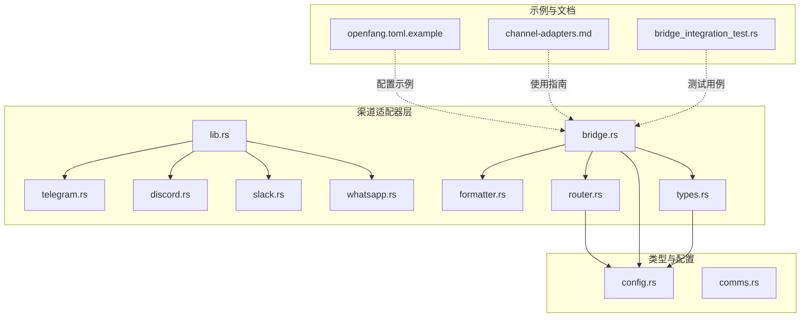
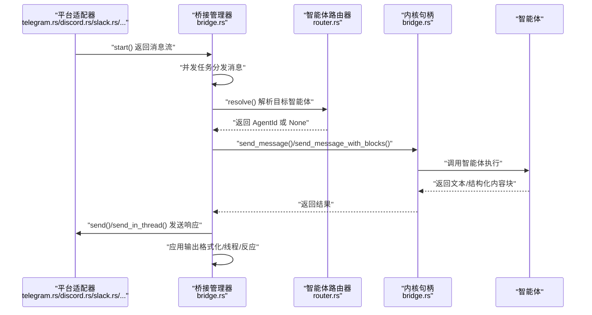
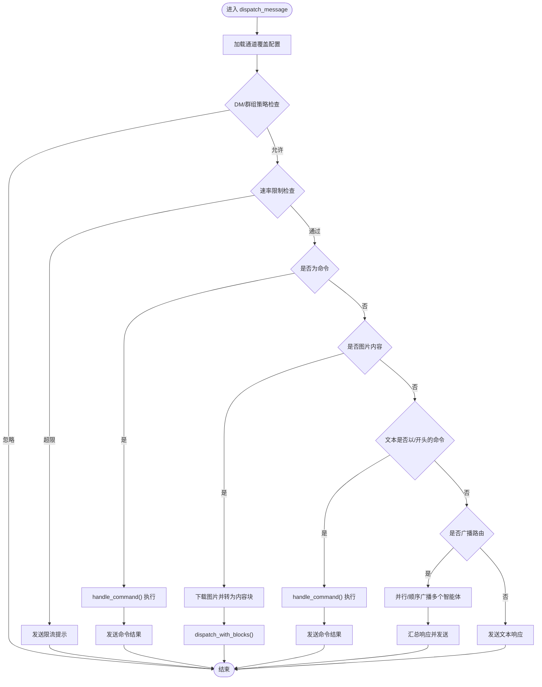
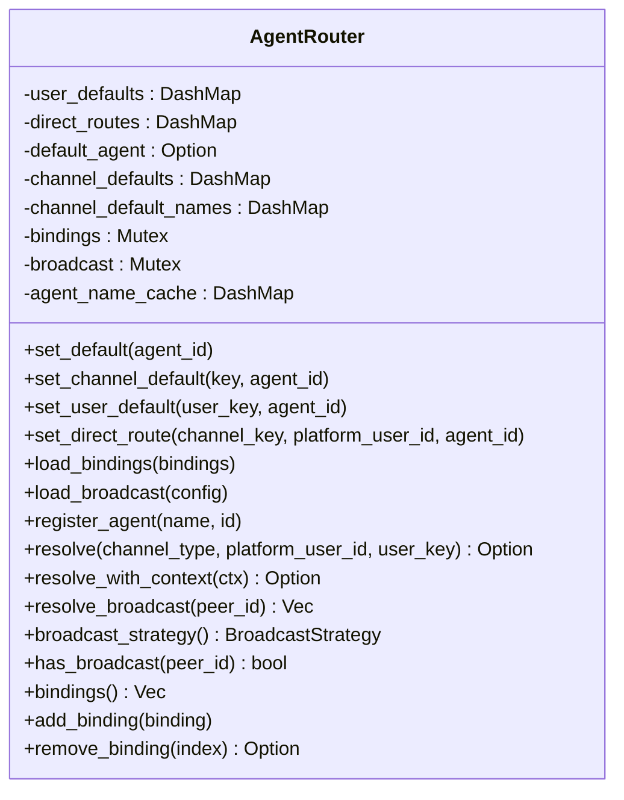
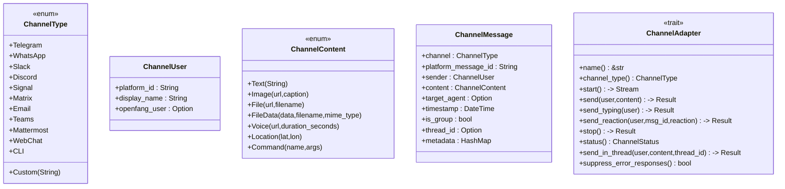
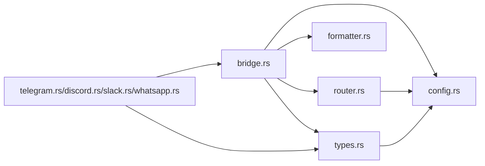

# 消息渠道适配器

<cite>
**本文档引用的文件**
- [lib.rs](file://crates/openfang-channels/src/lib.rs)
- [bridge.rs](file://crates/openfang-channels/src/bridge.rs)
- [router.rs](file://crates/openfang-channels/src/router.rs)
- [types.rs](file://crates/openfang-channels/src/types.rs)
- [formatter.rs](file://crates/openfang-channels/src/formatter.rs)
- [telegram.rs](file://crates/openfang-channels/src/telegram.rs)
- [discord.rs](file://crates/openfang-channels/src/discord.rs)
- [slack.rs](file://crates/openfang-channels/src/slack.rs)
- [whatsapp.rs](file://crates/openfang-channels/src/whatsapp.rs)
- [config.rs](file://crates/openfang-types/src/config.rs)
- [comms.rs](file://crates/openfang-types/src/comms.rs)
- [openfang.toml.example](file://openfang.toml.example)
- [channel-adapters.md](file://docs/channel-adapters.md)
- [bridge_integration_test.rs](file://crates/openfang-channels/tests/bridge_integration_test.rs)
</cite>

## 目录
1. [简介](#简介)
2. [项目结构](#项目结构)
3. [核心组件](#核心组件)
4. [架构总览](#架构总览)
5. [详细组件分析](#详细组件分析)
6. [依赖关系分析](#依赖关系分析)
7. [性能考虑](#性能考虑)
8. [故障排除指南](#故障排除指南)
9. [结论](#结论)
10. [附录](#附录)

## 简介
本文件为 OpenFang 消息渠道适配器的全面集成文档，覆盖 40 种消息平台（Telegram、Discord、Slack、WhatsApp、Signal、Matrix、Email 等）的集成方案。内容包括渠道桥接机制、消息格式化、速率限制策略、DM/群组政策、配置选项与认证方式、API 限制与错误处理、开发指南与自定义渠道集成、测试方法、消息路由与状态同步、会话管理、配置示例、故障排除与性能优化，以及与智能体系统的集成模式。

## 项目结构
OpenFang 的渠道适配器位于 crates/openfang-channels，采用模块化设计，每个平台对应一个适配器模块；核心桥接逻辑集中在 bridge.rs 和 router.rs 中；格式化与通用类型在 formatter.rs 与 types.rs 中定义；配置类型在 openfang-types 中统一管理。

**图表来源**
- [lib.rs:1-55](file://crates/openfang-channels/src/lib.rs#L1-L55)
- [bridge.rs:1-800](file://crates/openfang-channels/src/bridge.rs#L1-L800)
- [router.rs:1-645](file://crates/openfang-channels/src/router.rs#L1-L645)
- [types.rs:1-478](file://crates/openfang-channels/src/types.rs#L1-L478)
- [formatter.rs:1-676](file://crates/openfang-channels/src/formatter.rs#L1-L676)
- [telegram.rs:1-200](file://crates/openfang-channels/src/telegram.rs#L1-L200)
- [discord.rs:1-200](file://crates/openfang-channels/src/discord.rs#L1-L200)
- [slack.rs:1-200](file://crates/openfang-channels/src/slack.rs#L1-L200)
- [whatsapp.rs:1-200](file://crates/openfang-channels/src/whatsapp.rs#L1-L200)
- [config.rs:1-200](file://crates/openfang-types/src/config.rs#L1-L200)
- [comms.rs:1-171](file://crates/openfang-types/src/comms.rs#L1-L171)
- [openfang.toml.example:1-49](file://openfang.toml.example#L1-L49)
- [channel-adapters.md:1-726](file://docs/channel-adapters.md#L1-L726)
- [bridge_integration_test.rs:1-546](file://crates/openfang-channels/tests/bridge_integration_test.rs#L1-L546)

**章节来源**
- [lib.rs:1-55](file://crates/openfang-channels/src/lib.rs#L1-L55)
- [channel-adapters.md:1-726](file://docs/channel-adapters.md#L1-L726)

## 核心组件
- 渠道桥接与分发：BridgeManager 负责启动适配器、接收消息流、并发分发到智能体，并应用输出格式化、线程回复、生命周期反应等策略。
- 智能体路由：AgentRouter 提供绑定匹配、用户默认路由、直接路由、广播路由与系统默认路由的优先级机制。
- 类型与协议：ChannelType、ChannelMessage、ChannelContent、ChannelUser 等统一消息模型；ChannelAdapter 定义适配器接口。
- 输出格式化：formatter.rs 将标准 Markdown 转换为各平台原生格式（Telegram HTML、Slack mrkdwn、纯文本）。
- 速率限制：基于 DashMap 的滑动窗口限流，按用户维度控制每分钟消息数。
- DM/群组策略：通过 ChannelOverrides 控制 DM 响应策略与群组消息策略，支持忽略、仅提及、仅命令、全部响应等。

**章节来源**
- [bridge.rs:271-800](file://crates/openfang-channels/src/bridge.rs#L271-L800)
- [router.rs:28-341](file://crates/openfang-channels/src/router.rs#L28-L341)
- [types.rs:12-280](file://crates/openfang-channels/src/types.rs#L12-L280)
- [formatter.rs:10-676](file://crates/openfang-channels/src/formatter.rs#L10-L676)
- [config.rs:27-113](file://crates/openfang-types/src/config.rs#L27-L113)

## 架构总览
下图展示了从平台消息到智能体执行再到平台回复的完整链路，以及桥接层如何协调适配器、路由与内核交互。

**图表来源**
- [bridge.rs:309-426](file://crates/openfang-channels/src/bridge.rs#L309-L426)
- [router.rs:141-187](file://crates/openfang-channels/src/router.rs#L141-L187)
- [types.rs:215-280](file://crates/openfang-channels/src/types.rs#L215-L280)

## 详细组件分析

### 渠道桥接与分发（BridgeManager）
- 并发分发：为每个适配器的消息流启动独立任务，使用信号量限制并发，避免内存膨胀。
- 生命周期反应：根据 AgentPhase 自动发送平台表情反应，提升用户体验。
- 线程回复：根据 overrides.threading 与平台支持情况，将回复发送到指定 thread_id。
- 输出格式化：根据通道默认或 overrides.output_format 选择格式（Markdown、Telegram HTML、Slack mrkdwn、纯文本）。
- 错误抑制：部分公开广播渠道可抑制内部错误回显，防止泄露至公共空间。

**图表来源**
- [bridge.rs:526-800](file://crates/openfang-channels/src/bridge.rs#L526-L800)

**章节来源**
- [bridge.rs:271-800](file://crates/openfang-channels/src/bridge.rs#L271-L800)

### 智能体路由（AgentRouter）
- 路由优先级：绑定规则（最具体）> 直接路由 > 用户默认 > 通道默认 > 系统默认。
- 绑定匹配：支持按通道、账号、用户、服务器/群组、角色进行匹配，按“特定性”排序。
- 广播路由：支持对特定用户的目标智能体集合进行并行或顺序广播。
- 运行时更新：支持动态添加/移除绑定与广播配置。

**图表来源**
- [router.rs:28-341](file://crates/openfang-channels/src/router.rs#L28-L341)

**章节来源**
- [router.rs:28-341](file://crates/openfang-channels/src/router.rs#L28-L341)

### 类型与协议（ChannelType/ChannelMessage/ChannelAdapter）
- ChannelType：统一表示渠道类型，核心 9 种有具体变体，其余使用 Custom(String)。
- ChannelMessage：跨平台统一消息载体，包含发送者、内容、时间戳、是否群组、线程 ID、元数据等。
- ChannelAdapter：适配器接口，定义 start()/send()/send_typing()/send_reaction()/stop()/status()/send_in_thread()/suppress_error_responses() 等能力。

**图表来源**
- [types.rs:12-280](file://crates/openfang-channels/src/types.rs#L12-L280)

**章节来源**
- [types.rs:12-280](file://crates/openfang-channels/src/types.rs#L12-L280)

### 输出格式化（formatter.rs）
- 支持四种输出格式：Markdown（默认）、Telegram HTML、Slack mrkdwn、纯文本。
- 特定平台增强：WeCom 使用更强的纯文本转换，避免 Markdown 泄漏。
- 内联与块级元素：支持粗体、斜体、行内代码、链接、标题、列表、代码块、引用块等。

**章节来源**
- [formatter.rs:10-676](file://crates/openfang-channels/src/formatter.rs#L10-L676)

### 速率限制（ChannelRateLimiter）
- 滑动窗口：按用户键（channel_type:platform_id）维护最近 60 秒内的消息时间戳。
- 动态阈值：overrides.rate_limit_per_user 设置每分钟最大消息数，0 表示不限制。
- 拒绝策略：超过阈值时立即返回限流提示。

**章节来源**
- [bridge.rs:229-269](file://crates/openfang-channels/src/bridge.rs#L229-L269)

### DM/群组策略（ChannelOverrides）
- DmPolicy：Respond（默认）、AllowedOnly、Ignore。
- GroupPolicy：All（默认）、MentionOnly、CommandsOnly、Ignore。
- 策略在分发前执行，未命中策略的消息不进入智能体，节省 LLM 资源。

**章节来源**
- [config.rs:27-113](file://crates/openfang-types/src/config.rs#L27-L113)
- [bridge.rs:557-602](file://crates/openfang-channels/src/bridge.rs#L557-L602)

### 具体渠道适配器

#### Telegram 适配器（telegram.rs）
- 协议：Bot API 长轮询，30 秒超时，失败指数退避（1–60 秒）。
- 安全：令牌使用 Zeroizing，API 调用前清理不受支持的 HTML 标签。
- 限制：单条消息最多 4096 字符，自动拆分；支持 thread_id 论坛主题。
- 验证：通过 getMe 校验令牌有效性。

**章节来源**
- [telegram.rs:1-200](file://crates/openfang-channels/src/telegram.rs#L1-L200)

#### Discord 适配器（discord.rs）
- 协议：Gateway WebSocket v10，REST API 发送消息；自动心跳、重连与会话恢复。
- 限制：单条消息最多 2000 字符，自动拆分。
- 安全：令牌使用 Zeroizing，支持白名单服务器/用户过滤。

**章节来源**
- [discord.rs:1-200](file://crates/openfang-channels/src/discord.rs#L1-L200)

#### Slack 适配器（slack.rs）
- 协议：Socket Mode WebSocket（app token）接收事件，Web API（bot token）发送消息。
- 线程：支持 thread_ts 自动线程回复，带 TTL 清理。
- 限制：单条消息最多 3000 字符，自动拆分。
- 验证：auth.test 校验 bot 令牌。

**章节来源**
- [slack.rs:1-200](file://crates/openfang-channels/src/slack.rs#L1-L200)

#### WhatsApp 适配器（whatsapp.rs）
- 模式：Cloud API webhook（Meta 商业账户）或本地网关（Baileys）QR/Web 模式。
- Cloud API：官方 Business Cloud API，支持长文本拆分与 read 状态标记。
- Web 模式：通过本地网关转发消息，适合无 Meta 账户场景。

**章节来源**
- [whatsapp.rs:1-200](file://crates/openfang-channels/src/whatsapp.rs#L1-L200)

### 开发指南与自定义适配器
- 实现 ChannelAdapter：参考 trait 定义，注意 Zeroizing 密钥、watch::Receiver 协调关闭、指数退避、消息长度限制拆分。
- 注册模块：在 lib.rs 中导出新模块。
- 桥接集成：在 openfang-api 的通道桥接处初始化新适配器。
- 配置支持：在 openfang-types 中扩展配置结构，并在 config.toml 解析中支持。
- CLI 向导：在 CLI 中添加新平台的 setup 步骤。
- 测试：使用 bridge_integration_test.rs 的模式编写集成测试，模拟消息流与断言。

**章节来源**
- [channel-adapters.md:563-726](file://docs/channel-adapters.md#L563-L726)
- [bridge_integration_test.rs:1-546](file://crates/openfang-channels/tests/bridge_integration_test.rs#L1-L546)

## 依赖关系分析
- 组件耦合：BridgeManager 依赖 AgentRouter、ChannelBridgeHandle、ChannelRateLimiter；适配器实现 ChannelAdapter 接口。
- 外部依赖：reqwest、tokio-tungstenite、dashmap、futures、tracing、zeroize 等。
- 配置依赖：openfang-types 提供 ChannelOverrides、DmPolicy、GroupPolicy、OutputFormat 等类型。

**图表来源**
- [bridge.rs:1-800](file://crates/openfang-channels/src/bridge.rs#L1-L800)
- [router.rs:1-645](file://crates/openfang-channels/src/router.rs#L1-L645)
- [types.rs:1-478](file://crates/openfang-channels/src/types.rs#L1-L478)
- [formatter.rs:1-676](file://crates/openfang-channels/src/formatter.rs#L1-L676)
- [config.rs:1-200](file://crates/openfang-types/src/config.rs#L1-L200)

**章节来源**
- [Cargo.toml:8-40](file://crates/openfang-channels/Cargo.toml#L8-L40)

## 性能考虑
- 并发分发：BridgeManager 使用信号量限制并发任务数量，避免突发流量导致内存暴涨。
- 滑动窗口限流：每用户每通道维护最近 60 秒消息时间戳，平滑控制速率。
- 消息拆分：统一使用 split_message() 按换行拆分，减少平台长度限制带来的多次往返。
- 心跳与刷新：长 LLM 调用期间定时刷新打字指示与生命周期反应，改善用户体验。
- 缓存与索引：AgentRouter 使用 DashMap 与名称缓存，降低查找开销。

[本节为通用指导，无需特定文件引用]

## 故障排除指南
- 令牌无效：验证 getMe/auth.test 等校验接口返回，检查环境变量与权限范围。
- 连接失败：查看指数退避日志，确认网络可达性与代理设置。
- 速率限制：检查 overrides.rate_limit_per_user 是否过低，或用户是否被误判。
- 策略忽略：确认 DM/群组策略配置，确保未误设为 Ignore 或 CommandsOnly。
- 线程回复：确认平台支持 thread_id，且 overrides.threading 已启用。
- 错误抑制：部分公开渠道（如 Mastodon）可能抑制内部错误回显，需查看内核日志定位问题。

**章节来源**
- [telegram.rs:76-97](file://crates/openfang-channels/src/telegram.rs#L76-L97)
- [slack.rs:71-92](file://crates/openfang-channels/src/slack.rs#L71-L92)
- [bridge.rs:557-602](file://crates/openfang-channels/src/bridge.rs#L557-L602)

## 结论
OpenFang 的渠道适配器通过统一的桥接层与路由机制，实现了对 40 种消息平台的一致接入。其设计强调安全性（令牌零化）、可靠性（指数退避/心跳/会话恢复）、可观测性（生命周期反应/状态跟踪）与可扩展性（自定义适配器）。结合配置覆盖、策略控制与格式化工具，可在多平台环境中稳定地驱动智能体执行与交互。

[本节为总结，无需特定文件引用]

## 附录

### 渠道配置示例
- 示例配置文件位置与字段参考：[openfang.toml.example:1-49](file://openfang.toml.example#L1-L49)
- 通道覆盖字段参考：[config.rs:71-113](file://crates/openfang-types/src/config.rs#L71-L113)
- 通道适配器使用指南与环境变量：[channel-adapters.md:115-166](file://docs/channel-adapters.md#L115-L166)

**章节来源**
- [openfang.toml.example:1-49](file://openfang.toml.example#L1-L49)
- [config.rs:71-113](file://crates/openfang-types/src/config.rs#L71-L113)
- [channel-adapters.md:115-166](file://docs/channel-adapters.md#L115-L166)

### 测试方法
- 集成测试：使用 MockAdapter 与 MockHandle，验证消息分发、命令处理、广播路由与生命周期。
- 测试文件参考：[bridge_integration_test.rs:1-546](file://crates/openfang-channels/tests/bridge_integration_test.rs#L1-L546)

**章节来源**
- [bridge_integration_test.rs:1-546](file://crates/openfang-channels/tests/bridge_integration_test.rs#L1-L546)