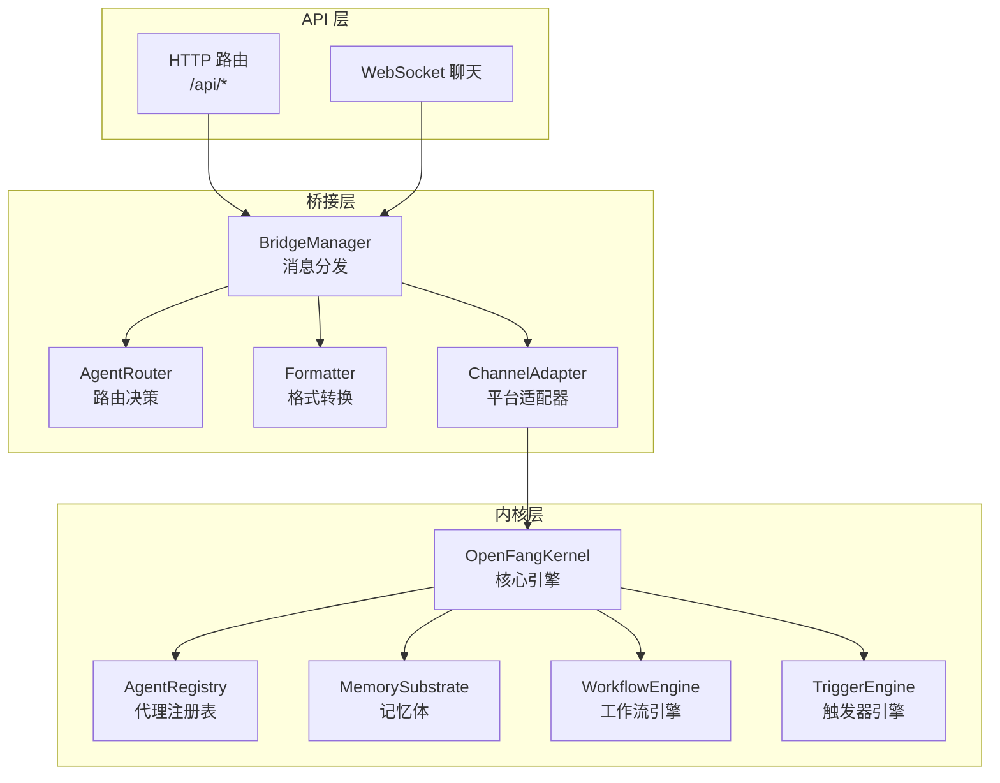
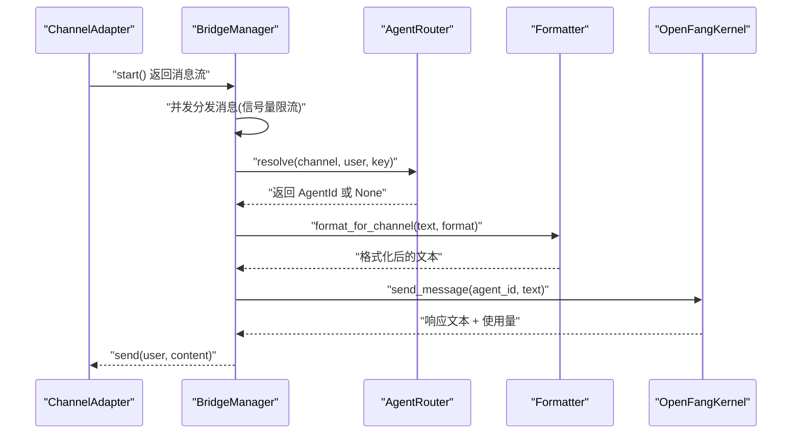
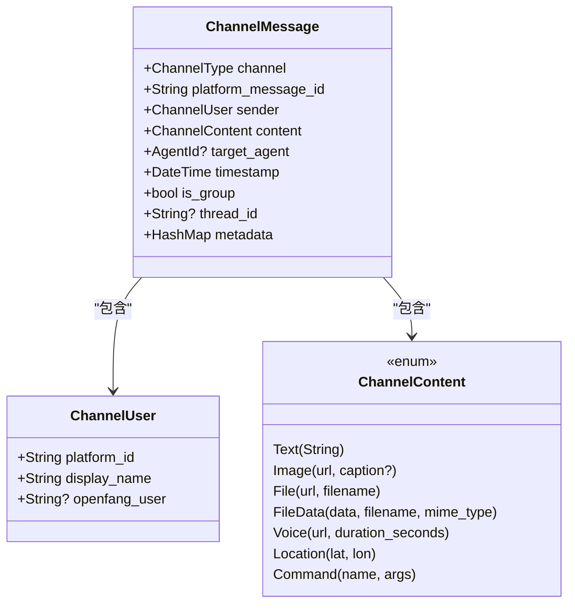
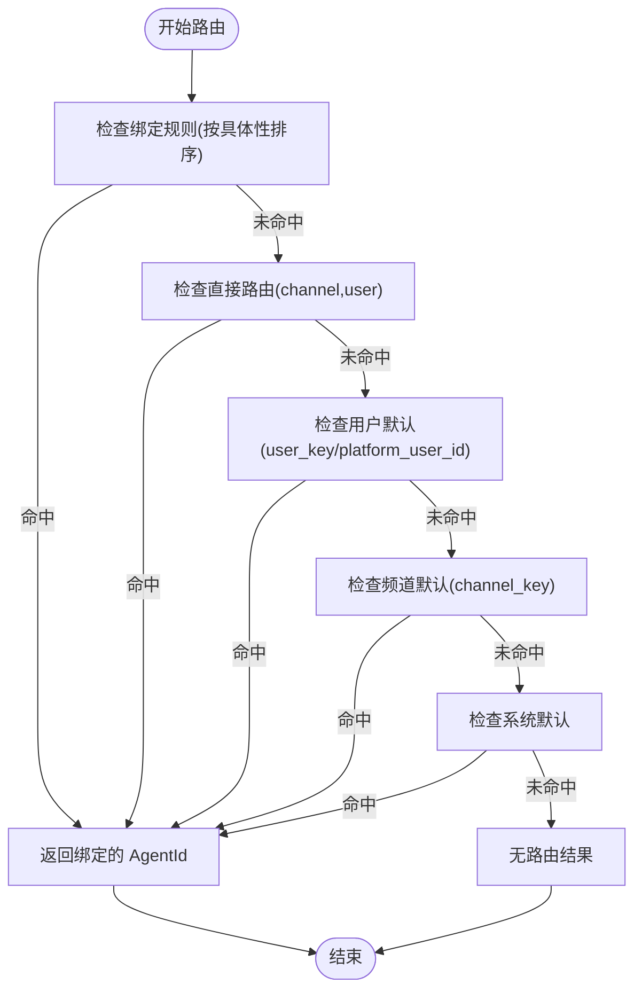
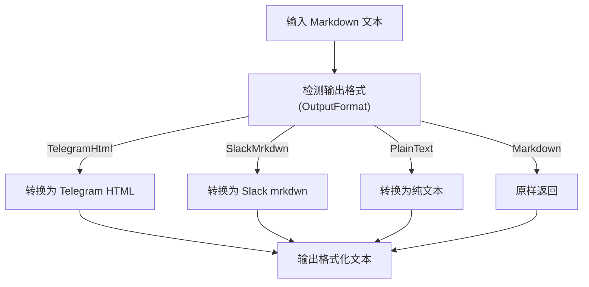
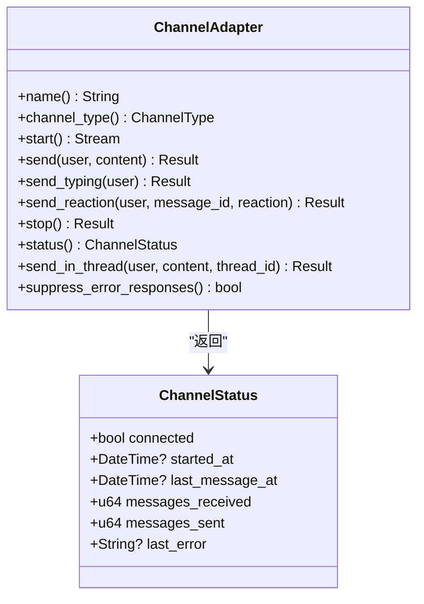
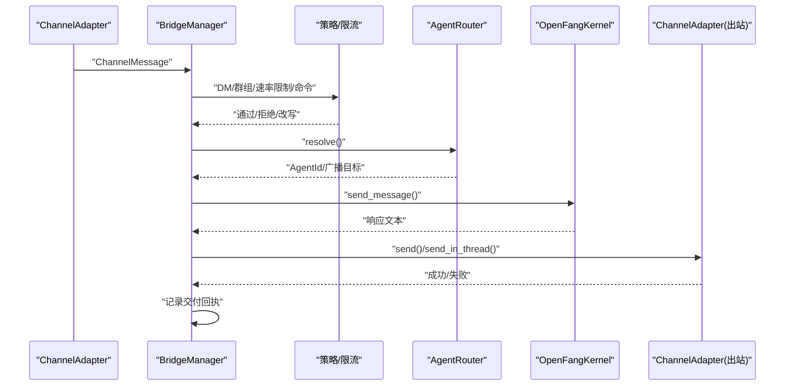
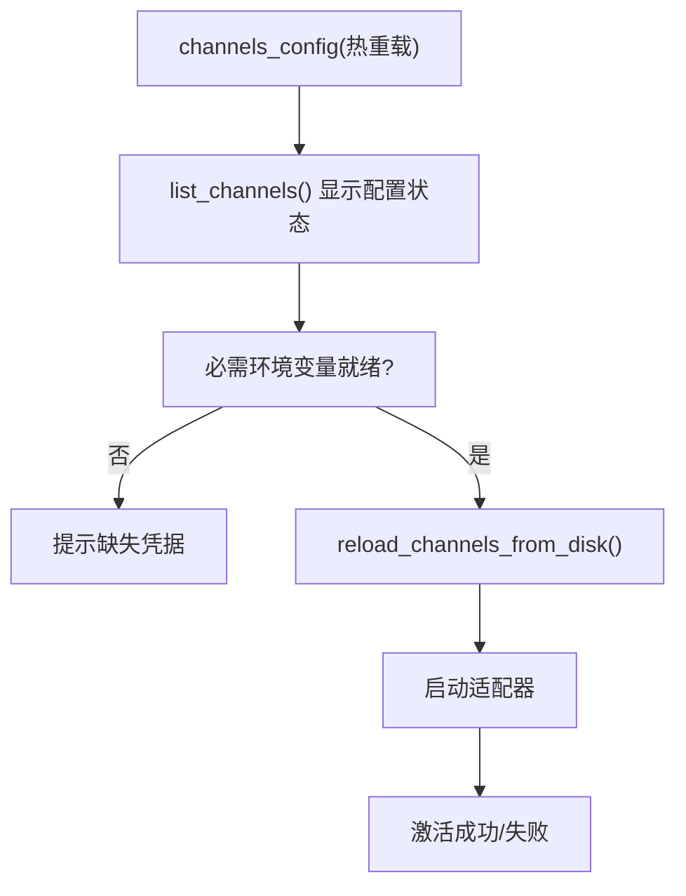
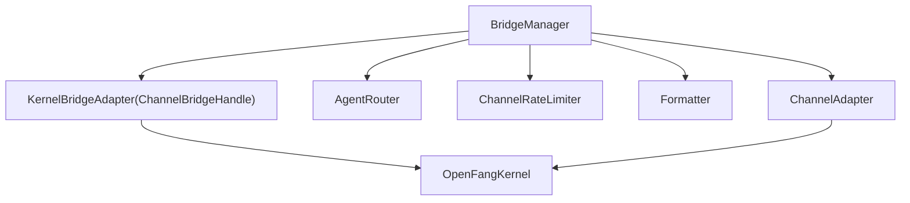

# 渠道桥接机制

<cite>
**本文档引用的文件**
- [channel_bridge.rs](file://crates/openfang-api/src/channel_bridge.rs)
- [bridge.rs](file://crates/openfang-channels/src/bridge.rs)
- [types.rs](file://crates/openfang-channels/src/types.rs)
- [formatter.rs](file://crates/openfang-channels/src/formatter.rs)
- [router.rs](file://crates/openfang-channels/src/router.rs)
- [message.rs](file://crates/openfang-types/src/message.rs)
- [comms.rs](file://crates/openfang-types/src/comms.rs)
- [lib.rs](file://crates/openfang-api/src/lib.rs)
- [routes.rs](file://crates/openfang-api/src/routes.rs)
- [kernel.rs](file://crates/openfang-kernel/src/kernel.rs)
- [lib.rs](file://crates/openfang-channels/src/lib.rs)
- [lib.rs](file://crates/openfang-kernel/src/lib.rs)
</cite>

## 目录
1. [引言](#引言)
2. [项目结构](#项目结构)
3. [核心组件](#核心组件)
4. [架构总览](#架构总览)
5. [详细组件分析](#详细组件分析)
6. [依赖关系分析](#依赖关系分析)
7. [性能考虑](#性能考虑)
8. [故障排除指南](#故障排除指南)
9. [结论](#结论)
10. [附录](#附录)

## 引言
本技术文档围绕 OpenFang 的渠道桥接机制展开，系统性阐述桥接层的整体架构设计、消息路由算法、格式转换引擎、状态同步机制。重点解析 ChannelMessage 统一事件模型的设计理念、消息生命周期管理、错误传播策略与重试机制，并覆盖桥接器的配置管理、动态加载与热更新、监控告警等运维能力。同时给出消息格式标准化、内容过滤、安全检查与性能优化的技术实现要点，以及桥接器开发指南、自定义适配器模板、测试框架使用与调试工具介绍，最后解释桥接层与内核系统的集成模式与通信协议。

## 项目结构
OpenFang 的渠道桥接机制由三层协同构成：
- API 层：提供 HTTP/WebSocket 接口与桥接器入口，负责对外暴露管理与聊天能力。
- 桥接层：连接内核与各渠道适配器，统一消息格式、执行路由与策略控制。
- 内核层：承载代理生命周期、内存、调度、工作流、触发器等核心能力。

**图表来源**
- [lib.rs:1-18](file://crates/openfang-api/src/lib.rs#L1-L18)
- [bridge.rs:272-382](file://crates/openfang-channels/src/bridge.rs#L272-L382)
- [router.rs:28-45](file://crates/openfang-channels/src/router.rs#L28-L45)
- [formatter.rs:10-27](file://crates/openfang-channels/src/formatter.rs#L10-L27)
- [kernel.rs:60-164](file://crates/openfang-kernel/src/kernel.rs#L60-L164)

**章节来源**
- [lib.rs:1-18](file://crates/openfang-api/src/lib.rs#L1-L18)
- [lib.rs:1-55](file://crates/openfang-channels/src/lib.rs#L1-L55)
- [lib.rs:1-30](file://crates/openfang-kernel/src/lib.rs#L1-L30)

## 核心组件
- ChannelBridgeHandle：桥接层对内核的操作接口抽象，定义了发送消息、查找/启动代理、会话管理、自动化能力（工作流、触发器、定时任务、审批）等能力。
- BridgeManager：桥接器管理器，持有 ChannelBridgeHandle 与 AgentRouter，负责启动/停止适配器、从适配器流中并发分发消息、速率限制与策略控制。
- AgentRouter：代理路由器，支持绑定规则、直接路由、用户默认、频道默认与系统默认的多级优先级路由，支持广播策略。
- ChannelAdapter：平台适配器接口，定义了 start()/send()/send_typing()/send_reaction()/stop()/status() 等方法。
- Formatter：消息格式化器，将标准 Markdown 转换为各平台特定的标记语言或纯文本。
- ChannelMessage：统一的跨平台消息事件模型，包含通道类型、发送者、内容、目标代理、时间戳、是否群聊、线程 ID、元数据等字段。
- OpenFangKernel：内核核心，提供代理生命周期管理、内存、调度、工作流、触发器、后台执行、审计日志、计量引擎、MCP 连接、浏览器管理、媒体理解、TTS、设备配对、嵌入驱动、手（Hands）注册表、扩展集成等能力。

**章节来源**
- [bridge.rs:27-227](file://crates/openfang-channels/src/bridge.rs#L27-L227)
- [bridge.rs:272-382](file://crates/openfang-channels/src/bridge.rs#L272-L382)
- [router.rs:28-45](file://crates/openfang-channels/src/router.rs#L28-L45)
- [types.rs:215-280](file://crates/openfang-channels/src/types.rs#L215-L280)
- [formatter.rs:10-27](file://crates/openfang-channels/src/formatter.rs#L10-L27)
- [types.rs:74-96](file://crates/openfang-channels/src/types.rs#L74-L96)
- [kernel.rs:60-164](file://crates/openfang-kernel/src/kernel.rs#L60-L164)

## 架构总览
桥接层通过 KernelBridgeAdapter 实现 ChannelBridgeHandle，将内核能力暴露给各渠道适配器。BridgeManager 订阅适配器的消息流，按策略进行路由、格式化、速率限制与并发控制，最终调用内核的代理执行链路。

**图表来源**
- [bridge.rs:309-373](file://crates/openfang-channels/src/bridge.rs#L309-L373)
- [router.rs:141-187](file://crates/openfang-channels/src/router.rs#L141-L187)
- [formatter.rs:10-18](file://crates/openfang-channels/src/formatter.rs#L10-L18)
- [channel_bridge.rs:70-123](file://crates/openfang-api/src/channel_bridge.rs#L70-L123)

**章节来源**
- [channel_bridge.rs:64-123](file://crates/openfang-api/src/channel_bridge.rs#L64-L123)
- [bridge.rs:309-373](file://crates/openfang-channels/src/bridge.rs#L309-L373)
- [router.rs:141-187](file://crates/openfang-channels/src/router.rs#L141-L187)
- [formatter.rs:10-18](file://crates/openfang-channels/src/formatter.rs#L10-L18)

## 详细组件分析

### ChannelMessage 统一事件模型
ChannelMessage 是桥接层的核心数据结构，用于抽象不同平台的消息事件，确保上层逻辑无需关心底层差异。其关键字段包括：
- channel：通道类型（如 Telegram、Discord、Slack 等）
- platform_message_id：平台侧消息 ID
- sender：发送者（平台用户 ID、显示名、可选 OpenFang 用户映射）
- content：消息内容（文本、图片、文件、语音、位置、命令等）
- target_agent：可选的目标代理（直连路由）
- timestamp：UTC 时间戳
- is_group：是否来自群组
- thread_id：线程 ID（用于支持话题/论坛场景）
- metadata：平台元数据（如提及标记、sender_user_id 等）

该模型的设计理念是“统一抽象 + 可扩展元数据”，既保证跨平台一致性，又允许适配器注入平台特有信息供上层策略使用。

**图表来源**
- [types.rs:74-96](file://crates/openfang-channels/src/types.rs#L74-L96)
- [types.rs:29-38](file://crates/openfang-channels/src/types.rs#L29-L38)
- [types.rs:42-71](file://crates/openfang-channels/src/types.rs#L42-L71)

**章节来源**
- [types.rs:74-96](file://crates/openfang-channels/src/types.rs#L74-L96)
- [types.rs:29-38](file://crates/openfang-channels/src/types.rs#L29-L38)
- [types.rs:42-71](file://crates/openfang-channels/src/types.rs#L42-L71)

### 消息路由算法
AgentRouter 提供多级路由优先级：绑定规则 > 直接路由 > 用户默认 > 频道默认 > 系统默认。绑定规则支持按频道、账号、用户、服务器与角色匹配，且按“具体性”排序，确保更具体的规则优先生效。广播路由支持并行/串行两种策略，便于多代理协作。

**图表来源**
- [router.rs:141-187](file://crates/openfang-channels/src/router.rs#L141-L187)
- [router.rs:224-254](file://crates/openfang-channels/src/router.rs#L224-L254)

**章节来源**
- [router.rs:141-187](file://crates/openfang-channels/src/router.rs#L141-L187)
- [router.rs:224-254](file://crates/openfang-channels/src/router.rs#L224-L254)

### 格式转换引擎
Formatter 将标准 Markdown 转换为各平台特定的标记语言或纯文本：
- Telegram HTML：支持粗体、斜体、代码、链接、块引用、列表、代码块等
- Slack mrkdwn：支持粗体、链接等
- WeCom 特殊处理：避免 Markdown 泄漏到企业聊天环境
- 纯文本：剥离所有格式，仅保留语义

**图表来源**
- [formatter.rs:10-27](file://crates/openfang-channels/src/formatter.rs#L10-L27)
- [formatter.rs:29-159](file://crates/openfang-channels/src/formatter.rs#L29-L159)
- [formatter.rs:288-327](file://crates/openfang-channels/src/formatter.rs#L288-L327)
- [formatter.rs:460-513](file://crates/openfang-channels/src/formatter.rs#L460-L513)
- [formatter.rs:515-564](file://crates/openfang-channels/src/formatter.rs#L515-L564)

**章节来源**
- [formatter.rs:10-27](file://crates/openfang-channels/src/formatter.rs#L10-L27)
- [formatter.rs:29-159](file://crates/openfang-channels/src/formatter.rs#L29-L159)
- [formatter.rs:288-327](file://crates/openfang-channels/src/formatter.rs#L288-L327)
- [formatter.rs:460-513](file://crates/openfang-channels/src/formatter.rs#L460-L513)
- [formatter.rs:515-564](file://crates/openfang-channels/src/formatter.rs#L515-L564)

### 状态同步机制
桥接层通过 ChannelAdapter 的 status() 方法与 ChannelStatus 结构体提供健康状态上报，包含连接状态、启动时间、最后消息时间、收发计数与最后错误等字段。BridgeManager 在启动适配器时订阅其状态变化，用于监控与告警。

**图表来源**
- [types.rs:215-280](file://crates/openfang-channels/src/types.rs#L215-L280)
- [types.rs:195-210](file://crates/openfang-channels/src/types.rs#L195-L210)

**章节来源**
- [types.rs:215-280](file://crates/openfang-channels/src/types.rs#L215-L280)
- [types.rs:195-210](file://crates/openfang-channels/src/types.rs#L195-L210)

### 错误传播策略与重试机制
- 错误传播：ChannelAdapter 可声明是否抑制内部错误响应（如公开广播频道），以避免将错误内容泄露到公共空间；错误会被记录但不一定回传给用户。
- 重试机制：当前桥接层未内置通用重试逻辑，但内核在代理执行链路中实现了重试与降级策略（见内核层）。桥接层通过 ChannelBridgeHandle 的错误返回与上层处理配合，确保错误不会阻塞消息流。
- 速率限制：ChannelRateLimiter 基于用户维度的滑动窗口实现每分钟最大消息数限制，超限则立即返回错误提示，避免下游过载。
- 会话一致性：内核为每个代理维护消息锁，确保同一代理的并发请求串行化，防止会话状态冲突。

**章节来源**
- [bridge.rs:232-269](file://crates/openfang-channels/src/bridge.rs#L232-L269)
- [bridge.rs:238-269](file://crates/openfang-channels/src/bridge.rs#L238-L269)
- [kernel.rs:158-161](file://crates/openfang-kernel/src/kernel.rs#L158-L161)

### 消息生命周期管理
- 入站：适配器 start() 流产生 ChannelMessage，BridgeManager 并发分发。
- 策略：应用 DM/群组策略、速率限制、命令处理、图像下载与多模态内容块构建。
- 路由：根据 AgentRouter 决策选择目标代理或广播。
- 执行：调用内核 send_message，执行代理逻辑，生成响应。
- 出站：格式化后通过适配器 send()/send_in_thread() 发送，记录交付回执。

**图表来源**
- [bridge.rs:529-800](file://crates/openfang-channels/src/bridge.rs#L529-L800)
- [bridge.rs:402-426](file://crates/openfang-channels/src/bridge.rs#L402-L426)
- [kernel.rs:168-270](file://crates/openfang-kernel/src/kernel.rs#L168-L270)

**章节来源**
- [bridge.rs:529-800](file://crates/openfang-channels/src/bridge.rs#L529-L800)
- [bridge.rs:402-426](file://crates/openfang-channels/src/bridge.rs#L402-L426)
- [kernel.rs:168-270](file://crates/openfang-kernel/src/kernel.rs#L168-L270)

### 配置管理、动态加载与热更新
- 配置来源：channels_config 通过热重载保持与磁盘配置一致，list_channels 动态反映当前已配置的适配器。
- 启动流程：API 层调用 reload_channels_from_disk，激活已配置的适配器并返回启动结果。
- 字段校验：列出适配器时检查必需环境变量是否就绪，辅助运维快速定位配置问题。
- 运行时更新：BridgeManager 支持停止与重启，结合内核的配置热重载实现平滑变更。

**图表来源**
- [routes.rs:2491-2655](file://crates/openfang-api/src/routes.rs#L2491-L2655)

**章节来源**
- [routes.rs:2491-2655](file://crates/openfang-api/src/routes.rs#L2491-L2655)

### 监控告警
- 交付回执：内核维护 DeliveryTracker，记录每个代理的最近交付回执，支持清理与查询，避免无限增长。
- 日志与审计：API 层在关键操作（如签名验证失败、关机）记录审计日志，便于追踪。
- 健康状态：适配器 status() 返回连接状态与错误，便于上层监控系统采集。

**章节来源**
- [kernel.rs:168-270](file://crates/openfang-kernel/src/kernel.rs#L168-L270)
- [routes.rs:755-764](file://crates/openfang-api/src/routes.rs#L755-L764)
- [types.rs:195-210](file://crates/openfang-channels/src/types.rs#L195-L210)

### 桥接器开发指南与自定义适配器模板
- 实现 ChannelAdapter 接口：至少实现 name()/channel_type()/start()/send()/stop()，必要时覆写 send_typing()/send_reaction()/send_in_thread()/status()。
- 消息流：start() 返回异步流，逐条产出 ChannelMessage；注意处理断开与错误。
- 命令与策略：遵循桥接层的命令前缀与策略（DM/群组、速率限制、线程）。
- 安全与合规：遵守速率限制、错误抑制策略，避免泄露敏感信息。
- 测试：参考现有适配器的单元测试，覆盖序列化、拆分消息、Emoji 映射等。

**章节来源**
- [types.rs:215-280](file://crates/openfang-channels/src/types.rs#L215-L280)
- [types.rs:282-309](file://crates/openfang-channels/src/types.rs#L282-L309)
- [types.rs:311-477](file://crates/openfang-channels/src/types.rs#L311-L477)

### 测试框架与调试工具
- 单元测试：各模块提供测试用例，覆盖序列化、拆分消息、相位 Emoji、交付回执等。
- 调试建议：启用详细日志，观察 BridgeManager 的并发分发、AgentRouter 的路由命中、Formatter 的输出差异；通过 API 查询状态与会话历史辅助定位问题。

**章节来源**
- [types.rs:311-477](file://crates/openfang-channels/src/types.rs#L311-L477)

## 依赖关系分析
桥接层的关键依赖关系如下：
- ChannelBridgeHandle 由 KernelBridgeAdapter 实现，依赖 OpenFangKernel 的代理执行、注册表、工作流、触发器、定时任务、审批等子系统。
- BridgeManager 依赖 AgentRouter、ChannelRateLimiter、Formatter 与 ChannelAdapter 抽象。
- ChannelAdapter 依赖平台 SDK/HTTP 库，向上提供统一 ChannelMessage 流。
- OpenFangKernel 作为中心枢纽，协调代理、内存、调度、工作流、触发器、后台执行、审计、计量、MCP、浏览器、媒体理解、TTS、配对、嵌入、手、扩展等。

**图表来源**
- [channel_bridge.rs:64-123](file://crates/openfang-api/src/channel_bridge.rs#L64-L123)
- [bridge.rs:272-382](file://crates/openfang-channels/src/bridge.rs#L272-L382)
- [router.rs:28-45](file://crates/openfang-channels/src/router.rs#L28-L45)
- [formatter.rs:10-27](file://crates/openfang-channels/src/formatter.rs#L10-L27)
- [types.rs:215-280](file://crates/openfang-channels/src/types.rs#L215-L280)

**章节来源**
- [channel_bridge.rs:64-123](file://crates/openfang-api/src/channel_bridge.rs#L64-L123)
- [bridge.rs:272-382](file://crates/openfang-channels/src/bridge.rs#L272-L382)
- [router.rs:28-45](file://crates/openfang-channels/src/router.rs#L28-L45)
- [formatter.rs:10-27](file://crates/openfang-channels/src/formatter.rs#L10-L27)
- [types.rs:215-280](file://crates/openfang-channels/src/types.rs#L215-L280)

## 性能考虑
- 并发分发：BridgeManager 使用信号量限制并发分发任务数量，避免突发流量导致内存膨胀。
- 代理串行化：内核为同一代理维护消息锁，确保会话一致性的同时避免过度竞争。
- 速率限制：基于用户维度的滑动窗口限制每分钟消息数，保护下游服务。
- 输出格式化：按平台选择最优格式，减少无效渲染与传输体积。
- 交付回执：限制每代理与全局回执数量，避免内存无限增长。

**章节来源**
- [bridge.rs:320-323](file://crates/openfang-channels/src/bridge.rs#L320-L323)
- [bridge.rs:238-269](file://crates/openfang-channels/src/bridge.rs#L238-L269)
- [kernel.rs:168-270](file://crates/openfang-kernel/src/kernel.rs#L168-L270)

## 故障排除指南
- 代理未找到：当路由缓存中的 UUID 失效时，尝试按频道默认代理名称重新解析并更新缓存。
- 速率限制：收到“超过每分钟消息数”提示时，等待窗口清空或降低发送频率。
- 错误抑制：某些公开广播频道会抑制内部错误响应，需通过日志与审计追踪定位。
- 配置问题：通过 list_channels 检查必需环境变量是否就绪，确认热重载是否成功激活适配器。
- 交付失败：检查 DeliveryTracker 中的回执与错误摘要，关注 PII 清理与长度限制。

**章节来源**
- [bridge.rs:487-524](file://crates/openfang-channels/src/bridge.rs#L487-L524)
- [bridge.rs:238-269](file://crates/openfang-channels/src/bridge.rs#L238-L269)
- [routes.rs:2491-2655](file://crates/openfang-api/src/routes.rs#L2491-L2655)
- [kernel.rs:168-270](file://crates/openfang-kernel/src/kernel.rs#L168-L270)

## 结论
OpenFang 的渠道桥接机制通过统一的 ChannelMessage 事件模型、灵活的 AgentRouter 路由策略、强大的格式转换引擎与完善的配置热重载能力，实现了对 40+ 个平台的稳定接入。桥接层在保证跨平台一致性的同时，提供了丰富的策略控制（DM/群组、速率限制、线程）、可观测性（健康状态、交付回执、审计日志）与高可用性（并发分发、会话串行化、错误抑制）。对于开发者而言，遵循 ChannelAdapter 接口规范与安全合规要求，即可快速扩展新的渠道适配器。

## 附录
- 消息格式标准化：统一使用 Markdown 作为中间格式，再由 Formatter 转换为目标平台标记语言或纯文本。
- 内容过滤：通过 ChannelRateLimiter 与策略配置限制消息规模与频率；对图像进行类型与大小校验。
- 安全检查：对上传附件进行类型校验与路径遍历防护；对错误信息进行 PII 清理与长度限制；对签名清单进行验证。
- 性能优化：并发分发限流、代理消息串行化、平台特定格式优化、交付回执容量控制。

**章节来源**
- [formatter.rs:10-27](file://crates/openfang-channels/src/formatter.rs#L10-L27)
- [message.rs:104-127](file://crates/openfang-types/src/message.rs#L104-L127)
- [routes.rs:244-289](file://crates/openfang-api/src/routes.rs#L244-L289)
- [kernel.rs:168-270](file://crates/openfang-kernel/src/kernel.rs#L168-L270)