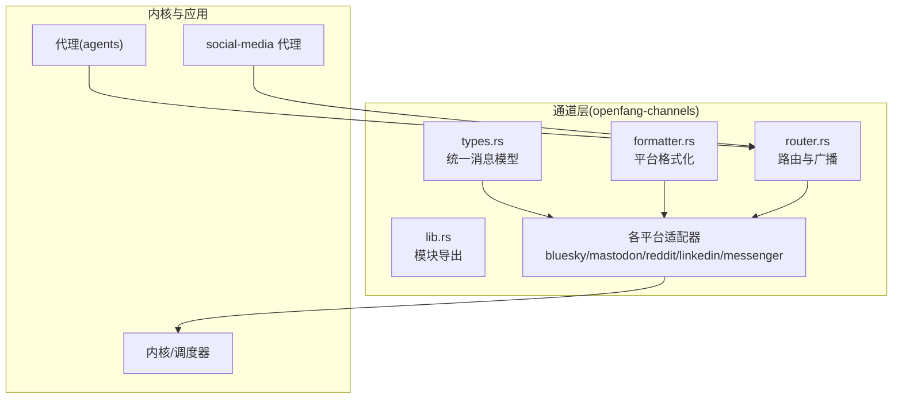
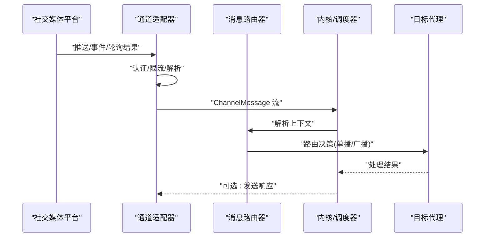
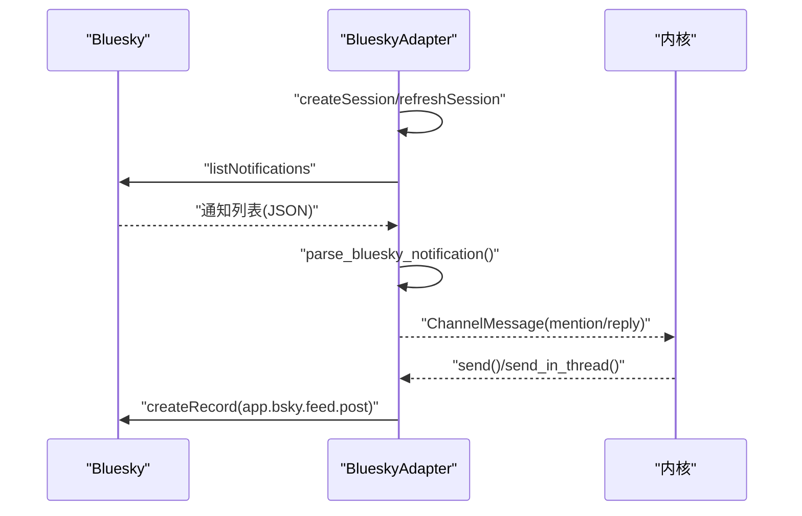
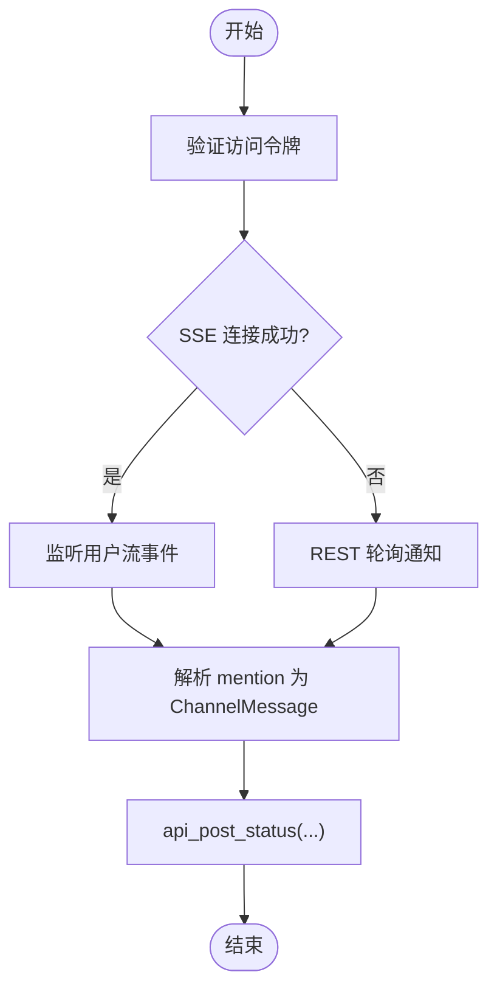
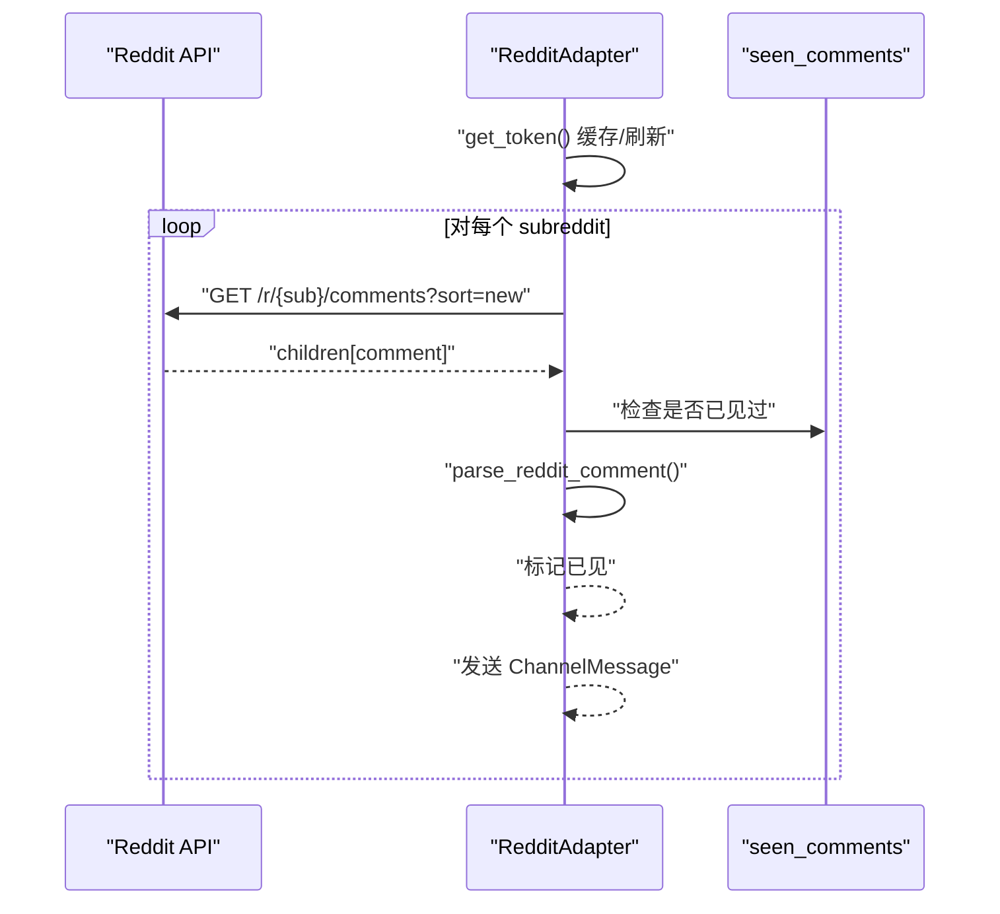
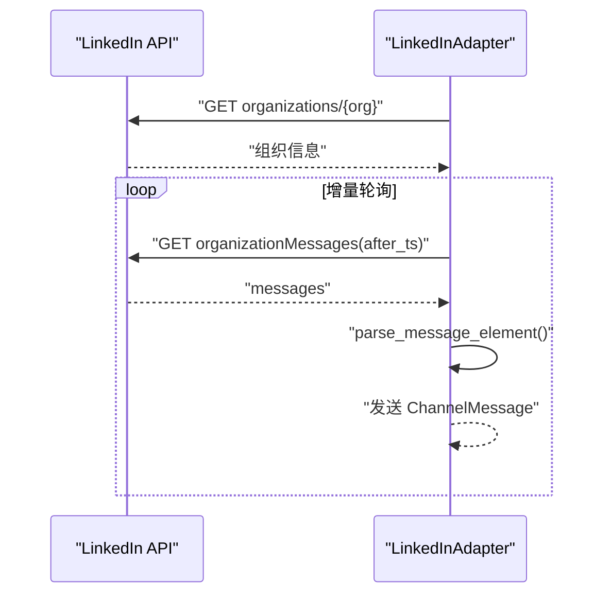
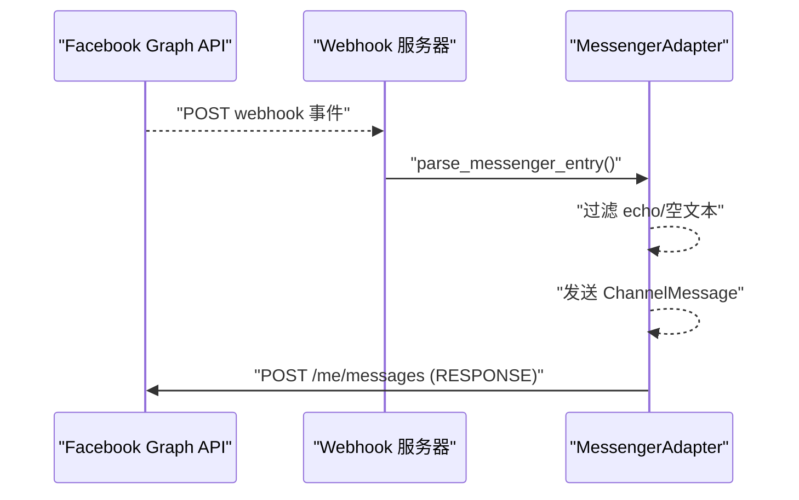
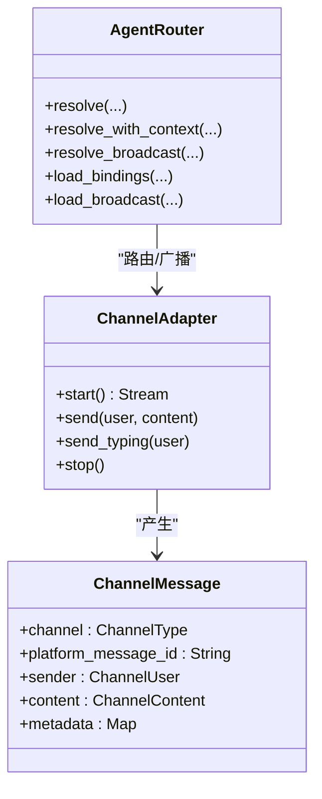
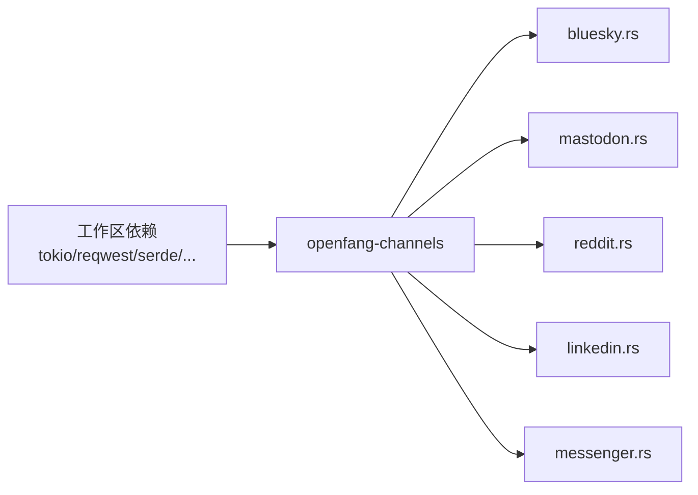

# 社交媒体渠道

<cite>
**本文档引用的文件**
- [lib.rs](file://crates/openfang-channels/src/lib.rs)
- [types.rs](file://crates/openfang-channels/src/types.rs)
- [formatter.rs](file://crates/openfang-channels/src/formatter.rs)
- [router.rs](file://crates/openfang-channels/src/router.rs)
- [bluesky.rs](file://crates/openfang-channels/src/bluesky.rs)
- [mastodon.rs](file://crates/openfang-channels/src/mastodon.rs)
- [reddit.rs](file://crates/openfang-channels/src/reddit.rs)
- [linkedin.rs](file://crates/openfang-channels/src/linkedin.rs)
- [messenger.rs](file://crates/openfang-channels/src/messenger.rs)
- [agent.toml](file://agents/social-media/agent.toml)
- [Cargo.toml](file://Cargo.toml)
- [channels Cargo.toml](file://crates/openfang-channels/Cargo.toml)
</cite>

## 目录
1. [简介](#简介)
2. [项目结构](#项目结构)
3. [核心组件](#核心组件)
4. [架构总览](#架构总览)
5. [详细组件分析](#详细组件分析)
6. [依赖关系分析](#依赖关系分析)
7. [性能考虑](#性能考虑)
8. [故障排除指南](#故障排除指南)
9. [结论](#结论)
10. [附录](#附录)

## 简介
本文件面向 OpenFang 的社交媒体渠道集成，系统性梳理并说明以下平台的适配方案与最佳实践：Bluesky、Mastodon、Reddit、LinkedIn、Facebook Messenger。内容涵盖：
- 平台 API 限制与认证流程（OAuth2、Bearer Token）
- 内容审核与隐私保护策略
- 跨平台内容同步与路由
- 内容格式化规则、标签处理、提及解析、链接预览生成
- 速率限制应对与内容安全策略
- 社交媒体营销自动化、社区管理与内容分发的实操建议

## 项目结构
OpenFang 的通道层位于 crates/openfang-channels，采用“统一消息模型 + 平台适配器”的架构设计。核心类型定义在 types.rs 中，各平台适配器分别实现 ChannelAdapter trait，并通过统一的 ChannelMessage 流与内核交互。

图表来源
- [lib.rs:1-55](file://crates/openfang-channels/src/lib.rs#L1-L55)
- [types.rs:1-478](file://crates/openfang-channels/src/types.rs#L1-L478)
- [formatter.rs:1-676](file://crates/openfang-channels/src/formatter.rs#L1-L676)
- [router.rs:1-645](file://crates/openfang-channels/src/router.rs#L1-L645)

章节来源
- [lib.rs:1-55](file://crates/openfang-channels/src/lib.rs#L1-L55)
- [types.rs:1-478](file://crates/openfang-channels/src/types.rs#L1-L478)
- [Cargo.toml:1-161](file://Cargo.toml#L1-L161)
- [channels Cargo.toml:1-43](file://crates/openfang-channels/Cargo.toml#L1-L43)

## 核心组件
- 统一消息模型：ChannelMessage、ChannelContent、ChannelUser、ChannelType 定义了跨平台的消息抽象，确保不同渠道的消息以一致结构进入内核。
- 通道适配器接口：ChannelAdapter trait 规定了 start/send/send_typing/stop/status 等方法，保证各平台接入的一致性。
- 平台格式化器：formatter.rs 提供 Markdown 到 Telegram HTML、Slack mrkdwn、纯文本等的转换，保障输出符合平台语法。
- 消息路由器：router.rs 支持绑定规则、直接路由、用户默认、频道默认与广播策略，实现精细化消息分发。

章节来源
- [types.rs:12-96](file://crates/openfang-channels/src/types.rs#L12-L96)
- [types.rs:215-280](file://crates/openfang-channels/src/types.rs#L215-L280)
- [formatter.rs:10-27](file://crates/openfang-channels/src/formatter.rs#L10-L27)
- [router.rs:25-45](file://crates/openfang-channels/src/router.rs#L25-L45)

## 架构总览
下图展示了从社交媒体平台到 OpenFang 内核的消息流：平台适配器负责认证、拉取通知/消息、解析为统一 ChannelMessage，并通过通道发送；内核侧由路由器决定投递给哪个代理或广播给多个代理。

图表来源
- [types.rs:74-96](file://crates/openfang-channels/src/types.rs#L74-L96)
- [router.rs:138-187](file://crates/openfang-channels/src/router.rs#L138-L187)

## 详细组件分析

### Bluesky 适配器
- 认证与会话
  - 使用 AT Protocol XRPC 接口进行会话创建与刷新，支持 app password 登录与 JWT 缓存。
  - 会话过期前自动刷新，避免频繁登录。
- 入站消息
  - 周期轮询 app.bsky.notification.listNotifications，过滤 mention/reply 类型，解析为 ChannelMessage。
  - 自动跳过自身通知，提取 URI/CID/时间戳等元数据。
- 出站消息
  - 使用 com.atproto.repo.createRecord 发布 app.bsky.feed.post，按字符长度切片。
  - 不支持打字指示。
- 速率限制与健壮性
  - 回退重试与指数退避，遇到 401 自动重建会话。
- 内容格式化
  - 文本内容直接发布；命令以 / 开头解析为 ChannelContent::Command。

图表来源
- [bluesky.rs:94-127](file://crates/openfang-channels/src/bluesky.rs#L94-L127)
- [bluesky.rs:256-336](file://crates/openfang-channels/src/bluesky.rs#L256-L336)
- [bluesky.rs:207-252](file://crates/openfang-channels/src/bluesky.rs#L207-L252)

章节来源
- [bluesky.rs:1-699](file://crates/openfang-channels/src/bluesky.rs#L1-L699)

### Mastodon 适配器
- 认证与验证
  - 使用 OAuth2 Bearer Token，调用 verify_credentials 验证账号信息并缓存账户 ID。
- 实时与回退
  - 优先使用 SSE 用户流接收 mention；失败则回退 REST 轮询。
  - 断线自动重连，指数退避。
- 解析与回复
  - 解析 HTML 内容为纯文本，剥离标签与实体；支持 in_reply_to_id 形成链式回复。
  - 默认 visibility 设为 unlisted，避免公开曝光。
- 特殊行为
  - suppress_error_responses=true，避免错误消息被公开发布。

图表来源
- [mastodon.rs:69-94](file://crates/openfang-channels/src/mastodon.rs#L69-L94)
- [mastodon.rs:316-485](file://crates/openfang-channels/src/mastodon.rs#L316-L485)
- [mastodon.rs:171-262](file://crates/openfang-channels/src/mastodon.rs#L171-L262)

章节来源
- [mastodon.rs:1-710](file://crates/openfang-channels/src/mastodon.rs#L1-L710)

### Reddit 适配器
- 认证与令牌
  - 使用 OAuth2 密码模式(script app)获取 access_token，带安全缓冲刷新。
  - 验证 /api/v1/me 获取用户名。
- 轮询策略
  - 每 subreddit 轮询 /r/{sub}/comments/new.json，按新帖顺序处理。
  - 使用 seen_comments 去重，定期清理内存。
- 回复机制
  - 通过 /api/comment 发表回复，按最大长度切片合并。
- 速率限制
  - 默认轮询间隔 5 秒，符合 Reddit 约 60 次/分钟的 API 限制。

图表来源
- [reddit.rs:107-153](file://crates/openfang-channels/src/reddit.rs#L107-L153)
- [reddit.rs:319-492](file://crates/openfang-channels/src/reddit.rs#L319-L492)
- [reddit.rs:227-307](file://crates/openfang-channels/src/reddit.rs#L227-L307)

章节来源
- [reddit.rs:1-705](file://crates/openfang-channels/src/reddit.rs#L1-L705)

### LinkedIn 适配器
- 认证与请求头
  - 使用 OAuth2 Bearer Token，附加 X-Restli-Protocol-Version 与 LinkedIn-Version 请求头。
  - 验证 /organizations/{id} 获取组织名称。
- 轮询与增量
  - 按 createdAt 时间戳增量轮询 organizationMessages，过滤自身组织消息。
- 发送策略
  - 通过 organizationMessages 接口发送 MEMEBER_TO_MEMBER 类型消息，按最大长度切片。
  - 遵守每日 100 条的速率限制，对多段消息添加延迟。
- 元数据
  - 提取 sender_urn、organization_id 等用于后续回复与追踪。

图表来源
- [linkedin.rs:77-97](file://crates/openfang-channels/src/linkedin.rs#L77-L97)
- [linkedin.rs:99-142](file://crates/openfang-channels/src/linkedin.rs#L99-L142)
- [linkedin.rs:225-363](file://crates/openfang-channels/src/linkedin.rs#L225-L363)

章节来源
- [linkedin.rs:1-485](file://crates/openfang-channels/src/linkedin.rs#L1-L485)

### Facebook Messenger 适配器
- 认证与验证
  - 使用 page access token 调用 /me 获取页面名称。
- 入站消息
  - 启动本地 HTTP 服务器监听 /webhook，支持 GET 验证与 POST 事件。
  - 解析 webhook JSON，过滤 echo 消息，提取 mid、timestamp、quick_reply、NLP 实体等元数据。
- 出站消息
  - 使用 Graph API /me/messages 发送文本；支持图片附件与单独的 caption 文本。
  - 支持 typing_on 打字指示。
- 安全与隐私
  - verify_token 用于 webhook 验证，防止未授权回调。

图表来源
- [messenger.rs:68-87](file://crates/openfang-channels/src/messenger.rs#L68-L87)
- [messenger.rs:267-361](file://crates/openfang-channels/src/messenger.rs#L267-L361)
- [messenger.rs:156-255](file://crates/openfang-channels/src/messenger.rs#L156-L255)

章节来源
- [messenger.rs:1-626](file://crates/openfang-channels/src/messenger.rs#L1-L626)

### 平台特定内容格式化与解析
- Markdown 到平台格式
  - Telegram HTML：支持粗体、斜体、代码块、链接、引用块、有序/无序列表。
  - Slack mrkdwn：支持粗体与链接 <url|text>。
  - 纯文本：剥离所有格式，保留可读文本。
  - WeCom：强化纯文本转换，避免 Markdown 泄漏。
- 提及解析与命令识别
  - 各平台均支持以 “/” 开头的命令解析为 ChannelContent::Command，参数按空白分割。
  - Mastodon/Bluesky/Reddit/LinkedIn/Messenger 在解析函数中完成命令拆分与参数收集。
- 链接预览与富文本
  - 适配器不负责链接预览生成，但保留原始链接以便上层工具或代理进一步处理。

章节来源
- [formatter.rs:10-27](file://crates/openfang-channels/src/formatter.rs#L10-L27)
- [formatter.rs:29-159](file://crates/openfang-channels/src/formatter.rs#L29-L159)
- [formatter.rs:288-327](file://crates/openfang-channels/src/formatter.rs#L288-L327)
- [formatter.rs:515-564](file://crates/openfang-channels/src/formatter.rs#L515-L564)
- [mastodon.rs:171-262](file://crates/openfang-channels/src/mastodon.rs#L171-L262)
- [bluesky.rs:256-336](file://crates/openfang-channels/src/bluesky.rs#L256-L336)
- [reddit.rs:227-307](file://crates/openfang-channels/src/reddit.rs#L227-L307)
- [linkedin.rs:186-213](file://crates/openfang-channels/src/linkedin.rs#L186-L213)
- [messenger.rs:156-255](file://crates/openfang-channels/src/messenger.rs#L156-L255)

### OAuth2 认证流程与速率限制应对
- Bluesky
  - XRPC createSession/refreshSession，会话缓存与到期前刷新。
- Mastodon
  - Bearer Token，SSE 优先，REST 回退。
- Reddit
  - OAuth2 密码模式，令牌缓存与安全刷新窗口。
- LinkedIn
  - Bearer Token + 特定请求头，按时间戳增量轮询。
- Messenger
  - Page Access Token，verify_token 验证，Graph API 发送。

速率限制与退避
- 各适配器内置指数退避与最大等待时间，遇到非 2xx 或 401 自动重建会话或回退策略。
- Mastodon/LinkedIn/Reddit 设置合理轮询间隔，避免触发平台限流。

章节来源
- [bluesky.rs:94-196](file://crates/openfang-channels/src/bluesky.rs#L94-L196)
- [mastodon.rs:69-94](file://crates/openfang-channels/src/mastodon.rs#L69-L94)
- [mastodon.rs:316-424](file://crates/openfang-channels/src/mastodon.rs#L316-L424)
- [reddit.rs:107-153](file://crates/openfang-channels/src/reddit.rs#L107-L153)
- [linkedin.rs:68-97](file://crates/openfang-channels/src/linkedin.rs#L68-L97)
- [messenger.rs:68-87](file://crates/openfang-channels/src/messenger.rs#L68-L87)

### 内容安全策略与隐私保护
- 凭证安全
  - 所有敏感凭据使用 zeroize，在适配器生命周期结束后清除内存。
- 隐私与最小暴露
  - 路由器支持按用户键(user_key)与平台用户 ID 双重映射，默认不泄露真实身份。
  - 发送错误响应可通过 suppress_error_responses 控制，避免在公共频道暴露内部错误。
- 数据最小化
  - 解析时仅提取必要字段，如 Mastodon strip_html_tags 仅保留纯文本。

章节来源
- [bluesky.rs:42-44](file://crates/openfang-channels/src/bluesky.rs#L42-L44)
- [mastodon.rs:39-40](file://crates/openfang-channels/src/mastodon.rs#L39-L40)
- [reddit.rs:53-54](file://crates/openfang-channels/src/reddit.rs#L53-L54)
- [linkedin.rs:31-32](file://crates/openfang-channels/src/linkedin.rs#L31-L32)
- [messenger.rs:36-39](file://crates/openfang-channels/src/messenger.rs#L36-L39)
- [types.rs:272-280](file://crates/openfang-channels/src/types.rs#L272-L280)

### 跨平台内容同步与路由
- 统一消息模型
  - ChannelMessage 包含 platform_message_id、sender、content、metadata 等，便于跨平台追踪与去重。
- 路由策略
  - 绑定规则(match_rule)支持 channel/account_id/peer_id/guild_id/roles 多维匹配，优先级高于直接路由、用户默认、频道默认与系统默认。
  - 广播策略支持并行路由到多个代理，适合内容分发场景。
- 社交媒体营销代理
  - social-media 代理提供内容创作、日历排程、社区互动与分析能力，可与通道层配合实现自动化。

图表来源
- [types.rs:74-96](file://crates/openfang-channels/src/types.rs#L74-L96)
- [types.rs:215-280](file://crates/openfang-channels/src/types.rs#L215-L280)
- [router.rs:25-45](file://crates/openfang-channels/src/router.rs#L25-L45)

章节来源
- [types.rs:12-96](file://crates/openfang-channels/src/types.rs#L12-L96)
- [router.rs:138-187](file://crates/openfang-channels/src/router.rs#L138-L187)
- [agent.toml:1-66](file://agents/social-media/agent.toml#L1-L66)

## 依赖关系分析
- 工作区依赖
  - tokio、reqwest、serde、chrono、dashmap、async-trait、futures、tracing、zeroize、axum 等为通道层提供异步运行时、HTTP 客户端、序列化、并发容器、日志与安全等基础能力。
- 平台特化依赖
  - Mastodon 使用 tokio-tungstenite 处理 SSE；LinkedIn 使用特定请求头；Messenger 使用 axum 提供 webhook 服务。
- 通道层与内核解耦
  - 通道层仅负责消息桥接，不关心业务逻辑，通过统一消息模型与路由器实现与内核的松耦合。

图表来源
- [Cargo.toml:25-112](file://Cargo.toml#L25-L112)
- [channels Cargo.toml:8-34](file://crates/openfang-channels/Cargo.toml#L8-L34)

章节来源
- [Cargo.toml:1-161](file://Cargo.toml#L1-L161)
- [channels Cargo.toml:1-43](file://crates/openfang-channels/Cargo.toml#L1-L43)

## 性能考虑
- 轮询与 SSE
  - 优先使用 SSE(如 Mastodon)降低延迟与带宽消耗；失败回退 REST 轮询并设置指数退避。
- 令牌与会话缓存
  - 缓存 OAuth2/Bearer 令牌与 AT Protocol 会话，减少重复认证开销。
- 分片与限长
  - 按平台最大长度切片发送，避免单次请求失败；对 LinkedIn 添加小延迟以遵守每日限额。
- 并发与资源
  - 使用 mpsc 通道与背压控制，避免内存膨胀；对高并发场景启用合适的轮询间隔与超时。

## 故障排除指南
- 认证失败
  - 检查令牌有效期与作用域；Bluesky/LinkedIn/Mastodon/Reddit 均提供明确的错误响应与状态码，适配器会自动尝试重建会话或回退策略。
- 速率限制
  - 观察指数退避日志；适当增加轮询间隔或切换到 SSE。
- 内容未送达
  - 检查 split_message 是否正确切片；确认平台可见性设置(如 Mastodon 的 unlisted)。
- 路由问题
  - 使用 router 的绑定规则调试，确认 peer_id/guild_id/roles 是否匹配；检查广播配置与代理名称缓存。

章节来源
- [bluesky.rs:454-461](file://crates/openfang-channels/src/bluesky.rs#L454-L461)
- [mastodon.rs:408-423](file://crates/openfang-channels/src/mastodon.rs#L408-L423)
- [reddit.rs:386-411](file://crates/openfang-channels/src/reddit.rs#L386-L411)
- [linkedin.rs:276-281](file://crates/openfang-channels/src/linkedin.rs#L276-L281)
- [router.rs:289-305](file://crates/openfang-channels/src/router.rs#L289-L305)

## 结论
OpenFang 的社交媒体通道层通过统一的消息模型与适配器接口，实现了对 Bluesky、Mastodon、Reddit、LinkedIn、Facebook Messenger 的标准化接入。结合路由器与格式化器，可在保障隐私与安全的前提下，高效地完成内容创作、社区互动与自动化分发。建议在生产环境中：
- 明确各平台的速率限制与认证要求，配置合理的轮询与退避策略；
- 使用绑定规则与广播策略实现精细化路由；
- 通过 social-media 代理与通道层协同，构建完整的社交媒体运营闭环。

## 附录
- 社交媒体营销代理配置参考：agents/social-media/agent.toml
- 通道层模块导出与适配器清单：crates/openfang-channels/src/lib.rs