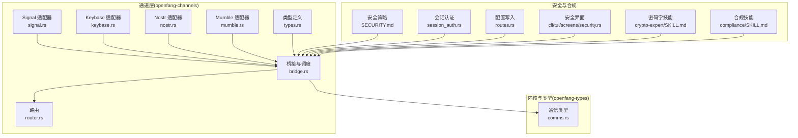
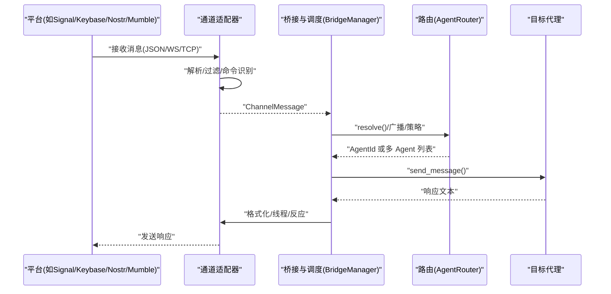
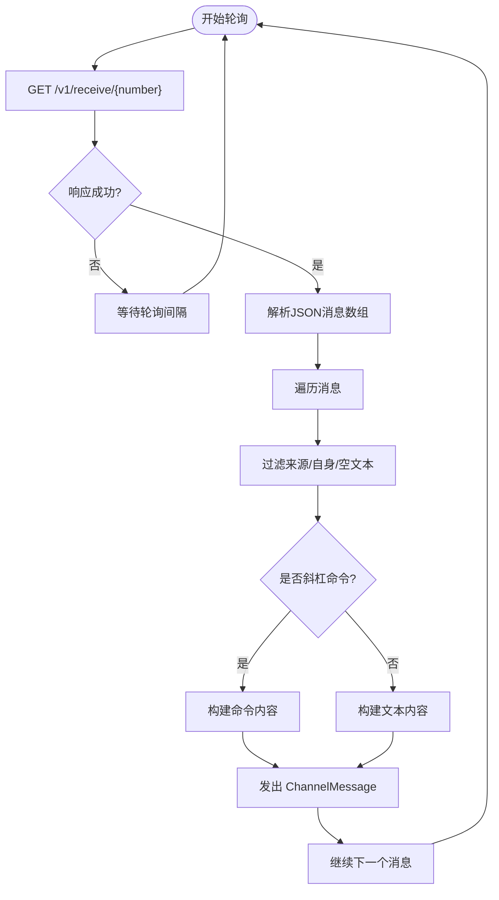
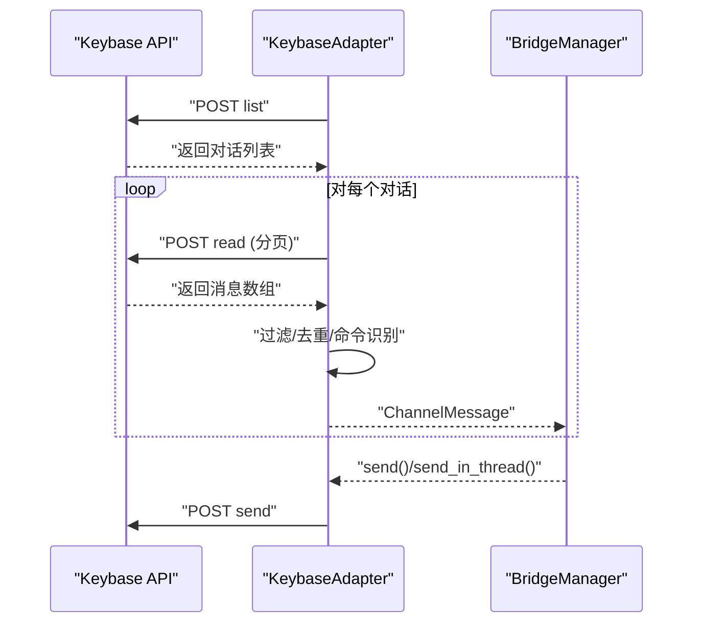
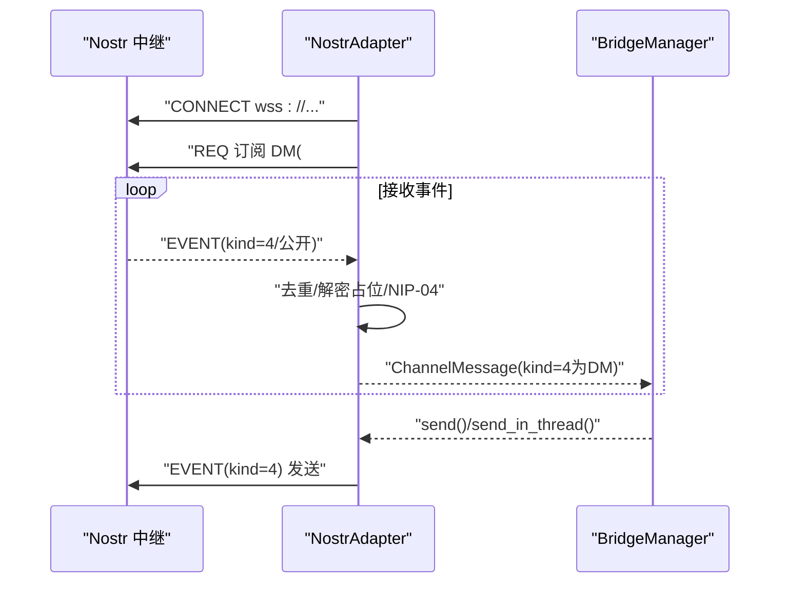
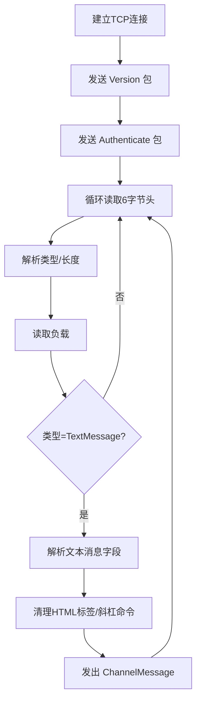
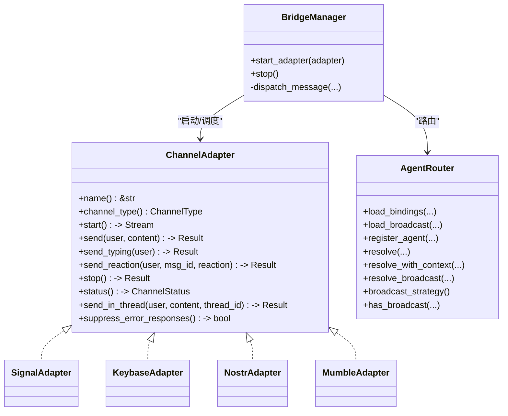
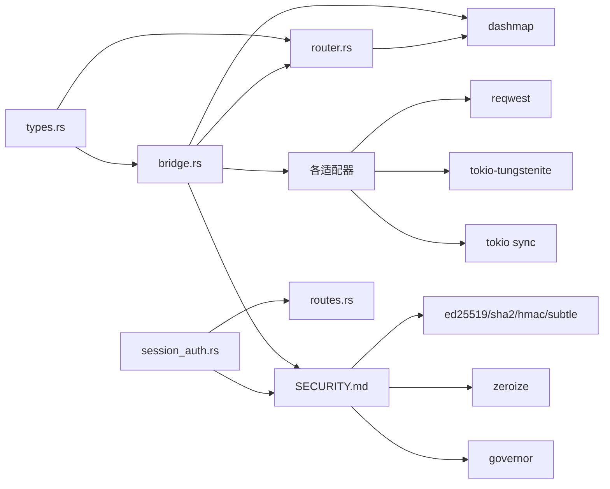

# 隐私安全渠道

<cite>
**本文引用的文件**
- [crates/openfang-channels/src/signal.rs](file://crates/openfang-channels/src/signal.rs)
- [crates/openfang-channels/src/keybase.rs](file://crates/openfang-channels/src/keybase.rs)
- [crates/openfang-channels/src/nostr.rs](file://crates/openfang-channels/src/nostr.rs)
- [crates/openfang-channels/src/mumble.rs](file://crates/openfang-channels/src/mumble.rs)
- [crates/openfang-channels/src/types.rs](file://crates/openfang-channels/src/types.rs)
- [crates/openfang-channels/src/bridge.rs](file://crates/openfang-channels/src/bridge.rs)
- [crates/openfang-channels/src/router.rs](file://crates/openfang-channels/src/router.rs)
- [crates/openfang-types/src/comms.rs](file://crates/openfang-types/src/comms.rs)
- [SECURITY.md](file://SECURITY.md)
- [crates/openfang-api/src/session_auth.rs](file://crates/openfang-api/src/session_auth.rs)
- [crates/openfang-api/src/routes.rs](file://crates/openfang-api/src/routes.rs)
- [crates/openfang-cli/src/tui/screens/security.rs](file://crates/openfang-cli/src/tui/screens/security.rs)
- [crates/openfang-skills/bundled/crypto-expert/SKILL.md](file://crates/openfang-skills/bundled/crypto-expert/SKILL.md)
- [crates/openfang-skills/bundled/compliance/SKILL.md](file://crates/openfang-skills/bundled/compliance/SKILL.md)
</cite>

## 目录
1. [引言](#引言)
2. [项目结构](#项目结构)
3. [核心组件](#核心组件)
4. [架构总览](#架构总览)
5. [详细组件分析](#详细组件分析)
6. [依赖关系分析](#依赖关系分析)
7. [性能考量](#性能考量)
8. [故障排查指南](#故障排查指南)
9. [结论](#结论)
10. [附录](#附录)

## 引言
本文件面向 OpenFang 的隐私安全渠道集成，聚焦 Signal、Keybase、Nostr、Mumble 等注重隐私与安全的通信平台。文档从系统架构、组件职责、数据流与处理逻辑、密钥与认证、匿名性与抗审查、合规与审计等方面进行深入解析，并提供安全配置建议、威胁缓解策略与最佳实践，帮助读者理解这些渠道在 OpenFang 中的安全模型与实现差异。

## 项目结构
OpenFang 将“通道适配器”作为桥接层，统一将各平台消息转换为内核可识别的消息类型，并通过路由与桥接管理器分发给具体代理（Agent）。隐私安全渠道位于 openfang-channels 子模块，核心类型定义于 types 模块，桥接与调度逻辑位于 bridge 与 router 模块。

图示来源
- [crates/openfang-channels/src/signal.rs:1-267](file://crates/openfang-channels/src/signal.rs#L1-L267)
- [crates/openfang-channels/src/keybase.rs:1-512](file://crates/openfang-channels/src/keybase.rs#L1-L512)
- [crates/openfang-channels/src/nostr.rs:1-489](file://crates/openfang-channels/src/nostr.rs#L1-L489)
- [crates/openfang-channels/src/mumble.rs:1-599](file://crates/openfang-channels/src/mumble.rs#L1-L599)
- [crates/openfang-channels/src/types.rs:1-478](file://crates/openfang-channels/src/types.rs#L1-L478)
- [crates/openfang-channels/src/bridge.rs:1-1200](file://crates/openfang-channels/src/bridge.rs#L1-L1200)
- [crates/openfang-channels/src/router.rs:1-645](file://crates/openfang-channels/src/router.rs#L1-L645)
- [crates/openfang-types/src/comms.rs:1-171](file://crates/openfang-types/src/comms.rs#L1-L171)
- [SECURITY.md:1-95](file://SECURITY.md#L1-L95)
- [crates/openfang-api/src/session_auth.rs:33-83](file://crates/openfang-api/src/session_auth.rs#L33-L83)
- [crates/openfang-api/src/routes.rs:7698-7738](file://crates/openfang-api/src/routes.rs#L7698-L7738)
- [crates/openfang-cli/src/tui/screens/security.rs:72-107](file://crates/openfang-cli/src/tui/screens/security.rs#L72-L107)
- [crates/openfang-skills/bundled/crypto-expert/SKILL.md:1-39](file://crates/openfang-skills/bundled/crypto-expert/SKILL.md#L1-L39)
- [crates/openfang-skills/bundled/compliance/SKILL.md:1-39](file://crates/openfang-skills/bundled/compliance/SKILL.md#L1-L39)

章节来源
- [crates/openfang-channels/src/lib.rs:1-55](file://crates/openfang-channels/src/lib.rs#L1-L55)

## 核心组件
- 通道适配器：实现 ChannelAdapter trait，负责与平台交互（轮询/订阅）、消息解析、内容分片、发送响应。
- 类型系统：统一 ChannelMessage、ChannelContent、ChannelUser、ChannelType 等消息与用户抽象。
- 桥接与调度：BridgeManager 启动适配器流，按策略分发消息；支持并发控制、速率限制、生命周期反应、线程回复等。
- 路由系统：AgentRouter 基于绑定规则、直接路由、用户默认、频道默认与系统默认进行消息路由。
- 安全与合规：零化敏感信息、签名与认证、审计链、合规框架与密码学指导。

章节来源
- [crates/openfang-channels/src/types.rs:12-280](file://crates/openfang-channels/src/types.rs#L12-L280)
- [crates/openfang-channels/src/bridge.rs:271-382](file://crates/openfang-channels/src/bridge.rs#L271-L382)
- [crates/openfang-channels/src/router.rs:25-341](file://crates/openfang-channels/src/router.rs#L25-L341)
- [SECURITY.md:46-95](file://SECURITY.md#L46-L95)

## 架构总览
下图展示从通道适配器到内核的端到端流程：适配器接收/发送平台消息，统一为 ChannelMessage，经桥接与调度后路由至目标代理，代理执行业务逻辑并返回文本，桥接层格式化输出并回发。

图示来源
- [crates/openfang-channels/src/bridge.rs:526-1010](file://crates/openfang-channels/src/bridge.rs#L526-L1010)
- [crates/openfang-channels/src/router.rs:138-187](file://crates/openfang-channels/src/router.rs#L138-L187)

## 详细组件分析

### Signal 适配器
- 连接模式：HTTP REST API（signal-cli），轮询接收消息，按时间间隔拉取。
- 认证与访问控制：基于已注册手机号与白名单号码过滤；未显式使用端到端加密，依赖 signal-cli 的本地守护进程。
- 内容处理：支持纯文本与斜杠命令；自动忽略自身消息与空消息；消息分片由上层 split_message 处理。
- 错误处理：轮询失败时日志调试，不中断循环；状态码非成功时返回错误信息。
- 安全要点：私有号码白名单、避免向未知来源转发；注意 signal-cli 的本地安全边界。

图示来源
- [crates/openfang-channels/src/signal.rs:73-216](file://crates/openfang-channels/src/signal.rs#L73-L216)

章节来源
- [crates/openfang-channels/src/signal.rs:1-267](file://crates/openfang-channels/src/signal.rs#L1-L267)

### Keybase 适配器
- 连接模式：HTTP JSON API（本地或远程），使用 list/read/send 方法轮询与发送。
- 认证：用户名+纸牌口令（paperkey）组合，内部以 Zeroizing<String> 管理敏感字段。
- 团队过滤：支持按团队名过滤对话；增量读取 last_msg_ids 避免重复。
- 内容处理：拆分长消息；仅处理文本类型；命令识别与分发。
- 可靠性：指数退避重连；并发连接多个频道；最后消息 ID 持久化。

图示来源
- [crates/openfang-channels/src/keybase.rs:204-453](file://crates/openfang-channels/src/keybase.rs#L204-L453)

章节来源
- [crates/openfang-channels/src/keybase.rs:1-512](file://crates/openfang-channels/src/keybase.rs#L1-L512)

### Nostr 适配器
- 连接模式：WebSocket NIP-01，订阅 DM（kind 4）与公共事件，发布签名事件。
- 认证：私钥零化存储；派生公钥；事件签名占位（注释说明真实实现应使用 secp256k1 Schnorr）。
- 抗审查：多中继连接，自动重连；事件去重（seen_events 集合）。
- 加解密：kind 4（NIP-04）明文占位，注释说明应采用共享密钥+ECDH+AES-256-CBC；当前实现为占位。
- 命令识别：斜杠命令解析；元数据包含 kind、relay 等。

图示来源
- [crates/openfang-channels/src/nostr.rs:163-424](file://crates/openfang-channels/src/nostr.rs#L163-L424)

章节来源
- [crates/openfang-channels/src/nostr.rs:1-489](file://crates/openfang-channels/src/nostr.rs#L1-L489)

### Mumble 适配器
- 连接模式：TCP，自定义轻量协议帧（版本/认证/文本消息/Ping），仅处理 TextMessage。
- 认证：用户名+服务器密码（可为空）；密码零化存储。
- 协议细节：6字节头（2字节类型+4字节长度）+变长负载；变长整型编码；文本消息字段解析。
- 内容处理：剥离基础 HTML 标签；斜杠命令识别；元数据包含频道与会话标识。
- 可靠性：读取错误指数退避；Ping 保活；并发写入互斥锁。

图示来源
- [crates/openfang-channels/src/mumble.rs:283-470](file://crates/openfang-channels/src/mumble.rs#L283-L470)

章节来源
- [crates/openfang-channels/src/mumble.rs:1-599](file://crates/openfang-channels/src/mumble.rs#L1-L599)

### 统一类型与桥接
- ChannelType：内置常见平台与自定义类型；Signal 使用枚举值，其他平台使用 Custom。
- ChannelMessage：统一消息载体，包含平台消息 ID、发送者、内容、时间戳、群组标志、线程 ID、元数据。
- BridgeManager：启动适配器流，按策略分发消息；并发任务上限；生命周期反应；线程回复；输出格式化。
- AgentRouter：绑定规则优先级（绑定>直连>用户默认>频道默认>系统默认）；广播路由；角色与上下文匹配。

图示来源
- [crates/openfang-channels/src/types.rs:12-280](file://crates/openfang-channels/src/types.rs#L12-L280)
- [crates/openfang-channels/src/bridge.rs:271-382](file://crates/openfang-channels/src/bridge.rs#L271-L382)
- [crates/openfang-channels/src/router.rs:25-341](file://crates/openfang-channels/src/router.rs#L25-L341)

章节来源
- [crates/openfang-channels/src/types.rs:1-478](file://crates/openfang-channels/src/types.rs#L1-L478)
- [crates/openfang-channels/src/bridge.rs:1-1200](file://crates/openfang-channels/src/bridge.rs#L1-L1200)
- [crates/openfang-channels/src/router.rs:1-645](file://crates/openfang-channels/src/router.rs#L1-L645)

## 依赖关系分析
- 适配器依赖：HTTP 客户端（reqwest）、WebSocket 客户端（tokio-tungstenite）、异步通道（tokio mpsc）、共享状态（DashMap/RwLock/watch）。
- 类型与桥接：统一消息类型、输出格式、生命周期反应、速率限制桶。
- 安全与合规：密码学库（ed25519、sha2、hmac、subtle）、零化库（zeroize）、速率限制（governor）。
- 配置与认证：会话认证（HMAC-SHA256）、配置写入（secrets.env 权限限制）。

图示来源
- [crates/openfang-channels/src/types.rs:1-478](file://crates/openfang-channels/src/types.rs#L1-L478)
- [crates/openfang-channels/src/bridge.rs:1-1200](file://crates/openfang-channels/src/bridge.rs#L1-L1200)
- [crates/openfang-channels/src/router.rs:1-645](file://crates/openfang-channels/src/router.rs#L1-L645)
- [SECURITY.md:62-95](file://SECURITY.md#L62-L95)
- [crates/openfang-api/src/session_auth.rs:33-83](file://crates/openfang-api/src/session_auth.rs#L33-L83)
- [crates/openfang-api/src/routes.rs:7698-7738](file://crates/openfang-api/src/routes.rs#L7698-L7738)

章节来源
- [crates/openfang-channels/src/types.rs:1-478](file://crates/openfang-channels/src/types.rs#L1-L478)
- [crates/openfang-channels/src/bridge.rs:1-1200](file://crates/openfang-channels/src/bridge.rs#L1-L1200)
- [crates/openfang-channels/src/router.rs:1-645](file://crates/openfang-channels/src/router.rs#L1-L645)
- [SECURITY.md:1-95](file://SECURITY.md#L1-L95)
- [crates/openfang-api/src/session_auth.rs:33-83](file://crates/openfang-api/src/session_auth.rs#L33-L83)
- [crates/openfang-api/src/routes.rs:7698-7738](file://crates/openfang-api/src/routes.rs#L7698-L7738)

## 性能考量
- 并发与背压：桥接层使用信号量限制并发分发任务数量，避免突发流量导致内存膨胀。
- 速率限制：按通道类型与用户维度维护时间戳桶，分钟级滑动窗口计数。
- I/O 优化：适配器采用轮询或长连接（WS/TCP），并设置指数退避与保活心跳。
- 输出格式：针对不同平台选择合适格式，减少渲染开销与兼容问题。

章节来源
- [crates/openfang-channels/src/bridge.rs:229-269](file://crates/openfang-channels/src/bridge.rs#L229-L269)
- [crates/openfang-channels/src/bridge.rs:320-373](file://crates/openfang-channels/src/bridge.rs#L320-L373)

## 故障排查指南
- 通用错误清洗：对代理错误进行分类清洗，隐藏技术细节，返回用户友好提示。
- 重解析与恢复：当路由目标不存在时尝试按名称重新解析，更新缓存并重试。
- 日志与可观测：适配器与桥接层广泛使用 info/warn/debug 记录关键事件与错误。
- 配置与权限：确保 secrets.env 文件权限正确（Unix 下 0600），避免凭据泄露。

章节来源
- [crates/openfang-channels/src/bridge.rs:1012-1080](file://crates/openfang-channels/src/bridge.rs#L1012-L1080)
- [crates/openfang-channels/src/bridge.rs:487-524](file://crates/openfang-channels/src/bridge.rs#L487-L524)
- [crates/openfang-api/src/routes.rs:7711-7716](file://crates/openfang-api/src/routes.rs#L7711-L7716)

## 结论
OpenFang 的隐私安全渠道通过标准化的适配器接口与桥接调度，实现了对多种隐私导向通信平台的一致接入。尽管部分平台（如 Nostr、Signal）在仓库中体现为占位实现，但整体架构已具备扩展端到端加密、匿名性与抗审查能力所需的基础设施：零化敏感信息、统一消息类型、可插拔路由、速率限制与生命周期反应、以及安全审计与合规指导。建议在生产环境中结合密码学技能与合规技能，完善密钥管理、加密算法与数据最小化策略，并持续进行威胁建模与渗透测试。

## 附录

### 密钥管理与认证最佳实践
- 使用零化内存存储敏感凭据（Paperkey、私钥、API Key）。
- 采用强随机源生成密钥与一次性令牌，避免弱熵。
- 采用常量时间比较防止侧信道攻击。
- 对外传输使用受信网络与加密通道，避免明文传输。

章节来源
- [crates/openfang-channels/src/keybase.rs:36-69](file://crates/openfang-channels/src/keybase.rs#L36-L69)
- [crates/openfang-channels/src/nostr.rs:31-57](file://crates/openfang-channels/src/nostr.rs#L31-L57)
- [crates/openfang-channels/src/mumble.rs:37-83](file://crates/openfang-channels/src/mumble.rs#L37-L83)
- [crates/openfang-api/src/session_auth.rs:43-72](file://crates/openfang-api/src/session_auth.rs#L43-L72)
- [crates/openfang-skills/bundled/crypto-expert/SKILL.md:17-31](file://crates/openfang-skills/bundled/crypto-expert/SKILL.md#L17-L31)

### 隐私合规与数据最小化
- 明确收集目的与期限，仅保留必要数据。
- 实施访问审查与供应商风险评估。
- 建立证据收集流水线与审计链，满足 SOC 2、GDPR、HIPAA、PCI-DSS 要求。

章节来源
- [crates/openfang-skills/bundled/compliance/SKILL.md:1-39](file://crates/openfang-skills/bundled/compliance/SKILL.md#L1-L39)
- [SECURITY.md:78-81](file://SECURITY.md#L78-L81)

### 安全配置清单
- 通道凭据：使用零化存储，定期轮换。
- 速率限制：启用 per-user 限额，防止滥用。
- 输出格式：按平台定制，避免注入与渲染问题。
- 文件权限：敏感配置文件设置严格权限。
- 审计与告警：开启日志与健康检查，暴露最小化信息。

章节来源
- [crates/openfang-cli/src/tui/screens/security.rs:72-107](file://crates/openfang-cli/src/tui/screens/security.rs#L72-L107)
- [crates/openfang-api/src/routes.rs:7711-7716](file://crates/openfang-api/src/routes.rs#L7711-L7716)
- [crates/openfang-channels/src/bridge.rs:540-555](file://crates/openfang-channels/src/bridge.rs#L540-L555)