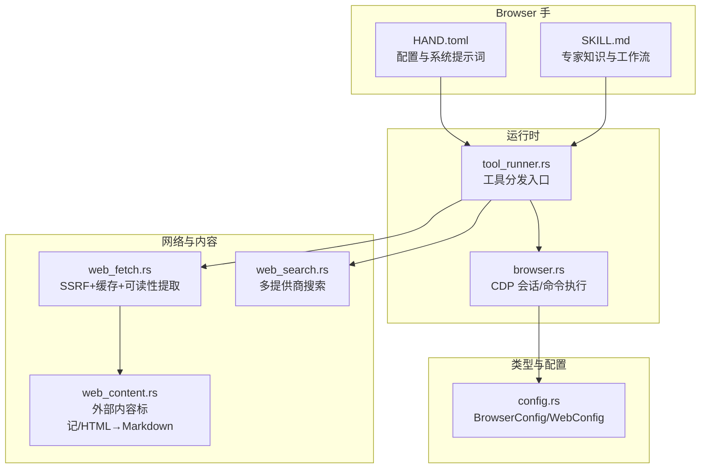
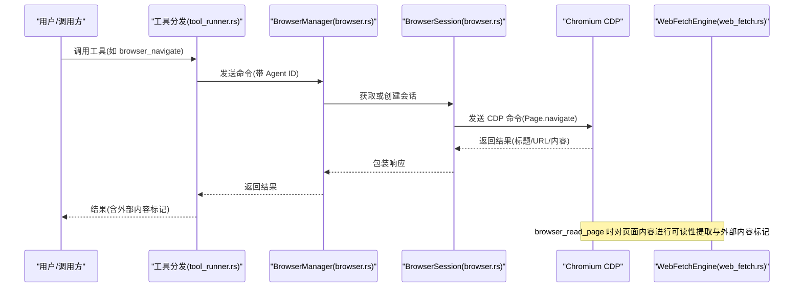
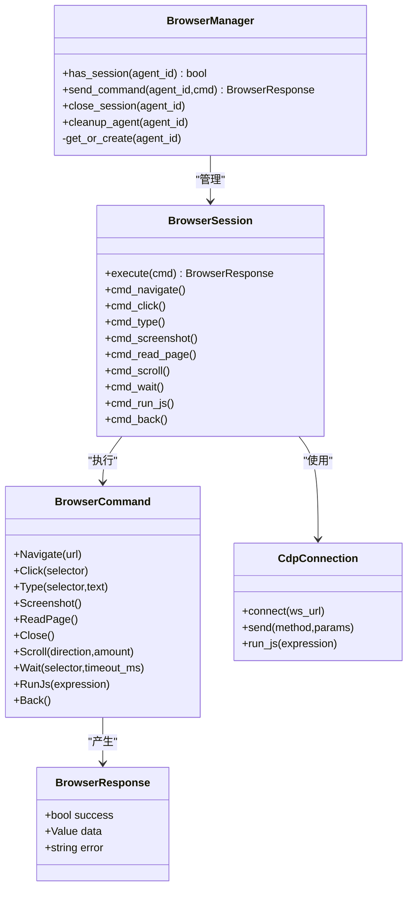
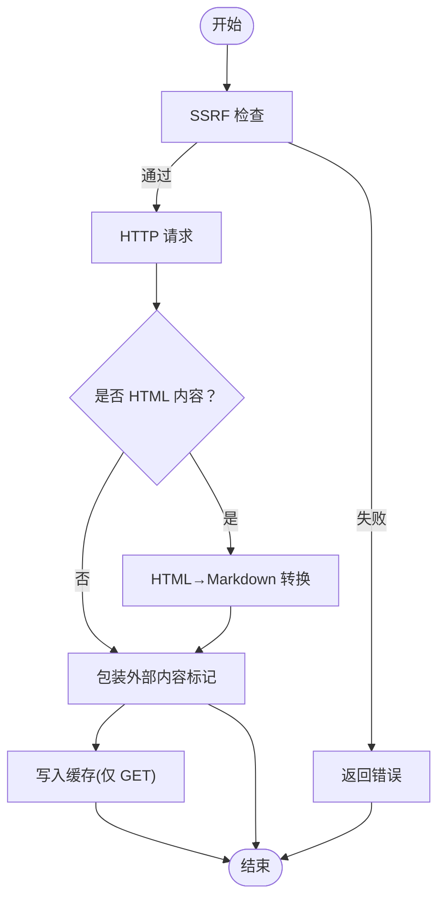
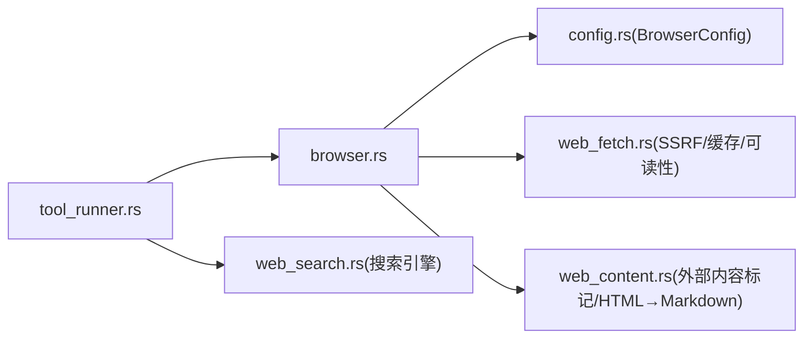

# Browser 手（浏览器自动化）

<cite>
**本文引用的文件**
- [HAND.toml](file://crates/openfang-hands/bundled/browser/HAND.toml)
- [SKILL.md](file://crates/openfang-hands/bundled/browser/SKILL.md)
- [browser.rs](file://crates/openfang-runtime/src/browser.rs)
- [config.rs](file://crates/openfang-types/src/config.rs)
- [web_fetch.rs](file://crates/openfang-runtime/src/web_fetch.rs)
- [web_search.rs](file://crates/openfang-runtime/src/web_search.rs)
- [web_content.rs](file://crates/openfang-runtime/src/web_content.rs)
- [tool_runner.rs](file://crates/openfang-runtime/src/tool_runner.rs)
</cite>

## 目录
1. [简介](#简介)
2. [项目结构](#项目结构)
3. [核心组件](#核心组件)
4. [架构总览](#架构总览)
5. [详细组件分析](#详细组件分析)
6. [依赖关系分析](#依赖关系分析)
7. [性能考量](#性能考量)
8. [故障排除指南](#故障排除指南)
9. [结论](#结论)
10. [附录](#附录)

## 简介
Browser 手（浏览器自动化）是 OpenFang 生态中的一个原生“手”（工具集），通过直接连接 Chromium 的 Chrome DevTools Protocol（CDP）实现无需 Python/Playwright 的纯 Rust 浏览器自动化。它提供页面导航、元素点击、文本输入、截图、页面内容读取、历史回退等能力，并内置安全防护（SSRF 检查）、会话管理、可配置的无头模式与等待策略，以及与系统内存与知识图谱工具的集成，帮助智能体在真实网页上完成多步骤任务。

## 项目结构
Browser 手相关的核心位置如下：
- 配置与专家知识注入：crates/openfang-hands/bundled/browser/HAND.toml、SKILL.md
- 运行时实现：crates/openfang-runtime/src/browser.rs
- 类型与配置：crates/openfang-types/src/config.rs
- 网络与内容处理：crates/openfang-runtime/src/web_fetch.rs、web_search.rs、web_content.rs
- 工具分发入口：crates/openfang-runtime/src/tool_runner.rs

图表来源
- [browser.rs:1-1363](file://crates/openfang-runtime/src/browser.rs#L1-L1363)
- [tool_runner.rs:378-411](file://crates/openfang-runtime/src/tool_runner.rs#L378-L411)
- [config.rs:309-341](file://crates/openfang-types/src/config.rs#L309-L341)
- [web_fetch.rs:1-378](file://crates/openfang-runtime/src/web_fetch.rs#L1-L378)
- [web_search.rs:1-468](file://crates/openfang-runtime/src/web_search.rs#L1-L468)
- [web_content.rs:1-450](file://crates/openfang-runtime/src/web_content.rs#L1-L450)

章节来源
- [browser.rs:1-1363](file://crates/openfang-runtime/src/browser.rs#L1-L1363)
- [tool_runner.rs:378-411](file://crates/openfang-runtime/src/tool_runner.rs#L378-L411)
- [config.rs:309-341](file://crates/openfang-types/src/config.rs#L309-L341)

## 核心组件
- BrowserConfig：控制浏览器的无头模式、视口尺寸、超时、空闲关闭、最大并发会话数、Chromium 路径等。
- BrowserManager：负责为每个 Agent 创建/复用/清理浏览器会话，限制并发并确保资源回收。
- BrowserSession：封装单个 Chromium 进程与 CDP 连接，提供导航、点击、输入、截图、读页、滚动、等待、JS 执行、后退等命令。
- 工具函数：browser_navigate、browser_click、browser_type、browser_screenshot、browser_read_page、browser_scroll、browser_wait、browser_run_js、browser_back。
- 安全与内容：SSRF 检查（web_fetch::check_ssrf）、外部内容标记（web_content::wrap_external_content）、HTML→Markdown 提取（web_content::html_to_markdown）。

章节来源
- [browser.rs:309-341](file://crates/openfang-runtime/src/browser.rs#L309-L341)
- [browser.rs:800-869](file://crates/openfang-runtime/src/browser.rs#L800-L869)
- [browser.rs:873-1119](file://crates/openfang-runtime/src/browser.rs#L873-L1119)
- [web_fetch.rs:188-235](file://crates/openfang-runtime/src/web_fetch.rs#L188-L235)
- [web_content.rs:38-57](file://crates/openfang-runtime/src/web_content.rs#L38-L57)

## 架构总览
Browser 手通过工具分发入口将请求路由到运行时的浏览器模块，后者基于 CDP 与 Chromium 交互；同时，网络与内容处理模块为浏览器读页与外部抓取提供 SSRF 保护、缓存与可读性转换。

图表来源
- [tool_runner.rs:378-411](file://crates/openfang-runtime/src/tool_runner.rs#L378-L411)
- [browser.rs:818-835](file://crates/openfang-runtime/src/browser.rs#L818-L835)
- [browser.rs:394-435](file://crates/openfang-runtime/src/browser.rs#L394-L435)
- [web_fetch.rs:127-166](file://crates/openfang-runtime/src/web_fetch.rs#L127-L166)
- [web_content.rs:63-82](file://crates/openfang-runtime/src/web_content.rs#L63-L82)

## 详细组件分析

### 配置与系统提示词（HAND.toml）
- 工具清单：browser_navigate、browser_click、browser_type、browser_screenshot、browser_read_page、browser_close、web_search、web_fetch、memory_store、memory_recall、knowledge_add_entity、knowledge_add_relation、knowledge_query、schedule_create、schedule_list、schedule_delete、file_write、file_read。
- 系统要求：Python 3（用于 Playwright 安装/运行，但本实现不依赖 Python，仍需安装以满足依赖检查）、Chromium/Chrome（可选，若无则由 Playwright 自动安装）。
- 可配置项：
  - headless：是否无头模式（推荐服务器）
  - approval_mode：购买/支付前是否需要用户确认
  - max_pages_per_task：每任务最大页面导航次数
  - default_wait：默认动作后等待策略（自动/DOM 等待 或 固定秒数）
  - screenshot_on_action：是否在每次操作后自动截图
- Agent 配置：名称、描述、模块、模型、温度、最大迭代、系统提示词（包含多阶段流程、CSS 选择器速查表、常见模式、错误恢复与安全规则、会话管理与统计更新）。
- 仪表盘指标：页面访问数、任务完成数、截图数量。

章节来源
- [HAND.toml:1-255](file://crates/openfang-hands/bundled/browser/HAND.toml#L1-L255)

### 专家知识注入（SKILL.md）
- Playwright CSS 选择器参考：基础、表单、导航、电商场景的选择器示例。
- 常见工作流：商品搜索与购买、登录、表单提交、价格比较。
- 错误恢复策略：元素未找到、页面超时、登录要求、验证码、弹窗、Cookie 同意、限流、错误页面等。
- 安全检查清单：域名验证、密码不落库、HTTPS 提交、可疑重定向、禁止自动批准金融交易、警惕钓鱼。

章节来源
- [SKILL.md:1-125](file://crates/openfang-hands/bundled/browser/SKILL.md#L1-L125)

### 运行时实现（browser.rs）
- 命令与响应：
  - 命令：Navigate、Click、Type、Screenshot、ReadPage、Close、Scroll、Wait、RunJs、Back。
  - 响应：success、data、error。
- CDP 连接：通过 WebSocket 连接 Chromium，启用 Page/Runtime 域，支持命令超时与响应路由。
- 会话管理：BrowserManager 维护按 Agent ID 的会话映射，限制最大并发，空闲超时关闭，退出清理。
- 命令实现要点：
  - Navigate：发送 Page.navigate，等待页面加载，返回标题/URL/内容摘要。
  - Click：通过 Runtime.evaluate 执行 JS 查询并点击元素，支持按可见文本回退，等待页面稳定。
  - Type：聚焦并设置输入值，派发 input/change 事件。
  - Screenshot：调用 Page.captureScreenshot，返回 base64 与当前 URL。
  - ReadPage：执行内嵌 JS 提取主内容为 Markdown，并包裹外部内容标记。
  - Scroll/Wait/RunJs/Back：滚动、等待选择器出现、执行 JS、后退。
- 安全与环境：
  - SSRF 检查在 Navigate 前执行（来自 web_fetch::check_ssrf）。
  - Chromium 启动参数包含无头、禁用扩展、禁用同步等，根用户自动添加 --no-sandbox。
  - 仅传递必要环境变量，避免泄露。

图表来源
- [browser.rs:41-80](file://crates/openfang-runtime/src/browser.rs#L41-L80)
- [browser.rs:84-222](file://crates/openfang-runtime/src/browser.rs#L84-L222)
- [browser.rs:224-664](file://crates/openfang-runtime/src/browser.rs#L224-L664)
- [browser.rs:798-869](file://crates/openfang-runtime/src/browser.rs#L798-L869)

章节来源
- [browser.rs:41-80](file://crates/openfang-runtime/src/browser.rs#L41-L80)
- [browser.rs:84-222](file://crates/openfang-runtime/src/browser.rs#L84-L222)
- [browser.rs:224-664](file://crates/openfang-runtime/src/browser.rs#L224-L664)
- [browser.rs:798-869](file://crates/openfang-runtime/src/browser.rs#L798-L869)

### 工具分发入口（tool_runner.rs）
- 将工具名映射到具体实现函数，如 browser_navigate、browser_screenshot、browser_read_page、browser_close、browser_scroll、browser_wait、browser_run_js、browser_back。
- 若未检测到浏览器上下文，统一返回“请先安装 Chrome/Chromium”。

章节来源
- [tool_runner.rs:378-411](file://crates/openfang-runtime/src/tool_runner.rs#L378-L411)

### 网络与内容处理（web_fetch.rs、web_search.rs、web_content.rs）
- SSRF 检查：仅允许 http/https，阻断 localhost、元数据服务、私有 IP，解析主机后逐一校验。
- HTML→Markdown：移除非内容标签、提取 main/article/body、转换为 Markdown、清理空白、解码实体。
- 外部内容标记：基于 URL 的 SHA256 边界，包裹“不可信外部内容”警告。
- 搜索引擎：支持 Brave/Tavily/Perplexity/DuckDuckGo，自动回退，缓存结果。

图表来源
- [web_fetch.rs:46-166](file://crates/openfang-runtime/src/web_fetch.rs#L46-L166)
- [web_content.rs:63-82](file://crates/openfang-runtime/src/web_content.rs#L63-L82)
- [web_content.rs:38-57](file://crates/openfang-runtime/src/web_content.rs#L38-L57)

章节来源
- [web_fetch.rs:188-235](file://crates/openfang-runtime/src/web_fetch.rs#L188-L235)
- [web_fetch.rs:46-166](file://crates/openfang-runtime/src/web_fetch.rs#L46-L166)
- [web_content.rs:38-57](file://crates/openfang-runtime/src/web_content.rs#L38-L57)
- [web_content.rs:63-82](file://crates/openfang-runtime/src/web_content.rs#L63-L82)

## 依赖关系分析
- Browser 手依赖：
  - Chromium/Chrome（通过 CDP 通信）
  - SSRF 检查（web_fetch::check_ssrf）
  - 外部内容标记与 HTML→Markdown（web_content）
  - 工具分发入口（tool_runner）
- BrowserConfig 与 WebConfig：
  - BrowserConfig 控制浏览器行为（无头、视口、超时、并发、路径）
  - WebConfig 控制搜索与抓取行为（提供商、缓存、可读性、超时）

图表来源
- [tool_runner.rs:378-411](file://crates/openfang-runtime/src/tool_runner.rs#L378-L411)
- [browser.rs:309-341](file://crates/openfang-runtime/src/browser.rs#L309-L341)
- [web_fetch.rs:1-378](file://crates/openfang-runtime/src/web_fetch.rs#L1-L378)
- [web_search.rs:1-468](file://crates/openfang-runtime/src/web_search.rs#L1-L468)
- [web_content.rs:1-450](file://crates/openfang-runtime/src/web_content.rs#L1-L450)

章节来源
- [config.rs:309-341](file://crates/openfang-types/src/config.rs#L309-L341)

## 性能考量
- 无头模式：减少 GPU/CPU 开销，适合服务器部署。
- 视口与窗口大小：合理设置视口以平衡渲染与内存占用。
- 并发与空闲超时：限制最大会话数，空闲超时自动回收，避免资源泄漏。
- 页面等待策略：默认自动等待 DOM/交互状态，也可配置固定等待时间，避免过长或过短。
- 缓存：GET 请求与搜索结果缓存，降低重复网络开销。
- 截图：按需开启，避免频繁截图造成 I/O 压力。
- 可读性提取：仅对 HTML 页面启用，避免对 API 响应做无意义转换。

## 故障排除指南
- 无法启动浏览器
  - 检查 Chromium/Chrome 是否安装，或设置 CHROME_PATH 指向二进制。
  - 在容器中运行时，确保非 root 用户或添加 --no-sandbox。
- 导航失败
  - 使用 SSRF 检查：确认 URL 为 http/https，且不指向私有/元数据地址。
  - 等待页面加载：适当增加 default_wait 或使用 browser_wait 等待关键元素。
- 元素点击失败
  - 更换 CSS 选择器，或使用可见文本回退。
  - 确认页面已加载，必要时先 browser_read_page 查看布局。
- 登录/验证码/限流
  - 登录：提示用户提供凭据，不要存储密码。
  - 验证码：无法自动解决，告知用户手动处理。
  - 限流：等待一段时间后重试。
- 截图异常
  - 检查截图开关与权限，确认临时目录可写。
- 会话过多
  - 调整 max_sessions，或显式调用 browser_close 清理会话。

章节来源
- [browser.rs:672-794](file://crates/openfang-runtime/src/browser.rs#L672-L794)
- [browser.rs:850-868](file://crates/openfang-runtime/src/browser.rs#L850-L868)
- [web_fetch.rs:188-235](file://crates/openfang-runtime/src/web_fetch.rs#L188-L235)
- [SKILL.md:104-125](file://crates/openfang-hands/bundled/browser/SKILL.md#L104-L125)

## 结论
Browser 手以纯 Rust 实现的 CDP 直连方案，提供了高安全性、可控性与可维护性的浏览器自动化能力。结合 HAND.toml 的系统提示词与 SKILL.md 的专家知识，能够指导智能体完成从搜索、登录、表单填写到购物结算的复杂多步骤任务。通过严格的 SSRF 检查、外部内容标记与可读性提取，既保证了输出质量，也强化了安全边界。配合合理的配置与性能优化策略，可在生产环境中稳定运行。

## 附录

### 使用场景与最佳实践
- 场景
  - 商品比价与下单：使用 web_search + browser_navigate + browser_type + browser_click + browser_read_page + browser_screenshot + approval_mode。
  - 账户登录：browser_navigate → browser_type(用户名/密码) → browser_click → browser_read_page 验证。
  - 表单自动化：browser_navigate → browser_read_page → browser_type → browser_click → browser_screenshot → browser_click(提交)。
- 最佳实践
  - 明确购买审批：始终开启 approval_mode，在涉及金钱的最后一步前要求用户确认。
  - 选择器优先：尽量使用稳定的 CSS 选择器；失败时回退到可见文本匹配。
  - 页面等待：根据站点复杂度调整 default_wait 或使用 browser_wait。
  - 内容安全：严格遵守安全规则，不在内存中存储敏感信息，仅在 HTTPS 下提交敏感数据。
  - 会话管理：任务结束后调用 browser_close，避免资源泄漏。

章节来源
- [HAND.toml:112-238](file://crates/openfang-hands/bundled/browser/HAND.toml#L112-L238)
- [SKILL.md:56-125](file://crates/openfang-hands/bundled/browser/SKILL.md#L56-L125)