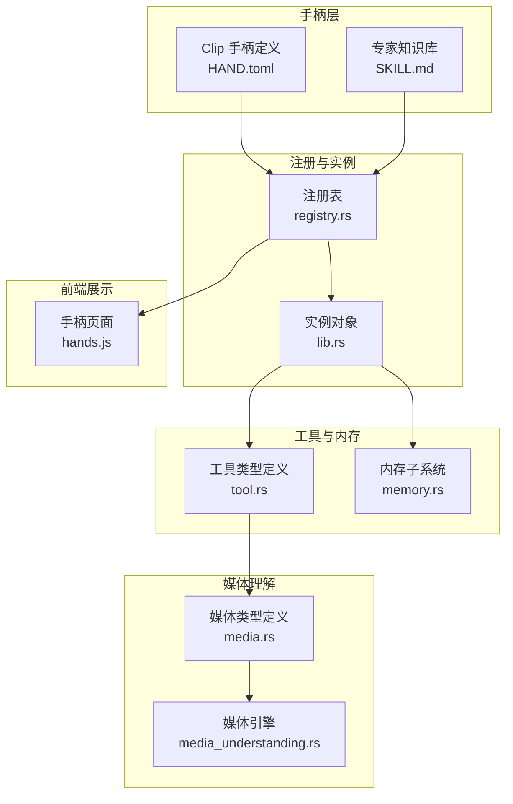
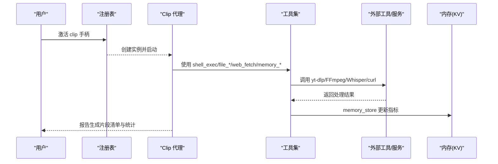
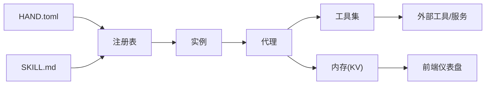
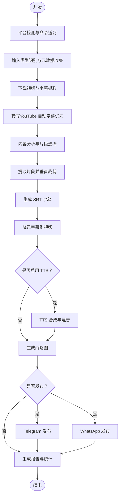

# Clip 手（视频剪辑）

<cite>
**本文引用的文件**
- [HAND.toml](file://crates/openfang-hands/bundled/clip/HAND.toml)
- [SKILL.md](file://crates/openfang-hands/bundled/clip/SKILL.md)
- [bundled.rs](file://crates/openfang-hands/src/bundled.rs)
- [registry.rs](file://crates/openfang-hands/src/registry.rs)
- [lib.rs](file://crates/openfang-hands/src/lib.rs)
- [media.rs](file://crates/openfang-types/src/media.rs)
- [media_understanding.rs](file://crates/openfang-runtime/src/media_understanding.rs)
- [tool.rs](file://crates/openfang-types/src/tool.rs)
- [hands.js](file://crates/openfang-api/static/js/pages/hands.js)
- [lib.rs](file://crates/openfang-memory/src/lib.rs)
</cite>

## 目录
1. [简介](#简介)
2. [项目结构](#项目结构)
3. [核心组件](#核心组件)
4. [架构总览](#架构总览)
5. [详细组件分析](#详细组件分析)
6. [依赖关系分析](#依赖关系分析)
7. [性能考量](#性能考量)
8. [故障排查指南](#故障排查指南)
9. [结论](#结论)
10. [附录](#附录)

## 简介
本文件为 Clip 手（视频剪辑）的系统化技术文档，面向希望理解并使用该手柄进行“从长视频中生成短视频片段”的用户与开发者。文档覆盖设计理念、编辑策略、处理流程、配置参数（HAND.toml）、专家知识注入（SKILL.md）、视频导入、剪辑操作、特效添加、导出设置、格式转换、质量优化、批量处理、元数据管理、自动化剪辑流程、模板使用、创意辅助功能，并提供实际使用案例、常见问题解决方案与性能优化建议。

## 项目结构
Clip 手柄位于 openfang 项目的“手柄”子系统中，采用“捆绑定义 + 专家技能”的方式发布：
- HAND.toml：定义手柄的元数据、工具需求、可配置项、系统提示词与仪表盘指标。
- SKILL.md：专家知识库，提供跨平台命令参考、转写与字幕生成、FFmpeg 处理技巧、发布平台对接等。
- 运行时注册与实例管理：通过注册表加载捆绑定义、激活实例、检查环境要求与可用性。
- 工具与内存：Clip 手柄声明使用 shell_exec、file_*、web_fetch、memory_* 等工具，用于执行外部命令、读写文件、网络抓取与状态持久化。
- 媒体理解：类型与运行时模块支持音频/视频分析能力，为转写与理解提供基础。

图表来源
- [HAND.toml:1-599](file://crates/openfang-hands/bundled/clip/HAND.toml#L1-L599)
- [SKILL.md:1-475](file://crates/openfang-hands/bundled/clip/SKILL.md#L1-L475)
- [registry.rs:1-406](file://crates/openfang-hands/src/registry.rs#L1-L406)
- [lib.rs:408-456](file://crates/openfang-hands/src/lib.rs#L408-L456)
- [tool.rs:1-650](file://crates/openfang-types/src/tool.rs#L1-L650)
- [lib.rs:1-20](file://crates/openfang-memory/src/lib.rs#L1-L20)
- [media.rs:49-91](file://crates/openfang-types/src/media.rs#L49-L91)
- [media_understanding.rs:382-429](file://crates/openfang-runtime/src/media_understanding.rs#L382-L429)
- [hands.js:658-687](file://crates/openfang-api/static/js/pages/hands.js#L658-L687)

章节来源
- [bundled.rs:1-333](file://crates/openfang-hands/src/bundled.rs#L1-L333)
- [registry.rs:108-125](file://crates/openfang-hands/src/registry.rs#L108-L125)

## 核心组件
- 手柄定义（HAND.toml）
  - 定义了 Clip 手柄的 ID、名称、描述、分类、图标、所需工具与二进制依赖。
  - 提供可配置项：语音转写（STT）提供商、文本转语音（TTS）提供商、发布目标（本地/Telegram/WhatsApp/两者）、平台凭据等。
  - 系统提示词（system_prompt）定义了 8 阶段处理流水线：Intake → Download → Transcribe → Analyze → Extract → TTS（可选）→ Publish（可选）→ Report。
  - 仪表盘指标：作业完成数、生成片段数、总时长、已发布到 Telegram/WhatsApp 的数量。
- 专家知识（SKILL.md）
  - 跨平台命令参考：yt-dlp、Whisper、FFmpeg、API 转写（Groq/OpenAI/Deepgram）、TTS（Edge/ChatGPT/ElevenLabs）、Telegram/WhatsApp 发布接口。
  - 字幕生成与样式化：SRT/ASS 格式、字幕时间戳对齐、样式属性。
  - 视频处理技巧：场景检测、静音检测、垂直视频裁剪、缩放+留边、缩略图生成、关键帧选择、联系册等。
  - 性能与质量：编码器预设、CRF、移动设备友好封装、多线程、覆盖写入等。
- 注册与实例（registry.rs、lib.rs）
  - 加载捆绑定义、激活实例、暂停/恢复/停用、错误标记、就绪状态计算。
  - 检查二进制依赖与环境变量可用性，支持按选项显示可用性。
- 工具与内存（tool.rs、memory.rs）
  - 工具类型定义与跨模型提供方的 JSON Schema 规范化。
  - 内存子系统抽象：结构化键值、语义检索、知识图谱，以及仪表盘指标的 KV 映射。
- 媒体理解（media.rs、media_understanding.rs）
  - 媒体理解结果结构与配置；默认音频模型映射；并发限制与最大任务数控制。

章节来源
- [HAND.toml:1-599](file://crates/openfang-hands/bundled/clip/HAND.toml#L1-L599)
- [SKILL.md:1-475](file://crates/openfang-hands/bundled/clip/SKILL.md#L1-L475)
- [registry.rs:290-406](file://crates/openfang-hands/src/registry.rs#L290-L406)
- [lib.rs:408-456](file://crates/openfang-hands/src/lib.rs#L408-L456)
- [tool.rs:1-650](file://crates/openfang-types/src/tool.rs#L1-L650)
- [lib.rs:1-20](file://crates/openfang-memory/src/lib.rs#L1-L20)
- [media.rs:49-91](file://crates/openfang-types/src/media.rs#L49-L91)
- [media_understanding.rs:382-429](file://crates/openfang-runtime/src/media_understanding.rs#L382-L429)

## 架构总览
Clip 手柄的运行时架构围绕“手柄定义 + 专家知识 + 工具调用 + 状态持久化”展开。系统通过注册表加载 HAND.toml 与 SKILL.md，激活实例后由代理执行系统提示词中的 8 阶段流程，期间通过 shell_exec 调用 yt-dlp、FFmpeg、Whisper、curl 等外部工具，借助 file_* 工具写入中间文件（如 SRT），并通过 memory_* 工具更新统计指标。前端通过 KV 键名映射到仪表盘展示。

图表来源
- [registry.rs:202-225](file://crates/openfang-hands/src/registry.rs#L202-L225)
- [HAND.toml:186-572](file://crates/openfang-hands/bundled/clip/HAND.toml#L186-L572)
- [SKILL.md:265-475](file://crates/openfang-hands/bundled/clip/SKILL.md#L265-L475)
- [hands.js:658-687](file://crates/openfang-api/static/js/pages/hands.js#L658-L687)

## 详细组件分析

### HAND.toml：配置参数与系统提示词
- 必需二进制与安装指引
  - ffmpeg、ffprobe、yt-dlp，分别提供视频处理、元数据分析与下载能力。
- 可配置项
  - STT 提供商：auto、本地 Whisper、Groq Whisper、OpenAI Whisper、Deepgram Nova-2。
  - TTS 提供商：禁用、Edge TTS、OpenAI TTS、ElevenLabs。
  - 发布目标：本地、Telegram、WhatsApp、两者。
  - 平台凭据：Telegram Bot Token、Chat ID；WhatsApp Access Token、Phone Number ID、Recipient。
- 系统提示词（8 阶段流水线）
  - 平台检测、输入类型识别、下载与元数据提取、转写（含 YouTube 自动字幕优先）、内容分析与片段选择、提取与处理（裁剪、字幕生成与烧录、可选 TTS 合成、缩略图生成）、可选发布（Telegram/WhatsApp）、报告与统计。
- 仪表盘指标
  - Jobs Completed、Clips Generated、Total Duration、Published to Telegram、Published to WhatsApp。

章节来源
- [HAND.toml:8-599](file://crates/openfang-hands/bundled/clip/HAND.toml#L8-L599)

### SKILL.md：专家知识注入
- 跨平台注意事项
  - FFmpeg/FFprobe/yt-dlp/Whisper 命令行参数在三大平台一致，差异仅在于 shell 语法与路径分隔符。
  - 字幕滤镜路径必须使用正斜杠；Windows 绝对路径需转义冒号。
- yt-dlp 参考
  - 格式选择、元数据检查、自动字幕与手动字幕下载、常用标志位。
- Whisper 参考
  - 音频提取、基础转写、模型大小与性能权衡、输出结构解析。
- YouTube json3 字幕解析
  - 事件与段落结构、时间戳换算规则。
- SRT 生成与样式
  - 行长度与断句规则、时间戳格式、样式化（ASS）。
- FFmpeg 视频处理
  - 场景检测、静音检测、精确裁剪、垂直视频（9:16）、字幕烧录、缩略图、关键帧选择、联系册。
- API 转写参考
  - Groq Whisper、OpenAI Whisper、Deepgram Nova-2 的请求与响应要点。
- TTS 参考
  - Edge TTS、OpenAI TTS、ElevenLabs 的调用方式与混音策略。
- 质量与性能提示
  - 编码器预设、CRF、移动设备友好封装、多线程、覆盖写入。
- Telegram/WhatsApp 发布接口
  - sendVideo 上传与发送、两步上传媒体再发消息、文件大小限制与重编码策略、常见错误与修复。

章节来源
- [SKILL.md:1-475](file://crates/openfang-hands/bundled/clip/SKILL.md#L1-L475)

### 注册与实例管理
- 加载捆绑定义：从 HAND.toml 与 SKILL.md 构建 HandDefinition，并加入注册表。
- 实例生命周期：激活、暂停、恢复、停用、错误标记、按代理查找。
- 就绪状态：结合需求检查与实例状态，判断是否满足运行条件或处于降级模式。
- 设置可用性：根据 provider_env 与 binary 判断选项可用性，便于前端展示。

章节来源
- [bundled.rs:5-63](file://crates/openfang-hands/src/bundled.rs#L5-L63)
- [registry.rs:108-125](file://crates/openfang-hands/src/registry.rs#L108-L125)
- [registry.rs:202-288](file://crates/openfang-hands/src/registry.rs#L202-L288)
- [registry.rs:290-406](file://crates/openfang-hands/src/registry.rs#L290-L406)

### 工具与内存
- 工具类型定义：统一的 ToolDefinition、ToolCall、ToolResult 结构，支持跨模型提供方的 JSON Schema 规范化。
- 内存子系统：结构化键值、语义检索、知识图谱，支持仪表盘指标的 KV 映射与前端渲染。

章节来源
- [tool.rs:1-650](file://crates/openfang-types/src/tool.rs#L1-L650)
- [lib.rs:1-20](file://crates/openfang-memory/src/lib.rs#L1-L20)
- [hands.js:658-687](file://crates/openfang-api/static/js/pages/hands.js#L658-L687)

### 媒体理解
- 媒体理解结果结构与配置：图像描述、音频转录、视频描述开关、并发度限制、首选提供方。
- 默认音频模型映射：不同提供方的默认模型名称。
- 并发限制：最大并发任务数被限制在安全范围。

章节来源
- [media.rs:49-91](file://crates/openfang-types/src/media.rs#L49-L91)
- [media_understanding.rs:382-429](file://crates/openfang-runtime/src/media_understanding.rs#L382-L429)

## 依赖关系分析
- HAND.toml 与 SKILL.md 是 Clip 手柄的核心契约，前者定义行为与配置，后者提供专家知识。
- 注册表负责加载与校验 HAND.toml，实例化代理并跟踪状态。
- 代理在执行阶段依赖工具集（shell_exec/file_* 等）与外部服务（yt-dlp/FFmpeg/Whisper/curl）。
- 统计与展示通过 memory_store 与前端 KV 映射实现。

图表来源
- [HAND.toml:1-599](file://crates/openfang-hands/bundled/clip/HAND.toml#L1-L599)
- [SKILL.md:1-475](file://crates/openfang-hands/bundled/clip/SKILL.md#L1-L475)
- [registry.rs:108-125](file://crates/openfang-hands/src/registry.rs#L108-L125)
- [hands.js:658-687](file://crates/openfang-api/static/js/pages/hands.js#L658-L687)

章节来源
- [registry.rs:108-125](file://crates/openfang-hands/src/registry.rs#L108-L125)
- [bundled.rs:5-63](file://crates/openfang-hands/src/bundled.rs#L5-L63)

## 性能考量
- 编码器与质量
  - 预设选择：快速预设适合预览，慢速预设适合最终输出。
  - CRF 控制：数值越低质量越高且体积越大，需在质量与体积间平衡。
  - 移动端友好封装：添加 faststart 以提升流媒体播放体验。
- 并发与资源
  - 使用 -threads 0 让编码器自动检测 CPU 核心数。
  - 媒体理解模块限制最大并发，避免资源争用。
- 文件大小与带宽
  - Telegram/WhatsApp 对上传有大小限制，必要时先用 FFmpeg 重编码以满足限制。
- I/O 与中间文件
  - 使用 -y 覆盖写入，避免交互式确认导致阻塞。
  - 严格控制中间文件清理，减少磁盘占用。

章节来源
- [SKILL.md:358-367](file://crates/openfang-hands/bundled/clip/SKILL.md#L358-L367)
- [media_understanding.rs:406-413](file://crates/openfang-runtime/src/media_understanding.rs#L406-L413)

## 故障排查指南
- 环境依赖未满足
  - 检查注册表对 ffmpeg、ffprobe、yt-dlp 的可用性，确认二进制存在且可执行。
- API 凭据缺失
  - Telegram/WhatsApp 发布需要相应凭据；若缺失会跳过对应平台但不中断作业。
- 文件过大
  - Telegram/WhatsApp 上传失败时，按 SKILL.md 中的重编码建议缩小体积后再试。
- 跨平台路径问题
  - FFmpeg 字幕滤镜路径必须使用正斜杠；Windows 绝对路径需转义冒号。
- 速率限制
  - 发布超过一定数量时增加延迟，避免触发平台限流。
- 统计未更新
  - 确认 memory_store 是否正确写入仪表盘指标键名，前端 KV 渲染是否成功。

章节来源
- [registry.rs:290-406](file://crates/openfang-hands/src/registry.rs#L290-L406)
- [HAND.toml:450-534](file://crates/openfang-hands/bundled/clip/HAND.toml#L450-L534)
- [SKILL.md:368-475](file://crates/openfang-hands/bundled/clip/SKILL.md#L368-L475)

## 结论
Clip 手柄通过明确的 8 阶段流水线、丰富的专家知识与严格的跨平台兼容性设计，实现了从长视频到短视频片段的自动化生产。其配置灵活、工具完备、统计可观测，既适合个人批量处理，也可作为团队内容生产的基础设施。遵循本文档的配置与最佳实践，可在保证质量的同时显著提升效率。

## 附录

### 使用案例
- 案例一：YouTube 视频转短视频
  - 输入：YouTube 链接
  - 步骤：自动下载、尝试 YouTube 自动字幕、无字幕则使用 Whisper 转写、基于内容挑选 3-5 个片段、垂直裁剪、生成 SRT 并烧录、生成缩略图、可选 TTS 合成、发布到 Telegram/WhatsApp
  - 关键点：优先使用 YouTube 自动字幕以节省转写成本；按 SKILL.md 的字幕生成规则构建 SRT；必要时重编码以满足平台上传限制
- 案例二：本地视频批量处理
  - 输入：本地 MP4 文件
  - 步骤：ffprobe 元数据检查、Whisper 转写、片段选择、垂直裁剪、字幕生成与烧录、缩略图生成、发布
  - 关键点：注意跨平台路径与字幕滤镜路径分隔符；Windows 使用正斜杠并转义冒号

章节来源
- [HAND.toml:222-572](file://crates/openfang-hands/bundled/clip/HAND.toml#L222-L572)
- [SKILL.md:28-475](file://crates/openfang-hands/bundled/clip/SKILL.md#L28-L475)

### 配置参数速查
- STT 提供商
  - auto、whisper_local、groq_whisper、openai_whisper、deepgram
- TTS 提供商
  - none、edge_tts、openai_tts、elevenlabs
- 发布目标
  - local_only、telegram、whatsapp、both
- Telegram
  - telegram_bot_token、telegram_chat_id
- WhatsApp
  - whatsapp_token、whatsapp_phone_id、whatsapp_recipient

章节来源
- [HAND.toml:59-183](file://crates/openfang-hands/bundled/clip/HAND.toml#L59-L183)

### 流程图：片段选择与处理

图表来源
- [HAND.toml:204-572](file://crates/openfang-hands/bundled/clip/HAND.toml#L204-L572)
- [SKILL.md:156-251](file://crates/openfang-hands/bundled/clip/SKILL.md#L156-L251)