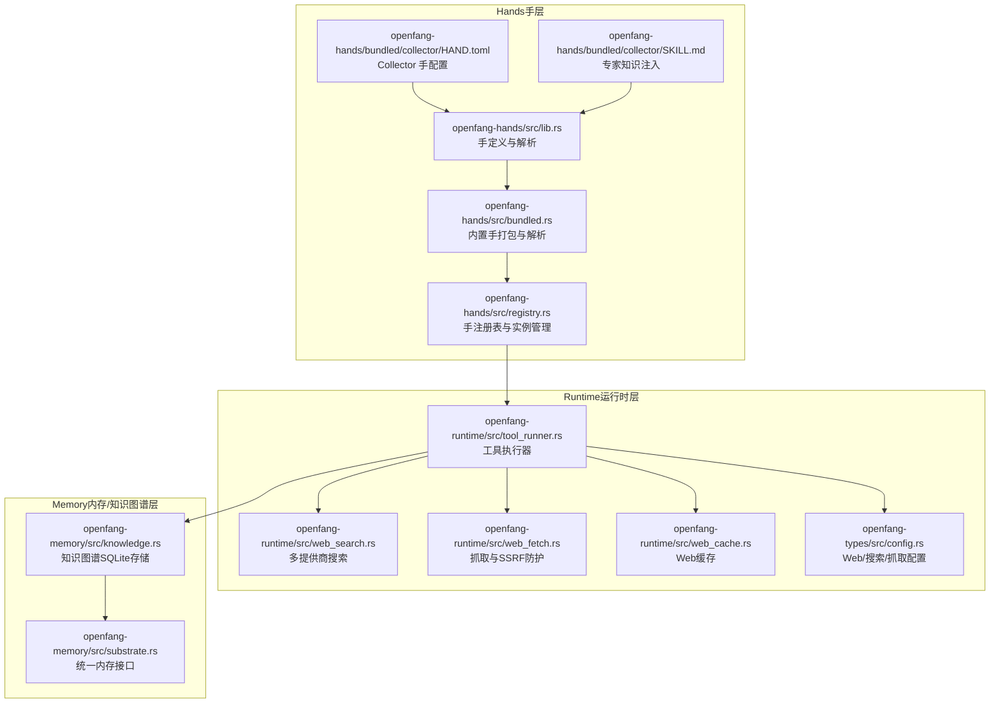
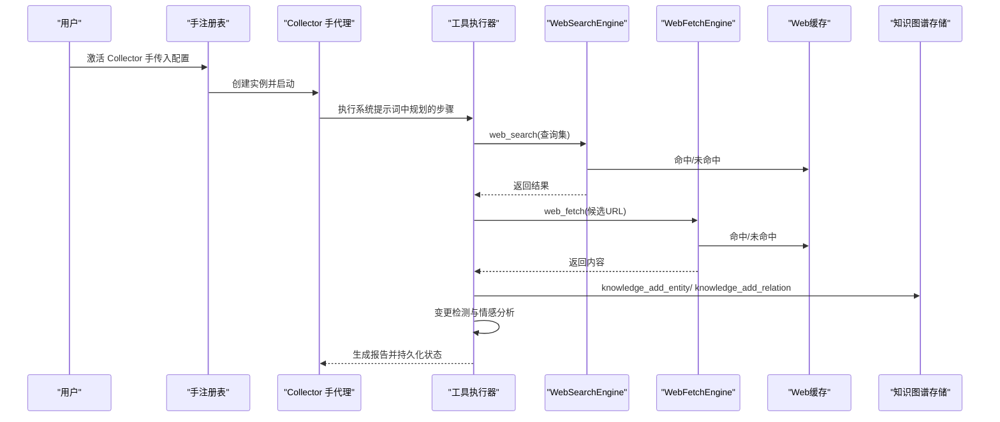
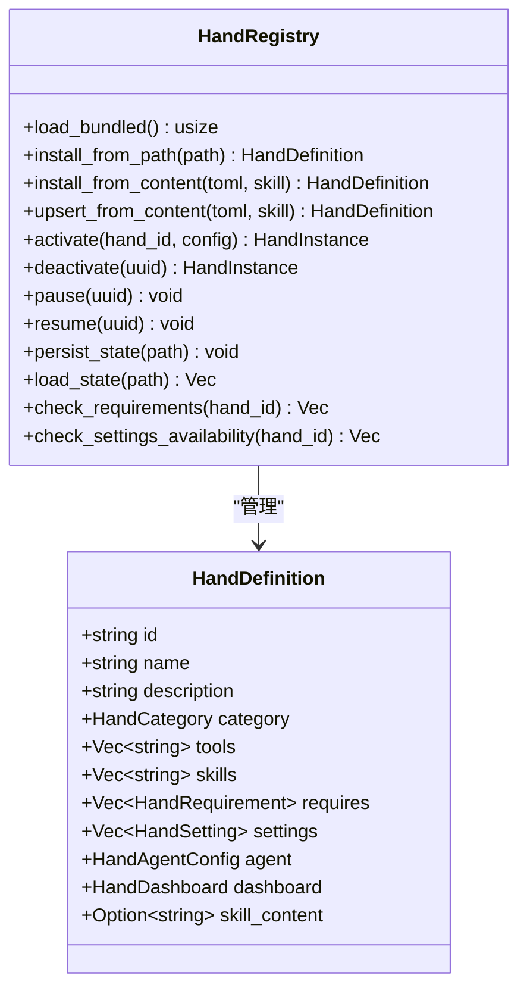
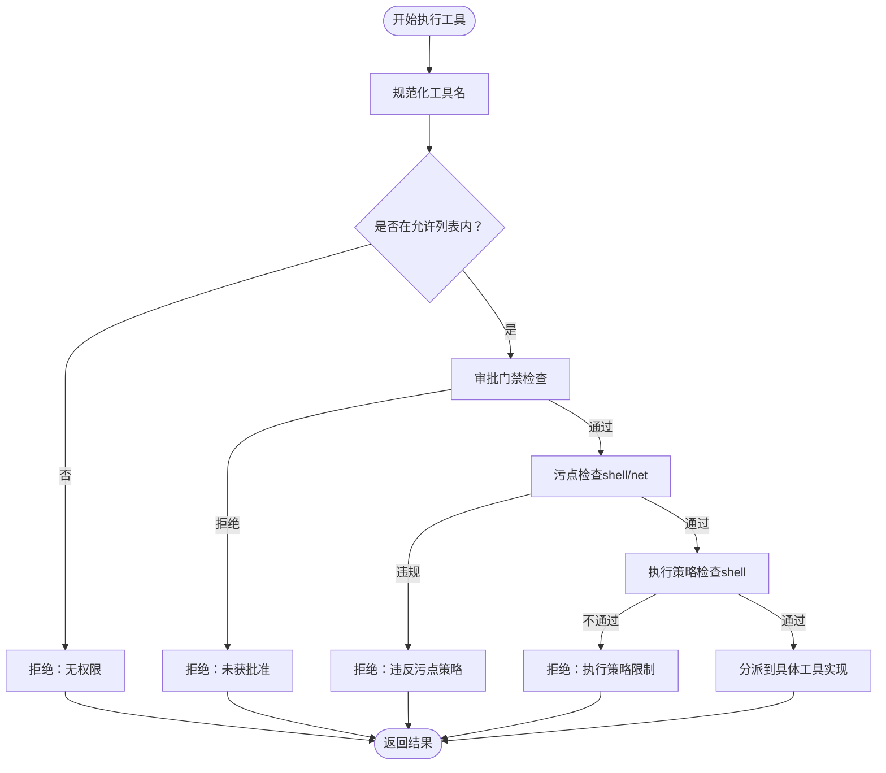
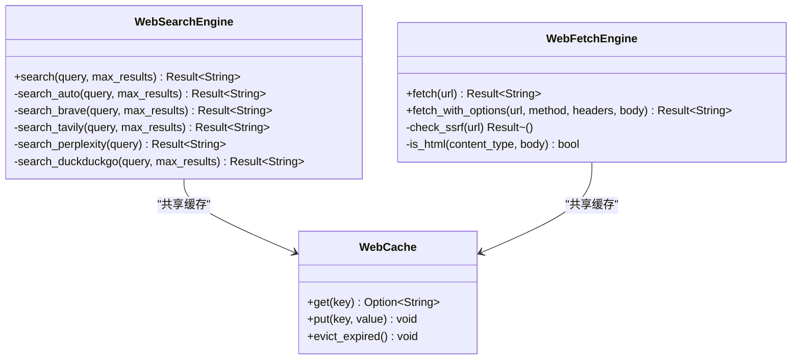
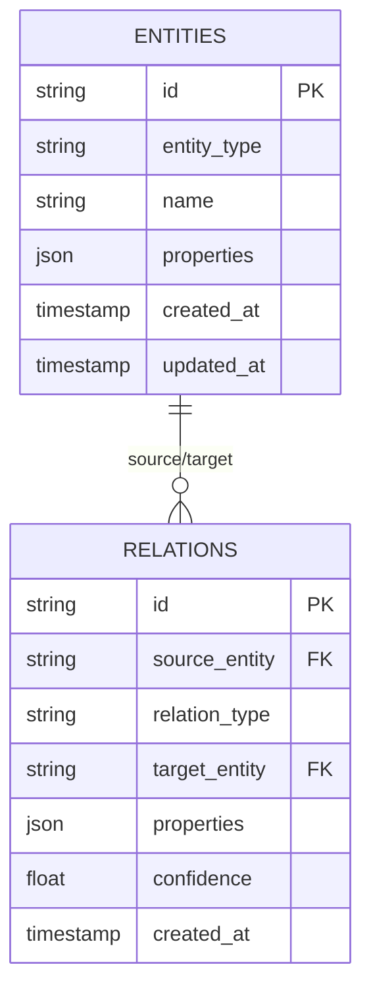
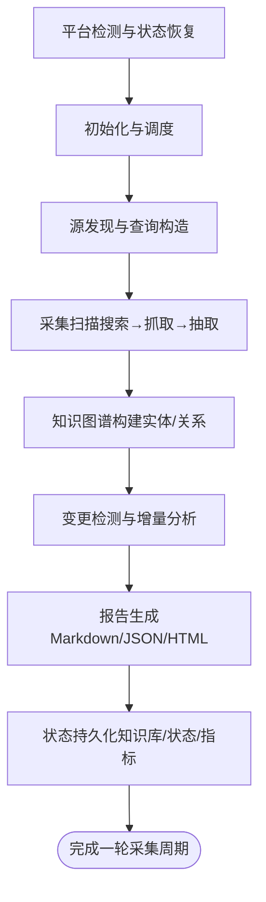
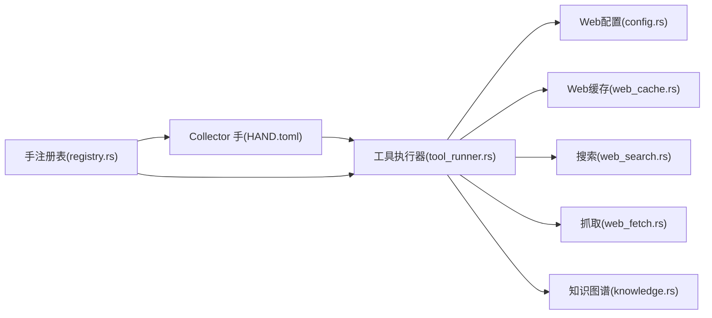

# Collector 手（情报收集）

<cite>
**本文档引用的文件**
- [HAND.toml](file://crates/openfang-hands/bundled/collector/HAND.toml)
- [SKILL.md](file://crates/openfang-hands/bundled/collector/SKILL.md)
- [lib.rs](file://crates/openfang-hands/src/lib.rs)
- [bundled.rs](file://crates/openfang-hands/src/bundled.rs)
- [registry.rs](file://crates/openfang-hands/src/registry.rs)
- [web_search.rs](file://crates/openfang-runtime/src/web_search.rs)
- [web_fetch.rs](file://crates/openfang-runtime/src/web_fetch.rs)
- [web_cache.rs](file://crates/openfang-runtime/src/web_cache.rs)
- [knowledge.rs](file://crates/openfang-memory/src/knowledge.rs)
- [tool_runner.rs](file://crates/openfang-runtime/src/tool_runner.rs)
- [config.rs](file://crates/openfang-types/src/config.rs)
- [substrate.rs](file://crates/openfang-memory/src/substrate.rs)
</cite>

## 目录
1. [简介](#简介)
2. [项目结构](#项目结构)
3. [核心组件](#核心组件)
4. [架构总览](#架构总览)
5. [详细组件分析](#详细组件分析)
6. [依赖关系分析](#依赖关系分析)
7. [性能考量](#性能考量)
8. [故障排查指南](#故障排查指南)
9. [结论](#结论)
10. [附录](#附录)

## 简介
Collector 手（情报收集）是 OpenFang 生态中的一个“手”（Hand），即预置的、可直接激活的自治能力包。它以 OSINT（公开情报）方法论为核心，围绕任意目标（公司、人物、技术、市场、话题）进行持续监控，通过多源网络搜索与抓取、实体抽取、知识图谱构建、变更检测与情感分析，形成“活的知识库”，并按周期生成情报简报。其系统设计强调：
- 可配置性：通过 HAND.toml 的设置项灵活调整采集深度、更新频率、关注领域等
- 专家知识注入：通过 SKILL.md 提供 OSINT 方法论、实体抽取模式、知识图谱最佳实践、变更检测与情感分析规则
- 多源数据整合：支持多种搜索与抓取引擎，具备缓存与去重能力
- 数据质量控制：来源可靠性分级、信源评估清单、置信度标注
- 存储与可视化：知识图谱持久化、仪表盘指标、状态持久化
- 自动化与可观测：计划任务、事件发布、异常处理、报告生成

## 项目结构
本节聚焦与 Collector 手相关的模块与文件组织方式，展示其在 OpenFang 中的位置与职责边界。

**图表来源**
- [lib.rs:328-366](file://crates/openfang-hands/src/lib.rs#L328-L366)
- [bundled.rs:51-63](file://crates/openfang-hands/src/bundled.rs#L51-L63)
- [registry.rs:108-125](file://crates/openfang-hands/src/registry.rs#L108-L125)
- [web_search.rs:30-42](file://crates/openfang-runtime/src/web_search.rs#L30-L42)
- [web_fetch.rs:15-38](file://crates/openfang-runtime/src/web_fetch.rs#L15-L38)
- [web_cache.rs:16-20](file://crates/openfang-runtime/src/web_cache.rs#L16-L20)
- [knowledge.rs:15-26](file://crates/openfang-memory/src/knowledge.rs#L15-L26)
- [substrate.rs:26-36](file://crates/openfang-memory/src/substrate.rs#L26-L36)

**章节来源**
- [lib.rs:1-800](file://crates/openfang-hands/src/lib.rs#L1-L800)
- [bundled.rs:1-333](file://crates/openfang-hands/src/bundled.rs#L1-L333)
- [registry.rs:38-45](file://crates/openfang-hands/src/registry.rs#L38-L45)

## 核心组件
- 手定义与解析：负责从 HAND.toml 解析手的元数据、工具列表、仪表盘指标、系统提示词等，并支持设置解析与注入专家知识。
- 内置手打包：将 HAND.toml 与 SKILL.md 编译进二进制，便于分发与加载。
- 注册表与实例管理：维护手定义、活跃实例、状态持久化与恢复、就绪状态检查。
- 工具执行器：根据工具名称路由到具体实现，执行前进行能力校验、审批门禁、污点检查与策略限制。
- 搜索与抓取：多提供商搜索自动回退、HTML→Markdown提取、SSRF防护、响应大小与字符数限制、缓存。
- 知识图谱：基于 SQLite 的实体与关系存储，支持图查询与模式匹配。
- 统一内存接口：抽象结构化键值、语义检索、知识图谱、会话与使用统计。

**章节来源**
- [lib.rs:328-366](file://crates/openfang-hands/src/lib.rs#L328-L366)
- [bundled.rs:51-63](file://crates/openfang-hands/src/bundled.rs#L51-L63)
- [registry.rs:38-45](file://crates/openfang-hands/src/registry.rs#L38-L45)
- [tool_runner.rs:99-526](file://crates/openfang-runtime/src/tool_runner.rs#L99-L526)
- [web_search.rs:30-42](file://crates/openfang-runtime/src/web_search.rs#L30-L42)
- [web_fetch.rs](file://crates/openfang-runtime/src/web_fetch.rs#-L38)
- [knowledge.rs:15-26](file://crates/openfang-memory/src/knowledge.rs#L15-L26)
- [substrate.rs:26-36](file://crates/openfang-memory/src/substrate.rs#L26-L36)

## 架构总览
下图展示了 Collector 手从激活到执行一次完整采集周期的关键交互路径。

**图表来源**
- [registry.rs:202-225](file://crates/openfang-hands/src/registry.rs#L202-L225)
- [tool_runner.rs:99-526](file://crates/openfang-runtime/src/tool_runner.rs#L99-L526)
- [web_search.rs:44-67](file://crates/openfang-runtime/src/web_search.rs#L44-L67)
- [web_fetch.rs:40-166](file://crates/openfang-runtime/src/web_fetch.rs#L40-L166)
- [web_cache.rs:31-45](file://crates/openfang-runtime/src/web_cache.rs#L31-L45)
- [knowledge.rs:27-80](file://crates/openfang-memory/src/knowledge.rs#L27-L80)

## 详细组件分析

### HAND.toml 配置参数详解
- 目标主题（target_subject）：要监控的对象（公司、人物、技术、市场、话题）
- 采集深度（collection_depth）：表面/深度/穷举三种层级
- 更新频率（update_frequency）：每小时/每6小时/日/周等
- 关注领域（focus_area）：市场情报/商业情报/竞争分析/人物追踪/技术监控/通用情报
- 变更告警（alert_on_changes）：是否在发现重大变化时发布事件
- 报告格式（report_format）：Markdown/JSON/HTML
- 每轮最大来源数（max_sources_per_cycle）：10/30/50/100
- 情感追踪（track_sentiment）：是否跟踪随时间的情感趋势
- 工具清单（tools）：shell_exec、file_*、web_*、memory_*、schedule_*、knowledge_*、event_publish
- 仪表盘指标（dashboard.metrics）：数据点总数、已追踪实体数、报告生成数、最后更新时间

这些参数在系统提示词中被转化为具体的采集策略与输出格式，并通过 resolve_settings 注入到系统提示词中。

**章节来源**
- [HAND.toml:10-156](file://crates/openfang-hands/bundled/collector/HAND.toml#L10-L156)
- [lib.rs:209-266](file://crates/openfang-hands/src/lib.rs#L209-L266)

### SKILL.md 专家知识注入
- OSINT 方法论：规划—采集—处理—分析—分发—反馈
- 来源可靠性分级：官方/机构/专业/社区/匿名
- 查询构造：按关注领域定制查询模板
- 实体抽取模式：人、组织、产品、事件、金融、技术、地点、日期时间
- 知识图谱最佳实践：实体/关系模式、常见关系类型
- 变更检测方法：快照对比、变更分类与重要性评分
- 情感分析启发式：正向/负向/中性判定与滚动平均
- 报告模板：简报结构与元数据字段

这些专家知识作为系统提示词的一部分，指导代理在采集过程中进行高质量的数据处理与分析。

**章节来源**
- [SKILL.md:10-272](file://crates/openfang-hands/bundled/collector/SKILL.md#L10-L272)

### 手定义与注册表
- HandDefinition：从 HAND.toml 解析得到的完整手定义，包含 id、name、description、category、tools、skills、requires、settings、agent、dashboard 等
- HandRegistry：加载内置手、安装自定义手、激活/暂停/恢复/停用实例、持久化状态、检查就绪状态
- 设置解析：将用户配置映射为提示词块与环境变量，用于注入系统提示词

**图表来源**
- [lib.rs:328-366](file://crates/openfang-hands/src/lib.rs#L328-L366)
- [registry.rs:38-45](file://crates/openfang-hands/src/registry.rs#L38-L45)

**章节来源**
- [lib.rs:328-366](file://crates/openfang-hands/src/lib.rs#L328-L366)
- [registry.rs:108-125](file://crates/openfang-hands/src/registry.rs#L108-L125)
- [registry.rs:202-225](file://crates/openfang-hands/src/registry.rs#L202-L225)

### 工具执行与安全策略
- 能力校验：仅允许在 allowed_tools 列表中的工具执行
- 审批门禁：对需要人工审批的工具请求批准
- 污点检查：防止 shell_exec 注入与 net_fetch 泄密
- 执行策略：根据 exec_policy 控制 shell 命令的允许范围
- 工具路由：web_search/web_fetch、memory_*、schedule_*、knowledge_*、event_publish 等

**图表来源**
- [tool_runner.rs:99-171](file://crates/openfang-runtime/src/tool_runner.rs#L99-L171)
- [tool_runner.rs:213-266](file://crates/openfang-runtime/src/tool_runner.rs#L213-L266)

**章节来源**
- [tool_runner.rs:99-526](file://crates/openfang-runtime/src/tool_runner.rs#L99-L526)

### 搜索与抓取引擎
- 多提供商搜索：Tavily（AI原生）、Brave、Perplexity、DuckDuckGo；支持自动回退
- 抓取引擎：SSRF 防护、HTML→Markdown、响应大小与字符数限制、缓存
- 缓存：基于 DashMap 的 TTL 缓存，零 TTL 即禁用

**图表来源**
- [web_search.rs:30-42](file://crates/openfang-runtime/src/web_search.rs#L30-L42)
- [web_fetch.rs:15-38](file://crates/openfang-runtime/src/web_fetch.rs#L15-L38)
- [web_cache.rs:16-20](file://crates/openfang-runtime/src/web_cache.rs#L16-L20)

**章节来源**
- [web_search.rs:44-102](file://crates/openfang-runtime/src/web_search.rs#L44-L102)
- [web_fetch.rs:40-166](file://crates/openfang-runtime/src/web_fetch.rs#L40-L166)
- [web_cache.rs:31-65](file://crates/openfang-runtime/src/web_cache.rs#L31-L65)

### 知识图谱与存储管理
- 实体与关系：支持添加实体、添加关系、图模式查询
- 存储后端：SQLite；统一内存接口 MemorySubstrate 抽象结构化、语义、知识图谱、会话与使用统计
- 图查询：支持源/关系/目标过滤与深度限制

**图表来源**
- [knowledge.rs:27-80](file://crates/openfang-memory/src/knowledge.rs#L27-L80)
- [knowledge.rs:82-196](file://crates/openfang-memory/src/knowledge.rs#L82-L196)
- [substrate.rs:26-36](file://crates/openfang-memory/src/substrate.rs#L26-L36)

**章节来源**
- [knowledge.rs:27-196](file://crates/openfang-memory/src/knowledge.rs#L27-L196)
- [substrate.rs:26-36](file://crates/openfang-memory/src/substrate.rs#L26-L36)

### 收集策略与处理流程
- 平台检测与状态恢复：操作系统识别、状态记忆、知识图谱查询
- 初始化与调度：首次运行创建采集计划、解析目标类型、构建查询集、存储目标画像
- 源发现与查询构造：按关注领域生成查询集合，加入时间性查询
- 采集扫描：搜索→抓取→实体抽取→标注置信度与相关性
- 知识图谱构建：新增实体与关系，附加元数据
- 变更检测与增量分析：对比快照，识别新增/变更/消失/关系变化，评分并告警
- 报告生成：按配置格式输出，保存到文件
- 状态持久化：知识库快照、运行状态、仪表盘指标

**图表来源**
- [HAND.toml:157-324](file://crates/openfang-hands/bundled/collector/HAND.toml#L157-L324)

**章节来源**
- [HAND.toml:157-324](file://crates/openfang-hands/bundled/collector/HAND.toml#L157-L324)

### 数据质量控制与隐私保护
- 数据质量控制
  - 来源可靠性分级与信源评估清单（时效性、原始vs二次、交叉验证、偏见检查、具体性、历史可靠性）
  - 置信度标注与降级规则
  - 结果截断与可读性提取（HTML→Markdown）
- 隐私保护与安全
  - SSRF 防护：禁止访问私有/元数据地址，阻断 IPv4/IPv6 私网
  - 污点检查：阻止 shell_exec 注入与 net_fetch 泄密
  - 执行策略：exec_policy 控制 shell 命令允许范围
  - 缓存与去重：Web 缓存减少重复抓取与带宽消耗

**章节来源**
- [SKILL.md:260-272](file://crates/openfang-hands/bundled/collector/SKILL.md#L260-L272)
- [web_fetch.rs:185-235](file://crates/openfang-runtime/src/web_fetch.rs#L185-L235)
- [tool_runner.rs:213-266](file://crates/openfang-runtime/src/tool_runner.rs#L213-L266)
- [web_cache.rs:31-45](file://crates/openfang-runtime/src/web_cache.rs#L31-L45)

### 自动化处理流程与异常处理
- 自动化：计划任务（schedule_*）、事件发布（event_publish）、仪表盘指标更新
- 异常处理：工具执行错误包装为 ToolResult；注册表错误类型；搜索/抓取失败回退与日志记录

**章节来源**
- [HAND.toml:326-346](file://crates/openfang-hands/bundled/collector/HAND.toml#L326-L346)
- [lib.rs:18-36](file://crates/openfang-hands/src/lib.rs#L18-L36)
- [web_search.rs:44-67](file://crates/openfang-runtime/src/web_search.rs#L44-L67)

## 依赖关系分析
- Collector 手依赖运行时工具（web_search/web_fetch/memory/schedule/knowledge/event）
- 运行时工具依赖配置（WebConfig/WebFetchConfig）与缓存
- 知识图谱依赖统一内存接口与 SQLite 后端
- 注册表负责生命周期管理与状态持久化

**图表来源**
- [config.rs:182-307](file://crates/openfang-types/src/config.rs#L182-L307)
- [web_search.rs:30-42](file://crates/openfang-runtime/src/web_search.rs#L30-L42)
- [web_fetch.rs:15-38](file://crates/openfang-runtime/src/web_fetch.rs#L15-L38)
- [web_cache.rs:16-20](file://crates/openfang-runtime/src/web_cache.rs#L16-L20)
- [knowledge.rs:15-26](file://crates/openfang-memory/src/knowledge.rs#L15-L26)
- [registry.rs:38-45](file://crates/openfang-hands/src/registry.rs#L38-L45)

**章节来源**
- [config.rs:182-307](file://crates/openfang-types/src/config.rs#L182-L307)
- [registry.rs:38-45](file://crates/openfang-hands/src/registry.rs#L38-L45)

## 性能考量
- 缓存策略：Web 缓存可显著降低重复请求成本；TTL 可按需调优
- 结果截断：抓取内容按字符上限截断，避免超大响应影响性能
- 搜索回退：优先可用 API，自动回退至免费提供商，平衡质量与成本
- 并发与限流：抓取/搜索的并发与超时配置可调
- 知识图谱查询：限制返回数量与遍历深度，避免大规模联结开销

[本节为通用指导，无需特定文件引用]

## 故障排查指南
- 手未激活或重复激活：检查注册表错误类型与实例状态
- 工具执行失败：查看 ToolResult 的 is_error 字段与内容；确认能力列表、审批状态、污点检查与执行策略
- 搜索/抓取异常：检查 API 密钥环境变量、提供商可用性、网络连通性、SSRF 阻断原因
- 知识图谱写入失败：检查数据库连接与迁移状态
- 报告未生成：确认 report_format 与输出路径权限

**章节来源**
- [lib.rs:18-36](file://crates/openfang-hands/src/lib.rs#L18-L36)
- [tool_runner.rs:514-526](file://crates/openfang-runtime/src/tool_runner.rs#L514-L526)
- [web_search.rs:44-67](file://crates/openfang-runtime/src/web_search.rs#L44-L67)
- [web_fetch.rs:185-235](file://crates/openfang-runtime/src/web_fetch.rs#L185-L235)
- [knowledge.rs:27-51](file://crates/openfang-memory/src/knowledge.rs#L27-L51)

## 结论
Collector 手通过严谨的 OSINT 方法论、可配置的采集策略、多源数据整合与知识图谱构建，实现了对任意目标的持续监控与智能分析。其设计在自动化、数据质量控制、隐私安全与可观测性方面均有明确约束与保障，适合在生产环境中稳定运行并持续演进。

[本节为总结性内容，无需特定文件引用]

## 附录

### 实际使用案例
- 公司监控：每日采集新闻、财报、招聘、融资、产品动态，构建“公司画像”与“人物关系图”
- 技术追踪：按季度跟踪技术路线图、基准测试、采用率与竞品对比
- 市场情报：按月汇总行业趋势、政策法规、市场规模与竞争格局
- 人物追踪：持续关注关键人物的演讲、出版物、社交活动与职业变迁

[本节为概念性示例，无需特定文件引用]

### 常见问题与解决方案
- 无法启用浏览器相关工具：确保 Chromium/Chrome 可用或满足要求检查
- 搜索结果为空：切换提供商或调整查询关键词与时间范围
- 报告格式不符合预期：检查 report_format 设置与输出目录权限
- 变更告警过于频繁：提高变更评分阈值或调整关注领域

[本节为通用指导，无需特定文件引用]

### 性能优化建议
- 合理设置 update_frequency 与 max_sources_per_cycle
- 开启 Web 缓存并适当延长 TTL
- 使用更精确的查询模板减少无效结果
- 对高成本来源（如付费墙）进行标记与降级处理

[本节为通用指导，无需特定文件引用]