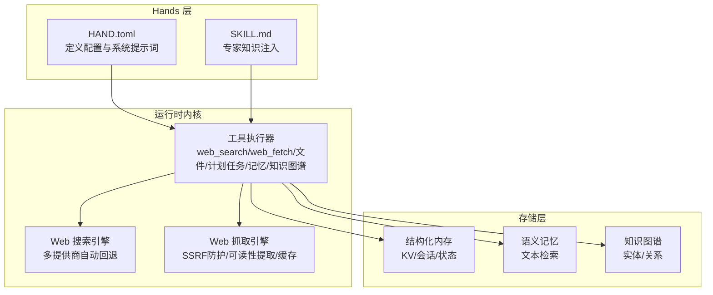
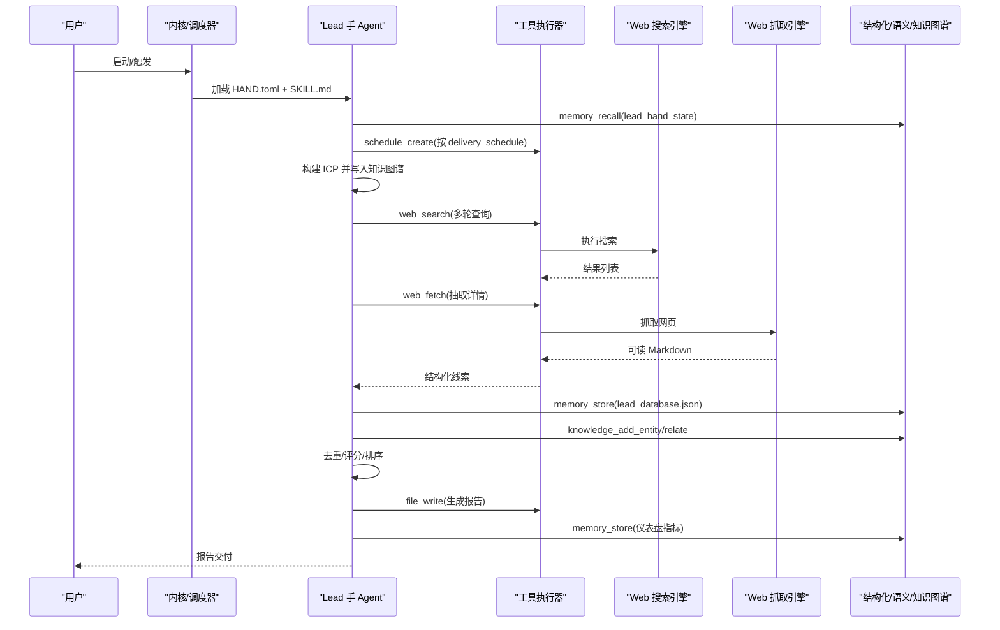
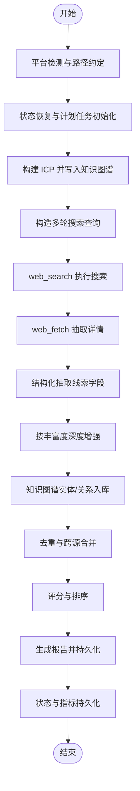
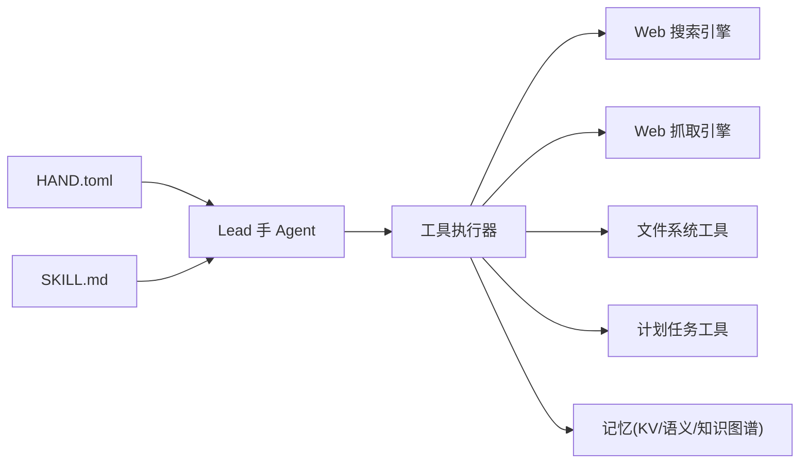

# Lead 手（潜在客户挖掘）

<cite>
**本文引用的文件**
- [HAND.toml](file://crates/openfang-hands/bundled/lead/HAND.toml)
- [SKILL.md](file://crates/openfang-hands/bundled/lead/SKILL.md)
- [lib.rs](file://crates/openfang-hands/src/lib.rs)
- [bundled.rs](file://crates/openfang-hands/src/bundled.rs)
- [tool_runner.rs](file://crates/openfang-runtime/src/tool_runner.rs)
- [web_search.rs](file://crates/openfang-runtime/src/web_search.rs)
- [web_fetch.rs](file://crates/openfang-runtime/src/web_fetch.rs)
- [host_functions.rs](file://crates/openfang-runtime/src/host_functions.rs)
- [workspace_sandbox.rs](file://crates/openfang-runtime/src/workspace_sandbox.rs)
- [memory.rs](file://crates/openfang-types/src/memory.rs)
- [lib.rs](file://crates/openfang-memory/src/lib.rs)
- [scheduler.js](file://crates/openfang-api/static/js/pages/scheduler.js)
- [hands.js](file://crates/openfang-api/static/js/pages/hands.js)
</cite>

## 目录
1. [简介](#简介)
2. [项目结构](#项目结构)
3. [核心组件](#核心组件)
4. [架构总览](#架构总览)
5. [详细组件分析](#详细组件分析)
6. [依赖关系分析](#依赖关系分析)
7. [性能考量](#性能考量)
8. [故障排查指南](#故障排查指南)
9. [结论](#结论)
10. [附录](#附录)

## 简介
本文件面向“Lead 手（潜在客户挖掘）”功能，系统化阐述其设计理念、挖掘策略、数据采集与处理流程、配置参数与专家知识注入、自动化调度与报告生成、合规与安全实践，以及与系统其他模块的集成方式。目标是帮助非技术读者快速上手，同时为工程师提供可操作的实现参考。

## 项目结构
Lead 手作为“Hands”之一，属于预置的自治能力包，通过 HAND.toml 定义配置项与系统提示词，通过 SKILL.md 注入专家知识；运行时由内核调度，借助搜索、抓取、知识图谱与内存等基础设施完成端到端的潜在客户挖掘与交付。

图表来源
- [lib.rs:328-366](file://crates/openfang-hands/src/lib.rs#L328-L366)
- [web_search.rs:17-42](file://crates/openfang-runtime/src/web_search.rs#L17-L42)
- [web_fetch.rs:15-38](file://crates/openfang-runtime/src/web_fetch.rs#L15-L38)
- [lib.rs:1-20](file://crates/openfang-memory/src/lib.rs#L1-L20)

章节来源
- [lib.rs:5-49](file://crates/openfang-hands/src/bundled.rs#L5-L49)
- [lib.rs:328-366](file://crates/openfang-hands/src/lib.rs#L328-L366)

## 核心组件
- 配置与系统提示词：通过 HAND.toml 声明可调参数、仪表盘指标、工具集与系统提示词模板，确保 Agent 在不同场景下具备一致的执行范式。
- 专家知识注入：通过 SKILL.md 提供 ICP 构建、查询模式、丰富度策略、评分体系、去重规则与输出格式模板，形成可复用的业务规则。
- 工具链：运行时通过 web_search/web_fetch 进行公开信息采集，通过文件系统工具进行本地持久化，通过计划任务工具实现自动化调度，通过记忆与知识图谱工具实现状态与结构化知识管理。
- 存储与检索：结构化内存用于保存状态与报告；知识图谱用于实体与关系建模；语义记忆用于上下文检索。

章节来源
- [HAND.toml:1-336](file://crates/openfang-hands/bundled/lead/HAND.toml#L1-L336)
- [SKILL.md:1-236](file://crates/openfang-hands/bundled/lead/SKILL.md#L1-L236)
- [lib.rs:155-201](file://crates/openfang-hands/src/lib.rs#L155-L201)
- [lib.rs:268-272](file://crates/openfang-hands/src/lib.rs#L268-L272)

## 架构总览
Lead 手的执行生命周期包括：启动与状态恢复、目标画像构建、多轮搜索发现、丰富度增强、去重与评分、报告生成与持久化、仪表盘指标更新。系统通过工具执行器统一调度各类外部能力，并以知识图谱与内存作为状态与知识中枢。

图表来源
- [HAND.toml:163-314](file://crates/openfang-hands/bundled/lead/HAND.toml#L163-L314)
- [tool_runner.rs:2061-2099](file://crates/openfang-runtime/src/tool_runner.rs#L2061-L2099)
- [web_search.rs:44-67](file://crates/openfang-runtime/src/web_search.rs#L44-L67)
- [web_fetch.rs:45-166](file://crates/openfang-runtime/src/web_fetch.rs#L45-L166)
- [memory.rs:201-327](file://crates/openfang-types/src/memory.rs#L201-L327)

## 详细组件分析

### 配置参数与系统提示词（HAND.toml）
- 可配置项
  - 目标行业、目标角色、公司规模、地理聚焦、发现来源（网络搜索/LinkedIn/Crunchbase/自定义）、输出格式（CSV/JSON/Markdown 表格）、每份报告线索数、交付时间表、丰富度深度（基础/标准/深度）。
- 系统提示词阶段化流程
  - 平台检测与路径约定
  - 状态恢复与计划任务设置
  - 目标画像（ICP）构建与知识图谱落库
  - 多查询搜索与线索抽取
  - 丰富度增强与知识图谱扩展
  - 去重、评分、排序与报告生成
  - 状态持久化与仪表盘指标更新
- 仪表盘指标
  - 发现线索总数、已生成报告数、最近报告日期、唯一公司数

章节来源
- [HAND.toml:10-161](file://crates/openfang-hands/bundled/lead/HAND.toml#L10-L161)
- [HAND.toml:163-336](file://crates/openfang-hands/bundled/lead/HAND.toml#L163-L336)

### 专家知识注入（SKILL.md）
- ICP 构建要点：行业、公司规模、地理、技术栈、预算信号（融资/招聘）、决策者角色、痛点匹配
- 搜索查询模式：垂直公司清单、决策者画像、增长信号（招聘/融资/产品发布）、技术栈信号
- 丰富度层级：基础（姓名/头衔/公司/官网）；标准（员工数/行业/成立年份/技术栈/社交资料/公司描述）；深度（近期融资/新闻/关键竞品/收入估算/招聘动态/博客活跃度/高管变更）
- 评分框架：ICP 匹配、增长信号、丰富度质量、时效性、可触达性
- 去重策略：标准化公司名+人名精确匹配、模糊编辑距离、域名匹配、跨源合并
- 输出模板：CSV/JSON/Markdown 表格字段与示例
- 合规与伦理：仅公开信息、尊重 robots.txt/速率限制、标注数据来源与置信度、禁止登录墙后抓取、禁止伪造数据、本地存储与数据最小化

章节来源
- [SKILL.md:10-236](file://crates/openfang-hands/bundled/lead/SKILL.md#L10-L236)

### 数据采集与处理流程
- 搜索阶段
  - 多轮查询构造：结合行业、角色、地理、规模与增长信号
  - 多提供商自动回退：Tavily/Brave/Perplexity/DDG
- 抓取阶段
  - SSRF 防护：URL 方案校验、主机名黑名单、解析私有 IP
  - 可读性提取：HTML→Markdown，超长截断，缓存命中
- 结构化抽取
  - 从搜索结果与公司页面中抽取姓名、头衔、公司、官网、LinkedIn、邮箱模式等
- 知识图谱与记忆
  - 实体：线索、公司、技术栈、竞品
  - 关系：线索→公司、公司→行业、公司→技术栈
  - 状态：lead_database.json、lead_hand_state、仪表盘指标

图表来源
- [HAND.toml:172-314](file://crates/openfang-hands/bundled/lead/HAND.toml#L172-L314)
- [web_search.rs:44-102](file://crates/openfang-runtime/src/web_search.rs#L44-L102)
- [web_fetch.rs:45-166](file://crates/openfang-runtime/src/web_fetch.rs#L45-L166)
- [tool_runner.rs:1897-1932](file://crates/openfang-runtime/src/tool_runner.rs#L1897-L1932)

章节来源
- [web_search.rs:17-42](file://crates/openfang-runtime/src/web_search.rs#L17-L42)
- [web_fetch.rs:15-38](file://crates/openfang-runtime/src/web_fetch.rs#L15-L38)

### 自动化调度与报告生成
- 计划任务
  - 支持每日/工作日/每周固定时间点
  - 使用 schedule_create/list/delete 管理周期任务
- 报告格式
  - CSV/JSON/Markdown 表格，字段覆盖姓名、头衔、公司、官网、行业、规模、得分、发现日期、备注
- 仪表盘
  - 通过 memory_store 写入指标键值，前端 hands.js 读取并渲染

章节来源
- [HAND.toml:112-134](file://crates/openfang-hands/bundled/lead/HAND.toml#L112-L134)
- [tool_runner.rs:2061-2099](file://crates/openfang-runtime/src/tool_runner.rs#L2061-L2099)
- [hands.js:658-687](file://crates/openfang-api/static/js/pages/hands.js#L658-L687)

### 知识图谱与记忆
- 知识图谱
  - 实体：线索、公司、技术栈、竞品、行业
  - 关系：线索→公司、公司→行业、公司→技术栈、公司→竞品
  - 查询：GraphPattern 支持源/关系/目标过滤与最大深度
- 记忆
  - 结构化：KV/会话/状态（如 lead_hand_state、仪表盘指标）
  - 语义：基于文本的检索（后续向量化）
  - 维护：合并与优化

章节来源
- [memory.rs:201-327](file://crates/openfang-types/src/memory.rs#L201-L327)
- [lib.rs:1-20](file://crates/openfang-memory/src/lib.rs#L1-L20)

### 安全与合规
- 文件系统访问
  - 能力检查与路径规范化，拒绝越权访问
- 网络访问
  - SSRF 防护：方案白名单、主机名黑名单、私有 IP 拦截
  - 速率限制与大小限制：避免滥用与资源耗尽
- 代码级保障
  - 工具执行器对 web_fetch 的 SSRF 检查前置
  - 工作区沙箱路径解析与越界拦截

章节来源
- [host_functions.rs:194-265](file://crates/openfang-runtime/src/host_functions.rs#L194-L265)
- [workspace_sandbox.rs:37-69](file://crates/openfang-runtime/src/workspace_sandbox.rs#L37-L69)
- [web_fetch.rs:185-235](file://crates/openfang-runtime/src/web_fetch.rs#L185-L235)

## 依赖关系分析
- HAND.toml 与 SKILL.md
  - HAND.toml 定义配置、工具与系统提示词；SKILL.md 提供专家知识与规则
- 工具执行器
  - 统一编排 web_search/web_fetch/文件/计划任务/记忆/知识图谱
- 搜索与抓取引擎
  - 多提供商自动回退与缓存，提升稳定性与性能
- 存储子系统
  - 结构化/语义/知识图谱三库协同，支撑状态与知识管理

图表来源
- [lib.rs:328-366](file://crates/openfang-hands/src/lib.rs#L328-L366)
- [web_search.rs:17-42](file://crates/openfang-runtime/src/web_search.rs#L17-L42)
- [web_fetch.rs:15-38](file://crates/openfang-runtime/src/web_fetch.rs#L15-L38)

章节来源
- [lib.rs:51-63](file://crates/openfang-hands/src/bundled.rs#L51-L63)
- [lib.rs:155-201](file://crates/openfang-hands/src/lib.rs#L155-L201)

## 性能考量
- 搜索性能
  - 多提供商自动回退：优先可用 API，失败自动降级
  - 结果缓存：减少重复请求
- 抓取性能
  - SSRF 前置检查，避免无效网络开销
  - 可读性提取与字符截断，控制下游处理成本
- 存储与检索
  - 结构化 KV 快速读写；知识图谱支持图遍历与关系查询
  - 语义检索为后续向量化打基础

[本节为通用指导，无需列出章节来源]

## 故障排查指南
- 搜索无结果或结果质量差
  - 检查查询组合是否合理（行业+角色+地理+增长信号）
  - 切换或补充提供商密钥（Tavily/Brave/Perplexity）
- 抓取被拒或返回异常
  - 检查 URL 是否为 http/https，是否命中 SSRF 黑名单
  - 观察响应大小与内容类型，确认是否为 HTML
- 文件写入失败
  - 检查工作区路径与能力授权，确认未越权访问
- 计划任务未触发
  - 检查 schedule_create 返回与内存中的计划列表
  - 查看前端调度历史页面确认最近一次运行时间

章节来源
- [web_search.rs:44-102](file://crates/openfang-runtime/src/web_search.rs#L44-L102)
- [web_fetch.rs:185-235](file://crates/openfang-runtime/src/web_fetch.rs#L185-L235)
- [host_functions.rs:194-265](file://crates/openfang-runtime/src/host_functions.rs#L194-L265)
- [workspace_sandbox.rs:37-69](file://crates/openfang-runtime/src/workspace_sandbox.rs#L37-L69)
- [tool_runner.rs:2061-2099](file://crates/openfang-runtime/src/tool_runner.rs#L2061-L2099)
- [scheduler.js:103-143](file://crates/openfang-api/static/js/pages/scheduler.js#L103-L143)

## 结论
Lead 手通过明确的配置参数、专家知识注入与系统化的数据采集流程，实现了从公开信息中发现、丰富、去重与评分的潜在客户挖掘闭环。依托多提供商搜索、SSRF 防护抓取、知识图谱与记忆系统，以及自动化调度与可视化仪表盘，既能满足规模化产出，又能保证合规与可审计性。

[本节为总结性内容，无需列出章节来源]

## 附录

### 实际使用案例
- 场景一：SaaS 公司寻找 CTO/VP Engineering
  - 设置：目标行业=软件服务；目标角色=CTO/VP Engineering；公司规模=SMB/企业；地理=北美；丰富度=标准；报告数=25；交付=工作日 8:00
  - 流程：多轮搜索（招聘/融资/产品发布信号）→ 抓取公司官网/LinkedIn → 增强员工数/技术栈/新闻 → 去重/评分/排序 → 生成 CSV 报告
- 场景二：初创期 AI 公司寻找研发负责人
  - 设置：目标行业=人工智能；目标角色=CTO/Head of Engineering；公司规模=初创；地理=全球；丰富度=深度；报告数=50；交付=每日 9:00
  - 流程：搜索融资轮次/招聘动态/技术栈 → 抓取新闻与社交资料 → 知识图谱关联竞品/技术栈 → 生成 Markdown 表格报告

[本节为概念性案例，无需列出章节来源]