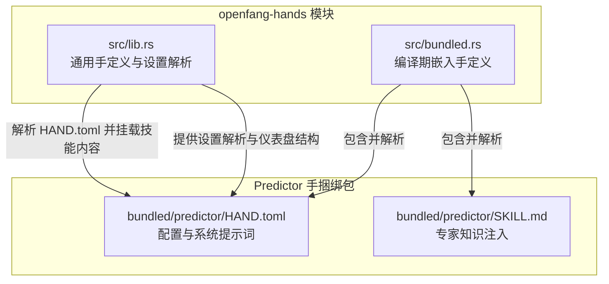
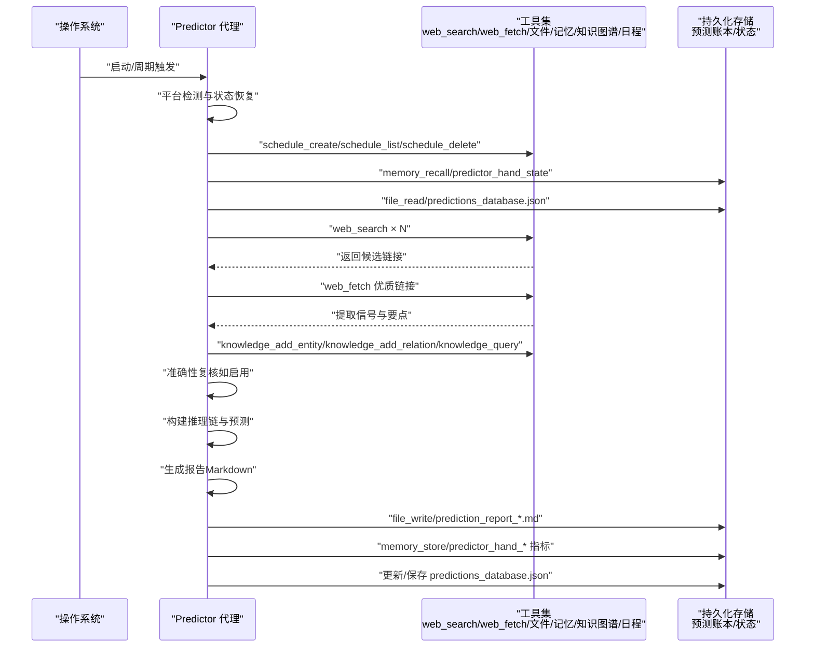
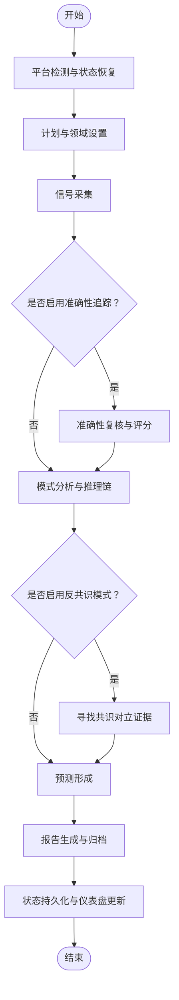
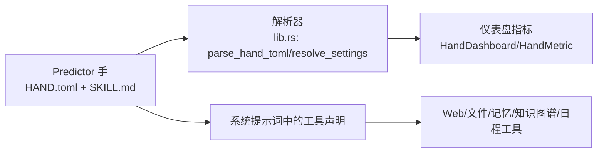

# Predictor 手（预测分析）

<cite>
**本文引用的文件**
- [HAND.toml](file://crates/openfang-hands/bundled/predictor/HAND.toml)
- [SKILL.md](file://crates/openfang-hands/bundled/predictor/SKILL.md)
- [lib.rs](file://crates/openfang-hands/src/lib.rs)
- [bundled.rs](file://crates/openfang-hands/src/bundled.rs)
</cite>

## 目录
1. [简介](#简介)
2. [项目结构](#项目结构)
3. [核心组件](#核心组件)
4. [架构总览](#架构总览)
5. [详细组件分析](#详细组件分析)
6. [依赖关系分析](#依赖关系分析)
7. [性能考量](#性能考量)
8. [故障排查指南](#故障排查指南)
9. [结论](#结论)
10. [附录](#附录)

## 简介
Predictor 手（预测分析）是一个面向未来的自主预测系统，其设计遵循“超级预测者”原则，通过收集信号、构建推理链、生成校准后的预测，并持续追踪准确度。它以“手（Hand）”的形式在平台上被激活与运行，具备自动化的周期性调度、知识图谱化信号管理、可配置的领域与时间范围、以及基于贝氏评分的准确性评估与校准反馈机制。

该系统强调以下关键点：
- 超级预测原则：问题拆分、内外视角平衡、增量更新、寻找对立力量、区分信号与噪声、校准、复盘、避免叙事陷阱、协作聚合。
- 信号分类与强度：定义了多种信号类型与强度评估规则，用于量化证据权重。
- 置信度校准：提供概率尺度与校准规则，避免极端置信度；使用贝氏评分作为客观指标。
- 推理链模板：标准化的“参考类（外视图）—具体证据（内视图）—综合—关键假设—决议标准”的结构化输出。
- 领域特定来源指南：针对科技、金融、地缘政治、气候等领域的权威数据源与研究路径。
- 自动化流程：从状态恢复、信号采集、准确性复核、模式分析、推理链构建、预测形成、报告生成到状态持久化。

## 项目结构
Predictor 手位于 openfang 的“手（Hands）”模块中，采用“捆绑包（bundled）”形式进行编译期嵌入与分发。其核心由两部分组成：
- HAND.toml：手的配置与系统提示词，定义可调参数、工具集、仪表盘指标与系统提示词。
- SKILL.md：专家知识注入，包含超级预测原则、信号分类、置信度校准、推理链模板、预测跟踪与评分、认知偏差检查清单、反共识模式等。

此外，openfang-hands 模块提供了通用的手定义解析、设置解析、仪表盘指标结构等基础设施，使 Predictor 手能够被正确加载、实例化与运行。

**图表来源**
- [lib.rs:320-366](file://crates/openfang-hands/src/lib.rs#L320-L366)
- [bundled.rs:5-49](file://crates/openfang-hands/src/bundled.rs#L5-L49)
- [HAND.toml:1-382](file://crates/openfang-hands/bundled/predictor/HAND.toml#L1-L382)
- [SKILL.md:1-273](file://crates/openfang-hands/bundled/predictor/SKILL.md#L1-L273)

**章节来源**
- [lib.rs:1-867](file://crates/openfang-hands/src/lib.rs#L1-L867)
- [bundled.rs:1-333](file://crates/openfang-hands/src/bundled.rs#L1-L333)
- [HAND.toml:1-382](file://crates/openfang-hands/bundled/predictor/HAND.toml#L1-L382)
- [SKILL.md:1-273](file://crates/openfang-hands/bundled/predictor/SKILL.md#L1-L273)

## 核心组件
- 手定义与设置解析
  - HAND.toml 中定义了手的标识、名称、描述、类别、图标、工具集、技能白名单、MCP 服务器白名单、要求项、可配置设置、代理配置与仪表盘指标。
  - 设置解析函数根据用户配置与默认值生成提示块与环境变量列表，供系统提示词注入与运行时访问。
- 专家知识注入（SKILL.md）
  - 提供超级预测原则、信号分类与强度、置信度校准与贝氏评分、推理链模板、预测跟踪与评分格式、认知偏差检查清单、反共识模式等。
- Predictor 手专属系统提示词
  - 包含平台检测与状态恢复、计划与领域设置、信号采集、准确性复核、模式分析与推理链、预测形成、报告生成、状态持久化等阶段化流程与指导原则。
- 仪表盘指标
  - 定义“已做预测数”“准确率”“报告生成数”“活跃预测数”等指标，便于可视化与监控。

**章节来源**
- [lib.rs:155-266](file://crates/openfang-hands/src/lib.rs#L155-L266)
- [lib.rs:268-296](file://crates/openfang-hands/src/lib.rs#L268-L296)
- [lib.rs:328-366](file://crates/openfang-hands/src/lib.rs#L328-L366)
- [bundled.rs:51-63](file://crates/openfang-hands/src/bundled.rs#L51-L63)
- [HAND.toml:168-382](file://crates/openfang-hands/bundled/predictor/HAND.toml#L168-L382)
- [SKILL.md:1-273](file://crates/openfang-hands/bundled/predictor/SKILL.md#L1-L273)

## 架构总览
Predictor 手的运行遵循“阶段化流水线”，结合外部工具（网络检索、网页抓取、文件读写、记忆存储/召回、知识图谱实体/关系管理、日程任务管理）与内部状态（预测账本、准确性数据、仪表盘统计），形成闭环的预测生命周期。

**图表来源**
- [HAND.toml:177-347](file://crates/openfang-hands/bundled/predictor/HAND.toml#L177-L347)
- [SKILL.md:187-234](file://crates/openfang-hands/bundled/predictor/SKILL.md#L187-L234)

## 详细组件分析

### 阶段化流程与处理逻辑
Predictor 手将预测工作流划分为若干阶段，每个阶段有明确的任务、输入与输出，确保可重复与可审计。

**图表来源**
- [HAND.toml:194-347](file://crates/openfang-hands/bundled/predictor/HAND.toml#L194-L347)
- [SKILL.md:266-273](file://crates/openfang-hands/bundled/predictor/SKILL.md#L266-L273)

**章节来源**
- [HAND.toml:194-347](file://crates/openfang-hands/bundled/predictor/HAND.toml#L194-L347)

### 数据处理与信号管理
- 信号类型与强度
  - 类型：先行指标、滞后指标、基准频率、专家意见、数据点、异常、结构性变化、情绪转变。
  - 强度：强、中、弱；强信号通常具备多源确认、量化数据、领先性与清晰因果机制。
- 信号标注
  - 类型、强度、方向（看涨/看跌/中性）、来源可信度（机构/媒体/个人/匿名）。
- 知识图谱集成
  - 将信号作为实体加入知识图谱，并与领域建立关系，支持后续查询与推理。

**章节来源**
- [SKILL.md:27-60](file://crates/openfang-hands/bundled/predictor/SKILL.md#L27-L60)
- [HAND.toml:225-231](file://crates/openfang-hands/bundled/predictor/HAND.toml#L225-L231)

### 置信度校准与评分
- 概率尺度与校准规则
  - 避免使用 0%/100%；默认从基准频率出发，依据具体证据进行小步调整；典型调整幅度：强信号 ±5-15%，中等信号 ±2-5%。
- 准确性指标
  - 贝氏评分：越低越好，完美为 0.0，随机猜测为 0.25，糟糕为 1.0；优秀预测者 <0.15，平均 0.20-0.30，糟糕 >0.35。
- 准确性复盘
  - 对到期预测进行证据检索，按“正确/部分正确/错误/不可判定”打分，计算贝氏评分与累计准确率，分析校准情况。

**章节来源**
- [SKILL.md:64-103](file://crates/openfang-hands/bundled/predictor/SKILL.md#L64-L103)
- [SKILL.md:187-234](file://crates/openfang-hands/bundled/predictor/SKILL.md#L187-L234)
- [HAND.toml:235-248](file://crates/openfang-hands/bundled/predictor/HAND.toml#L235-L248)

### 推理链构建与解释
- 模板结构
  - 参考类（外视图）：基准频率与历史类比。
  - 具体证据（内视图）：支持与反对信号及其权重。
  - 综合：起始概率、净调整、最终概率。
  - 关键假设：若假设不成立，概率如何变化。
  - 决议：何时、如何、在哪里确定结果。
- 反共识模式
  - 在存在共识的情况下，主动寻找反驳证据，形成对比预测，并明确标注共识与相反观点。

**章节来源**
- [SKILL.md:151-183](file://crates/openfang-hands/bundled/predictor/SKILL.md#L151-L183)
- [SKILL.md:266-273](file://crates/openfang-hands/bundled/predictor/SKILL.md#L266-L273)
- [HAND.toml:252-271](file://crates/openfang-hands/bundled/predictor/HAND.toml#L252-L271)

### 报告生成与归档
- 报告结构
  - 标题、日期、报告编号、分析信号数量。
  - 准确性仪表盘（总体准确率、贝氏评分、校准状态）。
  - 活跃预测表、新增预测明细、到期已决预测、信号概览、元分析（自身优劣势）。
- 归档与命名
  - 生成 Markdown 文件并保存至本地或持久化存储。

**章节来源**
- [HAND.toml:304-334](file://crates/openfang-hands/bundled/predictor/HAND.toml#L304-L334)
- [SKILL.md:213-234](file://crates/openfang-hands/bundled/predictor/SKILL.md#L213-L234)

### 状态持久化与仪表盘
- 持久化内容
  - 更新预测账本 JSON；保存手状态（最后运行时间、总预测数、准确率数据）；更新仪表盘指标（已做预测数、准确率、报告数、活跃预测数）。
- 仪表盘指标
  - 数字、百分比等格式化展示。

**章节来源**
- [HAND.toml:338-382](file://crates/openfang-hands/bundled/predictor/HAND.toml#L338-L382)
- [lib.rs:137-151](file://crates/openfang-hands/src/lib.rs#L137-L151)

### 配置参数与专家知识注入
- HAND.toml 中的可配置设置
  - 预测领域（科技/金融/地缘政治/气候/通用）
  - 时间范围（1 周/1 月/3 月/1 年）
  - 数据来源（新闻/社交/金融/学术/全部）
  - 报告频率（每日/每周/双周/每月）
  - 每报告预测数量（3/5/10/20）
  - 是否追踪准确率（开关）
  - 置信度阈值（低/中/高）
  - 反共识模式（开关）
- SKILL.md 中的专家知识
  - 超级预测原则、信号分类与强度、置信度校准、推理链模板、预测跟踪与评分、认知偏差检查清单、反共识模式。

**章节来源**
- [HAND.toml:10-164](file://crates/openfang-hands/bundled/predictor/HAND.toml#L10-L164)
- [SKILL.md:8-273](file://crates/openfang-hands/bundled/predictor/SKILL.md#L8-L273)

## 依赖关系分析
Predictor 手的实现依赖于 openfang-hands 的通用基础设施，包括：
- 手定义解析与设置解析：将 HAND.toml 解析为结构化定义，并注入专家知识内容。
- 工具与能力：系统提示词中声明所需工具（shell_exec、file_*、web_*、memory_*、knowledge_*、schedule_*），用于执行信号采集、存储与报告生成。
- 仪表盘指标：定义内存键与格式，用于展示预测表现。

**图表来源**
- [lib.rs:314-326](file://crates/openfang-hands/src/lib.rs#L314-L326)
- [lib.rs:209-266](file://crates/openfang-hands/src/lib.rs#L209-L266)
- [lib.rs:268-296](file://crates/openfang-hands/src/lib.rs#L268-L296)
- [bundled.rs:51-63](file://crates/openfang-hands/src/bundled.rs#L51-L63)
- [HAND.toml:6-382](file://crates/openfang-hands/bundled/predictor/HAND.toml#L6-L382)

**章节来源**
- [lib.rs:314-326](file://crates/openfang-hands/src/lib.rs#L314-L326)
- [lib.rs:209-266](file://crates/openfang-hands/src/lib.rs#L209-L266)
- [lib.rs:268-296](file://crates/openfang-hands/src/lib.rs#L268-L296)
- [bundled.rs:51-63](file://crates/openfang-hands/src/bundled.rs#L51-L63)
- [HAND.toml:6-382](file://crates/openfang-hands/bundled/predictor/HAND.toml#L6-L382)

## 性能考量
- 信号采集规模控制
  - 控制每轮搜索查询数量（20-40），避免过度抓取导致资源浪费与噪声增加。
- 工具调用成本
  - 合理使用 web_search/web_fetch，优先筛选高质量链接；对重复内容进行去重与缓存。
- 存储与索引
  - 使用知识图谱进行信号实体化与关系化，提升查询效率与推理质量。
- 报告生成批处理
  - 将预测形成与报告生成合并为周期性任务，减少频繁 IO。
- 仪表盘指标更新
  - 仅在必要时更新内存键，避免高频写入。

## 故障排查指南
- 手未激活或状态异常
  - 检查 HAND.toml 中的工具声明与系统提示词是否匹配当前运行环境；确认 schedule_* 工具可用。
- 置信度过高或过低
  - 回到 SKILL.md 的校准规则，确保从基准频率出发，依据具体证据进行小步调整。
- 报告缺失或格式异常
  - 检查报告生成阶段的文件写入权限与命名规范；确认 predictions_database.json 结构符合预期。
- 准确性追踪无效
  - 确认“追踪准确率”设置开启；检查到期预测的证据检索与评分逻辑。
- 反共识模式无输出
  - 确认“反共识模式”已启用；检查是否存在共识预测，以及是否成功检索到反驳证据。

**章节来源**
- [HAND.toml:168-382](file://crates/openfang-hands/bundled/predictor/HAND.toml#L168-L382)
- [SKILL.md:64-103](file://crates/openfang-hands/bundled/predictor/SKILL.md#L64-L103)
- [SKILL.md:187-234](file://crates/openfang-hands/bundled/predictor/SKILL.md#L187-L234)

## 结论
Predictor 手通过系统化的方法论与工具链，实现了从信号采集到推理链构建再到预测报告与准确性追踪的全生命周期管理。其设计强调“超级预测原则”与“校准”，辅以专家知识注入与仪表盘可视化，既保证了可操作性，也提升了可解释性与可审计性。通过合理配置与持续优化，可在科技、金融、地缘政治、气候等多个领域提供稳健的预测服务。

## 附录
- 实际使用案例建议
  - 科技领域：关注产品路线图、招聘与专利数据，结合基准频率与市场动态形成预测。
  - 金融领域：结合宏观数据、公司财报与分析师观点，构建贝叶斯更新的预测。
  - 地缘政治：利用官方声明、智库分析与贸易数据，识别冲突与政策变化的风险。
  - 气候领域：结合科学数据、能源转型与企业披露，评估政策与技术突破的影响。
- 常见问题与优化建议
  - 问题：信号噪声大
    - 建议：提高“数据来源”中“学术/金融/新闻”的权重，降低“社交”占比；强化信号强度评估。
  - 问题：预测过于乐观/悲观
    - 建议：启用“反共识模式”，主动寻找对立证据；降低置信度阈值以纳入更多预测。
  - 问题：准确性长期偏低
    - 建议：检查基准频率与历史类比是否合理；加强认知偏差检查；定期复盘并调整模型权重。