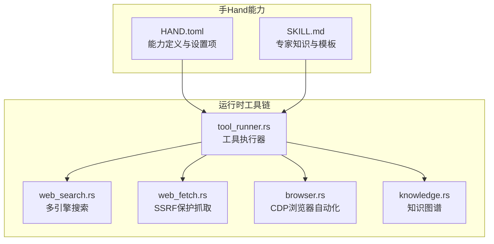
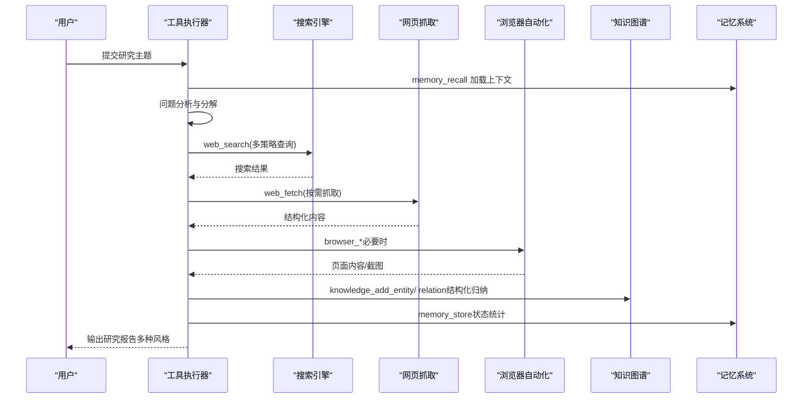
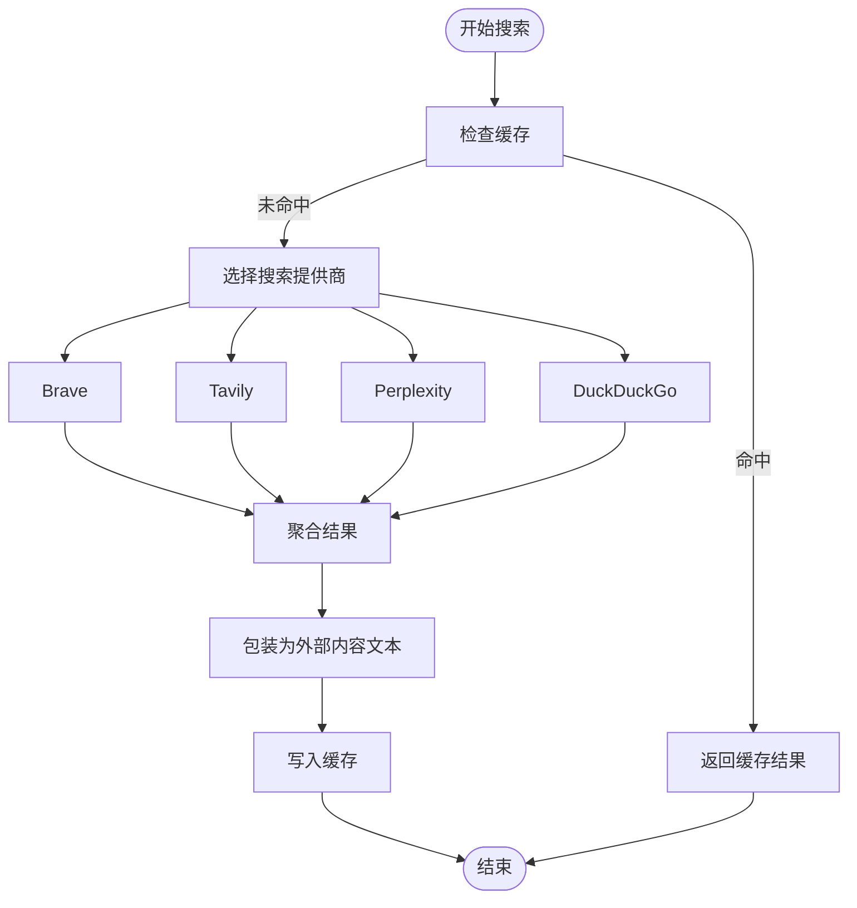
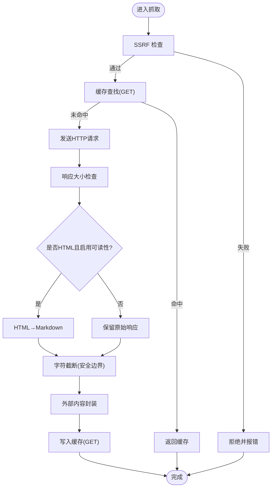
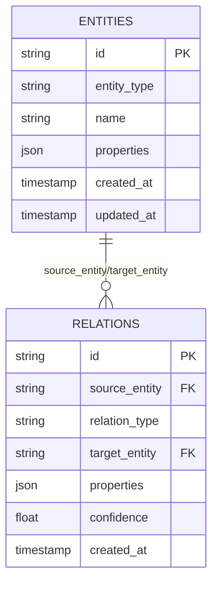
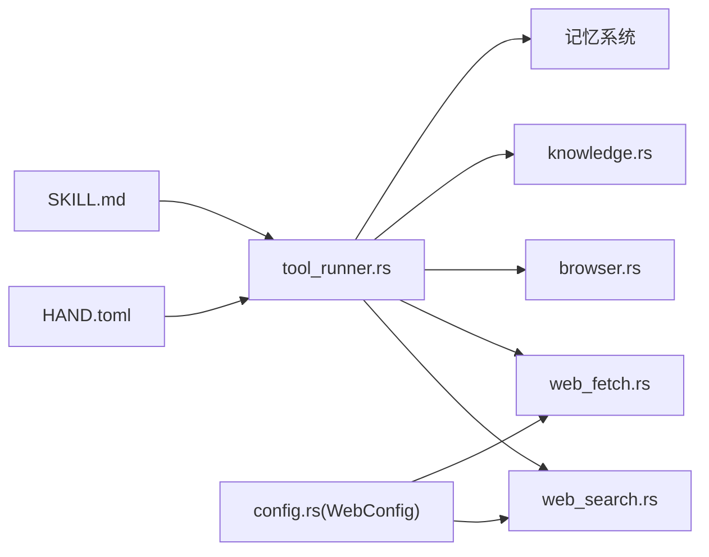

# Researcher 手（深度研究）

<cite>
**本文档引用的文件**
- [HAND.toml](file://crates/openfang-hands/bundled/researcher/HAND.toml)
- [SKILL.md](file://crates/openfang-hands/bundled/researcher/SKILL.md)
- [agent.toml](file://agents/researcher/agent.toml)
- [web_search.rs](file://crates/openfang-runtime/src/web_search.rs)
- [web_fetch.rs](file://crates/openfang-runtime/src/web_fetch.rs)
- [tool_runner.rs](file://crates/openfang-runtime/src/tool_runner.rs)
- [browser.rs](file://crates/openfang-runtime/src/browser.rs)
- [knowledge.rs](file://crates/openfang-memory/src/knowledge.rs)
- [bundled.rs](file://crates/openfang-hands/src/bundled.rs)
- [config.rs](file://crates/openfang-types/src/config.rs)
</cite>

## 目录
1. [简介](#简介)
2. [项目结构](#项目结构)
3. [核心组件](#核心组件)
4. [架构总览](#架构总览)
5. [详细组件分析](#详细组件分析)
6. [依赖关系分析](#依赖关系分析)
7. [性能考量](#性能考量)
8. [故障排查指南](#故障排查指南)
9. [结论](#结论)
10. [附录](#附录)

## 简介
本文件面向“Researcher 手（深度研究）”能力，系统阐述其设计理念、研究策略、信息收集与处理流程、报告生成机制，以及与系统其他模块的集成方式。文档同时覆盖 HAND.toml 配置参数、SKILL.md 专家知识注入要点、搜索引擎与网页抓取链路、知识图谱构建、输出样式与引用格式、研究流程自动化与质量评估、实际使用案例与性能优化建议。

## 项目结构
Researcher 手由“手（Hand）”能力包提供，包含 HAND.toml（能力定义与可调参数）、SKILL.md（专家知识与模板）、以及在运行时通过工具链完成搜索、抓取、记忆与知识图谱操作。其核心运行路径如下：
- 能力定义：crates/openfang-hands/bundled/researcher/HAND.toml
- 专家知识：crates/openfang-hands/bundled/researcher/SKILL.md
- 运行时工具链：web_search、web_fetch、browser、memory/knowledge、tool_runner
- 集成入口：crates/openfang-hands/src/bundled.rs 将 HAND 内容编译进运行时

图表来源
- [HAND.toml:1-398](file://crates/openfang-hands/bundled/researcher/HAND.toml#L1-L398)
- [SKILL.md:1-328](file://crates/openfang-hands/bundled/researcher/SKILL.md#L1-L328)
- [web_search.rs:1-468](file://crates/openfang-runtime/src/web_search.rs#L1-L468)
- [web_fetch.rs:1-378](file://crates/openfang-runtime/src/web_fetch.rs#L1-L378)
- [browser.rs:1-800](file://crates/openfang-runtime/src/browser.rs#L1-L800)
- [tool_runner.rs:90-400](file://crates/openfang-runtime/src/tool_runner.rs#L90-L400)
- [knowledge.rs:1-355](file://crates/openfang-memory/src/knowledge.rs#L1-L355)

章节来源
- [HAND.toml:1-398](file://crates/openfang-hands/bundled/researcher/HAND.toml#L1-L398)
- [SKILL.md:1-328](file://crates/openfang-hands/bundled/researcher/SKILL.md#L1-L328)
- [bundled.rs:1-333](file://crates/openfang-hands/src/bundled.rs#L1-L333)

## 核心组件
- 能力定义与设置项（HAND.toml）
  - 可配置项涵盖研究深度、输出风格、来源验证、最大来源数、自动跟进、日志保存、引用格式、语言等
  - 提供系统提示词（system prompt），定义五阶段研究流程与报告模板
- 专家知识（SKILL.md）
  - 研究方法论、CRAAP 框架、查询优化、交叉验证、合成模式、引用格式模板、认知偏差提醒、领域研究技巧
- 搜索与抓取（web_search.rs、web_fetch.rs）
  - 多引擎搜索（Brave/Tavily/Perplexity/DuckDuckGo，支持自动回退）
  - 抓取链路包含 SSRF 防护、HTML→Markdown 转换、缓存、大小截断与外部内容标记
- 浏览器自动化（browser.rs）
  - 基于 CDP 的原生浏览器会话管理，支持导航、点击、输入、截图、读页、滚动、等待与后退
- 工具执行器（tool_runner.rs）
  - 统一工具分发，执行 web_search/web_fetch/browser_*、memory_store/recall、knowledge_*、schedule_* 等
- 知识图谱（knowledge.rs）
  - 实体与关系存储、查询与匹配，支撑跨源交叉引用与结构化归纳

章节来源
- [HAND.toml:10-398](file://crates/openfang-hands/bundled/researcher/HAND.toml#L10-L398)
- [SKILL.md:10-328](file://crates/openfang-hands/bundled/researcher/SKILL.md#L10-L328)
- [web_search.rs:1-468](file://crates/openfang-runtime/src/web_search.rs#L1-L468)
- [web_fetch.rs:1-378](file://crates/openfang-runtime/src/web_fetch.rs#L1-L378)
- [browser.rs:1-800](file://crates/openfang-runtime/src/browser.rs#L1-L800)
- [tool_runner.rs:90-400](file://crates/openfang-runtime/src/tool_runner.rs#L90-L400)
- [knowledge.rs:1-355](file://crates/openfang-memory/src/knowledge.rs#L1-L355)

## 架构总览
Researcher 手以“系统提示词 + 专家知识 + 工具链”的组合实现端到端研究闭环：先进行问题分析与分解，再构造多策略搜索，抓取与评估来源，交叉验证与合成，最终生成结构化报告，并沉淀到记忆与知识图谱中。

图表来源
- [tool_runner.rs:90-400](file://crates/openfang-runtime/src/tool_runner.rs#L90-L400)
- [web_search.rs:44-102](file://crates/openfang-runtime/src/web_search.rs#L44-L102)
- [web_fetch.rs:40-166](file://crates/openfang-runtime/src/web_fetch.rs#L40-L166)
- [browser.rs:394-664](file://crates/openfang-runtime/src/browser.rs#L394-L664)
- [knowledge.rs:27-80](file://crates/openfang-memory/src/knowledge.rs#L27-L80)
- [HAND.toml:165-376](file://crates/openfang-hands/bundled/researcher/HAND.toml#L165-L376)

## 详细组件分析

### 设计理念与研究策略
- 研究过程五阶段
  - 平台检测与上下文加载
  - 问题分析与子问题分解
  - 多策略搜索构建
  - 信息收集与来源评估（CRAAP）
  - 交叉验证与合成、事实核查、报告生成
- 研究深度与输出风格
  - 深度：快速/彻底/穷举；来源上限：10/30/50/无限制
  - 输出：简要、详细、学术、高管摘要
  - 引用：内联URL、脚注、APA、编号参考文献
  - 语言：英语/西班牙语/法语/德语/中文/日语/自动检测
- 自动化与可观察性
  - 自动跟进发现的延伸问题
  - 可选保存研究日志
  - 仪表盘指标：已解决查询、引用来源数、生成报告数、活跃调查数

章节来源
- [HAND.toml:10-153](file://crates/openfang-hands/bundled/researcher/HAND.toml#L10-L153)
- [HAND.toml:165-376](file://crates/openfang-hands/bundled/researcher/HAND.toml#L165-L376)
- [SKILL.md:10-183](file://crates/openfang-hands/bundled/researcher/SKILL.md#L10-L183)

### 搜索引擎集成与查询优化
- 多引擎与自动回退
  - 支持 Brave、Tavily、Perplexity、DuckDuckGo；Auto 模式按可用密钥优先级回退
  - 搜索结果统一包装为外部内容文本，便于后续处理
- 查询优化与策略
  - 直接查询、权威站点查询、对比查询、时间性查询、深度查询
  - 多策略组合，结合语言设置进行本地化搜索
- 缓存与去重
  - 搜索结果按 query+max_results 做缓存键，命中直接返回

图表来源
- [web_search.rs:44-102](file://crates/openfang-runtime/src/web_search.rs#L44-L102)
- [web_search.rs:104-315](file://crates/openfang-runtime/src/web_search.rs#L104-L315)
- [config.rs:164-282](file://crates/openfang-types/src/config.rs#L164-L282)

章节来源
- [web_search.rs:1-468](file://crates/openfang-runtime/src/web_search.rs#L1-L468)
- [config.rs:164-282](file://crates/openfang-types/src/config.rs#L164-L282)
- [SKILL.md:88-119](file://crates/openfang-hands/bundled/researcher/SKILL.md#L88-L119)

### 网页内容提取与安全抓取
- SSRF 防护
  - 在发起网络请求前对 URL 进行主机名与 IP 白名单/黑名单校验，阻断私有/元数据地址
- 可读性提取
  - 对 HTML 响应进行可读性转换为 Markdown，非 GET 或非 HTML 则保留原始响应
- 安全与限流
  - 限制响应大小、字符截断、缓存仅针对 GET 请求
- 外部内容标记
  - 统一封装抓取结果，便于溯源与后续处理

图表来源
- [web_fetch.rs:40-166](file://crates/openfang-runtime/src/web_fetch.rs#L40-L166)
- [web_fetch.rs:185-282](file://crates/openfang-runtime/src/web_fetch.rs#L185-L282)

章节来源
- [web_fetch.rs:1-378](file://crates/openfang-runtime/src/web_fetch.rs#L1-L378)

### 浏览器自动化（可选）
- CDP 连接与会话管理
  - 启动 Chromium，解析调试端点，建立页面会话，启用 Page/Runtime 域
- 常用操作
  - 导航、点击、输入、截图、读取页面、滚动、等待元素、后退
- 安全与限制
  - 单会话、超时控制、命令超时、会话空闲清理

章节来源
- [browser.rs:1-800](file://crates/openfang-runtime/src/browser.rs#L1-L800)

### 信息分类整理与知识图谱
- 实体与关系
  - 实体：名称、类型、属性、时间戳
  - 关系：源实体、关系类型、目标实体、置信度、属性、时间戳
- 图查询
  - 支持按源/关系/目标过滤的三元组查询，返回匹配集
- 研究应用
  - 将关键概念、人物、组织、数据点作为实体，将证据间关系建模为关系，支撑跨源交叉引用与归纳

图表来源
- [knowledge.rs:15-196](file://crates/openfang-memory/src/knowledge.rs#L15-L196)

章节来源
- [knowledge.rs:1-355](file://crates/openfang-memory/src/knowledge.rs#L1-L355)

### 报告生成机制与引用格式
- 报告风格
  - 简要：摘要+关键来源
  - 详细：摘要+背景+方法+发现+分析+矛盾与开放问题+引用
  - 学术：论文式结构（摘要/引言/方法/发现/讨论/结论/参考文献）
  - 高管：要点+建议+风险+来源
- 引用格式
  - 内联URL、脚注、APA、编号参考文献
- 文件命名与持久化
  - 生成研究文件，按问题与日期命名，便于归档与检索

章节来源
- [HAND.toml:284-348](file://crates/openfang-hands/bundled/researcher/HAND.toml#L284-L348)
- [SKILL.md:186-220](file://crates/openfang-hands/bundled/researcher/SKILL.md#L186-L220)

### 研究流程自动化与质量评估
- 自动化
  - 自动跟进发现的延伸问题；自动保存研究日志（可选）
  - 仪表盘指标自动更新：已解决查询、引用来源数、生成报告数、活跃调查数
- 质量评估
  - CRAAP 框架评分（权威/相关/准确/目的/时效）
  - 事实核查：关键声明二次检索、官方数据核对、已知更正标注
  - 置信度分级：已验证/可能/未验证/争议

章节来源
- [HAND.toml:246-282](file://crates/openfang-hands/bundled/researcher/HAND.toml#L246-L282)
- [SKILL.md:45-84](file://crates/openfang-hands/bundled/researcher/SKILL.md#L45-L84)
- [SKILL.md:122-148](file://crates/openfang-hands/bundled/researcher/SKILL.md#L122-L148)

### 实际使用案例与最佳实践
- 主题选择与关键词优化
  - 使用精确短语、站点限定、排除无关词、文件类型限定、近期限定、布尔/OR/通配符
- 数据验证方法
  - 多源交叉验证、权威来源优先、注意时效性与偏见、标注不确定性
- 研究流程建议
  - 先分解子问题，再多策略搜索，抓取前先评估，交叉验证后再合成

章节来源
- [SKILL.md:88-119](file://crates/openfang-hands/bundled/researcher/SKILL.md#L88-L119)
- [SKILL.md:122-183](file://crates/openfang-hands/bundled/researcher/SKILL.md#L122-L183)

## 依赖关系分析
- 能力与工具链耦合
  - HAND.toml 定义工具集（web_search/web_fetch/memory/knowledge/schedule/event_publish），tool_runner 按能力清单执行
- 搜索与抓取依赖
  - web_search 依赖配置（SearchProvider、API Key 环境变量、缓存）
  - web_fetch 依赖 SSRF 检查、缓存、可读性转换
- 浏览器与工具链
  - browser.rs 通过 tool_runner 的浏览器工具接口被调用
- 记忆与知识图谱
  - memory_recall/store 与 knowledge_* 用于状态与结构化归纳

图表来源
- [tool_runner.rs:90-400](file://crates/openfang-runtime/src/tool_runner.rs#L90-L400)
- [web_search.rs:1-468](file://crates/openfang-runtime/src/web_search.rs#L1-L468)
- [web_fetch.rs:1-378](file://crates/openfang-runtime/src/web_fetch.rs#L1-L378)
- [browser.rs:1-800](file://crates/openfang-runtime/src/browser.rs#L1-L800)
- [knowledge.rs:1-355](file://crates/openfang-memory/src/knowledge.rs#L1-L355)
- [config.rs:181-282](file://crates/openfang-types/src/config.rs#L181-L282)

章节来源
- [tool_runner.rs:90-400](file://crates/openfang-runtime/src/tool_runner.rs#L90-L400)
- [config.rs:164-282](file://crates/openfang-types/src/config.rs#L164-L282)

## 性能考量
- 搜索性能
  - 启用缓存（默认15分钟），减少重复请求；Auto 模式优先使用高吞吐 API（如 Tavily/Brave）
- 抓取性能
  - GET 请求缓存、响应大小限制、字符截断避免内存膨胀
- 浏览器性能
  - 单会话、超时控制、窗口尺寸与无头模式可调
- 并发与资源
  - 工具执行器按能力清单与权限控制工具调用，避免不必要的并发

[本节为通用指导，无需特定文件引用]

## 故障排查指南
- 搜索失败
  - 检查对应 API Key 环境变量是否配置；查看 Auto 回退日志；确认网络可达
- 抓取被拒
  - SSRF 检查：确保 URL 为 http/https，且不指向私有/元数据地址
  - 响应过大：调整 max_response_bytes 或 max_chars
- 浏览器无法启动
  - 确认 Chromium/Chrome 可执行路径与安装；检查 CHROME_PATH 环境变量
- 工具权限不足
  - 检查 agent 能力清单中的 tools 列表与 kernel 的能力授予
- 引用格式异常
  - 确认 citation_style 设置与输出风格匹配；APA 需遵循作者/年份/标题/来源规范

章节来源
- [web_search.rs:44-102](file://crates/openfang-runtime/src/web_search.rs#L44-L102)
- [web_fetch.rs:185-282](file://crates/openfang-runtime/src/web_fetch.rs#L185-L282)
- [browser.rs:236-392](file://crates/openfang-runtime/src/browser.rs#L236-L392)
- [tool_runner.rs:122-134](file://crates/openfang-runtime/src/tool_runner.rs#L122-L134)

## 结论
Researcher 手通过系统化的研究流程、多引擎搜索与安全抓取、可读性内容提取、知识图谱结构化归纳与多种报告风格，实现了从问题分解到报告生成的全流程自动化。借助 HAND.toml 的可配置项与 SKILL.md 的专家知识，用户可在不同深度与风格下获得高质量的研究成果，并可持续沉淀到记忆与知识图谱中，形成可复用的知识资产。

[本节为总结性内容，无需特定文件引用]

## 附录

### HAND.toml 关键设置项速览
- 研究深度：快速/彻底/穷举
- 输出风格：简要/详细/学术/高管摘要
- 来源验证：开关
- 最大来源数：10/30/50/无限制
- 自动跟进：开关
- 保存研究日志：开关
- 引用格式：内联URL/脚注/APA/编号
- 语言：英语/西班牙语/法语/德语/中文/日语/自动检测

章节来源
- [HAND.toml:10-153](file://crates/openfang-hands/bundled/researcher/HAND.toml#L10-L153)

### SKILL.md 专家知识要点
- 研究方法论：定义/搜索/评估/合成/验证
- CRAAP 评估框架与评分
- 查询优化技术与多策略搜索
- 交叉验证与矛盾化解
- 合成模式与缺口分析
- 引用格式模板与注意事项
- 认知偏差与领域研究技巧

章节来源
- [SKILL.md:10-328](file://crates/openfang-hands/bundled/researcher/SKILL.md#L10-L328)